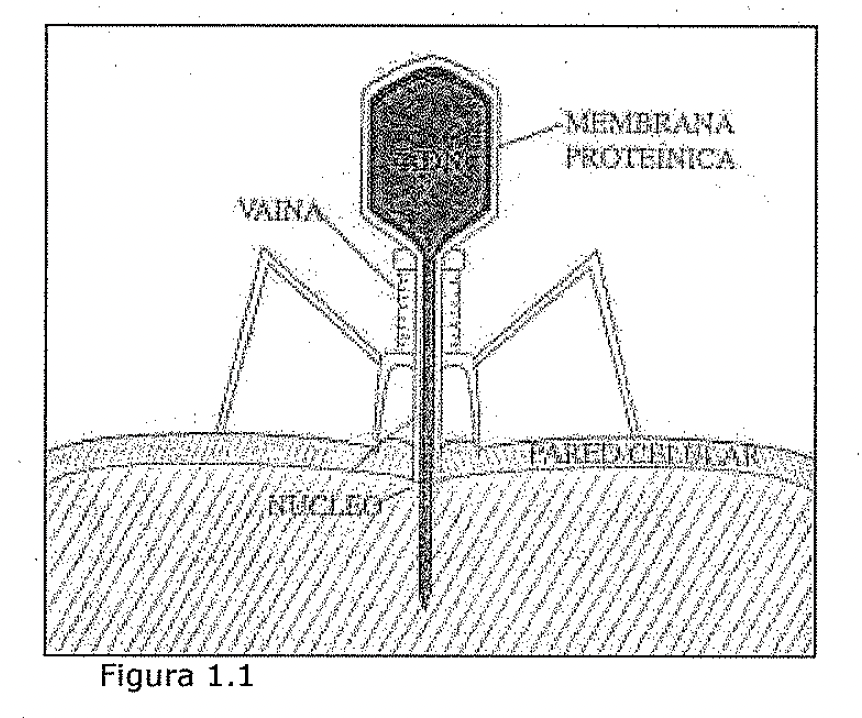
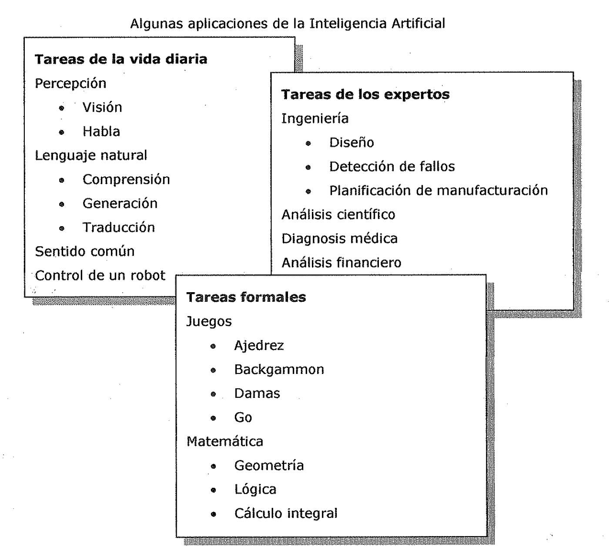
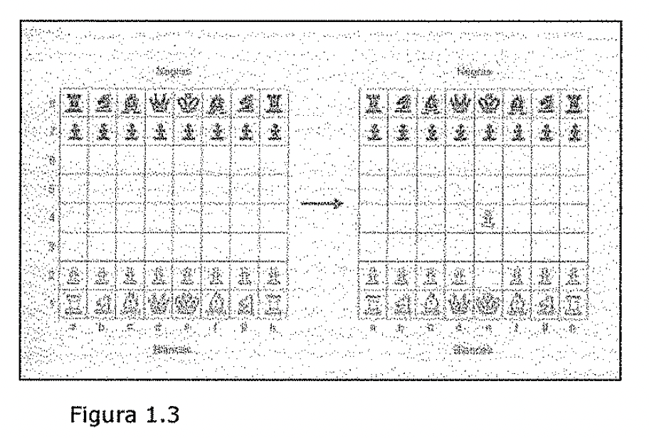
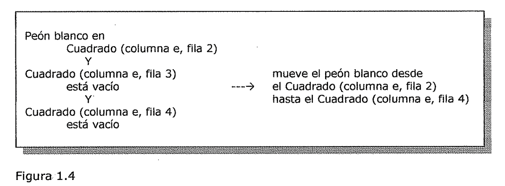
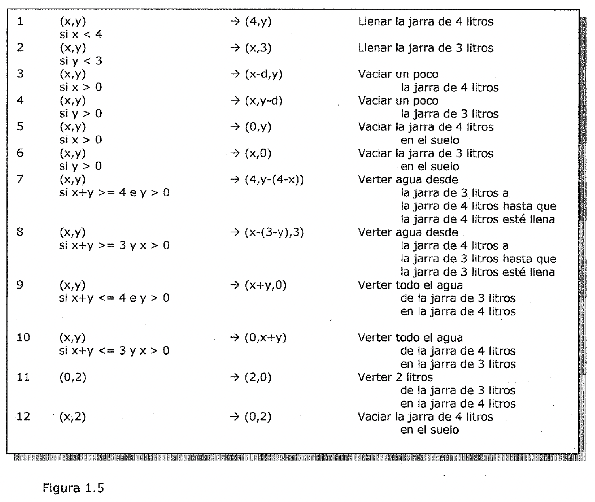
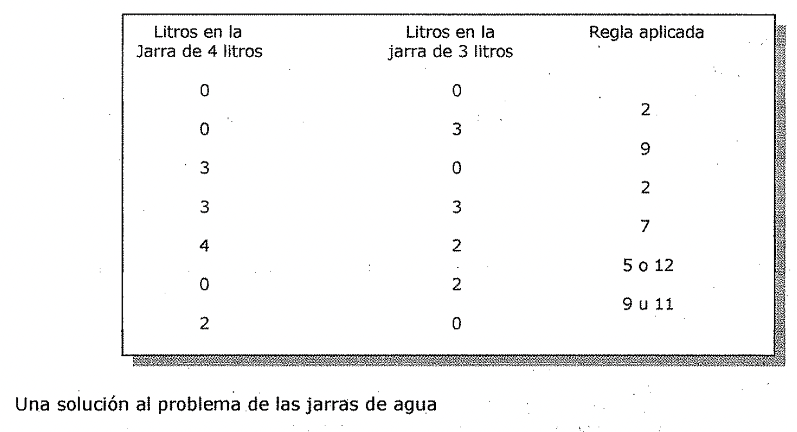

# Espacio de búsqueda y descripción formal de problemas
<!-- cspell:words Haemophilus influenzae Fleischmann Searle Weizenbaum Haugeland Maes Kaelbling Rosenschein Gelernter Gottfried Gottlieb Frege Begriffsschrift Cordell Kleene Penrose McCulloch Rosenblatt subsimbólico subsimbólica subsimbólicas multidimensionales axiomatización coeditaron cognología perceptrones -->

## ¿Qué es la Inteligencia Artificial?

La Inteligencia Artificial (IA), en una definición amplia y un tanto circular,
tiene por objeto el estudio del comportamiento inteligente en las máquinas. A su
vez, el comportamiento inteligente supone percibir, razonar, aprender,
comunicarse y actuar en entornos complejos.

- Una de las metas a largo plazo de la IA es el desarrollo de máquinas que
  puedan hacer

todas estas cosas igual, o quizá incluso mejor, que los humanos.

- Otra meta de la IA es llegar a comprender este tipo de comportamiento, sea en
  las

máquinas, en los humanos o en otros animales.

Por tanto, la IA persigue al mismo tiempo metas científicas y metas de
ingeniería.

La IA ha estado siempre rodeada de controversia. La cuestión básica de la IA
**¿Pueden** **pensar las máquinas?** ha interesado tanto a filósofos como a
científicos e ingenieros. En un famoso artículo, Alan Turing, uno de los
fundadores de la informática, expresó esta misma cuestión, pero formulada en
términos más adecuados para su comprobación empírica. Es lo que se ha dado en
llamar el *Test de Turing* [@turing1950computing]. Describiremos este test un
poco más adelante, en esta misma sección, pero primero es importante destacar lo
que ya observara Turing: que la respuesta a la pregunta ¿Pueden pensar las
máquinas? depende de cómo definamos las palabras *máquinas* y *pensar.* Turing
podría haber añadido que la respuesta depende también de cómo se defina la
palabra *pueden.*

### Pueden

Consideremos primero la palabra *pueden,* ¿Queremos decir que las máquinas
pueden pensar ya ahora, o que algún día podrán pensar? ¿Queremos decir que las
máquinas podrían ser capaces de pensar, en principio (incluso aunque nunca
lleguemos a construir ninguna que lo haga), o lo que perseguimos es una
implementación real de una máquina pensante? Estas cuestiones son realmente
importantes puesto que todavía no disponemos de ninguna máquina que posea
amplias habilidades pensantes.

Algunas personas creen que las máquinas pensantes tendrían que ser tan
complejas, y disponer de una experiencia tan compleja (por ejemplo,
interaccionando con el entorno o con otras máquinas pensantes), que nunca
seremos capaces de diseñarlas o construirlas. Una *buena analogía* nos la
proporcionan *los procesos que regulan el clima global del planeta:* incluso
aunque conociésemos todo lo que es importante acerca de estos procesos, este
conocimiento no nos capacitaría necesariamente para duplicar el clima en toda su
riqueza.

Ningún sistema menos complejo que el formado por la superficie de la tierra, la
atmósfera y los océanos - embebido en un espacio interplanetario, calentado por
el sol e influenciado por las mareas - sería capaz de duplicar los fenómenos
climáticos con todo detalle. De forma similar, la *inteligencia de nivel
humano,* a escala real, podría ser *demasiado compleja,* o al menos demasiado
dependiente de la fisiología humana, para existir fuera de su encarnación en
seres humanos inmersos en su entorno. La cuestión de si alguna vez seremos
capaces, o no, de construir máquinas pensantes de nivel humano no admite aún una
respuesta definitiva. El progreso de la IA hacia esta meta ha sido constante,
aunque más lento de lo que algunos pioneros del tema habían predicho.
Personalmente, soy optimista sobre nuestro eventual éxito en esta empresa.

### Máquinas

Consideremos ahora la palabra *máquina.* Para mucha gente, una máquina es
todavía un artefacto más bien estúpido. La palabra evoca imágenes de engranajes
rechinando, de chorros de vapor siseando y de piezas de acero martilleando.
¿Cómo podría llegar a pensar una cosa como esa? Sin embargo, hoy en día, los
ordenadores han ampliado en gran medida nuestra noción de lo que una máquina
puede ser, y nuestra creciente comprensión de los mecanismos biológicos esta
expandiéndose incluso más aun. • *Consideremos,* por ejemplo, *un virus simple,*
como el denominado *Bacteriófago Eó,* mostrado esquemáticamente en la Figura
1.1. Su cabeza contiene ADN vírico. Este virus es capaz de adherirse a la pared
celular de una bacteria mediante las fibras de su cola, pinchar la pared e
inyectar su ADN en ella. Este ADN hace que la bacteria fabrique millares de
copias de cada una de las piezas del virus. Después, las piezas se ensamblan
automáticamente ellas mismas, formando nuevos virus que salen de la bacteria
para repetir el proceso. El ensamblaje completo se parece mucho al de una
máquina, por lo que podríamos, con toda propiedad, decir que se trata de una
máquina - *una máquina hecha de proteínas.* Pero ¿qué ocurre con otros procesos
y organismos biológicos? El genoma completo de la bacteria Haemophilus
influenzae Rd ha sido secuenciado recientemente (Fleischmann, 1995).• Este
genoma consta de 1.830.137 pares de bases (identificadas con las letras A, G, Cy
T).

Esto equivale, aproximadamente, a 3,6 x 106 bits, es decir, casi medio megabyte.
Aunque todavía no se conoce la función de todos y cada uno de sus 1.743 genes,
los científicos están comenzando a explicar el desarrollo y el funcionamiento de
este organismo en los mismos términos en los que explicarían una máquina, - una
máquina muy compleja,•desde luego. De hecho, hay técnicas que son muy.
familiares a los informáticos, tales como el uso de cronogramas para los
circuitos lógicos, que están demostrando ser útiles. para entender como los
genes regulan los complejos procesos bioquímicos de un virus que infecta a
bacterias McAdams y Shapiro, 1995).

La secuenciación de los genomas completos de otros organismos, incluyendo el
*genoma* humano,\* está en curso o completada. Una vez que conozcamos estas
"marcas", c'.pensaríamos en estos organismos - bacterias, gusanos, moscas,
ratones, delfines, humanos - como máquinas? ¿Si los humanos fuesen máquinas,
entonces es que las máquinas pueden pensar!

\*\* Tendríamos una demostración de su existencia. Lo que ocurre, "simplemente",
es· que *no conocemos aún coma funciona la máquina humana,* Sin embargo, aunque
estuviésemos de acuerdo acerca de lo que es una máquina, este último I argumento
es rebatible. Aunque una máquina hecha de proteínas puede pensar, quizá una
hecha de silicio no sería capaz de hacerlo. Un conocido filósofo, John Searle,
cree que la materia de la que estamos hechos es fundamental para la inteligencia
[@searle1980minds; @searle1992rediscovery]. Para el, el pensamiento solo puede
ocurrir en máquinas muy especiales - *las máquinas vivientes hechas de
proteínas.* La *hipótesis de/ sistema físico de símbolos* de Newell y Simon
(Newell /Simon, 1976) está en oposición directa a las creencias de Searle (y a
la noción de encarnación mencionada anteriormente). Esta hipótesis establece.
que *un sistema físico de símbolos dispone de los medios necesarios y
suficientes para desarrollar una actividad general inteligente.* De acuerdo con
Newell y Simon, un Sistema físico de símbolos es una máquina, tal como un
ordenador digital, que es capaz de manipular datos simbólicos - sumar números,•
reordenar listas de símbolos (por ejemplo, ordenar alfabéticamente una lista de
nombres), reemplazar algunos símbolos por otros, etc. Un aspecto importante de
esta hipótesis es que no importa de que este hecho el sistema físico de
símbolos. Decimos que la hipótesis de Newell y Simon es I "neutral respecto al
sustrato".

*Una entidad inteligente podría estar hecha de proteínas, de relés mecánicos, de
transistores, o* *de cualquier otra cosa, con tal de que sea capaz de procesar
símbolos.* • Otros pensadores creen que no es realmente importante que las
máquinas estén hechas de silicio o de proteínas; piensan que el comportamiento
inteligente es, en su mayor parte, el resultado de lo que ellos llaman
*procesamiento subsimbólico,* es decir, *procesamiento de* *señales,* no de
símbolos. Consideremos, por ejemplo, el reconocimiento de rostros familiares.
Los humanos hacemos esto sin esfuerzo alguno, y aunque no se sabe exactamente
como lo hacemos, se sospecha que la mejor explicación para el proceso es la que
se basa en el tratamiento de imágenes, o de partes de ellas, como señales
multidimensionales, no como símbolos.

Podríamos citar muchos otros puntos de vista sobre el tipo de máquinas que
podrían ser capaces de desarrollar habilidades pensantes como las de los
humanos. Algunas de las hipótesis que se oyen a menudo son las siguientes:

- El cerebro *procesa la información en paralelo,* mientras que los ordenadores
  convencionales lo hacen *secuencialmente.* Por tanto, tenemos que construir
  nuevas C variedades de ordenadores paralelos para realizar progresos en la IA.

- La maquinaria computacional convencional está basada en la *lógica binaria*
  (verdadero o falso). Por tanto, los sistemas realmente inteligentes tendrán
  que usar algún tipo de

*lógica borrosa.*

- Las neuronas animales son mucho más complejas que simples conmutadores - los
  bloques constructivos básicos de los ordenadores actuales -. Por tanto,
  necesitaremos *neuronas artificiales verdaderamente realistas* para construir
  máquinas inteligentes.

Quizá es aún demasiado pronto para que se alcance un consenso en el campo de la
IA sobre el tipo de maquinaria requerida, aunque muchos investigadores aceptan
ya la hipótesis del sistema físico de símbolos.

### Pensar

Finalmente, llegamos a la palabra más difícil: *pensar.* En lugar de intentar
definir esta palabra, Turing propuso un test, el llamado *Test de Turing,*
mediante el cuál pudiera decidirse si una máquina particular es o no
inteligente. El test fue descrito originalmente como un juego.

Citemos del articulo de Turing \[@turing1950computing\]:

En el juego participan tres personas, un hombre (A), una mujer (B) y un
interrogador C), que puede ser de cualquier sexo. El interrogador permanece en
una sala, separado de los otros dos, pero pudiendo comunicarse con ellos
mediante un teletipo. El objetivo del juego para el interrogador es determinar
cuál de los otros dos es el hombre y cuál es la mujer. El interrogador los
designa mediante las etiquetas X e Y, y al final del juego debe decir "X es A e
Y es B" o "X es B e Y es A". Para ello, el interrogador puede plantear preguntas
a A ya B, tales como: C: ¿Podría decirme X cuál es la longitud de su pelo?

Supongamos que X es realmente A; entonces es A quien debe responder. El objetivo
de A en el juego es intentar que C haga una identificación errónea.

El objetivo del juego para el tercer participante (B) es ayudar al interrogador.

Ahora podemos plantearnos la siguiente cuestión: "¿Qué sucedería *si una máquina
interpretase el papel de A en el juego?"* ¿El interrogador hará tantas
identificaciones erróneas como cuando el juego es interpretado por un hombre y
una mujer? Estas cuestiones reemplazan a nuestra cuestión original: *"i.Pueden
pensar las máquinas?"* A menudo, el Test de Turing se simplifica, planteándolo
como un juego en el que *una máquina* *intenta convencer a un interrogador
humano de que ella es también humana.* Esta versión simplificada del Test de
Turing no se considera usualmente como un test de inteligencia muy útil, debido
a que es posible, incluso para programas muy simples, engañar al interrogador '
humano durante un buen rato. Por ejemplo, el programa ELIZA de Joseph Weizenbaum
(Prog.

DOCTOR.PRO) usa algunos trucos muy simples para ello, pero es capaz de
desarrollar un diálogo que resulta aparentemente realista para el interrogador
poco avezado, aunque es un diálogo completamente vano [@weizenbaum1965eliza]. El
programa JULIA de Mauldin es también un programa de diálogo de este tipo, pero
más reciente y sofisticado (Mauldin, 1994).

Aparte del Test de Turing, una cuestión que merece la pena intentar responder es
la de cuáles deben ser las habilidades requeridas en una máquina para que
podamos calificarla como inteligente. Actualmente, existen muchos programas de
ordenador capaces de realizar cosas realmente prodigiosas, incluyendo la
planificación óptima de rutas aéreas para economizar combustible, la simulación
global de condiciones meteorológicas, la planificación del uso de recursos en
una factoría, etc. ¿Son inteligentes estos programas? ¿Deben ser considerados
como objeto de estudio de la IA? Habíamos comenzado este capítulo describiendo
máquinas que difícilmente podrían ser etiquetadas como inteligentes. ¿son
gradualmente más y más inteligentes conforme se incrementa su complejidad?
Personalmente, lo creo así, pero existen indudablemente opiniones para todos los
gustos.

## Aproximaciones a la IA

Aun aceptando que la IA ya ha sido capaz de producir algunos sistemas prácticos
muy útiles, la creencia general es que el objetivo último de alcanzar una
inteligencia de nivel humano esta aún muy distante. Siendo esto así, todavía hay
un gran debate sobre cuáles son las *mejores aproximaciones hacia la IA* -
mejores en el sentido de sentar los fundamentos centrales para conseguir las
metas planteadas a largo plazo, así como mejores en el sentido de producir
resultados prácticos a corto plazo -. En consecuencia, durante los últimas 40
años ha emergido un cierto número de paradigmas diferentes. Cada uno de ellos
tiene abogados apasionados, y algunos han producido resultados suficientemente
interesantes como para no ser descartados sin más. Quizá lo que se requiere es
una combinación apropiada de estas aproximaciones diferentes. En cualquier caso,
cada investigador cree, a menudo, que la suya es la metodología avanzada que
merece especial atención. Los principales paradigmas pueden ser clasificados en
dos grupos.

### Basadas en procesamiento de símbolos

El primer grupo incluye lo que llamaríamos las **aproximaciones basadas en
procesamiento de símbolos.** Se sustentan sobre la hipótesis del **sistema
físico. de símbolos de Newell y Simon,** y aunque esta hipótesis no puede
considerarse aún como universalmente aceptada, en ella se basa mucho de lo que
podríamos llamar *IA "clásica"* (lo que el filósofo John Haugeland llama "IA al
viejo estilo"). Un miembro destacado de esta familia de aproximaciones es el que
se basa en la. aplicación de operaciones lógicas sobre bases de conocimiento
declarativo. Inspirado originalmente en los informes de John McCarthy sobre su
"sistema consejero" [@mccarthy1958programs], este estilo de IA representa el
"conocimiento" sobre un problema del dominio mediante sentencias declarativas, a
menudo basadas en sentencias de la lógica de predicados o sustancialmente
equivalentes a ellas. Para deducir consecuencias a partir de este conocimiento
se aplican técnicas de inferencia lógica. Este método admite numerosas
variantes, incluyendo aquellas cuyo énfasis está en la axiomatización formal de!
dominio en un lenguaje lógico. Cuando se aplica a problemas "reales", este
método requiere la representación de una cantidad sustancial de conocimiento def
dominio, por lo que se suele hablar de aproximaciones basadas en el
conocimiento. Se han construido muchos sistemas basados en estos métodos y nos
referiremos a algunos de ellos más adelante.

En muchas de las aproximaciones basadas en procesamiento de símbolos, el
análisis de los comportamientos deseados, o la síntesis de máquinas para
conseguirlos, se extienden a través de varios niveles.

- - El nivel superior corresponde al *nivel del conocimiento* (Newell, 1982), en
    el cuál se especifica el conocimiento necesario para que la máquina alcance
    sus objetivos.

* A continuación viene el *nivel simbólico,* donde se representa este
  conocimiento

. mediante estructuras simbólicas, como, por ejemplo, listas escritas en el
lenguaje de

- programación LISP, y se especifican operaciones sobre estas estructuras.

Después están los niveles inferiores, en los cuales, realmente se implementan
las *operaciones de procesamiento de símbolos.* Muchas aproximaciones basadas en
procesamiento de símbolos utilizan una metodología de diseño "descendente"; se
comienza en el nivel de conocimiento **y** se procede hacia abajo a través de
los niveles simbólico y de implementación.

### Aproximaciones subsimbólicas

El segundo grupo de aproximaciones hacia la IA incluye lo que se denominan
**aproximaciones subsimbólicas.** Estas siguen usualmente un estilo de *diseño
"ascendente",* comenzando en el nivel más bajo y procediendo hacia los niveles
superiores.

En los niveles más bajos, el concepto de símbolo no es tan apropiado como el
concepto de serial. Entre las aproximaciones subsimbólicas, una aproximación muy
prominente es la que algunos han llamado *''vida artificial".* Los defensores de
este estilo (Wilson, 1991 y Brooks,

1990. señalan que la inteligencia humana se desarrolló solo después de más de
      mil millones

de arios de vida sobre la tierra. Según ellos, para conseguir máquinas
inteligentes tendremos que seguir muchos de estos pasos evolutivos. Primero,
debemos concentrarnos en la duplicación de las capacidades de procesamiento de
serial y control de las que disponen los animales más simples - los insectos,
por ejemplo - y subir por la escalera evolutiva en pasos sucesivos. Esta
estrategia no solo conducirá a la obtención a corto plazo de máquinas útiles,
sino que desarrollará el substrato sobre el cuál deben construirse
necesariamente los niveles superiores de inteligencia.

Este segundo grupo de aproximaciones también pone énfasis en los fundamentos
simbólicos.

Brooks introdujo la hipótesis de los fundamentos físicos, en contraste con la
hipótesis de los sistemas físicos de símbolos (Brooks, 1990). Según su
hipótesis, se puede obtener un \\ comportamiento complejo sin usar modelos
centralizados; para ello, bastaría con dejar que los diversos módulos de
comportamiento de un agente interactúen independientemente con el entorno. Sin
embargo, Brooks acepta que para conseguir IA de nivel humano puede ser necesaria
la integración de las dos aproximaciones.

La interacción entre una máquina y su entorno conduce a lo que se denomina
comportamiento emergente. En palabras de una investigadora (Maes, 1990): La
funcionalidad de un agente debe verse como una propiedad emergente de la
interacción intensiva del sistema con su entorno dinámico. La especificación del
comportamiento del agente aislado no explica la funcionalidad que exhibe cuando
el agente esta operando. Por el contrario, su funcionalidad se basa en gran
medida en las propiedades del entorno. No solo hay que tener en cuenta las
características dinámicas del entorno sino que estas deben ser explotadas para
servir al funcionamiento del sistema.

Las *redes neuronales* son un ejemplo bien conocido de máquinas que provienen de
la *escuela* *subsimbólica.* Estos sistemas, inspirados en modelos biológicos,
son interesantes, principalmente por su capacidad de aprendizaje.

También se han conseguido resultados interesantes mediante *procesos que simulan
ciertos* *aspectos de la evolución biológica:* cruzamiento, mutación y
reproducción de los organismos mejor adaptados.

Otras aproximaciones ascendentes,.cercanas a las aproximaciones del tipo "vida
artificial", se basan en la *teoría del control y en el análisis de sistemas
dinámicos. (* A medio camino entre las **aproximaciones** descendentes y
ascendentes esta la **basada en** **autómatas situados** (Kaelbling y
Rosenschein, 1990). Kaelbling y Rosenschein proponen un lenguaje de programación
para especificar, en un alto nivel de abstracción, el comportamiento deseado en
un agente, así como un compilador para crear la circuitería necesaria a partir
de los programas escritos en este lenguaje.

## Breve historia de la IA

Cuando empezaron a desarrollarse los primeros ordenadores durante las décadas de
los arios 40 y 50, algunos investigadores escribieron programas que podían
realizar tareas.elementales de razonamiento. Entre los resultados más
prominentes de esta época podemos citar los primeros programas *de ordenador
capaces de jugar al ajedrez* (Shannon, 1950; Newell, Shaw y Simon, 1958), los
*programas capaces de jugar a las damas* (Samuel, 1959; Samuel, 1967) y los
programas *para demostrar teoremas de geometría plana* (Gelernter, 1959). En
1956, John McCarthy y Claud Shannon coeditaron un volumen titulado Automata
Studies [@shannonMccarthy1956automata]. La mayoría de los artículos del volumen
trataban sobre los *fundamentos matemáticos de la teoría de autómatas,* por lo
que **McCarthy,** decepcionado, **decidió acuñar el término Inteligencia
Artificial** y usarlo como titulo de una conferencia celebrada en Dartmouth en
1956\. En esta conferencia se presentaron algunos trabajos muy relevantes,
incluyendo uno de Allen Newell, Cliff Shaw y Herbert Simon sobre un programa
llamado *Teorizador Lógico* (Newell, Shaw y Simon, 1957), que podía demostrar
teoremas en lógica proposicional. Aunque se propusieron muchos otros términos
para el campo, tales como procesamiento de información compleja, inteligencia de
máquinas, programación heurística o cognología, solo el nombre de Inteligencia
Artificial ha perdurado, sin duda a causa de la creciente progresión de libros
de texto, cursos, congresos y revistas que usaban este término.

El primer paso hacia la inteligencia artificial fue dado mucho tiempo atrás por
Aristóteles (384-322 a. C.), cuando comenzó a explicar y a codificar ciertos
estilos de razonamiento deductivo que el llamó *silogismos.* Algunos de los
esfuerzos tempranos para automatizar la inteligencia nos parecerían quijotescos
hoy en día. Ramón LLull (1235-1316), un místico y poeta catalán, construyó una
*máquina de engranajes,* llamada *Ars Magna,* que supuestamente era capaz de
responder a todas las preguntas. Pero hubieron también científicos y matemáticos
que perseguían la automatización del razonamiento. Martin Gardner (Gardner,
1982\) atribuye a Gottfried Leibniz (1646-1716) el sueño de un "álgebra universal
mediante la cuál todo el conocimiento, incluyendo las verdades morales y
metafísicas, pueda ser algún dia representado en un único sistema deductivo".
Leibniz llamó a su sistema *cálculo filosófico o raciocinador,* fue, claro esta,
un sueño que no pudo ser realizado con el aparataje tecnológico de la época. No
comenzó a haber un progreso sustancial hasta que George Boole (Boole, 1854)
desarrolló los fundamentos de la *lógica proposicional.* El propósito de Boole,
entre otras cosas, era "recoger... algunos fundamentos probables relativos a la
naturaleza ya la constitución de la mente humana". Hacia el final del siglo
**XIX,** Gottlieb Frege propuso un sistema de notación para el razonamiento
mecánico, con lo que inventó mucho de lo que hoy conocemos con el nombre de
*cálculo de predicados* (Frege, 1879). Llamó a su lenguaje Begriffsschrift, lo
que puede ser traducido como "escritura de conceptos".

En 1958, John McCarthy propuso la utilización del cálculo de predicados como un
lenguaje para representar y usar conocimiento en un sistema al que llamó
*"sistema consejero"* [@mccarthy1958programs]. A este sistema, en lugar de
programarlo, había que decirle lo que necesitaba saber para resolver un
problema. Una modesta, pero influyente, implementación de estas ideas fue
abordada por Cordell Green en su sistema QA3 (Green, 1969). Como resultado de
muchas controversias entre los investigadores de la IA, el cálculo de predicados
y sus variantes han sobrevivido como el fundamento básico para la representación
del conocimiento.

Los lógicos del siglo XX, incluyendo a Kart Gödel, Stephen Kleene, Emil Post,
Alonzo Church y Alan Turing, formalizaron y clarificaron lo que puede ser hecho
y lo que no puede ser hecho mediante sistemas lógicos y computacionales.
Posteriormente, informáticos como Stephen Cook y Richard Kart identificaron las
clases de cómputos que, siendo posibles en principio, requerirían cantidades de
tiempo y de memoria completamente impracticables.

Muchos de estos resultados de la lógica y de la informática se referían a
"verdades que no pueden ser deducidas" y a "cálculos que no pueden ser
realizados". Seguramente animados por estos hallazgos negativos, algunos
filósofos y científicos (Lucas, 1961; Penrose; 1989) los interpretaron como
confirmaciones de que la inteligencia humana no podría ser nunca mecanizada.
Estos pensadores creían que los humanos son, de alguna forma, inmunes a las
limitaciones computacionales inherentes a las máquinas. Sin embargo, la mayoría
de los lógicos y de los informáticos creen que estos resultados negativos de
ningún modo implican que las máquinas tengan limites que no sean aplicables
también a los humanos.

El primer artículo moderno que trataba sobre la *posibilidad de mecanizar la
inteligencia al estilo humano* fue el de Alan Turing que ya hemos citado
anteriormente [@turing1950computing]. Durante el mismo periodo, Warren McCulloch
y Walter Pitts teorizaban sobre las *relaciones entre elementos computacionales
simples y neuronas biológicas* (McCulloch y Pitts, 1943).

Demostraron que es posible calcular cualquier función computable mediante redes
de puertas ' lógicas. Otro trabajo, de Frank Rosenblatt (Rosenblatt, 1962),
exploraba el uso de *redes de* *tipo neuronal, denominadas perceptrones,* para
el aprendizaje y el reconocimiento de patrones.

Algunas otras corrientes de trabajo, entre ellas la cibernética (Wiener, 1948),
la psicología cognitiva, la lingüística computacional (Chomsky, 1965) y la
teoría del control adaptativo Widrow y Hoff, 1960), han contribuido también a
esta matriz intelectual dentro de la cuál se ha desarrollado la IA.

Una gran parte del trabajo inicial en la IA (durante la década de los años 60 y
la primera parte de la década de los 70) se dedicaba a explorar diversas
representaciones de problemas, técnicas de búsqueda y heurísticas generales que
se aplicaban en programas de ordenador capaces de resolver puzzles sencillos, de
jugar contra el usuario o de recuperar información.

Uno de los programas más influyentes fue el *Solucionador General de Problemas*
(GPS, o General Problem Solver) de Allen Newell, Cliff Shaw y Herbert Simon.
Entre los problemas de muestra resuelto por estos sistemas pioneros se incluían
la *integración simbólica* (Slagle, 1963), los problemas de álgebra (Bobrow,
1968), los puzzles analógicos (Evans, 1968) y el control de robots móviles
[@nilsson1984artificial]. Muchos de estos sistemas constituyen el tema central
de los artículos reunidos en el histórico volumen Computer and Thought
(Feigenbaum y Feldman, 1963).

Los intentos de "escalar" estos programas **y** sus técnicas para enfrentarlos a
aplicaciones de importancia practica revelaron que solo valían para resolver
"problemas de juguete". La construcción de sistemas más potentes requería la
inclusión de mucho más conocimiento sobre el dominio de aplicación. Los últimos
años de la década de los 70 y los primeros de la década de los 80 vieron el
desarrollo de programas más realistas, que contenían el conocimiento necesario
para mimetizar el comportamiento de los expertos humanos en tareas tales como el
diagnóstico, el diseño y el análisis. Fueron explorados y desarrollados varios
métodos para la representación de conocimiento específico del problema. El
programa al que se atribuye el merito de ser el primero que demostró la
importancia de recoger grandes cantidades de conocimiento específico del dominio
fue *DENDRAL, un sistema para predecir la estructura de* *moléculas orgánicas a
partir de su formula química y de su espectrograma de masas.* (Feigenbaum,
Buchanan y Lederberg, 1971) (Lindsay, 1980). Después se desarrollaron otros
"sistemas expertos", incluyendo sistemas para diagnostico médico (Shortliffe,
1976 y Millar, Pople y Myers, 1982), sistemas para configurar ordenadores
(McDermott, 1982) y sistemas para valorar posibles yacimientos de minerales
(Campbell, 1982 y Duda, Gaschnig y Hart, 1979). Un buen resumen de la historia
de la IA a lo largo de este periodo fue escrito por McCorduck, 1979).

Una de las áreas en la que se han realizado progresos sustanciales al escalar el
tamaño del problema es el área de los juegos. El 11 de mayo de 1997, un programa
de ordenador de IBM, denominado *DEEP BLUE, consiguió veneer al entonces campeón
def mundo de ajedrez, Garry* *Kasparov,* por 3.5 a 2.5 en un encuentro a seis
partidas. Este alto nivel de juego se ha conseguido gracias a la sinergia de
sofisticados algoritmos de búsqueda, ordenadores de alta velocidad y hardware
específico para el juego del ajedrez.

La inteligencia humana abarca muchas habilidades, incluyendo la habilidad para
percibir y analizar escenas visuales y la habilidad para entender o generar el
lenguaje. Estos son temas específicos que han recibido mucha atención. Larry
Roberts desarrollo uno de los primeros programas de análisis de escenas
(Roberts, 1963). Este trabajo preliminar fue seguido de una extensa cantidad de
investigación en visión artificial (Nalga, 1993) es un buen libro de texto
general, guiada mediante estudios científicos de los sistemas de visión animal
(Letvin, 1959; Hubel, 1988 y Marr, 1982).

Uno de los sistemas pioneros en comprensión del lenguaje natural fue el
desarrollado por Ferry Winograd (Winograd, 1972). Durante la década de los años
70 se llevo a cabo un proyecto coordinado multicentro que desarrollo prototipos
de sistemas para la comprensión fluida del habla; el sistema LUNAR (Woods,
1973), desarrollado por William Woods, era capaz de responder a preguntas orales
en ingles sobre las muestras de rocas recogidas por las misiones lunares de la
**NASA.** Aunque actualmente existen diversos sistemas de comprensión del
lenguaje natural, su competencia se restringe a áreas temáticas especificas y a
vocabularios especializados. El desarrollo de sistemas con un alcance más amplio
requerirá de nuevos avances en la representación de grandes cantidades de
conocimiento general de sentido com(m. El proyecto CYC (Guha y Lenat, 1990; Guha
y Lenat, 1995) tiene como uno de sus objetivos la recogida y representación de
conocimiento de este tipo.

Aunque el interés en las redes neuronales decayó un poco tras el trabajo pionero
realizado en los últimos años de la década de los 50 por Frank Rosenblatt,
resurgió con energía en los años

80. Las redes de elementos no lineales con interconexiones de pesos variables se
    consideran actualmente como una clase muy importante de herramientas para el
    modelado no lineal. Hoy en dia existen diversas aplicaciones importantes de
    las redes neuronales. El trabajo sobre redes neuronales, junto con el
    trabajo en temas de vida artificial, ha ayudado a focalizar la investigación
    actual en IA sobre los problemas relacionados con la conexión entre procesos
    simbólicos y los sensores y efectores de los robots inmersos en un entorno
    físico.

Si proyectamos las tendencias actuales hacia el futuro, es razonable esperar un
nuevo énfasis en el desarrollo de sistemas autónomos integrados, robots y
"softbots". Los softbots (Etzioni y Weld, 1994) son agentes software que
recorren Internet buscando la información que ellos creen que puede ser de
interés para sus usuarios. La Constante presión ejercida para mejorar las
capacidades de los robots y de los agentes software motivara y guiara la
investigación en inteligencia artificial durante muchos años.

## Mundo especial para agentes con IA

La investigación en IA ha conducido al desarrollo de numerosas ideas y técnicas
relevantes dirigidas al objetivo de automatizar la inteligencia. Estas ideas y
técnicas serán descriptas en el contexto de una serie de **"agentes"** cada vez
más capaces y complejos. Hay muchos tipos de i ) agentes y entornos que
podríamos considerar.

Por ejemplo, podemos imaginar robots que trabajen en las condiciones de gravedad
cero del • espacio exterior, en las aguas oscuras de los fondos oceánicos, en
edificios de oficinas o en factorías, o en el mundo simbólico de Internet. Pero
estos agentes prácticos del *"mundo real"* son a veces demasiados complejos para
ilustrar de forma transparente los conceptos de la IA en los que se basa su
inteligencia.

En lugar, lo que haremos sera introducir una serie de *agentes "de juguete"* en
un entorno ficticio al que llamaremos *"mundo espacial cuadriculado".* Aunque
este mundo simple es fácil de describir, podemos añadirle cierta complejidad
para hacerlo suficientemente rico como para que requiera "inteligencia" en sus
agentes.

El *mundo espacia/ cuadriculado* es un espacio tridimensional demarcado por una
matriz bidimensional de celdas a la que llamaremos *"sue/o".* Cada celda puede
contener objetos que tienen diversas propiedades, y pueden existir *"paredes"*
delimitando conjuntos de celdas. Los agentes están confinados en el suelo y
pueden moverse de celda a celda. Los objetos pueden estar en el suelo o
colocados sobre una pila de otros objetos apilados sobre el suelo. A veces,
usaremos solo el subespacio bidimensional definido por el suelo. En la Figura
1.2 se muestra un ejemplo típico de mundo espacial cuadriculado, en el que hay
dos robots. Uno de ellos es un robot bidimensional sencillo, con sensores para
percibir si las celdas adyacentes están o no libres para moverse a ellas; el
otro, más complejo, dispone de un brazo con el que puede manipular objetos.

Figura 1.2

Los lectores ya familiarizados con la bibliografía sobre IA reconocerán
fácilmente que el mundo espacial cuadriculado puede ser particularizado a
algunos de los muchos *"mundos"* utilizados en la investigación sobre IA,
incluyendo el mundo de bloques, el mundo del mosaico (Pollack y Ringuette,
1990), el mundo de los wumpus [@russellNorvig1995artificial] y el mundo de las
hormigas (Koza, 1992). Todos ellos son mundos discretos, en el sentido de que
existe un número finito de posiciones, de agentes, de objetos y de instantes de
tiempo. Muchas de las técnicas de la IA que describiremos se aplican a mundos
discretos y requerirían un cierto procesamiento subsimbólico para operar en
mundos continuos.

## Sistemas que resuelven problemas de la IA

### ¿Qué es la Inteligencia Artificial?

La Inteligencia Artificial (IA) estudia como lograr que las máquinas realicen
tareas que, por el momento, son realizadas mejor por los seres humanos. Esta
definición es, por supuesto, bastante efímera ya que hace referencia al estado
actual de la informática. Ademas falla al no incluir algunas áreas que
potencialmente tienen un gran impacto, tales como aquellos problemas que no
pueden ser resueltos adecuadamente ni por las máquinas ni por los hombres.

### Los problemas de la Inteligencia Artificial

¿Cuáles son entonces los problemas de los que se ocupa la IA? La mayoría de los
primeros trabajos en este campo hicieron gran hincapié en las tareas formatos,
como juegos y demostración de teoremas. Samuel escribió un programa de juego de
damas que no solo jugaba partidas contra un oponente, sino que además utilizaba
la experiencia adquirida en las partidas para mejorar su rendimiento. El ajedrez
también suscitó un gran interés. La lógica ! teórica fue el primer intento de
demostrar los teoremas matemáticos; con ella se pudo demostrar algunos teoremas
que aparecen en el primer capítulo de los Principia Mathematica de Whitehead y
Russell. El demostrador de teoremas de Gelernter exploró otra área de las
matemáticas: la geometría. Los juegos y la demostración de teoremas comparten la
propiedad I de que son tareas en las que se considera que es necesaria la
inteligencia para desarrollarlas.

Otra primera incursión dentro de la IA se centró en la clase de problemas que
aparecen a diario - como cuando decidimos como llegar al trabajo por la mañana -
con frecuencia denominados de sentido común. Estos problemas incluyen el
razonamiento sobre objetos físicos y sus relaciones (por ejemplo, un objeto solo
puede estar en un lugar a la vez), como también razonamiento sobre acciones y
sus consecuencias (por ejemplo, si se deja caer algo, chocara contra el suelo y
posiblemente se romperá). Para estudiar este tipo de razonamientos, Newell, Shaw
y Simon construyeron el Resolutor General de Problemas, el cuál se aplicó tanto
! a variadas tareas de sentido común como al problema de realizar manipulaciones
simbólicas en expresiones lógicas.

*(i* Conforme las investigaciones en IA progresaron y fueron desarrollándose
técnicas de manipulación de grandes cantidades de conocimiento sobre el mundo,
se realizaron algunos avances en las tareas descriptas y aparecieron nuevas
áreas de investigación. Estas áreas I incluyen la percepción (visión y habla),
comprensión del lenguaje natural y resolución de problemas en campos
especializados como diagnósticos médicos y análisis químico.

Las tareas de percepción son difíciles ya que incluyen señales analógicas
(previas a las digitales); estas señales suelen contener bastante ruido aunque
normalmente se percibe a la I vez una gran cantidad de objetos (algunos de los
cuales pueden estar parcialmente tapados por otros).

La habilidad de utilizar un lenguaje para comunicar gran variedad de ideas es
quizá el aspecto más importante que separa a los humanos del resto de los
animales. La comprensión del lenguaje hablado es un problema de percepción
difícil de resolver por las razones ya explicadas. Es posible, sin embargo,
restringir el problema al lenguaje escrito. Este problema, normalmente
denominado comprensión del lenguaje natural, es aún extremadamente difícil. Para
poder comprender frases sobre un cierto tema, es necesario no solo poseer un \
conocimiento amplio sobre el propio lenguaje (vocabulario y gramática), sino
también manejar el suficiente conocimiento sobre dicho tema para reconocer las
suposiciones no expresadas en el texto.

Ademas de estas tareas de la vida diaria, mucha gente puede también realizar
tareas más especializadas en las cuales es necesaria una cuidada adquisición de
experiencia. Ejemplos de lo anterior son tareas como el diseño en ingeniería,
los descubrimientos científicos, los diagnósticos médicos y la planificación
financiera. Los programas que pueden resolver problemas sobre estos dominios
también están bajo la tutela de la inteligencia artificial.

Si bien las habilidades de un experto necesitan un conocimiento que la mayoría
no poseemos, con frecuencia es mucho menor que el conocimiento necesario en las
tareas más comunes, y con frecuencia más fácil de representar y tratar en los
programas.

Como consecuencia, las áreas donde la IA esta prosperando como una disciplina
práctica (en oposición a una puramente de investigación) es precisamente en los
dominios donde es necesario unicamente un conocimiento experto sin la ayuda de
sentido común. Existen en la actualidad miles de programas llamados sistemas
expertos utilizados diariamente en cualquier área de la industria y la
administración. Cada uno de estos sistemas intenta resolver parte, o quizás
todos los problemas de cierta entidad que antes necesitaban gran cantidad de
conocimiento técnico humano.

Algunas aplicaciones de la Inteligencia Artificial

#### Tareas formales

Juegos

- Ajedrez

- Backgammon

- Damas

- Go Matemática

- Geometría

- Lógica

- Calculo integral

#### Tareas de la vida diaria

Percepción

- Visión

- Habla Lenguaje natural

- Comprensión

- Generación

- Traducción sentido común Control de un robot

#### Tareas de los expertos

Ingeniería

- Diseño

- Detección de fallos

- Planificación de manufacturación

Análisis científico

Diagnosis medica

Análisis financiero

¿Cuáles son nuestras suposiciones fundamentales sobre la inteligencia?

.:Que tipo de técnicas son las más adecuadas para resolver los problemas de IA?

.:A qué nivel de detalle, si es que no es por completo, se puede intentar
modelar la inteligencia humana?

.:Cómo se puede saber cuando se ha tenido éxito en la construcción de un
programa inteligente?

### Las suposiciones subyacentes

En el centro de las investigaciones sobre inteligencia artificial aparece lo que
Newell y Simon (1976) llaman la hipótesis del sistema de símbolos físicos. Ellos
definen un sistema de símbolos físicos como sigue:

Un sistema de símbolos físicos consiste en un conjunto de entidades, llamadas
símbolos, que son patrones físicos que pueden funcionar como componentes de otro
tipo de entidad llamada expresión (o estructura de símbolos). De esta forma, una
estructura de símbolos está compuesta por un número de instancias (señales o
tokens) de símbolos relacionados de alguna forma física (como que una serial
debe seguir a otra). En algún instante, el sistema contendrá una colección de
estas estructuras de símbolos. Ademas de estas estructuras, el sistema contiene
también una colección de procesos que operan sobre expresiones para producir
otras expresiones: procesos de creación, modificación, reproducción y
destrucción. Un sistema de símbolos físicos es una máquina que produce a lo
largo del tiempo una colección evolutiva de estructuras de símbolos. Este
sistema existe en un mundo de objetos tan extenso como sus propias expresiones
simbólicas.

Ellos entonces enunciaron la hipótesis asi:

La hipótesis del sistema de símbolos físicos. **Un sistema de símbolos físicos
posee los medios necesarios y suficientes para realizar una acción inteligente
genérica.** Esta hipótesis es solo una hipótesis. Esto significa que no hay
manera de probarla o refutarla hablando en términos lógicos. De esta forma, debe
estar sujeta a una validación empírica. Puede encontrarse que es falsa. Puede
encontrarse que el peso de la evidencia dice que es cierta. Pero el único camino
para determinar su certeza es mediante la experimentación.

Las computadoras proporcionan el medio perfecto para esta experimentación ya que
pueden ser programadas para simular cualquier sistema de símbolos físicos.

Como la facilidad de construcción de máquinas para computar se ha ido
incrementando, también se ha incrementado la posibilidad de dirigir las
investigaciones empíricas hacia la hipótesis def sistema de símbolos físicos. En
cada investigación, se selecciona una tarea concreta en la que pueda
considerarse que es necesario el uso de la inteligencia. Se propone un programa
que realice esa tarea y a continuación se comprueba.

Sin embargo, modelos subsimbólicos (como. por ejemplo, las redes neuronales)
están comenzando a cuestionar los simbólicos como tareas de bajo nivel. Aun hoy
se debaten ciertos conflictos entre modelos simbólicos y la hipótesis del
sistema de símbolos físicos. Y es importante hacer notar que el éxito de los
sistemas subsimbólicos no es necesariamente una \*\* evidencia en contra de la
hipótesis. Con frecuencia es posible llevar a cabo una tarea de más de una
forma.

La importancia de la hipótesis del sistema de símbolos físicos es doble. Es una
teoría significativa de la naturaleza de la inteligencia humana y también es de
gran interés para los psicólogos. Esto también forma la base de. la creencia de
que es posible construir programas J que lleven a cabo las tareas inteligentes
que son ahora realizadas por la gente.

### ¿Qué es una técnica de IA?

I Los problemas abordados por la inteligencia artificial configuran un amplio
espectro. Tienen muy poco en común excepto que todos ellos son complicados.
¿Existen entonces técnicas apropiadas para solucionar algunos de estos
problemas? La respuesta es afirmativa, los hay. *¿Qué* puede decirse de estas
técnicas, si es que se puede, aparte def hecho de que manipulan símbolos?

I *!* Uno de los más rápidos y s61idos resultados que surgieron en las primeras
tres décadas de las investigaciones en IA fue que la inteligencia necesita
conocimiento. Para compensar este I arrollador logro, imprescindiblemente, el
conocimiento posee algunas propiedades poco deseables, tales como:

- Es voluminoso.

- Es difícil caracterizarlo con exactitud.

- Cambia constantemente.

- Se distingue de los datos en que se organiza de tal forma que se corresponde
  con la

forma en que va a ser usado.

Entonces, i.en que punto nos quedamos en la definición de una técnica de IA?

Concluimos en que una técnica de IA es un método que utiliza conocimiento
representado de tal forma que:

- El conocimiento representa las generalizaciones. En otras palabras no es
  necesario

representar de forma separada cada situación individual. En lugar de esto, se
agrupan las situaciones que comparten propiedades importantes. Si el
conocimiento no posee esta propiedad, puede necesitarse demasiada memoria. Si no
se cumple esta propiedad es mejor hablar de "datos" que de conocimiento.

- Debe ser comprendido por las personas que lo proporcionan. Aunque en muchos
  programas, los datos pueden adquirirse automáticamente (por ejemplo, mediante

lectura de instrumentos), en muchos dominios de la IA, la mayor parte del
conocimiento que se suministra a los programas lo proporcionan personas,
haciéndolo siempre en términos que ellos comprenden.

- Puede modificarse fácilmente para corregir errores y reflejar los cambios en
  el mundo y

en nuestra visión del mundo.

- Puede usarse en gran cantidad de situaciones aún cuando no sea totalmente
  preciso o

completo.

- Puede usarse para ayudar a superar su propio volumen, ayudando a acotar el
  rango de posibilidades que normalmente deben ser consideradas.

Como conclusión se ponen de manifiesto tres importantes técnicas de IA:

Búsqueda: proporciona una forma de resolver los problemas en los que no se
dispone de un método más directo tan bueno como una estructura en la que
empotrar algunas técnicas directas existentes.

Uso del conocimiento: proporciona una forma de resolver problemas complejos
explotando las estructuras de los objetos involucrados.

Abstracción: proporciona una forma de separar aspectos y variaciones importantes
de aquellos otros sin importancia y que en caso contrario podrían colapsar un
proceso.

Para solucionar problemas complicados los programas que utilizan estas técnicas
presentan numerosas ventajas frente a los que no lo hacen.. Los primeros son
mucho menos frágiles, no se despistaran totalmente· debido a una pequeña
perturbación en la entrada. El conocimiento del programa es comprendido
fácilmente por la gente. Y estas técnicas pueden trabajar con facilidad en
grandes problemas en.donde los métodos directos fallan.

### El nivel del modelo

Antes de ponerse en tarea, es una buena idea decidir que es exactamente lo que
se intenta lograr.. Podemos preguntarnos i.Que pretendemos al construir
programas que realicen las tareas inteligentes que los humanos hacen? i.Estamos
intentando construir programas que realicen las tareas de la misma forma en que
lo hace el hombre? 0 i.Estamos intentando construir programas que simplemente
realicen las tareas de la forma que parezca más sencilla?

Han existido proyectos de IA centrados en cada uno de estos objetivos.

Los esfuerzos dedicados a construir programas que lleven a cabo tareas de la
misma forma que el hombre, se dividen en dos clases.

- Los programas de la primera clase se encargan de problemas que no se adecuan
  mucho con nuestra definición de tarea perteneciente a la IA; son aquellos
  problemas que una computadora puede resolver fácilmente, pero cuya resolución
  implica el uso de mecanismos de los que no dispone el hombre. Un ejemplo
  clásico de esta clase de

programas lo constituye el Observador y Memorizador Elemental (EPAM) (Elementary
Perceiver and Memorizar) (Feigenbaum, 1963), el cuál memoriza parejas asociadas
de sílabas sin sentido. Memorizar parejas de sílabas sin sentido es fácil para
una computadora: simplemente se almacenan. Para recuperar una silaba
correspondiente dado su estimulo, la computadora examina la sílaba estimulada y
responde con la que esta almacenada a continuación.

- La segunda clase de programas que intentan modelar lo humano, son aquellas que
  realizan tareas que se adecuan claramente con nuestra definición de tareas de
  IA. Hacen cosas que no son triviales para una computadora.

Hay varias razones para querer modelar la forma de trabajar humana para llevar a
cabo estas tareas:

- Verificar las teorías psicológicas de la actuación humana. PARRY (Colby, 1975)
  es un ejemplo de programa escrito por esta razón; utiliza un modelo de
  comportamiento paranoico humano para simular el comportamiento conversacional
  de una persona paranoica. El programa resultó lo suficientemente bueno como
  para que algunos psicólogos que tuvieron la oportunidad de conversar con el
  programa mediante un terminal, diagnosticaran que su comportamiento era
  paranoico.

- Capacitar a las computadoras para comprender el razonamiento humano. Por
  ejemplo, que una computadora pudiera leer un articulo en el periódico y al
  responder a preguntas tales como ¿Por que los terroristas mataron a los
  rehenes? El programa pueda simular los procesos de razonamiento de los seres
  humanos.

- Capacitar a la gente para comprender a las computadoras. En muchas
  circunstancias, la gente no esta dispuesta a fiarse del resultado de una
  computadora a no ser que entienda como ha llegado la máquina a esa conclusión.
  Si el proceso de razonamiento de una computadora es similar al humano,
  producir una explicación adecuada resultaría mucho más fácil.

- Explotar el conocimiento que se puede buscar en el hombre. Debido a que el
  hombre es el sistema del que mejor se conoce cómo lleva a cabo las tareas con
  las que estamos familiarizados, tiene sentido fijarse en el para buscar pistas
  de cómo actuar.

Esta última motivación es probablemente la más penetrante de las cuatro. Motivó
desde el principio la aparición de sistemas que intentaban obtener un
comportamiento inteligente imitando al hombre a nivel de las neuronas
individuales. Ejemplos de esto son los primeros trabajos teóricos de McCulloch y
Pitts (1943), el trabajo sobre perceptrones, desarrollado en principio por Frank
Rosenblatt, pero descrito mejor en Perceptrons [@minskyPapert1969perceptrons] y
Design for a Brain (Sabih, 1952). Se demostró, sin embargo, que era imposible
producir un comportamiento mínimamente inteligente con estos sencillos
dispositivos. Una de las razones era que había severas limitaciones teóricas en
la arquitectura de la red neuronal que se estaba utilizando. Mas recientemente
han surgido nuevas arquitecturas de redes neuronales. Estas estructuras no se
hallan sujetas a las mismas limitaciones teóricas que los perceptrones. Estas
nuevas arquitecturas se denominan imprecisamente *"conexionadas"*
(connectionist), y se usan como base para programas de resolución de problemas y
aprendizaje.

**Criterios de determinación del éxito**

Una de las preguntas más importantes a responder en toda investigación
científica o de ingeniería es *¿Cómo* sabremos si hemos tenido éxito?. La
Inteligencia Artificial no es una excepción. *¿Cómo* podemos saber si hemos
construido una máquina inteligente?

En 1950, Alan Turing propuso el siguiente método para determinar si una máquina
es capaz de pensar. Este método es conocido como el test de Turing. Para
realizarlo se necesitan dos personas y la máquina que se desea evaluar. Una de
las personas actúa de entrevistador y se encuentra en una habitación, separado
de la computadora y de la otra persona. El entrevistador hace preguntas tanto a
la persona como a la computadora mecanografiando las ' cuestiones y recibe las
respuestas de igual forma. El entrevistador solo los conoce por A y B, y debe
intentar determinar quien es la persona y quien la máquina. El objetivo de la
máquina es hacer creer al entrevistador que es una persona, si lo consigue, se
concluye que la máquina piensa. Se permite que esta haga cualquier cosa para
engañar al entrevistador. Asf, por ejemplo, si la pregunta es ¿Cuanto es 123324
por 73981? La máquina podría esperar unos minutos y responder erróneamente
[@turing1963computing].

El aspecto más serio, sin embargo, es la cantidad de conocimiento que
necesitaría la máquina para pasar el test de Turing.

Aun tendrá que pasar mucho tiempo para que una máquina supere el test de Turing.
Algunos piensan que nunca lo harán. Pero supongamos que estamos dispuestos a
aceptar menos que una imitación completa de la persona. ¿Podemos calibrar el
éxito de la IA en dominios más restringidos?

Con frecuencia la respuesta es afirmativa. Algunas veces se puede dar una medida
bastante buena del logro obtenido por un programa. Por ejemplo, un programa
puede jugar al ajedrez al mismo nivel que los jugadores humanos; su nivel vendrá
dado por el de los jugadores a los que pueda derrotar. Actualmente, los
programas logran clasificaciones más altas que la inmensa mayoría de los
jugadores de ajedrez. Para otros dominios, es posible dar una medida menos
precisa del éxito de un programa. Por ejemplo, DENDRAL, es un programa que
analiza componentes orgánicos para determinar su estructura. Es cruel dar una
medida precisa del nivel de éxito de DENDRAL, comparándolo con el de los
químicos; sin embargo, se han logrado análisis que han sido publicados como
resultados de investigación original. Desde luego es al menos una ayuda
competente.

En otros dominios técnicos, es posible hacer una comparación del tiempo que
tarda un programa en llevar a cabo una determinada tarea con el que tarda una
persona en hacer lo mismo. Por ejemplo, existen bastantes programas usados por
empresas de informática para configurar sistemas particulares a las necesidades
del cliente (en donde el programa Rl es pionero). Estos programas normalmente
necesitan minutos para realizar tareas que antes requerían horas para un
habilidoso ingeniero. Estos programas se evalúan normalmente atendiendo a si se
ahorra o se gana dinero.

Si lo que se quiere es escribir programas que simulen el comportamiento humano
ante una tarea, la forma de medir el éxito está en que el comportamiento del
programa se corresponda con el humano, así como mediante distintas clases de
experimentos y análisis de protocolos.

En este sentido no se busca un programa que simplemente sea tan bueno como sea
posible, se busca un programa que falle donde la gente lo hace.

Ejercicio

Desarrollar un programa que enseñe a un niño a restar.

### Acciones que debe llevar a cabo el sistema

Para construir un sistema que resuelva un problema específico, es necesario
realizar estas cuatro acciones:

- Definir el problema con precisión. La definición debe incluir especificaciones
  precisas tanto sobre la o las situaciones iniciales como sobre las situaciones
  finales que se aceptarían como soluciones al problema.

- Analizar el problema. Algunas características de gran importancia pueden tener
  un gran efecto sobre la conveniencia o no de utilizar las diversas técnicas
  que resuelven el problema.

- Aislar y representar el conocimiento necesario para resolver el problema.

- Elegir la mejor técnica que resuelva el problema y aplicarla al problema
  particular.

### Definición del problema mediante una búsqueda en espacio de estados
Suponga que comenzamos por el problema de "Jugar al ajedrez". A pesar de que es
previsible que la mayoría de la gente unicamente con esta sentencia actúe
correctamente, la definición def problema tal y como esta, es incompleta. Para
construir un programa que "juegue al ajedrez", primero se debe especificar la
posición inicial del tablero, las reglas que definen los movimientos legales y
las posiciones del tablero que representan una victoria tanto para un lado como
para el otro. Ademas, se debe explicitar previamente el objetivo implícito de no
solo realizar un movimiento legal de ajedrez, sino también ganar la partida, si
es posible.

Para el problema de "jugar al ajedrez" es bastante fácil dar una descripción
formal y completa del problema. La posición inicial se puede,describir como un
array de 8 por 8 posiciones donde cada una contiene un símbolo, de acuerdo con
las piezas situadas en posición de comienzo, de una partida oficial de ajedrez.
El objetivo se define como cualquier posición def tablero en la *C!* que el
contrario no pueda realizar ningún movimiento legal y su rey este amenazado.

Los movimientos legales representan la forma de llegar a algún estado objetivo
partiendo del , *J* estado inicial. Se pueden describir fácilmente como un
conjunto de reglas compuestas por dos partes: una parte izquierda que se usa a
modo de patrón para ser contrastado con la situación actual def tablero, y una
parte derecha que describe el cambio que debe producirse en el tablero para que
refleje el movimiento.

Existen diferentes formas de expresar estas reglas; una de ellas es la que se
muestra en la Figura 1.3.

Figura 1.3

Sin embargo, si se utilizan reglas como la anterior, es necesario escribir un
número muy grande de ellas, ya que existiría una regla para cada una de las
10120 posibles posiciones del \\ *1* tablero. Al usar tal cantidad de reglas
aparecen dos serias dificultades practicas:

- Nadie puede suministrar un conjunto completo de tales reglas. Serian
  demasiadas y no

se podría evitar la aparición de errores.

- Ning(m programa puede manipular todas estas reglas. Podría usarse un sistema
  de hashing para poder encontrar más rápidamente las reglas más relevantes pero
  aún así, almacenar tantas reglas crea muchas dificultades.

Con el fin de minimizar estos problemas, se debe buscar la forma de escribir las
reglas que describen los movimientos legales de la forma más general posible.
Para lograrlo, es adecuado introducir una notación conveniente para describir
los patrones y las sustituciones. Por ejemplo, la regla descripta en la Figura
1.3, al igual que muchas como ella, puede escribirse como se muestra en la
Figura 1.4. En general, cuanto más sucintamente se describan las reglas, menos
trabajo se empleara para introducirlas y el programa las usara con más
eficiencia.

Peón blanco en

Cuadrado (columna e, fila 2)

Cuadrado (columna e, fila 3)

esta *vacío* ---➔ Cuadrado (columna e, fila 4)

esta *vacío*

Figura 1.4

*mueve* el peón blanco desde el Cuadrado (columna e, fila 2) hasta el Cuadrado
(columna e, fila 4) Se ha definido el problema de jugar al ajedrez como un
problema de movimientos a través de un espacio de estados, donde cada estado se
corresponde con una posición legal del tablero. Se puede entonces jugar al
ajedrez, comenzando a partir de un estado inicial, mediante el uso de un
conjunto de reglas de movimientos que trasladan de un estado a otro para
intentar finalizar en alguno de los estados finales.

La representación como espacio de estados surge de forma natural en el ajedrez,
ya que el conjunto de estados, que se corresponde con el conjunto de posiciones
del tablero, es artificial y bien estructurado. El mismo tipo de representación
es también adecuada para problemas menos estructurados, aunque sea necesario
utilizar estructuras más complejas que una matriz para describir un estado
individual. La representación como espacio de estados forma la base de la
mayoría de los métodos de IA que se discuten aquí. Su estructura se corresponde
con la estructura de la resolución de problemas por dos importantes razones:

- Permite definir formalmente el problema, mediante la necesidad de convertir
  alguna

situación dada en la situación deseada usando un conjunto de operaciones
permitidas.

- Permite definir el proceso de resolución de un problema como una combinación
  de técnicas conocidas (representadas por una regla que define un movimiento en
  el espacio) y búsqueda, la técnica general de exploración en el espacio
  intenta encontrar alguna ruta desde el estado actual hasta un estado objetivo.
  La búsqueda es un proceso

de gran importancia en la resolución de problemas difíciles para los que no se
dispone de técnicas más directas.

Con el fin de percibir la generalidad de la representación en espacio de
estados, se muestra su uso para describir un problema muy diferente al de jugar
al ajedrez.

El problema de las jarras de agua: Se tienen dos jarras, una de cuatro litros de
capacidad y otra de tres. Ninguna de ellas tiene marcas de medición. Se tiene
una bomba que permite llenar las jarras de agua. ¿Cómo se puede lograr tener
exactamente dos litros de agua en la jarra de cuatro litros de capacidad?

Para este problema el espacio de estados se puede representar como un conjunto
de pares ordenados de enteros **(x,y),** de forma que x = 0, 1, 2, 3 o 4 e **y**
= 0, 1, 2 o 3; x representa el número de litros de agua que almacena la jarra de
cuatro litros, e **y** representa la cantidad de agua de la jarra de tres. El
estado inicial es (0,0). El estado objetivo es (2,n) siendo n cualquier valor
(el problema no especifica cuantos litros debe haber en la jarra de tres
litros).

Los operadores usados para resolver el problema se describen en la Figura 1.5.
Al igual que en el problema del ajedrez, están representados en forma de reglas
en las que la parte izquierda se compara con el estado actual, y en las que la
parte derecha describe el nuevo estado al que se llega mediante la aplicación de
la regla.

| | | | | | |

| --- | --- | --- | --- | --- | --- |

| | 1 | (x,y) | * (4,y) | | Llenar la jarra de 4 litres |

| ' | 2 | Si X < 4 (x,y) | * (x,3) | | Llenar la jarra de 3 litres |

| | | Si y < 3 | | | |

| | 3 | (x,y) | * (x-d,y) | | Vaciar un poco |

| | | Si X > 0 | | | la jarra de 4 litres |

| | 4 | (x,y) | * (x,y-d) | | Vaciar un poco |

| | | Si y > 0 | | | la jarra de 3 litros |

| 5 | | (x,y) | | * (0,y) | Vaciar la jarra de 4 litros |

| | | Si X > 0 | | | en el suelo |

| 6 | | (x,y) | | * (x,0) | Vaciar la jarra de 3 litros |

| | | Si y > 0 | | | en el suelo |

| 7 | | (x,y) | | * (4,y-(4-x)) | Verter agua desde |

| | | si x+y >= | 4 e y > 0 | | la jarra de 3. litros a |

| | | | | | la jarra de 4 litres hasta que |

| | | | | | la jarra de 4 litros este llena |

| 8 | | (x,y) | | * (x-(3-y),3) | Verter agua desde |

| | | Si x+y >= | 3 y X > 0 | | la jarra de 4 litros a |

| | | | | | la jarra de 3 litros hasta que |

| | | | | | la jarra de 3 litros este llena |

en la jarra de 3 litres Verter 2 litres de la jarra de 3 litros en la jarra de 4
litres vaciar la jarra de 4 litros en el suelo

| | | | | | |

| --- | --- | --- | --- | --- | --- |

| 9 | (x,y) si x+y | \<= | 4 e y > 0 | * (x+y,0) | Verter todo el agua de la
jarra de 3 litros en la jarra de 4 litres |

| 10 | (x,y) Si x+y | \<= | 3 y X > 0 | * (0,x+y) | Verter todo el agua de la
jarra de 4 litros |

Figura 1.5

| --- | --- | --- |

| Litres en la Jarra de 4 litros | Litres en la jarra de 3 litros | Regla
aplicada |

| 0 0 | 0 3 | 2 |

| 3 | 0 | 9 |

| 3 | 3 | 2 |

| 4 | 2 | 7 |

| 0 | 2 | 5 o 12 |

| 2 | 0 | 9 u 11 |

Una solución al problema de las jarras de agua

## Espacio de búsqueda y descripción formal de problemas
Resumiendo lo dicho anteriormente, para poder producir una descripción formal de
un problema debe hacerse lo siguiente:

- Definir un espacio de estados que contenga todas las configuraciones posibles
  de los

objetos más relevantes (y quizá algunos imposibles). Es, por supuesto, posible
definir este espacio sin tener que hacer una enumeración de todos y cada uno de
los estados que contienen.

- Identificar uno o más estados que describan situaciones en las que comience el
  proceso

de resolución del problema. Estos se denominan estados iniciales.

- Especificar uno o más estados que pudieran ser soluciones aceptables del
  problema.

Estos estados se denominan estados objetivo.

- Especificar un conjunto de reglas que describan las acciones (operadores)
  disponibles.

De esta forma, el problema puede resolverse con el uso de las reglas en
combinación con una estrategia apropiada de control para trasladarse a través
del espacio problema hasta encontrar una ruta desde un estado inicial hasta un
estado objetivo.

1.!5.3. Sistemas de producción611

Debido a que la búsqueda es el núcleo de muchos procesos inteligentes, es
adecuado estructurar los programas de IA de forma que se facilite describir y
desarrollar el proceso de búsqueda. Los sistemas de producción proporcionan
tales estructuras. Mas abajo se introduce una definición de sistema de
producción. Conviene no confundirse con otros usos de la palabra producción,
tales como lo que se produce en una fabrica.

Un sistema de producción consiste en:

Un conjunto de reglas compuestas por una parte izquierda (un patrón) que
determina la aplicabilidad de la regla y una parte derecha, que describe la
operación que se lleva a cabo si se aplica la regla.

- Una o más bases de datos/conocimiento que contengan cualquier tipo de
  información apropiada para la tarea en particular. Partes de la base de datos
  pueden ser permanentes, mientras que otras pueden hacer referencia solo a la
  solución del

problema actual. La información almacenada en estas bases de datos debe
estructurarse de forma adecuada.

Una estrategia de control que especifique el orden en el que las reglas se
comparan con la base de datos, y la forma de resolver los conflictos que surjan
cuando varias reglas puedan ser aplicadas a la vez.

- Un aplicador de reglas.

Prog. GRANJERO.PRO)

Hasta aquí, la definición de un sistema de producción es muy general. Abarca una
gran cantidad de sistemas, incluyendo nuestras descripciones del jugador de
ajedrez y de la solución al problema de las jarras de agua. También abarca una
familia de intérpretes generales de sistemas de producción que incluye:

Lenguajes básicos de sistemas de producción, tales como OPSS (Brownston, 1985) y
ACT\* (Anderson, 1983).

Sistemas más complejos, con frecuencia híbridos, denominados armazones de
sistemas expertos (expert systems shell), los cuales poseen entornos completos
(hablando relativamente) para la construcción de sistemas expertos basados en
conocimiento.

- Arquitecturas generales de resolución de problemas tales como SOAR (Laid,
  1987),

sistema basado en un conjunto especifico de hipótesis motivadas
cognoscitivamente por la naturaleza del problema a resolver.

Todos estos sistemas mantienen la arquitectura de un sistema de producción en su
totalidad y permiten que el programador escriba reglas para definir los
problemas particulares que tienen que resolverse.
