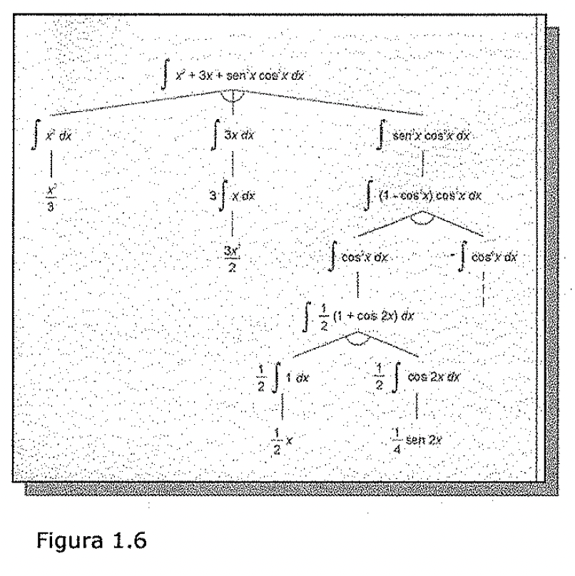
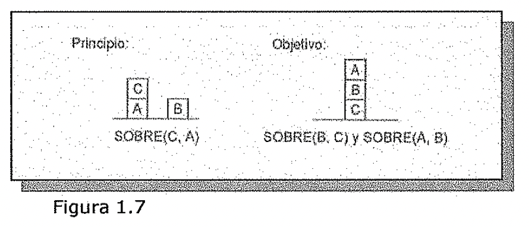
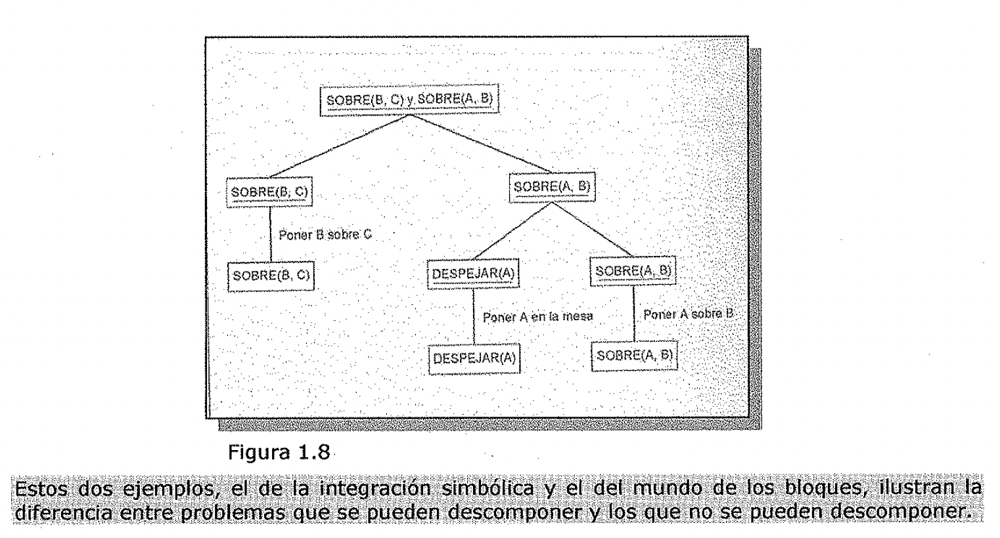

(sec-unit-01-introduccion-analisis-del-problema)=

## Análisis del problema

1. Análisis del problema

La búsqueda heurística es un método muy general que se puede aplicar a una gran
clase de problemas. Incluye gran variedad de técnicas específicas, cada una de
las cuales es particularmente efectiva para una pequeña clase de problemas. A
fin de poder elegir el método más apropiado (o una combinación de métodos) para
un problema en particular, es necesario analizarlo con arreglo a varias
dimensiones clave:

- - ¿Puede el problema descomponerse en un conjunto de subproblemas
    independientes (o casi) más pequeños o sencillos?

* ¿Pueden ignorarse pasos dados o al menos deshacerse si se comprueba que no
  eran adecuados?

* ¿Es predecible el universo del problema?

* ¿Una solución es buena de manera evidente, sin necesidad de compararla con
  todas las demás posibles soluciones?

* La solución deseada, *¿es* un estado del mundo o una ruta hacia algún estado?

* ¿Es necesaria una gran cantidad de conocimiento para resolver el problema o
  solo es

' ·1 necesario para restringir la búsqueda?

- - La computadora a la que simplemente se le da el problema ¿Puede emitir una
    solución,

o es necesario que esta interactúe con una persona?

¿Puede descomponerse el problema?

Suponga que se desea resolver el problema de calcular la expresión:

*(x2 +3x+sen2x-cos2 x)dx* Se puede resolver este problema descomponiéndolo en
tres problemas más pequeños, cada uno de los cuales puede resolverse usando una
pequeña colección de reglas específicas. La Figura 1.6 muestra el árbol del
problema que se genera mediante el proceso de descomposición. El árbol puede
generarse con un sencillo programa recursivo de integración de esta forma: en
cada paso, se verifica si el problema en el que se trabaja se puede resolver
directamente. Si lo es, se devuelve inmediatamente la respuesta. Si el problema
no se puede resolver fácilmente, el integrador verifica si puede descomponer el
problema en otros más simples. Si puede, crea estos problemas *y* se llama
recursivamente a sí mismo con ellos. Mediante el uso de esta técnica de
descomposición del problema, se pueden resolver fácilmente problemas muy
grandes.

*J X'+3Y.+sen x dx*

Figura 1.6

Considere ahora el problema ilustrado en la Figura 1. 7. Este problema esta
extraído de un dominio que con frecuencia esta referenciado en la literatura de
IA como el mundo de los bloques. Se permiten los siguientes operadores:

DESPEJADO (x) [el bloque x no tiene nada sobre el] ➔ SOBRE (X, Mesa) \[coge **x
y** ponlo sobre la mesa\] DESPEJADO (x) y DESPEJADO (y) ➔ SOBRE (X, y) \[poner x
sobre y\] \\

Principio:

.l·i.r-151

S08RE(C,;)

SOBRE(B. C) y SOBRE(A, B)

Figura 1. 7

La aplicación de la técnica de descomposición del problema a este sencillo
ejemplo de mundo de bloques se lleva al árbol solución mostrado en la Figura
1.8. En la figura, los objetivos están subrayados; los estados alcanzados no lo
están. La idea de esta solución es la de reducir el problema de conseguir B
sobre C y A sobre B a dos problemas separados. El primero de estos / nuevos
problemas, conseguir B sobre C, es sencillo, dado el estado inicial. Simplemente
se .

coloca B sobre C. El segundo subobjetivo no es tan sencillo, puesto que los
únicos operadores permitidos toman un solo bloque a la vez, se tiene que
eliminar A quitando C antes de coger A **y** situarlo sobre B. Esto puede
hacerse fácilmente. Sin embargo, al intentar combinar las dos subsoluciones en
una sola, se falla. Independientemente de cuál se haga primero, no se podrá
realizar el segundo tal **y** como se ha planeado. En este problema los dos
subproblemas no son independientes. Interactúan, y tales interacciones deben ser
consideradas a fin de llegar a una solución para la totalidad del problema.

Figura 1.8

