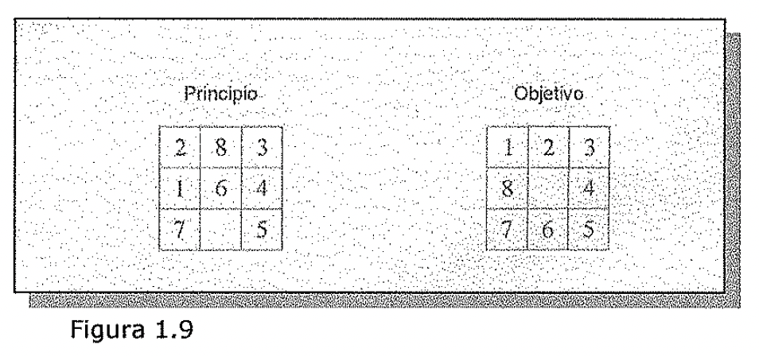

# Problemas ignorables, recuperables y no recuperables
tl"pueden deshacerse o ignorarse pasos hacia una solución?

Suponga que se intenta probar un teorema matemático. En primer lugar se prueba
un lema que se piensa que sera útil. En cierto instante, se comprueba que el
lema no supone una ayuda para nada. *¿Se* está en un apuro?

No. Todo lo que se necesita saber para probar el teorema es todavía cierto y
esta memorizado.

Algunas reglas que pudieron aplicarse al principio aun pueden hacerlo. Basta con
continuar come si se comenzara de nuevo. Todo el esfuerzo realizado se ha
perdido en explorar un callejón sin salida.

El 8-puzzle: El 8-puzzle es un cajón cuadrado en el que hay situados echo
bloques cuadrados. El cuadrado restante esta sin rellenar. Cada bloque tiene un
número. Un bloque adyacente al hueco puede deslizarse hacia el. El juego
consiste en partir de una posición de salida para llegar a una posición
especificada come objetivo. El objetivo es transformar la posición inicial en la
posición objetivo mediante el deslizamiento de los bloques.

En la Figura 1.9 se ve un juego de muestra con el 8-puzzle. Al intentar resolver
el 8-puzzle, se pueden realizar movimientos estúpidos. Por ejemplo, en el juego
que se muestra arriba, se podría empezar deslizando el bloque 5 al espacio vado.
Al hacer esto, no se podrá deslizar el bloque 6 al hueco porque este se ha
movido, pero podemos volver atrás y deshacer el primer movimiento, deslizando el
bloque 5 adonde estaba. Entonces ya podemos mover el bloque 6. Los errores
pueden recuperarse también, pero no de una forma tan sencilla come en el
problema de la demostración del teorema. Se debe realizar un paso adicional para
deshacer cada movimiento incorrecto, mientras que no se necesita realizar
ninguna acción para "deshacer" un lema inútil. Ademas, el mecanismo de control
de resolución de un 8-puzzle no debe perder de vista el orden en que se realizan
las operaciones para que estas puedan deshacerse si es necesario. La estructura
de control del demostrador de teoremas no necesita almacenar toda esta
información.

| --- | --- | --- |

| Principio | | Objetivo |

| 2 8 | 3 | |

| l 6 |,1 | |

Figura 1.9

Considere otra vez el problema del juego del ajedrez. Suponga que un programa
que juegue al ajedrez realiza un movimiento estúpido y cae en la cuenta un par
de movimientos después; el programa no puede jugar come si nunca hubiera hecho
el movimiento estúpido ni puede volver atrás y empezar el juego desde ese punto.
Todo lo que puede hacer es intentar hacerlo mejor en la situación actual y
partir desde esta.

Estas tres definiciones hacen referencia a los pases de la solución de un
problema y, por lo tanto, pueden surgir para caracterizar sistemas de producción
específicos para resolver problemas más que el problema en sí mismo. Quizá una
formulación diferente de un mismo problema har\[a que el problema fuera
caracterizado de forma diferente. Estrictamente hablando, esto es cierto. Sin
embargo, debido a muchos grandes problemas, existe solo una formulación (o un
pequeño número de ellas esencialmente equivalentes) que de forma natural
describe el problema. Esto es así para cada uno de los problemas expuestos
anteriormente. Cuando este sea el case, tiene sentido considerar la
recuperabilidad de un problema de forma equivalente a la recuperabilidad de una
formulación natural para el.

La recuperabilidad de un problema juega un papel importante en la determinación
de la complejidad de la estructura de control necesaria para resolver el
problema. Los problemas. ignorables se resuelven utilizando una sencilla
estructura de control que nunca vuelve hacia atrás. Estas estructuras de control
son fáciles de implementar. Los problemas recuperables se resuelven con
estrategias un poco más complicadas que a veces cometen errores. Para
recuperarse de tales errores sera necesaria una vuelta atrás, de forma que la
estructura de control debe implementarse con una pila "push-down", en la que las
decisiones se conservan en caso de que necesiten ser deshechas más tarde. Los
problemas no recuperables, por otro lado, se resuelven mediante un sistema que
debe aplicar muchísimo esfuerzo en la toma de decisiones ya que estas son
irrevocables. Algunos problemas irrecuperables se resuelven con métodos de
estilo recuperable usando un proceso de planificación, en el que se analiza por
adelantado una secuencia entera de pasos para descubrir adonde conducirá antes
de dar el primer paso. Mas adelante se explican las clases de problemas en los
que es posible hacer esto.
