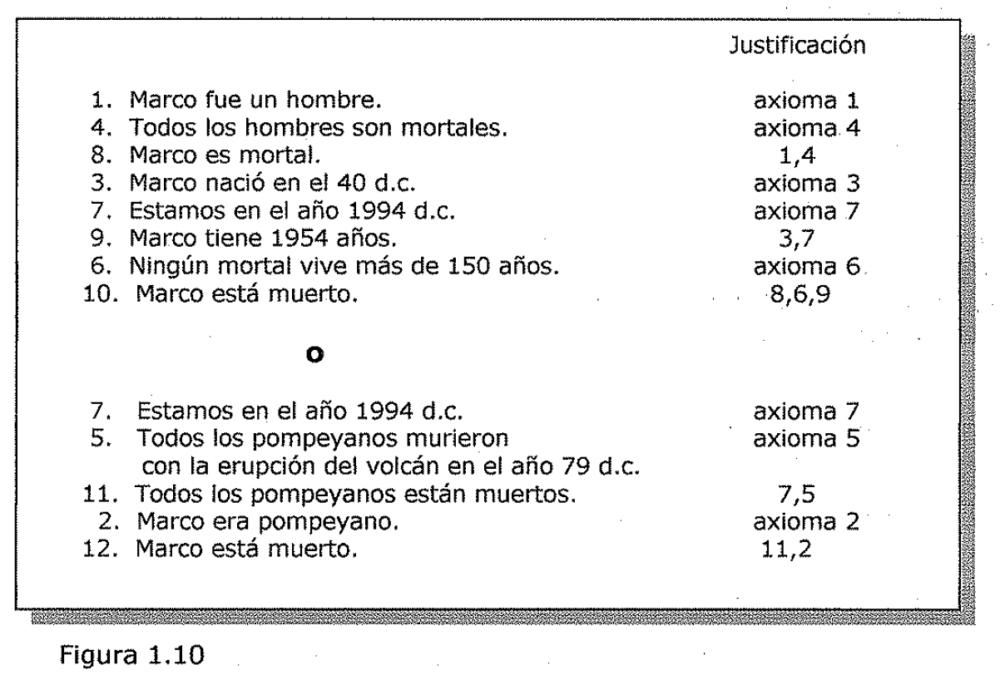
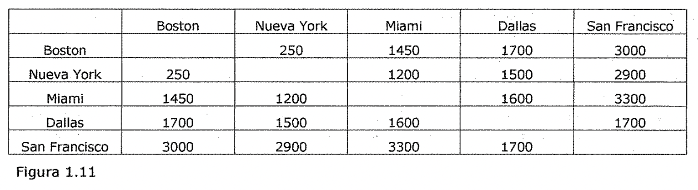
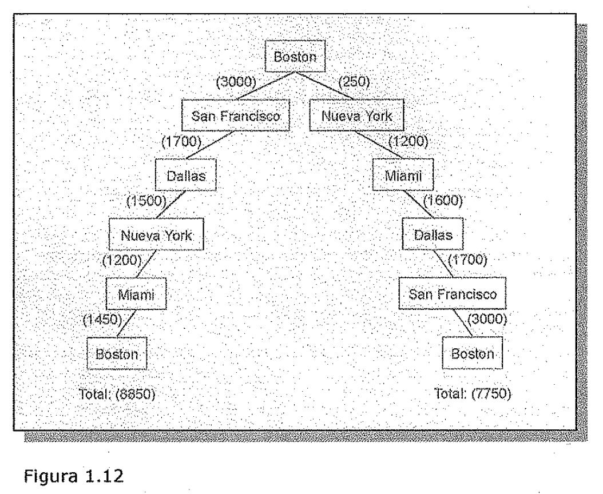

(sec-unit-01-introduccion-solucion-absoluta-o-relativa)=

## Solución absoluta o relativa

**Una solución adecuada *¿es* absoluta o relativa?**

Considere el problema de responder a preguntas basadas en una base de datos de
hechos simples, tal como esta:

1. Marco fue un hombre.

Marco era pompeyano.

Marco nació en el ano 40 d.c. Todos los hombres son mortales.

Todos los pompeyanos murieron con la erupción def volcán en el ano 79 d.c.
Ningún mortal vive más de 150 años.

Estamos en el ano 1994 d.c.

Suponga que se hace la siguiente pregunta ''\<'-Esta Marco vivo?". Al
representar cada uno de estos hechos en un lenguaje formal, tal como la lógica
de predicados, y al utilizar métodos formales de inferencia, puede derivarse
fácilmente una respuesta a la pregunta. De hecho, cualquiera de las dos formas
de razonamiento conducirá a la respuesta, tal y como se muestra en la Figura
1.10. Nuestro interés se centra en responder a esta pregunta sin importar que
camino se ha seguido para hacerlo. Si se sigue un camino que lleva a la.
respuesta con éxito, no hay razón para volver atrás y ver si existen otros
caminos que también lleguen a la solución.

7. Estamos en el año 1994 d.c.

1. Todos los pompeyanos murieron

con la erupción del volcán en el ano 79 d.c.

11. Todos las pompeyanos están muertos.

01. Marco era pompeyano.

01. Marco está muerto.

axioma 7 axioma 5 axioma 2

| --- | --- | --- |

| | | Justificación |

| 1. | Marco fue un hombre. | axioma 1 |

| 4. | Todos los hombres son mortales. | axioma4 |

| 8. | Marco es mortal. | 1,4 |

| 3. | Marco nació en el 40 d.c. | axioma 3 |

| 7. | Estamos en el año 1994 d.c. | axioma 7 |

| 9. | Marco tiene 1954 af\\os. | 3,7 |

| 6. | Ningún mortal vive más de 150 años. | axioma 6 |

| 10. | Marco está muerto. | 8,6,9 |

Figura 1.10

Pero ahora considere de nuevo el problema def viajante de comercio. El objetivo
es encontrar la ruta más corta que lleva.e a cada ciudad exactamente una vez.
Suponga que las ciudades a visitar y las distancias entre ellas son las que
aparecen en la Figura 1.1 L

| | | | | | |

| --- | --- | --- | --- | --- | --- |

| | Boston | Nueva York | Miami | Dallas | San Francisco' |

| Boston | | 250 | 1450 | 1700 | 3000 |

| Nueva York | 250 | | 1200 | 1500 | 2900 |

| Miami | 1450 | 1200 | | 1600 | 3300 |

| Dallas | 1700 | 1500 | 1600 | | 1700 |

| San Francisco | 3000 | 2900 | 3300 | 1700 | |

Figura 1.11

El vendedor podría comenzar desde Boston. En ese caso, una ruta que podría
seguir es la que tiene 8850 millas de longitud. Pero, ¿es esta la solución al
problema? La respuesta es que no se puede asegurar hasta que no se intenten
todas las demás rutas y se este seguro de que ninguna de ellas es más corta. En
este caso, como se ve en la Figura 1.12, la primera ruta no es definitivamente
la solución al problema del viajante.

- Dallas

HOO)

Lr:41a

- (1450)

San Francisco

3000.

!: Bófil0n:· Bost◊n

Total: (8850)

Total: (7750)

Figura 1.12

