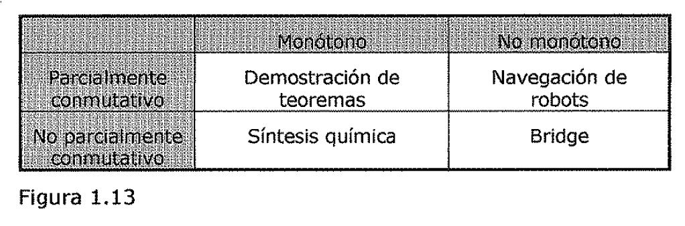

(sec-unit-01-introduccion-problemas-solitarios-y-conversacionales)=

## Problemas solitarios y conversacionales

¿Necesita la tarea interaccionar con una persona?

Algunas veces resulta provechoso programar las computadoras para resolver
problemas de una manera que la mayoría de la gente no sería capaz de entender.
Esto es así si. el nivel de interacción entre el hombre y la computadora es del
tipo. Entrada-problema Salida-solución. Sin embargo, se están desarrollando cada
vez más programas que necesitan interacción intermedia con el hombre, tanto para
proporcionar información adicional de entrada al programa como para proporcionar
noticias adicionales al usuario. Considérese, por ejemplo, el problema de la
demostración de teoremas matemáticos. Si:

Todo lo que se quiere saber es si existe una demostración. El programa es capaz
de hallar la demostración por *si* mismo.

Entonces no importa la estrategia que use el programa para hallar la
demostración. Puede utilizar, por ejemplo, el procedimiento de resolución, el
cuál puede ser muy eficiente, aunque no sea muy natural para el hombre. Pero si
alguna de estas condiciones no se cumple, la forma de hallar la demostración
tiene mucha importancia. Suponga que se intenta probar algún nuevo y difícil
teorema. Se puede pedir una demostración que siguiera los patrones tradicionales
de forma que un matemático este seguro de que la demostración es correcta solo
con leerla. Por otra parte, dar con una prueba del teorema puede llegar a ser
tan complejo que el programa no sepa por donde empezar. Hasta ahora, las
personas son superiores al realizar las estrategias de alto nivel que se
necesitan para demostrar un teorema, de forma que una computadora necesita pedir
ciertos consejos. Por ejemplo, normalmente en geometría resulta más fácil
encontrar una prueba si alguien indica como representarla gráficamente. Para
poder utilizar estos consejos, el razonamiento seguido por una computadora debe
ser análogo al realizado por el consejero humano, al menos en ciertos aspectos.
Debido a que las computadoras trabajan en áreas muy significativas de nuestras
vidas tales como diagnósticos médicos, la gente no podrá aceptar el veredicto
que genere un programa si no puede comprender el razonamiento que ha seguido
para darlo.

Por supuesto, esta distinción no es totalmente estricta al describir los
dominios particulares del problema. Tai y como se ha dicho, la demostración de
teoremas matemáticos podría ser tanto de un tipo como de otro. Sin embargo, para
una aplicación en particular, se necesitan sistemas de uno u otro tipo, y esta
decisión tiene gran importancia a la hora de elegir el método de resolución del
problema.

1.5.5. Características de los Sistemas de producción

Se ha examinado una serie de características que distinguen varios tipos de
problemas. También se ha argumentado que los sistemas de producción representan
la forma más adecuada de describir las operaciones que se llevan a cabo en la
búsqueda de una solución a un problema. En este punto pueden surgir dos
razonables preguntas:

LPueden los sistemas de producción, al igual que los problemas, ser descriptos
por un conjunto de características que arrojen alguna luz sobre como
implementarlos fácilmente? Si es así, Qué relaciones existen entre los tipos de
problemas y los tipos de sistemas de producción que son adecuados para resolver
estos problemas?

La respuesta a la primera pregunta es afirmativa. Considere las siguientes
definiciones de sistemas de producción. Un sistema de producción monótono es
aquel en el que la aplicación de una regla nunca prevé la posterior aplicación
de otra regla que podría haberse aplicado cuando se seleccionó la primera. Un
sistema de producción no monótono es aquel en el que lo anterior no es cierto.
Un sistema de producción parcialmente conmutativo es aquel que tiene la
propiedad de que si una determinada aplicación de una secuencia de reglas
transforma el estado x en el estado y, entonces alguna permutación permitida
(por ejemplo, deben satisfacerse las precondiciones de una regla para que pueda
ser aplicada) de estas reglas, también transforma el estado x en el estado y. Un
sistema de producción conmutativo es aquel que es a la vez monótono y
parcialmente conmutativo..

La relevancia de esta clasificación de los sistemas de producción estriba en la
relación que existe entre las categorías de los mismos y las estrategias
apropiadas de implementación. Sin embargo antes de explicar estas relaciones,
puede resultar provechoso clarificar las definiciones viendo como se relacionan
con problemas específicos.

De esta forma, se llega a la segunda de las cuestiones expresadas anteriormente
la cuál indaga sobre si existe una relación interesante entre las clases de
sistemas de producción y las clases de problemas. Dado un problema resoluble,
existe un número infinito de sistemas de producción que proporcionan formas de
encontrar soluciones. Algunos de ellos serán más eficientes y naturales que
otros. Un problema que puede ser resuelto con un sistema de producción, puede
ser resuelto con uno conmutativo (la clase más restrictiva), sin embargo, el
Sistema conmutativo puede ser tan inmanejable que sea prácticamente inútil.
Puede utilizar estados individuales para describir secuencias enteras de reglas
aplicadas por 1.m sistema no conmutativo más simple. Asf, desde un punto de
vista formal, no existe relación alguna entre tipos de problemas y tipos de
sistemas de producción debido a que todos los problemas pueden resolverse
utilizando todos los tipos de sistemas de producción. Pero desde. un pun'to de
vista practico, definitivamente existe relación entre tipos. de problemas y los
tipos de sistemas de producción que se prestan de forma natural a representar
estos problemas. Para ver esto, veamos algunos ejemplos. La Figura 1.13 muestra
las.cuatro categorías en que se dividen los sistemas de producción de acuerdo
con las dos dicotomías, sistemas monótonos. versus no monótonos y sistemas
parcialmente conmutativos versus no parcialmente conmutativos, de forma que
algunos problemas pueden resolverse más naturalmente por un tipo de sistema. La
esquina superior izquierda la forman los sistemas conmutativos.

Los sistemas parcialmente conmutativos y los monótonos son adecuados para
resolver problemas ignorables. Esto no es sorprendente desde el momento en que
las definiciones de ambos son esencialmente las mismas. Sin embargo, se advierte
que los problemas ignorables son aquellos en los que una formulación natural
sera un sistema parcialmente conmutativo y monótono. Los problemas que implican
la creación de nuevos objetos más que el cambio de los viejos suelen ser
ignorables. La demostración de teoremas, tal y como se ha descrito, es un
ejemplo de proceso creativo. Realizar deducciones a partir de hechos conocidos
es también un proceso creativo. Ambos procesos se pueden implementar fácilmente
con un sistema parcialmente conmutativo y monótono.

Los sistemas parcialmente conmutativos y monótonos son importantes desde el
punto de vista de la implementación porque no contemplan la característica de
volver hacia estados pasados cuando se descubre que se ha seguido un camino
incorrecto. Si bien con frecuencia es adecuado implementar estos sistemas con
vuelta atrás (backtracking) para garantizar una búsqueda sistemática, la base de
datos actual que representa el problema, no necesita regenerarse. El resultado
de esto es, con frecuencia, un notable incremento de la eficiencia debido a que
la base de datos no tiene que ser regenerada y no es necesario estar al tanto de
cada cambio que se produjo en el proceso de búsqueda.

Hasta ahora se han explicado aquellos sistemas de producción que son a la vez
monótonos y parcialmente conmutativos. Estos sistemas son adecuados para
problemas en los que las cosas no cambian; se *crean.* Por otro lado, los
sistemas no monótonos y parcialmente conmutativos, se adecuan a aquellos
problemas en los que se realizan cambios pero estos son reversibles y en los que
el orden de las operaciones no es crítico. Este es normalmente el caso de los
problemas de manipulación física, como la navegación de robots en una superficie
plana. Suponga que el robot dispone de los siguientes operadores: ir hacia el
norte (N), ir hacia el este (E), ir hacia el sur (S) e ir hacia el oeste (0).
Para llevar a cabo su objetivo, no importa si el robot ejecuta N-N-E o N-E-N.
Dependiendo de cómo se eligen los operadores, el problema del 8-puzzle y el def
mundo de bloques pueden considerarse también como parcialmente conmutativos.

Estos dos tipos de sistemas parcialmente conmutativos son importantes desde el
punto de vista de la implementación porque tienden a alcanzar muchos estados
individuales duplicados durante el proceso de búsqueda.

| --- | --- |

| Demostración de teoremas | Navegación de robots |

| Síntesis química | Bridge |

Figura 1.13

Los sistemas de producción que no son parcialmente conmutativos son adecuados
para muchos problemas en los que se producen cambios irreversibles. Por ejemplo,
considere el problema de realizar un proceso que produzca un compuesto químico.
Los operadores disponibles incluyen cosas come "Añadir el agente químico x al
recipiente" o "Cambiar la temperatura hasta t grades". Estos operadores pueden
causar cambios irreversibles en el compuesto. El orden en que se realizan las
operaciones es importante para determinar el resultado final. Es posible que six
se añade a y, se forme un compuesto estable, de forma que la posterior adición
de z no produzca ningún efecto; sin embargo, si z se añade a y, puede formarse
un compuesto estable diferente, de forma que no tenga efecto alguno la posterior
adición de x. En los sistemas de producción que no son parcialmente conmutativos
es menos probable que se llegue al mismo nodo varias *veces* durante el proceso
de búsqueda. Cuando se trate con sistemas que describan procesos irreversibles,
es particularmente importante tomar las decisiones correctas la primera *vez,*
aunque si el universo es predecible, puede que una buena planificación las haga
menos determinantes.

Ejercicio

Encontrar una buena representación del espacio de estados para el problema del
misionero y los caníbales.

Tres misioneros y tres caníbales se encuentran en una orilla de un rfo. A todos
ellos ¿es gustaría pasar a la otra orilla. Los misioneros no se irían de los
caníbales. Por eso, los misioneros han planificado el viaje de forma que el
número de misioneros en cada orilla del rfo nunca sea menor que el número de
caníbales en esa misma orilla. Solo disponen de una lancha de dos plazas. LCómo
podrían atravesar el rio sin que los misioneros corran peligro de ser devorados
por los caníbales?

UNIDAD DIDÁCTICA 2
