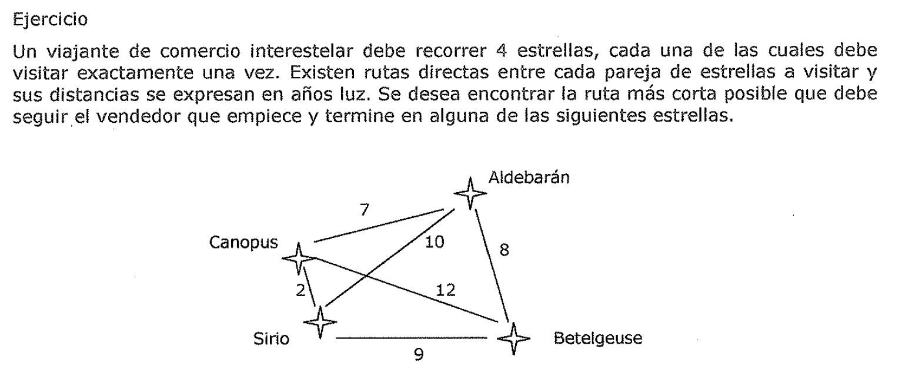

# Explosión combinatoria y ramificación y acotación

## Técnicas de búsqueda a ciegas

Se ha visto que para poder resolver un problema, primero hay que reducirlo a una
forma en la que pueda darse una definición precisa. Esto puede lograrse mediante
la *definición de un espacio de estados del problema* (incluyendo los estados
iniciales y finales), y de un *conjunto de operadores* para trasladarse a través
del espacio. *El problema se reduce entonces a buscar una ruta a través del
espacio que una un estado inicial con un estado objetivo.* El proceso de
resolución del problema puede modelarse como un sistema de producción y entonces
se debe elegir la estructura de control apropiada para el sistema de producción
con el fin de que el proceso de búsqueda sea lo más eficiente posible.

### Estrategia de control

Hasta ahora se ha ignorado por completo la cuestión de cómo se decide que regla
hay que aplicar durante el proceso de búsqueda de la solución de un problema.
Esta cuestión surge debido a que con frecuencia es posible aplicar más de una
regla cuando sus partes izquierdas casan con el estado actual. Sin necesidad de
pensar mucho, parece claro que estas decisiones tienen un impacto crucial en la
rapidez, y tal vez en la posibilidad, de resolución del problema.

El **primer requisito** que debe cumplir una buena estrategia de control es *que
cause algún cambio.* Considere el problema de las jarras de agua del apartado
anterior. Suponga que se implementa una sencilla estrategia de control que cada
vez empiece por la primera regla de la lista y elija la primera que encuentre
que es aplicable. Si se hace esto, nunca se encontrara la solución al problema.
Se estará llenando la jarra de cuatro litros de agua indefinidamente. Las
estrategias de control que no causan cambio de estado nunca alcanzan la
solución.

El **segundo requisito** que debe cumplir una buena estrategia de control es
*que sea sistemática.* He aquí otra simple estrategia de control para el
problema de las jarras de agua: en cada ciclo, elegir aleatoriamente una de
entre todas las reglas aplicables. Esta estrategia es mejor que la primera:
produce cambios y puede encontrar la solución eventualmente. Sin embargo, puede
volver al mismo estado varias veces durante el proceso y suele utilizar muchos
más pasos de los necesarios. Debido a que la estrategia de control no es
sistemática, es posible utilizar secuencias de operadores no apropiadas varias
veces hasta encontrar finalmente la solución. El requisito de que una estrategia
de control sea sistemática se corresponde con una necesidad de cambio global (en
el curso de varios pasos) tanto como de cambio local (en el curso de un paso
sencillo).

### Explosión combinatoria

Se puede pensar que buscar una solución es tan simple como empezar en el
principio y recorrer su camino hasta la conclusión. Sin embargo, en·la mayoría
de los problemas en los que querría usar una computadora para resolverlos, la
situación es muy diferente. Generalmente, usara la computadora para resolver
problemas en los que el número de nodos en el espacio de búsqueda es muy grande,
y según crece el espacio de búsqueda, crece el número de diferentes caminos
posibles hacia el objetivo.

El problema es que cada nodo ai\\añadido al espacio de búsqueda ai\\añadirá más
de un camino: es decir, el número de caminos hacia el objetivo se incrementará
más rápido con cada nuevo nodo.

Para comprender este incremento, considere el número de formas en que puede
colocar tres objetos - A, B y C - sobre una mesa. Las seis dice_rentes
ordenaciones son como sigue:

A CB

B CA

BA C C B A C A B

Aunque puede probarse a sí mismo rápidamente que estas son todas las formas en
que A, B y C pueden ser colocadas, se puede obtener el mismo número con un
teorema de la rama de las matemáticas llamada *combinatoria,* que es el estudio
de la manera en que los casos pueden combinarse. El teorema establece que el
número de formas en que N objetos pueden combinarse (o colocarse) es igual a N!
(N factorial). El factorial de un número es el producto. de todos los números
del conjunto formado por el mismo número y todos los menores que el hasta el 1.
En consecuencia, 3! es 3x2x1 o 6.

Dada esta información. puede ver que, si tuviera 4 objetos para colocar,
entonces habría 4!, o 24 combinaciones. Con 5 objetos, el número es 120, con 6
objetos, es 720. Sin embargo, con, digamos, 1.000 objetos, el número de posibles
combinaciones es enorme. Cuando hay más que un manojo de posibilidades,
rápidamente se hace imposible examinar- y de hecho, incluso enumerar- todas las
combinaciones.

Cuando relacione el concepto de explosión combinatoria con la resolución de
problemas, podrá ver que cada nodo adicional añadido al espacio de búsqueda
incrementa el número de posibles soluciones en una cifra bastante mayor que uno.
Por consiguiente, en algún momento, hay demasiadas posibilidades para trabajar
con ellas. Debido a que el número de posibilidades crece tan rápidamente, *solo
los problemas más simples se dirigen a búsquedas exhaustivas.* Una búsqueda
exhaustiva, o *"fuerza bruta",* teóricamente *funcionara siempre,* no es
practica porque consume demasiado tiempo, demasiados recursos de computadora, o
ambas cosas. Por esta razón, se han desarrollado otras técnicas de búsqueda.

Ejercicio

Un arque61ogo debe recorrer 5 sitios clave para llevar a cabo una investigación
sobre restos fósiles de Dinosaurios en Argentina. Estos sitios son Trelew, San
Martin de los Andes, Purmamarca, Valle de la Luna y Lago Escondido. Al no
decidirse sobre \_cuál es el orden que le convendría seguir en el recorrido,
piensa que es una buena medida describir todas las posibles combinaciones
diferentes y finalmente elegir una de ellas con los ojos cerrados.

Desarrollar un programa que permita ingresar un número variable de sitios a
visitar (entre 2 y 8) y muestre en pantalla todos los posibles circuitos que
podría definir.

## Explosión combinatoria y ramificación y acotación

### Ramificación y acotación

Considere el siguiente problema:

El problema de! viajante de comercio: Un vendedor tiene una lista de ciudades,
cada una de las cuales debe visitar exactamente una vez. Existen carreteras
directas entre cada pareja de ciudades de la lista. Encontrar la ruta más corta
posible que debe seguir el vendedor que empiece y termine en alguna de estas
ciudades.

En principio, se puede resolver el problema con una sencilla estructura de
control que cause movimiento y sea sistemática. Se podría simplemente explorar
todas las posibles rutas en el árbol y devolver la que tenga menor longitud.
Esta estrategia puede funcionar en la practica para listas con muy pocas
ciudades, pero se colapsa rápidamente conforme el número de ciudades aumenta. Si
existen N ciudades, el número de rutas diferentes entre ellas es de: 1 x 2 x...
x (N-1), o (N-1)!. El tiempo empleado para examinar una ruta es proporcional a
N. Asi, el tiempo total empleado para completar la búsqueda es proporcional a
N!; si se asume que hay solo 10 ciudades, es de 3.628.800, un número bastante
grande. El viajante podría perfectamente tener que visitar 25 ciudades.
Encontrar la solución a este problema necesitaría más tiempo que el que
podríamos gastar. Este fenómeno se denomina explosión combinatoria, para
combatirla, es necesaria una *nueva estrategia de control.* Se puede superar la
sencilla estrategia perfilada anteriormente usando una técnica denominada
*ramificación y acotación (branch and bound).* Comienza generando rutas
completas, manteniéndose la ruta más corta encontrada hasta el momento. Deja de
explorar una ruta tan pronto como su distancia total, hasta ese momento, sea
mayor que la que se ha marcado como la más corta. *Usar esta técnica garantiza
hallar la ruta más corta.* Desgraciadamente, aunque este algoritmo es más
eficiente que el anterior, todavía necesita un tiempo exponencial. La cantidad
exacta de tiempo utilizado en un problema en particular, depende del orden en
que se exploren las rutas. Sin embargo, todavía es inadecuada para problemas
grandes.

Ejercicio

Un viajante de comercio interestelar debe recorrer 4 estrellas, cada una de las
cuales debe visitar exactamente una vez. Existen rutas directas entre cada
pareja de estrellas a visitar y sus distancias se expresan en años luz. Se desea
encontrar la ruta más corta posible que debe seguir el vendedor que empiece y
termine en alguna de las siguientes estrellas.

:+Aldebaran Canopus

Siri

}- Betelgeuse Desarrollar un programa que resuelva este problema, teniendo en
cuenta que se debe dejar de explorar una ruta tan pronto como su distancia
total, hasta ese momento, sea mayor que la que se ha marcado coma la más corta.
El programa debe mostrar además par pantalla, el seguimiento que se va haciendo
de cada camino, detallando para cada uno, las estrellas visitadas y la distancia
total recorrida y en caso de abandonar un camino, par no ser conveniente,
mostrar el mensaje correspondiente. L 2,1,3, 11:búsqueda primero en anchura
