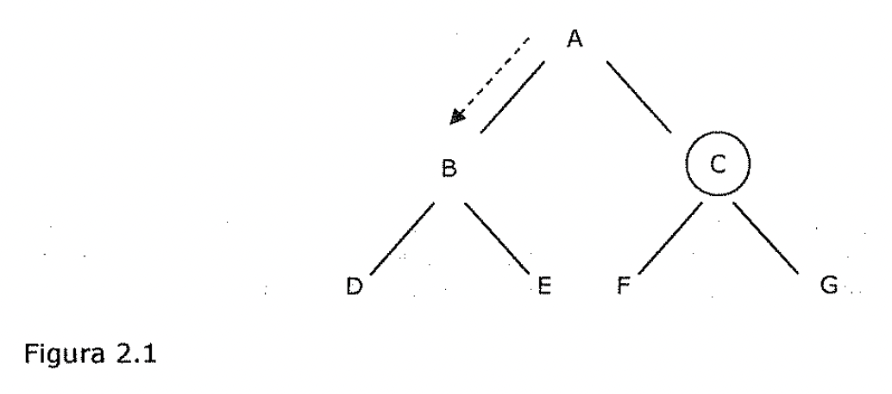
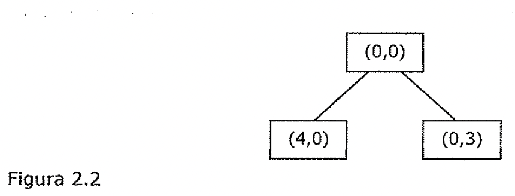
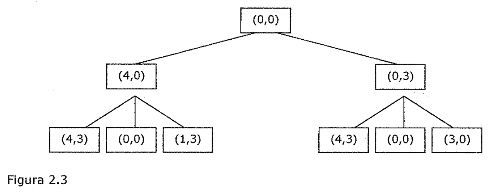

(sec-unit-02-busqueda-y-planificacion-busqueda-primero-en-anchura)=

## Búsqueda primero en anchura

La búsqueda primero en anchura es la opuesta a la búsqueda primero en
profundidad. En este método *se evalúa cada nodo def mismo nivel antes de
proceder al siguiente nivel más profundo.* He aquí este método de recorrido con
C como objetivo:

D E G

Figura 2.1

Esta ilustración muestra que se visitan los nodos ABC. Como la búsqueda primero
en profundidad, la búsqueda primero en anchura garantiza que encontrara una
solución, si existe, porque eventualmente degenerara en una búsqueda exhaustiva.

Una estrategia de control sistemática para el problema de las jarras de agua
podría ser la siguiente: se construye un árbol cuya raíz sea el estado inicial;
todas las ramificaciones de la raíz se generan al aplicar cada una de las reglas
aplicables al estado inicial. La Figura 2.2 muestra la apariencia del árbol en
este punto. Ahora, para cada nodo, se generan todas las posibles situaciones
resultantes de la aplicación de todas las reglas adecuadas. En la Figura 2.3 se
muestra el estado actual del árbol. Se continua con este proceso hasta que
alguna regla produce un estado objetivo.

4,0) (0,3)

Figura 2.2

Este proceso, denominado búsqueda primero en anchura (breadth-first search), se
describe con precisión de la siguiente forma.

**Algoritmo: Búsqueda primero en anchura**

- 1. Crear una variable Hamada LISTA-NODOS y asignarle el estado inicial.

2. Hasta que se encuentre un estado objetivo o LISTA-NODOS este vacía, hacer:

1. Eliminar el primer elemento de LISTA-NODOS y llamarlo E. Si LISTA-NODOS esta
   vacía, terminar.

1. Para que cada regla se empareje con el estado descrito en E hacer:

Aplicar la regla para generar un nuevo estado.

Si el nuevo estado es un estado objetivo, terminar y *devolver* este estado.

En caso contrario, añadir el nuevo estado al final de LISTA-NODOS.

4,3) (0,0)

Figura 2.3

