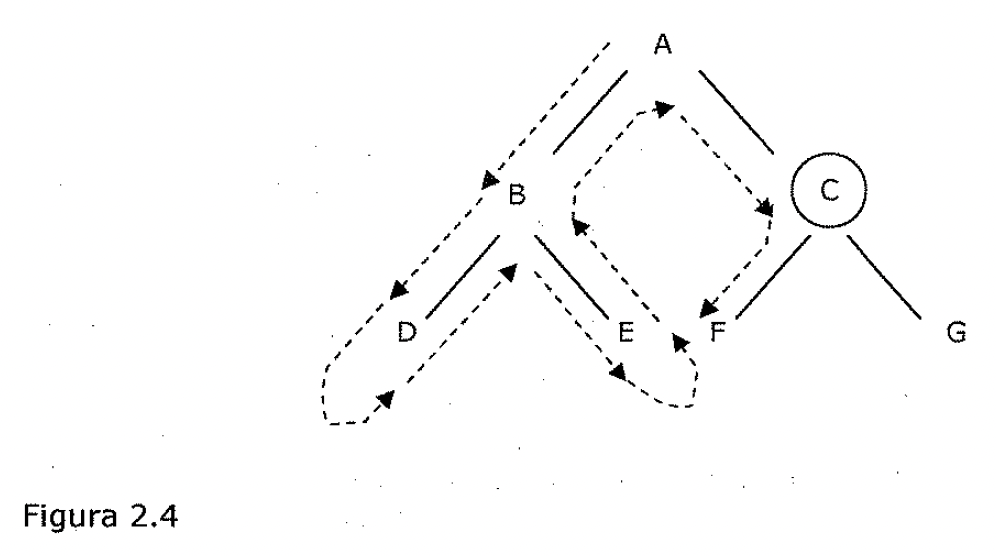
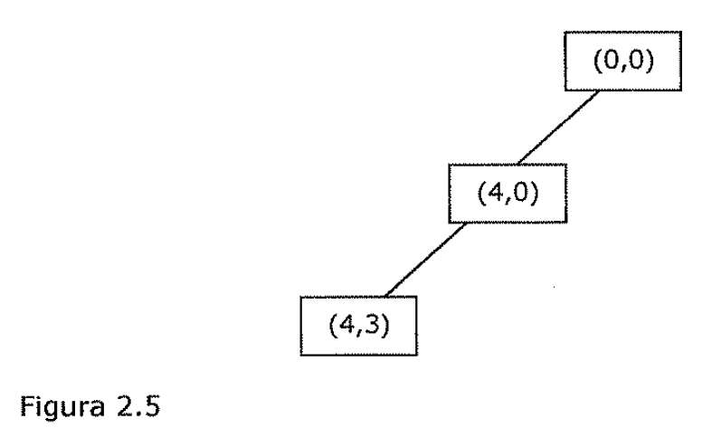
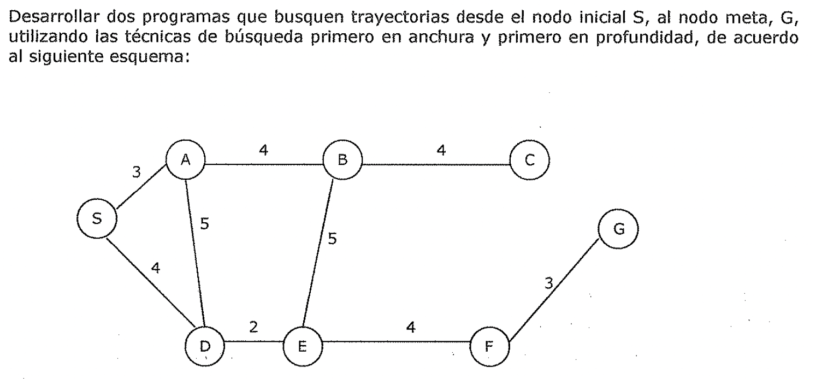
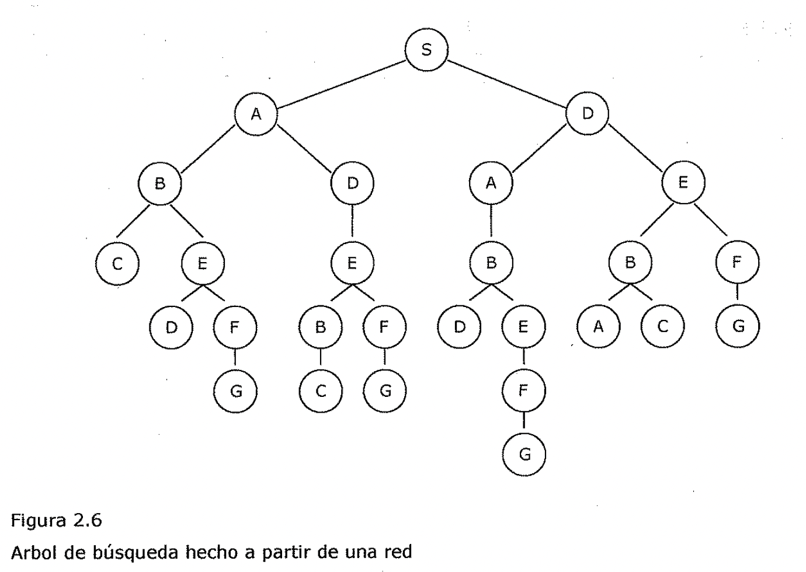

(sec-unit-02-busqueda-y-planificacion-busqueda-primero-en-profundidad)=

## Búsqueda primero en profundidad

**2.1.4. Búsqueda primero en profundidad**

Una búsqueda primero en profundidad significa que se explora cada camino posible
hacia el objetivo hasta su conclusión antes de intentar otro camino. Para
comprender exactamente como funciona esta búsqueda, considere este árbol en el
que F representa el objetivo:

', *.J* **Figura 2.4**

En este tipo de recorrido, *va par la izquierda hasta que o bien se alcanza un
nodo terminal o* *bien encuentra el objetivo.* Si alcanza un nodo terminal,
retrocede un nivel, va a la derecha y luego a la izquierda hasta encontrar el
objetivo o nodo terminal. Repetirá este procedimiento hasta haber encontrado el
objetivo o haber examinado el último nodo en el espacio de búsqueda.

Esta estrategia de control sistemática, se basa en continuar por una sola rama
del árbol hasta C encontrar una solución o hasta que se tome la decisión de
terminar la búsqueda por esa dirección. Terminar la búsqueda por una ruta tiene
sentido cuando se llega a un callejón sin salida, se produce un estado ya
alcanzado o la ruta se alarga más de lo especificado en algún límite de
*'.'inutilidad".* Si esto ocurre, se produce una *vuelta-atrás (backtracking).*
Se revisita el estado más recientemente creado desde el que sea posible algún
movimiento alternative más y se crea así un nuevo estado. Esta forma de
vuelta-atrás se denomina *vuelta-atrás* *cronológica (chronological
backtracking)* debido a que el orden en el que *se* deshacen los pasos depende
unicamente de la secuencia temporal en que se hicieron originalmente esos pases.
En definitiva, el paso más reciente es siempre el primero que se deshace. Esta
es la forma *de* vuelta-atrás a la que se hace referencia cuando se utiliza
simplemente el término "vuelta- atrás". Sin embargo, existen otras formas de
replegamiento de los pases dados al computar. El procedimiento de búsqueda
descrito se denomina también búsqueda primero en profundidad depth-first
search). El siguiente algoritmo lo define con precisión.

**Algoritmo: Búsqueda primero en profundidad**

1. Si el estado inicial es un estado objetivo, terminar y devolver un éxito.

1. En caso contrario, hacer lo siguiente hasta que se marque un éxito o un
   fracaso.

1. Generar un sucesor, E, del estado inicial. Si no existen más sucesores,

marcar un fracaso.

- 1. Llamar a la Búsqueda en profundidad con E como estado inicial.
- 1. Si se devuelve un éxito, marcar un éxito. En caso contrario, continuar con
     el ciclo.

La Figura 2.5 muestra una instantánea de una búsqueda primero en profundidad
para el problema de las jarras de agua.

Figura 2.5

Al comparar estos dos sencillos métodos aparecen las siguientes observaciones:

**Ventajas de la Búsqueda primero en profundidad**

- La búsqueda primero en profundidad necesita menos memoria ya que solo se
  almacenan los nodes del camino que se sigue en ese instante. Esto contrasta
  con la búsqueda primero en anchura en la que debe almacenarse todo el árbol
  que haya sido

generado hasta ese momento.

- Si se tiene suerte (o si se tiene cuidado en ordenar los estados alternatives
  sucesores), la búsqueda primero en profundidad puede encontrar una solución
  sin tener que examinar gran parte del espacio de estados. En el caso de la
  búsqueda primero en

anchura deben examinarse todas las partes del árbol de nivel n antes de comenzar
con los nodos de nivel n+ 1. Esto es particularmente relevante en el caso de que
existan varias soluciones aceptables. La búsqueda primero en profundidad acaba
al encontrar una de ellas.

**Ventajas de la Búsqueda primero en anchura**

- La búsqueda primero en anchura no queda atrapada explorando callejones sin
  salida. Esto se contrapone con la búsqueda primero en profundidad en la que se
  puede seguir una ruta infructuosa durante mucho tiempo, y quizás para siempre,
  antes de acabar en un estado sin sucesores. Esto es particularmente un
  problema en la búsqueda primero en profundidad si hay ciclos (por ejemplo, un
  estado tiene como sucesor un estado que es también uno de sus antecesores), a
  no ser que se tenga un cuidado especial en verificar tales situaciones.

- Si existe una solución, la búsqueda primero en anchura garantiza que se!logre
  encontrarla. Ademas, si existen múltiples soluciones, se encuentra la solución
  mínima (es decir, tal que requiere el mínimo número de pasos). Esto esta
  garantizado por el hecho de que no se explora una ruta larga hasta que se
  hayan examinado todas las rutas más cortas que ella. En cambio, en la búsqueda
  primero en profundidad es posible encontrar una solución larga en alguna parte
  del árbol, cuando puede existir otra mucho más corta en alguna parte
  inexplorada del mismo.

Lo deseable sería que pudieran combinarse las ventajas de estos dos métodos.

Para el problema de las jarras de agua, la mayoría de las estrategias de control
que provoquen movimiento y sean sistemáticas logran encontrar la respuesta: el
problema es sencillo. Sin embargo, este no es siempre el caso. Para poder llegar
a la solución de algunos problemas antes de morir, es necesario también demandar
una estructura de control eficiente.

Ejercicio

- ) Desarrollar dos programas que resuelvan el problema de las jarras de agua,
  utilizando las

, *1* estrategias de búsqueda primero en anchura y primero en profundidad.

Ejercicio

Desarrollar dos programas que busquen trayectorias desde el nodo inicial S, al

nodo meta, G, utilizando las técnicas de búsqueda primero en anchura y primero
en profundidad, de acuerdo al siguiente esquema:

D E F

Los programas deben ir mostrando en pantalla, para cada recorrido efectuado,.el
detalle de , *!* los nodos visitados y la distancia recorrida.

Figura 2.6

Árbol de búsqueda hecho a partir de una red
