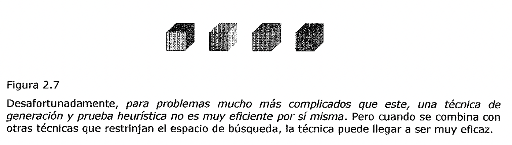

(generacion-y-prueba)=

# Generación y prueba

1. Generación y Prueba

La estrategia de generación y prueba es la más simple de todas las que se van a
explicar.

Consiste en realizar los siguientes pasos:

**Algoritmo: Generación y prueba**

- 1. Generar una posible solución. Para algunos problemas, esto significa
     generar un objetivo particular en el espacio problema. Para otros, supone
     más bien generar un camino a partir de un estado inicial.

2. Verificar si realmente el objetivo elegido es una solución comparándolo con
   el objetivo final o comparando el camino elegido con el conjunto de estados
   objetivo aceptables.

- 1. Si se ha encontrado la solución, terminar. Si no, volver al paso 1.

Si se generan las posibles soluciones de forma sistemática, si la solución
existe, este procedimiento es capaz de encontrarla en algún momento.
Desafortunadamente, *si el espacio problema* es *muy grande, "en algún momento"
puede ser demasiado tiempo.* El algoritmo de generación y prueba es un
procedimiento de búsqueda *primero en profundidad* *ya que las soluciones
completas deben generarse antes de que se comprueben.* De una forma más
sistemática, es simplemente una ***búsqueda exhaustiva por el espacio
problema.*** El método de generación y prueba puede, por supuesto, funcionar de
forma que genere las soluciones de forma aleatoria, pero esto no garantiza que
se pueda encontrar alguna vez la solución. Esta forma de trabajar se conoce
también como el ***algoritmo de! Museo Británico,*** en referencia a un método
empleado para encontrar objetos en el museo, haciendo que este se recorriera
aleatoriamente. Entre estos dos extremos **existe un punto medio** en donde el
proceso de búsqueda actúa de forma sistemática, a pesar de que algunos caminos
no se consideren porque dan la impresión de que por ellos no se llega a la
solución. Esta evaluación se lleva a cabo mediante una función heurística.

La forma más sencilla de implementar una generación y prueba sistemática es
mediante un árbol de búsqueda primero en profundidad con vuelta-atrás. Sin
embargo, si algunos estados intermedios aparecen con frecuencia en el árbol,
puede resultar mejor modificar el procedimiento descrito antes, para que recorra
un grafo en lugar de un árbol.

Para problemas sencillos, una generación y prueba exhaustiva es normalmente una
técnica razonable. Por ejemplo, considere el problema de acomodar cuatro cubos
de seis caras, cada una de las cuales se encuentra pintada con un color
distinto, de manera tal que una solución a este problema consiste en disponer
los cubos en una fila de forma que el bloque muestre una cara de cada color.
Este problema puede resolverlo una persona - que es un procesador mucho más
lento para este tipo de tareas que cualquier computadora barata - en pocos
minutos intentando todas las posibilidades de forma sistemática y exhaustiva. Se
puede resolver con más rapidez usando un procedimiento de generación y prueba
heurístico. Al dar un rápido vistazo a los cuatro cubos se puede descubrir, por
ejemplo, que existen más caras rojas que de cualquier otro color. De esta forma,
sería una buena idea utilizarlas tan poco como fuera posible como cara exterior,
modificando la posición de aquellos cubos. Al usar esta heurística, muchas
configuraciones nunca se exploran y la solución se encuentra más rápidamente.

Figura 2.7

Desafortunadamente, *para problemas mucho más complicados que este, una técnica
de generación y prueba heurística no es muy eficiente par sí misma.* Pero cuando
se combina con otras técnicas que restrinjan el espacio de búsqueda, la técnica
puede llegar a ser muy eficaz.

Ejercicio

Desarrollar un programa que considere el problema de acomodar cuatro cubos de
seis caras, cada una de las cuales se encuentra pintada con un color distinto,
de manera tal que una solución a este problema consiste en disponer los cubos en
una fila de forma que el bloque muestre una cara de cada color. Utilizar una
estrategia de generación y prueba que evalúe la cantidad de caras de un mismo
color que hay a la vista y trate de reducirlas, modificando un cubo cada vez.
