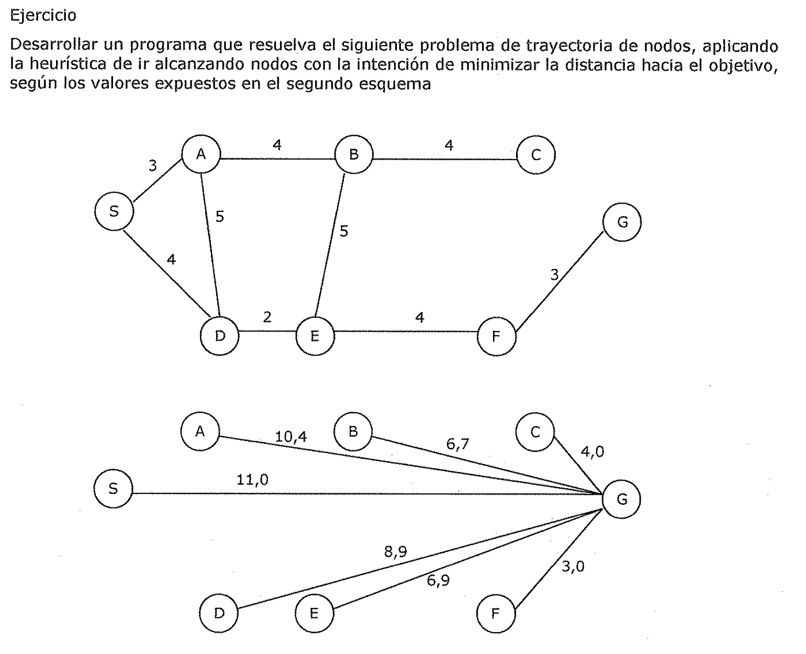

(sec-unit-02-busqueda-y-planificacion-problemas-tipicos-de-escalada)=

## Problemas típicos de escalada

Tanto la *escalada básica* como la de *máxima pendiente* pueden no encontrar una
solución. Cualquiera de los dos algoritmos puede acabar sin encontrar un estado
objetivo, y en cambio encontrar un estado del que no sea posible generar nuevos
estados mejores que el. Esto ocurre si el programa se topa con un ***máxima
local,*** *una* ***meseta*** *o una* ***cresta.***

- Un *máxima local* es un estado que es mejor que todos sus vecinos, pero que no
  es mejor que otros estados de otros lugares. En un máximo local, todos los
  movimientos producen estados peores. Los máximos locales son particularmente
  frustrantes porque frecuentemente aparecen en las cercan\[as de una solución.
  En este caso se denominan estribaciones (foothills).

- Una *meseta* (plateau) es un área plana del espacio de búsqueda en la que un
  conjunto de estados vecinos posee el mismo valor. En una meseta no es posible
  determinar la mejor dirección a la que moverse haciendo comparaciones locales.

- Una *cresta* (ridge) es un tipo especial de máximo local. Es un área del
  espacio de búsqueda más alta que las áreas circundantes y que además posee en
  ella misma una inclinación (la cuál se podría escalar). Pero la orientación.
  de esta region alta, comparada con el conjunto de movimientos disponibles y
  direcciones en la que moverse,

hace que sea imposible atravesar la cresta mediante movimientos simples.

Existen algunas formas de evitar estos problemas, si bien estos métodos no dan
garantías:

- *Vo/ver atrás hacia algún modo anterior e intentar seguir un camino
  diferente.* Es

especialmente razonable si el nodo posee otra dirección que de la impresión de
ser tan prometedora, o casi tan prometedora, como la que se eligió. Para
implementar esta estrategia, se debe mantener una lista de caminos que casi se
han seguido y volver a uno de ellos, si el camino que se ha seguido da la
impresión de ser un callejón sin salida. Este método es especialmente adecuado
para superar máximos locales.

- *Realizar un gran salto en alguna dirección* para intentar buscar en una nueva
  parte del espacio de búsqueda. Este método esta especialmente indicado para
  superar mesetas. Si la única regla aplicable describe pequeños pasos,
  aplicarla varias veces en la misma dirección.

- *Aplicar dos o más reglas antes de realizar la evaluación.* Esto se
  corresponde con movimientos en varias direcciones a la vez. Este método es
  especialmente bueno para superar las crestas. • •

*Incluso con estas tres medidas de primeros auxilios, la esca/ada no es siempre
muy eficaz.* Considere el problema del mundo de los bloques que se muestra en la
Figura 2.8. Asuma la existencia de los siguientes operadores:

- Tomar un bloque y situarlo sobre la mesa.

• Tomar un bloque y situarlo sobre otro.

Suponga que se utiliza la siguiente función heurística:

- Añadir un punto por cada bloque que este sobre aquello en que se supone que
  debe estar.

• Restar un punto por cada bloque que este situado en un lugar incorrecto.

Figura 2.8

| --- | --- | --- |

estado inicial estado final Al usar esta función, el estado objetivo tiene un
valor de 8. El estado inicial tiene un valor de 4 (ya que tiene los puntos
positivos de los bloques C, D, E, F, G y H, y los negativos de los bloques A y
B). Solo es posible realizar un movimiento a partir del estado inicial, mover el
bloque A a la mesa. Este movimiento produce un estado con valor 6 (ya que la
posición de A es correcta y añade un punto en lugar de restarlo). El
procedimiento de escalada acepta este movimiento. En este nuevo estado, existen
tres posibles movimientos que dan lugar a los tres estados que aparecen en la
Figura 2.9. Estos estados tienen las siguientes puntuaciones: (a) 4, b) 4 y (c)
4\. La escalada se detiene ya que estos tres estados tienen puntuaciones más
bajas que el estado actual. El proceso ha encontrado un máximo que no es el
máximo global. En este punto, el problema consiste en que mediante un examen
puramente local de las estructuras de apoyo, el estado actual parece ser mejor
que cualquiera de sus sucesores porque tiene más bloques situados correctamente.
Para resolver este problema, es necesario desmontar la estructura local adecuada
(de B hasta H) porque esta situada en un contexto global inadecuado.

| | | | | | | | |

| --- | --- | --- | --- | --- | --- | --- | --- |

| A | | | | | | | |

| G | | | | G | | | G |

| F | | | | F | | | F |

| E | | | | E | | | E |

| D | | | | D | | | D |

| C | | H | | C | | | C |

| B | | A | | B | A | | B |

| (a) | | | (b) | | | (C) | |

| Figura 2.9 | | | | | | | |

La culpa de este fallo podría recaer en el método de la escalada en sí mismo al
no ser capaz de *"mirar más lejos"* para encontrar una solución, pero también se
podría culpar a la función heurística y tratar de modificarla. La escalada puede
resultar muy ineficiente con espacios problema grandes y escabrosos. Sin
embargo, suele ser adecuado si se combina con otros métodos que consigan que se
mueva correctamente por la vecindad en general.

Ejercicio

Desarrollar un programa que resuelva el siguiente problema de trayectoria de

nodos, aplicando la heurística de ir alcanzando nodos con la intención de
minimizar la distancia hacia el objetivo, según los valores expuestos en el
segundo esquema
