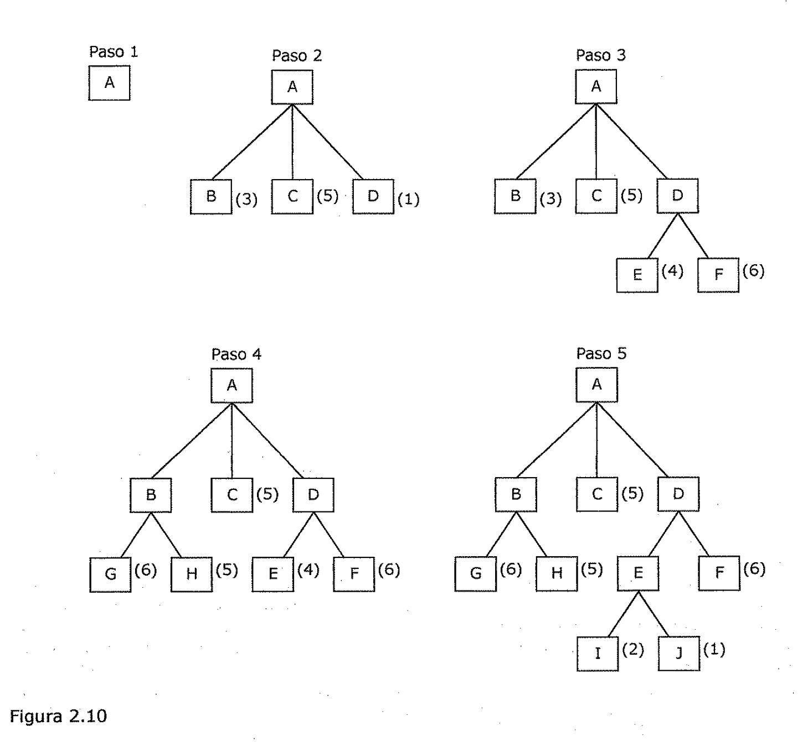
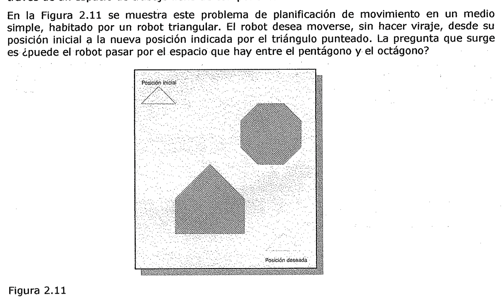
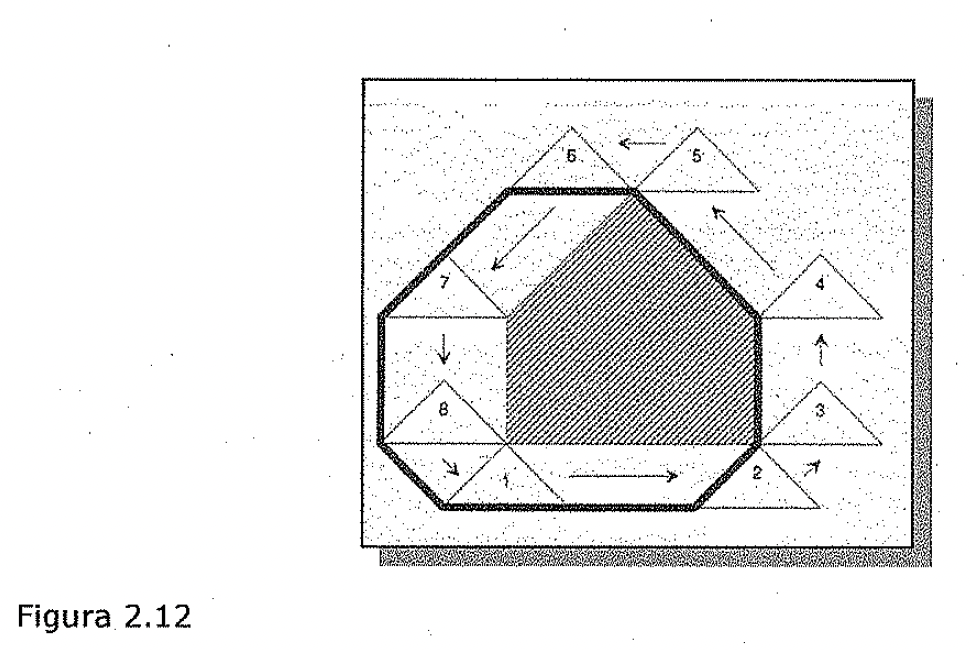
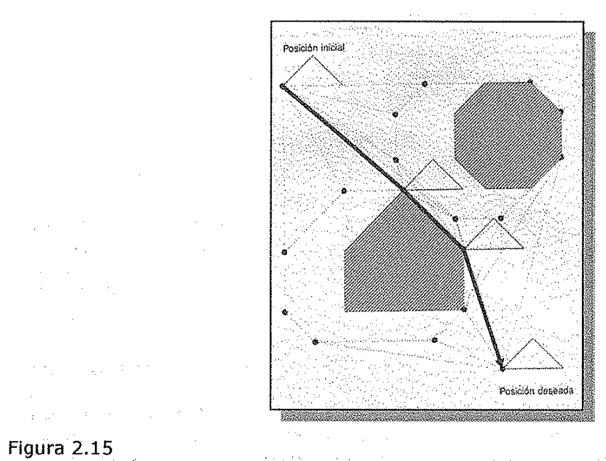

(sec-unit-02-busqueda-y-planificacion-busqueda-el-primero-mejor)=

## Búsqueda el primero mejor

- 1..3. Búsqueda El primero mejor

Hasta este momento, solo se han explicado realmente dos estrategias de control
sistemáticas, la búsqueda primero en anchura y la búsqueda primero en
profundidad. Ahora se explica un nuevo método, la búsqueda de *el primero mejor
(best-first search),* que representa una forma de *combinar las ventajas que
presentan tanto la búsqueda primero en anchura como la primero en profundidad.*
La búsqueda primero en profundidad tiene la ventaja de que permite encontrar una
solución sin tener que expandirse completamente por todas las ramas. La búsqueda
primero en anchura presenta la ventaja de que no queda atrapada en callejones
sin salida. Una forma de combinar ambas ventajas puede consistir en *seguir un
único camino cada vez, y cambiarlo cuando alguna ruta parezca más prometedora
que la que* se *esta siguiendo en* ese *momento.* En cada paso del proceso de
búsqueda el primero mejor, se *selecciona el nodo más prometedor que* se *haya
generado hasta* ese *momento.* Esto se puede conseguir con una función
heurística apropiada. A continuación se expande el nodo elegido aplicando las
reglas para generar a sus sucesores. Si alguno de ellos es una solución, el
proceso termina. Si no es así, estos nuevos nodos se añaden a la lista de nodos
que se han generado hasta ese momento. De nuevo, se selecciona el más prometedor
de ellos y el proceso continua de la misma forma. Lo normal es que la forma de
funcionar se parezca un poco a la búsqueda primero en profundidad al explorar
las ramas. Sin embargo, si no se encuentra una solución, la rama empezara a
parecer menos prometedora que otras por encima de ella y que se habían•
ignorado. En este caso, una rama que previamente se había ignorado aparece ahora
como la• más prometedora y, por lo tanto, comienza su exploración. Sin embargo,
la vieja rama no se olvida. Su último nodo se almacena en el conjunto de nodos
generados pero aun sin expandir.

La búsqueda puede volver a el en el momento en que los otros sean lo
suficientemente malos como para que este sea de nuevo el camino más prometedor
de todos.

Paso 1 Paso 2 Paso 3

Figura 2.10

Paso 4 Paso 5

La Figura 2.10 muestra el comienzo de un proceso de búsqueda el primero mejor.
Inicialmente, solo existe un nodo, de forma que este se expande. Al hacerlo, se
generan tres nodos nuevos. En este ejemplo la función heurística es una
estimación del' *coste* necesario para llegar a una soh.ii:ión a partir del nodo
dado, y se aplica a cada nodo. Como el nodo D es el más prometedor de todos, es
el siguiente que se expande, lo que produce los nuevos nodos, E y F.

La función heurística se aplica, de nuevo, a estos dos nodos. En este punto, el
camino que nace del nodo B parece más prometedor, por lo que se selecciona y se
generan los nodos G y H. De nuevo, al evaluar estos nuevos nodos se observa que
son peores que algún otro, de forma que se vuelve la atención sabre el camino
que va de D a E. Ahora se expande E, y aparecen los nodos I. y J. En el
siguiente paso, el nodo que se expande es J, ya que es el más prometedor de
todos.. El proceso continuaría así hasta que se encontrara alguna solución al
problema.

Este procedimiento es *muy similar al de escalada por la máxima pendiente,*
excepto en dos aspectos. En el método de la escalada, al seleccionar un
movimiento todos los demás se abandonan *y* nunca pueden volver a ser
considerados. Esta es la causa del característico comportamiento del método de
escalada. *En el método de búsqueda de el primero mejor, se sigue seleccionando
un movimiento, pero todos los demás se mantienen de forma que pueden visitarse
si el camino que se ha seleccionado 1/ega a ser menos prometedor.* Ademas de
esto, en la búsqueda de el primero mejor se selecciona el mejor estado
disponible, aun si este estado tiene un valor menor que el del que se estaba
explorando. Esto contrasta con el método de la escalada, en donde el proceso
detiene si no se encuentra un estado sucesor mejor que el estado actual.

A pesar de que el ejemplo anterior emplea un árbol para ilustrar el proceso de
búsqueda el primero mejor, en ocasiones es importante realizar la búsqueda sobre
un grafo de forma que los caminos duplicados no se exploren. Tai algoritmo debe
realizar una búsqueda en un grafo dirigido donde cada nodo representa un punto
en el espacio de estados. Cada nodo contiene además de una descripción de lo que
representa en el espacio de estados, una indicación de lo prometedor que es, un
enlace paterno que apunta al mejor nodo desde el que se ha generado el actual,
*y* una lista de los nodos que se generan a partir de el. El enlace paterno nos
posibilita restablecer el camino hacia el objetivo una vez que se ha encontrado
dicho objetivo. La lista de sucesores hará posible, si se ha encontrado un
camino mejor a un nodo ya existente, propagar la mejora a sus sucesores. A los
grafos de este tipo se ¿es denomina grafos O, ya que cada una de sus ramas
representan caminos alternativos para la resolución del problema.

Para poder implementar un procedimiento de búsqueda sobre un grafo se necesitan
dos listas de nodos:

- ABIERTOS: nodos que se han generado *y* a los que se ¿es ha aplicado la
  función heurística, pero que aun no haya sido examinados (es decir, no se han
  generados sus sucesores). La lista ABIERTOS es, en realidad, una cola con
  prioridad en la que los elementos con mayor prioridad son aquellos que tienen
  un valor más prometedor de la función heurística. Para manipular la lista
  pueden utilizarse las técnicas usuales de manipulación de colas de prioridad.

- CERRADOS: nodos que ya se han examinado. Es necesario mantener estos nodos en
  memoria si lo que se desea es hacer una búsqueda sobre un grafo *y* no sobre
  un árbol, debido a que cuando se genera un nuevo nodo, se debe verificar si
  ese nodo se había generado con anterioridad.

También se necesita una función heurística que haga una estimación de los
méritos de cada uno de los nodos que se van generando. Esto permite que el
algoritmo examine primero los caminos más prometedores. Llamemos a esta función
f ' (para indicar que se trata de una aproximación a la función f, que es la que
proporciona la verdadera evaluación de cada nodo). Para muchas aplicaciones, es
adecuado definir esta función como la suma de dos componentes que denominamos g
*y* h '. La función g es una medida del coste para ir desde el estado inicial
hasta el nodo actual. Nótese que g no es una estimación de nada; su valor es
exactamente la suma de los costes de aplicación de las reglas que se han ido
eligiendo a través del mejor camino hasta el nodo. La función h ' es una
estimación del coste adicional necesario para alcanzar un nodo objetivo a partir
del nodo actual. Este es el lugar en donde se emplea el conocimiento acerca del
dominio del problema. La función combinada f ', representa entonces una
estimación del coste necesario para alcanzar un estado objetivo por el camino
que se ha seguido para generar el nodo actual. Si un nodo puede generarse por
más de un camino, el algoritmo se queda solo con el mejor de ellos. Nótese que,
ya que g *y* h ' deben sumarse, es

- *!* importante que h ' represente una medida del coste de ir desde un nodo
  da.do a una solución (es decir, los nodos buenos poseen valores bajos; los
  nodos malos tienen valores altos) en lugar de una medida de la bondad de un
  nodo (es decir, los buenos nodos tienen valores altos). Sin embargo, eso es
  fácil de arreglar gracias a la buena colaboración de los signos negativos.
  También es importante que g no sea negativa. Si esto no se cumple, los caminos
  que atraviesan ciclos a lo largo del grafo parecerán mejores conforme sean más
  largos.

El funcionamiento del algoritmo es muy simple. Funciona por pasos, expandiendo
un nodo en• cada paso hasta que se genere un nodo que se corresponde con un nodo
objetivo. En cada paso se toma el nodo más prometedor que se tenga en ese
momento *y* que no se haya expandido. Se generan los sucesores del nodo elegido,
se ¿es. aplica la función heurística y se ¿es añade a la lista de nodos
abiertos. Después de verificar si alguno de ellos se hab\[a generado con
anterioridad. Al realizar esta verificación se puede garantizar que los nodos
solo aparecen una vez en el grafo, aunque varios nodos puedan apuntar hacia el
como su sucesor.

Una vez.hecho esto, se empieza con el siguiente paso.

El proceso puede resumirse como sigue.

**Algoritmo: Búsqueda el primero mejor**

1. Comenzar con ABIERTOS conteniendo solo el estado inicial.

2.. Hasta que,;e llegue a un objetivo o no queden nodos en ABIERTOS hacer:

1. Tomar el mejor nodo de ABIERTOS.

1. Generar sus sucesores.

1. Para cada sucesor hacer:

1. Si no se ha generado con anterioridad, evaluarlo, añadirlo a ABIERTOS y

almacenar a su padre.

1. Si ya se ha generado antes, cambiar al padre si el nuevo camino es.

mejor que el anterior. En este caso, se actualiza el coste empleado para
alcanzar el nodo **y** a los sucesores que pudiera tener.

La idea básica de este algoritmo es sencilla. Desafortunadamente, es raro el
caso en que los algoritmos sobre grafos resultan fáciles de escribir
correctamente. **Y** es aún más raro que sea sencillo garantizar la corrección
de tales algoritmos.

**Transformación en el espacio de configuraciones**

La planificación de trayectoria de robot ilustra la búsqueda Para ver como se
puede llevar a la practica el procedimiento de búsqueda el primero mejor,
considere el problema de evitar choques que enfrenta un robot. Antes de que un
robot empiece a moverse en un ambiente desordenado, debe *calcular una
trayectoria entre el lugar* *donde se encuentra y aunque/ donde desea estar.*
Este requisito es valido para la locomoción de todo robot a través de un medio
desordenado y para el movimiento de la mano del robot a través de un espacio de
trabajo lleno de componentes.

En la Figura 2.11 se muestra este problema de planificación de movimiento en un
medio simple, habitado por un robot triangular. El robot desea moverse, sin
hacer viraje, desde su posición inicial a la nueva posición indicada por el
triangulo punteado. La pregunta que surge es puede el robot pasar por el espacio
que hay entre el pentágono y el octágono?

Figura 2.11

Problema de evasión de obstáculo. El problema consiste en mover el pequeño robot
triangular a una nueva posición, que se muestra punteada, sin chocar con el
pentágono o el octágono.

*En dos dimensiones, un truco inteligente simplifica el problema.* La idea
general consiste en redescribir el problema en términos de otra representación
más simple, resolver el problema en dicha representación y redescribir la
solución en términos de la representación original. En conjunto, tomar este
planteamiento es como hacer una multiplicación pasando de los números a sus
logaritmos y viceversa.

*( i* Para evitar obstáculos, la representación original implica un objeto en
movimiento y obstáculos estacionarios, y la nueva representación implica un
punto en movimiento y obstáculos virtuales más grandes llamados **obstáculos del
espacio de configuraciones.** En la Figura 2.12 se muestra como se puede
transformar un obstáculo ordinario en un obstáculo del espacio de
configuraciones utilizando el objeto que se va a mover y el obstáculo que se va
a evitar. Básicamente, se desliza el objeto alrededor del obstáculo, manteniendo
el contacto entre ellos todo el tiempo, y llevando el registro de un punto de
rastreo arbitrario en el objeto en movimiento conforme avanza. Mientras el punto
de rastreo se mueve alrededor del obstáculo, se traza una cerca de ocho lados.
Es evidente que no puede haber colisión entre el objeto y el obstáculo mientras
el punto de rastreo se mantenga fuera de la cerca que rodea al obstáculo del
espacio de configuraciones asociado al obstáculo original.

Figura 2.12

Transformación en el espacio de configuraciones. La línea gruesa muestra la
posición del vértice inferior izquierdo del triangulo pequeño conforme este se
mueve alrededor del grande. Las posiciones numeradas son los puntos iniciales de
cada desplazamiento en línea recta. Si se mantiene el vértice inferior izquierdo
fuera de la línea gruesa se mantendrá el triangulo pequeño alejado del
pentágono.

En la Figura 2.13 se muestran los dos obstáculos del espacio de configuraciones
formados a partir del triangulo original, el pentágono y el octágono de la
Figura 2.11. Se utilizó el vértice inferior izquierdo del triangulo. Es evidente
que el robot puede pasar por la abertura, ya que los obstáculos del espacio de
configuraciones no son lo suficientemente grandes como para cerrar el espacio.

Figura 2.13

Espacio de configuraciones para el problema que se muestra en la Figura 2.11. Si
el punto se mantiene fuera del área sombreada no habrá colisión.

*Sin embargo, no queda de/ todo c/aro si la trayectoria más corta es a través de
la abertura. Para asegurarse que de veras Jo es, usted tiene que efectuar una
búsqueda.* Hasta ahora no existe una red en donde buscar. Sin embargo, su
construcción resulta fácil para problemas de espacio de configuraciones de dos
dimensiones. Para ver por que es fácil, suponga que usted se encuentra en
cualquier punto de un espacio de configuraciones. Desde donde usted esta, puede
ver. la posición deseada o bien no verla. Si puede, entonces no requerirá hacer
más, ya que la trayectoria más corta es la linea recta entre usted y la posición
deseada.

Si no puede ver la posición deseada desde.·donde esta, entonces el único
movimiento que tiene sentido es hacia uno de los vértices.. que puede haber. En
consecuencia, todo movimiento queda restringido de vértice a vértice, excepto al
principio, cuando el movimiento es de la posición inicial a un vértice, y al
final, cuando el movimiento es de un vértice a la posición deseada. Por lo
tanto, la posición inicial, la deseada, y los vértices son como los nodos de una
red. Debido a que los enlaces entre los nodos se colocan.solo.cuando existe una
línea de visión sin obstáculos entre los nodos, la red se conoce como grafo de
visibilidad.

Figura 2.14

En un espacio de configuraciones de dos dimensiones, el punto robot se mueve a
lo largo de las líneas rectas de un grafo de visibilidad. Una búsqueda A\* a
través del grafo de visibilidad produce la trayectoria más corta desde la
posición inicial a la posición deseada. La flecha gruesa muestra la trayectoria
más corta.

En la Figura 2.14 se ilustra el grafo de visibilidad para el ejemplo del
movimiento del robot, junto con el resultado de efectuar una búsqueda A\* para
establecer la trayectoria más corta para el robot del espacio de configuraciones
-un punto- a través del espacio de obstáculos del espacio de configuraciones,
todos ellos de forma extraña. En la Figura 2.15 se muestra el movimiento del
robot real, junto con los obstáculos reales que rodea, todos superpuestos a la
\*\* solución en el espacio de configuraciones.

Si usted permite que el objeto en movimiento gire, puede hacer que varios
espacios de configuraciones correspondan a los diferentes grados de rotación del
objeto en movimiento. Entonces, la búsqueda implicara movimiento no solo a
través del espacio de configuración individual, sino de espacio a espacio.

Figura 2.15

*El movimiento de/ robot esta regido por la trayectoria más corta hal/ada en el
grafo de.* *visibilidad. El vértice inferior izqUierdo def robot triangular, que
se utilizó para producir* *obstáculos de/ espacio de configuraciones, se mueve a
lo largo de la trayectoria más corta.* *Observe que el robot triangular nunca
choca con el pentágono ni con el octágono.* De forma más general aun, cuando
usted necesita mover un brazo que sostiene un objeto, pero en tres dimensiones
en lugar de dos, la construcción de un espacio de configuraciones adecuado
resulta extremadamente complicada desde el punto de vista matemático. Los.
matemáticos amantes de la complicación han producido una copiosa bibliografía
sobre la materia.

1. Reducción de problemas

Algunas veces es posible convertir metas difíciles en una o más submetas más
fáciles de lograr. Cada submeta, a su vez, puede dividirse aún más finamente en
una o más submetas de nivel inferior.
