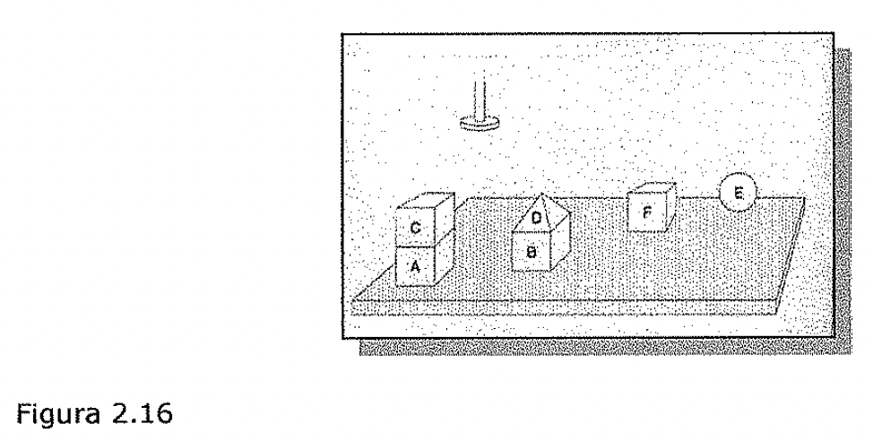
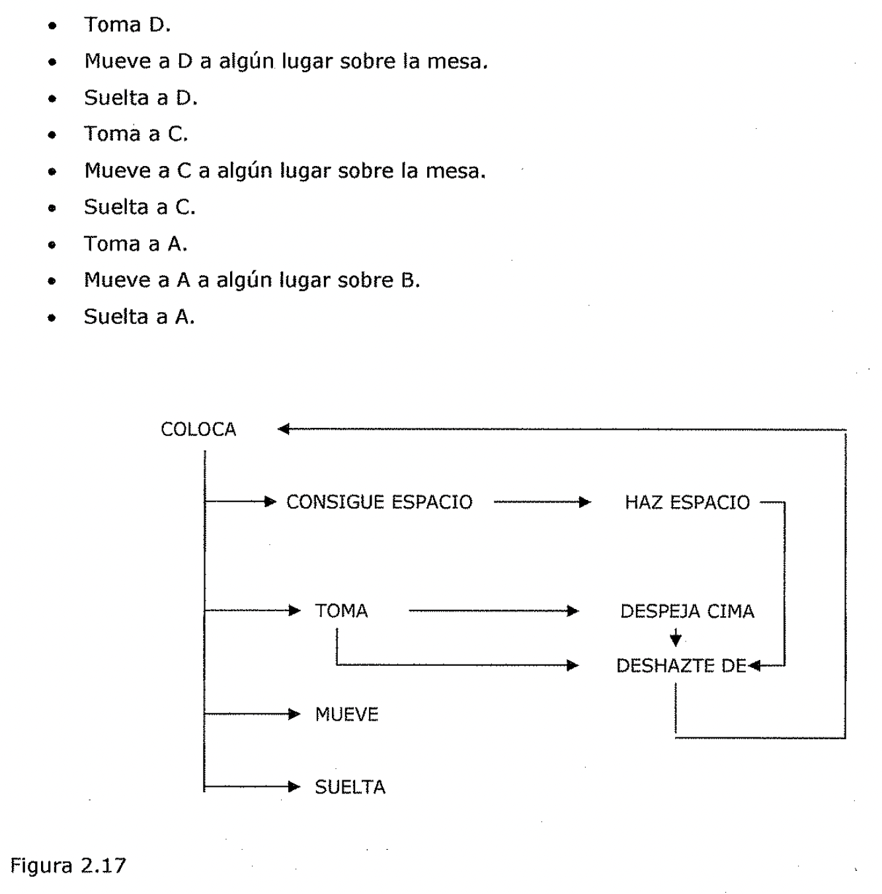
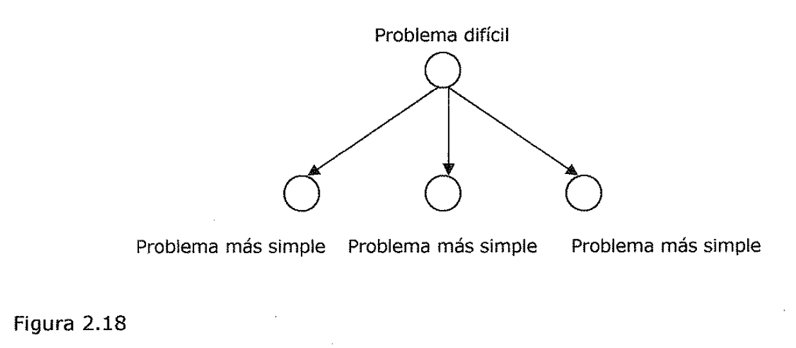
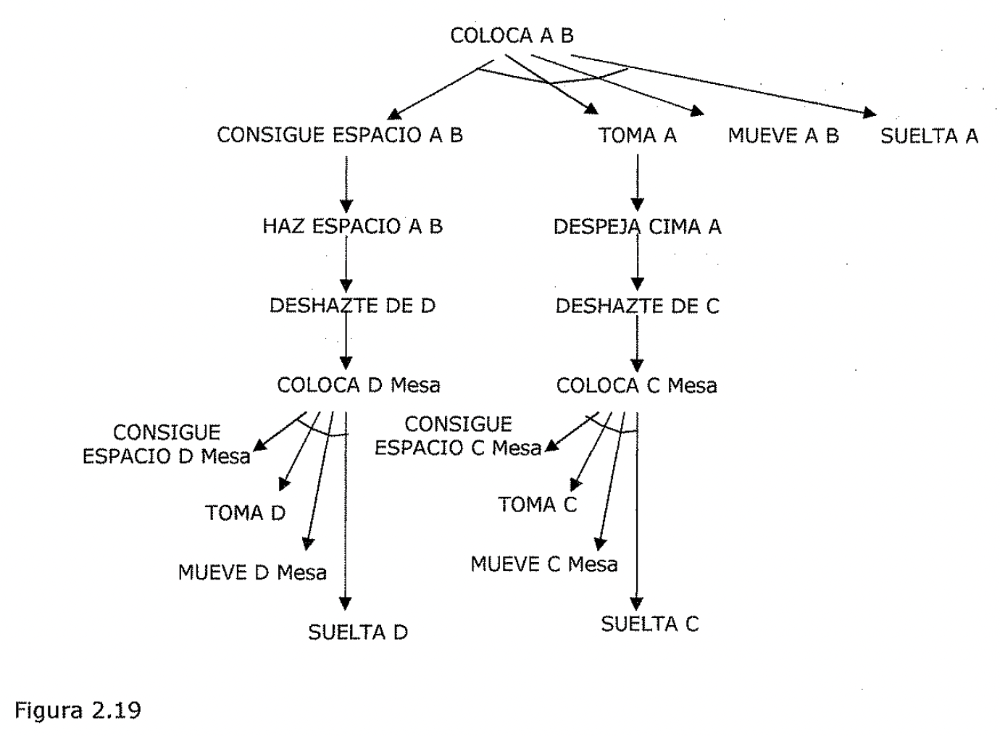

# Reducción de problemas
Cuando se usa el método de reducción de problemas, por lo general se reconocen
las metas y se las convierte en submetas apropiadas. Cuando se usa de ese modo,
la reducción del problema se conoce a menudo y de manera equivalente como
*reducción de metas.*

**Los cubos en movimiento ilustran la reducción de problemas.**

El procedimiento MOVER resuelve problemas de manipulación de cubos y contesta
preguntas acerca de su propio comportamiento. MOVER trabaja con cubos como el
que se muestra en la Figura 2.16, obedeciendo mandatos como el siguiente:

Coloca <nombre del cubo> sobre <otro nombre de cubo>.

Figura 2.16

Para obedecer, MOVER planea una sucesión de movimientos para un robot de una
sola mano que toma solo un cubo a la vez. MOVER consiste en *procedimientos que
reducen los problemas* *dados a otros más simples, aventurándose así en lo que
se conoce coma reducción def* *problema.* De manera conveniente, los nombres de
estos procedimientos son elementos mnemotécnicos para los problemas que el
procedimiento reduce. En la Figura 2.17 se muestra como se ajustan los
procedimientos.

- **COLOCA** hace que se ponga un cubo encima de otro. Funciona mediante la
  activación

de otros procedimientos que hallan un lugar específico en la cima del cubo
destino, toman al cubo que se va a desplazar, lo mueven y lo sueltan en el lugar
especificado.

- **CONSIGUE ESPACIO** encuentra lugar en la cima de un cubo destino para el
  cubo en movimiento.

- **HAZ ESPACIO** ayuda a CONSIGUE ESPACIO, cuando es necesario, moviendo

obstáculos hasta que hay suficiente espacio para el cubo en movimiento.

- **TOMA** agarra cubos. Si la mano robot esta asiendo un cubo cuando se llama a
  TOMA,

este debe hacer que el robot se deshaga de ese cubo. También, TOMA debe hacer
que se despeje la cima del objeto que se va a agarrar.

- **DESPEJA CIMA** limpia la cima. Opera deshaciéndose de todo lo que halla en
  la cima

del objeto que se va a tomar.

- **DESHAZTE DE** aparta obstáculos poniéndolos sobre la mesa.

- **SUELTA** hace que el robot suelte lo que esta a.siendo.

- **MUEVE** traslada objetos, una vez que han sido agarrados, mediante el
  movimiento de

la mano robot.

Ahora imagínese que una petición es colocar el cubo A sobre el B, dada la
situación que se muestra en la Figura 2.16. Evidentemente bastaría con la
secuencia siguiente.

- Toma D.

- Mueve a D a algún lugar sobre la mesa.

- Suelta a D.

- Toma a C.

- Mueve a C a algún lugar sobre la mesa.

- Suelta a C.

- Toma a A.

- Mueve a A a algún lugar sobre B.

- Suelta a A.

COLOCA

1----+: CONSIGUE ESPACIO HAZ ESPACIO

TOMA DESPEJA CIMA

DESHAZTE DE

. MUEVE I . SUELTA

Figura 2.17

La pregunta es:-:cómo *encuentran los procedimientos de MOVER la secuencia
apropiada? He aquí la respuesta:* Primero COLOCA pide a CONSIGUE GUE ESPACIO que
identifique un lugar para el cubo. A encima de B. CONSIGUE ESPACIO se dirige a
HAZ ESPACIO porque el cubo D esta estorbando.

HAZ ESPACIO le pide a DESHAZTE DE que le ayude a desembarazarse del cubo D.
DESHAZTE DE accede y encuentra sitio para el cubo D sobre la mesa y traslada a D
a dicho lugar utilizando a COLOCA.

Note que COLOCA, que se encuentra colocando el cubo A sobre B, finalmente
produce una nueva tarea para el mismo, en esta ocasión para colocar el bloque C
sobre la mesa. Cuando un procedimiento se utiliza a sí mismo, se dice que
recurre. Los sistemas en que los procedimientos se usan a si mismos se conocen
como recursivos.

Una vez retirado el cubo D, HAZ ESPACIO puede encontrar lugar para el cubo A
encima del cubo B. Recuerde que se pidió a HAZ ESPACIO que hiciera esto mediante
CONSIGUE ESPACIO porque COLOCA tiene la tarea de situar el cubo A sobre B.
COLOCA puede proseguir ahora, pidiéndole a TOMA que agarre el cubo A. Pero TOMA
se da cuenta que no puede hacerlo porque el cubo C está en. el camino. TOMA.
llama a DESPEJA CIMA para que le ayude. DESPEJA CIMA, a su vez, solicita la
ayuda de DESHAZTE DE, con lo que DESHAZTE DE hace que el cubo C se traslade a la
mesa mediante COLOCA.

Una vez que se ha despejado el cubo A, DESPEJA CIMA termina su labor. Pero si
hubiera muchos cubos encima de A, y no uno solo, DESPEJA CIMA se dirigiría a
DESHAZTE DE muchas veces, en lugar de una.

Ahora TOMA puede hacer su trabajo y COLOCA puede pedir a MUEVE que traslade el
bloque A al lugar encontrado previamente encima de B. Finalmente COLOCA pide a
SUELTA que libere el bloque A.

***La idea clave de/ método de Reducción de Problemas* es *explorar un árbol de
metas.***

Un árbol de metas, como el que se muestra en la Figura 2.18, es un árbol
semántico en el que los nodos representan metas y las ramas indican la forma en
que usted puede lograr metas, mediante la solución de una o más submetas. Los
hijos de cada nodo corresponden a submetas inmediatas; cada padre de nodo
corresponde a la supermeta inmediata. El nodo superior, que no tiene padre, es
la meta raíz.

Problema difícil

Problema más simple Problema más simple Problema más simple

Figura 2.18

Un *árbol de metas,* coma el de la Figura 2.19, hace transparentes las
complicados argumentos de MOVER. La acción de despejar la cima del cubo A se
muestra coma una submeta inmediata de tomar el cubo A. Despejar la cima del cubo
A es también una submeta de colocar al cubo A en algo'.in lugar encima del cubo
B, pero no se trata de una submeta inmediata.

*Todas las metas que se muestran en el ejemplo se satisfacen solo cuando todas
las* *submetas inmediatas quedan satisfechas. Las metas que se satisfacen solo
cuando* *todas sus submetas inmediatas quedan satisfechas* **se *conocen como
metas Y.*** *Los* *nodos correspondientes son los nodos Y, y se Jes señala
colocando arcos en sus ramas.* *La mayoría de los arboles de metas contienen
también* ***metas* O;** *estas metas se* *satisfacen cuando cualesquiera de sus
submetas inmediatas quedan satisfechas. Los* *nodos correspondientes, que
permanecen sin señalar, se conocen como nodos* 0.

*Finalmente, algunas metas se satisfacen directamente, sin hacer referencia a
ninguna submeta. Estas metas se conocen como* ***metas hoja,*** *y los nodos
correspondientes se* *denominan nodos hoja. C* Debido a que las arboles de metas
siempre implican nodos Y, o nodos 0, o ambos, a menudo se les conoce coma
***arboles Y-O.*** COLOCA AB

CONSIGUE ESPACIO A B

HAZ ESrCIO AB

DESHAITE DE D

TOMA A

DESPEJA CIMA A

DESHArE DEC

MUEVE AB SUELTA A

CONSIGUE ESPACIO D Mesa

COLOCA D Mesa

CONSIGUE ESPACIO C Mesa

COLOCA C Mesa

MUEVE D Mesa MUEVE C Mesa SUELTA D SUELTA

Figura 2.19

- ) **El árbol de metas permite responder a preguntas ¿Cómo? y ¿Por que?**

El programa MOVER es capaz de construir arboles Y-0 ya que los especialistas
mantienen una estrecha correspondencia con metas identificables. De hecho, los
arboles Y-0 de MOVER, son tan ilustrativos que pueden utilizarse para responder
preguntas sobre cómo y por que se han tornado las acciones, otorgando a MOVER
cierto talento para realizar una introspección en su propio comportamiento.

Suponga, por ejemplo, que MOVER coloca el cubo A sobre el B, produciendo el
árbol de metas que se muestra en la Figura 2.19.

Ademas, suponga que alguien pregunta: *I.Como limpiaste la cima de A?*
Evidentemente, una respuesta razonable sería: deshaciendome del cubo C. Por otro
lado, suponga que la pregunta es: *I.par que despejaste la cima de A?* Entonces
una respuesta razonable sería: para tomar el cubo A.

Estos ejemplos ilustran estrategias generales. Para tratar con preguntas de
***"i.cómo?",*** usted identifica en el árbol Y-0 la meta implicada. Si la meta
es una Y, usted da a conocer todas las submetas inmediatas. Si la meta es una 0,
menciona la submeta inmediata que se logró. Para tratar con preguntas de
***"i.Por que?'*** usted identifica la meta y notifica la supermeta inmediata.

## Verificación de restricciones

Muchos de los problemas de IA pueden contemplarse como problemas de
*verificación de* *restricciones (constraint satisfaction)* donde el objetivo
consiste en ***descubrir algún estado*** ***del problema que satisfaga un
conjunto dado de restricciones.*** Ejemplos de este tipo de problemas incluyen
*rompecabezas criptoaritméticos.* El diseño de tareas puede contemplarse también
como problemas de verificación de restricciones en los que el diseño debe
realizarse dentro de unos limites fijos de tiempo, coste y materiales.
