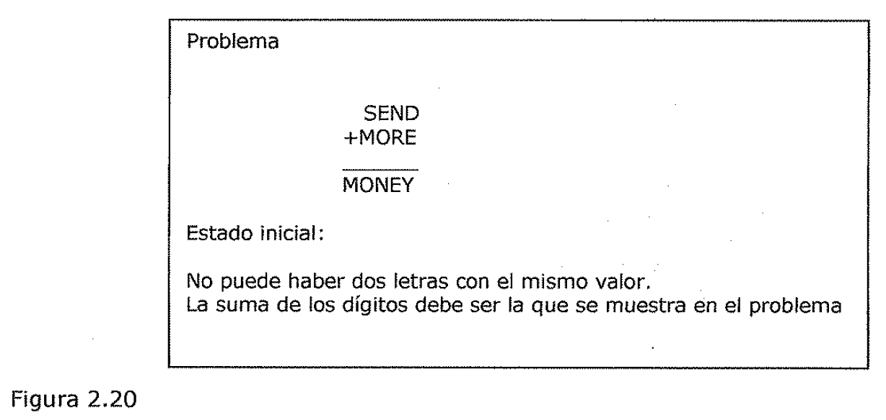
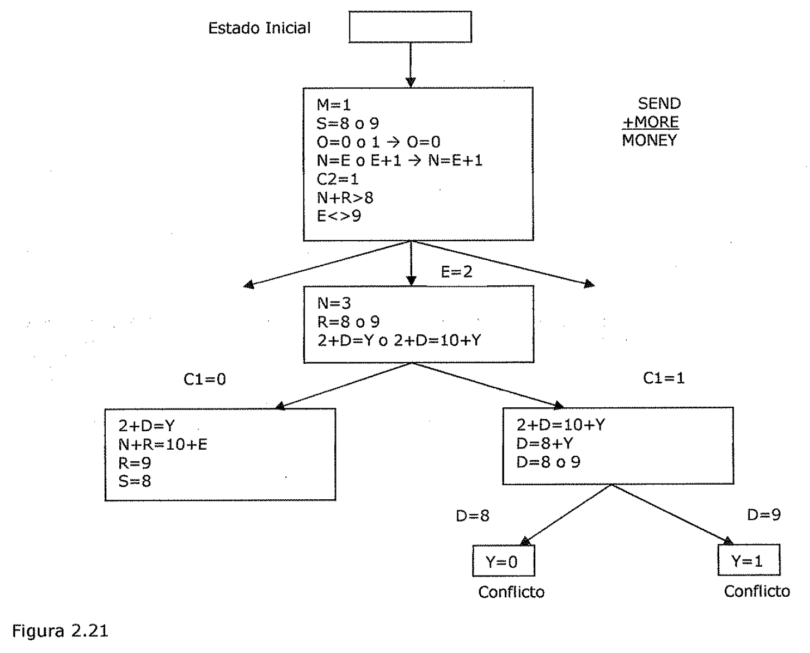

(verificacion-de-restricciones-2)=

# Verificación de restricciones

Al contemplar un problema como una verificación de restricciones, es
frecuentemente posible una reducción sustancial en la cantidad de búsquedas que
se necesitan si se compara con un método que intente formar directamente
soluciones parciales mediante la elección de valores específicos para los
componentes de una eventual solución. Por ejemplo, un procedimiento directo de
búsqueda para resolver un problema criptoaritmético podría trabajar en un
espacio de estados de soluciones parciales en las que a las letras se ¿es
asignan números, que serían sus valores. Entonces, un esquema de control primero
en profundidad podría seguir un camino de asignaciones hasta descubrir una
solución o una inconsistencia. En contraste con esto, un enfoque del tipo de
verificación de restricciones para la resolución de este problema *evita* *hacer
suposiciones o asignaciones de números a letras hasta que sea necesario.* En
lugar de esto, el conjunto inicial de restricciones, las cuales indican que a
cada número puede corresponderle solo una letra y que la suma de los dígitos
debe ser la que se da en el problema, se aumenta primero para incluir las
restricciones que pudieran deducirse de las reglas de la aritmética. Entonces,
aunque se necesiten aun las suposiciones, el número de las que son permitidas se
va reduciendo conforme la búsqueda se va restringiendo.

La verificación de restricciones es un procedimiento de búsqueda que funciona en
un espacio de conjuntos de restricciones. El estado inicial contiene las
restricciones que se dan originalmente en la descripción del problema. Un estado
objetivo es aquel que ha satisfecho las restricciones *"suficientemente",* donde
"suficientemente" debe definirse para cada problema en particular. Por ejemplo,
para la criptoaritmética suficientemente significa que a cada letra se le ha
asignado un único valor.

*El proceso de verificación de restricciones consta de* ***dos pasos.***
*Primera,* **se** C ***descubren las restricciones y* se *propagan tan lejos
como sea posible*** *a través* *def sistema. Entonces,* ***si todavía no hay una
solución, la búsqueda comienza.*** *Se* *hace una suposición sobre algo y
reañade como una nueva restricción. Entonces, la* *propagación continua con esta
nueva restricción, y así sucesivamente.* El **primer paso, la *propagación,***
se hace necesario por el hecho de que normalmente existen dependencias entre las
restricciones. Estas dependencias aparecen porque muchas restricciones hacen
referencia a más de un objeto, y muchos objetos participan en más de una
restricción. Asf, por ejemplo, supongamos que la primera restricción es N = E +
1\. Entonces, si se añade la restricción N = 3, podría conseguirse una
restricción más fuerte para E, que sería E = 2. La propagación de restricciones
también surge debido a la presencia de reglas de inferencia que permiten que se
infieran restricciones adicionales a partir de las que se tenían.

*La propagación de restricciones termina por una razón de entre* dos *posibles.*

- La primera, porque se detecte una contradicción. Si esto ocurre, entonces no
  existe una solución consistente con todas las restricciones conocidas. Si la
  contradicción se refiere

unicamente a aquellas restricciones que se dan como parte de la especificación
del problema (en oposición a aquellas que se creaban como suposiciones a lo
largo de la resolución del problema), entonces no existe solución.

- La segunda razón posible para que termine el proceso es que la propagación se
  realice de tal forma que no puedan hacerse más cambios basándose en el
  conocimiento actual que se posea. Si ocurre así, y todavía no se ha
  especificado adecuadamente una solución, entonces sera necesario que se
  realice algún proceso de búsqueda para

desbloquear el proceso.

En este punto, comienza el **segundo paso.** Para ver la forma de fortalecer las
restricciones, pueden realizarse algunas ***hipótesis.*** En el caso del
problema criptoaritmético, por ejemplo, significa hacer suposiciones sobre un
valor para una cierta letra. Una vez que se ha hecho, debe comenzar de nuevo la
propagación de las restricciones a partir de este nuevo estado. Si se encuentra
una solución, se muestra.

Si aun se necesitan más restricciones, se hacen. Si se detecta alguna
contradicción, puede usarse una *.vuelta-atrás* para intentarlo con una
suposición diferente y comenzar con ella.

Problema

SEND

+MORE MONEY Estado inicial:

No puede haber dos letras con el mismo valor.

La suma de los dígitos debe ser la que se muestra en el problema

Figura 2.20

Considere el problema criptoaritmético que se muestra en la Figura 2.20. El
estado objetivo lo forma un estado problema en el que todas las letras tengan
asignado un número, de forma que se verifiquen todas las restricciones
iniciales.

El proceso de resolución del problema funciona a base de ciclos. En cada ciclo
se realizan dos acciones significativas•:

1. Se propagan las restricciones mediante el uso de reglas correspondientes a
   propiedades aritméticas.

- 1 2. Se le da un valor a alguna letra cuyo valor no haya sido aun determinado.

Inicialmente, las reglas de propagación de restricciones generan las siguientes
restricciones adicionales:

M = 1, puesto que dos números de un solo dígito cada uno de ellos más un acarreo
no pueden totalizar más de 19.

- S = 8 o 9, ya que S+M+C3 > 9 (para que se genere el acarreo) y M = 1, S+l+C3 >
  9, es decir, S+C3 > 8 y C3 es al menos 1.

- 0 = 0, ya que S+M(l)+C3 (\<=1) debe ser al menos 10 para poder generar un
  acarreo y puede ser como mucho 11. Pero como Mes 1, entonces O debe ser 0.

- N = E o E+l, dependiendo del valor de C2. Pero N no puede tener el mismo valor
  que E. Asf, N = E+l y C2 es 1.

- Para que C2 sea 1, la suma de N+R+Cl debe ser mayor de 9, por lo que N+R debe
  ser mayor de 8.

- N+R no puede ser mayor de 18, con su acarreo, y por lo tanto, E no puede ser

9.

En este momento, se asume que no pueden generarse más restricciones. Para poder
progresar a partir de aquí, se deben hacer suposiciones. Suponga que a E se le
asigna el valor 2. (Se elige E porque aparece tres veces y, por lo tanto,
interacciona mucho con las otras letras).

J Ahora comienza el segundo ciclo.

El propagador de restricciones observa lo siguiente:

N = 3, ya que N = E+l.

- R = 8 o 9, ya que R+N(3)+Cl(l o 0) = 2 o 12. Pero como N ya es 3, la suma de
  estos números no negativos no puede ser menor de 3. De esta forma, R+3+(0 o 1)
  = 12 y R•

2+D =Yo 2+D = l0+Y, de la suma de la columna más a la derecha.

De nuevo se asume que no pueden generarse más restricciones, y es necesaria una
suposición.

Suponga que se elige Cl para darle un valor. Si se le da el valor 1, se llega a
un callejón sin salida, tal y como se muestra en la figura. Cuando esto ocurra,
el proceso debe volver atrás e intentar Cl=0.

Este proceso merece que se hagan un par de observaciones. Obsérvese que todo lo
que se necesita de la propagación de restricciones es *que no produzca fa/sas
restricciones.* No es necesario que produzca todas las legales. Por ejemplo, se
podría haber llegado a la conclusión de que Cl era 0. Para llegar a esta
conclusión se podría haber observado que si Cl era 1, aparecería lo siguiente:
2+D=10+Y. Pero si este es el caso, D tendría que ser 8 o 9. Pero tanto S como R
deben ser 8 o 9 y las tres letras no pueden compartir dos valores. De esta
forma, Cl no puede ser 1. Si se hubiera realizado esto inicialmente, se habría
evitado trabajo de búsqueda. Pero como se ha hecho necesario acudir a la
búsqueda, el hecho de que la parte de búsqueda consuma más o menos tiempo que la
propagación de restricciones, depende de lo que se gaste en llevar a cabo el
razonamiento necesario para la propagación de restricciones.

Una segunda observación a tener en cuenta consiste en que normalmente ***existen
dos tipos*** ***de restricciones.*** Las primeras son sencillas: *son una lista
de posibles va/ores para un objeto.* Las del segundo tipo son más complejas:
*describen relaciones entre o eh media de objetos.* Los dos tipos de
restricciones desempeñan el mismo papel en el proceso de verificación de
restricciones, y en el ejemplo criptoaritmético se han tratado de forma
idéntica. En algunos problemas, sin embargo, puede resultar útil la
representación diferenciada de los dos tipos de restricciones. En las sencillas,
las listas de valores de las restricciones son siempre dinámicas, por lo que
deben representarse explícitamente en cada estado del problema. En las más
complicadas, las restricciones que expresan relaciones son dinámicas en el
dominio criptoaritmético, ya que son diferentes para cada problema
criptoaritmético. Pero en otros muchos dominios estas son estáticas.

Estado Inicial

SEND

+MORE MONEY N=3 R=S o 9

2+D=Y o 2+D=10+Y

2+D=10+Y D=S+Y D=S o9

2+D=Y N+R=10+E R=9

M=l S=S o 9

O=0 o 1 ➔ 0=0

N=E o E+l ➔ N=E+l C2=1

N+R>S E\<>9

Figura 2.21

Conflicto

Conflicto

Ejercicio

Desarrollar un programa que resuelva el problema criptoaritmético planteado.

(analisis-de-medios-y-fines)=

## Análisis de medios y fines

Hasta ahora, se. ha presentado una colección de estrategias de búsqueda que
pueden razonar tanto hacia delante como hacia atrás, pero para un problema dado,
se debe elegir una dirección u otra. No obstante, a menudo es apropiado una
mezcla de ambas direcciones. Esta estrategia mix.ta haría posible la resolución,
en primer lugar, de las principales partes de un problema y, después, volver
atrás y resolver los pequeños problemas que surgen al "pegar" juntos los trozos
grandes. Una técnica conocida como *análisis de medias y fines (means-ends
análisis)* supone una ayuda para lograrlo.

El proceso de *análisis de medias y fines* se centra en la *detección de
diferencias entre el estado actual y el estado objetivo.* Una vez que se ha
aislado una diferencia, debe *encontrarse un operador que pueda reducirla.* Es
posible que tal operador no pueda aplicarse en el estado. actual por lo tanto,
se crea el subproblema que consiste en *alcanzar un estado en que pueda
aplicarse dicho operador.* Este tipo de encadenamiento hacia atrás, en donde se
seleccionan los operadores y se producen subobjetivos para establecer las
precondiciones del operador, recibe el nombre de *realización de subobjetivos
para un operador.* Sin embargo, es posible que el operador no produzca
exactamente el estado objetivo que se desea. En este caso, se tiene un *segundo
subproblema* que consiste en *llegar desde ese estado hasta un objetivo.* Pero
si se ha elegido correctamente la diferencia y el operador es realmente eficaz
al reducir la diferencia, estos dos subproblemas serán más fáciles de resolver
que el problema original.
