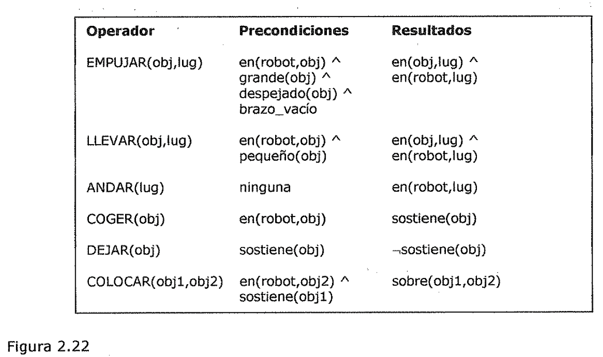
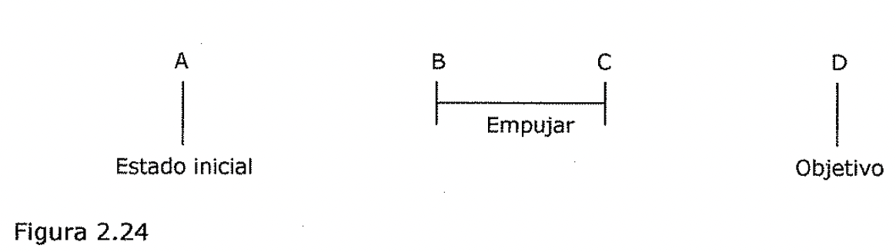

(analisis-de-medios-y-fines-2)=

# Análisis de medios y fines

El proceso de análisis de medios y fines puede entonces aplicarse
recursivamente. Para centrar la atención del sistema en los problemas grandes, a
las diferencias se ¿es asignan niveles de prioridad. Las diferencias de
prioridad mayor deben considerarse antes que las de menor prioridad.

El primer programa de IA que utilizó un análisis de medios y fines fue el
Resolutor General de Problemas (GPS) (Newell y Simon, 1963). El diseño del
sistema estuvo motivado por la observación de las técnicas que usa la gente
cuando resuelve un problema. Sin embargo, GPS es un claro ejemplo de lo difuso
que resulta el limite entre la construcción de programas que simulan la forma de
trabajar humana y la construcción de programas que simplemente resuelven
problemas como pueden.

Al igual que en otras técnicas de resolución de problemas que se han explicado,
el análisis de medias y fines cuenta con *un conjunto de reglas que pueden
transformar un estado problema en otro.* Estas reglas normalmente no se
representan con las descripciones completas de los estados en cada uno de sus
lados. En lugar de esto, se representan con ***un lado izquierdo*** que describe
las condiciones que deben cumplirse para que pueda aplicarse la regla (a estas
condiciones se ¿es denomina *precondiciones de la regla),* y ***un lado
derecho*** que describe aquellos *aspectos de/ estado problema que cambiaran al
aplicar la regla.* Existe.una estructura de datos separada denominada ***tabla
de diferencias*** que *ordena las reglas atendiendo a las diferencias que pueden
reducir.*

**Operador**

EMPUJAR(obj,lug)

**Precondiciones**

en(robot,obj) A grande(obj) A despejado(obj) A brazo_vado en(robot,obj) A
pequeño(obj)

**Resultados**

en(obj,lug) A en(robot,lug) LLEVAR(obj,lug)

ANDAR(lug)

ninguna COGER(obj) DEJAR(obj)

COLOCAR( obj1,obj2)

en(robot,obj2) A sostiene(objeto) en(obj,lug) A en(robot,lug) en(robot,lug)
sostiene(obj) .sostiene(obj) sobre(obj1,obj2)

Figura 2.22

**Operadores del robot**

Considere el case del dominio de un sencillo robot domestico. Los operadores de
que se dispone se muestran en la Figura 2.22, así como sus precondiciones y
resultados. La Figura 2.23 muestra la tabla de diferencias que describe cuando
es apropiado cada operador.

Obsérvese que algunas veces existe más de un operador capaz de reducir una
diferencia dada, {" y que un operador dado puede ser capaz de reducir más de una
diferencia.

| | | | | | | |

| --- | --- | --- | --- | --- | --- | --- |

| | Empujar | Llevar | Andar | Coger | Dejar | Colocar |

| Mueve objeto | * | * | | | | |

| Mueve robot | | | * | | | |

| Desoeia objeto | | | | * | | |

| Pone objeto en objeto | | | | | | * |

| Brazo vacío | | | | | * | * |

| Sujeta objeto | | | | * | | |

Figura 2.23

Tabla de diferencias

Suponga que dado su dominio, se le proporciona al robot el problema de mover un
escritorio de una habitación a otra, con dos objetos encima de el. Los objetos
situados sobre el escritorio deben moverse también. La principal diferencia
entre el estado actual y el estado objetivo debería ser la situación del
escritorio. Para reducir esta diferencia podría escogerse o bien EMPUJAR o bien
LLEVAR. Si se escoge en primer lugar LLEVAR, deben encontrarse sus
precondiciones. Esto proporciona dos diferencias más que deben reducirse: la
localización del robot y el tamaño del escritorio. La situación del robot puede
manipularse con la aplicación de ANDAR, pero no existen operadores que cambien
el tamaño de un objeto (puesto que no se incluye TROCEAR-SEPARAR). Por lo tanto,
este camino conduce a un callejón sin salida. Si se sigue por la otra rama, se
intenta aplicar EMPUJAR.

La Figura 2.24 muestra el progreso realizado por el resolutor del problema en
este punto. Se ha encontrado la forma de hacer algo útil. Pero aun no está en la
posición correcta para realizarlo. Ademas tampoco se llega al estado objetivo.
Por lo tanto, ahora hay que reducir las diferencias entre A y By entre Cy D.

A B C D

Empujar I

Estado inicial Objetivo

Figura 2.24

Progreso del método de análisis de medios y fines

EMPUJAR tiene cuatro precondiciones, dos de las cuales producen diferencias
entre los estados inicial y objetivo: el robot debe situarse en el escritorio y
el escritorio debe estar despejado. Puesto que el escritorio ya es grande y el
brazo del robot esta vado, estas dos precondiciones se pueden ignorar. Se puede
llevar al robot a la posición correcta utilizando CAMINAR, y con dos
aplicaciones de COGER se puede despejar la superficie del escritorio. Pero
después de ejecutar el primer COGER, el intento de realizar un segundo produce
otra diferencia- el brazo debe estar vado. Para reducir esta diferencia puede
usarse DEJAR. Una vez que se ha realizado EMPUJAR, el estado problema esta más
cerca del estado objetivo, pero no mucho. Los objetos deben volver a ponerse
sobre el escritorio. COLOCAR los pondrá allí de nuevo, pero no puede aplicarse
inmediatamente. Debe eliminarse otra diferencia ya que el robot debe estar
sosteniendo los objetos. En la Figura 2.25 se muestra el progreso realizado por
el resolutor de problemas. La diferencia final entre C y E puede reducirse
aplicando ANDAR para que el robot vuelva hacia los objetos, seguido de COGER y
LLEVAR.

A B C E D

I Andar Coger I DejarI Coger IDejar!empujaJ Estado inicial

Colocar Objetivo

Figura 2.25

Mas progresos del método de medios y fines
