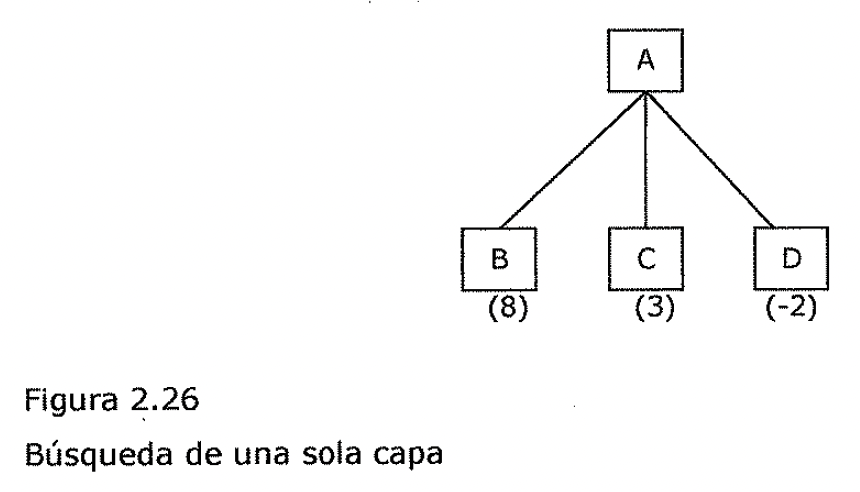
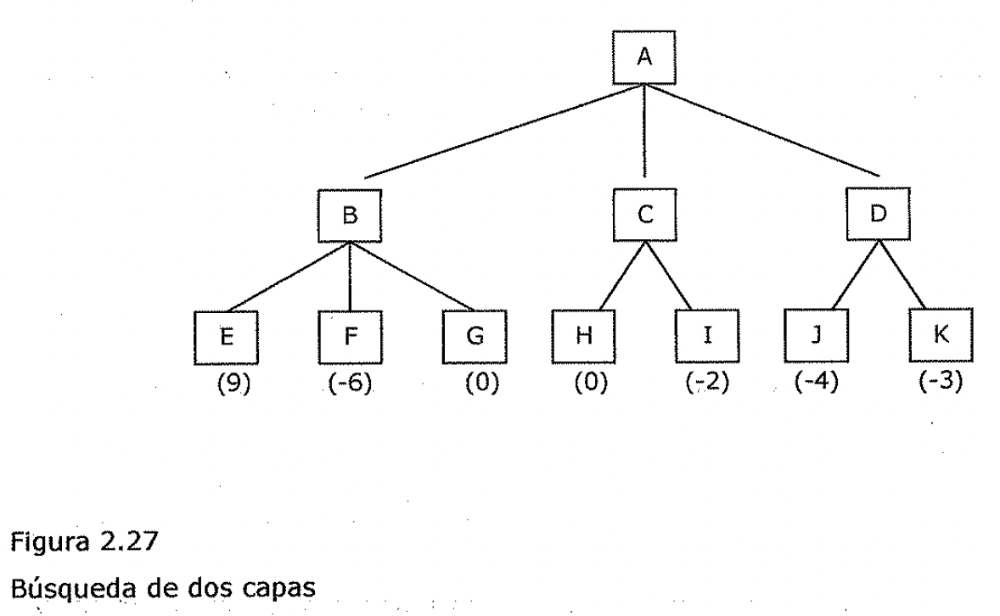
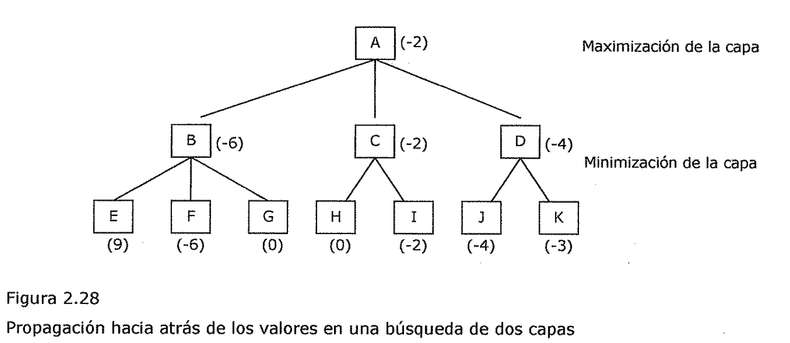

(minimax)=

# Minimax

2.3.2. El procedimiento minimax

*El procedimiento de búsqueda mínimax* es *un procedimiento de búsqueda en
profundidad limitada.* La idea consiste en comenzar en la posición actual y usar
el generador de movimientos plausibles para generar un conjunto de posiciones
sucesivas posibles. Entonces se puede aplicar la función de evaluación estática
a esas posiciones y escoger simplemente la mejor. Después de hacer esto, puede
llevarse hacia atrás ese valor hasta la posición de partida para representar
nuestra evaluación de la misma. La posición de partida es exactamente tan buena
para nosotros como la posición generada por el mejor movimiento que podamos
hacer a continuación. Aquí se va a suponer que la función de evaluación estática
devuelve valores elevados para indicar buenas situaciones para nosotros, de
manera que nuestra meta es *.)* maximizar el valor de la función de evaluación
estática de la siguiente posición del tablero.

En la Figura 2.26 se muestra un ejemplo de esta operación. Supone una función de
evaluación estática que devuelve valores entre -10 y 10, donde 10 indica una
victoria para nosotros, -10 una victoria para el oponente y 0 un empate. Puesto
que nuestra meta es ***maximizar el valor de la función heurística,*** escogemos
movernos a B. Al llevar hacia atrás el valor de B hasta A, podemos concluir que
el valor de A es 8, puesto que sabemos que se puede llegar a una posición con un
*valor* de 8.

Figura 2.26

Búsqueda de una sola capa

Puesto que sabemos que *la función de evaluación estática no es completamente
precisa,* nos gustaría llevar la búsqueda más allá de una sola capa. Esto podría
ser muy importante, por ejemplo, en un juego de ajedrez donde estemos en medio
de un intercambio de piezas.

Después de nuestro movimiento, podría parecer que nuestra situación es muy
buena, pero, si mirásemos un movimiento más allá, veríamos que una de nuestras
piezas también es capturada, por lo que la situación no era tan favorable como
en principio parecía. Por tanto, nos gustaría prever que es lo que sucederá en
cada una de las nuevas posiciones del juego del siguiente movimiento realizado
por el oponente. En lugar de aplicar la función de evaluación estática a cada
una de las posiciones que acabamos de generar, aplicamos a cada una de ellas el
generador de movimientos plausibles, generando un conjunto de posiciones
posteriores para cada una de ellas. Si queremos pararnos ahi, en una previsión
de dos capas, podríamos aplicar la función de evaluación estática a cada una de
dichas posiciones, tal y como muestra la Figura 2.27.

Figura 2.27

9. (-6) (OJ (0) (c2)

Búsqueda de dos capas

Pero ahora debemos tener en cuenta el hecho de que *el movimiento que se realiza
a*. *continuación debe elegirlo el oponente,* y por tanto, deberá propagarse
hacia atrás al siguiente nivel. Supongamos que realizamos el movimiento B.
Entonces el oponente debe elegir entre los movimientos E, F y G. El objetivo del
oponente es ***minimizar el valor de la función de*** ***evaluación,*** por lo
que puede esperarse que elija moverse a F. Esto significa que si hacemos el
movimiento B, la verdadera posición en la que desembocamos en el siguiente
movimiento es muy mala para nosotros. Esto es cierto aunque el.nodo E represente
una posible configuración que fuese buena para nosotros. • • • Pero ya que no
nos toca a nosotros mover en este nivel, no podremos elegirlo. La Figura 2.28
muestra el resultado de propagar los nuevos valores hacia la raíz del árbol. En
el nivel representado por la elección del oponente, se elige el menor valor y se
propaga hasta la raíz. En el nivel que representa nuestra elección se ha elegido
el nivel máximo.

Maximización de la capa

Minimización de la capa

9. (-6) (0) (0) (-2) (-4) (-3)

Figura 2.28

Propagación hacia atrás de los valores en una búsqueda de dos capas

Una vez que se han propagado hacia atrás los valores del segundo nivel, resulta
claro que el movimiento correcto que podemos realizar en el primer nivel, dada
la información disponible, es C, puesto que no hay nada que el oponente pueda
hacer ah\[ para producir un valor peor que -2.

Este proceso puede repetirse para tantos niveles como lo permita el tiempo
disponible, y las evaluaciones más precisas que se produzcan pueden usarse para
elegir el movimiento correcto en el nivel más alto.

*La alternancia de maximización y minimización en capas alternas cuando las
eva/situaciones se* *envían de regreso a la raíz, se corresponde con las
estrategias opuestas que siguen los dos* jugadores y que da a este método el
nombre de\* ***mínimax.*** 2.3.3. El procedimiento alfa-beta
