(sec-unit-02-busqueda-y-planificacion-alfa-beta)=

## Alfa beta

**Adición de la poda alfa-beta**

Recuerde que el procedimiento **mínimax** es un proceso primero en profundidad.
Cada camino se explora tan lejos como lo permita el tiempo, la función de
evaluación estática se aplica a las posiciones del juego en el último paso del
camino, y el valor debe entonces propagarse hacia atrás en el árbol de nivel en
nivel.

*Una de las ventajas de los procedimientos primero en profundidad es que a
menudo* puede mejorarse su eficiencia usando técnicas de ramificación y
acotación, en las que pueden abandonarse rápidamente aquellas soluciones
parciales que son c/claramente peores que otras so/soluciones conocidas.\*
Describimos una aplicación directa de esta técnica en el problema del viajante
de comercio. Para este problema, lo único que se necesitaba era recordar la
longitud del mejor camino que se h.abia encontrado hasta el momento. Si otro
camino parcial sobrepasaba esa cota, se abandonaba. Pero, así como fue necesario
modificar ligeramente nuestro procedimiento de búsqueda para tratar los
jugadores, maximizador y minimizador, también es necesario modificar la
estrategia de ramificación y acotación para incluir dos acotaciones, una para
cada uno de los jugadores.

***Esta estrategia modificada* se *denomina poda a/fa-beta.***

/ Requiere el mantenimiento de *dos valores umbral,* uno que representa la
***cota inferior de/*** . ) ***valor*** que puede asignarse en último término a
un ***nodo maximizante*** (que llamaremos **alfa)** y otro que represente la
***cota superior del, valor*** que puede asignarse a':un ***nodo minimizante***
(que llamaremos **beta).** Para ver como funciona el *procedimiento a/fa-beta,*
consideremos el ejemplo mostrado en la Figura 2.29. Después de examinar el nodo
F, sabemos que el oponente tiene garantizado un resultado de -5 o menos en C
(puesto que el oponente es el jugador minimizador). Pero también sabemos que
tenemos un resultado seguro de 3 o más en el nodo A, donde podemos llegar si
movemos a B. Cualquier otro movimiento que produzca un resultado de menos de 3
es peor que el movimiento a B, y podemos ignorarlo. Con solo examinar F podemos
asegurar que un movimiento en C es peor (sera menor o igual que -5), sin
necesidad de mirar el resultado del nodo G. Asi pues, no necesitamos en absoluto
explorar el nodo G. Naturalmente, puede parecer que la poda de un nodo no
justifica el gasto de grabar los limites y examinarlos, pero si estuviésemos
explorando un árbol de seis niveles, entonces no solo habríamos eliminado un
nodo l'.mico, sino un árbol entero de tres niveles de profundidad.

Maximización de la capa

Minimización de la capa

Figura 2.29 Una poda alfa

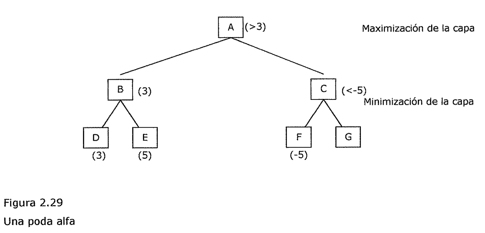

Para ver como pueden usarse los dos umbrales, alfa y beta, consideremos el
ejemplo de la Figura 2.30. Al buscar este árbol, se explora el árbol entero
encabezado por B, y descubrimos que en A podemos esperar un resultado de 3 como
mínimo. Cuando este valor ***alfa*** se pase hacia F, nos permitirá evitar la
exploración de L. Veamos por que.

Después de examinar K, vemos que I proporciona un tanteo máximo de 0, lo que
significa que F produce un mínimo de 0, pero esto es menor que el valor alfa de
3, por lo que no necesitamos considerar más ramas de I. El jugador maximizador
ya sabe que no debe elegir C, y de ahi a I, puesto que si realiza ese movimiento
el tanteo resultante no sera mayor que 0, y en lugar de ello puede lograrse un
tanteo de 3 moviendo a B.

**Veamos ahora como usar el valor de beta.**

Después de podar cualquier exploración posterior de I, se examina J, que produce
un valor de 5, el cuál se asigna a su vez como valor de F (puesto que es el
máximo de 5 y 0). Este valor se convierte en el valor de ***beta*** en el nodo
C. Nos garantiza que C sera 5 o menos. A continuación debemos expandir G. En
primer lugar se examina M que tiene un valor de 7, el cuál se pasa a G como su
valor provisional. Pero ahora se compara 7 con beta (5). Es mayor, y el jugador
que tiene el turno del nodo C esta tratando de minimizar. Por lo tanto ese
jugador no elegirá G, que le conduciría a un resultado de 7 como mínimo, puesto
que hay una alternativa de volver a F, lo que producirá un tanteo de. 5, Asi
pues, no es necesario explorar ninguna de las otras ramas de G. • *A partir de
este ejemplo, se ve que en las niveles maximizantes podemos excluir un
movimiento tan pronto coma quede claro que su valor sera menor que el umbral
actual, mientras que en las niveles minimizantes la búsqueda terminara cuando se
descubran valores mayores que el umbral actual.* Pero la exclusión de un
movimiento posible del jugador maximizante significa realmente podar la búsqueda
en un nivel minimizante. Veamos de nuevo el ejemplo de la Figura.2.30. Una vez
determinado que C es un mal movimiento para A, no nos molestaremos en explorar
G, o cualquier otro camino, en el nivel minimizante por debajo de C.

*Por tanto, la forma en que se usan ahora a/fa y beta consiste en que la
búsqueda en un nivel minimizante puede terminar cuando se descubre un nivel/
menor que a/fa, mientras que en un nivel maximizante la búsqueda puede terminar
al descubrir un valor mayor que beta.* La acotación de la búsqueda en un nivel
maximizante cuando se encuentra un valor alto puede parecer, a.I principio,
opuesto a la intuición, pero si se piensa en que solo llegamos a un nodo
concreto de un nivel maximizante si el jugador minimizante del nivel anterior lo
elige, entonces tiene sentido.

Maximización de la capa

Minimización de la capa

Maximización de la capa

Figura 2.30 Podas alfa y beta

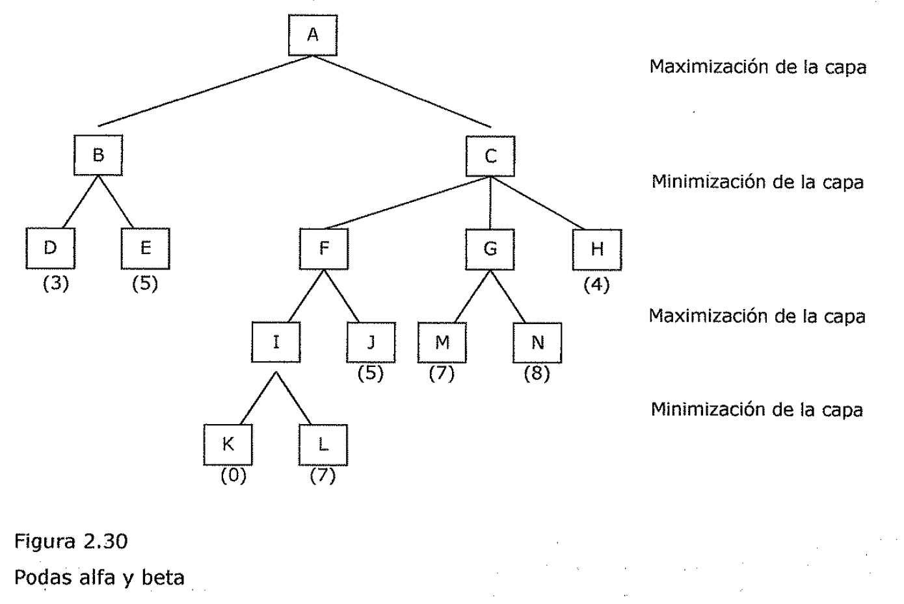

Minimización de la capa

- 1. **Búsqueda con Sistemas evolutivos**

1. **Conceptos de Genética Que son los genes**

El descubrimiento de la naturaleza del material hereditario representaba un hito
importante en el desarrollo de la *Genética.* Sin embargo, el estudio de la
herencia había empezado mucho tiempo antes. Ya durante el siglo **XVIII**
algunos investigadores se habían dedicado a observar la aparición de "monstruos"
resultantes del cruzamiento entre especies animales diferentes, "monstruos" que,
según decían, presentaban una mezcla •de caracteres de los dos animales
progenitores. Después, durante los siglos **XVIII y XIX,** se desarrollaron
mucho, con finalidades económicas los trabajos de mejora de razas animales y
vegetales.

Sin embargo, durante todo ese tiempo, los estudios sobre la herencia no podían
considerarse como verdaderamente científicos. Solo podemos hablar de ciencia
cuando a partir de unos datos experimentales es posible elaborar unas reglas
o!eyes que generalmente permiten predecir comportamientos posteriores. En la
genética premendeliana no ocurría asi: se realizaban cruzamientos al azar, sin
poder predecir las características de la descendencia, En 1866 el fraile
agostino austríaco Gregor Mendel, que había realizado experimentos con plantas
de guisantes durante varios anos, enuncio las leyes de la herencia. Su éxito fue
debido al excelente planteamiento de dos experimentos: en primer lugar, a la
elección de un material adecuado, como es el guisante, para controlar los
cruzamientos, y en segundo. lugar, a haber ' simplificado al máximo los mismos,
dedicándose a estudiar un solo carácter cada vez. De este modo, Mendel llego a
la conclusión de que todo carácter heredable depende de la presencia en las
células del organismo de unos ***"factores hereditarios",*** transmisibles de
padres a hijos y de los que todo organismo posee dos para cada carácter, uno
procedente del padre y otro de la madre.

Consideremos un carácter humano, como es la coloración parda de los ojos. El que
un individuo posea ojos pardos sera debido a que posee en cada célula dos
factores hereditarios determinantes del color pardo, procedentes uno del padre y
otro idéntico de la madre. A su vez, cuando este individuo forme la célula
reproductora que, junto con la procedente de un individuo del otro sexo, dará
lugar al hijo, donara a la misma uno de aquellos *"factores".* (' Las partículas
concretas y finitas que Mendel denomino *"factores hereditarios"* comenzaron a
ser denominadas ***genes*** a partir de 1910.

Actualmente se considera que un *gen* es un fragmento de DNA asociado a
moléculas de proteína en los organismos superiores, que generalmente contiene
información relativa a un carácter heredable del organismo.

**Cromosomas**

La cantidad de DNA contenida en un organismo eucarionte es muy superior a la
contenida en un procarionte. Un problema que se presentara en los primeros es el
modo de transmisión del DNA a las células hijas.

Cuando una célula del eucarionte se halla en reposo, entre una división celular
y la siguiente (r no se advierte ninguna estructura visible en el interior de su
núcleo; ni siquiera mediante el microscopio electrónico. El DNA se halla
disperso en el interior del núcleo, aparentemente en estado de reposo
divisional. Sin embargo, la situación verdadera es muy distinta: en este
estadio, el *material genético* se esta reproduciendo, de modo que cada molécula
de DNA da origen a dos moléculas hijas, que son copias prácticamente exactas de
la primera.

En cuanto la célula comienza su división, el núcleo desaparece y el DNA, hasta
entonces invisible, comienza a apelotonarse de modo regular, formando unas
estructuras muy densas, a modo de bastoncillos dobles, muchas veces en forma de
X, denominadas ***cromosomas.*** El número de estos cromosomas presentes en las
células de un determinado organismo es constante, salvo casos anómalos; así, el
hombre posee 46 de ellos en sus células, al igual que la patata. A medida que la
división celular progresa, los cromosomas se sitúan en el centro de la célula
formando una figura a modo de estrella; seguidamente, cada cromosoma se divide
en sentido longitudinal en dos mitades, yendo cada una a extremos opuestos de la
célula. Por último, los bastoncillos se desapelotonan, los *cromosomas* dejan de
ser visibles y se forman. dos nuevos núcleos (correspondientes a las dos nuevas
células), rodeando a los nuevos cromosomas.

Los cromosomas deben considerarse, pues, como las estructuras formadas por el
DNA para transmitirse a las células hijas.en el transcurso de la división
celular.

Hay, no obstante, otro hecho fundamental a considerar: los cromosomas de una
especie son iguales dos a dos.. Asi, los 46 cromosomas de la célula humana son,
en realidad, 23 parejas de cr.cromosomas homólogos. En cada pareja de cromosomas
homólogos uno procede del padre y el otro de'la madre. Vemos, pues, que existe
un paralelismo entre los *genes y los cromosomas:* así como cada célula tiene
dos cromosomas homólogos, uno procedente del padre y otro de la madre, también
posee dos genes correspondientes a un carácter dado, procedente cada uno de un
progenitor. Esto no es casual: los genes del organismo (constituidos por DNA) se
disponen linealmente a lo largo de los cromosomas, de modo que cada gen se halla
por duplicado en alguna de las parejas de homólogos. Con todo lo dicho, podemos
tener ya una idea global de la relación DNA-gen-cromosoma: el cromosoma es una
organización lineal de genes, formada por DNA y que unicamente se hace visible
cuando, durante la división celular, su grado de engrosamiento es suficiente.

**Mutaciones I**

Las diferencias existentes entre individuos de una misma especie y de especies
diferentes se deben a cambios genéticos denominados ***mutaciones.*** En la
naturaleza, estas mutaciones aparecen de modo espontaneo y, sin duda, no todas
ellas resultan favorables para el individuo. En algunos casos, es posible que
los individuos sujetos a mutaciones se hallen en situación desfavorable respecto
del resto de la población y, aunque no necesariamente sujetos a una eliminación
rápida desaparecerán finalmente. En otros casos, la mutación representara para
los individuos que la posean una mejora y, al reproducirse más fácilmente que el
resto de la población, pasaran más o menos tarde a constituiría por entero.

La evolución de la vida en la Tierra ha sido debida a la existencia de
*mutaciones.* Estas, aunque en muchos casos son causa de muerte, en otros lo son
de progreso, al permitir la aparición de genes que informan acerca de nuevas
funciones. Asi, a lo largo de millones de años ha sido posible una revolución
que ha originado formas vivas tan diferentes como las existentes hoy. Esa
*evolución* se produce frecuentemente en el sentido positivo de progreso, el
cuál es preciso concebirlo como una más eficaz relación entre organismo y medio
ambiente. Sin embargo, las características del medio ambiente pueden cambiar
hasta hacer que tal ·1 eficacia se anule. Por eso, las especies vivas no solo
aparecen, sino que también desaparecen cuando una situación favorable se torna
desfavorable. Esto, que ha ocurrido durante toda la historia de la vida en la
Tierra, ocurre también ahora y el hombre no se halla exento de la regla.

**Mutaciones II**

Desde el punto de vista de la genética de poblaciones, las mutaciones son
cambios heredables que ocurren en el genotipo. Estos cambios se producen por
casualidad, en el sentido de que el ambiente no puede influir.sobre el tipo de
mutación producida, pero la tasa de mutaciones sí puede ser influida por
factores ambientales (como la radiación) y también los distintos genes tienen
tasas distintas de mutación por razones que se relacionarían con la composición
química del gen en cuestión y con su posición en el cromosoma. La tasa medio de
mutaciones detectables en el fenotipo esta comprendida entre 1 en 1000 y 1 en
1000000 de gameto por generación, según el alelo de que se trate. Si suponemos
que existen unos 100000 genes ***(pares de alelos)*** en cada ser humano, cabe
suponer que cada recién nacido es portador de dos mutaciones nuevas. Asi, aunque
la incidencia de mutaciones en cada gen en,particular es pequeña, la cantidad de
mutaciones nuevas por cada generación de la población es muy grande. Las
mutaciones suelen considerarse la materia prima de los cambios evolutivos;
·ellas introducen variaciones sobre las que actúan otras fuerzas evolutivas,
pero no determinan. la dirección del cambio evolutivo.

**El lenguaje de la vida**

Hasta 1950 se sabia que las características de los seres vivos vienen
determinadas por los genes. Se sabia que estos están constituidos por lo que se
denomina proteínas y ácidos nucleicos. Pero hasta 1950, los *genes* son
considerados como estructuras extremadamente . complejas, en tres dimensiones,
cada una de las cuales sería completamente diferente de las demás. La
ext.extraordinaria revelación de los años cincuenta fue demostrar que esta
complejidad infinita es debida simplemente a la combinatoria de un número mUy
pequeño• de unid;3des químicas, *de cuatro pequeñas moléculas.* Estas cuatro
unidades se repiten por millones. a lo largo de la fibra cromosómica. Se
combinan y permutan hasta el infinito como las letras de un alfabeto a lo largo
de un texto.

Del mismo modo que una frase constituye un segmento de un texto, de\<igual
manera un *gen* corresponde a una cierta secuencia de *signos químicos.* En
ambos casos, un símbolo aislado no representa nada; solo la combinación de los
signos adquiere.un *"sentido'.'.* En ambos casos, una secuencia dada, frase o
gen, se inicia y se termina con signos específicos de *''puntuación".* La
traducción de la secuencia nucleica en secuencia proteica es \<comparable a la
traducción de un mensaje que llega, cifrado en Morse, pero que solo tiene
sentido una vez.que ha sido traducido al español, por ejemplo. Dicha traducción
se efectúa mediante una *"clave"'que* da la equivalencia de los *"signos"* entre
los dos *"alfabetos'* nucleico y proteico.

La clave genética se conoce hoy perfectamente. Cada unidad proteica corresponde
a un ***"triplete",*** es decir, una combinación particular de tres entre las
cuatro unidades nucleicas.

Como existen 43 = 64 combinaciones posibles de tres unidades nucleicas, el
*"diccionario" (* genético contiene 64 *"palabras".* Tres de estos tripletes
aseguran la *"puntuación'* es decir, indican, en la cadena nucleica, el inicio y
el fin de las *"frases"* que corresponden a las cadenas proteicas. Cada uno de
los otros tripletes "representan " una de las unidades proteicas. Como el número
de dichas unidades esta limitado a 20, cada una de ellas responde a varios
tripletes, a varios sinónimos en el diccionario, de lo que se deriva cierta
flexibilidad en la escritura de la herencia.

Con todo ello se pone de manifiesto que todos los organismos, de la bacteria al
hombre, son capaces de interpretar correctamente cualquier mensaje genético. La
clave genética parece universal y su secreto conocido por todo el mundo
viviente.

Existe, pues, una analogía muy sorprendente entre los dos sistemas, genético y
lingüístico, ya que, por una parte, se observa una estricta colinearidad de los
fenómenos del codificación y que, por otra parte, nos encontramos ante una
combinatoria de elementos, fonemas o radicales químicos, que aislados no
significan nada y que solo toman un sentido cuando se combinan con otros
elementos. Todavía pueden ponerse en evidencia analogías más profundas, ya que
es posible, en ambos casos reducir las relaciones entre elementos, fonemas o
radicales químicos a sistemas de oposición binaria, y que en ambos casos se
encuentran niveles de construcción jerarquizados por unidades de rango inferior.
Se trata, pues, de saber en que medida todas estas semejanzas traducen o no algo
más que una analogía. El destacado lingüista Roman Jakobson encuentra dicha
analogía tan sorprendente que duda que sea debida al azar. Se pregunta si, de
alguna forma, el sistema del lenguaje no se ha modelado sobre el de la herencia.
t"

**Crossing Over**

El ***crossing over*** es el intercambio de porciones de cromosomas homólogos y
tiene lugar al comienzo de la meiosis.

Con el descubrimiento de los *crossover,* no solo se empezó a comprender que los
genes están en los cromosomas, como había supuesto Sutton, sino también que
tienen que hallarse en. determinados sitios o *loci* (singular, locus) en los
cromosomas. Ademas, los alelos de cualquier gen en particular tienen que ocupar
loci concordantes en cromosomas homólogos. De lo contrario, el intercambio de
porciones de cromosomas ocasionaría un caos genético, en lugar de un intercambio
exacto de *alelos.* Sturtevant postulo:

1. que los genes están dispuestos en una serie lineal en los cromosomas como las
   cuentas de

un collar

1. que los genes que están. muy próximos se habrán de separar mediante *crossing
   over* con *c*

menos frecuencia que los genes más distantes

1. que determinando, por lo tanto, las frecuencias de las *recombinaciones,* se
   podría establecer la secuencia de los genes a lo largo del cromosoma y las
   distancias relativas entre ellos.

**Migración: flujo de genes**

Flujo de genes es *el movimiento de alelos* hacia y desde una población.como
consecuencia de la *inmigración o emigración* de individuos reproductivos o, en
el caso de las plantas, la introducción de gametos (por medio del polen)
procedentes de otras poblaciones. La inmigración puede introducir alelos nuevos
en una población o modificar las frecuencias de los alelos. Su efecto global *es
reducir la diferencia entre las poblaciones,* mientras que la ' ***se/elección
natural*** tiende a *acentuar las diferencias* al producir poblaciones más aptas
para distintas condiciones locales. En consecuencia a menudo el flujo genético
contrarresta la selección natural y, como veremos, también puede inhibir la
*especiación.*

**Modalidades de la Evolución**

La selección natural produce distintas modalidades de evolución. Puede originar
*fenotipos* muy distintos en organismos íntimamente emparentados, fenotipos muy
similares en organismos que son parientes lejanos, o los organismos mismos
pueden convertirse en las fuerzas de selección por medio de sus interacciones
con otras especies.

*Evolución divergente* La evolución divergente ocurre cuando una población queda
aislada del resto de la especie y, a causa de determinadas presiones de
selección, emprende un curso evolutivo distinto.

Evolución convergente

Muchas veces los organismos que ocupan ambientes similares vienen a asemejarse
entre ellos aunque filogenéticamente tengan un parentesco muy distante. Al estar
sujetos a presiones de selección similares, exhiben adaptaciones similares.

Evolución paralela

La evolución paralela se emplea para describir una situación en la cuál los
linajes han I cambiado de maneras similares, de modo que los descendientes
evolucionados se •parecen tanto entre ellos como lo fueron sus antepasados.

Coevolucion

Cuando dos o más poblaciones interactúan de manera tan intima que cada una de
ellas ejerce una potente fuerza selectiva sobre la otra, ocurren ajustes
simultáneos que producen coevolución.

1. **Algoritmos Genéticos**

Los ***Algoritmos Genéticos (AG)*** son métodos adaptativos que pueden ser
utilizados para implementar búsquedas y problemas de optimización. Ellos están
basados en los procesos genéticos de organismos biológicos, codificando una
posible solución a un problema en un ***"cromosoma"*** compuesto por una cadena
de bits o caracteres.

Estos cromosomas representan individuos que son llevados a lo largo de varias
***generaciones;*** en forma similar a las. poblaciones naturales, evolucionando
de;acuerdo a los principios de ***selección natural* y *"supervivencia"*** del
más apto, descritos pbr primera vez por Charles· J Darwin en su libro "Origen de
las Especies". Emulando estos procesos, los Algoritmos Genéticos son capaces de
"evolucionar" soluciones a problemas del mundo real.

En la naturaleza, los individuos compiten entre si por recursos tales como
comida, agua y refugio. Adicionalmente, los animales de la misma especie
normalmente antagonizan para obtener una pareja. Aquellos individuos que tengan
más éxito tendrán probablemente un número mayor de descendientes, por lo tanto,
mayores probabilidades de que sus genes.sean propagados a lo largo de sucesivas
generaciones. La combinación de características de los padres bien adaptados, en
un descendiente, puede producir muchas veces un nuevo individuo mucho mejor
adaptado que cualquiera de sus padres a las características de su medio
ambiente.

Los Algoritmos Genéticos utilizan una analogía directa del fenómeno de evolución
en la naturaleza. Trabajan con una ***población de individuos,*** cada uno
representando una posible solución a un problema dado. A cada individuo se le
asigna una ***puntuación de. a,adaptación'.*** dependiendo de que tan buena fue
la respuesta al problema. A los más adaptados ·se ies da la oportunidad de
reproducirse mediante cruzamientos con otros individuos de la población,
produciendo descendientes con características de ambos padres. los miembros
menos adaptados poseen pocas probabilidades de que sean seleccionados para la
reproducción, y desaparecen.

Una nueva población de posibles soluciones es generada mediante la *selección*
de los mejores individuos de. la generación actual; emparejándolos entre ellos
para producir un nuevo conjunto de individuos. Esta nueva generación contiene
una proporción más alta de las características poseídas por los mejores miembros
de la generación anterior. De esta forma, a.

lo largo de varias generaciones, las características buenas son difundidas a lo
largo de la población mezclándose con otras. Favoreciendo el emparejamiento de
los individuos mejor adaptados, es posible recorrer las áreas más prometedoras
del espacio de búsqueda. Si el Algoritmo Genético ha sido diseñado
correctamente, la población convergerá a una solución óptima o casi óptima al
problema.

Los dos procesos que más contribuyen a la evolución son el ***crossover*** y la
adaptación basada en la ***selección.*** La ***mutación*** también juega un
papel significativo, pero determinar que tan importante sea su rol, continua
siendo una materia de debate (algunos se refieren a ella como un operador en
background), ella no debe ser utilizada demasiado, ya que el Algoritmo Genético
se puede convertir en una búsqueda al azar, pero su utilización asegura que
ningún punto en el espacio de búsqueda tiene probabilidad O de ser examinado.

En la practica, se puede implementar este modelo, utilizando matrices de bits o
caracteres para representar los cromosomas. Operaciones sencillas de bits
permiten efectuar el crossover, la mutación y otras operaciones. A pesar de que
una gran cantidad de investigación ha sido realizada en cadenas de longitud
variable y otras estructuras, la mayor parte del trabajo con AG ha sido enfocado
en cadenas de caracteres de ***longitud fija,*** Se hace énfasis en este aspecto
y en la necesidad de codificar la solución como una ***cadena de caracteres.***
Generalmente, los AG son implementados siguiendo el siguiente ciclo:

1. Generar aleatoriamente la población inicial

1. Evaluar la adaptación de todos los individuos en la población.

1. Crear una nueva población efectuando operaciones como crossover, reproducción
   proporcional a la adaptación y muta.i;iones en los individuos cuya adaptación
   acaba de ser medida.

1. Eliminar la antigua población.

1. Iterar utilizando la nueva población, hasta que la población converja. Cada
   iteración de este bucle es conocida como ***generación.*** La primera
   generación de este

proceso es una población de individuos generados al azar. Desde ese punto, los
operadores genéticos, en unión con la medida de adaptación, actúan para mejorar
la población. • Generación de la Población Inicial

Mejores Individuos

Figura 2.31

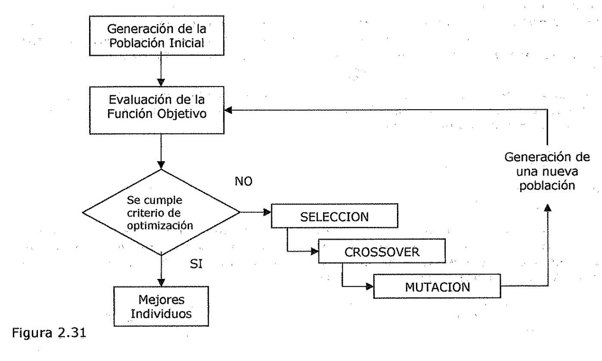

| --- | --- | --- |

| Evaluación de la Función Objetivo | | |

| | Generación una nu | |

ión de eva población SELECCION

CROSSOVER

MUTACION

Los Algoritmos Genéticos no son la (mica técnica basada en una analogía de la
naturaleza. Por ejemplo, las.Redes Neurales están basadas en el comportamiento
de las neuronas en el cerebro. Pueden ser utilizadas en una · gran variedad de
tareas de clasificación, como reconocimiento de patrones o proceso de imágenes.
Actualmente está en investigación la utilización de Algoritmos Genéticos para el
diseño de Redes Neurales.

El poder de los Algoritmos Genéticos proviene del hecho de que la técnica es
robusta, y puede manejar exitosamente un amplio rango de problemas, incluso
algunos que son difíciles de· resolver por otros métodos. Los Algoritmos
Genéticos no garantizan que encontraran la solución óptima al problema, pero son
generalmente buenos encontrando soluciones aceptables a problemas en corto
tiempo. Donde existan técnicas especializadas para la resolución de problemas,
estas superaran fácilmente a los Algoritmos Genéticos tanto en velocidad como en
precisión.

El campo principal de aplicación es donde no existan este tipo de técnicas.

\\ **Diferencias entre los Algoritmos Genéticos y los métodos tradicionales.** I
Los Algoritmos Genéticos tienen cuatro diferencias principales con los métodos
más utilizados o conocidos de optimización y búsqueda:

1 • Trabajan con una codificación del conjunto de parámetros, no con estos
directamente. • Buscan simultáneamente la solución en una población de puntos,
no en uno solo.

• Utilizan la función objetivo (rendimiento), no derivadas u otro conocimiento
auxiliar.

I • Utilizan reglas de transición probabilísticas, y no determinísticas.

2.4.3. Poblaciones

**Codificación**

Las partes que relacionan un Algoritmo Genético con un problema dado son la
codificación y la función de evaluación.

Si un problema puede ser representado por un ***conjunto de parámetros***
*(conocidos coma genes),* estos pueden ser unidos para formar una ***cadena de
va/ores*** *(cromosoma),* a este proceso se le llama ***codificación.*** En
genética este conjunto representado por un cromosoma en particular es referido
como ***genotipo,*** este contiene la información necesaria para construir. un
organismo, conocido como ***fenotipo.*** Estos mismos términos se aplican en
Algoritmos Genéticos, por ejemplo, si se desea diseñar un puente, el conjunto de
parámetros especificando el diseño es el genotipo, y la construcción I final es
el fenotipo. La adaptación de cada individuo depende de su fenotipo, el cuál se
puede inferir de su genotipo, es decir, puede calcularse desde el cromosoma
utilizando la función de evaluación.

I Por ejemplo, si se tiene un problema de maximizar una función de tres
variables, F(X,Y,Z), se podría representar cada variable por un número binario
de 10.bits, obteniéndose un I cromosoma de 30 bits de longitud y 3 genes.

Existen varios aspectos relacionados con la codificación de un problema a ser
tomados en cuenta en el momento de su realización:

• Se debe utilizar el alfabeto más pequeño posible para representar los
parámetros, normalmente se utilizan dígitos binarios.

- Las variables que representan los parámetros del problema deben ser
  discretizadas

para poder representarse con cadenas de bits, hay que utilizar suficiente
resolución para asegurar que la salida tiene un nivel de precisión adecuado, se
asume que la discretización es representativa de la función objetivo.

- La mayor parte de los problemas tratados con Algoritmos Genéticos son no
  lineales y muchas veces existen relaciones *"ocultas"* entre las variables que
  conforman la solución. Esta interacción es referida como ***epistasis,*** y es
  necesario tomarla en cuenta

para una representación adecuada del problema. El tratamiento de los genotipos
inválidos debe ser tornado en cuenta para el diseño de la codificación.
Supóngase que se necesitan 1200 valores para representar una variable, esto
requiere al menos 11 bits, pero estos codifican un total de 2048 posibilidades,
*"sobrando"* 848 patrones de bits no necesarios. A estos patrones se ¿es puede
dar un valor cero de adaptación, ser substituidos por un valor real, o eliminar
el cromosoma.

2.4.4. Operadores genéticos

Los Operadores genéticos son las distintas funciones que se aplican a las
poblaciones, las cuales permiten obtener poblaciones nuevas:

Los tipos de operadores más usados son:

- Selección

- Crossover

- Mutación

- Migración

- Otros operadores

**Selección**

Determina como los individuos son elegidos para el apareamiento. Si se usa un
método de ' selección que elija a los mejores individuos entonces la población
convergerá hacia estos individuos pero estos no representan la solución,
entonces se seleccionan individuos, que a pesar de no ser los mejores, tienen
algún tipo de material genético bueno en ellos.

Los métodos de selección más comúnmente usados son el método de la ruleta,
torneos o ranking.

**Crossover**

Consiste en el intercambio de material genético entre dos cromosomas. El
crossover es el principal operador genético, hasta el punto que se puede decir
que no es un algoritmo genético ' si no tiene crossover, y.sin embargo, puede
serlo perfectamente sin mutación. La propuesta primaria del operador crossover
es obtener material genético de las generaciones anteriores para las siguientes
generaciones.

Para aplicar el crossover, entrecruzamiento o recombinación, se escogen
aleatoriamente dos miembros de la población. No pasa nada si se emparejan dos
descendientes de los mismos padres, ello garantiza la perpetuación de un
individuo con buena puntuación. Sin embargo, si esto sucede demasiado a menudo,
puede crear problemas, ya que toda la población puede aparecer dominada por los
descendientes de algún gen.

La forma básica de este operador toma dos individuos y corta sus cromosomas en
una posición seleccionada al azar, para producir dos segmentos anteriores y dos
posteriores, los posteriores se intercambian para obtener dos cromosomas nuevos.
Esto es conocido como *crossover de un* *punto. (*

**Puntos de -Crossover**

**PADRES**

101 0111 110 1110

HIJOS 101 1110 110 0111

Figura 2.32

Otros métodos de crossover son también aplicables, como los crossover de
múltiples puntos, uniforme o cíclico.

**Mutación**

La mutación es la alteración en forma aleatoria de un individuo de la población.
Esto es necesario para que no se produzca una convergencia prematura y que todos
los individuos de la población no tengan probabilidad cero de ser utilizados.

Este operador se aplica eventualmente a algunos individuos para cambiar
aleatoriamente una parte de su material genético e introducir diversidad a la
población.

No hace falta decir que no conviene abusar de la mutación. Es cierto que es un
mecanismo generador de diversidad, y por lo tanto, la solución cuando un
algoritmo genético esta estancado, pero también es cierto que reduce el
algoritmo a una búsqueda aleatoria.

Descendiente

Descendiente mutado

Punto de Mutación

1010010

1010110

Figura 2.33

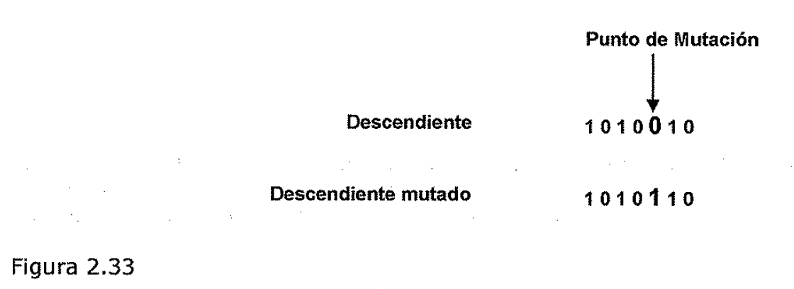

- ) **Migración**

La migración es el operador que genera un intercambio de individuos entre
subpoblaciones. Este operador es aplicable en el caso de desarrollar una técnica
de Algoritmos Genéticos Paralelos para la resolución de un problema.

Al recibir individuos de otras subpoblaciones (migración) se introduce la
diversidad y se incrementa la presión de la selección (se aumenta la competencia
por sobrevivir) en cada *!* subpoblación. Esto es muy útil para evitar
convergencias prematuras a óptimos locales. Sin embargo, si la subpoblación ha
llegado a un estado de equilibrio, la introducción de nuevo material puede no
ser efectiva porque es posible que cada subpoblación haya encontrado un nicho
adecuado **y** se hayan formado especies distintas.

**2.4.5. Función de evaluación**

Dado un cromosoma, la función de evaluación consiste en asignarle un valor
numérico de ***"adaptación",*** el cuál.se supone que es.proporcional a la
*"utilidad"* o *"habilidad"* del individuo representado. En muchas casos, el
desarrollo de una función de evaluación involucra hacer una simulación, en
otros, la función puede estar basada en el rendimiento y representar solo una
evaluación parcial del problema.

Adicionalmente debe ser rápida, ya que hay que aplicarla para cada individuo de
cada población en las sucesivas generaciones, por lo cuál, gran parte del tiempo
de corrida de un algoritmo genético se emplea en la función de evaluación.

**Convergencia**

Si el Algoritmo Genético ha sido correctamente implementado, la población
evolucionara a lo largo de sucesivas generaciones de forma que la adaptación del
mejor y el promedio general se incrementarán hacia el óptimo global.

La convergencia es la progresión hacia la uniformidad. Un gen ha convergido
cuando el 95% de la población tiene el mismo valor. La población converge cuando
todos los genes de cada individuo lo hacen.

Por ejemplo la figura siguiente muestra la convergencia representada por la
varianza de una población a lo largo de sucesivas generaciones.

Figura 2.34

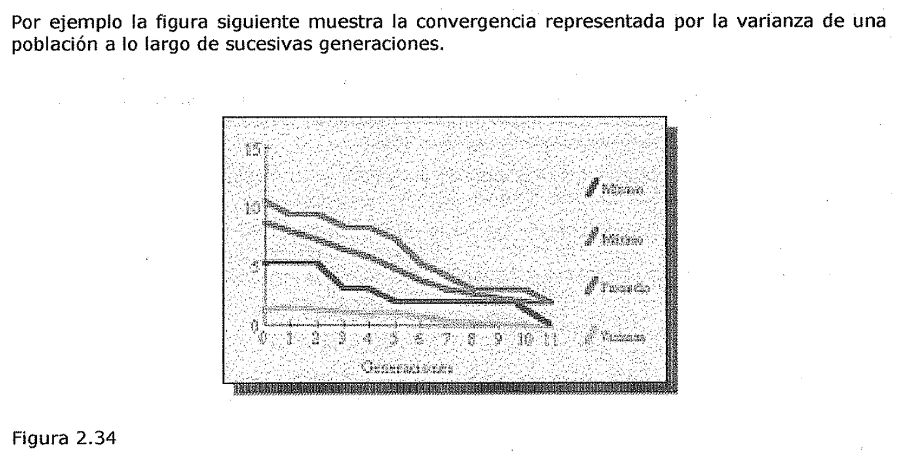

Un problema de los Algoritmos Genéticos dado por una mala formulación del modelo
es aquel C en el cuál los *genes de unos pocos individuos* relativamente bien
adaptados, pero no óptimos, pueden rápidamente *dominar la población,* causando
que converja a un máximo local.

Una vez que esto ocurre, la habilidad del modelo para buscar mejores soluciones
es *e/eliminada completamente,* quedando solo la mutación como vfa de buscar
nuevas alternativas, y el algoritmo se convierte en una búsqueda lenta al azar.

Para evitar este problema, es necesario *controlar el número de oportunidades
reproductivas de* *cada individuo,* tal que, no obtenga ni muy alta ni muy baja
probabilidad. El efecto es comprimir el rango de adaptación y prevenir que un
individuo *"super-adaptado"* tome control rápidamente

**Finalización lenta**

Este es un problema contrario al anterior, luego de muchas generaciones, la
población habrá C convergido, pero *no habrá localizado el máximo global.* La
adaptación promedio sera alta y habrá poca diferencia entre el mejor y el
individuo promedio, por consiguiente sera muy baja la tendencia de la función de
adaptación a llevar el algoritmo hacia el máximo. Las mismas técnicas aplicadas
en la convergencia prematura son utilizadas en este caso.

**Algoritmo Genético Canónico**

El primer paso en la implementación de un algoritmo genético, una vez
establecida la función objetivo, consiste en definir el tipo de la tira que
conformara el cromosoma.

En los AG Canónicos, las mismas son ***tiras binarias*** de longitud L. Cada gen
es un dígito 0 o 1.

Conocido ***N,*** número de cromosomas que compondrán las distintas poblaciones,
se procede a crear la población inicial. Este proceso, en general se realiza en
forma ***random.*** Cada gen de cada cromosoma toma el valor 0 o 1 en forma
aleatoria.

A continuación, cada cromosoma es evaluado, usando la ***función objetivo*** y
la ***función fitness.*** Ambas funciones, suelen s.er intercambiables, aunque
no hay que olvidar que, en realidad, se trata de funciones conceptualmente
distintas.

En los AGC, la ***función fitness*** se define para cada cromosoma, como el
cociente ***fi/F,*** donde ***fi*** es el valor de la ***función objetivo***
correspondiente, mientras que ***F*** es el ***promedio de los valores de la
función objetivo*** para cada tira de la población.

**Desarrollo paso a paso de un AG Canónico**

Aplicaremos un AG simple a un problema particular de optimización, paso por
paso. Consideremos el problema de ***maximizar la función f(x}=xA2,*** para
***x*** variando entre ***0* y *31.*** Para comenzar debemos codificar las
variables de decisión de nuestro problema como tiras de longitud finita. Para
este caso nos sirve codificar la variable ***x*** como enteros binarios sin
signo de longitud 5, lo que nos permite obtener desde ***00000*** (0) hasta
***un1*** (31).

Fijada ya la función objetivo y definida la codificación de x, podemos simular
una simple generación de un AG con selección, crossover y mutación.

Comenzaremos fijando una ***población inicial de4 miembros*** de 5 dígitos
binarios cada uno en forma aleatoria. Para este bajo número, podemos utilizar
los valores obtenidos al arrojar una moneda. Supongamos que los resultados son
los siguientes:

01101

11000

01000

10011

Con estos datos disponibles podemos construir una tabla donde reflejemos los
componentes de la población, el valor de x que le corresponde, el valor de la
función objetivo para cada uno.

Numero de string

Población Inicial

01101

Valor de x

f(x) = xA2 fi/F fi/F 01000

Veces seleccionados

La columna fi/F nos da el peso porcentual que tiene cada componente de la

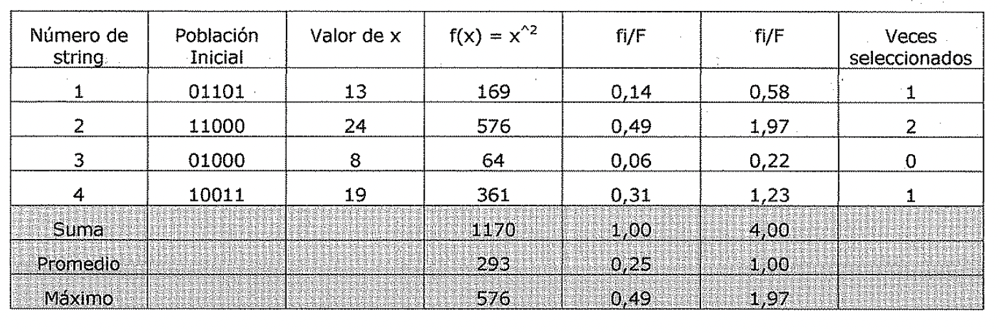
población inicial en el aro de la ruleta, de donde puede apreciarse que después
de ponerla en funcionamiento los componentes 1 y 4 son seleccionados en una
ocasión cada uno, mientras que el 2 lo hace en 2 oportunidades y el 3 no es
seleccionado. Esta población intermedia constituye lo que llamamos ***"mating
pool".*** Esta primera etapa, creación de la población intermedia se denomina
***Selección*** (aplicando en este ejemplo el método de la Ruleta) A
continuación comenzaremos con el proceso de ***crossover.*** Para ello vamos
extrayendo al azar pares de padres que serán sometidos a la cruza. En general,
con los pares seleccionados y antes de la cruza se consulta un factor
probabilístico llamado ***"Pc: probabilidad de cruza",*** que establece el
usuario al comienzo de la ejecución, el que asumiremos como suele ser común
***Pc* = 0,6.** Esto significa que se genera un número al azar que puede valer O
o 1 (este último con un 60% de probabilidad). Si el valor es 1, se procede al
proceso de crossover. Para el ejemplo utilizaremos ***Crossover de un punto.***
En este caso se elige un número al azar entre 1 y 4 en general ***entre 1 y
L-1,*** si L es la longitud de la tira). En este punto se intercambian las colas
de las tiras para crear un par de hijos.

Supongamos que ***el punto de corte es 4*** y que el par de padres seleccionados
son el primero y el segundo. Por lo tanto los hijos engendrados serán:

0110 j **1** 01100

1100 Io 11001

En el próximo intento los padres 11000 (segundo) y 10011 (cuarto) con un punto
de corte en 2, da los hijos 11011 y 10000. Con esto finaliza el Crossover de un
punto.

Finalmente nos queda el proceso de ***mutación*** que viene controlado por el
factor ***"Pm:*** ***probabilidad de mutac:ión".*** Este, habitualmente, es un
valor bajo, por ej: ***0,001..*** Con tal valor, y dado los escasos componentes
de la población vamos a considerar que no se producirá mutación en esta
generación.

Podemos, ahora, expresar estos nuevos resultados en la tabla siguiente:

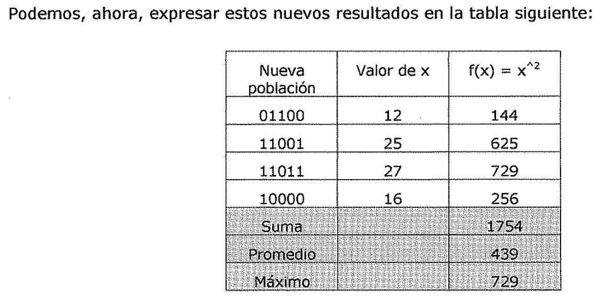

| --- | --- | --- |

| Nueva oblación | Valor de x | f(x); xA2 |

| 01100 | 12 | 144 |

| 11001 | 25 | 625 |

Este proceso continua de la misma manera y se detiene, entre otros criterios,
cuando se lograron un número determinado de generaciones (por ejemplo, 10).

Comencemos a analizar lo que se pone de manifiesto en este ejercicio. El
***promedio*** (de 293 a 439) y el ***máximo*** (de 576 a 729) mejoran cuando se
pasa de la primera generación a la segunda. Esto se logra combinando azar con
una buena elección de padres (dado por sus fitness).

Ejercicio

Hacer un programa que utilice un Algoritmo Genético Canónico para buscar un
máximo de la función:

f(x) = (x/coef(2 en el dominio [0, 2"30 -1] donde coef = 2"30 -1 teniendo en
cuenta los siguientes datos:

- Probabilidad de Crossover= 0,75

- Probabilidad de Mutación = 0,05

- Población Inicial: 10 individuos

- Ciclos del programa: 20

- Método de Selección: Ruleta

- Método de Crossover: 1 Punto

- Método de Mutación: invertida

El programa debe mostrar finalmente el Cromosoma correspondiente al valor máximo
obtenido y gráficas, usando EXCEL, de Max, Min y Promedio de la función objetivo
por cada generación.

- 1. Planificación

1. Introducción

**Un ejemplo de dominio: El mundo de los bloques**

Las técnicas que se van a explicar pueden aplicarse a una gran variedad de
dominios y de hecho así ha sido. Sin embargo, para poder hacer una comparación
sencilla de los distintos métodos que se van a considerar, podría resultados
útil observar el comportamiento de todos ellos en un único dominio que fuera lo
suficientemente complejo como para que se necesitara usar todos los mecanismos,
y lo suficientemente simple como para que se puedan seguir los ejemplos. Un
dominio con estas características es el ***mundo de los bloques.*** En el,
existe una superficie plana sobre la que se sitúan los bloques. Hay también
varios bloques cúbicos todos ellos del mismo tamaño. Nosotros podemos situar
unos bloques sobre otros. Tenemos un brazo robotizado que puede manipular los
bloques. Las acciones que puede llevar a cabo incluyen:

- - **DESAPILAR (A,B):** Coger el bloque A que esta situado sobre el bloque B.
    El brazo

debe estar libre y el bloque A no debe tener bloques situados sobre el.

- - **APILAR (A,B):** Situar el bloque A sobre el bloque B. El brazo debe estar
    cogiendo a A (.

y la superficie de B debe estar libre. (.

- - **COGER(A):** Coger el bloque A de la superficie y agarrarlo. El brazo debe
    estar libre y

no debe existir nada sobre el bloque A.

- - **BAJAR(A):** Bajar el bloque A a la mesa (superficie plana). El brazo debe
    tener agarrando el bloque A.

Nótese que en el mundo que se acaba de describir, el brazo del robot solo puede
coger un bloque a la vez. Ademas, como todos los bloques son del mismo tamaño,
cada bloque solo puede tener como mucho un bloque situado sobre el. \\ Para
poder especificar las condiciones bajo las cuales se puede llevar a cabo una
acción y los resultados que esta produce, es necesario utilizar los siguientes
predicados:

- - **SOBRE (A,B):** El bloque A esta sobre el bloque B.

* **SOBRELAMESA (A):** El bloque A esta sobre la mesa.

* **DESPEJADO (A):** No hay nada sobre el bloque A.

* **AGARRADO (A):** El brazo tiene agarrado el bloque A.

* **BRAZOLIBRE:** El brazo no esta agarrando ningún bloque.

En el mundo de los bloques son ciertas varias sentencias lógicas. Por ejemplo:
\[3x: AGARRADO **(x)\]** ➔BRAZOUBRE Vx: SOBRELAMESA (x) ➔ 3y: SOBRE **(x,y)**

Vx: \[3y: SOBRE **(y,x)\]** ➔ DESPEJADO (x)

La primera de esas sentencias simplemente indica que si el brazo esta agarrando
algo entonces no esta vado.

La segunda dice que si un bloque esta sobre la mesa, no esta sobre ningún
bloque.

Por último, la tercera especifica que cualquier bloque sin otros situados sobre
el, esta despejado.

2.5.2. Componentes de un sistema de planificación

En los sistemas de resolución de problemas basados en técnicas elementales, era
necesario llevar a cabo las siguientes funciones:

- Elegir la mejor regla para aplicar a continuación basándose en la mejor
  información heurística disponible.

- Aplicar la regla elegida para calcular el nuevo estado del problema que surge
  de su aplicación.

- Detectar cuando se ha llegado a una solución.

- Detectar callejones sin salida de forma que puedan abandonarse y que el
  esfuerzo del sistema se gaste en otras direcciones más fructíferas.

En sistemas más complejos, también debemos explorar técnicas para hacer cada una
de estas tareas. Ademas, suele ser importante una quinta función:

- Detectar cuando se ha encontrado algo muy parecido a una solución correcta y
  emplear técnicas especiales para hacer que sea totalmente correcta.

Antes de explicar los diferentes métodos de planificación, es necesario revisar
someramente las maneras de lograr estas cinco funciones.

**Elección de las reglas a aplicar**

La técnica más profunda para seleccionar reglas apropiadas que aplicar,
*consiste en aislar el conjunto de diferencias existentes entre el objetivo
deseado y el estado actual para poder identificar aquellas reglas que pueden
reducir estas diferencias.* Si se encuentran varias reglas, puede usarse otro
tipo de información heurística para poder elegir entre ellas. Esta técnica se
basa en el método de análisis de medios y fines. Por ejemplo, si nuestro
objetivo es tener una valla blanca que rodee nuestro jardincito y actualmente
poseemos una valla marrón, deberíamos seleccionar operadores cuyos resultados
fueran el cambio de color de un objeto. Si por otro lado, no disponemos de una
valla, debemos considerar primero los operadores que construyan objetos de
madera. •

**Aplicación de reglas**

En los sencillos sistemas que se han explicado anteriormente, la aplicación de
las reglas era sencilla. Simplemente las reglas especificaban el estado del
problema que resultaba de su aplicación. Sin embargo, *ahora debemos ser capaces
de trabajar con reglas que solo especifican una parte pequeña de un estado
completo def problema.* Existen muchas formas de lograrlo.

*Una de estas formas consiste en describir para cada acción Jos cambios que
realiza en la descripción def estado. Ademas, también son necesarias algunas
sentencias que hagan que Jo demás permanezca inalterado.* Green (1969) propuso
un ejemplo de este tipo de enfoque. En este sistema, *un estado se describe por
un conjunto de predicados que representan los hechos que son ciertos en ese*

- *J estado.* Cada estado diferente se representa explícitamente como parte de
  los predicados. Por ejemplo, la Figura 2.35 muestra un estado, llamado SO, que
  podría representar un problema sencillo en el mundo de los bloques.

SOBRE(A,B,S0) A SOBRELAMESA(B,S0) A DESPEJADO(A,S0)

Figura 2.35

La manipulación de estas descripciones de los estados puede hacerse con un
demostrador de teoremas por resolución. As\[, por ejemplo, el efecto del
operador **DESAPILAR(x,y)** podría describirse mediante el siguiente axioma.

\[DESPEJADO(x,s) ASOBRE(x,y,s) ➔ **HACER.** es una función que especifica para
un estado y una acción el nuevo estado que resulta de la ejecución de la acción.

El axioma dice que si DESPEJADO(x) y SOBRE(x,y) se cumplen en el estado s,
entonces en el estado que resulta de HACER un DESAPILAR(x,y) a partir del estado
s, se cumple que AGARRADO(x) y DESPEJADO(y).

Si ejecutamos DESAPILAR(A,B) en el estado SO definido anteriormente, puede
probarse, utilizando nuestras aserciones sobre SO y sobre nuestro axioma para
DESAPILAR, que en el estado que resulta de aplicar la operación de DESAPILAR (y
lo denominamos estado 51) se cumple:

Pero qué más sabemos acerca de la situación del estado 51? Intuitivamente,
sabemos que B todavía esta sobre la mesa. Pero con lo que hemos visto hasta
ahora, no podemos derivarlo.

Para poder hacerlo, necesitamos también un conjunto de reglas denominadas
***axiomas marco*** *(frame axioms), que describen* los *componentes def estado
que no se ven afectados por cada* *operador.* Por ejemplo, es necesario indicar
que:

Este axioma dice que la relación **SOBR.ELAMESA** nunca se ve afectada por el
operador **DESAPILAR..** También es necesario indicar que la relación **SOBR.E**
solo se ve afectada por el operador **DESAPILAR.** si,los bloques involucrados
en la relación SOBRE son los mismos que los que involucra la operación
DESAPILAR. Esto puede expresarse como:

[SOBRE(m,n,s) A IGUAL(m,x)] ➔ La ventaja de este enfoque es que se pueden llevar
a cabo todas las operaciones necesarias en la descripción de los estados con un
único y sencillo mecanismo como es el de resolución. Sin embargo, el precio que
se paga es que el número de axiomas necesarios puede hacerse muy grande si las
descripciones de los estados del problema son complejas. Por ejemplo, suponga
que no solo estamos interesados en las posiciones de los bloques sino también en
su color.

Entonces, para cada operación (excepto posiblemente en PINTAR), sería necesario
un axioma como el siguiente:

*Para poder manipular dominios de problemas comp/lejos, es necesario disponer de
un* *mecanismo que no involucre un conjunto de axiomas marco demasiado grande.*
En el sistema de resolución de problemas mediante robot **STRIPS** (Fikes y
Nilsson [@nilsson1971problem]) yen sus descendientes se usó un mecanismo de este
tipo. Cada operador se describe mediante una lista de los nuevos predicados que
el operador provoca que sean ciertos y una lista de los viejos predicados que el
operador provoca que sean falsos. Estas dos listas se denominan lista
***ANADIR*** y lista ***BORRAR*** respectivamente.

También debe especificarse una tercera lista para cada operador. Esta lista
***PRECONDICION*** contiene aquellos predicados que deben ser ciertos para que
pueda aplicarse el operador. Los axiomas marco del sistema de Green están
explícitamente especificados en STRIPS. Cualquier operador no incluido ni en
ANADIR ni en BORRAR de un operador se asume que no se ve afectado por el. Esto
significa que al especificar cada operador no es necesario considerar los
aspectos del dominio que no están relacionados con el. As\[, no es necesario
decir nada acerca de la 'relación entre DESAPILAR y COLOR. Por supuesto, esto
significa que debe usarse un mecanismo distinto a un sencillo demostrador de
teoremas para poder calcular las descripciones de los estados después de que se
lleven a cabo las operaciones.

Los operadores del estilo de STRIPS que se corresponden con las operaciones del
mundo de los bloques que se han estado tratando aparecen en la Figura 2.36.
Nótese que para reglas sencillas como estas, la lista PRECONDICION con
frecuencia es idéntica a la lista BORRAR. Para poder agarrar un bloque, el brazo
debe estar libre: tan pronto como agarra el bloque, deja de estar libre. Pero
las precondiciones no siempre son borradas. Por ejemplo, para que el brazo
agarre un bloque, el bloque no debe tener otro situado sobre el. Después de que
lo ha tornado, todavía sigue sin bloques sobre el. Esta es la razón de por que
las listas BORRAR y ,, PRECONDICION deben especificarse separadamente.

APILAR(x,y)

P: DESPEJADO(y) A AGARRADO(x) B: DESPEJADO(y) A AGARRADO(x) A: BRAZOL!BRE A
SOBRE(x,y) DESAPILAR(x,y)

P: SOBRE(x,y) A DESPEJADO(x) A BRAZOLIBRE B: SOBRE(x,y) A BRAZOLIBRE

A: AGARRADO(x) A DESPEJADO(y) COGER(x)

P: DESPEJADO(x) A SOBRELAMESA(x) A BRAZOLIBRE B: SOBRELAMESA(x) A BRAZOLIBRE A:
AGARRADO(x) BAJAR(x)

P: AGARRADO(x) B: AGARRADO(x)

A: SOBRELAMESA(x) A BRAZOLIBRE

Figura 2.36

Al hacer implícitos los axiomas marco, se ha reducido enormemente la cantidad de
información que hay que suministrar a cada operador. Esto significa, entre otras
cosas, que cuando se introduce en el sistema un nuevo atributo posible a los
objetos, no es necesario ir hacia atrás y añadir un nuevo axioma a cada uno de
los operadores.

Pero ¿Cómo podemos conseguir el efecto de utilizar los axiomas marco en el
cálculo de descripciones completas de estados? El primer aspecto que sale a
relucir es que para descripciones de estados complejas, la mayoría queda
inalterada después de cada operación.

Pero si representamos el estado como una parte explicita de cada predicado, como
en el Sistema de Green, entonces toda la información debe deducirse de nuevo
para cada estado. Para evitarlo, podemos abandonar el indicador explícito de
estado a partir de predicados individuales y en su lugar simplemente actualizar
una base de datos de predicados de forma que siempre describan el estado actual
del mundo. Por ejemplo, si se comienza con. la situación que se muestra en la
Figura 2.35, podría describirse como SOBRE(A,B) "SOBRELAMESA(B) "DESPEJADO(A)

Después de aplicar el operador DESAPILAR(A,B) nuestra descripción del mundo
sería: SOBRELAMESA(B) " DESPEJADO(A) " DESPEJADO(B) " AGARRADO(A) La simple
actualización de una única descripción de estado funciona tan bien como llevar
cuenta de los efectos de una secuencia dada de operadores. \<'.Pero que ocurre
durante el proceso de búsqueda de la secuencia correcta de operadores? Si se
explora una secuencia incorrecta, se tiene que. poder volver al estado original
para intentarlo con otra secuencia diferente. Pero esto es posible siempre que
la base de datos global describa el estado del problema en el nodo actual del
grafo de búsqueda.

Todo lo qu.e necesitamos hacer es almacenar en cada nodo los cambios que ha
producido en la base de datos global.cuando se pasó a través de ese nodo.
Entonces, si se vuelve atrás hacia ese nodo, ya se pueden deshacer los cambios.
Pero los cambios están exactamente en las listas ANADIR y BORRAR de los
operad\<libres que se• aplicaron para trasladarse de un nodo a otro. Asi,
necesitamos almacenar a lo largo de cada arco del grafo de búsqueda solo el
operador que se aplicó.

En la Figura 2.37 se muestra un pequeño ejemplo de un árbol de búsqueda de este
tipo y su correspondiente base de datos global. El estado inicial, descrito en
la forma de STRIPS, es el que se muestra en la Figura 2.35. Nótese que podemos
especificar no solo el operador (es decir, DESAPILAR) sino también sus
argumentos, a fin de poder deshacer los cambios más tarde.

DESAPILAR(A,B)

BAJAR(A)

Estado de la base de dates

global en este momento SOBRELAMESA(B) A

DESPEJADO(A) A

DESPEJADO(B) A

SOBRELAMESA(A)

Figura 2.37

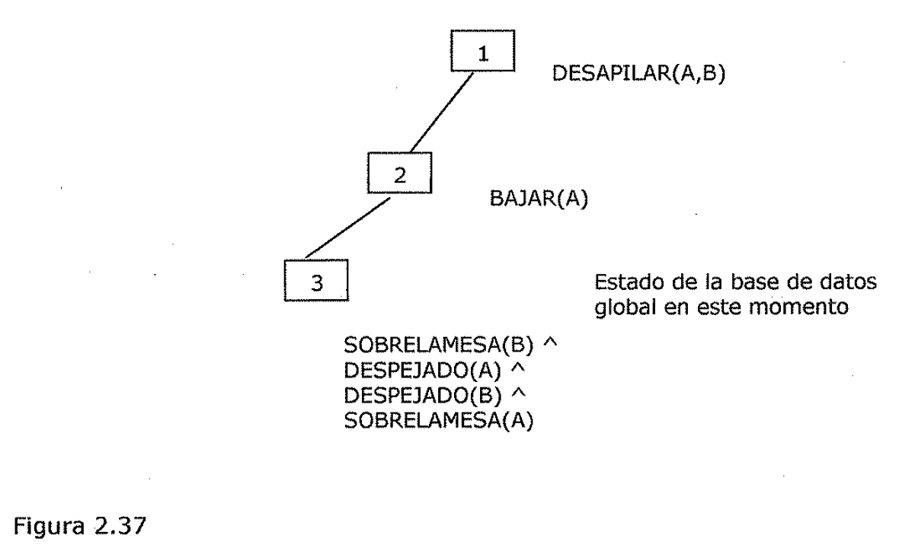

Suponga ahora que queremos explorar un camino diferente a partir del que se ha
mostrado.

En primer lugar se vuelve atrás a través del nodo 3 añadiendo cada uno de los
predicados de la lista BORRAR de BAJAR en la base de datos global, y eliminar
los elementos de la lista ANADIR de BAJAR. Después de hacerlo, la base de datos
contiene:

SOBRELAMESA(B) A DESPEJADO(A) A DESPEJADO(B) A AGARRADO(A)

Como se esperaba, la descripción es idéntica a la que previamente se había
calculado como resultado de aplicar DESAPILAR a la situación inicial. Si se
repite el proceso usando las listas ANADIR y BORRAR de DESAPILAR, se deriva una
descripción idéntica a la que se tenia cuando se comenzó.

Como para los dominios. de problemas complejos resulta tan importante hacer
implícitos los axiomas• marco, todas las técnicas que veremos usan descripciones
de los operadores disponibles siguiendo el estilo de STRIPS.

**Detección de una solución**

*Se dice que un sistema de planificación ha tenido éxito al encontrar una
solución a un* *problema cuando encuentra una secuencia de operadores que
transforman el estado inicial def problema en un estado objetivo.* ¿Cómo puede
saberse cuando ocurre este éxito?. En los sistemas sencillos de resolución de
problemas la respuesta es muy fácil, simplemente comparándolo con las
descripciones del estado. Pero si no están representados explícitamente los
estados completos, sino que lo están mediante un conjunto de propiedades
relevantes, entonces el problema se hace más complejo. El modo de resolverlo
depende de cómo estén representadas las descripciones de los estados. Con
cualquier esquema de representación que se use es posible razonar con las
representaciones para descubrir si una se empareja con la otra.

La lógica de predicados es una técnica de representación que ha servido como
base para muchos de los sistemas de planificación que se han construido. Es
adecuada por los mecanismos deductivos que proporciona. Suponga que como parte
de un objetivo se tiene el predicado P(x). Para ver si P(x) se satisface en un
estado, se pregunta si podemos probar P(x) dadas las aserciones que describen el
estado y los axiomas que definen el modelo del mundo (como por ejemplo, el hecho
de que si el brazo esta agarrando algo, entonces no esta libre).

- Si podemos construir esta demostración, entonces el proceso de resolución del
  problema termina.

- Si no se puede, entonces debe proponerse una secuencia de operadores que
  podría resolverlo. Esta secuencia puede verificarse de la misma forma en que
  se hizo con el estado inicial preguntando si P(x) podía demostrarse a partir
  de los axiomas y de la

descripción del estado derivado de la aplicación de los operadores.

1. **Detección de callejones sin salida**

Cuando un sistema de planificación esta buscando una secuencia de operadores que
resuelva un problema concreto, debe ser capaz de detectar si esta explorando un
camino que nunca puede conducir a una solución (o al menos que no es probable
que lo haga). Para detectar estos callejones sin salida pueden emplearse los
mismos mecanismos de razonamiento que se usaron para detectar una solución.

*Si el proceso de búsqueda razona hacia delante a partir de/ estado inicial,
puede podar* los *caminos que conduzcan a un estado a partir def cuál no* se
*a/alcanza un estado* objetivo.\* Por ejemplo, suponga que tenemos una cantidad
fija de pintura: algo de blanco, algo de rosa y algo de rojo. Queremos pintar
una habitación con las paredes rojo claro y el techo blanco. Podríamos conseguir
el rojo claro añadiendo la pintura blanca a la roja. Pero entonces no podríamos
pintar el techo de blanco. Por lo tanto, este intento debe abandonarse e
intentar mezclar la pintura roja y la rosa. Pueden podarse también aquellos
caminos que aunque no imposibilitan llegar a una solución, sí parece que no se
encuentran muy cercanos a ella una vez que se exploran.

*Si el proceso de búsqueda* es *hacia atrás a partir de un estado solución,* se
*puede dar par finalizado un camino* si se *esta seguro de que el estado inicia/
no puede alcanzarse o porque solo pueden hacerse pequeños progresos. En el
razonamiento hacia atrás, cada objetivo* se *descompone en subobjetivos. Cada
uno de ellos, además, puede descomponerse en subobjetivos adicionales.* Algunas
veces resulta sencillo detectar que no hay forma de que todos los subobjetivos
de un conjunto dado puedan satisfacerse a la vez. Por ejemplo, el brazo del
robot no puede estar libre y agarrando un bloque al mismo tiempo. Los caminos
que intenten que estos dos objetivos sean ciertos simultáneamente pueden podarse
inmediatamente. Otros caminos pueden podarse porque no conducen a ninguna parte.
Por ejemplo, si al intentar satisfacer el objetivo A, el programa lo reduce a
satisfacer los objetivos A, B y C, realmente se ha progresado poco. Se ha
producido un problema más grande que el original, y el camino en cuestión debe
abandonarse también.

**Identificación de soluciones casi correctas**

Las clases de técnicas que se están explicando son con frecuencia útiles para
resolver problemas *casi descomponibles.* Una buena forma de resolver estos
problemas consiste en *asumir que son completamente descomponibles,* resolver
los subproblemas por separado, y verificar si al combinar las subsoluciones
tenemos una solución al problema original. Por supuesto, si ocurre lo anterior
no debe hacerse nada más.

Sin embargo, si no ocurre, se pueden hacer varias cosas.

La más simple de todas es desechar la solución, buscar otra y esperar que
resulte mejor que la anterior. Aunque es sencilla, esta estrategia puede
conducir a malgastar una gran cantidad de esfuerzo.

- Un intento bastante mejor consiste en comparar la solución que resulta al
  ejecutarse la

secuencia de operaciones correspondientes a la solución propuesta con el
objetivo deseado. En la mayoría de los casos las diferencias entre las dos serán
menores que las diferencias entre el estado inicial y el objetivo (asumiendo que
la solución encontrada tiene partes buenas). En este punto, puede llamarse de
nuevo al sistema de resolución de problemas y pedirle que encuentre una forma de
eliminar estas nuevas diferencias.

La primera solución puede combinarse con esta segunda para formar una solución
para el problema original.

,. Otra forma todavía mejor de arreglar soluciones incompletas no consiste en
intentar arreglarlas todas, sino en dejarlas especificadas de forma incompleta
hasta que sea posible. Entonces, cuando este disponible tanta información como
sea posible, se completa la especificación de forma que no surjan conflictos.

Este enfoque puede denominarse como *estrategia de mínimo compromiso.* Puede
aplicarse de varias formas. Una de ellas consiste en aplazar las decisiones en
el orden en el que se llevan a cabo las operaciones. Asi, en nuestro ejemplo
anterior, en lugar de elegir arbitrariamente un orden para satisfacer un
conjunto de precondiciones se dejara el orden sin especificar hasta casi al
final. Entonces se mirarían los efectos de cada una de las subsoluciones para
determinar las dependencias que existen entre ellas. Es en este punto cuando
debe elegirse un ordenamiento.

Figura 2.38

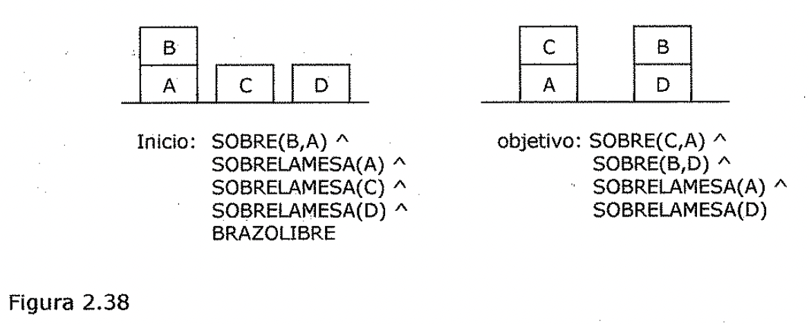

Inicio: SOBRE(B,A) A

SOBRELAMESA(A) A SOBRELAMESA(C) A SOBRELAMESA(D) A BRAZOLIBRE

objetivo: SOBRE(C,A) A SOBRE(B,D) A

SOBRELAMESA(A) A

SOBRELAMESA(D)

2.5.3. Planificación mediante 1.ma pila de objetivos

Una de las primeras técnicas que surgieron para componer objetivos que pueden
interactuar, fue el uso de una ***pi/a de objetivos.*** Esto fue lo que se usó
en **STRIPS.** En este método, el resolutor de problemas usa una pila que
contiene tanto objetivos como operadores que deben proponerse para satisfacer
estos objetivos.

El resolutor de problemas también usa una base de datos que describe la
situación actual y un conjunto de operadores descritos mediante las listas
PRECONDICION, ANADIR y BORRAR. Para ver como funciona este método analizaremos
el ejemplo de la Figura 2.38. Cuando se comienza con la resolución de este
problema, la pila de objetivos es simplemente:

**SOBRE(C,A) "' SOBRE(B,D) A SOBRELAMESA(A) A SOBRELAMESA(D)**

Pero queremos separar este problema en cuatro subproblemas, uno por cada
componente def objetivo original. Dos de los subproblemas, **SOBRELAMESA(A} y
SOBRELAMESA(D),** son ya ciertos en el estado inicial. Por lo tanto solo tenemos
que fijarnos en los dos restantes.

Al profundizar en el orden en que se desea atacar los subproblemas, deben
crearse dos pilas de objetivos en este primer paso donde cada línea representa
un objetivo de la pila y *SOBM* es *una abreviatura de SOBRELAMESA(A)
"SOBRELAMESA(D):* SOBRE(C,A) SOBRE(B,D)

SOBRE(C,A) A SOBRE(B,D) A

SOBM

SOBRE(B,D) SOBRE(C,A)

SOBRE(C,A) A SOBRE(B,D) A

SOBM

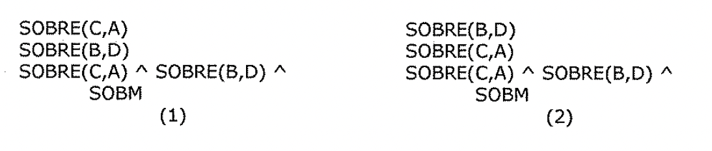

1. En cada paso del proceso de resolución def problema se seguirá la pista del
   objetivo situado en la cima de la pila. Cuando se encuentra una secuencia de
   operadores que lo satisfacen, esta secuencia se aplica a la descripción def
   estado, obteniendo una nueva representación.

1. A continuación, se explora el objetivo situado en la cima de la pila y se
   intenta hacer que se satisfaga, comenzando a partir de la situación que se
   produjo coma resultado de satisfacer el primer objetivo.

1. Este proceso continua hasta que la pila de objetivos este vacía.

1. Entonces, como última verificación, el objetivo original se compara con el
   estado final que surge de la aplicación de los operadores elegidos.

1. Si en este estado no se satisfacen algunas partes del objetivo (que puede que
   no ocurra si se alcanzó en un punto y más tarde se deshizo), entonces las
   partes no resueltas del

subobjetivo se reinsertan en la pila y se repite el proceso.

Para continuar con el ejemplo que comenzamos antes, asuma que primero se intenta
explorar la alternativa 1. La alternativa 2 conducirá también a la solución. De
hecho, encuentra una tan fácilmente que no resulta muy interesante.

Al explorar la alternativa 1, verificamos primero si **SOBRE(C,A}** es cierto en
el estado actual. Como no lo es, verificamos los operadores que pueden hacer que
sea cierto. De los cuatro operadores que consideramos solo hay uno, **APILAR,**
que debe llamarse con C y A. De esta forma, se sitúa **APILAR(C,A)** en la pila
en lugar de SOBRE(C,A), obteniendo:

**APILAR(C,A}**

SOBRE(B,D)

SOBRE(C,A) " SOBRE(B.D) " SOBM

APILAR(C,A) *reemplaza/aza* a SOBRE(C,A) porque después de llevar a cabo APILAR
se garantiza que SOBRE(C,A) se cumplirá.

Pero para poder aplicar APILAR(C,A), deben satisfacerse sus precondiciones, de
forma que deben establecerse coma subobjetivos. De nuevo, debemos separar un
objetivo compuesto:

**DESPEJADO(A) A AGARRADO(C)**

en sus componentes y elegir el orden en el que deben trabajar. En este punto,
resulta adecuado ***utilizar algún conocimiento heurístico.*** AGARRADO(x) es
muy fácil de lograr. Al menos es necesario dejar algo y coger el objeto deseado.
Pero AGARRADO es también muy fácil de deshacer. Para poder realizar cualquier
otra cosa, el robot necesitara utilizar el brazo. Asf, si alcanzamos AGARRADO
'en primer lugar y después se intenta hacer algo más, es muy probable que
lleguemos a un callejón sin salida.

Asi utilizamos la ***heurística*** de que si uno de los objetivos que deben
cumplirse simultáneamente es AGARRADO, este debe realizarse el último. Esto
produce una nueva pila de objetivos:

DESPEJADO(A)

AGARRADO(C)

DESPEJADO(A) A AGARRADO(C)

**APILAR(C,A)**

SOBRE(B,D)

SOBRE(C,A) A SOBRE(B,D) A SOBM

Este tipo de información heurística debería estar en la lista PRECONDICION
comenzando los predicados en el orden en el que deberían realizarse.

A continuación se ve si DESPEJADO(A) es cierto. No lo es. El único operador que
puede convertirlo en cierto es **DESAPILAR(B,A).** Por lo tanto, se intenta
aplicar. Esto produce la pila de objetivos:

SOBRE(B,A)

DESPEJADO(B)

BRAZOLIBRE

SOBRE(B,A) A DESPEJADO(B) A BRAZOLIBRE I

**DESAPILAR(B,A)**

AGARRADO(C)

DESPEJADO(A) A AGARRADO(C)

**APILAR(C,A}**

SOBRE(B,D)

SOBRE(C,A) A SOBRE(B,D) A SOBM

Esta. vez, cuando comparamos el elemento de la cima de la pila de objetivos,
SOBRE(B,A), con el modelo del mundo, se ve que se satisface. Asi, lo sacamos y
consideramos el siguiente objetivo, DESPEJADO(B). Esto, aunque es cierto en el
modelo del mundo, no esta especificado explícitamente como uno de los predicados
iniciales. Pero a partir de los predicados iniciales y del axioma del mundo de
los bloques que dice que cualquier bloque sin bloques.sobre el esta despejado,
un demostrado.r de teoremas puede concluir que DESPEJADO(B); Asi, este
subobjetivo también puede extraerse de la pila.

La tercera precondición para DESAPILAR(B,A) permanece. Es **BRAZOLIBRE,** y
también es cierto en el modelo del mundo actual, por lo que puede eliminarse
también de la pila.

El siguiente elemento de la pila es el objetivo combinado que representa todas
las precondiciones de DESAPILAR(B,A). Lo verificamos para estar seguros de que
se satisface en el modelo del mundo. Esto sera así a no ser que se deshaga uno
de sus componentes al intentar satisfacer otro. En este caso, no hay problemas y
*el objetivo combinado* se *extrae de (* *la pi/a.* Ahora, el elemento de la
cima de la pila es el operador **DESAPILAR(B,A).** Hemos garantizado que todas
sus precondiciones se satisfagan, por lo que puede aplicarse para producir un
nuevo modelo del mundo a partir del cuál continuara el proceso de resolución de
problemas. Esto se logra usando las listas ANADIR y BORRAR especificadas en
DESAPILAR.

Mientras tanto, *a/almacenamos la información* de que DESAPILAR(B,A) ha sido el
primer operador de la secuencia propuesta como solución. En este momento, la
base de datos correspondiente al modelo del mundo es:

**SOBRELAMESA(A) "' SOBRELAMESA(C) "' SOBRELAMESA(D) -" AGARRADO(B)** -"

**DESPEJADO(A)**

La pila de objetivos es:

AGARRADO(C)

DESPEJADO(A) A AGARRADO(C)

**APILAR(C,A)**

SOBRE(B,D)

SOBRE(C,A) A SOBRE(B,D) A SOBM

Ahora se intenta satisfacer el objetivo AGARRADO(C). Existen dos operadores que
pueden hacer que AGARRADO(C) sea cierto: **COGER(C) y DESAPILAR(C,x),** donde x
podría ser cualquier bloque del que se pueda desapilar C. Sin más información,
no podemos decir cuál de los dos operadores es el apropiado, por lo que creamos
dos ramas en el árbol de búsqueda que se corresponden con las siguientes pilas

de objetivos:

SOBRELAMESA(C) DESPEJADO( C) BRAZOLIBRE SOBRELAMESA(C) A

DESPEJADO(C) " BRAZOLIBRE

. ) **COGER(C)**

DESPEJADO(A) " AGARRADO(C)

**APILAR(C,A)**

SOBRE(B,D)

SOBRE(C,A) A SOBRE(B,D) " SOBM

SOBRE(C,x) DESPEJADO(C) BRAZOLIBRE SOBRE(C,x) A

DESPEJADO( C) A

BRAZOLIBRE **DESAPILAR(C,x)** DESPEJADO(A) " AGARRADO(C) **APILAR(C,A)**
SOBRE(B,D)

SOBRE(C,A) " SOBRE(B,D) " SOBM

Nótese que para la segunda alternativa, la pila de objetivos contiene la
variable x, la cuál aparece en tres sitios. Aunque x puede sustituirse por
cualquier bloque, es importante que sea el mismo en.las tres apariciones. Asf,
es importante que cuando se introduce una variable en la pila, el nombre sea
diferente al de las variables que ya se encuentran en la pila. Ademas, una vez
que se elige un objeto candidato para ligarlo con una variable, este enlace debe
recordarse para que cuando se produzcan otras apariciones de la misma variable
se relacione• con el mismo objeto.

c'.Cómo debería elegir nuestro programa entre las alternativas 1 y 2? Puede
decirse que coger C(alternativa 1) es mejor que desapilarlo, ya que no esta
sobre nada. Para desapilar algo, primeramente debe estar apilado sobre algo:
Aunque puede hacerse, es un esfuerzo malgastado. c'.Pero cómo podría saber esto
nuestro programa? Suponga que se decide seguir por la alternativa 2 en primer
lugar. Para satisfacer SOBRE(C,x), tenemos que **APILAR C** sobre el bloque x.
Entonces la pila de objetivos sería:

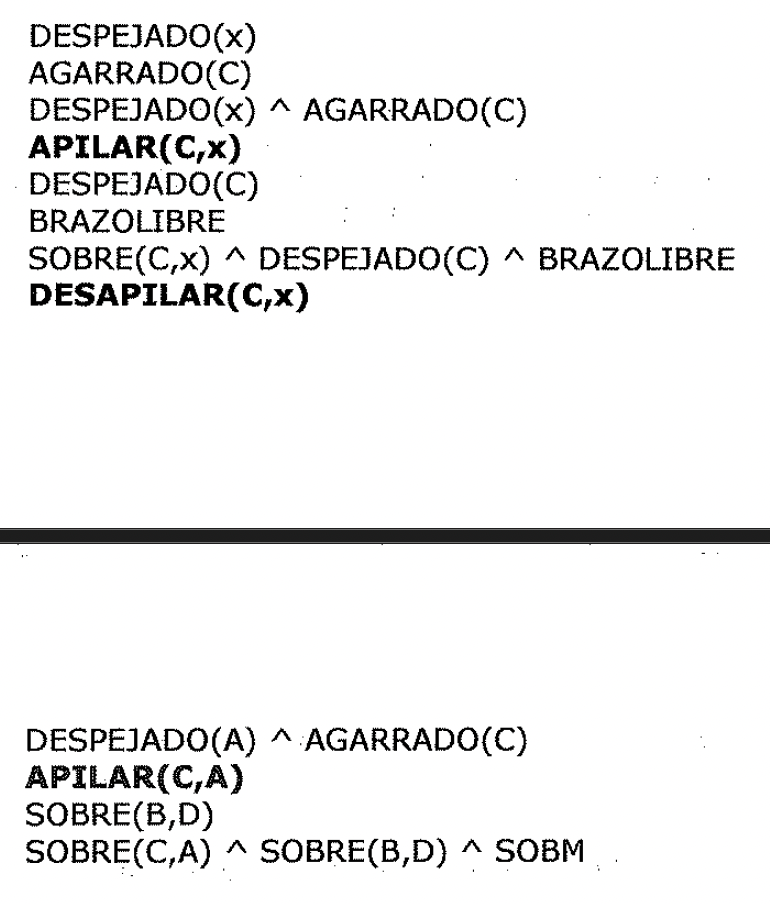

DESPEJADO(x)

AGARRADO(C)

DESPEJADO(x) A AGARRADO(C)

**APILAR(C,x)** DESPEJADO(C) BRAZOLIBRE SOBRE(C,x) A DESPEJADO(C) A BRAZOLIBRE

**DESAPILAR(C,x)**

DESPEJADO(A) "AGARRADO(C)

**APILAR(C,A)**

SOBRE(B,D)

SOBRE(C,A) " SOBRE(B,D) " SOBM

Pero dese cuenta de que ahora una de las precondiciones de APILAR es
**AGARRADO(C).** Esto es lo que estamos intentando conseguir aplicando
DESAPILAR, lo cuál necesita aplicar APILAR para que la precondición SOBRE(C,x)
se satisfaga.

Por lo tanto, volvemos a nuestro objetivo inicial. De hecho, ahora tenemos
objetivos adicionales ya que se han añadido otros predicados a la pita. En este
momento se determina que este camino es improductivo. Sin embargo, si el bloque
C hubiera estado sobre otro bloque en el estado actual, SOBRE(C,x) se satisfaría
inmediatamente sin necesidad de hacer un APILAR y este camino conduciría a una
buena solución.

Ahora tenemos que volver a la alternativa 1, en la que se utilizaba COGER, para
conseguir que el brazo agarrara a C. El elemento en la cima de la pita de
objetivos es SOBRELAMESA(C), que como se satisface y, se elimina de la pita. El
siguiente elemento es DESPEJADO(C), que también se satisface y se extrae de la
pita. La siguiente precondición de COGER(C), es BRAZOLIBRE, que no se satisface
ya que ***AGARRADO(B)* es *cierto.***

Existen dos operadores que pueden hacer que BRAZOLIBRE sea cierto: APILAR(B,x) y
BAJAR(B). Es decir, podemos situar B sobre la mesa o sobre otro bloque. ¿Cuál de
las dos elegimos?

Si investigamos un poco, se ve que al final lo que queremos es conseguir B sobre
D. Lo más eficaz sería situar B allí en este momento. Nuestro programa podría
darse cuenta de esto comparando los elementos de las listas ANADIR de los
operadores del resto de la pita de objetivos. Si uno de los operadores provoca
un efecto fortuito que hace cierto alguno de los objetivos, debería elegirse. De
esta forma, elegimos aplicar **APILAR(B,D)** enlazando D con x en el operador
APILAR. Esto hace que la pita de objetivos sea:

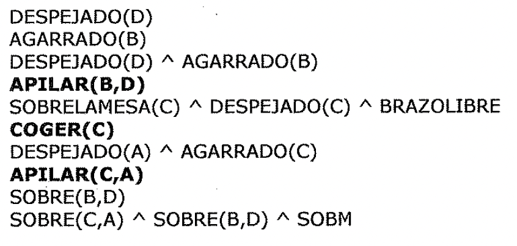

DESPEJADO(D)

AGARRADO(B)

DESPEJADO(D) " AGARRADO(B)

**APILAR(B,D)**

SOBRELAMESA(C) " DESPEJADO(C) "BRAZOLIBRE

**COGER(C)**

DESPEJADO(A) " AGARRADO(C)

**APILAR(C,A)**

SOBRE(B,D)

SOBRE(C,A) " SOBRE(B,D) " SOBM

DESPEJADO(D) y AGARRADO(B) son ambas ciertas. Ahora la operación APILAR(B,D)
puede realizarse y produce el siguiente modelo del mundo:

**SOBRELAMESA(A) A SOBRELAMESA(C) A SOBRELAMESA(D) A SOBRE(B,D) A**
**BRAZOUBRE**

En este momento, se satisfacen todas las precondiciones de COGER(C), por lo que
puede ejecutarse. Entonces, todas las precondiciones de APILAR(C,A) son ciertas
y puede, por lo tanto, ejecutarse.

Ahora ya podemos empezar a trabajar con la segunda parte de nuestro objetivo
original, **SOBRE(B,D).** Pero ya se ha satisfecho gracias a las operaciones
realizadas para satisfacer el primer subobjetivo. Esto ocurrió porque al
intentar elegir entre las posibles alternativas cuando el brazo estaba agarrando
a B, se inspeccionó la pita de objetivos para ver si uno de los operadores
posibles provocaba efectos laterales, y se vio que era asi. Por lo tanto, ahora
extraemos SOBRE(B,D) de la pila de objetivos.

A continuación hay que realizar la última verificación consistente en que el
objetivo combinado **SOBRE(C,A} A SOBRE(B,D} A SOBRELAMESA(A} A SOBRELAMESA(D}**
se cumpla en cada una de sus partes, lo cuál, por supuesto, se cumple. Entonces
el resolutor de problemas puede ahora devolver como respuesta el plan:

1. **DESAPILAR(B,A}**

1. **APILAR(B,D}**

1. **COGER(C}**

1. **APILAR(C,A}**

En este sencillo ejemplo se ha visto la forma en que puede aplicarse la
información heurística para guiar el proceso de búsqueda, intentando detectar
caminos no provechosos y considerando ciertas interacciones entre objetivos que
pueden ayudar a crear una buena solución en su conjunto. Sin embargo, para
problemas de una mayor dificultad estos métodos no son adecuados.

2.!5.4. Planificación no lineal mediante fijación de restricciones

La anomalía de Sussman de la Figura 2.39 es un buen ejemplo que muestra la
necesidad de un plan no lineal.

Inicio: SOBRE(C,A) A

SOBRELAMESA(A) " SOBRELAMESA(B) " BRAZOLIBRE

objetivo: SOBRE(A,B) A SOBRE(B,C)

Figura 2.39

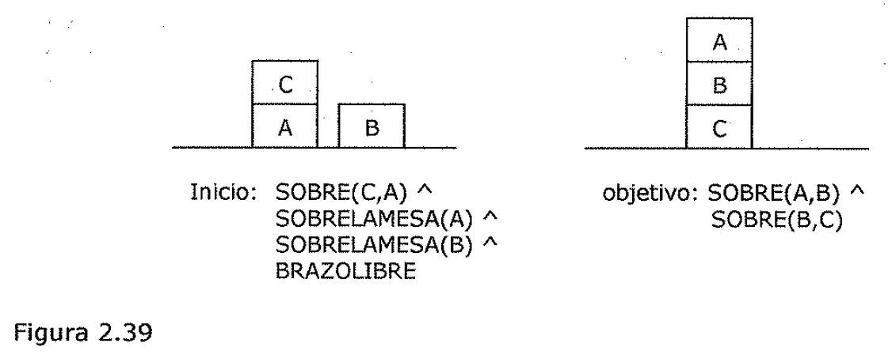

Existen dos maneras para comenzar la resolución de este problema, que

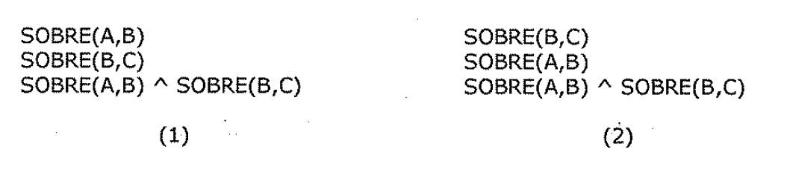
corresponden a las pilas de objetivos:

SOBRE(A,B) SOBRE(B,C)

SOBRE(A,B) " SOBRE(B,C)

SOBRE(B,C) SOBRE(A,B)

SOBRE(A,B) " SOBRE(B,C)

Suponga que elegimos la alternativa 1 y comenzamos intentando conseguir A sobre
B. Para ello se desapila C de A y se logra el primer subobjetivo **SOBRE(A,B}.**
Ahora ya podemos comenzar a trabajar para satisfacer SOBRE(B,C). Pero para
hacerlo, tiene que desapilar A de B. Cuando se alcanza el objetivo
**SOBRE(B,C}** y se intenta verificar el objetivo restante de la pila
**SOBRE(A,B} " SOBRE(B,C},** se descubre que no se satisface. Se ha deshecho
SOBRE(A,B) en el proceso de alcanzar SOBRE(B,C). La diferencia entre el
objetivo. y el estado actual es SOBRE(A,B), que se añade a la pila por lo que
hay que alcanzarlo de nuevo. Finalmente el objetivo se satisface.

Aunque este plan alcanza el objetivo deseado, no lo hace de una forma demasiado
eficaz. Algo similar ocurre si se examinan los dos objetivos principales en
orden opuesto. El método que se esta usando no. es capaz de encontrar una forma
eficiente de resolver este problema.

El método de *p/planificación con pi/a* de *objetivos* aborda los problemas como
objetivos conjuntos resolviendo por orden los objetivos uno cada vez. Este
método genera un plan que contiene una secuencia de operadores que resuelven el
primer objetivo, seguido por una secuencia completa para el segundo objetivo,
etc. Pero como se ha visto, ***los problemas difíciles provocan interacciones
entre los objetivos.*** Los operadores que se utilizan para resolver un
subproblema pueden interferir en la solución de un subproblema anterior.

La mayoría de los problemas necesitan un plan entrelazado en el que se *trabaje*
*simultáneamente con múltiples subproblemas.* ***Este tipo de plan* se *denomina
plan no*** ***lineal*** ya que no esta compuesto por una secuencia lineal de
subplanes completos. Un buen plan para solucionar este problema es el siguiente:

1. Comenzar el trabajo con el objetivo SOBRE(A,B) despejando A y poniendo C
   sobre la *('*

mesa.

1. Alcanzar el objetivo SOBRE(B,C) apilando B sobre C.

1. Completar el objetivo SOBRE(A,B) apilando A sobre B.

La idea de ***fijación de restricciones*** es construir un plan mediante
operadores incrementalmente hipotéticos, ordenamientos parciales entre
operadores y enlaces entre variables y operadores. En un cierto instante del
proceso de resolución del problema, se puede tener un conjunto de operadores
útiles pero quizá no una idea muy clara sobre cómo ordenar estos operadores
entre ellos.

*Una solución es un conjunto* de *operadores parcialmente ordenados y
parcialmente instanciados para generar un plan intermedio, se convierte el orden
parcial en un número de* *órdenes totales.* 2.5.5. Planificación jerárquica

Para resolver problemas complicados, los resolutores de problemas tienen que
generar planes muy extensos. Para poder hacerlo eficientemente, es importante
***poder eliminar algunos de***

***los detalles.del problema hasta que* se *encuentre una solución que resuelva
los***

***principales escollos.*** Una forma de hacer esto es sustituir los detalles
apropiados.

Los primeros intentos de lograrlo usaban macro-operadores en donde se construían
operadores grandes a partir de otros más pequeño\\os. Pero con este enfoque, no
se eliminan los detalles de las descripciones de los operadores. En el sistema
ABSTRIPS (Sacerdoti, 1974) se utilizó un enfoque algo mejor en el cuál la
planificación se realizaba con una *jerarquía de* *espacios de abstracción,* en
cada uno de los cuales se ignoran las precondiciones de un nivel de abstracción
más bajo..

Como ejemplo, suponga que quiere visitar a un amigo en Europa, pero tiene una
cantidad limitada de dinero para gastar. Tendría sentido verificar primero el
precio del billete de avión ya que encontrar un vuelo razonable en cuanto a
precio sera la parte más dificultosa del trabajo. Usted no se debería preocupar
de cosas como llegar a la entrada, planificar la ruta al aeropuerto, o aparcar
su coche hasta que no este seguro de que tiene un vuelo que tomar.

El enfoque que usa ABSTRIPS para resolver un problema es el siguiente:

- En primer lugar resuelve el problema completamente, considerando solo aquellas
  precondiciones cuyo valor critico sea el más alto posible. Estos valores
  reflejan la dificultad esperada para satisfacer una precondición. Para
  lograrlo, sigue el mismo

procedimiento que STRIPS, pero simplemente ignora las precondiciones que caen
por debajo de un cierto nivel crítico.

- Una vez hecho esto, utiliza el plan construido como el esbozo de un plan
  completo, y considera las precondiciones del siguiente nivel de criticidad más
  bajo.

- Entonces aumenta el plan con los operadores que satisfacen estas
  precondiciones. De nuevo, al elegir los operadores, ignora todas aquellas
  precondiciones cuya criticidad sea menor que el nivel que ahora se esta
  considerando.

Este proceso se denomina *búsqueda primero en longitud* debido a que explora
planes completos a un nivel de detalle antes de mirar los detalles de más bajo
nivel de algunos de ellos.

La ***asignación de valores de criticidad apropiados*** es claramente un aspecto
crucial para el éxito de este método de ***planificación jerárquica.***
*Aquellas precondiciones que no tengan operadores que puedan satisfacerlas son
las más críticas.* Por ejemplo, si intentamos resolver un problema que incluya
el movimiento de un robot a lo largo de una casa y consideramos el operador
PASAR-POR-LA-PUERTA, la precondición de que exista una puerta lo suficientemente
ancha para que el robot pueda pasar a través de ella es lo más critico, ya que
si ocurre así (en una situación normal) nada de lo que podamos hacer puede
lograr que no sea cierto. Pero la precondición de que la puerta este abierta es
de una criticidad menor si disponemos del operador ABRIR-PUERTA.

Para que un sistema de planificación jerárquica funcione con reglas del estilo
de STRIPS, debe darse junto con las propias reglas, el valor de criticidad
apropiado para cada término que pueda aparecer en la precondición. Dados estos
valores, el proceso básico puede trabajar en gran parte de la misma forma en que
lo hacen los sistemas de planificación no jerárquicos. Sin embargo, no se
malgastaran esfuerzos en eliminar los detalles de planes que no estén cercanos a
la resolución del problema.

2.5.6. Sistemas reactivos

Hasta ahora, se ha descrito un proceso de planificación deliberativo, en donde
*el plan que resuelve una tarea completa se construye antes de actuar.* Sin
embargo, existe un camino muy diferente que podría aproximarse al problema de
decidir que hacer. La idea de los ***sistemas reactivos*** consiste en ***evitar
planificar totalmente y, en lugar de* eso, *uti/izar la situación observable
como pista a la que simple/mente reaccionar.*** *Un sistema reactivo debe tener
acceso a algún tipo de base de conocimiento que describa las acciones que deben
realizarse bajo ciertas circunstancias. Un sistema reactivo es muy diferente de
las sistemas de planificación que se han explicado hasta ahora, porque e/ige
solo una acción cada vez; no anticipa y selecciona una secuencia completa de
acciones antes de realizar una primera acción.* Uno de los sistemas reactivos
más sencillos es un termostato. El trabajo de un termostato consiste en mantener
constante la temperatura de una habitación. Uno podría imaginarse soluciones a
este problema que necesiten cantidades significativas de planificación, teniendo
en cuenta los cambios durante el dia de la temperatura externa, cómo fluye el
calor de una habitación a otra y otros muchos aspectos. Sin embargo, un
termostato real no utiliza más que un par de sencillas reglas de
situación-acción.

1. Si la temperatura de la habitación esta k grados por encima de la temperatura
   deseada, entonces conectar el aire acondicionado.

1. Si la temperatura de la habitación esta k grados por debajo de la temperatura
   deseada, entonces desconectar el aire acondicionado.

Resulta que los sistemas sorprendentemente complejos, navegación de robots.

reactivos son capaces de mantener comportamientos especialmente en tareas del
mundo real tales como la La *principal ventaja* que presentan los sistemas
reactivos frente a los planificadores tradicionales es que *funcionan de forma
robusta en dominios difíciles de modelar con exactitud* de forma completa.\* Los
sistemas reactivos evitan un modelado completo y basan sus acciones directamente
en sus percepciones del mundo. En dominios complejos e impredecibles, la
habilidad de planificar una secuencia fija de pasos a lo largo del tiempo es de
un valor cuestionable.

*Otra ventaja de los sistemas reactivos* es que *son extremadamente sensibles,
ya que evitan la explosión combinatoria que imp/ica una planificación
de/deliberativa.* Esto hace que sean muy atractivos para tratar con tareas en
tiempo real como conducir y caminar.

Por otra parte, *como los sistemas reactivos no mantienen ninguno(m modelo de/
mundo ni* *estructuras explícitas de/ objetivo, su rendimiento es limitado en
este tipo de tareas.* Por ejemplo, parece poco probable que un sistema puramente
reactivo sea capaz de jugar al ajedrez a alto nivel.
