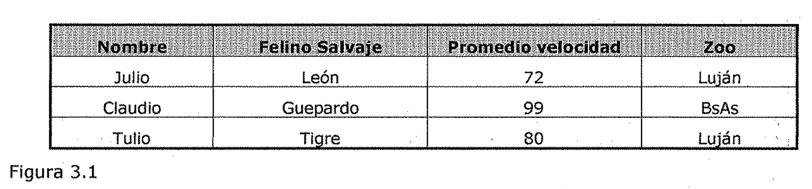
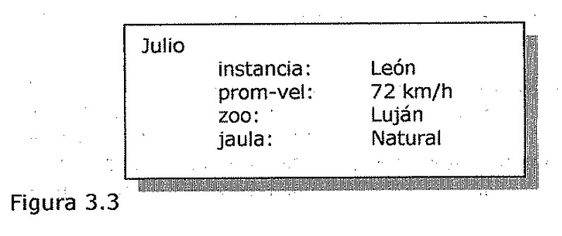
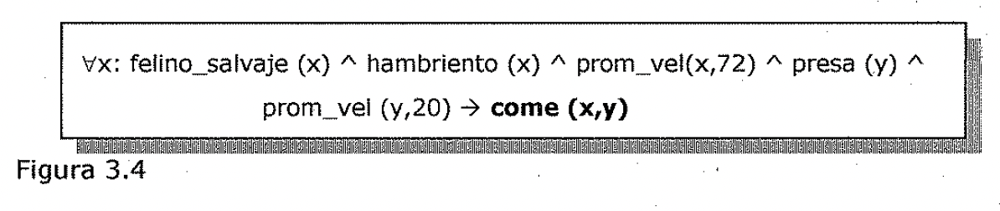
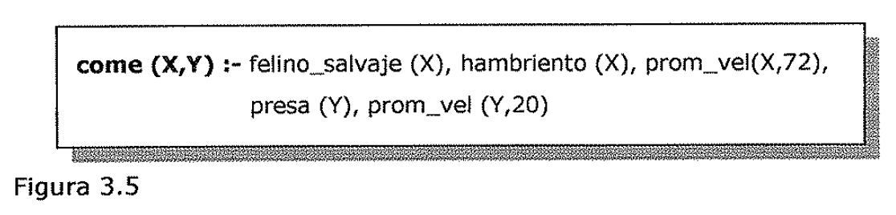

# Naturaleza del argumento
## El problema de la representación del conocimiento

### Correspondencia entre conocimiento y representación del conocimiento

Para resolver los complejos problemas con los que se enfrenta •la Inteligencia
Artificial, es necesario disponer tanto de una *gran cantidad de conocimiento*
como de una serie de *mecanismos que permitan manipularlo* con el fin de obtener
soluciones a nuevos problemas. En los programas de IA se ha representado el
conocimiento (hechos) de muy distintas maneras. Pero, antes de pasar a un
estudio detallado, debemos resaltar una característica que está presente en
todas las representaciones, el hecho de que estamos manejando dos tipos de
entidades: •

- Hechos: verdades en un cierto mundo. Es aquello que queremos representar.

- Representaciones de los hechos en un determinado formalismo: estas son las
  entidades que realmente seremos capaces de manipular.

Una posible estructuración consiste en clasificar estas entidades en dos niveles
distintos:

- **El nivel del conocimiento,** donde se describen los hechos (incluyendo el
  comportamiento y los objetivos de cada agente).

- **El nivel simbólico,** donde se describen los objetos del nivel del
  conocimiento en términos de símbolos manipulables por programas.

*La relación que* se *establece entre los hechos reales y la representación de
los mismos* se denomina ***correspondencia de la representación.*** La
representación hacia delante establece una correspondencia entre los hechos y
sus representaciones, mientras que la representación hacia atrás establece la
correspondencia inversa, desde las representaciones a los hechos.

Veamos un ejemplo sencillo donde utilizaremos la *lógica matemática* como
*formalismo de representación.* Consideremos la frase:

***Spot* es *un perro.***

Esta frase representa un hecho que en lógica se puede escribir como:

**perro(Spot)**

Supongamos que también disponemos de un formalismo lógico para representar el
hecho de que todos los perros tienen rabo:

vx: **perro(x)** ➔ **tiene rabo(x)** Y entonces, mediante el mecanismo deductivo
de la lógica, se puede generar una nueva representación para el objeto:

**tiene rabo(Spot)**

Utilizando una apropiada función de correspondencia hacia atrás, se puede
generar la correspondiente frase en castellano:

***Spot tiene rabo.***

O bien se podría utilizar esta representación como detonante de una determinada
acción o en la derivación de las representaciones de otros hechos.

Es importante recordar que *las funciones de correspondencia no suelen ser
biunívocas.* De hecho no suelen ser ni siquiera funciones, sino relaciones de
muchos a muchos.

En algunas ocasiones, el uso de una buena representación hace que el mecanismo
de razonamiento de un programa sea no solo correcto sino también trivial.

### Propiedades de un buen sistema de representación del conocimiento

Un buen sistema de representación del conocimiento en un dominio particular debe
poseer las siguientes propiedades: ('

- Suficiencia de la representación: La capacidad de representar todos los tipos
  de

conocimiento necesarios en el dominio.

- Suficiencia deductiva: La capacidad para manipular las estructuras de la
  representación con el fin de obtener nuevas estructuras que se correspondan•
  con un nuevo conocimiento deducido a partir del antiguo.

- Eficiencia deductiva: La capacidad de incorporar información adicional en las

estructuras de conocimiento con el fin de que los mecanismos de inferencia
puedan seguir las direcciones más prometedoras.

- Eficiencia en la adquisición: La capacidad de adquirir nueva información con
  facilidad. El

caso más simple es aquel en el que una persona inserta directamente el
conocimiento en la base de datos. Idealmente, el programa sería capaz de
controlar la adquisición de conocimiento por sí mismo.

Desgraciadamente todavía no se ha encontrado ningún sistema que optimice todos
estos aspectos que sea aplicable a cualquier tipo de conocimiento. En
consecuencia, *existen* *múltiples técnicas para la representación del
conocimiento.* Muchos programas utilizan más de una técnica. En los próximos
capítulos se describirán con detalle las más importantes de estas técnicas,
pero, a modo de introducción, en este apartado se pasa revista a las principales
ideas.

### Modelos de representación del conocimiento

**Espectro Sintáctico-Semántico de la Representación**

Por un lado, hay ***sistemas puramente sintácticos*** en los que *no se tiene en
cuenta el* *significado del conocimiento que está siendo representado.* Tales
sistemas poseen reglas simples y uniformes para manipular la representación. No
tienen en cuenta la información que contiene esta. Por otro lado, existen
***sistemas puramente semánticos*** en los que no hay una forma unificada. Cada
aspecto de la representación corresponde a una parte de información diferente y
las reglas de inferencia son, por tanto, complicadas.

Se verán nueve estructuras declarativas diferentes para representar el
conocimiento:

- Lógica de predicados

- Reglas de producción

- Sistemas no monótonos

- Sistemas de razonamiento estadístico

- Redes semánticas

- Marcos

- Dependencia conceptual

- Guiones

- CYC

De todas ellas, las ***representaciones lógicas*** *(lógica de predicados y
sistemas no monótonos)* y las ***estadísticas,*** son las más puramente
sintácticas. Sus reglas de inferencia son procedimientos estrictamente
sintácticos que operan sobre fórmulas bien formadas (fbf) a pesar de lo que
estas representan. Los sistemas de ***reglas de producción*** son también,
**principalmente sintácticos.** Los intérpretes para estos sistemas normalmente
usan únicamente información sintáctica para decidir que reglas desestiman. De
nuevo se ve la similitud entre lógica y reglas de producción como formas de
representación y utilización del conocimiento. Pero es posible construir
sistemas del tipo regla-producción, que tienen más semántica englobada en ellos.
Por ejemplo, en EMYCIN y otros sistemas que proporcionan un soporte explícito a
los factores de certeza, las semánticas de dichos elementos son utilizadas por
el intérprete de reglas para guiar este comportamiento.

Las ***estructuras de ranura y relleno*** están normalmente orientadas más a la
semántica, aunque se extienden bastante profundamente dentro de este espectro.
Las redes semánticas, como su propio nombre indica, están diseño\\adas para
capturar las relaciones semánticas entre entidades, y normalmente se utilizan
con un conjunto de reglas de inferencia que han sido especialmente diseño\\adas
para manejar correctamente los tipos específicos de arcos presentes en la red.
(Por ejemplo, las uniones del tipo es-un se tratan de un modo diferente que la
mayoría del resto de enlaces). Los ***sistemas de marcos*** están normalmente
más estructurados que las redes semánticas y contienen un conjunto incluso mayor
de reglas de inferencia especializadas, incluyendo aquellas que llevan a cabo un
array completo de reglas de inferencia por defecto, además de otros
procedimientos como la verificación de la consistencia.

La ***dependencia conceptual*** va incluso más allá en cuanto a una
representación semántica en lugar de una sintáctica. No solo proporciona la
estructura abstracta de una representación, sino que además proporciona una
indicación específica sobre los componentes que debe contener la representación
(como las primitivas ACTs y las relaciones de dependencia). As\[ aunque las
representaciones CD se pueden considerar como instancias de las redes
semánticas, estas pueden ser utilizadas por mecanismos de inferencia más
potentes, que utilicen el conocimiento específico que contienen.

Y aunque los ***guiones*** se presentan muy similares a los marcos, en realidad
se trata de marcos en los que las ranuras se han elegido cuidadosamente para
representar la información que es útil cuando se razona acerca de situaciones.
Esto hace posible que los procedimientos de manipulación de los guiones puedan
aprovechar el conocimiento con el que están trabajando y así, poder resolver
problemas más eficazmente. ***CYC*** utiliza tanto los marcos como la lógica
(dependiendo del nivel en que utilicemos el conocimiento) para codificar los •
tipos específicos de conocimiento e inferencia asistida en el razonamiento de
sentido común. El CYC es el más semántico de los sistemas que se han visto, ya
que internamente proporciona el conocimiento más desarrollado para la
manipulación de los diferentes tipos de estructuras del conocimiento.

3.:1..3,1. Conocimiento relacional simple

El modo más sencillo de representar los hechos declarativos es mediante un
*conjunto de relaciones del mismo tipo que las utilizadas en las sistemas de
bases de datos.* En la Figura 3.1 se muestra un ejemplo de dichos sistemas
relacionales. Se dice que esta representación es ***simple*** debido a la
*escasa capacidad deductiva que ofrece.* Pero el conocimiento representado de
esta forma puede servir como entrada a otros mecanismos de inferencia más
potentes.

Por ejemplo, dado los hechos de la Figura 3.1 no es posible responder a una
pregunta tan sencilla como *"quién es el felino más rápido?".* Pero dado un
procedimiento para encontrar el felino más rápido, estos hechos permitirían que
dicho procedimiento calcule una respuesta.

Julio

Claudio

Tulia

León Gue ardo

Ti re

Lu•,fo

BsAs Lu·an

Figura 3.1

*Los sistemas de bases de datos están diseñados para proporcionar el soporte
adecuado al conocimiento relacional.* Por tanto, no nos extenderemos más en
explicaciones de este tipo de estructura de conocimiento. Los problemas
prácticos que surgen cuando se intenta conectar un sistema de base de datos, que
proporciona este tipo de soporte, con un sistema de representación del
conocimiento,.que incorpora otras capacidades que describiremos a continuación,
ya han sido resueltos en diferentes productos comerciales.

3.1.3.2, Conocimiento heredable

El conocimiento:conocimiento relacional de la Figura 3.1 se i:compone de un
conjunto de atributos que junto con unos valores asociados permite describir los
objetos de la base de conocimiento. El (' conocimiento acerca de los objetos, de
sus atributos y de sus valores no tiene que ser tan simple como el que se
muestra en el ejemplo. En particular, es posible *extender la* *representación
básica con unos mecanismos de inferencia que operen sobre la estructura de la*
*representación.* Para que esto sea efectivo, la estructura se debe diseñar de
acuerdo con el mecanismo de inferencia que se desee. ***Una de las fórmulas más
útiles. de inferencia* es *la***

***herencia de propiedades, donde los elementos de una clase heredan los
atributos y***

***los valores de otras clases más generales en los que están incluidos.***

Felino

es-un

.---- L---promedio-vel

es-un Felino Salvaje

es-un 80 km/h

100 km/h

rom-vel

.--->--promedio-vel

León

instancia instancia 70 km/h

BsAs

99 km/h

promedio-vel Piedra

jaula

Figura 3.2

zoo Claudio Julio

zoo Luján

promedio-vel 72 km/h

jaula Natural

Para dar soporte a la ***herencia de propiedades,*** los objetos se deben
organizar en ***clases,*** y las clases se deben disponer como una ***jerarquía
de generalizaciones.*** En la Figura 3.2 aparece una estructura organizada de
esta forma, en ella se ha introducido conocimiento acerca de felines salvajes.
Las ***líneas*** representan *atributos;* los ***nodos recuadrados***
representan *objetos y valores de los atributos de los objetos.* Estos valores,
a su vez, también se pueden ver coma objetos con atributos y valores, y así
sucesivamente. Las ***flechas*** *conectan los objetos con sus valores a través
de los correspondientes atributos.* La estructura que aparece en la figura es lo
que se denomina una ***estructura de ranura y relleno*** *(slot-* *and-filler).*
También se puede denominar red semántica o colección de estructuras (frames).

En este último caso, cada estructura representa la colección de atributos y
valores asociados con un nodo en particular.

La Figura 3.3 muestra el nodo correspondiente a un león representado como una
estructura.

No hay que dejarse desanimar por la confusion terminológica. Es tan flexible el
modo en que se puede utilizar esta (y el resto de las estructuras que se
describen en este apartado) para resolver cada uno de los problemas concretes de
representación, que es difícil reservar palabras precisas para cada
representación particular. En general, el uso del término sistema de estructuras
*(frame system)* implica, de alguna manera, una mayor estructuración en los
atributos yen el mecanismo de inferencia que cuando se utiliza el término red
semántica.

Julio

instancia: promedio-vel: zoo: • jaula:

León

72 km/h Luján Natural

Figura 3.3

Lo que haremos aquí será dar una idea acerca de la manera en que sirven de
soporte a la deducción mediante el conocimiento que contienen. Todos los objetos
y la mayoría de los atributos que se utilizan en este ejemplo pertenecen al
dominio de los felinos y no son significativos en general. Las dos. excepciones
son el atributo ***es-un*** (is a), que se utiliza para indicar *que una clase
está contenida en otra,* y el atributo ***instancia,*** que se utiliza para
indicar *pertenencia a una clase.* *Estos dos atributos específicos (de utilidad
general) son la base de la herencia de propiedades como una técnica de
inferencia. Mediante esta técnica se puede acceder a la base de conocimiento y
recuperar los hechos que han sido explícitamente almacenados en ella, así coma
otros hechos que se pueden deducir de los primeros.* Una forma ideal de
algoritmo de herencia de las propiedades se podría enunciar de la siguiente
forma.

**Algoritmo: herencia de propiedades**

Para acceder al valor V de un atributo A en una instancia I:

1. Encontrar I en la base de conocimiento.

1. Si el atributo **A** tiene algún valor asignado, devolver ese valor.

1. En caso contrario, comprobar si el atributo *instancia* tiene algún valor
   asignado. Si no lo tiene entonces fallar.

1. En caso contrario, ir al nodo identificado por ese valor y comprobar si alH
   existe algún valor para el atributo **A.** Si lo hay, devolverlo.

1. En caso contrario, repetir hasta que el atributo *es-un* no tenga valor
   asignado o hasta encontrar una respuesta:

1. Obtener el atributo *es-un* e ir a ese nodo.

1. Comprobar si el atributo **A** tiene algún valor. Si lo tiene, devolverlo.

' Este procedimiento es una simplificación. No dice nada acerca de cómo proceder
cuando hay más de un valor para los atributos *instancia* o *es-un.* Pero aun
así describe el mecanismo básico de la herencia.

3,1,3,3. Conocimiento deductivo

La herencia de propiedades es una forma muy potente de inferencia, pero no es la
única. En algunas ocasiones es necesario echar mano de ***toda la potencia de la
lógica tradicional*** y aún más) para describir las inferencias apropiadas. En
la Figura 3.4 se muestra un ejemplo de la ***lógica de predicados de primer
orden*** aplicada a la representación de conocimiento adicional acerca de los
felinos salvajes.

\\Ix: felino_salvaje (x) A hambriento (x) " promedio_vel(x,72) A presa (y) "
promedio_vel (y,20) ➔ **come (x,y)**

Figura 3.4

Por supuesto, este conocimiento será inútil a menos que se disponga de un
mecanismo de inferencia que lo pueda aprovechar (de la misma forma que el
conocimiento por omisión del ejemplo anterior habría sido inútil sin el
algoritmo que permitía recorrer la base de conocimiento).

El ***procedimiento de inferencia*** necesario en este caso será uno que
implemente las ***reglas lógicas de la inferencia.*** Existen muchos de tales
mecanismos, algunos de los cuales razonan hacia adelante a partir de los hechos
hasta llegar a las conclusiones, mientras que otros razonan hacia atrás desde
las conclusiones buscadas hasta los hechos de partida. Entre los más utilizados
de estos procedimientos se encuentra el de ***resolución*** que utiliza una
estrategia de prueba por contradicción.

### Conocimiento procedimental

Hasta ahora los ejemplos sobre la base de conocimiento acerca de los felinos
salvajes se han centrado en hechos declarativos relativamente estáticos. Pero
existe otro tipo de conocimiento, ***operacional o procedimental,*** igualmente
útil, que especifica que hacer cuando se da una determinada situación. El
conocimiento procedimental se puede representar en los programas de muchas
maneras distintas. La manera más habitual consiste en especificarlo como *un*
***código*** *(en algún lenguaje de programación* como *PROLOG)* ***que hace
algo.*** La máquina utiliza el conocimiento cuando ejecuta el código para llevar
a cabo una determinada tarea. Un ejemplo de esto se ve en la Figura 3.5 **come
(X,Y)**:- felino_salvaje (X), hambriento (X), promedio_vel(X,72), presa (Y),
promedio_vel (Y,20)

Figura 3.5

### Problemas de la representación del conocimiento

Antes de embarcarnos en la
   discusión de los mecanismos específicos que se utilizan para la
   representación de los distintos tipos de conocimiento acerca del mundo real,
   es necesario señalar brevemente una serie de cuestiones presentes en todos
   ellos:

#### Atributos importantes

**iExisten atributos tan genéricos que aparezcan en prácticamente todos los
dominios**

**de aplicación? ¿Si es así, es necesario asegurarse de que sean tratados**
**adecuadamente en cada uno de los mecanismos que se propongan. Si esos
atributos existen ¿Cuáles son?** Hay dos atributos con una especial
significación, cuyo uso nos han sido presentados anteriormente: ***instancia* y
*es-un.*** Estos atributos son importantes debido a que en ellos se apoya la
herencia de propiedades. Reciben diferentes nombres en los sistemas de IA, pero
el nombre es lo de menos, lo importante es que dichos atributos representan la
*pertenencia a* *una clase* y la *inclusión de una clase en otra,* y que *la
inclusión de clases es transitiva.*

#### Relaciones entre atributos

**iSe pueden establecer relaciones relevantes entre los atributos de los
objetos?** Los atributos que se utilizan para describir a los objetos pueden ser
a su vez entidades representables. *¿Qué* propiedades poseen independientemente
del conocimiento específico que (.

codifiquen? Hay cuatro propiedades que merece la pena mencionar aquí:

Inversos

- Existencia en una jerarquía es-un

- Técnicas para el razonamiento acerca de los valores

- Atributos univaluados

**Inversos**

Las entidades del mundo se pueden relacionar de muy diversas maneras. Pero desde
el momento en que decidimos describir esas relaciones como atributos, nos
restringimos a una perspectiva según la cuál nos fijamos en un objeto y tratamos
de establecer las relaciones que existen entre el y los otros. Los atributos son
esas relaciones.

Por ejemplo, en el caso de la siguiente representación:

zoo(Julio,Luján) se puede interpretar igualmente como una afirmación acerca de
Julio o acerca de Luján. Su uso efectivo dependerá del resto de los hechos que
contenga el sistema.

Otra aproximación consiste en utilizar atributos que fijen un determinado punto
de vista, pero utilizándolos por parejas, de manera que ***uno sea el inverso
del otro.*** De esta manera, tendremos dos hechos:

- uno asociado con Julio zoo = Luján

- otro asociado con Luján felinos = Julio,

Esta es la aproximación que se toma en los sistemas de redes semánticas y los
sistemas basados en marcos. Cuando se utiliza, suele ir acompañada de una
herramienta para la adquisición de conocimiento que obliga a la *declaración
conjunta de los atributos inversos.*

**Existencia en una jerarquía es-un**

De la misma forma que existen clases de objetos y subconjuntos más específicos
de esas clases, también se puede hablar de *atributos y especializaciones de*
los *atributos.* Considérese, por ejemplo, el atributo felinos_salvajes. Este
atrib.uto es en realidad una especialización del atributo felinos, que a su vez,
es una especialización del atributo mamíferos. Este tipo de relaciones de
***generalización-especialización*** referidas a los atributos tienen la misma
misión que cuando se aplican a los demás conceptos - *servir de soporte a la
herencia.* En el caso de los atributos, la información que se hereda consiste en
cosas tales como restricciones sobre los valores que un atributo puede tomar o

- ) mecanismos para el cómputo de dichos valores.

**Técnicas para e.1 razonamiento acerca de los valores**

En ocasiones los valores de los atributos se especifican explícitamente durante
la creación de una base de conocimiento. Pero generalmente el sistema debe
razonar sobre valores que no ha recibido explícitamente. Hay varios tipos de
información que pueden jugar un determinado papel en este razonamiento,
incluyendo:

Información acerca del tipo del valor. El valor de altura debe ser un número
medido en una unidad de longitud.

- Restricciones sobre el valor. La edad de una persona no puede ser mayor que la
  de ninguno de sus progenitores.

- Reglas para el cómputo de un valor cuando sea necesario. Reglas hacia atrás.

- Reglas que describen las acciones que se deberían llevar a cabo en el caso de
  gue se llegase a conocer un determinado valor. Reglas hacia adelante.

**Atributos univaluados**

Un tipo de atributo, no por específico menos útil, es aquel que ***solo puede
tomar un (mica valor.*** Por ejemplo, un león determinado solo puede pertenecer
a un único zoo, y tiene una única velocidad promedio. Cuando se pretenda definir
un nuevo valor para uno de estos atributos que ya tuviera otro valor asignado
previamente, solo puede ser por dos razones. O bien se ha producido un cambio en
el mundo o bien existe una contradicción en la base de conocimiento que es
necesario resolver.

c. Selección de la granularidad de la representación i.A que nivel se debe
representar el conocimiento?

Independientemente del mecanismo de representación que se elija, es necesario
responder a (' la siguiente cuestión: *"¿A qué niVel de detalle* se *debería
representar el mundo?"* Un buen ejemplo servirá de ilustración al problema.
Supongamos que estamos interesados en representar el hecho:

**Juan vislumbró a Susana**

Una posible representación sería:

Con esta representación sería sencillo responder a la pregunta:

¿Quién vislumbró a Susana?

Pero supongamos que queremos saber si:

**i.Vio Juan a Susana?**

La respuesta, obviamente, es que *"si",* pero no es una respuesta que podamos
obtener a partir del único hecho conocido hasta ahora. Por supuesto se podrían
añadir otros hechos como:

vislumbró(x,y) ➔ vio(x,y) Otra posible solución consistiría en representar
explícitamente el hecho de que vislumbrar es en realidad una forma particular de
ver. Se podría escribir algo así como:

vio(agente(Juan), objeto(Susana), duración(breve)) El problema de *elegir la
granularidad de la representación adecuada no* es *fácil.* Está claro que
mientras más bajo sea el nivel que escojamos, más sencillo será razonar para
ciertos casos, a costa de un proceso de inferencia más complejo para obtener esa
representación a partir del lenguaje natural y de un mayor espacio de
almacenamiento, puesto que muchas inferencias se representarán muchas veces.

**D. La representación de conjuntos de objetos**

### ¿Cómo se deben representar los conjuntos de objetos?

La posibilidad de representar conjuntos de objetos es importante por varias
razones.

En primer lugar, *existen propiedades que* se *verifican en conjuntos de objetos
pero no* *así en las elementos particulares de las conjuntos.* Por ejemplo, "En
Australia hay más ovejas que personas".

La otra razón por la que es importante disponer de algún medio de representación
de conjuntos es que *cuando existe una propiedad que verifican todos los
elementos de un* *conjunto,* es *más eficiente asociar esa propiedad al conjunto
que asociarla (* *individualmente a cada uno de sus componentes.* Hay dos formas
de definir un conjunto y sus elementos.

La primera consiste en ***enumerar* todos *los elementos.*** Es lo que se
denomina una *definición por extensión.* • La segunda consiste en ***dar una
determinada regla,*** de forma que cuando se evalúa ' un determinado objeto, da
como resultado verdadero o falso según que el objeto C pertenezca o no al
conjunto. Tales reglas son denominadas *definiciones par* *comprensión.* Por
ejemplo, una definición por extensión del conjunto de los planetas habitados por
personas de nuestro sistema solar es {Tierra}. La definición por comprensión
sería:

De esta forma, es muy fácil determinar cuando son iguales dos conjuntos
definidos por extensión, pero no así cuando los conjuntos se definen por
comprensión.

Sin embargo, las representaciones por comprensión permiten la definición de
conjuntos infinitos y de conjuntos en los que no se conocen explícitamente todos
sus elementos.

La segunda propiedad es que los conjuntos descritos por comprensión se pueden
definir dependientes de parámetros modificables, como el tiempo o la
localización espacial.

**E. Búsqueda de la estructura adecuada a cada circunstancia**

**Dada una base de conocimiento muy extensa ¿Cómo acceder a los fragmentos**

**relevantes en cada momento?**

1 Una vez que se ha encontrado una estructura de conocimiento candidata a
resolver el problema en curso, es necesario establecer una correspondencia
detallada entre ambos. Los detalles del proceso de correspondencia dependerán de
la representación que se utilice. Puede consistir en establecer las ligaduras
adecuadas entre los objetos y las variables, o puede que sea necesario hacer
comparaciones entre atributos. En cualquier caso, a medida que se localicen los
valores que satisfagan las restricciones impuestas por la estructura de
conocimiento, aquellos irán ocupando sus correspondientes lugares dentro de la
estructura.

Al intentar acceder a los fragmentos relevantes de la base de conocimiento, en
cada momento es importante tener en cuenta los siguientes puntos:

Tomar aquellas partes de la estructura seleccionada que se hayan conseguido ·,,
identificar en la presente situación y utilizarlas en la búsqueda de las
posibles alternativas.

Obviar el fall\<i de la estructura actual y seguir utilizándola. Por. ejemplo,
una silla con solo tres patas puede que simplemente este rota, o que haya otro
objeto delante que impida ver la cuarta pata.

- Utilice enlaces que conecten las estructuras y que sugieran posibles
  direcciones de búsqueda.

- Si las estructuras de i;conocimiento están almacenadas como una jerarquía
  es-un,

ascender por la jerarquía hasta encontrar una estructura lo bastante general.
como para no entrar en contradicción con la situación en curso.

### El problema del marco

En este capítulo se han descrito diversos métodos de representación del
conocimiento que permiten la construcción de descripciones de estados complejos
en un programa de búsqueda.

*Existe una cuestión adicional relacionada con la representación eficiente de
las secuencias de estados que se generan en un proceso de búsqueda.* Esta puede
ser una tarea difícil cuando se trate de problemas complejos o que presenten
estructuras extrañas.

**Considérese el mundo de los robots domésticos.**

Existe un gran número de objetos y relaciones a representar, de modo que en las
descripciones de los estados se deben incluir hechos tales como
***encima(Planta12,Mesa34),*** consiste en almacenar la descripción de cada
estado como una lista de tales hechos.¿Pero qué ocurre durante el proceso de
resolución de problemas si cada una de dichas descripciones es muy larga?

***La mayoría de los hechos no cambiará de un estado a otro,*** a pesar de lo
cuál *se* ***representarán en cada uno de los nodos y la memoria se llenará
rápidamente,*** Y lo que es más, ***se empleará la mayor parte del tiempo en la
creación de estos nodos*** ***y en la copia de estos hechos*** - la mayor parte
de los cuales no cambia - de unos nodos a otros.

Por ejemplo, en el mundo del robot, se emplearía mucho tiempo repitiendo en cada
nodo ***debajo(Suelo, Techo).* Y** todo esto además de resolver el verdadero
problema que consiste en determinar los cambios que se deberían producir de un
nodo al siguiente.

*Al problema de la representación de los hechos que cambian, así coma de
aquellos que no lo hacen,* es *a lo que se conoce coma* ***problema del marco***
*(frame problem)* [@mccarthyHayes1969philosophical]. En determinados dominios,
el único problema consiste en la representación de todos los hechos. En otros,
en cambio no es trivial determinar cuáles son los que cambian. Por ejemplo, en
el mundo del robot, se puede tener una planta encima de una mesa que está debajo
de una ventana. Supongamos que se desplaza la mesa al centro de la habitación.
Se deberá inferir que la planta también está ahora en el centro de la habitación
pero que la ventana no.

Para llevar a cabo este tipo de razonamiento, hay algunos sistemas donde se
utilizan explícitamente unos axiomas denominados ***axiomas del marco,*** que
***describen las cosas*** ***que cambian cuando se aplica un determinado
operador sobre el estado n para alcanzar el estado n+1..*** (Todo aquello que
cambia forma parte del propio operador).

Así, en el dominio del robot, se escribirían axiomas como este:

Color(x,y,s1) A desplaza(x,s1,s2) ➔ color(x,y,s2) que se puede leer como, *"Si x
es de color y en el estado s1 y se aplica la operación de* *desplazamiento de x
en el estado s1 para llegar al estado s2, entonces el color de x en* s2 *sigue*
*siendo y".* Desgraciadamente en los dominios complejos es necesario utilizar un
enorme número de axiomas como estos. Otra aproximación consiste en suponer que
solo cambia aquello que debe.

Donde por *"debe"* se entiende que los cambios vendrán dados explícitamente por
los axiomas qu describen al operador o que se deducen de manera lógica de algún
cambio explícito. Esta idea de circunscribir el conjunto de cosas inusuales es
muy potente; se puede utilizar como una solución parcial al problema estructural
y como un modo de razonamiento con conocimiento incompleto.

## Lógica simbólica

### La lógica y el lenguaje

### Introducción

**¿Qué es la Lógica?**

Es fácil hallar respuestas a la pregunta *"¿Qué* es la Lógica?" Según Charles
Peirce, "Se han dado casi un centenar de definiciones de ella". Pero Peirce
continúa diciendo:

*"Sin embargo, se concederá generalmente que su problema central es la
clasificación de los argumentos, de modo que todos los que sean malos se pongan
de un lado y los que sean buenos del otro.*.. " ***El estudio de la Lógica,* es
*el estudio de los métodos y principios usados al distinguir entre los
argumentos correctos (buenos) y los argumentos incorrectos (malos).*** Con esta
definición no se intenta implicar, desde luego, que uno puede hacer la
distinción solo si ha estudiado lógica. Pero el estudio de esta ayudará a
distinguir entre los argumentos correctos e incorrectos, y lo hará de varias
maneras. Ante todo, en el estudio propio de la lógica, esta se aborda como un
arte y como una ciencia.

- Aquí, como en cualquier parte, *la práctica ayudará a alcanzar la perfección.*

- En segundo lugar, el estudio de la lógica, especialmente la lógica simbólica,
  como el estudio de cualquier ciencia exacta *incrementará la capacidad de
  razonamiento.*

- Y por último, el estudio de la lógica dará al estudiante ciertas *técnicas
  para probar la validez de todos los argumentos,* incluyendo los suyos. Este
  conocimiento tiene valor porque cuando los errores son de fácil detección es
  menos probable que se cometan.

La lógica se ha definido con frecuencia como la ***ciencia del razonamiento.***
Esta definición, aunque da una *clave* a la naturaleza de la lógica, no es muy
exacta. El razonamiento es la clase especial de pensamiento llamada
***inferencia,*** en la que. **se *sacan conclusiones partiendo de premisas.***
Como pensamiento, sin embargo, no es campo exclusivo de.la lógica, ' sino parte
también de la materia de estudio del psicólogo. Los psicólogos que examinan el •
proceso del razonamiento lo encuentran en extremo complejo y altamente
emocional, consistente en torpes procedimientos de prueba y error iluminados por
súbitas - y a *veces* en apariencia inconsecuentes - visiones internas. Todos
son de importancia para la psicología.

***Pero el lógico no* se *interesa en el proceso real del razonamiento. A el le
importa la corrección del proceso completado.*** Su pregunta siempre es: *lse*
sigue la conclusión alcanzada de las premisas usadas o supuestas? Si las
premisas son un fundamento adecuado para aceptar la conclusión, si afirmar que
las premisas son verdaderas garantiza el afirmar la verdad de la conclusión,
entonces el razonamiento es correcto. De otra manera es incorrecto.

Los métodos y técnicas del lógico se han desarrollado primordialmente con el
objeto de aclarar la distinción. El lógico se interesa en todo razonamiento, sin
atender al contenido mismo, sino solo desde este punto de vista especial.

## Naturaleza del argumento
**3.2.1.2, Naturaleza del Argumento**

La *inferencia* es una actividad en la que se afirma una proposición sobre la
base de otra u otras proposiciones aceptadas como el punto de partida del
proceso. *Al lógico no le concierne el proceso de inferencia, sino las
proposiciones iniciales y finales de ese proceso de las relaciones* entre
ellas.\* ***Las proposiciones son o verdaderas o falsas,*** y en esto difieren
de las preguntas, ordenes y exclamaciones. Los gramáticos clasifican las
formulaciones lingüísticas de las proposiciones, preguntas, ordenes, y
exclamaciones, en oraciones declarativas, interrogativas, imperativas y
exclamatorias, respectivamente. Estas nociones son familiares.

Es costumbre distinguir entre las oraciones declarativas y las proposiciones que
se afirman al pronunciar aquellas.

- La distinción se hace resaltar observando que ***una oración declarativa es
  siempre*** ***parte de un lenguaje,*** lengua en que se dice o se describe,
  mientras que *las* ***proposiciones no son privativas de ninguna de las
  lenguas en que* se *expresa.***

- Otra diferencia es que ***la misma oración articulada en diferentes contextos
  puede*** ***afirmar diferentes proposiciones.*** (por ej. la oración "tengo
  hambre", puede ser proferida por personas diferentes haciendo aserciones
  diferentes).

La misma clase de distinción puede establecerse entre las oraciones y los
enunciados. Puede hacerse el mismo enunciado utilizando palabras diferentes, y
la misma oración puede ser dicha en contextos diferentes para hacer enunciados
diferentes. Los términos *"enunciados"* y *"proposición"* no son sinónimos
exactos, pero en los escritos de los lógicos se usa más o menos en el mismo
sentido.

Aquí se • usaran los dos términos. En los capítulos siguientes usaremos también
el término "enunciado" y el término "proposición" refiriéndonos a las oraciones
en las que se expresan los enunciados (y las proposiciones). En cada caso, el
significado quedará claro por el contexto.

A cada *inferencia* corresponde un *argumento,* y de estos argumentos trata la
lógica primordialmente.

*Un* ***argumento*** *puede definirse como* ***un grupo cualquiera de
proposiciones o*** ***enunciados*** *de los cuales se afirma que hay uno que se
sigue de los demás, considerando estos coma fundamento de la verdad de aquel.*
La palabra argumento también tiene otros significados en su uso cotidiano, pero
en la lógica tiene el sentido técnico explicado. En los capítulos que siguen
usaremos también la palabra argumento en un sentido derivado para referirnos a
una oración cualquiera o colección de oraciones en que esta formulado o
expresado un argumento. Cuando así lo hagamos, presupondremos que la claridad
del contexto permite asegurar que al pronunciar esas oraciones se hacen
enunciados únicos o se afirman proposiciones únicas.

Todo argumento tiene una estructura, en cuyo análisis usualmente se emplean los
términos

***"premisa"* y *conclusión".***

*La* ***conclusión*** *de un argumento es la proposición afirmada basándose en
las otras proposiciones del argumento y estas otras proposiciones que se afirman
coma (* *fundamento o razones para la aceptación de la conclusión son las*
***premisas*** *de ese* *argumento.* Notemos que "premisa "y "conclusión" son
términos relativos, en el sentido de que la misma proposición puede ser premisa
en un argumento y conclusión en otro. As\[, todos los hombres son mortales es
premisa en el argumento

**Todos los hombres son mortales.**

Sócrates es un hombre.

Por lo tanto, Sócrates es mortal.

y conclusión en el argumento Todos las animales son mortales..

Todos las hombres son animales.

**Luego, todos los hombres son mortales.**

***Toda proposición puede ser premisa o conclusión dependiendo del contexto.***

Es una premisa cuando se presenta en un argumento en el que se le supone para
demostrar alguna otra proposición y es una conclusión cuando se presenta en un
argumento que se pretende la demuestra basándose en las otras proposiciones que
se suponen.

Es costumbre distinguir entre ***argumentos deductivos* e *inductivos.*** En
todos los argumentos se pretende que las premisas proporcionen algún fundamento
para la verdad de sus conclusiones, pero solo en un *argumento deductivo* se
pretende que sus premisas proveen un fundamento *absolutamente concluyente.* Los
términos técnicos ***"válido"* e *"inválido"*** se usan en lugar de "correcto" e
"incorrecto" al caracterizar los *argumentos deductivos.* *Un* ***argumento
deductivo es válido*** *cuando sus premisas y conclusiones están relacionadas de
modo tal 'que es absolutamente imposible que las premisas sean verdaderas, a
menos que la conclusión lo sea también.* La tarea de la lógica deductiva es la
que aclara la naturaleza de la relación que existe entre premisas y conclusión
en un argumento válido, y proporcionar las técnicas de discriminación entre los
válidos y los inválidos.

En los argumentos inductivos solo se pretende que sus premisas proporcionen
*algún* fundamento para sus conclusiones. Ni el término "válido" ni su opuesto
"inválido" se aplican con propiedad a los argumentos inductivos. Los argumentos
inductivos difieren entre sí en el *grado de verosimilitud o probabilidad que
sus premisas confieren a sus conclusiones,* y se ¿es estudia en la lógica
inductiva. Pero en este libro nos ocuparemos solamente de los argumentos
deductivos y usaremos la palabra *"argumento"* en referencia exclusiva a los
argumentos deductivos.
