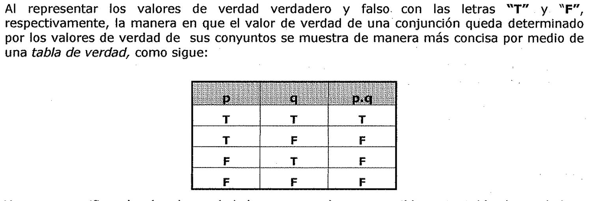
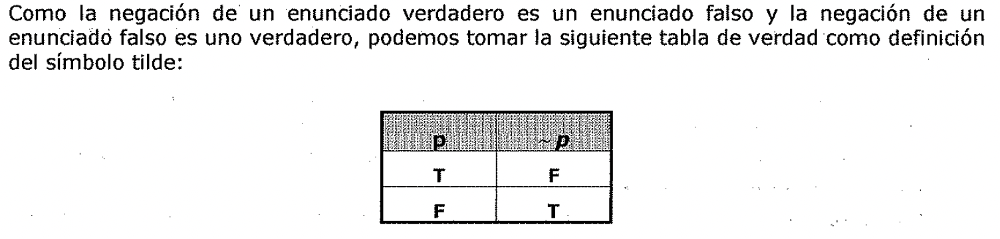
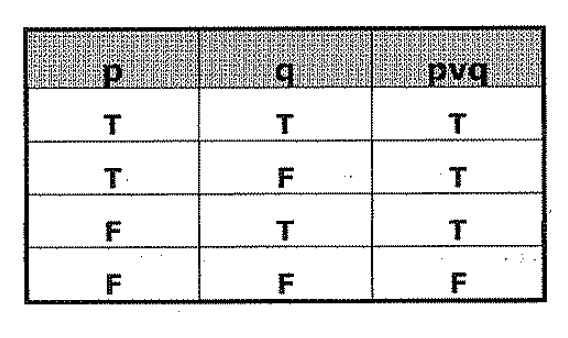
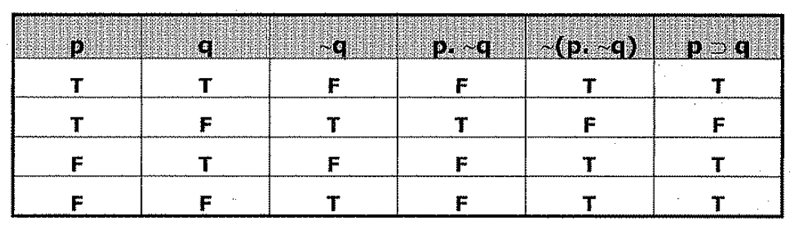

# Lógica simbólica y enunciados

Se ha explicado que a la lógica le conciernen los argumentos y que estos
contienen proposiciones o enunciados como sus premisas **y** conclusiones. Estas
últimas no son entidades lingüísticas, como las oraciones declarativas, sino más
bien son lo que las oraciones declarativas típicamente afirman al ser
articuladas.

Sin embargo, la comunicación de proposiciones y argumentos requiere el uso del
lenguaje, **y** esto complica nuestro problema. Los argumentos formulados en
ingles o cualquier otro lenguaje natural son de difícil evaluación debido a la
vaga y equfvoca naturaleza de las palabras en que se expresan, la ambigüedad de
su construcción, sus expresiones idiomáticas, que pueden interpretarse mal, y su
estilo metafórico agradable por un lado, pero engañoso por otro. Sin embargo la
resolución de estas dificultades no es el problema central para el lógico,
porque aún ya resueltas queda todavía el problema de decidir la validez o la
invalidez del argumento.

Para evitar las dificultades periféricas ligadas al lenguaje ordinario, los
trabajadores de las ciencias han desarrollado *vocabularios técnicos
especializados.* El científico economiza el espacio y el tiempo requeridos para
la escritura de sus reportes y teorías adoptando símbolos especiales para
expresar ideas que de otra manera requerirían una larga sucesión de palabras
familiares para su formulación. Esto tiene la ventaja adicional de reducir la
cantidad de atención requerida, puesto que cuando una oración o ecuación se
alarga demasiado se hace más difícil captar su significado. La introducción del
símbolo exponente en las matemáticas permite expresar la ecuación más breve e
inteligiblemente como

**A12** = 87

Una ventaja semejante se ha logrado usando las fórmulas gráficas en la química
orgánica; y el lenguaje de cualquier ciencia avanzada se ha visto enriquecido
por innovaciones simbólicas similares.

***La lógica también ha desarrollado un sistema de notación técnica especial.***

Aristóteles hada uso de ciertas abreviaciones para facilitar sus
investigaciones, y la lógica simbólica moderna ha crecido con la introducción de
otros muchos símbolos especiales. La diferencia entre la lógica nueva y la
antigua es más una cuestión de grado que de naturaleza, pero la diferencia de
grado es tremenda.

La lógica simbólica moderna es incomparablemente más poderosa como herramienta
de análisis y deducción a través del desarrollo de un lenguaje técnico propio.

*Los símbolos especiales de la lógica moderna nos permiten exhibir con mayor
claridad las estructuras lógicas de argumentos cuya formulación puede quedar
oscura en el lenguaje ordinario.* '1 Es una tarea más fácil la de dividir los
argumentos en válidos e inválidos cuando es ¿es expresa con el lenguaje
simbólico especial, pues en este no se dan los problemas periféricos de
vaguedad, ambigüedad, peculiaridades idiomáticas y metáforas. La introducción y
utilización de símbolos especiales sirve no solo para facilitar la evaluación de
los argumentos, sino también para aclarar la naturaleza de la inferencia
deductiva.

Los símbolos especiales de la lógica se adaptan mucho mejor que el lenguaje
ordinario a la obtención de las inferencias. Su superioridad en este respecto es
comparable a aquella de que gozan los numerales arábigos sobre los más antiguos
numerales romanos, tratándose de la computación. Es fácil multiplicar 148 por
47, pero muy difícil computar el producto de CXLVIII y XLVII. De manera
semejante, la obtención de inferencias y la evaluación de los argumentos se ve
grandemente facilitada con la adopción de una notación lógica especial.

## Argumentos que contienen enunciados compuestos

## Enunciados simples y compuestos

Todos los ***enunciados*** pueden dividirse en dos clases: ***simples*** y
***compuestos.***

- - - Un enunciado ***simple*** es uno que no contiene otro enunciado como parte
      componente.

* Todo enunciado ***compuesto*** contiene oti-o enunciado como componente.

Por ejemplo, *"Las pruebas de armas nucleares en la atmósfera serán
interrumpidas* o *este* *planeta* se *hará inhabitable"* es un enunciado
compuesto cuyos componentes son los dos enunciados simples *"Las pruebas de
armas nucleares en la atmósfera serán interrumpidas"* y *"este planeta será
inhabitable".* Las partes componentes de un enunciado compuesto pueden a su
*vez* ser enunciados compuestos, desde luego.

Ahora veremos algunas de las maneras diferentes de combinar los enunciados en
enunciados compuestos:

1. El enunciado *"Las rosas son rojas y las violetas son azules"* es una
   ***conjunción,*** un

enunciado compuesto que se forma insertando la palabra ***"y"*** entre los dos
enunciados. Dos enunciados así combinados se llaman enunciados ***conjuntos.***
Sin embargo, la palabra "y" tiene otros usos, como en el enunciado *"Castor y
Pólux eran gemelos"* que no es compuesto, sino un enunciado simple que afirma
cierta relación. Introducimos el punto "." como un símbolo especial para
combinar enunciados conjuntivamente. Usándolo, la conjunción precedente se
escribe "Las rosas son rojas. Las violetas son azules".

Si *p* y *q* son dos enunciados cualesquiera su conjunción se escribe ***p.q.***
Cada enunciado es o verdadero o fatso, de modo que se puede hablar del *valor de
la verdad* de un enunciado, siendo el valor de verdad de un enunciado verdadero,
*verdadero* y el valor de verdad de un enunciado fatso, *fatso.* Hay dos amplias
categorías en las que pueden dividirse los enunciados compuestos de acuerdo con
que exista o no una conexión necesaria entre el valor de verdad del enunciado
compuesto y los valores de verdad de sus enunciados componentes.

El valor de verdad del enunciado compuesto *"Smith cree que el plomo es más
pesado* *que el zinc"* es completamente independiente del valor de verdad de su
enunciado componente simple *"el plomo es más pesado que el zinc",* pues las
personas tienen creencias correctas tanto como creencias equivocadas.

Por otro lado, hay una conexión necesaria entre el valor de verdad de una
conjunción y los valores de verdad de sus enunciados conjuntos.

***Una conjunción* es *verdadera si sus conjuntos son ambos verdaderos, pero*
es**

***falsa en cualquier otra circunstancia.***

***Cualquier enunciado compuesto cuyo valor de verdad está determinado
completamente par las valores de verdad de sus enunciados componentes* es**

***un enunciado compuesto función de verdad.***

Los únicos enunciados compuestos que aquí consideraremos serán enunciados
compuestos función de verdad. Por lo tanto, en el resto de este libro usaremos
el término "enunciado simple" para referirnos a cualquier enunciado que no sea
compuesto función de verdad.

Como las conjunciones son enunciados compuestos función de verdad nuestro
símbolo es un conectivo de función de verdad (o veritativo funcional, como
también se dice).

Dados dos enunciados *p* y *q* hay solamente cuatro conjuntos de valores de
verdad para ellos, y en cada caso el valor de verdad de su conjunción *p*. *q*
está determinado de manera única. Los cuatro casos posibles pueden exhibirse
como a continuación:

- En el caso *p* es verdadero y *q* es verdadero, *p.q* es verdadero;

- En el caso *p* es verdadero y *q* es falso, *p.q* es falso;

- En el caso *p* es falso *y q* es verdadero, *p.q* es falso;

- En el caso *p* es falso y *q* es falso, *p.q* es falso.

Al representar los valores de verdad verdadero y falso. con las letras **"T" y
"F",** respectivamente, la manera en que el valor de verdad de una conjunción

 queda
determinado por los valores de verdad de sus conjuntos se muestra de manera más
concisa por medio de una *tabla de verdad,* como sigue:

| --- | --- | --- |

| **T** | **T** | T |

| **T** | **F** | F |

| **F** | **T** | **F** |

| **F** | **F** | **F** |

Ya que especifica el valor de verdad de *p.q* en cada caso posible, esta tabla
de verdad se puede tomar como *definición* del símbolo *punto.* Otras palabras
tales como "aunque", "sin embargo", etc., y hasta la coma y el punto y coma, se
utilizan también para conjuntar dos enunciados en un compuesto y todos ellos
pueden traducirse indiferentemente como el símbolo punto en lo que respecta a
los valores de verdad.

1. El enunciado *"No* es *el caso que el plomo sea más pesado que el oro"*
   también es compuesto siendo la ***negación*** (o el *contradictorio)* de su
   enunciado compuesto único *"el plomo es más pesado que el oro".* Introducimos
   el símbolo "~", llamado una *tilde,* para simbolizar la negación. Hay
   frecuentemente otras formulaciones en lenguaje ordinario, de una negación.
   Así, si *L* simboliza el enunciado *"el plomo es más pesado que el oro",* los
   enunciados diferentes "no es el caso que el plomo sea más pesado que el oro",
   "es falso que el plomo sea más pesado que el oro", "el plomo no es más pesado
   que el oro", "no es verdad que el plomo sea más pesado que el oro", "el plomo
   no es más pesado que el oro", se simbolizan todos indiferentemente como ~
   ***L.***

*Mas generalmente,* ***sip*** es *cualquier enunciado su negación se escribe* ~
***p.*** Como la negación de un enunciado verdadero es un enunciado falso y la
negación de un enunciado falso es uno verdadero, podemos tomar la siguiente
tabla de verdad como definición del símbolo tilde:

| --- | --- |

| **T** | **F** |

| **F** | **T** |

1. Cuando dos enunciados se combinan disyuntivamente insertando la palabra
   **"o"** entre ellos, el enunciado compuesto que resulta es una
   ***disyunción*** *(o alternación)* y los dos enunciados así combinados se
   llaman ***disyuntos*** *(o alternativos).*

La palabra "o" tiene dos sentidos diferentes, uno de los cuales es la clara
intención en el enunciado *"se perderá derechos a recompensas en caso de
enfermedad o desempleos".* Aquí la intención es obviamente cancelar el derecho a
premios no solo para las personas enfermas y las personas desempleadas sino
también para las personas que están enfermas y desempleadas.

*Este sentido de la palabra* **"o"** *se denomina* ***débil o inclusivo.*** En
donde la precisión sea esencial, como los contratos y otros documentos legales,
este sentido se hace explícito usando la frase ***"y/o".*** Es otro el sentido
de "o" que se intenta dar en el menú de un restaurante escribiendo *"te* o
*café",* queriendo decir que por el precio estipulado el cliente puede tomar
café o té pero no ambos.

*Este segundo sentido de* **"o"** es *llamado* ***fuerte*** *o* ***exclusivo.***
En donde la precisión es esencial y se quiere dar el sentido exclusivo a la
palabra "o" suele agregarse la frase ***"pero no ambos".***

***Una disyunción que usa el* "o" *exclusivo afirma que por lo menos uno de
los***

***disyuntivos es verdadero, pero no ambos son verdaderos.***

El *significado común parcial* que al menos un disyunto es verdadero, es el
significado todo de una disyunción inclusiva y parte del significado de una
disyunción exclusiva.

*En latín la palabra* ***"vel"*** *expresa el* ***sentido inclusivo*** *de la
palabra* "o" *y la palabra* Es costumbre usar la primera letra de "vel" para
simbolizar "o" en su sentido inclusivo. Si p y q son dos enunciados
cualesquiera, su ***disyunción débil o inclusiva*** se escribe ***p v q.*** El

símbolo de ***"v",*** denominado una cuña (o una ve), es un conectivo de función
de verdad y se define por la tabla de verdad siguiente:

| --- | --- | --- |

| **T** | **T** | T |

| T | F | T |

| F | T | T |

| F | F | F |

Un argumento que obviamente es válido y contiene una disyunción es el siguiente
Silogismo Disyuntivo:

Las Naciones Unidas serán reforzadas o habrá una tercera guerra mundial.

Las Naciones Unidas no serán reforzadas.

Luego habrá una tercera guerra mundial.

Es evidente que un Silogismo Disyuntivo es válido en cualquiera de las
interpretaciones de la palabra "o", esto es, sin atención a que su primera
premisa afirma una disyunción inclusiva o exclusiva. Es usualmente difícil, y a
veces imposible, descubrir cuál es el sentido de la palabra "o" que se intenta
dar en una disyunción. Pero el argumento válido típico que tiene una disyunción
como premisa es, como el Silogismo Disyuntivo, válido en cualquier
interpretación de la palabra "o".

*Por lo tanto,* ***efectuamos una simplificación al traducir cualquier
ocurrencia de la palabra* "o" *en el símbolo lógico "v"*** *-: sin atención al
sentido que* se *quiera dar a* Desde luego, en donde se establezca
explícitamente que la disyunción es exclusiva, usando la frase adicional "pero
no ambos", por ejemplo tenemos el aparato simbólico para simbolizar este
sentido, como se explica más adelante.

El· uso de los paréntesis, corchetes y llaves para la puntuación de las
expresiones matemáticas es familiar. La expresión "6 + 9 / 3", no determina un
número único, aunque si la puntuación aclara cómo agrupar. los números que la
constituyen, denota 5 o 9. La puntuación es nec.necesaria también para resolver
la ambigüedad en el lenguaje de la lógica simbólica, porque los enunciados
compuestos son susceptibles de combinaciones para formar enunciados más
complicados.

Hay ambigüedad en ***p* • *q v r,*** que podrían ser o la conjunción de p con q
v r, o por otro lado la disyunción de p. q con r. Estos dos sentidos diferentes
los dan sin ambigüedad las puntuaciones diferentes: ***p.(q v r)* y *(p. q) v
r.*** En el caso en que p y q sean falsos ambos y r verdadero, la primera
expresión puntuada es falsa (pues su primer enunciado conjunto es falso), pero
la segunda expresión puntuada es verdadera (pues su segundo enunciado disyunto
es verdadero). Aquí, la diferencia de puntuación hace toda la diferencia entre
verdad y falsedad. En la lógica simbólica, como en las matemáticas, usamos
paréntesis, corchetes y llaves. para la puntuación. Sin embargo, para reducir el
número de signos.de puntuación requerido estableceremos el convenio simbólico de
que en cualquier expresión la tilde se aplicará a la componente más pequeña
permitida por la puntuación: De este modo, la ambigüedad de ~ ***p v q,*** que
podría significar o *(~* ***p) v q*** o ~ ***p v q),*** queda resuelta por
nuestro convenio para significar la primera de estas, pues la tilde puede (y en
consecuencia por nuestro convenio lo hace) aplicarse a la primera componente p y
no a la expresión más larga p v q.

No todas las ***conjunciones*** se formulan explícitamente colocando la palabra
"y" entre oraciones completas, como en *"Carlitos es limpio y Carlitos es
encantador".* De hecho, esta se expresaría más naturalmente como *"Carlitos es
limpio y encantador",* y *"Juan y Carolina subieron a la colina"* es la manera
más natural de expresar la conjunción *"Juan subió a la* 1 *colina y Carolina
subió a la colina* ".

Lo mismo con las ***disyunciones:*** *"o Alicia o Beatriz serán elegidas"*
expresa más brevemente la proposición que alternativamente se fórmula como
*"Alicia será elegida o Beatriz será elegida";* y *"Carlota será secretaria o
tesorera."* expresa de manera un tanto más breve la misma proposición que *"o
Carlota será secretaria o Carlota será tesorera".* La ***negación*** de una
disyunción se expresa a menudo usando la frase *"ni-ni".* Así, la disyunción
*"Alicia o Beatriz serán elegidas"* queda negada por el enunciado *"ni Alicia ni
Beatriz serán elegidas".* La disyunción se simbolizaría como A v B, y su
negación como ~(A v B) o como (~A). ~B), que son fórmulas equivalentes. Negar
que al menos uno de los enunciados es verdadero es asegurar que ambos enunciados
son falsos.

La palabra *"ambos"* tiene varias funciones. Una de ellas es solo cuestión de
énfasis. Decir *"Ambos Juan y Carolina subieron a la colina"* es solo para
recalcar que los dos hicieron lo que se dice que hicieron al decir *''Juan y
Carolina subieron a la colina".* Una función más útil de la palabra "ambos" es
de puntuación. "Ambos... y \_. _ no son " se usa para expresar lo mismo que
"Ni... ni \_. _ es ". En oraciones tales el orden que guardan las palabras
"ambos" y "no" es de mucha significación. Hay una gran diferencia entre:

Alicia y Beatriz no serán ambas elegidas

Alicia y Beatriz ambas no serán elegidas.

La primera se simboliza como ~(A. B), la última como ~(A). ~(B).

Finalmente, hay que observar que la frase *"a menos que"* puede también usarse
en la expresión de la disyunción de dos enunciados.

Así, *"Nuestros recursos pronto se agotaran, a menos que se procesen más
materiales de desecho"* puede expresarse también como *"O se procesan más
materiales de desecho o se agotaran pronto nuestros recursos"* y se simboliza
como M v E.

Como una ***disyunción exclusiva*** asegura que la menos uno de los disyuntos es
verdadero pero no ambos, podemos simbolizar la disyunción exclusiva de dos
enunciados p y q cualesquiera simplemente como ***(p v q). ~(p. q).*** Así,
podemos simbolizar las conjunciones, las negaciones y las disyunciones
inclusivas y exclusivas. Todo enunciado compuesto construido a partir de
enunciados simples por aplicación repetida de conectivos de función de
verdad,.tendrá valores de verdad completamente determinados por los valores de
verdad.de esos enunciado simple.s. • Por ejemplo, si A y B son enunciados
verdaderos y X y Y son falsos, el Valor de verdad del enunciado compuesto
~\[(~Av X) v ~(B. Y)l puede encontrarse de la manera siguiente. Como A es
verdadero, ~A es falso, y como X es falso, también la disyunción (~A v X) es
falsa.• Dado que Yes falso, la conjunción (B. Y) es falsa y su negación ~(B.Y)
es verdadera. De este modo, la disyunción (~Av X) v ~(B. Y) es verdadera, y su
negación que es el enunciado original; es. falsa. Este procedimiento paso a
paso, iniciado en las componentes (más) internas nos permite, siempre,
determinar el valor de verdad de un enunciado compuesto función de verdad
partiendo de los valores de verdad de sus enunciados simples componentes.

## Enunciados condicionales

El enunciado compuesto *"Si el tren se retrasa entonces perderemos nuestro
transbordo"* es un ***condicional*** *(o un hipotético, una implicación* o *un
enunciado implicativo).* El enunciado componente situado entre el *"si"* y el
*"entonces"* es llamado el ***antecedente*** *(o el implicante* o *prótasis),* y
el componente que sigue al *"entonces"* es el ***consecuente*** *(o el
implicado* o *apódosis).* Un ***condicional*** no afirma que su antecedente sea
verdadero o que su consecuente lo sea; solo afirman que ***si su antecedente* es
*verdadero, entonces su consecuente* es *también*** ***verdadero,*** o sea, que
su antecedente implica su consecuente. La clave del significado de un
condicional es la relación de implicación que se asegura que existe entre su
antecedente y su consecuente, en ese orden.

Si examinamos un cierto número de condicionales diferentes veremos que pueden
afirmar diferentes implicaciones.

- En el condicional *"Si a todos los gatos* les *gusta el hígado y Dina es un
  gato, entonces a*

*DINA le gusta el hígado",* el consecuente se sigue ***lógicamente*** del
antecedente.

- Por otro lado, en el condicional *"Si la figura es un triangulo, entonces
  tiene tres lados",* el consecuente se sigue del antecedente por la
  ***definición*** misma de "triangulo".

- Pero la verdad del condicional *"Si el oro se sumerge en agua regia, entonces
  el oro se*

*disuelve"* no es cuestión de lógica ni de definición. Aquí la conexión afirmada
es causal y debe descubrirse ***empíricamente.*** Este ejemplo muestra que hay
diferentes clases de implicaciones que constituyen diferentes tipos de sentidos
de la frase *"si-entonces".* Observadas estas diferencias, ahora buscamos un
significado común identificable, algún ***significado parcial común*** a estos
que, como hemos aceptado, son diferentes tipos de condicionales.

Nuestra discusión de *"si-entonces"* correrá paralela a nuestra previa discusión
de la palabra "o".

Primero, señalamos dos sentidos diferentes de esa palabra.

Segundo, notamos que había un *significado parcial común:* el hecho de que al
menos un disyunto sea verdadero, se vio que estaba involucrado tanto en el "o"
inclusivo como en el exclusivo.

Tercero, introdujimos el símbolo especial "v" para representar este sentido
parcial común (que era todo el significado de "o" en su sentido inclusivo).

Cuarto, observamos que, dado que argumentos como el Silogismo.Disyuntivo son
válidos en cualquier interpretación de la palabra "o", simbolizar cualquier
ocurrencia de la palabra "o" por el símbolo curia preserva la validez de tales
argumentos. Y como nos interesan los argumentos desde el punto de vista de la
determinación de su validez, esta traducción de la palabra "o" en "v" que puede
abstraer o •ignorar parte de su significado en algunos casos, es enteramente
adecuada para nuestros propósitos actuales.

Un *significado parcial común* de estas diferentes clases de enunciados
condicionales surge cuando preguntamos cuáles serían circunstancias suficientes
para establecer la falsedad de un condicional. ¿En que circunstancias
acordaríamos que el condicional "Si el oro se sumerge en agua regia entonces el
oro se disuelve" es falso?. Claramente, el enunciado es falso en el caso de que
se sumerja el.oro en esta solución y no se disuelva.

***Cualquier condicional de antecedente verdadero y consecuente falso debe ser
falso.***

*Luego, cualquier condicional* ***si p entonces q*** *se sabe que es*
***falso*** *en el caso de que la conjunción* ***p.,-q*** *sea conocida*
***verdadera,*** *esto es, en caso de que el antecedente sea verdadero y su
consecuente falso.*

***Para que el condicional sea verdadero la condición indicada deberá ser
falsa.***

En otras palabras, ***para que cualquier condicional sip entonces q* sea
*verdadero, -(p.*** ***,-q),*** la negación de la conjunción de su antecedente
con la negación de su consecuente, ***también debe ser verdadera.*** Luego,
podemos considerar esta última como parte del significado del condicional.

Introducimos un nuevo símbolo *"c:f',* llamado herradura, para representar el
***significado parcial común en todos* los *enunciados condicionales,***
definiendo **"p:::, q"** como una abreviación de **~(p. ~q).** La herradura es
un conectivo de función de verdad, cuya significación exacta queda indicada por

la tabla de verdad siguiente:

**T T F**

**T F T**

**F T F**

**F T** F

**T F** T

**T F T**

En esta, la primera y segunda columnas representan todos los valores de
ve.verdad posibles para los enunciados componentes *p y q,* y las columnas
tercera, cuarta y quinta representan etapas sucesivas al determinar el valor de
verdad del enunciado compuesto *«{p. ~q)* en cada caso. La sexta columna es
idénticamente la misma que la quinta, puesto que las fórmulas que las encabezan
por definición expresan la misma proposición. El símbolo de herradura no debe
pensarse que representa el significado del "si-entonces", o la relación de
implicación, sino más bien un ***factor parcial común de las. diferentes clases
de implicaciones*** significadas por la frase *"si-entonces".* Podemos
considerar esta *herradura* como *símbolo de una clase especial, extremadamente
débil, de implicación,* y nos resulta conveniente hacerlo así, pues algunas
maneras de leer "p:::, q" son *"si p entonces q' "p implica q" o "p solo si q".*
La implicación débil simbolizada ":::," se llama ***implicación material,*** y
su nombre especial indica que es una noción especial, que no debe confundirse
con las otras clases de implicación más usuales.

\\ Algunos enunciados condicionales en el lenguaje ordinario afirman meramente
implicaciones materiales como, por ejemplo, *"Si Rusia es una democracia
entonces yo soy Napoleón.".* Es claro que la implicación afirmada aquí no es
lógica, ni definitoria, ni causal. No se pretende ninguna "conexión real" entre
lo que afirma el antecedente y lo que se afirma en el consecuente. Esta clase de
condicional se usa ordinariamente como un método enfático o humorístico de negar
la verdad de su antecedente, pues típicamente contiene un enunciado notoria o
ridículamente falso como consecuente. Cualquier afirmación tal respecto a los
valores de verdad se simboliza adecuadamente usando el conectivo función de
verdad ":::,".

Aunque la mayor parte de los enunciados condicionales afirman más que una
implicación meramente material entre el antecedente y el consecuente, ahora
proponemos simbolizar cualquier ocurrencia de ***"si-entonces"*** mediante el
conectivo de función de verdad ":::,". Debe admitirse que esta simbolización
abstrae e ignora parte del significado de casi todos los enunciados
ci>condicionales. Pero la proposición puede justificarse sobre la base de que la
validez de los argumentos válidos que involucran condicionales se preserva
cuando los condicionales se consideran como implicaciones materiales solamente,
como se establecerá en las siguientes secciones.

Los enunciados condicionales pueden expresarse en toda una variedad de formas.
Un enunciado de la forma *"sip entonces q"* podría igualmente bien expresarse
como *"sip, q' "q sip", "que p implica que q' "que p trae consigo que q' "p solo
si q' "que p es una condición* *suficiente que q", o*, *coma "que q* es *una
condición:ión necesaria que p",* y cualquiera de estas formulaciones se
simbolizara mediante p:::, **q.**
