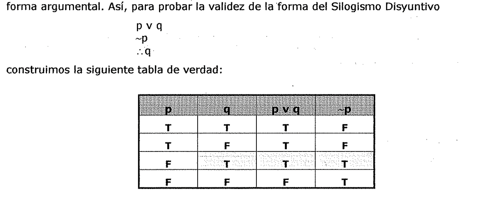
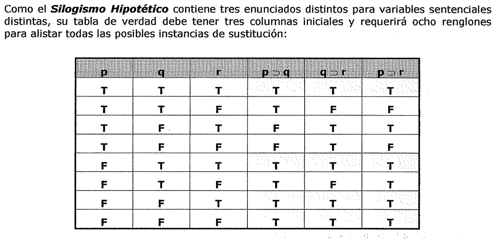
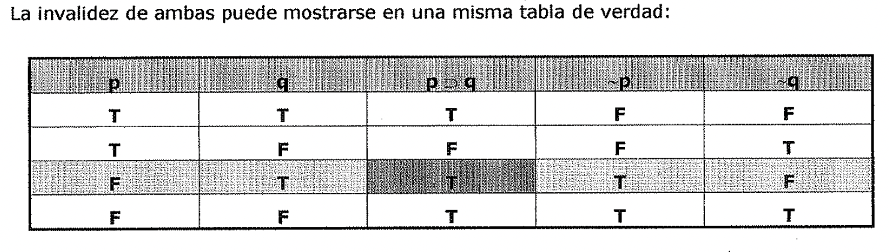
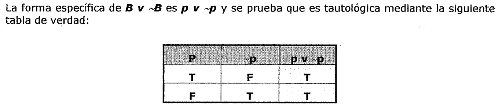
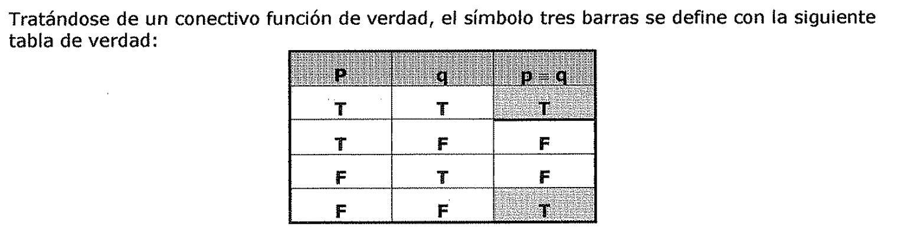

(formas-de-argumentos-y-tablas-de-verdad)=

# Formas de argumentos y tablas de verdad

En esta sección desarrollamos un ***método puramente mecánico*** para probar la
***validez de*** ***argumentos que contienen enunciados compuestos de función de
verdad.*** Ese método esta íntimamente relacionado con la técnica familiar de
*refutación par analogía lógica* que se uso en el primer capítulo para demostrar
la invalidez del argumento Si yo soy presidente entonces soy famoso.

Yo no soy presidente.

Luego yo no soy famoso.

Este argumento se mostró que era inválido construyendo otro argumento de la
misma forma:

Si Rockefeller es presidente entonces el es famoso.

Rockefeller no es presidente.

Luego Rockefeller no es famoso.

que obviamente es inválido, pues sus premisas son verdaderas, pero su conclusión
falsa.

Cualquier argumento se prueba que es inválido si es posible construir otro
argumento de exactamente la misma forma con premisas verdaderas y una conclusión
falsa. Esto refleja el hecho de que *la validez y la invalidez* son
*características puramente formatos de* los *argumentos:* dos *argumentos
cualesquiera que tienen la misma forma o* son *válidos ambos o* *ambos* son
*inválidos, independientemente de las diferencias de* su *contenido.* La noción
de dos argumentos que tienen exactamente la misma forma es una noción que merece
mayor examen.

Es conveniente, al discutir las *formas de* los *argumentos,* usar letras
minúsculas de la parte media del alfabeto, ***"p', ''q'', "r'',* "s'',**...
*coma* ***variables sentenciales,*** que se definen simplemente como ***letras
por las cuales,* o *en lugar de las cuales,* se** ***pueden sustituir
enunciados.*** Ahora definimos una ***forma argumental*** como ·cualquier
***arreglo de símbolos que contiene ·variables sentenciales,*** de modo que al
sustituir enunciados por las variables sentenciales - siendo siempre el mismo
enunciado el que reemplaza a la misma variable - el resultado es un argumento.

Por precisión, establecemos el convenio de que en cualquier forma argumental,'
"p" será la primera variable sentencial qué ocurre en el mismo, "q" será la
segunda, "r" la tercera y así sucesivamente.

*Cualquier argumento que* sea *resultado de la sustitución de enunciados en
lugar de* *variables sentenciales de una forma argumental,* se *dice que tiene*
esa *forma o que* es *una* ***instancia de sustitución de* esa *forma
argumental.*** Si simbolizamos el enunciado simple *"Las Naciones Unidas serán
reforzadas"* con U, y el enunciado simple *"Habrá una tercera guerra mundial"*
con W, entonces el Silogismo Disyuntivo antes presentado puede simbolizarse como

1. UvW

Tiene la forma

1. pvq

de la cuál resulta reemplazando las variables sentenciales p y q por los
enunciados U y W, respectivamente. Pero esa no es la única forma de la cuál es
una instancia de sustitución. El mismo argumento se obtiene reemplazando las
variables sentenciales p y q y r en la forma argumental por los enunciados U v
W, ~Uy W, respectivamente.

*Definimos la* ***forma especifica de un argumento*** *dado, como aquella forma
argumental de la cuál resulta el argumento* ***reemplazando cada variable
sentencial por un enunciado simple diferente.*** Así, la forma específica del
argumento (1) es la forma argumental (2). Aunque la forma argumental (3) es una
forma del argumento (1), no es la forma específica del mismo.

***La técnica de refutación por analogía lógica puede ahora describirse más
precisamente. Si la forma especifica de un argumento dado puede mostrarse que
tiene una instancia de sustitución con premisas verdaderas y conclusión falsa,
entonces el argumento dado es inválido.*** Los términos *''válido"* e
*"inválido"* pueden extenderse para aplicarse a *formas argumentales* tanto como
a argumentos. *Una forma argumental inválida* es *una que tiene cuando menos una
instancia de sustitución con premisas verdaderas y una conclusión falsa.* La
técnica de refutación por analogía lógica presupone que todo argumento del cuál
la forma específica es una forma argumental inválida es un argumento inválido.
Toda forma argumental que no sea inválida es válida; *una forma argumental
válida* es *una que no tiene instancia de sustitución con premisas verdaderas y
conclusión falsa.* Cualquier argumento.dado puede probarse que es válido si se
puede mostrar que la forma específica del argumento dado es una forma argumental
válida.

***Para determinar.la validez* o *invalidez de una forma.argumental debemos
examinar todas las instancias de sustitución posibles de ella para ver si
algunas tienen premisas verdaderas y conclusiones falsas.*** Los argumentos de
los que aquí nos ocupamos solamente contienen enunciados simples y enunciados
función de verdad compuestos con aquellos, y solo nos interesan los valores de
verdad, de sus premisas y conclusiones. Podemos obtener todas las \_instancias
de sustitución posibles cuyas premisas y conclusiones tienen diferentes
variables sentenciales en la forma argumental que se prueba. Estas pueden
disponerse de la manera más conveniente en una tabla de verdad, con una columna
inicial o guía para cada variable sentencia que aparece en la forma argumental.
Así, para probar la validez de la forma del Silogismo Disyuntivo pvq construimos

la siguiente tabla de verdad:

| --- | --- | --- | --- |

| **T** | **T** | **T** | **F** |

| **T** | F | **T** | **F** |

| **F** | **T** | **T** | **T** |

| **F** | **F** | **F** | **T** |

Cada renglón de esta tabla representa una clase completa de instancias de
sustitución..LasT y.

las F en las dos columnas iniciales representan los valores de verdad de
enunciados que pueden sustituirse por las variables p y q en la forma
argumental. Estos valores determinan los valores de verdad en las otras
columnas, la tercera de las cuales esta encabezada por la *primera "premisa"* de
la forma argumental y la cuarta por la *segunda "premisa".* El encabezado de la
segunda columna es la *conclusión* de la forma argumental. Un examen de esta
tabla de verdad revela que cualesquiera que sean los enunciados sustituidos por
las variables p y q, el argumento resultante no puede tener premisas verdaderas
y una conclusión falsa, pues el tercer renglón representa el t'.único caso
posible en que ambas premisas son verdaderas y ah\[ la conclusión también es
verdadera.

Como las ***tablas de verdad*** proporcionan un ***método puramente mecánico o
efectivo de*** ***decisión de la validez o invalidez de cualquier argumento***
del tipo general aquí! considerado, ahora podemos justificar nuestra propuesta
de simbolizar todos los enunciados condicionales por medio del conectivo de
función de verdad ":o". La justificación para tratar todas las implicaciones
como si fueran meramente implicaciones materiales es que los argumentos válidos
que contienen enunciados condicionales siguen siendo válidos cuando estos
condicionales se interpretan como afirmando implicaciones materiales solamente.
Las tres más simples y más intuitivamente válidas formas de argumento que
involucran enunciados condicionales son

**Modus Ponens**

**Modus Tollens**

Si p entonces q

Si p entonces q

y el **Silogismo Hipotético** Si p entonces q Si q entonces r

*:.* Si p entonces r El que sigan siendo válidos cuando sus condicionales se
interpretan como aseveraciones de implicaciones materiales, es un hecho que
fácilmente se establece por tablas de verdad. La validez de ***Modus Ponens***

 se
muestra con la misma tabla de verdad que define el símbolo herradura:

| --- | --- | --- |

| **T** | **T** | **T** |

| **T** | **F** | **F** |

| **F** | **T** | **T** |

| **F** | **F** | **T** |

Aquí las dos premisas se representan por las columnas tercera y primera y la
conclusión por la segunda. Solo el primer.renglón representa instancias de
sustitución en las que ambas premisas son verdaderas, yen ese renglón la
conclusión también es verdadera.

La validez de ***Modus Tollens*** se muestra por medio de la.siguiente tabla:

**T T F**

**T F T**

**T F T**

**F T F**

**F F T**

Aquí solamente el cuarto renglón representa instancias de sustitución en las que
ambas premisas (las columnas tercera y cuarta) son verdaderas, y ah\[ la
conclusión (quinta columna) también es verdadera.

Como el ***Silogismo Hipotético*** contiene tres enunciados distintos para

variables sentenciales distintas, su tabla de verdad debe tener tres columnas
iniciales y requerirá ocho renglones para alistar todas las posibles instancias
de sustitución:

| | | | | | |

| --- | --- | --- | --- | --- | --- |

| **T** | **T** | **T** | **T** | **T** | **T** |

| **T** | **T** | **F** | **T** | **F** | **F** |

| **T** | **F** | **T** | **F** | **T** | **T** |

| **T** | **F** | **F** | **F** | **T** | **F** |

| **F** | **T** | **T** | **T** | **T** | **T** |

| **F** | **T** | **F** | **T** | **F** | **T** |

| **F** | **F** | **T** | **T** | **T** | **T** |

| **F** | **F** | **F** | **T** | **T** | **T** |

Al construirla, las tres columnas iniciales representan todos los arreglos
posibles de valores de verdad para los enunciados sustituidos en lugar de las
variables sentenciales p, q y r, la cuarta columna se llena con referencia a la
primera y la segunda, la quinta con referencia a la segunda y la tercera, y la
sexta con referencia a la primera y la tercera. Las premisas son ambas
verdaderas solo en los renglones primero, quinto, séptimo y octavo, y en estos
renglones la conclusión también es verdadera. Esto basta para mostrar que el
Silogismo Hipotético es válido cuando sus condicionales se simbolizan mediante
el símbolo herradura. Todas las dudas que queden respecto a la afirmación de que
los argumentos válidos que contienen condicionales siguen siendo válidos cuando
sus condicionales se interpreten como afirmando meramente implicaciones
materiales puede aclararlas el lector al construir, simbolizar y probar sus
propios ejemplos mediante tablas de verdad.

Para probar la validez de una forma argumental mediante una tabla de verdad, es
necesaria una tabla con una columna inicial o gu\[a separada para cada variable
sentencial diferente y un renglón separado para cada posible asignación de
valores de verdad a las variables sentenciales involucradas. As\[ pues, probar
una forma argumental que contiene **n** variables sentenciales distintas
requiere una tabla de verdad con **2"** renglones. Al construir tablas de verdad
es conveniente fijar un patrón uniforme de inscripción de las **Ty** las **F**
en sus columnas iniciales o gu\[a. En este libro nos apegaremos a la practica de
ir simplemente alternando las **T** y las **F** hacia abajo en la columna
inicial extrema derecha, alternando pares de **T** con pares de **F** hacia
abajo en la columna directamente a su izquierda, después alternando grupos de
cuatro **T** con grupos de cuatro **F,**..., y al llegar a la columna extrema
izquierda ponemos **T** en todas su mitad superior y Fen toda su mitad inferior.

Hay dos formas de argumento inválidas que tienen un parecido superficial con las

formas válidas Modus Ponens y Modus Tollens.

Estas son:

y se conocen con el nombre de ***Falacias de Afirmación del Consecuente y
Negación del*** La invalidez de ambas puede mostrarse en una misma tabla de

verdad:

Las dos premisas en la Falacia de Afirmación del Consecuente encabezan las
columnas segunda y tercera, y son verdaderas en el primer y en el tercer
renglón. Pero la conclusión, que encabeza la primera columna, es falsa en el
tercer renglón, lo que muestra que la forma de argumentar tiene una instancia de
sustitución con premisas verdaderas y conclusión falsa y, por lo tanto, es
inválida. Las columnas tres y cuatro son las encabezadas por las premisas en la
Falacia de Negación del Antecedente, que son verdaderas en los renglones tercero
y cuarto.

Su conclusión encabeza la columna cinco y es falsa en el tercer renglón, lo que
muestra que la segunda forma argumental también es inválida.

Hay que recalcar que aunque una forma de argumento válida tiene solo argumentos
válidos come instancias de sustitución, una forma de argumento inválida puede
tener instancias de sustitución válidas tanto come inválidas. Así que para
demostrar que un argumento dado es inválido hay que demostrar que la forma
específica de ese argumento es inválida.

(formas-sentenciales)=

## Formas sentenciales

La introducción de variables sentenciales en la sección precedente nos permitió
definir las formas argumentales en general y la forma específica de un argumento
dado.

Ahora definimos una ***forma sentencial*** como ***cualquier sucesión de
símbolos*** ***conteniendo variables sentenciales,*** de modo que al sustituir
enunciados por las variables sentenciales • - reemplazando la misma variable
sentencial por el mismo enunciado en toda la secuencia - el resultado es un
enunciado.

Otra vez, para precisar, convendremos en que en cualquier forma sentencial "p"
será la primera variable sentencial que aparece, "q" será la segunda en ocurrir,
"r" la tercera y así sucesivamente. Todo enunciado que resulta de la sustitución
de las variables sentenciales por enunciados en una forma sentencial, se dirá
que tiene esa forma o que es una instancia de sustitución de ella. • *Así como
distinguimos la form\<! especifica de un argumento dado, así también
distinguiremos* *la forma especifica de un enunciado dado como la forma
sentencial de la que resulta el* *enunciado poniendo en el lugar de cada
variable sentencial un enunciado simple diferente.* Así, por ejemplo, si A, B y
C son enunciados simples diferentes, **el enunciado compuesto A** ::i **(BvC)**
es una instancia de sustitución de la ***forma sentencial* p**::i **q** y
también de. la ***forma*** ***sentencial* p**::i **(qvr),** pero solo esta
última es la ***forma especifica del.enunciado*** dado. (\\ Aunque los
enunciados *"Balboa.descubrió el Océano Pacífico" (B)* y *"Balboa descubrió el*
*Océano Pacífico* o *no lo descubrió" (B v ~B)* ambos son verdaderos,
descubrimos su

verdad de maneras enteramente diferentes. La verdad de B es cuestión histórica y
se aprende,por medio de la investigación empírica. Aun más, podrían haber
ocurrido cosas que hicieran a B falso; nada necesario hay respecto a la verdad
de B. Pero la verdad del enunciado B v ~B puede saberse independientemente de
toda investigación empírica y ningún suceso puede hacerlo falso porque es una
verdad necesaria.

El enunciado ***B v ~B*** es una ***verdad formal,*** una instancia de
sustitución de una forma sentencial cuyas instancias de sustitución todas son
verdaderas.

***Una forma sentencial que solo tiene instancias de sustitución verdaderas*
se**

***dice tautológica, o que* es *una tautología.***

La forma específica de ***B v ~B* es *p v*** ~,, y se prueba que es tautológica
mediante la siguiente tabla de verdad:

| --- | --- | --- |

| **T** | **F** | **T** |

| **F** | **T** | **T** |

En la columna que encabeza la forma sentencial de que se trata solo hay valores
**T,** luego ***todas sus instancias de sustitución son verdaderas.*** Cualquier
enunciado que es una 1 instancia de sustitución de una forma sentencial
tautológica es formalmente verdadero y también se le llama tautológico, o una
tautología.

Similarmente, aunque'! los enunciados *"Cortes descubrió el Pacífico" (CJ y
"Cortes descubrió el* *Pacífico y Cortes no descubrió el Pacífico" (C*. *.CJ*
ambos son falsos, descubrimos su falsedad de dos maneras enteramente diferentes.

***Un enunciado,* se *dice que contradice, o que* es *una contradicción de otro
enunciado, cuando* es *lógicamente imposible que ambos sean verdaderos.*** En
este sentido la contradicción es una relación entre enunciados. Pero hay otro
sentido, relacionado del mismo término.

Cuando es lógicamente imposible que un enunciado particular sea verdadero, ese
enunciado mismo es llamado autocontradictorio o una autocontradicción. Mas
simplemente, se dice que tales enunciados son contradictorios o contradicciones,
y esta es la terminología que aquí usaremos.

***Una forma sentencial que solo tiene instancias de sustitución falsas* se
*dice que* es *una contradicción o que* es *contradictoria, y los mismos
términos* se *aplican a sus. instancias de sustitución.*** La ***forma
sentencial p***. ~,, se prueba que es una ***contradicción*** por el hecho de
que en su tabla de verdad solo hay valores **F** en la columna que encabeza.

***Enunciados y formas sentenciales que no son ni tautológicas ni
contradictorias***

**se *dice que son contingentes o que son contingencias.***

Por ejemplo, p, ~P, p v q, p.q, p::o q son formas sentenciales contingentes; y
B, C, ~B, B.C, BvC, son enunciados contingentes. El término es apropiado, pues
sus valores de verdad no están formalmente determinados, sino que *son
dependientes* o *contingentes de la situaCión.* Fácilmente se demuestra que p::o
q::o p) y ~P::o (p::o q) son tautologías. Al expresarlas en lenguaje ordinario
como "Un enunciado verdadero es implicado por: cualquier enunciado'' y como "Un
enunciado falso implica cualquier enunciado" parecen bastante •extrañas. Algunos
escritores las han llamado las paradojas de la implicación material. Pero si se
tiene presente que el símbolo herradura es un conectivo función de verdad que
representa la implicación material y no la "implicación en general" o clases más
usuales como son la implicación lógica o la implicación causal, entonces dichas
formas sentenciales tautológicas no son sorprendentes en lo absoluto. Y al
corregir esas engañosas formulaciones del castellano insertando la palabra '
"materialmente" antes de "implicado" *e* "implica", entonces desaparece el aire
paradójico. La implicación material es una noción técnica y la motivación del
lógico al introducirla y usarla es la enorme simplificación que resulta en su
tarea de discriminar entre los argumentos válidos y los inválidos. • ***Dos
enunciados* se *dicen materialmente equivalentes cuando tienen el mismo***
***valor de verdad, y simbolizamos el enunciado de que son materialmente***
***equivalentes insertando el símbolo*** "=''***entre ellos.*** • Tratándose de
un conectivo función de verdad, el símbolo tres barras se define

con la siguiente tabla de verdad:

| --- | --- |

| **T** | **T** |

| **T** | **F** |

| **F** | T |

| **F** | **F** |

Decir que dos enunciados son materialmente equivalentes es decir que
materialmente el uno implica el otro, como es fácil de verificar con una tabla
de verdad. Así, el símbolo de las tres barras puede leerse *"es materialmente
equivalente con"* o *"si y solo si".* Un enunciado de la forma p = q se llama
bicondicional. Dos enunciados se dicen lógicamente equivalentes cuando el
bicondicional que expresa su equivalencia material es una tautología. El
"principio de la Doble Negación", expresado como p = ~~P, con una tabla de
verdad se demuestra que es tautológico.

Hay dos equivalencias lógicas que expresan importantes interrelaciones de las
conjunciones, disyunciones y negaciones. Como una conjunción afirma que sus dos
conjuntos son verdaderos, su negación solo necesita afirmar que uno de los dos
conjuntos es falso. Luego, negar la conjunción p.q equivale a afirmar la
disyunción de las negaciones de p y q. Este enunciado de equivalencia se
simboliza como **~(p.q)** = **(~p v ~Q)** y se demuestra que es una

***tautología*** mediante la tabla de verdad:

| | | | | | | | |

| --- | --- | --- | --- | --- | --- | --- | --- |

| **T** | **T** | **T** | **F** | **F** | **F** | | |

| **T** | **F** | **F** | **T** | **f** | **T** | **T** | |

| **F** | **T** | **F** | **T** | **T** | **F** | **T** | |

| **F** | **F** | **F** | **T** | **T** | **T** | **T** | |

De manera semejante, como una disyunción meramente afirma que al menos un
disyunto es verdadero, negarla es afirmar que ambos son falsos. Negar la
disyunción pvq equivale a afirmar la conjunción de las negaciones de p y q. Se
simboliza como **~(P v q)** = **(~P**. **~Q),** y con una tabla de verdad
fácilmente se prueba que es una ***tautología.*** Estas dos equivalencias se
conocen como ***Teoremas de De Morgan,*** por el lógico matemático ingles
Augustus De Morgan (1809-1871), y en lenguaje ordinario pueden enunciarse de
manera conjunción}.

compendiada como: La negación de la { disyunción de dos enunciados. disyunción
es lógicamente equivalente a la { conjunción} de sus negaciones.

*Dos formas sentenciales se dicen lógicamente equivalentes si, no importando
qui§ enunciados se sustituyan par sus variables sentenciales* - *poniendo el
mismo enunciado en lugar de la misma variable sentencial en ambas formas
sentenciales* -, *las pares resultantes de enunciados son equivalentes.* As\[,
el Teorema de De Morgan afirma que ~(p v q) y ~P. ~Q son formas sentenciales
lógicamente equivalentes. Por el Teorema de De Morgan y el principio de la Doble
Negación *:*, ~(p. q) y ~P v ~q son lógicamente equivalentes, luego cualquiera
puede tomarse como definición de p:o q; la segunda es la elección más usual.

***A todo argumento corresponde un enunciado condicional cuyo antecedente* es
*la conjunción de las premisas del argumento y cuyo consecuente* es *la
conclusión del argumento.*** ***Ese condicional correspondiente* es *una
tautología si y solo si el argumento* es *válido.*** As\[ la forma argumental
válida

pvq corresponde la forma sentencial tautológica \[(p v q). ~p\]:o q; y a la
forma argumental inválida corresponde la forma sentencial no tautológica \[(p:o
q). q\]:o p.

\\ Una forma argumental es válida si y solo si su tabla de verdad tiene el valor

**T** bajo su conclusión en cada renglón en que haya el valor **T** bajo todas
sus premisas. Como. puede aparecer una **F** en la columna encabezada por el
condicional correspondiente solo donde haya **T** bajo todas las premisas y
**F** bajo la conclusión, es claro que solo puede haber el valor **T** bajo un
condicional que corresponde a una forma argumental válida. Si un argumento es
válido, el enunciado de que la conjunción de sus premisas implica su conclusión
es una tautología\[a.

Una versión alternativa de la prueba de la tabla de verdad de una forma

argumental sentencial es la siguiente, que corresponde a la tabla de verdad
precedente:

| --- | --- | --- | --- | --- |

| **F** | **T** | **T** | **T** | |

| **T** | **T** | **F** | **F** | |

| **T** | **F** | **F** | **T** | |

| **T** | **F** | **F** | **F** | |

| **1** | **2** | **3** | | |

| | | | | | |

| --- | --- | --- | --- | --- | --- |

| **F** | | **T** | **F** | **F** | **T** |

| **F** | | **T** | **T** | **T** | **F** |

| **T** | | **F** | **T** | **F** | **T** |

| | | | | | **F** |

| **T T** | | |

| | | **7 9** | | | **10** |

Aquí las columnas (2), (4), (7), (10) son las columnas iniciales o gu\[a. La
columna (3) se llena con referencia a las columnas (2) y (4) y la columna (1)
con referencia a la columna (3). La columna (6) se llena con referencia a la
columna (7), la columna (9) se llena con referencia a la columna (10) y entonces
la columna (8) con referencia a las columnas (6) y (9). Finalmente, la columna
(5) se llena con referencia a las columnas (1) y (8). El hecho de que su
conectivo principal tenga solo valores **T** en su columna de la tabla de
verdad, establece que ***la forma sentencial probada* es *una tautología.***

| --- | --- | --- |

| ***34*** | | |

| 3.2.3. El Método de Deducción | | |
