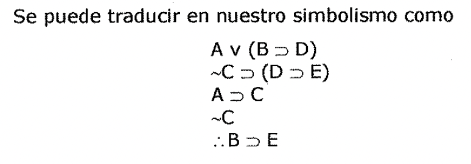
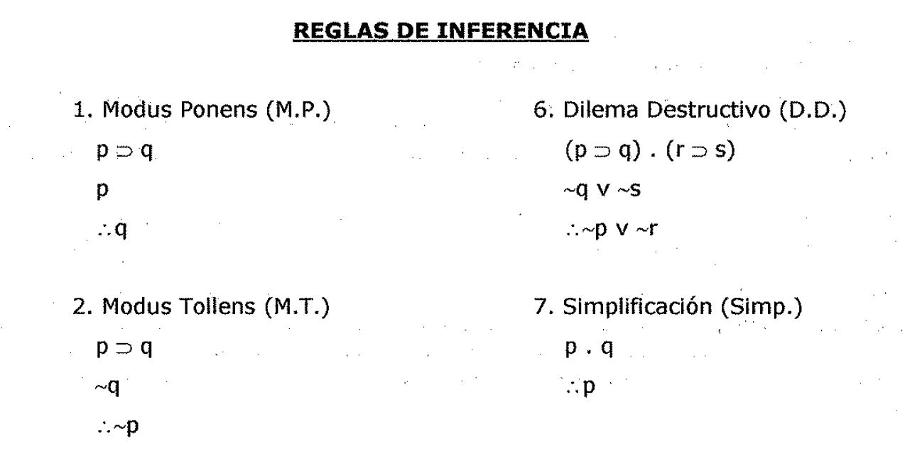

(sec-unit-03-representacion-conocimiento-prueba-formal-de-validez)=

## Prueba formal de validez

| 3.2.3.1. Prueba Formal de Validez Cuando los argumentos contienen *más de dos
a tres enunciados simples diferentes* como componentes, se hace *difícil y
tedioso utilizar tablas de verdad para probar su validez.* | E | |

| Un método más conveniente de establecer la validez de algunos argumentos es
deducir las conclusiones de sus premisas por una secuencia de argumentos más
cortos y más elementales que ya se conoce que son válidos. Considérese, por
ejemplo, el siguiente argumento en el que aparecen enunciados simples
diferentes: | C: | |

| * el procurador general ha impuesto una censura estricta o· si Black envío la
carta que escribió, entonces Davis recibió un aviso. | | |

| * Si nuestras líneas de comunicación no se han interrumpido por completo,
entonces si Davis recibió un aviso, entonces Emory fue informado del asunto. \*
Si el procurador general ha impuesto una censura estricta, entonces nuestras
líneas de comunicación se han interrumpido por completo. | | |

| * Nuestras líneas de comunicación no se han interrumpido par complete. | | |

| * Por tanto, si Black envío la carta que escribió, entonces Emory fue
informado del asunto. | | |

| Se puede traducir en nuestro simbolismo coma | | |

| Av (B::, D) ~C::o (D::o E) | | |

| A::, C ~C:.B::oE | | |

| Establecer la validez de este argumento por medio de una tabla de verdad
requeriría una tabla | *(:.* | |

| de treinta y dos renglones. Pero podemos probar el argumento dado como válido
deduciendo su conclusión de sus premisas por una secuencia de solamente cuatro
argumentos cuya validez se ha señalado ya. * De la tercera y cuarta premisas,
A::o C y ~C, válidamente inferimos ~A por Modus Tollens. | ( | |

| * De ~A y la primera premisa Av (B::o D), válidamente inferimos B::o D, por un
Silogismo | | |

| Disyuntivo. | | |

| * De la segunda y cuarta premisas, ~C::o (D::o E) y ~C, válidamente se infiere
D.::, E por • | | |

| Modus Ponens. | | |

| * **Y** finalmente, de estas dos últimas conclusiones (o subconclusiones),
B::o D y D::o E, válidamente inferimos B::o E por un Silogismo Hipotético.
***Que su conclusión* se *deduce de sus premisas usando argumentos válidos
exclusivamente, prueba que el argumento original* es *válido.*** Aquí las formas
argumentales válidas elementales Modus Ponens (M.P.), Modus Tollens (M.T.), el
Silogismo Disyuntivo (D.S.), y el Silogismo Hipotético (H.S.) se usan como
Reglas de | ( | |

| Inferencia par media de las cuales se deducen válidamente las conclusiones a
partir de las premisas. Una manera más formal y más concisa de escribir esta
prueba de validez es hacer una lista de las premisas y de los enunciados
deducidos de ellas en una columna, con las *"justificaciones"* para estos
últimas escritas a un lado de los mismos. En cada caso, la *"justificación"*
para un enunciado especifica los enunciados precedentes a partir de los cuales,
y la regla de inferencia por medio de la cuál, el enunciado en cuestión fue
deducido. Es conveniente poner la conclusión a la derecha de la última premisa,
separada de la misma por una linea diagonal que | C | |

| automáticamente señala que todos los enunciados que están por arriba de la
misma son premisas. | | |

La prueba formal de validez para el argumento dado puede escribirse como

1. A v (B:::, D)

1. ~C:::, (D:::, E)

1. A:::iC

:.B:::, E 3, 4, M.T.

*Una* ***prueba formal de validez para un argumento*** *dado* se *define coma
una sucesión de enunciados, cada uno de las cuales* es *una premisa de ese
argumento o* se *sigue de los precedentes por un argumento válido elemental, y
tal que el último enunciado de la secuencia* es *la conclusión del argumento
cuya validez* se *está demostrando.* Esta definición debe completarse y hacerse
más precisa especificando que es lo que va a contar como *"argumento válido
elemental".* Primera definimos un argumento válido elemental como cualquier
argumento que es una instancia de sustitución de una forma de argumento válida,
y después presentamos una lista de solo nueve formas de argumento
suficientemente obvias para ser vistas como ***formas de argumento válidas
elementales*** y aceptadas como

***Reglas de Inferencia.***

Una cuestión que hay que recalcar es que cualquier instancia de sustitución de

una forma de argumento válida elemental es un argumento válido elemental. Así,
el argumento

~C:::, (D:::, E)

*:.* (D:::, E)

es un argumento válido elemental porque es una instancia de sustitución de la
forma de argumento válida elemental Modus Ponens (M.P.). Resulta de sustituyendo
~C por p y (D:::, E) por q, así que es de esa forma aún cuando Modus Ponens no
es la forma especifica del argumento dado.

***Iniciamos*** nuestro desarrollo del ***método de deducción*** presentando una
lista de solo nueve formas de argumento válidas elementales que pueden usarse al
construir pruebas formales de validez:

**REGLAS DE INFERENCIA**

1. Modus Ponens (M.P.) p:::,q

1. Modus Tollens (M.T.) p:::, q

6, Dilema Destructivo (D.D.) (p:::, q). (r:::, s)

~q V ~S

:.~p V ~r

7. Simplificación (Simp.) p.q

| --- | --- | --- |

| | | ***36*** |

| 3. Silogismo Hipotético (H.S.) | 8. Conjunción (Conj.) | |

| p::::, q | p | (- |

| q::::, r | q | |

| *:.* P::::i r |.. p. q | C |

1. Silogismo Disyuntivo (D.S.) pvq

p V r :.q VS

1. Adición (Ad.)

:.p V q *Estas nueve reglas de inferencia son* ***formas válidas elementales de
argumentos*** *cuya validez fácilmente se establece mediante tablas de verdad.*
Pueden usarse para construir pruebas formales de validez para una amplia clase
de argumentos más complicados. Los nombres de la lista son estándar en su mayor
parte, y el uso de sus abreviaciones permite presentar las pruebas formales con
un mínimo de escritura.
