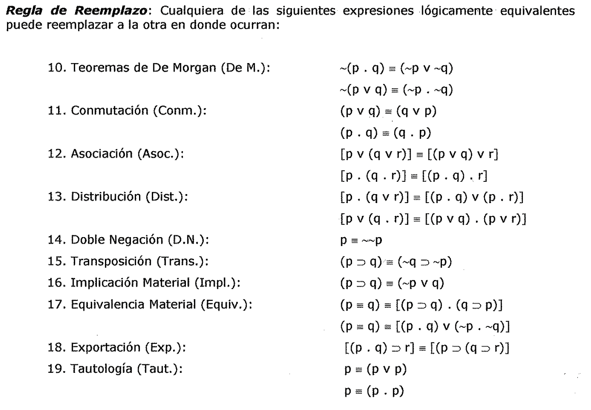

(reglas-de-inferencia-y-reemplazo)=

# Reglas de inferencia y reemplazo

3.2.3.2. La Regla de Reemplazo

Hay muchos argumentos válidos de función de verdad cuya validez no se puede
probar usando solamente las nueve Reglas de Inferencia dadas hasta aquí. Por
ejemplo, una prueba formal de validez del argumento obviamente válido requiere

Reglas de Inferencia adicionales.

Ahora bien, los únicos enunciados compuestos que nos interesan aquí son los
enunciados compuestos función de verdad. Luego, si se reemplaza una parte
cualquiera de un enunciado compuesto por una expresión que es lógicamente
equivalente a la parte reemplazada, el valor de verdad del enunciado que resulta
es el mismo que el del enunciado original. A esto se le llama, algunas veces la
***Regla de Reemplazo,*** y otras, la del Principio de Extensionalidad.

Adoptamos la ***Regla de Reemplazo*** como un ***principio adicional de
inferencia.*** Nos permite inferir de cualquier enunciado el resultado de
reemplazar todo o parte de ese enunciado por otro enunciado lógicamente
equivalente a la parte reemplazada. Así, usando el principio de la Doble
Negación (D.N.), que afirma la equivalencia lógica de p y ~~P, podemos inferir,
de A::::i ~~ B cualquiera de los enunciados, por la Regla de Reemplazo.

Para hacer más definida esta regla, damos ahora una lista de equivalencias

lógicas con las que puede usarse. Estas equivalencias constituyen ***nuevas
Reglas de Inferencia*** que es posible usar para probar la validez de
argumentos. Las numeramos consecutivamente después de las nueve reglas ya
enunciadas.

***Regla de Reemplazo:*** Cualquiera de las siguientes expresiones lógicamente
equivalentes puede reemplazar a la otra en donde ocurran:

1. Teoremas de De Morgan (De M.):

1. Conmutación (Conm.):

1. Asociación (Asoc.):

1. Distribución (Dist.):

1. Doble Negación (D.N.):

1. Transposición (Trans.):

1. Implicación Material (Imp!.):

1. Equivalencia Material (Equiv.):

1. Exportación (Exp.):

1. Tautología (Taut.):

~(p, q) = (~P V ~Q)

~(p V q) = (~p. ~Q)

p V Q) = (q V p)

p. q) = q. p)

\[p. (qv r)J = [(p. q) v (p. r)]

[p V (q. r)] = [(p V q). (p V r)] p = ~~P

p:::, q)es (~q:::,~p)

p:::, q) = ~P V q)

p = q) = \[(p:::, q). (q:::, p)J

p = (p V p) p = (p. p) Ahora puede escribirse una prueba formal de validez para

el argumento dado al principio del párrafo 3.2:

1, Conm.

2, Simp.

Algunas formas de argumento, aunque muy elementales y perfectamente válidas, no
se incluyen en nuestra lista de diecinueve Reglas de Inferencia. Aunque el
argumento es obviamente válido, su forma no está incluida en nuestra lista. Por
tanto, B no se sigue de A.B por ningún argumento válido elemental según los
define nuestra lista. Puede, sin embargo, deducirse usando dos argumentos
válidos elementales como mostramos antes. Podríamos agregar la forma de
argumento intuitivamente válida a nuestra lista, claro esta; pero si
agrandáramos nuestra lista de esta manera llegar\[amos a tener una lista
demasiado larga y, por tanto, n_o manejable.

La lista de las Reglas de Inferencia contiene numerosas redundancias.. Por
ejemplo, Modus Tollens podría salir de la lista sin realmente debilitar la
maquinaria, pues todo paso deducido usándola puede serlo usando otras Reglas de
la lista. Pero Modus Tollens es un principio de inferencia tan común e intuitivo
que se le ha incluido, y otros han sido incluidos por conveniencia también, a
pesar de su redundancia lógica.

***La prueba de que una sucesión dada de enunciados es una demostración formal,
es***

***efectiva.*** - Es decir, por observación directa se podrá deducir si cada
renglón siguiente a las premisas se sigue o no de los renglones que le preceden
mediante alguna de las Reglas de Inferencia dadas. No es necesario "pensar": ni
pensar sobre la validez de la deducción de cada renglón.

Aun en donde falte la "justificación" de un enunciado, a un lado del mismo, hay
un , procedimiento finito, mecánico, para decidir si la deducción es legítima.
Cada renglón viene precedido por solamente un número finito de renglones y solo
se han adoptado un número finito de Reglas de Inferencia. Aunque toma tiempo,
puede verificarse por inspección si el renglón en cuestión se sigue de algún
renglón, o par de renglones precedentes mediante alguna Regla de Inferencia de
nuestra lista.

***Hay una diferencia importante entre las primeras nueve y las últimas diez
Reglas de***

***Inferencia.***

- *Las primeras nueve pueden aplicarse a renglones enteros de una demostración.*

De modo A puede inferirse de A.B por simplificación solo si A.B constituye un
renglón completo. Pero ni A ni A::::o C se siguen de (A.B)::::, C por
simplificación o cualquier otra Regla de Inferencia. A no es consecuencia porque
A puede ser falso y (A.B)::::, verdadero. A::::o C no es consecuencia porque si
A es verdadero y B y C ambos son falsos, A.B)::::, C es verdadero mientras que
A::::, C es falso.

- *Por otro lado, cualquiera de las diez últimas Reglas de Inferencia puede
  aplicarse a*

*renglones enteros o partes de renglones.* No solo puede inferirse el enunciado
A::::o (B::::o C) del renglón entero (A.B)::::o C por Exportación, sino del
renglón \[(A.B)::::o CJ v D podemos inferir \[(A::::o B)::::o CJ v D por
Exportación. La Regla!\]e Reemplazo autoriza que expresiones lógicamente
equivalentes especificadas se reemplacen entre sí donde ocurran aún en donde no
constituyan renglones enteros de una demostración.

Pero las nueve primeras Reglas de Inferencia solo pueden usarse tomando como
premisas renglones enteros de una demostración.

En ausencia de reglas mecánicas para la construcción de demostraciones formales
de validez, pueden darse algunas sugerencias y métodos prácticos.

- La primera es simplemente *empezar deduciendo conclusiones de. las premisas
  mediante*

*las Reglas de Inferencia dadas.* Al tener más y más subconclusiones de estas
como premisas para nuevas deducciones, mayor es la probabilidad de que se vea
como deducir la conclusión del argumento que se quiere demostrar que es válido.

- Otra sugerencia es *tratar de eliminar enunciados qué ocurren en las premisas,
  pero no*

*en la conclusión.* Esta eliminación puede llevarse a cabo solamente de acuerdo
con las Reglas de Inferencia. Pero las Reglas contienen muchas técnicas para
eliminar enunciados. La simplificación es una de ellas: con esta, el conjunto
derecho de una conjunción puede simplemente quitarse, a condición de que la
conjunción sea un renglón entero en la demostración. Y por Conmutación puede
hacerse derecho al enunciado conjunto izquierdo de una conjunción para
eliminarlo por Simplificación. El término "medio" q puede eliminarse por un
Silogismo Hipotético dadas dos premisas o subconclusiones de los patrones
p::::oq y q::::o r. La distribución es una regla útil para transformar una
disyunción de la forma p v (q.r) en la conjunción (p v q).(p v r) cuyo conjunto
de la derecha p v r puede entonces eliminarse por Simplificación.

- Otro método practico es *introducir por Adición un enunciado qué ocurre en la
  conclusión,*

pero no en las premisas.

- Otro método es el de *proceder hacia atrás desde la conclusión* buscando algún
  enunciado o· par de enunciados de los cuales se le pudiera deducir mediante
  algunas de

las Reglas de Inferencia, y entonces tratar de deducir esos enunciados
intermedios, y así sucesivamente, hasta llegar a algunos que sean deducibles de
las premisas.
