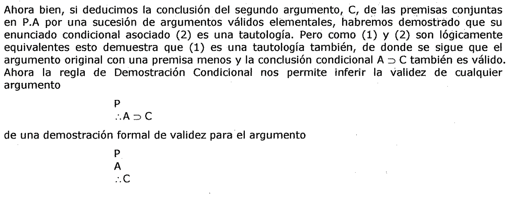
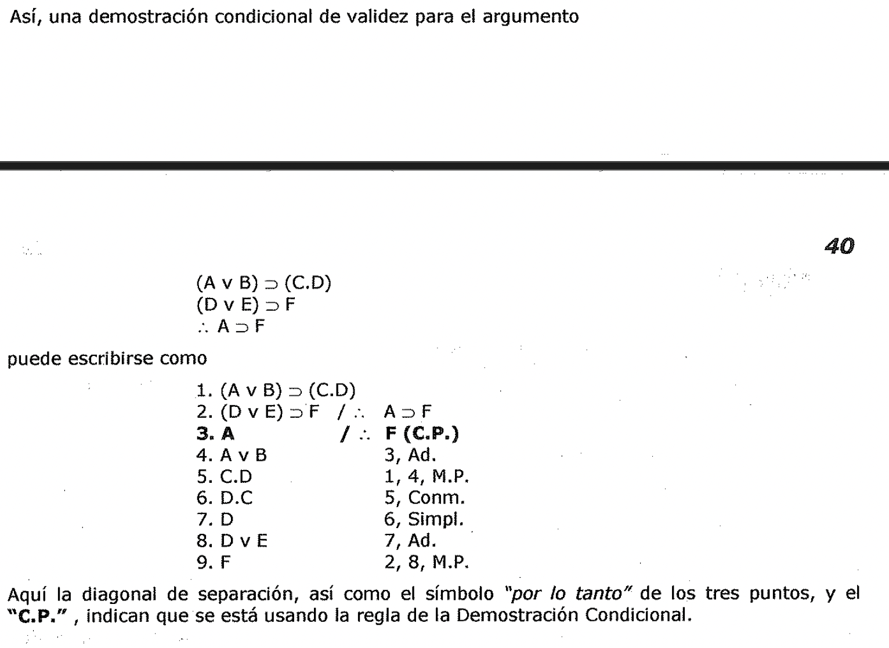
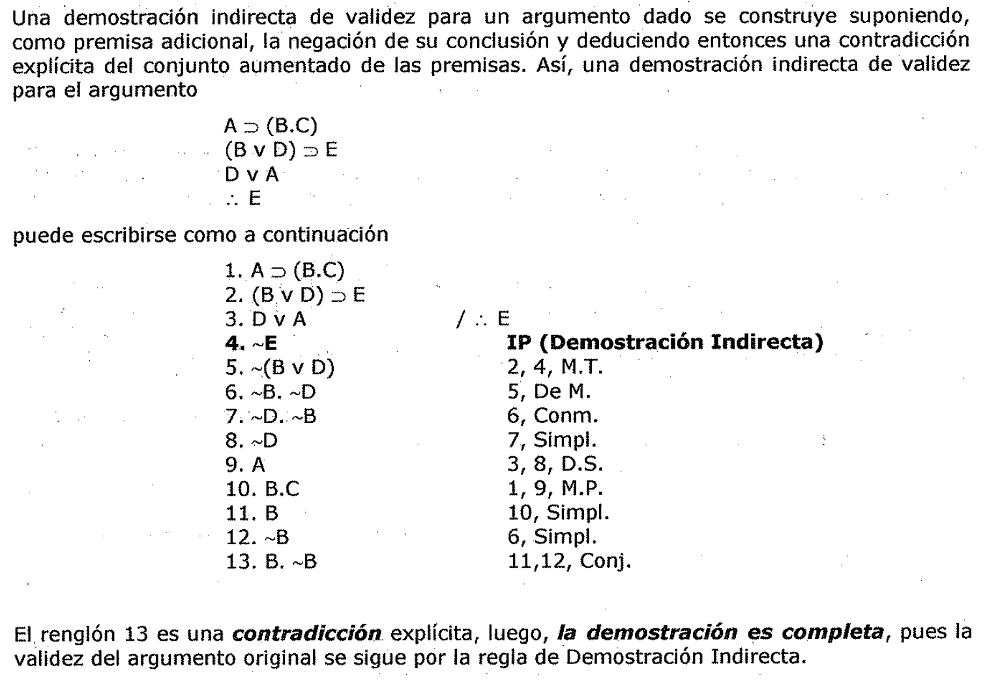

# Demostración de invalidez

3.2.3.3. Demostración de la Invalidez

**No Completud de las Diecinueve Reglas**

Las diecinueve Reglas de Inferencia presentadas hasta el momento son
incompletas, lo que quiere decir que hay argumentos válidos función de verdad
cuya validez no es demostrable usando tan solo esas diecinueve Reglas.

**La Regla de Demostración Condicional**

*A continuación* ***introducimos una nueva regla para usarla en el método de
deducción:*** *la regla de Demostración Condicional.* En esta sección la nueva

regla se aplicará tan solo a argumentos cuyas conclusiones son enunciados
condicionales.

- *A todo argumento le corresponde un enunciado condicional cuyo antecedente es
  la conjunción de las premisas del argumento y cuyo consecuente es
  la.conclusión del argumento.*

- *Como se ha señalado, un argumento es válido si y solo si su correspondiente
  condicional es una tautología.*

Si un argumento tiene un enunciado condicional como conclusión, que podemos
simbolizar A:::, C, entonces si simbolizamos la conjunción de sus premisas como
P, el argumento es válido si y solo si el condicional

1. P:::, (A:::, C)

es una tautología.

Si podemos deducir la conclusión A:::, C de las premisas conjuntas en P por una
secuencia de argumentos válidos elementales, habremos así demostrado la validez
del argumento y que el condicional asociado (1) es una tautología. Por el
principio de Exportación, (1) es lógicamente equivalente a Pero (2) es el
condicional asociado con un argumento un tanto diferente. Este segundo argumento
tiene como premisas todas las premisas del primer argumento, además de una
premisa adicional que es el antecedente de la conclusión del primer argumento. Y
la conclusión del segundo argumento es el consecuente de la conclusión del
primer argumento.

Ahora bien, si deducimos la conclusión del segundo argumento, C, de las premisas
conjuntas en P.A por una sucesión de argumentos válidos elementales, habremos
demostrado que su enunciado condicional asociado (2) es una tautología. Pero
como (1) y (2) son lógicamente equivalentes esto demuestra que (1) es una
tautología también, de donde se sigue que el argumento original con una premisa
menos y la conclusión condicional A:::, C también es válido. Ahora la regla de
Demostración Condicional nos permite inferir la validez de cualquier argumento
de una demostración formal de validez para el argumento Así, una demostración
condicional de validez para el argumento

| | | | | | |

| --- | --- | --- | --- | --- | --- |

| | | | | | |

| ***40*** | | | | | |

| (Av B):::, (C.D) (D v E):::, F *:.* A:::i F | | | - | | |

| puede escribirse como 1. (Av B):::i (C.D) | | | | | |

| 2. (D v E):::, F | / *:.* | | A:::i F | | |

| 1. **A** 2. Av B 3. C.D | / | *:.* | **F (C.P.)** 3, Ad. 1, 4, M.P. | | |

| 6. D.C | 5, Conm. | | | | |

| 7.D 8. D v E 9. F | 6, Simpl. 7, Ad. 2, 8, M.P. | | |. | |

Aquí la diagonal de separación, así como el símbolo *"por lo tanto"* de los tres
puntos, y el **"C.P."**, indican que se esta usando la regla de la Demostración
Condicional.

**La Regla de Demostración Indirecta**

El método de ***Demostración Indirecta,*** a menudo llamado método de

***Demostración por*** ***Reducción al absurdo,*** es familiar para todos los
que hayan estudiado la geometría elemental. Al deducir sus teoremas, Euclides
suele empezar suponiendo lo opuesto de lo que se propone demostrar.

*Si este supuesto conduce a una contradicción o "se reduce a un absurdo"
entonces el supuesto* *debe ser falso, y su negación* - *el teorema que se desea
demostrar* - *debe ser verdadero.* Una demostración indirecta de validez para un
argumento dado se construye suponiendo, *c:* como premisa adicional, la negación
de su conclusión y deduciendo entonces una contradicción explicita del conjunto
aumentado de las premisas. Así, una demostración indirecta de validez para el
argumento

A:::i (B.C)

B v D):::, E

DvA

puede escribirse como a continuación

- 1. A:::i (B.C)

2. (B v D):::, E

1. D v A

1. ~(B v D)

**IP (Demostración Indirecta)**

5, De M.

6, Conm.

7, Simpl.

10, Simpl.

6, Simpl.

11,12, Conj.

El. renglón 13 es una ***contradicción*** explicita, luego, ***/a demostración
es completa,*** pues la validez del argumento original se sigue por la regla de
Demostración Indirecta.
