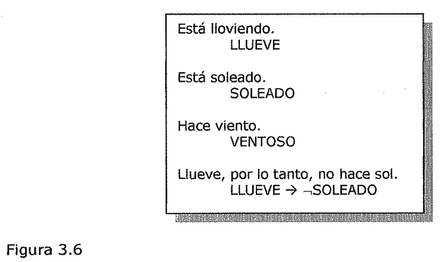
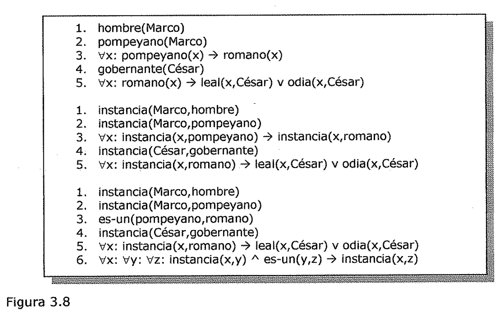
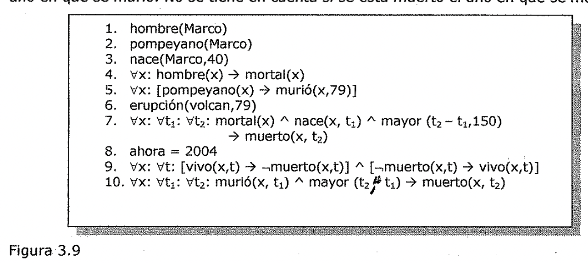
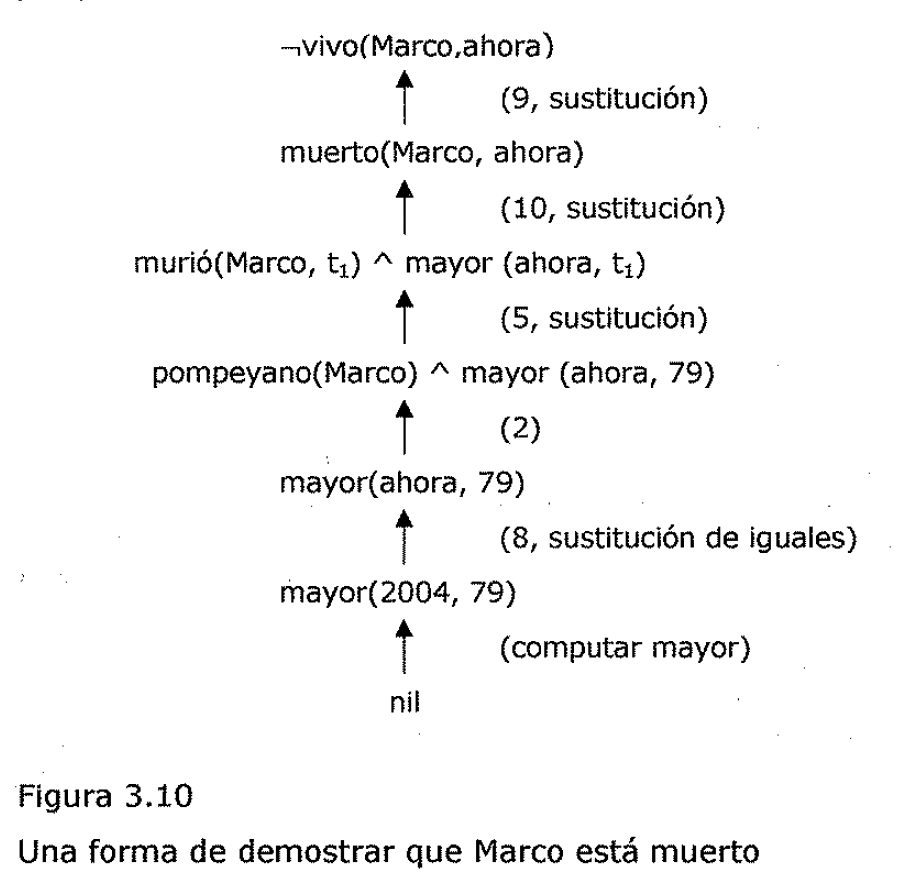
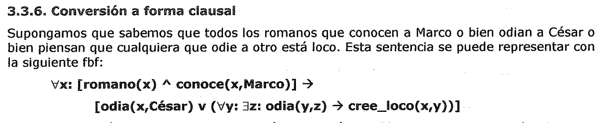
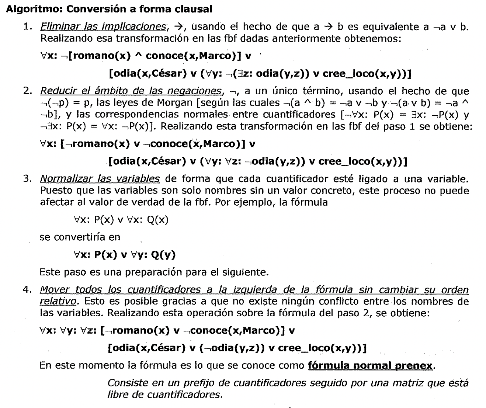
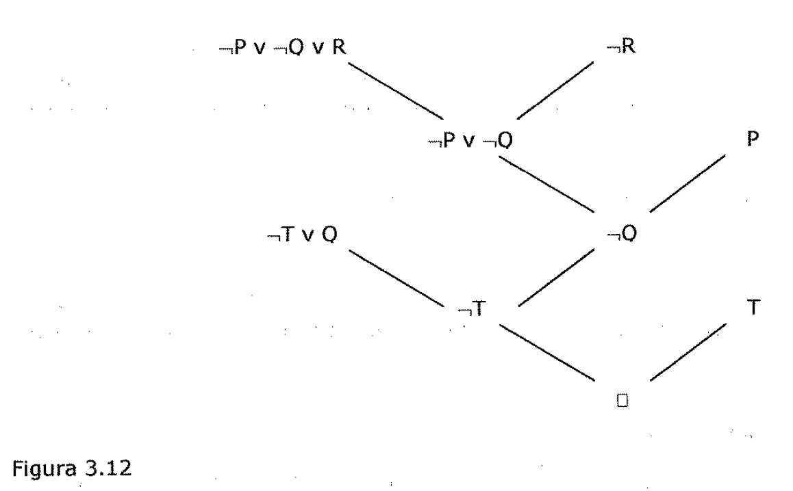
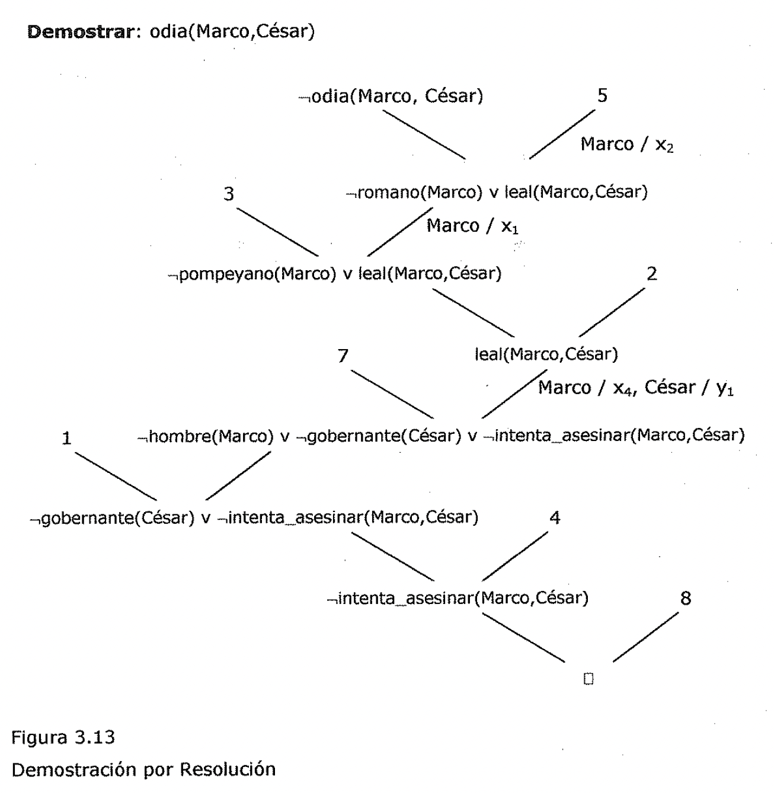

(logica-de-predicados)=

# Lógica de predicados

(introduccion-y-concepto-de-semidecidible)=

## Introducción y concepto de semidecidible

*El aspecto más atractivo del formalismo lógico es que proporciona de manera
inmediata un método muy potente para la obtención de nuevo conocimiento a partir
del antiguo:* ***la deducción matemática.*** *En este formalismo se puede
concluir la verdad de un aserto sin otra cosa que demostrar que es consecuencia
de lo ya conocido.* De esta manera la idea de prueba, según se entiende en
matemáticas como un método riguroso de demostración de una proposición que se
cree cierta, se puede extender a la *deducción* como un medio de obtener
respuestas a preguntas y soluciones a problemas.

Uno de los primeros dominios donde se aplico la IA fue la demostración
automática de teoremas, que tenia como objetivo la demostración de proposiciones
en distintas áreas de la matemática. Por ejemplo, el Logic Theorist (Newell et
al., 1963) demostraba teoremas del primer capítulo de los Principia Matemática
de Whitehead **y** Russell [@whiteheadRussell1950principia]. Otro demostrador de
teoremas (Gelernter et al., 1963) trabaja sobre teoremas de geometría. La
demostración de teoremas matemáticos sigue siendo un área de investigación
activa en IA. Pero, la utilidad de las técnicas matemáticas se ha extendido más
allá del ámbito tradicional de las matemáticas. La matemática no resulta muy
diferente de cualquier otra labor intelectual compleja en lo que se refiere a la
necesidad de mecanismos de deducción fiables y de una gran cantidad de
conocimiento heurístico para el control de lo que, de otra forma, sería un
problema de búsqueda intratable.

*Una de las razones más importantes para utilizar el formalismo lógico es que si
se representa el conocimiento como sentencias lógicas, entonces* se *dispone de
un buen mecanismo para razonar con ese conocimiento.* Determinar la validez de
una proposición en lógica proposicional es algo inmediato, aunque pueda ser
computacionalmente costoso.

Por lo tanto, antes de adoptar la **lógica de predicados** como un medio
apropiado para la representación del conocimiento, sería bueno preguntarse *si
también ofrece un mecanismo*

1. *adecuado para razonar con ese conocimiento.*

A primera vista la respuesta parece afirmativa. *Es posible deducir nuevas
sentencias a partir de las antiguas. Sin embargo, y por desgracia, no se dispone
de un procedimiento de decisión,* ni siquiera de uno exponencial. Existen
procedimientos que permitirán encontrar la prueba de un teorema dado si es que
en realidad se trata de un teorema. Pero no está garantizado que estos
procedimientos paren cuando la sentencia no sea un teorema. • • En otras
palabras, *aunque* ***la lógica de predicados*** *de primer orden no es
decidible, sí* **es *semidecidible.*** Un procedimiento muy sencillo consiste en
aplicar sistemáticamente las reglas de inferencia sobre los axiomas, siguiendo
un cierto orden, comprobando cada uno de los teoremas generados para determinar
si es el que se pretende demostrar. Sin embargo, este método no es especialmente
eficiente por lo que sería aconsejable encontrar uno mejor.

A pesar de que los resultados negativos, tales como el hecho de que no exista
ningún procedimiento de decisión para la lógica de predicados, no suelen tener
gran importancia en una ciencia como la IA, que se ocupa de buscar métodos
positivos para hacer las cosas, este resultado negativo en particular resulta de
utilidad, puesto que permite afirmar que en la búsqueda de un procedimiento de
prueba eficiente, basta con encontrar uno que demuestre teoremas, aunque no este
garantizada la parada ante algo que no sea un teorema. Y el hecho de que no
pueda existir un procedimiento de decisión que pare con todas las entradas
posibles, no significa que no pueda existir uno que pare en la mayoría de los
casos cuando de lo que se trate sea de resolver problemas del mundo real.

*Por lo tanto, la lógica de predicados, a pesar de su indecidibilidad teórica,
puede resultar útil como medio de representación y manipulación*• *de ciertos
tipos de conocimiento que pueden ser necesarios en un sistema de IA.*

(representacion-de-hechos-simples-en-logica)=

## Representación de hechos simples en lógica

En primer lugar exploraremos el uso de la ***lógica proposicional*** como medio
de representación del tipo de conocimiento acerca del mundo que puede ser
necesario en un sistema de IA. *El atractivo de la lógica proposicional consiste
en su simplicidad y en la disponibilidad de un procedimiento de decisión.* Es
muy sencillo representar los hechos del mundo real como proposiciones lógicas
escritas en forma de *fórmulas bien formadas (fbf)* de la lógica proposicional,
como se muestra en la Figura 3.6.

Esta lloviendo.

LLUEVE

Esta soleado.

SOLEADO

Hace viento.

VENTOSO

Llueve, por lo tanto, no hace sol.

LLUEVE ➔ SOLEADO

Figura 3.6

Mediante estas proposiciones se podría deducir, por ejemplo, que no hace sol a
partir del hecho de que está lloviendo. Supóngase que se desea representar el
hecho obvio que se enuncia en la conocida frase:

Sócrates es un hombre.

Se podría escribir:

SOCRATESHOMBRE

Pero si además se quisiera representar el hecho: Platón es un hombre.

habría que escribir algo así como: PLATONHOMBRE que no tiene nada en común con
la anterior, de manera que no es posible llegar a ninguna conclusión acerca de
las similitudes entre Sócrates y Platón. Seria mucho mejor si estos hechos se
representasen como:

puesto que *ahora la estructura del.conocimiento está reflejada en la propia
estructura de la* *representación.* Pero para ello es necesario utilizar
predicados que se aplican sobre argumentos. Sería aún más difícil representar la
también conocida frase:

Todos los hombres son mortales.

Que se podría representar como: HOMBREMORTAL

Pero de esta forma no se consigue expresar el hecho de que todos y cada uno de
los hombres son mortales.

Para hacerlo, **es *necesario utilizar la lógica de predicados de primer orden
(o simplemente lógica de predicados) como medio de representación del
conocimiento, dado que permite representar cosas que no serían representables de
forma razonable utilizando la lógica proposicional.*** *Mediante la lógica de
predicados* se *pueden representar hechos del mundo real coma sentencias
escritas en forma de fbf.*,, A continuación se presenta un ejemplo específico
donde se utiliza la lógica de predicados como medio de representación del
conocimiento. Considérese las siguientes sentencias:

- 1. Marco era un hombre.

2. Marco era un pompeyano.

1. Todos los pompeyanos eran romanos.

1. Cesar fue un gobernante.

1. Todos los romanos o eran leales a Cesar o le odiaban.

1. Todo el mundo es leal a alguien.

1. La gente solo intenta asesinar a los gobernantes a los que no es real.

1. Marco intentó asesinar a Cesar.

Los hechos descritos en esas frases se pueden representar como un conjunto de
fbf de la lógica de predicados de la siguiente manera:

1. Marco era un hombre.

**hombre(Marco)**

En esta representación se recoge el hecho fundamental de la humanidad de Marco.

Sin embargo, se pierden ciertos detalles de la frase en lenguaje natural, como
el concepto de tiempo pasado. Según el uso que se pretenda hacer del
conocimiento, esta omisión será aceptable o no. Para este sencillo ejemplo es
suficiente.

1. Marco era un pompeyano.

**pompeyano(Marco)**

1. Todos los pompeyanos eran romanos.

\\ix: **pompeyano(x)** ➔ **romano(x)**

1. Cesar fue un gobernante.

**gobernante(Cesar)**

Aquí se ignora el hecho de que los nombres propios no se suelen referir a un
único individuo, puesto que hay mucha gente que comparte el mismo nombre.

En ocasiones, para decidir a quién se refiere una frase en particular de entre
un grupo de personas con el mismo nombre, puede ser necesaria una gran cantidad
de conocimiento y de razonamiento.

1. Todos los romanos o eran leales a Césaro le odiaban.

, *) \\ix:* romano(x) ➔ leal(x,Cesar) v odia(x,Cesar) En lenguaje natural, la
palabra "o" se puede referir a la o-conjuntiva de la lógica o a la o-disyuntiva
(XOR). Aquí se ha utilizado la interpretación conjuntiva. Es posible argumentar
que esta frase en realidad tiene un significado disyuntivo. Para expresarlo se
escribiría:

**\\ix: romano(x)** ➔

**[(leal(x,Cesar) v odia(x,Cesar)) A (leal(x,Cesar) A odia(x,Cesar))]**

1., Todo el mundo es leal a alguien

\\ix::ly: **leal(x,y)**

U problema importante que se plantea cuando se intenta convertir frases en
lenguaje natural a sentencias lógicas, es el ámbito de los cuantificadores. Con
esta frase se quiere decir, como se ha supuesto al escribir la anterior fórmula
lógica, que cada persona tiene alguien a quién el o ella es leal, probablemente
alguien diferente para ' cada cuál. 0 quiere decir que hay alguien a quién todo
el mundo es leal (que se escribiría como:ly: \\ix: leal(x,y). Normalmente solo
una de las interpretaciones parece plausible, y es esa la que se suele tomar.

1. La gente solo intenta asesinar a los gobernantes a los que no es leal.

\\ix: Vy:**persona(x) A gobernante(y) A intenta asesinar(x,y)** ➔ **leal(x,y)**
Esta frase también es ambigua. Significa que a los únicos gobernantes a los que
la gente intenta asesinar son aquellos a los que no son leales (la
interpretación que se ha utilizado), o significa que lo único que la gente
intenta hacer es asesinar a gobernantes a los que no son leales.

En la representación de esta frase se ha decidido escribir *"intenta asesinar"*
como un único predicado. De esta forma se obtiene una representación sencilla
que permite razonar acerca de intentos de asesinato. \_Pero con esta
representación, no sería fácil establecer conexiones entre intentar un asesinato
e intentar cualquier otra cosa o entre un intento de asesinato y un verdadero
asesinato. Si fuese necesario establecer tales conexiones habría que escoger una
representación diferente.

1. Marco intentó asesinar a Cesar.

Los anteriores ejemplos dan una idea clara de la dificultad de convertir frases
en lenguaje natural a sentencias lógicas.

t (7, sustitución) persona(Marco) A gobernante( Cesar) A persona(Marco) A
persona(Marco)

Figura 3.7

Supongamos que se desea utilizar los anteriores asertos para responder a la
siguiente pregunta:

**¿Era Marco leal a Cesar?**

Parece que por medio de 7 y 8 se puede demostrar que Marco no era leal a Cesar
(ignorando de nuevo la distinción entre tiempo pasado y presente). Intentemos
ahora obtener una prueba formal razonando a la inversa desde el objetivo a
alcanzar:

leal(Marco, Cesar) Para probar dicho objetivo es necesario utilizar las reglas
de inferencia que permiten transformarlo en otro objetivo (o posiblemente
conjunto de objetivos) que a su vez puedan ser transformados, y así
sucesivamente, hasta que no quede ningún objetivo por satisfacer.

Para realizar este proceso es posible que sea necesario utilizar, un grafo Y-O
cuando haya caminos alternativos para satisfacer un objetivo dado. Por
simplicidad solo se muestra uno de los posibles caminos. *La Figura 3.* 7
*muestra un intento de prueba del objetivo mediante la reducción del conjunto de
objetivos necesarios aún sin satisfacer, a un conjunto vacío.* El intento falla,
ya que no se puede satisfacer el objetivo persona(Marco) con los asertos
disponibles.

*El problema es que, a pesar de que se sabe que Marco era un hombre, no* se
*puede deducir que era una persona.* Se debe añadir la representación de otro.
hecho al sistema:

1. Todos los hombres son personas.

\\Ix: **hombre(x)** ➔ **persona(x)** De esta forma se satisface el último
objetivo y se obtiene una prueba de que ***Marco no era leaf a Cesar.*** En este
ejemplo se hallan presentes tres importantes cuestiones involucradas en el
proceso de conversión de frases en lenguaje natural a sentencias lógicas y el
posterior uso de estas sentencias en la deducción de otras nuevas:

*Muchas frases en lenguaje natural son ambiguas* (por ejemplo, 5, 6 y 7 del
ejemplo anterior). La selección de la interpretación correcta puede ser difícil.

- *Normalmente hay más de una forma de representar el conocimiento* (como ya se
  vio en las frases 1 y 7). La simplicidad de la representación es una cualidad
  deseable, pero puede ocurrir que de esa forma se penalice cierto tipo de
  razonamiento. La

conveniencia de la representación que se escoja para un conjunto de frases
dependerá del uso que se quiera hacer del conocimiento contenido en dichas
frases.

*Aun en las casos más sencillos, no es probable que en un conjunto de frases
dado, este contenida toda la información necesaria para razonar sobre el tema en
cuestión.* Para poder razonar de manera efectiva a partir de un conjunto de
sentencias, normalmente es necesario utilizar un conjunto de sentencias
adicionales que representan aquellos hechos que, por lo general no se suelen
especificar, por demasiado obvios.

*Se puede presentar un problema adicional cuando no se conocen de antemano las
sentencias que se va a intentar deducir.* En el ejemplo anterior el objetivo era
responder a la pregunta ".!.era Marco teal a Cesar?". Pero.!.Como puede decidir
un programa cuál de estas dos sentencias demostrar?

leal(Marco, Cesar) teal(Marco, Cesar)

1. Se puede intentar diferentes cosas como razonar a partir de los axiomas y ver
   que respuesta se obtiene, en lugar de utilizar la estrategia empleada en el
   ejemplo anterior de razonar hacia atrás a partir del objetivo propuesto. El
   problema de razonar hacia delante a partir de los axiomas es que es probable
   que el factor de ramificación provoque que no se obtenga ninguna respuesta en
   un tiempo razonable.

1. Una segunda posibilidad consistiría en utilizar algún tipo de reglas
   heurísticas que permitiesen decidir cuál es la respuesta más probable y
   entonces intentar demostrarla. Si después de un tiempo razonable no se
   encontrase una demostración, se intentaría con la otra respuesta. Es
   importante esta idea de limitar el esfuerzo, puesto que cualquier
   procedimiento de prueba que se utilice puede no parar cuando se enfrenta con
   algo que no es un teorema.

1. Otra posibilidad sería tratar de demostrar ambas respuestas simultáneamente y
   parar cuando una de las dos demostraciones tuviese éxito. Sin embargo, aun
   así, si no se dispone de suficiente información para responder a la pregunta,
   es posible que el programa no pare nunca.

1. Una cuarta estrategia consiste en intentar demostrar la verdad de una•
   respuesta y la

falsedad de la contraria y utilizar la información obtenida en cada proceso como
ayuda en el otro. \\

(la-representacion-de-las-relaciones-instancia-y-es-un)=

## La representación de las relaciones instancia y es-un

Los atributos ***instancia*** y ***es-un*** juegan un papel importante en el
modelo de razonamiento guiado por la herencia de propiedades. Si se revisa la
manera en que se ha representado el conocimiento acerca de Marco y Cesar en el
ejemplo anterior, se observara que no se han utilizado estos atributos.
Ciertamente no se han utilizado predicados con esos nombres. LPor \*\*que no? La
respuesta es que, a pesar de que no se han utilizado explícitamente los
predicados C. instancia y es-un, *sí se han empleado las relaciones que
representan, la pertenencia a una* *clase y la inclusión de una clase en otra.*
La Figura 3.8 muestra la representación lógica, escrita de tres formas
distintas, de las primeras cinco frases del apartado anterior.

1. hombre(Marco)

1. pompeyano(Marco)

1. vx: pompeyano(x) ➔ romano(x)

1. gobernante(Cesar)

1. vx: romano(x) ➔ leal(x,Cesar) v odia(x,Cesar)

1. vx: instancia(x,pompeyano) ➔ instancia(x,romano)

1. vx: instancia(x,romano) ➔ leal(x,Cesar) v odia(x,Cesar)

1. vx: instancia(x,romano) ➔ leal(x,Cesar) v odia(x,Cesar)

1. vx: vy: vz: instancia(x,y) " es-un(y,z) ➔ instancia(x,z)

Figura 3.8

En la **primera parte** de la figura aparece una representación de la que ya
hemos hablado. En esta representación, *la pertenencia a una clase se representa
con predicados monarios* (como romano) que se refieren a cada una de las clases.
*Asertar* *P(x) como cierto es equivalente a afirmar que x es una instancia (o
un elemento) de P.* En la **segunda parte** de la figura aparece una
representación donde se utiliza explícitamente el predicado instancia. *Este es
un predicado binario, cuyo primer argumento es un objeto y cuyo segundo
argumento es la clase a la que ese objeto* *pertenece. Sin embargo, en esta
representación no se utiliza explícitamente el* *predicado es-un.* En la tercera
sentencia de la segunda parte de la figura aparece un ejemplo de cómo se
representa la relación que se establece entre dos subclases cuando una esta
incluida en la otra, coma por ejemplo la clase de los pompeyanos en la clase de
los romanos. La regla de implicación que ahf aparece se lee como que si un
objeto es una instancia de la subclase pompeyano entonces también será una
instancia de la superclase romano. Nótese que esta regla es equivalente a la
definición de la relación de inclusión en la teoría de conjuntos.

Por último, en la figura se muestra una **tercera representación** donde *se
utilizan explícitamente los predicados instancia y es-un.* Con el uso del •
predicado es-un se simplifica la representación de la tercera sentencia, pero
hace necesaria la definición de un nuevo axioma (definido con el número 6). Este
axioma adicional describe coma se ' puede combinar una relación de instancia con
una relación es-un para dar lugar a una nueva relación de instancia. Sin
embargo, este axioma es de carácter general y no es necesario definirlo para
cada nueva relación es-un.

Estos ejemplos pretenden ilustrar dos ideas diferentes.

- La primera, bastante específica, nos permite afirmar que *no es necesario
  representar explícitamente las relaciones de pertenencia a una clase e
  inclusión de una clase en otra por media de Jos predicados instancia v es-un.*
  De hecho, normalmente resulta engorroso hacerlo de esta forma y se suele optar
  por la utilización de predicados monarios que representan a las clases.

- La segunda idea es más general y viene a decir que *normalmente es posible
  obtener varias representaciones de un determinado hecho en un sistema* •*de*.
  *representación dado, va sea este la lógica* o *cualquier otro. La elección
  dependería, en parte del tipo de deducciones que se pretenda agilizar, v en
  parte del gusto de cada cuál.* La norma que siempre se debe respetar es el uso
  consistente de una determinada representación en toda la base de conocimiento.
  Dado que las reglas de inferencia se construyen para ser aplicadas sobre una
  forma de representación en concreto, es necesario que todo el conocimiento
  sobre el que esas reglas son aplicables este representado de la forma que las
  reglas necesiten. El uso de representaciones inconsistentes provoca muchos
  errores en los mecanismos de razonamiento de los programas basados en
  conocimiento. La moraleja es, simplemente, que se debe ser cuidadoso.

3,3.4. Representación de Funciones calculables y Predicados computables En el
ejemplo del apartado anterior, todos los hechos simples se representaban como
combinaciones de predicados aislados, tales como:• Esta es una buena solución
cuando el número de hechos es pequeño o cuando los propios hechos carecen de una
estructura definida de forma que no existen demasiadas alternativas.

Pero supongamos que se desea expresar hechos simples tales como las siguientes
relaciones mayor-que y menor-que:

**mayor(l,O) menor(0,1) mayor(2,1) menor(l,2) mayor(3,2) menor(2,3)**

Está claro que ***sería tedioso representar todos estos hechos, uno a uno,
explícitamente.*** Entre otras cosas porque los hay infinitos. Pero aún en el
caso de que solo considerásemos el subconjunto finito que es posible representar
en, digamos, una palabra máquina por número, sería muy ineficiente
representarlos todos explícitamente cuando, en lugar de ello, es posible
***calcularlos en el momento necesario.*** Por tanto, resulta muy conveniente
***extender la representación*** para poder expresar estos ***predicados
computables.*** Independientemente del procedimiento de demostración que se
utilice, cuando se encuentre con un predicado de este tipo, en lugar de buscarlo
explícitamente en la base de datos o intentar deducirlo mediante algún tipo de
razonamiento, bastara con ***invocar un procedimiento, especificado
previamente,*** que devolverá un valor de verdadero o falso.

Ta.también suele.e ser útil disponer de ***funciones computables*** además. de
predicados computables. De esta forma sería posible evaluar el predicado:

**mayor(2+3,1)**

Para ello es necesario evaluar en primer lugar el valor de la función suma con
los argumentos 2 y 3, para luego evaluar el predicado mayor con los argumentos 5
y 1.

En. el siguiente ejemplo se• muestra la utilidad de esta idea de funciones. y
predicados computables. También se hace uso del concepto de ***igualdad,*** de
modo que sea posible sustituir un objeto por otro que sea igual a el, cuando
este cambio resulte de alguna utilidad en el proceso de prueba. • Considérese el
siguiente conjunto de hechos que, otra vez, se refieren a Marco:

- 1. Marco era un hombre.

**hombre(Marco)**

De nuevo no tenemos en consideración el tiempo verbal.

- 1. Marco era pompeyano.

**pompeyano(Marco)**

- 1. Marco nació en el 40 D.C.

**nace(Marco,40)** I.

Por simplicidad no representaremos D.C. explícitamente, de la misma forma que se
suele omitir en las conversaciones de la vida diaria. Si en algún momento fuese
necesario representar fechas A.C., entonces habría que decidir la manera de
hacerlo, por ejemplo, utilizando números negativos. Nótese que la representación
de una frase no tiene que ser una copia de la frase en sí, siempre que sea
posible pasar de la fase a su representación y viceversa. Esto permite elegir
una representación tal como números positivos y negativos, con la que un
programa puede trabajar fácilmente.

- 1. Todos los hombres son mortales.

\\ix: **hombre(x)** ➔ **mortal(x)**

- 1. Todos los pompeyanos murieron cuando el volcán entró en erupción en el 79
     D.C. **erupción(volcán,79) A** \\ix: **\[pompeyano(x)** ➔ **murió(x,79)\]**
     Claramente en esta sentencia se representan los dos hechos enunciados en la
     frase

anterior. También se podría asertar otro hecho que no aparece en la
representación, a saber, que la erupción del volcán causó la muerte de los
pompeyanos. Normalmente se suele suponer una relación de causalidad entre
efectos que se producen al mismo tiempo siempre que esa suposición sea
plausible.

La interpretación de esta frase presenta un problema adicional que consiste en
determinar el referente de la expresión *"el volcán".* Hay más de un volcán en
el mundo. Claramente aquí nos referimos al Vesuvio, que está cerca de Pompeya y
que entró en erupción en el 79 D.C. En general para resolver estas referencias
se necesita tanto una gran cantidad de razonamiento como una gran cantidad de
conocimiento adicional.

- 1. Ningún mortal vive más de 150 años.

\\ix: \\it: \\it: **mortal(x) A nace(x, t ) A mayor (t - t,150)** ➔**muerto(x,
t2)**

1 2 **1 2 1**

Esta frase se podría expresar de diversas maneras. Por ejemplo, se podría
definir una función edad y asertar que su valor nunca puede ser mayor de 150.
Sin embargo, la representación escogida aquí es más sencilla y suficiente para
este ejemplo.

- 1. Estamos en 2004.

**ahora = 2004**

Aquí se hace uso de la idea de que una cantidad se puede sustituir por otra de
igual valor.

Supongamos ahora que se.desea responder a la pregunta ***"i.Esta Marco
vivo?".*** Echando un *\<* rápido vistazo a los asertos es fácil llegar a la
conclusión de que hay más de un modo posible de deducir una respuesta. Bien
podemos demostrar que ***Marco está muerto porque lo mató*** ***la erupción del
volcán,*** o bien podemos demostrar que ***está muerto porque si no lo***
***estuviera tendría más de 1.50 anos,*** lo cuál sabemos que es imposible.

Pero en cuanto intentemos seguir rigurosamente alguna de estas dos líneas de
razonamiento descubriremos, como en el ejemplo anterior, la ***necesidad de
utilizar conocimiento*** ***adicional.*** Por ejemplo, en las sentencias se
habla de la muerte, pero no se dice nada que la relacione con la vida, que es el
concepto que aparece en la pregunta. Por tanto, es necesario añadir los
siguientes hechos:

- 1. Estar vivo significa no estar muerto.

Esto no es estrictamente correcto, pues el hecho de no estar muerto solo implica
estar vivo si se refiere a objetos animados. (Las sillas no están ni.vivas ni
muertas). De nuevo, obviaremos este detalle por ahora. Es mlly extraño que dos
representaciones signifiquen exactamente lo mismo desde todos los puntos de
vista.

- 1. Si alguien muere, está muerto para siempre.

Vx: Vt1: Vt,: **murió(x, t1) " mayor (t2 *'J'* t1)** ➔**muerto(x, t2)** Esta
representación expresa el hecho de que se está muerto todos los anos a partir
del ano en que se murió. No se tiene en cuenta si se está muerto el ano en que
se murió.

1. hombre(Marco)

1. pompeyano(Marco)

1. nace(Marco,40)

1. vx: hombre(x) ➔ mortal(x)

1. vx: [pompeyano(x) ➔ murió(x,79)]

1. erupción(volcán,79)

1. vx: Vt1: Vt2: mortal(x)" nace(x, t1)" mayor (t2- t1,150)

- muerto(x, t2)

8. ahora 2004

1. vx: Vt1: Vt2: murió(x, t1) " mayor (t2f t1) ➔ muerto(x, t2)

vx: Vt: \[vivo(x,t) ➔ muerto(x,t)J " \[muerto(x,t) ➔ vivo(x,t)J

Figura 3.9

Un conjunto de hechos acerca de Marco

En la Figura 3.9 aparecen todos los hechos definidos.hasta ahora. Intentemos
ahora responder a la pregunta "\<'.Esta Marco vivo?" buscando una demostración
de:

vivo(Marco,ahora) El término vado que aparece al final de. la Figura 3.10 indica
que la lista de condiciones que queda por probar esta vacía con lo cuál la
demostración ha terminado con éxito.

vivo(Marco,ahora) 9, sustitución) muerto(Marco, ahora)

**t** (10, sustitución) murió(Marco, t1) " mayor (ahora, t1) 5, sustitución)

pompeyano(Marco) " mayor (ahora, 79) mayor(ahora, 79) 8, sustitución de iguales)
mayor(2004, 79)

**t** (computar mayor) nil

Figura 3.10

Una forma de demostrar que Marco está muerto

- 1.¿Si, M:método de Resolm::ion

Desde el punto de vista computacional sería muy útil disponer de un
*procedimiento de* *demostración* que en una sola operación llevase a cabo los
distintos. procesos involucrados en el razonamiento con sentencias de la lógica
de predicados. La ***Resolución*** cumple este requisito y debe su eficiencia al
hecho de que trabaja sobre *sentencias que han sido* *transformadas a una forma
canónica,* descrita más abajo, muy conveniente.

***El procedimiento de resolución obtiene demostraciones por refutación. Es
decir,***

***para probar una proposición (demostrar su validez)* se *intenta demostrar que
su negación lleva a una contradicción con las proposiciones conocidas (es***

***decir, es insatisfactible).***

Esta aproximación difiere de la técnica utilizada hasta ahora, donde se
intentaba generar la demostración de un teorema aplicando las reglas conocidas
hasta llegar a alguno de las axiomas. La explicación del mecanismo de resolución
será más directa una vez que se haya descrito la forma estándar en que se
representan las proposiciones, y par lo tanto, la posponemos hasta entonces.

(conversion-a-forma-clausal)=

## Conversión a forma clausal

Supongamos que sabemos que todos los romanos que conocen a Marco o bien odian a

Cesar o bien piensan que cualquiera que odie a otro está loco. Esta sentencia se
puede representar con la siguiente fbf:

'ifx: **[romano(x) "conoce(x,Marco)]** ➔ El uso de esta fórmula en una
demostración requeriría establecer unas correspondencias muy complicadas. Una
vez que se haya establecido la correspondencia con una parte de ella, coma por
ejemplo cree_loco(x,y), será necesario realizar las operaciones adecuadas con el
resto de la fórmula, tanto en la parte donde se incluye ese fragmento coma en
aquellas donde no. Si la fórmula fuese más simple este proceso sería mucho más
sencillo. Seria más sencillo trabajar con esta fórmula si:

- Fuera más plana, es decir, si hubiese menos anidamiento entre (as expresiones.

- Los cuantificadores estuvieran separados de·· la fórmula, de modo que no fuera

necesario tenerlos en consideración. • La ***forma normalizada conjuntiva***

(Davis y Putnam, 1960) ***tiene ambas propiedades.*** Por ejemplo, la fórmula
dada anteriormente acerca. de las sentimientos de las romanos que conocen a
Marco se representaría en forma normalizada conjuntiva como:

**romano(x) v conoce(x,Marco) v**

**odia(x, Cesar) v odia(y,z) v cree_loco(x,z)** Puesto que *existe un algoritmo
para* ***convertir*** *cualquier* ***fbf*** *a la* ***forma normalizada***
***conjuntiva,*** no perdemos la generalidad si empleamos un procedimiento de
demostración (coma la resolución) que opere solamente con fórmulas expresadas de
esta forma. De hecho, *para que la resolución funcione,* es necesario ir un poco
más allá. *Es necesario* *convertir el conjunto de fórmulas bien formadas a un*
***conjunto de cláusulas,*** donde una **cláusula** se define coma ***una fbf en
forma normalizada conjuntiva que no contiene***

***ninguna conectiva* A,**

Para ello se convierte cada fbf a forma normalizada conjuntiva y, a
continuación, se divide esa expresión en cláusulas, una par cada conjunción.
Cuando se aplique el procedimiento.de prueba, las conjunciones se consideraran
agrupadas. Para transformar una fbf a forma clausal es necesario seguir los
siguientes pasos:

**Algoritmo: Conversión a forma clausal**

1. *Eliminar las implicaciones;* ➔, usando el hecho de que a ➔ b es equivalente
   a.a v b.

ReaUsando esa transformación en las fbf dadas anteriormente obtenemos:

**Vx:,[romano(x) "conoce(x,Marco)] v** •

1. *Reducir el ámbito de las negaciones,*,, a un único término, usando el hecho
   de que

.p) = p, las leyes de Morgan [según las cuales (a" b) =av,by.(av b) =.a",b], y
las correspondencias normales entre cuantificadores \[vx: P(x) =:ix:.P(x) y,3x:
P(x) = Vx:,P(x)\]. Realizando esta transformación en las fbf del paso 1 se
obtiene:

Vx: \[ **.romano(x) v.conoce(x,Marco)\] v**

1. *Normalizar las variables* de forma que cada cuantificador este ligado a una
   variable. Puesto que las variables son solo nombres sin un valor concreto,
   este proceso no puede afectar al valor de verdad de la fbf. Por ejemplo, la
   fórmula

Vx: P(x) v Vx: Q(x)

I se convertiría en

Vx: **P(x) V** Vy: **Q(y)**

Este paso es una preparación para el siguiente.

4. *Mover todos los cuantificadores a la izquierda de la fórmula sin cambiar su
   orden*

*relativo.* Esto es posible gracias a que no existe ningún conflicto entre los
nombres de las variables. Realizando esta operación sobre la fórmula del paso 2,
se obtiene:

En este momento la fórmula es lo que se conoce como **fórmula normal prenex.**
*Consiste en un prefijo de cuantificadores seguido par una matriz que esta libre
de cuantificadores.*

1. *Eliminar las cuantificadores existenciales.* En una fórmula donde se incluye
   una variable cuantificada existencialmente se afirma que existe un valor que
   puede sustituir a la

variable, y que hace verdadera la fórmula. Es posible eliminar el cuantificador
sustituyendo la variable por una referencia a una función que produzca el valor
deseado. Puesto que no se conoce necesariamente la forma de producir ese valor,
se debe crear un nuevo nombre de función para cada sustitución. No se hace
ninguna afirmación sobre esas funciones excepto que deben existir. Así, por
ejemplo, la fórmula:

3y: Presidente(y)

puede transformarse en la fórmula

**Presidente(S1)**

Donde S1 es una función sin argumentos que produce de algún modo un valor que
satisface el predicado Presidente.

Si surgen cuantificadores existenciales dentro del ámbito de cuantificadores
universales, los valores que satisfagan el predicado pueden depender de los
valores de las variables cuantificadas universalmente. Por ejemplo, en la
fórmula:

Vx: 3y: padre_de(y,x)

el valor de y que satisface padre_de depende del valor concreto de x. Por lo
tanto, se deben generar funciones con el mismo número de argumentos que el
número de cuantificadores universales que afecten a la expresión que se este
tratando. Así, este ejemplo se transformaría en:

Estas funciones que generamos se llaman **funciones de Skolem,** Aquellas que no
tienen argumentos se llaman a veces **constantes de Skolem.**

1. *Eliminar el prefijo.* En este punto, *todas las variables.que quedan están
   cuantificadas* *universalmente,* por lo que el prefijo puede ser simplemente
   ignorado, y cualquier procedimiento de demostración que usemos puede suponer
   simplemente que cualquier

variable con la que se encuentre, esta cuantificada universalmente. Ahora la
fórmula producida en el paso 4 aparece como:

\[**romano(x) v conoce(x,Marco}\] v**

1. *Convertir la matriz en una conjunción de disyunciones.* Como en este ejemplo
   no

aparece ninguna conectiva Y, basta con utilizar la propiedad asociativa de la
conectiva lógica O [es decir, av (b v c) = (a v b) v c] y quitar simplemente los
paréntesis, para obtener:

**romano(x) v conoce(x,Marco) v**

**odia(x,Cesar) v odia(y,z) v cree_loco(x,y)**

Sin embargo, con frecuencia es también necesario utilizar la propiedad
distributiva [(a A b) v c = (av c) A (b v c)]. Por ejemplo, la fórmula:

invierno A llevarbotas) v (verano A llevarsandalias) se convierte después de una
aplicación de la regla en: [invierno v (verano A llevarsandalias)] A
\[llevarbotas v (verano A llevarsandalias)J

y, después de una segunda aplicación, que es necesaria, porque aún quedan
conjunciones unidas por la conectiva O, en i invierno v verano) A invierno v
llevarsandalias) A llevarbotas v verano) A llevarbotas v llevarsandalias)

1. *Crear una cláusula por cada conjunción.* Para que una fbf sea cierta, todas
   las cláusulas que se han generado a partir de ella deben ser ciertas. Cuando
   se trabaja con varias fórmulas bien formadas, es posible combinar el conjunto
   de cláusulas generadas por

cada una de ellas para representar los mismos hechos que representaban las
fórmulas originales.

1. *Normalizar las variables* que aparecen en el conjunto de cláusulas generadas
   en el paso

1. Con esto se pretende que no haya dos cláusulas que hagan referencia a la
   misma variable, para lo cuál es necesario renombrar a las variables
   adecuadamente. Esta transformación se apoya en el hecho:

\\ix: P(x) A Q(x)) = \\ix: P(x) A *\\ix:* Q(x)

As\[, puesto que cada cláusula es una conjunción separada y todas las variables
están cuantificadas universalmente, no es necesario dar valor a una variable
cuantificada universalmente (es decir, sustituirla por un valor concreto). Pero,
en general, queremos mantener las cláusulas en su forma más general durante
tanto tiempo como sea posible.

Al instanciar una variable, queremos conocer el mínimo número de sustituciones
que deben realizarse para preservar el valor de verdad del sistema.

***Después de aplicar todo este procedimiento a un conjunto de fórmulas bien***
***formadas tendremos un conjunto de cláusulas, cada una de las cuales será una
disyunción de literales. Estas cláusulas serán las que utilice el
procedimiento***

***de resolución para generar demostraciones.***

(las-bases-de-la-resolucion)=

## Las bases de la resolución

***El procedimiento de resolución* es *un proceso iterativo simple en el cuál,
en cada paso, se comparan (resuelven) dos cláusulas llamadas cláusulas padres,
produciendo una nueva cláusula que* se *ha inferido de ellas.*** La nueva
cláusula representa la forma en que las dos cláusulas padres interaccionan entre
sL Supongamos que hay dos cláusulas en el Sistema:

invierno v verano .invierno v frío Recordemos que esto significa que ambas
cláusula.las deben ser ciertas (es decir, aunque las cláusulas parecen
independientes, en realidad están agrupadas).

Ahora vemos que siempre deberá ser cierta una de las aserciones invierno
o.invierno. Si invierno es cierto, entonces frio debe ser cierto para garantizar
la verdad de la segunda cláusula. Si.invierno es verdad, entonces verano debe
ser cierto para garantizar la verdad de la primera cláusula. As\[ pues, a partir
de esas dos cláusulas se puede deducir:

**verano v frio**

*Esta es la deducción que hará el procedimiento de resolución.*

- La resolución opera tomando dos cláusulas tales que cada una contenga el mismo
  literal,

en este ejemplo, invierno. ***El literal debe estar en forma positiva en una
cláusula***

***y en forma negativa en la otra.***

- El resolvente se obtiene combinando todos los literales de las dos cláusulas
  padres excepto aquellos que se cancelan.

• Si la cláusula producida es la cláusula vacía, es que se ha encontrado una
contradicción.

Por ejemplo, las dos cláusulas:

invierno '.invierno producirán la cláusula vacía. Si existe una contradicción,
se encontrara en algún momento.

Naturalmente, si no existe ninguna contradicción, es posible que el
procedimiento nunca termine, aunque como veremos, a menudo existen formas de
detectar que no existe contradicción.

**3.3.8. Resolución en lógica proposicional**

Para aclarar como funciona la resolución, presentaremos en primer lugar el
procedimiento de resolución para *lógica proposicional.* Posteriormente lo
expandiremos para incluir la lógica de predicados.

En *lógica proposicional,* el procedimiento para producir una demostración por
resolución de la proposición P respecto a un conjunto de axiomas F es el
siguiente:

**Algoritmo: Resolución de·proposiciones**

1. Convertir todas las proposiciones de Fa forma clausal.

1. Negar P y convertir el resultado a forma clausal. Añadir la cláusula
   resultante al conjunto de cláusulas obtenidas en el paso 1.

1. Hasta que se encuentre una contradicción o no se pueda seguir avanzando
   repetir:

1. Seleccionar dos cláusulas. Llamarlas cláusulas padres.

1. Resolverlas juntas. La cláusula resultante, llamada **,resolvente,** será I.a
   disyunción

\<Je todos' los literales de las cláusulas padres con la siguiente excepción: si
existen pares de n·literales L y.L de forma que una de las cláusulas 'padre
contenga L y la otra contenga.L, entonces se eliminarán tanto L como.\_L del
resolvente.

- 1. Si el resolvente es la cláusula vacía, es que se ha encontrado una
     contradicción. Si

no lo es, añadirla al conjunto de cláusulas disponibles.

**Veamos un ejemplo sencillo.** Supongamos que se nos dan los axiomas mostrados
en la primera columna de la Figura 3.11 y queremos demostrar R. En primer lugar,
se convierten los axiomas a forma clausal, tal como se muestra en la segunda
columna de la figura. A continuación negamos R, obteniendo,R que ya está en
forma clausal. A continuación se empieza a elegir pares de cláusulas para
resolverlas.

**Axiomas de partida**

**Convertidos a forma clausal**

PA Q) ➔ R

S v T) ➔ Q

.P V,Q V R,S V Q .TvQ

Figura 3.11

Aunque puede resolverse cualquier par de cláusulas, solamente aquellos pares que
contengan literales complementarios, producirán un resolvente que tenga alguna
probabilidad de conducir al objetivo de obtener la cláusula vacía (que se
representa como una caja). Es posible, por ejemplo, generar la secuencia de
resolventes que se muestra en la Figura 3.12. Se empieza resolviendo con la
cláusula,R, puesto que es una de las cláusulas que deben estar involucradas en
la contradicción que estamos intentando hallar.

Figura 3.12

La resolución se puede ver como un proceso que toma un conjunto de cláusulas que
se suponen ciertas y, basándose en- la información que las otras proporcionan,
genera nuevas cláusulas que representan restricciones a la satisfacibilidad de
las cláusulas originates. Surge una contradicción cuando una cláusula se vuelve
tan restringida que no hay forma de hacerla verdadera. Esto se indica con la
generación de la cláusula vacía.

(el-algoritmo-de-unificacion)=

## El algoritmo de unificación

En lógica proposicional es fácil determinar que dos literales no pueden ser
ciertos al mismo tiempo. Basta con buscar L y,L.

En ***lógica de predicados*** el proceso de correspondencia es más complicado
puesto que ***se deben considerar los argumentos de los predicados.*** • • Por
ejemplo, hombre(John) y,hombre(John) es una contradicción, mientras que
hombre(John) y,hombre(Spot) no lo es. Así pues, para detectar las
contradicciones, se necesita un procedimiento de emparejamiento que compare dos
literales y descubra si existe un conjunto de sustituciones que los haga
idénticos.

*Existe un procedimiento recursivo directo, denominado* ***algoritmo de
unificación*** *que realiza exactamente esto.* La idea básica de la unificación
es muy sencilla.

- Para unificar dos literales, *en primer lugar se comprueba si las predicados
  coinciden.* Si es así, seguimos adelante, si no, no hay forma de unificarlos,
  sean cuales sean sus argumentos. Por ejemplo, los literales:

intenta_asesinar(Marco, Cesar) odia(Marco,Cesar) no son unificables.

- Si los predicados concuerdan, a continuación se *van comprobando los
  argumentos de dos en dos.* Si el primero concuerda, podemos continuar con el
  segundo, y así sucesivamente. Para comprobar cada par de argumentos, basta con
  llamar recursivamente al procedimiento de unificación. Las reglas de
  emparejamiento son

sencillas. Aquellos predicados o constantes que sean diferentes no se pueden
emparejar; aquellos que sean idénticos pueden hacerlo.

Una *variable* se puede emparejar *con otra variable, con cualquier constante o
con un predicado,* con la restricción de que el predicado no debe contener
ninguna instancia de la variable con la que se esta emparejando.

La única complicación en este procedimiento es que se debe encontrar una única
sustitución consistente para todo el literal, y no sustituciones separadas para
cada parte del mismo. Para hacerlo, se debe tomar cada sustitución que
encontremos y aplicarla al resto de literales antes de continuar intentando
unificarlos.

Por ejemplo, supongamos que queremos unificar las expresiones: P(x,x)

P(y,z)

Las dos ocurrencias de P se emparejan sin problema. A continuación comparamos x
e y, y decidimos que si sustituimos y por x, se pueden emparejar. Escribiremos
esa sustitución como Naturalmente, se podría haber sustituido x por y, puesto
que ambos son nombres de variables sin más significado. El algoritmo simplemente
elegirá una de las dos sustituciones). Pero ahora, si continuamos y emparejamos
x con z, obtendremos la sustitución z/x. Pero no es posible sustituir, a la
*vez,* y y z por x, por lo que la sustitución no es consistente.

Una *vez* encontrada la primera sustitución y/x es necesario realizar dicha
sustitución en el resto de literales, para obtener:

P(y,y)

P(y,z)

A continuación intentamos unificar los argumentos y y z, lo que logramos con la
sustitución z/y. Con esto se completa el proceso y la sustitución resultante es
la composición de las.dos sustituciones encontradas. La composición se escribe
como:

z/y)(y/x)

siguiendo la notación estándar para la composición de funciones.

El ***objetivo del procedimiento de unificación*** es descubrir, al menos una
sustitución que permita el emparejamiento de dos literales. Normalmente, si
existe una de dichas sustituciones, existiran muchas más. Por ejemplo, los
literales:

odia(x,y) odia(Marco, z) Pueden unificarse con cualquiera de las siguientes
sustituciones:

Marco/x, z/y)

Marco/x, y/z)

Marco/x, Cesar/y, Cesar/z)

Marco/x, Polonio/y, Polonio/z)

Las dos primeras son equivalentes, excepto por la diferencia léxica. Pero las
dos segundas, aunque producen un emparejamiento, producen también una
sustitución que es más restrictiva de lo que sería estrictamente necesario para
el emparejamiento.

Puesto que la sustitución final producida por el proceso de unificación será
usada por el procedimiento de resolución, sería conveniente generar el
unificador más general posible.

(resolucion-en-logica-de-predicados)=

## Resolución en lógica de predicados

Ahora disponemos de una forma sencilla para determinar si dos literales son
***contradictorios***

- ***lo son si uno de ellos puede unificarse con la negación del otro.***

Así por ejemplo, hombre(x) y --,hombre(Spot) son contradictorios, puesto que
hombre(x) y hombre(Spot) son unificables. Esto corresponde a la idea intuitiva
que dice que hombre(x) no es cierto para cualquier valor de x si se conoce la
existencia de algún x, por ejemplo Spot, para el cuál es falso hombre(x). Así,
para usar la resolución sobre expresiones de la lógica de predicados, se utiliza
el algoritmo de unificación para localizar partes de literales que se cancelen
mutuamente.

También es necesario utilizar el unificador obtenido mediante el algoritmo de
unificación para generar la cláusula resolvente. Por ejemplo, supongamos que
queremos resolver las dos cláusulas:

1. hombre(Marco)

2...,hombre(x1) v mortal(x1)

El literal hombre(Marco) se puede unificar con el literal hombre(x1) con la
sustitución Marco/ x,, que nos dice que para x1 = Marco,..,hombre(Marco) es
falso. Pero no podemos cancelar simplemente las dos apariciones del literal
hombre tal como hacíamos en lógica proposicional, generando el resolvente
mortal(x1).

La cláusula 2 dice que para un x1 dado, se cumple..,hombre(x1) o mortal(x,). Por
lo cuál, para que sea cierta, tan solo podemos afirmar que mortal(Marco) debe
ser cierto. No es necesario que mortal(x1) sea cierto para cualquier x1, puesto
que para algunos valores de x,, ..,hombre(x1) podría ser cierto, haciendo que
mortal(x1) sea irrelevante para la certeza de la cláusula completa.

Por lo tanto, el resolvente generado a partir de las cláusulas 1 y 2 debe ser
mortal(Marco), que se obtiene aplicando el resultado del proceso de unificación
al resolvente. El proceso de resolución puede continuar a partir de ahi para
determinar si mortal(Marco) conduce a una contradicción con otras cláusulas
disponibles.

Este ejemplo ilustra la importancia de normalizar separadamente las variables
durante el proceso de conversión de las expresiones a forma clausal. Suponiendo
que se haya hecho la normalización, es fácil determinar como debe usarse el.
unificador para realizar las sustituciones que den lugar al resolvente. Si hay
dos ocurrencias de la misma variable, se ¿es debe aplicar la misma sustitución.

Ahora ya podemos exponer el algoritmo de resolución para lógica de predicados
suponiendo un conjunto de sentencias F y una sentencia P que debemos demostrar:

**Algoritmo: Resolución**

1. Convertir todas las sentencias de F a forma clausal.

1. Negar P y convertir el resultado a forma clausal. Añadirlo al conjunto de
   cláusulas obtenidas en 1.

1. Hasta que se encuentre una contradicción o no pueda realizarse ningún
   progreso o se haya realizado una cantidad de esfuerzo predeterminada,
   repetir:

1. Seleccionar dos cláusulas. Llamarlas cláusulas padres.

1. Resolverlas. El resolvente será la disyunción de todos los literales de ambas
   cláusulas padres, una vez realizadas las sustituciones apropiadas, con la
   siguiente excepción: si existe un par de literales Tl y.T2 tales que una de
   las cláusulas padres contenga Tl y la otra contenga T2 y si Tl y T2 son
   unificables, entonces ni Tl ni T2 deben aparecer en el resolvente. Llamaremos
   a Tl y T2 literales complementarios. A continuación utilizar la sustitución
   producida por la unificación para crear el resolvente. Si existe más de una
   pareja de literales complementarios, en el resolvente solo se eliminara uno
   de ellos.

1. Si el resolvente es la cláusula vacía, se ha encontrado una contradicción. Si
   no lo es, añadirla al conjunto de cláusulas sobre las que se esta aplicando
   el procedimiento.

Si la elección de cláusulas a resolver en cada paso se hace siguiendo unas
ciertas formas sistemáticas, el procedimiento de resolución encontrara una
contradicción, si esta existe.

Volvamos a nuestra discusión sobre Marco y veamos coma se puede utilizar la
resolución para demostrar nuevas cosas acerca de el. Consideremos en primer
lugar el conjunto de sentencias del ejemplo anterior convertidas a forma
clausal.

1. hombre(Marco)

1. pompeyano(Marco)

3..pompeyano(x1) v romano(x1)

1. gobernante(Cesar)

2..romano(x2) v leal(x2,Cesar) v odia(x2,Cesar)

3. leal(X3,fl(X3))

En la Figura 3.13 se muestra una demostración por resolución de la sentencia:

**odia(Marco,Cesar)**

Naturalmente, podrían haberse generado muchos más resolventes de los que
'aparecen en la figura, pero se han utilizado las técnicas heurísticas descritas
anteriormente para guiar la búsqueda. Nótese que lo que aquí se ha hecho es, en
esencia, razonar hacia atrás desde la sentencia que queremos demostrar que es
una contradicción, a través de un conjunto de conclusiones intermedias hasta la
conclusión final de inconsistencia.

Supongamos que el verdadero objetivo al demostrar el aserto: odia(Marco,Cesar)
era responder a la pregunta ***"U)daba Marco a Cesar?".*** En este caso,
podríamos haber intentado igualmente demostrar la sentencia:

odia(Marco, Cesar) Para lo cuál, se debería añadir:

odia(Marco, Cesar) al conjunto de cláusulas disponibles antes de iniciar el
proceso de resolución. Pero notamos inmediatamente que no existe ninguna
cláusula que contenga un literal de la forma odia.

Puesto que el proceso de resolución solo puede generar nuevas cláusulas formadas
por combinaciones de los literales de cláusulas ya existentes, sabemos que no
puede generarse tal cláusula, por lo que concluimos que odia(Marco, Cesar) no
producirá una contradicción con los asertos conocidos. Este es un ejemplo del
tipo de situaciones en las que el procedimiento de resolución puede detectar que
no existe contradicción.

odia(Marco, Cesar) /-arco/x2 romano(Marco) v leal(Marco,Cesar) /Marco/x,
.pompeyano(Marco) v leal(Marco,Cesar) 2 7 al(Marco,Cesar)

arco / X4, Cesar/ y, 1.hombre(Marco) v.gobernante(Cesar)
v.intenta_asesinar(Marco,Cesar)

.gobernante(Cesar) v.intenta_asesinar(Marco,Cesar) 4

Figura 3.13

Demostración por Resolución

(representacion-del-conocimiento-mediante-reglas)=

## Representación del conocimiento mediante reglas

Hablaremos del uso de reglas para codificar el conocimiento. Esto representa un
campo de estudio verdaderamente importante, ya que los sistemas de razonamiento
basados en reglas desempeñan un importante papel en la evolución de la
Inteligencia Artificial, *transformándola de una ciencia de laboratorio en una
significativa ciencia comercial.* Hasta ahora se ha hablado de las reglas como
la base de los programas de búsqueda. Pero ya se hizo hincapié en el modo en que
el conocimiento acerca del mundo estaba representado en las reglas. En
particular se ha estado considerando que el conocimiento de control de la
búsqueda se encontraba completamente separado de las propias reglas.

Esto no se seguirá considerando así, ya que a partir de ahora se *considerara un
conjunto de reglas para representar* ***tanto el conocimiento acerca de las
relaciones en el mundo, como el conocimiento para resolver problemas utilizando
el contenido de las reglas.***

(comparacion-entre-conocimiento-procedimental-y-conocimiento-declarativo)=

## Comparación entre conocimiento procedimental y conocimiento declarativo

Ya que el estudio de la representación del conocimiento se ha centrado hasta
ahora en el uso de aserciones lógicas, se utilizara la lógica como punto de
partida en el estudio de los sistemas basados en reglas.

Una **representación declarativa,** *es aquella en la que el conocimiento esta
especificado, pero en las que la manera en que dicho conocimiento debe ser usado
no viene dado.* Para utilizar una representación declarativa *se debe aumentar
esta con un programa que especifique lo que debe hacerse con el conocimiento y
de que modo debe hacerse.* Por ejemplo, *un conjunto de aserciones lógicas se
puede combinar con un demostrador de teoremas por resolución, para dar lugar a
un programa completo de resolución de problemas.* Existe un modo diferente de
considerar las aserciones lógicas, *considerarlas como un programa,* en lugar de
cómo datos para un programa. Desde este punto de vista, *las sentencias de
implicación definen los caminos de razonamiento legitimado,* así como las
aserciones atómicas proporcionan los puntos de partida (o, si el razonamiento se
realiza hacia atrás, los puntos de finalización) de dichos caminos. Estos
caminos de razonamiento definen construcciones tradicionales de control, como
if-then-else, definen los caminos de ejecución de los programas tradicionales.

En otras palabras, se pueden *considerar las aserciones lógicas como
representaciones procedimentales del conocimiento.* Una **representación
procedimental,** *es aquella en la que la información de control necesaria para
utilizar el conocimiento se encuentra embebida en el propio conocimiento.* *Para
utilizar una representación procedimental se necesita aumentarla con un
intérprete que siga las instrucciones dadas por el conocimiento.* ***La
verdadera diferencia entre el punto de vista declarativo del conocimiento y el
procedimental*** radica en ***donde* se *encuentra la información de control.***
Por ejemplo, considérese la siguiente base de conocimiento:

hombre(Marco Antonio) hombre(Cesar) persona(Cleopatra) \\ix: hombre(x) ➔
persona(x) Ahora imagínese que se intenta extraer de esta base de conocimiento
la respuesta a la siguiente cuestión:

3y: persona(y)

Se desea ligar y con un.valor particular para el cuál persona es verdad. La base
de conocimiento que tenemos justifica alguna de las siguientes respuestas:

y = Marco Antonio y = Cesar y = Cleopatra Ya que existe más de un valor que
satisface el predicado, y que solo se necesita un valor, la respuesta a dicha
pregunta dependerá del orden en que se examinen las diferentes aserciones
durante la búsqueda de una respuesta.

***Si* se *consideran las aserciones*** como ***declarativas,*** estas no dirán,
por sí mismas, nada acerca de cómo van a ser examinadas. Si por el contrario se
¿es considera como ***procedimentales,*** sí lo harán.

Por supuesto, los programas no deterministas son posibles (por ejemplo las
construcciones de programación concurrente y paralela). Por tanto, se pueden
considerar estas aserciones como un programa no determinista cuya salida
simplemente no esta definida. En caso de hacer esto se consigue una
representación "procedimental", que realmente no contiene más información que la
que contiene la forma "declarativa".

Pero la mayoría de los ***sistemas que consideran el conocimiento como
procedimental,*** no hacen esto en realidad. La razón es que si al menos el
procedimiento se va a ejecutar o en una máquina secuencial o bien sobre alguna
de las máquinas paralelas más conocidas, deben tomarse algunas decisiones en
relación con el ***orden en que* se *examinaran las aserciones.*** No existe
hardware disponible que trate la aleatoriedad. Por tanto, si el intérprete debe
disponer de un modo para decidir, no existe una razón real para no especificarlo
como parte de la definición del lenguaje y así poder definir el significado de
un programa cualquiera en dicho lenguaje.

y = Cleopatra Para ver claramente las diferencias entre las representaciones
declarativas y las procedimentales, considérese las siguientes aserciones:

hombre(Marco Antonio) hombre(Cesar) \\Ix: hombre(x) ➔ persona(x)
persona(Cleopatra) Observándolas desde un *punto de vista declarativo,* forman
la misma base de conocimiento que se tenia anteriormente. El sistema da las
mismas respuestas y ninguna de ellas se selecciona explícitamente.

Pero considerándolo ***procedimentalmente,*** y utilizando el modelo de control
que se utilizó para obtener Cleopatra como respuesta, se observa que ***esta* es
*una base de conocimiento diferente,*** ya que ahora la respuesta a nuestra
pregunta es Marco Antonio. Esto ocurre porque la primera afirmación que se
alcanza con el objetivo de persona es la regla de inferencia \\Ix: hombre(x) ➔
persona(x). Esta regla establece un subobjetivo que consiste en encontrar un
hombre. De nuevo, las afirmaciones son examinadas desde el principio, pero ahora
Marco Antonio, satisface el subobjetivo, y por tanto también el objetivo
principal. Así que Marco Antonio será la respuesta emitida.

Es importante recordar que, aunque ya se ha dicho que una representación
procedimental codifica la información de control en la base de conocimiento,
esto solo ocurre en el caso en que el intérprete de la base de conocimiento
reconozca dicha información de control. Por lo tanto, se pueden haber obtenido
diferentes respuestas a la pregunta persona, dejando la base de conocimiento
original intacta y cambiando el intérprete de forma que examine las afirmaciones
empezando por la última hasta la primera. Siguiendo este esquema de control.
Cesar sen\\ la respuesta correcta.

Siempre ha existido una gran controversia en la IA acerca de si las estructuras
de representación del conocimiento declarativas son mejores o peores que las
procedimentales.

Realmente no se ha llegado a una conclusión clara para esta cuestión. Como se
observa en el estudio que se ha hecho, la distinción entre las dos formas es a
menudo muy confusa. En lugar de intentar responder cuál de los dos enfoques es
mejor, lo que se intentará es describir. el modo en que los formalismos de
reglas y los intérpretes se pueden combinar para solucionar problemas.

(programacion-logica)=

## Programación lógica

*La* ***programación lógica*** es *un* ***paradigma de* los *lenguajes de
programación,*** en el cuál ***las aserciones lógicas* se *consideran como
programas,*** como ya se describió en el apartado anterior.

Actualmente se utilizan diferentes sistemas de programación lógica, el más
popular de ellos es el **PROLOG.** Un programa PROLOG esta descrito como ***una
serie de aserciones lógicas,*** cada una de las cuales es una ***cláusula de
Horn.***

***Una cláusula de Horn* es *una cláusula que tiene, como mucho, un literal
positivo.***

Así p,,p v q, p ➔ q son cláusulas de Horn. La última realmente no parece una
cláusula y además parece que tiene dos literales positivos. Pero recuerde que
esto se puede convertir en,p v q, lo que constituye una cláusula de Horn bien
formada.

Como se vera más adelante, cuando las cláusulas de Horn están escritas en los
programas PROLOG, realmente se parecen más a la primera forma (una implicación
con, como mucho, un literal a la derecha del signo de implicación), que a la
cláusula que realmente se ha producido.

La cuestión es que los programas PROLOG están compuestos solo por cláusulas de
Horn, y no por expresiones lógicas arbitrarias, lo que da lugar a dos
importantes consecuencias.

1. La primera es que, debido a la representación uniforme, se puede escribir un
   sencillo y potente intérprete que resulte eficaz.

1. La segunda consecuencia es, si cabe, más importante, ya que la **lógica de
   los sistemas de cláusulas de Horn es decidible** (al contrario de la lógica
   de predicados de primer orden completa).

La estructura de control que el intérprete PROLOG impone en un programa PROLOG,
es la misma que se utilizó al principio de este capítulo para encontrar las
respuestas Cleopatra y Marco Antonio.

La entrada de un programa es un objetivo que debe ser probado. Se aplica un
*razonamiento hacia atrás* para intentar demostrar el objetivo dadas las
aserciones del programa.

El programa se lee de arriba hacia abajo y de izquierda a derecha, y la búsqueda
será primero en profundidad con vuelta atrás.

*\\fx:* gato(x) v perro(x) ➔ mascota(x) *\\fx:* caniche(x) ➔ perro(x) A
pequeño(x) caniche(peluso)

**Representación lógica**

animal_de_compañía(X):- mascota(X), pequeño(X). mascota(X):- gato(X).

mascota(X):- perro(X).

perro(X):- caniche(X).

pequeño(X):- caniche(X). caniche(peluso).

**Representación en PROLOG**

Figura 3.14

La Figura 3.14 muestra un ejemplo de una sencilla base de conocimiento
representada en una *notación lógica estimar,* y después en *PROLOG.* Ambas
representaciones contienen dos tipos de afirmaciones denominadas ***hechos,***
que únicamente contienen constantes (es decir sin variables) y ***reglas*** que
contienen variables.

- Los hechos representan sentencias acerca de objetos específicos.

- Las reglas representan sentencias acerca de las diferentes clases de objetos.

Obsérvese que existen algunas diferencias sintácticas superficiales entre las
representaciones (.

lógicas y las representaciones PROLOG, como por ejemplo:

1. En la lógica, las variables están específicamente cuantificadas. En PROLOG,
   la cuantificación se realiza de un modo implícito por la forma en que las
   variables son interpretadas. En PROLOG se hace que to.das las variables
   comiencen con letras

mayúsculas, y que todas las constantes comiencen con letras minúsculas o
números.

1. En la lógica existen símbolos explícitos para "y" (A) y "o" (v). En PROLOG
   existe un símbolo explícito para y (,), pero no existe un símbolo explícito
   para o. En lugar de esto, la disyunción se expresa mediante una lista de
   sentencias alternativas, y cualquiera de

ellas puede proporcionar una base para una conclusión.

1. En la lógica, las implicaciones de la forma "p implica q" se escriben como p
   ➔ q. En PROLOG, la misma implicación se escribe "hacia atrás", como: q:- p.
   Esta forma es natural en PROLOG, ya que el intérprete siempre trabaja hacia
   atrás sobre un objetivo,

lo que da lugar a que cada regla comience con el componente que debe emparejarse
en primer caso. Este primer componente se llama cabeza de la regla.

La principal ***diferencia entre la representación de la lógica y la de
PROLOG,*** es que ***el*** ***intérprete PROLOG fija una estrategia de
control,*** y por tanto, las aserciones en un programa PROLOG definen un camino
de búsqueda concrete para así encontrar una respuesta a cualquier pregunta.

En contraste con esto, las aserciones lógicas definen únicamente el conjunto de
respuestas que las justifica; por sí mismas no dicen nada sobre como se debe
elegir entre todas las respuestas, si es que existe más de una.

La estrategia de control PROLOG básica, que se acaba de sugerir, es simple.
Comienza con una sentencia problema, que en este caso es considerado como el
objetivo a probar; busca las aserciones que pueden probar el objetivo; considera
hechos que prueban el •objetivo directamente, y además considera cualquier regla
cuya cabeza se empareje con el objetivo.

Para decidir cuando puede aplicar una regla o un hecho al problema que le ocupa
utiliza el ***procedimiento de unificación estándar.*** Razonara hacia atrás
desde ese objetivo, hasta que encuentre el modo de terminar con las aserciones
en el programa. Considera los caminos utilizando la ***estrategia de la búsqueda
primero en profundidad,*** así. como utilizando la ***vuelta atrás.*** En cada
punto en el que debe elegir, considera las opciones siguiendo el orden en que
estas aparecen en el programa. Si el objetivo tiene más de una parte de
conjuntiva, comprueba las partes en el orden en que estas aparecen, propagando
los enlaces de las variables que determinó la unificación.

(diferencia-entre-razonamientos-hacia-delante-y-hacia-atras)=

## Diferencia entre razonamientos hacia delante y hacia atrás

El objeto de un procedimiento de búsqueda es descubrir un camino a través de un
espacio problema partiendo de un estado inicial y finalizando en un estado
objetivo. Mientras que PROLOG únicamente efectúa la búsqueda a partir de un
estado objetivo en realidad existen dos direcciones hacia las que se puede
dirigir dicha búsqueda:

- Hacia delante, a partir de los estados iniciales.

- Hacia atrás, partiendo de los estados objetivos.

*Razonamiento hacia delante a partir de los estados iniciales.* Se comienza por
construir un árbol de secuencias de movimientos que se pueden presentar como
soluciones, empezando por la configuración inicial en la raíz del árbol. Se
generara el siguiente nivel del árbol encontrando todas las reglas cuyos lados
izquierdos se relacionen con el nodo raíz, y que utilicen sus lados derechos
para crear nuevas configuraciones. Se creara el siguiente nivel tomando cada
nodo que se haya generado en el nivel anterior, y aplicándolo a todas las reglas
cuyos lados izquierdos se relacionen con este. Se continuara así hasta que se
consiga una configuración que se empareje con el estado objetivo.

*Razonamiento hacia atrás a partir de los estados objetivo.* Se comienza
construyendo un árbol de secuencias de movimientos que ofrezcan soluciones
empezando con la configuración objetivo en la raíz del árbol. Se generara el
siguiente nivel del árbol encontrando todas.las reglas cuyos lados derechos
estén ligadas con el nodo raíz. Estas serán todas las reglas.que, si son las
únicas que se aplican, generaran el estado que se desea. Se utilizara el lado
izquierdo de las reglas para generar los nodos en este segundo nivel del árbol.
Se generará el siguiente nivel del árbol tomando cada nodo del nivel previo, y
encontrando todas las reglas cuyo lado derecho este ligado con este. Entonces se
utilizaran los correspondientes lados izquierdos para generar los nuevos nodos.
Se continuara hasta que se genere un nodo que se empareja con el estado inicial.
Este método de razonamiento hacia atrás, a partir del estado final deseado, se
denomina algunas veces ***razonamiento dirigido al objetivo.***

(sistemas-de-reglas-encadenadas-hacia-atras)=

## Sistemas de reglas encadenadas hacia atrás

Los sistemas de reglas encadenadas hacia atrás, de los cuales el PROLOG es un
ejemplo, resultan muy eficaces para la ***resolución de problemas dirigidos al
objetivo.*** Por ejemplo, un sistema interrogador probablemente utilizara un
encadenamiento hacia atrás para razonar acerca de las respuestas a las preguntas
del usuario.

En el PROLOG, las reglas están restringidas a ser cláusulas de Horn. Esto
permite crear rápidamente un indice, ya que todas las reglas que se utilizan
para deducir un hecho dado, comparten la misma cabeza de regla. Las reglas se
emparejan a través del procedimiento de unificación. La unificación intenta
encontrar un conjunto de restricciones para las variables, y así igualar un
subobjetivo con las cabezas de algunas reglas. Las reglas, en un programa PROLOG
se emparejan en el orden en el que aparecen.

Otros sistemas de encadenamiento hacia atrás permiten reglas más complejas. En
MYCIN, por ejemplo, las reglas pueden ser aumentadas con factores de certeza
probabilísticos para reflejar el hecho de que unas reglas son más fiables que
otras.

(sistemas-de-reglas-encadenadas-hacia-adelante)=

## Sistemas de reglas encadenadas hacia adelante

En lugar de dirigirse por objetivos, algunas veces se desea ser ***dirigido por
la información*** ***que se va incorporando.*** Por ejemplo, supóngase que
sentimos calor cerca de nuestra mano.

Seguramente se tendera a retirar la mano de ahf. Mientras que esto se puede
considerar como un comportamiento dirigido a un objetivo, se modela de un modo
más natural por medio de ciclos de reconocimiento de actos, característicos de
los sistemas de reglas encadenadas hacia adelante. En algunos de estos sistemas,
los lados izquierdos de las reglas se emparejan con la descripción del estado.
Las reglas que se emparejan vuelcan sus aserciones de su parte derecha en el
estado, y así el proceso se repite sucesivamente.

(combinacion-del-razonamiento-hacia-adelante-y-hacia-atras)=

## Combinación del razonamiento hacia adelante y hacia atrás

A veces, determinados aspectos de un problema se manejan más fácilmente
utilizando el encadenamiento hacia adelante, mientras que otros se solucionan de
un modo más sencillo utilizando el encadenamiento hacia atrás.

Considérese por ejemplo un programa de diagnósticos médicos basado en el
encadenamiento hacia adelante. Este puede aceptar, aproximadamente, una veintena
de hechos acerca de la condición del paciente, entonces trabajara hacia adelante
con dichos hechos para intentar deducir la naturaleza y la causa de la
enfermedad.

Ahora supóngase que en un momento dado el lado izquierdo de una de las reglas
este "casi satisfecho", por ejemplo si nueve de las diez precondiciones que
tuviera fuesen ya conocidas, en este caso resultaría mejor aplicar un
razonamiento hacia atrás para satisfacer la décima precondición de un modo
directo, en lugar de esperar a que el encadenamiento hacia adelante sustituya al
hecho por accidente. También puede ocurrir que la décima condición requiera más
pruebas medicas. En ese caso el encadenamiento hacia atrás se puede utilizar
para interrogar al usuario.

Saber si es posible utilizar las mismas reglas tanto para el razonamiento hacia
adelante, como para el razonamiento hacia atrás, también depende de la propia
forma de las reglas.

- Si, tanto las partes derechas como las izquierdas contienen aserciones puras,
  entonces

el encadenamiento hacia adelante puede emparejar las aserciones en el lado
izquierdo de una regla, y añadir a la descripción del estado las aserciones del
lado derecho.

- Pero si se permiten los procedimientos arbitrarios como partes derechas de las
  reglas, entonces las reglas no serán reversibles. Algunos lenguajes de
  producción solo

permiten reglas reversibles, mientras que otros no.

Cuando se utilizan reglas irreversibles se debe establecer un compromiso de
búsqueda, al mismo tiempo que se escriben las reglas. Pero como ya se sugirió
antes, resulta útil pensar en hacerlo de todos modos, ya que permite al que
escribe las reglas af\\adir algo'.m conocimiento de control a estas propias
reglas.
