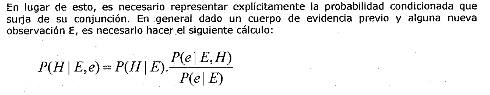

(sec-unit-03-representacion-conocimiento-razonamiento-bajo-incertidumbre)=

## Razonamiento bajo incertidumbre

- 1. Razonamiento simbólico bajo incertidumbre

3.5.1. Razonamiento No Monótono

*Hasta ahora, se han descrito técnicas de razonamiento para un modelo del mundo
completa, consistente e inalterable.* *Desafortunadamente, en muchos dominios de
problemas no es posible crear tales modelos.* Se han propuesto varios marcos
lógicos y métodos computacionales para poder manipular estos problemas. Veremos
dos enfoques:

*( (* • El ***razonamiento no monótono,*** en el cuál *las axiomas via las
reglas de inferencia se extienden para que sea posible razonar con información
incompleta.* Sin embargo, esos sistemas preservan la propiedad de que en un
determinado momento, una sentencia puede pensarse que es cierta, puede pensarse
que es falsa, o puede pensarse que no es ninguna de las dos.

- ***Razonamiento estadístico,*** en el que *se extiende la representación para
  permitir*

*( algún tipo de medida numérica sobre la certeza* (en lugar de simplemente
CIERTO o FALSO) para asociar a cada sentencia.

*r* I Los sistemas convencionales de razonamiento, como la lógica de predicados
de primer orden, están diseñados para trabajar con información que cumple tres
importantes propiedades:

*I* ) • *La información es completa con respecto al dominio de interés.* En
otras palabras, todos los hechos necesarios para resolver el problema o están
presentes• en el sistema o pueden derivarse de ellos mediante reglas
convencionales de la lógica de primer orden.

- *La información es consistente.*

- *La (mica forma en que puede cambiar la información es que se añadan nuevos
  hechos conforme estén disponibles.* Si estos nuevos hechos son consistentes
  con todos los

*: 1* demás hechos que ya se han afirmado, entonces ***ninguno de los hechos
pertenecientes al conjunto que eran ciertos pueden refutarse.*** *Esta propiedad
se denomina* ***monotonía.*** Desafortunadamente, si no se verifica alguna de
estas propiedades, los sistemas de razonamiento basados en la lógica
convencional son inadecuados.

*Los sistemas de razonamiento no monótono, par otro lado, se diseñan para que
puedan resolver problemas en las que quizá no aparezca alguna de estas
propiedades.*

- 1. **Razonamiento por defecto**

Se quiere usar el *razonamiento no monótono* para llevar a cabo lo que
comúnmente se denomina ***razonamiento por defecto.*** **Se *pretende llegar a
unas conclusiones basadas en lo que es más probable que sea cierto.*** En este
apartado se explican dos enfoques para lograrlo.

- Lógica no monótona.

- Lógica por defecto.

A continuación se describen dos clases comunes de razonamiento no monótono que
pueden definirse en estas lógicas:

- Abducción

- Herencia

3.s.1.1.1. lógica no monótona

La *lógica no monótona* es un sistema que *proporciona una base para razonar
por*

***omisión,*** en donde ***el lenguaje de la lógica de predicados de primer
orden* se**

***aumenta con un operador modal M,*** que se lee como *"es consistente".* Por
ejemplo, la fórmula:

*'dx,* y: Parientes(x,y) A M esta_de_acuerdo(x,y) ➔ dependerá(x,y) se lee *"Para
todo x e y, si x* e *y son parientes y si el hecho de que x se haya puesto de*
*acuerdo con y es consistente con el resto de las suposiciones, entonces se
concluye que* *x dependerá a y".* 3.5.1.1.2. lógica por defecto

La ***lógica por defecto*** es una ***lógica alternativa para llevar a cabo
un*** ***razonamiento basado en omisiones*** en la que **se *introduce un nuevo
tipo de reglas de inferencia.*** Este enfoque permite reglas de inferencia de la
forma:

esta regla debe leerse así: *"si A es probable y es consistente asumir B,
entonces se concluye que* C".

Como se puede ver, el propósito es muy similar al de las expresiones no
monótonas que se usaban en la Lógica no monótona. Sin embargo, existen algunas
***diferencias importantes*** C ***entre las dos teorías.***

- La primera de ellas es que *en la Lógica por defecto, las nuevas reglas de
  inferencia se usan* •*coma base para· calcular un con;unto de extensiones.
  plausibles de la base de conocimiento.* Cada extensión se corresponde con una
  extensión consistente máxima de

la base de conocimiento. La lógica entonces admite como teorema cualquier
expresión válida en alguna extensión. Si es necesario decidirse entre las
extensiones para poder resolver el problema, debe proporcionarse algún otro
mecanismo.

- Una segunda diferencia importante entre estas dos teorías es que *en la Lógica
  por* *defecto, las expresiones no monótonas son reglas de inferencia en lugar
  de expresiones* *del lenguaje. Es decir, no pueden manipularse mediante otras
  reglas de inferencia.* Esto conduce a algunos resultados no esperados. Por
  ejemplo, dadas las dos reglas:

**A:B.A:B**

sin ninguna aserción sobre A, no se puede llegar a ninguna conclusión sobre B,
ya que no se aplica ninguna regla de inferencia.

**Abducción**

La lógica estándar lleva a cabo deducciones. Dados dos axiomas:

'dx: A(x) ➔ B(x)

Puede concluir que B(C) por deducción.

Pero Qué ocurre si se toma la implicación al revés? Por ejemplo, suponga que el
axioma dado es:

'dx: Sarampión(x) ➔ Manchas(x) El axioma dice que si se tiene sarampión esto
implica que aparecen manchas rojas.

Pero suponga que lo que se observa son las manchas rojas. Podría ser bueno
concluir que se tiene un sarampión. Pero esta conclusión no esta permitida por
las reglas de la lógica estándar y aunque puede ser incorrecto, es posible que
sea la mejor suposición que pueda hacerse. • *La derivación de conclusiones de
esta forma es otra manera de razonamiento par defecto.* Denominamos a este
método ***razonamiento par abducción.*** El proceso de razonamiento por
abducción puede describirse con más precisión de la siguiente forma, *"Dadas dos
fbf (A* ➔ *BJ y (BJ, para cualquier expresión A y B, si es consistente asumir A,
hacerlo".* El razonamiento abductivo no es un tipo de lógica del estilo de la
Lógica por defecto y la Lógica no monótona. En realidad, puede describirse sobre
cualquiera de ellas.

**Herencia**

El razonamiento no monótono se utiliza con mucha frecuencia en·la herencia de
los valores de los atributos desde la descripción prototipo de una clase hacia
las entidades individuales que pertenecen a la clase.

- 1. Razonamiento minimalista

Hasta ahora se ha hablado sobre métodos generales que proporcionan formas de
describir cosas que son ciertas en general. Ahora se muestran métodos para
referirse a un tipo muy específico y útil de cosas que son ciertas en general.

Estos métodos se basan en *alguna variante de la idea de modelo mínima.* Aunque
existen algunas definiciones diferentes sobre que constituye un modelo mínimo,
para nuestro propósito se dirá que ***un modelo* es *mínima si no existen otros
modelos en las que sean***. ***ciertas menos cosas.*** La idea que hay detrás
del uso de *modelos mínimos* como base para el *razonamiento no monótono sobre
el mundo* es la siguiente:

**"Existen muchas menos sentencias ciertas que falsas.** Si algo es relevante y
cierto, tiene sentido asumir que pertenece a nuestra base de conocimiento. Por
lo tanto, asuma que las únicas sentencias ciertas son aquellas que
necesariamente deben ser ciertas para que se mantenga la consistencia de la base
de conocimiento".

- - 1. **La suposición de un mundo cerrado**

*La suposición de un mundo cerrado sugiere una sencilla forma de razonamiento
minimalista.* La suposición de un mundo cerrado dice que *las (micas objetos que
satisfacen un predicado P son aquellos que deben hacerlo.* La suposición de un
mundo cerrado es particularmente poderosa como base para razonar con bases de
datos, Jas CUilles se asume que son completas con respecto a las propiedades que
describen.

Por ejemplo, se puede asumir sin peligro alguno que una base de datos sobre
personal puede listar todos los empleados de una empresa. Si alguien pregunta si
Gomez trabaja para la empresa, se puede responder *"no"* a no ser que aparezca
explícitamente en la lista como un empleado.

Aunque *la suposición de un mundo cerrado* es a la vez sencilla y poderosa,
*puede dar* errores en la generación de respuestas apropiadas,\* ya que esta
suposición no es siempre cierta en el mundo; algunas partes del mundo no son
realmente *''posibles de* *cerrar".* Esto *se* observa cuando se sacan
conclusiones sobre ciertos hechos y luego se introducen nuevos hechos, que no
estaban presentes con anterioridad en la base de conocimiento. La suposición de
un mundo cerrado producirá resultados apropiados exactamente en la misma medida
en que sea cierta la suposición de que todos los hechos positivos relevantes
están presentes en la base de conocimiento.

Aunque la suposición de un mundo cerrado captura parte de la idea de que algo
que no debe ser necesariamente cierto debería ser asumido como falso, no la
captura toda.

Posee dos limitaciones esenciales:

- Opera sobre predicados individuales sin considerar las interacciones entre los

predicados definidos en la base de conocimiento.

- Asume que todos los predicados tienen listadas todas sus instancias. Para
  manipular estos problemas, se han propuesto distintas teorías sobre la
  ***circunscripción.*** En todas estas teorías, **se *añaden nuevos axiomas a
  la base de conocimiento existente.*** El efecto de estos axiomas consiste en
  *forzar una interpretación mínima sobre una*

*parte seleccionada de la base de conocimiento.* En particular, cada axioma
específico describe una forma de delimitar (es decir, de circunscribir) el
conjunto de valores para los que un axioma particular de la teoría original sea
cierto. Suponga, como ejemplo, que se tiene la sencilla aserción:

'ix: Adulto(x) A AB(x, aspecto) ➔ Sabe_leer(x) Nos gustaría circunscribir AB,
puesto que nos gustaría aplicarlo únicamente a aquellos individuos a los que se
¿es aplica.

En definitiva, lo que queremos hacer es decir algo, lo que debe ser el predicado
AB.

Para saber de que se trata, es necesario conocer para que valores se hace
cierto.

- 1.:1..3. Cuestiones sobre Ba implementación

Es importante tener en cuenta que no hay una correspondencia exacta entre las
lógicas que se han descrito y las implementaciones que se van a explicar. Las
técnicas de implementación de Razonamiento No Monotone se pueden dividir en dos
clases, dependiendo del enfoque que se da al problema del control de la
búsqueda:

- ***Primera.en profundidad,*** en la que se sigue un único camino, el más
  prometedor,

hasta que surge alguna parte de conocimiento que fuerza a abandonar este camino
e intentar otro..

- ***Primera en anchura,*** en donde se consideran igual de prometedoras todas
  las posibilidades. Todas ellas se consideran como un grupo, y se van
  eliminando algunas de ellas conforme se dispone de nuevos hechos. A veces
  puede ocurrir que solo uno de

ellos o un número muy pequeño) resulte ser consistente con todo lo demás que se
conoce.

La resolución de un problema puede hacerse mediante un razonamiento hacia
delante o mediante un razonamiento hacia atrás. La resolución de un problema que
utiliza conocimiento incierto no es una excepción. Como consecuencia de todo
esto se pueden definir dos enfoques:

- ***Razonar hacia delante a partir de lo que* se *conoce.*** Las conclusiones
  que se derivan de forma no monótona se manipulan de la misma forma que las que
  se derivan

de forma monótona. Los sistemas de razonamiento no monótono que soportan este
tipo de razonamiento permiten que las reglas estándar de encadenamiento hacia
delante se extiendan con cláusulas ***a-no-ser-que,*** que proporcionan la base
del razonamiento por defecto. El control (incluyendo la elección de la
interpretación por defecto) se trata de la misma forma que todas las demás
decisiones de control que realiza el Sistema.

- ***Razonar hacia atrás para determinar si alguna expresión P* es *cierta*** (o
  quizá

para encontrar un conjunto de vínculos entre las variables que hacen que sea
cierto).

Los sistemas de razonamiento no monótono que soportan este tipo de razonamiento
pueden proporcionar alguna o todas de las siguientes características:

- Que permita cláusulas por defecto (a-no-ser-que) en las reglas hacia atrás.

- Que soporte algún tipo de debate en el que se intente producir argumentos

tanto a favor de P como en su contra.

- - 1. Implementación búsqueda primero en profundidad

**Vuelta atrás dirigida por dependencias**

Si se usa un enfoque primero en profundidad para el razonamiento no monótono,
probablemente ocurrirá lo siguiente: necesitamos conocer un hecho, F, el cuál no
puede derivarse monótonamente a partir de lo que ya se conoce, pero sí puede
derivarse haciendo alguna suposición A que parezca plausible. Así, una vez hecha
la suposición A, se deriva F y entonces a partir de F se derivan los hechos
adicionales G y H. Mas tarde derivamos otros hechos M y N, aunque completamente
independientes de A y F. Un poco más tarde, aparecen nuevos hechos que invalidan
A.

Es necesario anular nuestra prueba de F, además de las de G y H ya que dependen
de F. Pero qué pasa con M y N? No dependen de F, por lo que no es lógico que
deban invalidarse. Pero si se usa una vuelta atrás convencional, debe volverse
hacia atrás en las conclusiones conforme estas han sido derivadas. Por lo tanto,
en la vuelta atrás se llega a M y N, por lo que se deshacen, con el fin de
llegar a F, G, H y A.

Para empezar a tratar este problema, es necesaria una noción completamente
diferente de la vuelta atrás, que debe basarse en las ***dependencias lógicas***
en lugar de en el orden cronológico en que se produjeron las decisiones. A este
nuevo método lo denominamos ***vuelta atrás dirigida por dependencias,*** en
contraste con el de *vuelta atrás cronológica* que se ha usado hasta ahora.

Antes de entrar en detalle en el funcionamiento de la vuelta atrás dirigida por
dependencias, merece la pena indicar que aunque una de sus grandes motivaciones
es el tratamiento del razonamiento no monótono, resulta útil también en los
programas de búsqueda convencionales. Esto no es demasiado sorprendente si se
considera que un programa de búsqueda primero en profundidad crea una nueva rama
en el espacio de búsqueda una vez hecha alguna estimación "no muy precisa" sobre
algo..Si eventualmente la rama es inadecuada, entonces se sabe que al menos una
de.las estimaciones que se han hecho era incorrecta. Esta estimación podría
estar a lo largo de la rama. • En la vuelta atrás cronológica se asume que se
trata de la suposición que se ha hecho más recientemente, por lo que se vuelve a
ese punto para intentar alguna otra alternativa. Sin embargo, en ocasiones se
dispone de información adicional que ayuda a encontrar la estimación incorrecta.
Entonces, sería adecuado retractarse únicamente de esa estimación y dejar
intacto todo lo demás que hubiera sucedido hasta entonces. Esto es exactamente
lo que hace la vuelta atrás dirigida por dependencias.

Si se quiere usar una vuelta atrás dirigida por dependencias, es necesario
realizar las siguientes acciones:

- Asociar a cada nodo una o más justificaciones. Cada justificación se
  corresponde con un proceso de derivación que con.produce al nodo. (Como es
  posible que un nodo se derive de distintas formas, debe permitirse la
  posibilidad de que existan múltiples justificaciones). Cada justificación debe
  contener una lista con· todos los nodos (hechos, reglas, suposiciones) de los
  que depende la derivación. •

- Proporcionar un mecanismo que cuando se produzca una contradicción entre el
  nodo y su justificación genere el conjunto "malas" de suposiciones gue están
  debajo de la justificación. El conjunto "malas" se define como el mínimo
  conjunto de suposiciones tales que si se elimina algún elemento de este
  conjunto, la justificación no será más válida y el nodo inconsistente deja de
  ser creíble.

- Proporcionar un mecanismo gue considere el conjunto "malas" y elija una
  suposición para retirar. • •

- Proporcionar un mecanismo gue propague el resultado de la retirada de una
  suposición. Este mecanismo debe convertir en inválidas todas las
  justificaciones que dependan, aunque sea indirectamente, de la suposición
  retirada.

**Sistemas de mantenimiento de la verdad basados en justificaciones (JTMS)**

La idea de un sistema de mantenimiento de la verdad (truth maintenance system) o
TMS surge como una forma de proporcionar la habilidad de trabajar con una vuelta
atrás dirigida por dependencias para poder soportar el razonamiento no monótono.

Un TMS *permite conectar las aserciones mediante una red de dependencias del
tipo* *hoja de cálculo.* Un JTMS o Sistema de mantenimiento de la verdad basado
en Justificaciones, *no conoce nada sobre la estructura de las aserciones en sí
mismas.* El (mico papel del sistema es servir como libro de anotaciones para un
sistema de resolución de problemas, que a su vez, le *proporciona tanto las
aserciones coma las* *dependencias entre las aserciones.*

**Sistemas de mantenimiento de la verdad basados en la lógica (LTMS)**

Un LTMS, Sistema de mantenimiento de la verdad basado en la Lógica es muy
similar a un JTMS. Pero se diferencia en un aspecto importante.

En un JTMS, el TMS trata los nodos de la red como átomos, lo cuál significa que
*no hay* *relaciones entre ellas* excepto aquellas que se sitúan explícitamente
en las justificaciones. En particular, un JTMS no tiene problemas en etiquetar
simultáneamente a Py,P. *No se detectara una contradicción de forma automática.*
En un LTMS, por otro lado, *se pueden detectar contradicciones de este tipo*
*automáticamente.*

- - 1.. Implementación búsqueda primero en anchura

**Sistemas de mantenimiento de la verdad basados en Suposiciones (ATMS)**

Una forma alternativa de implementar el razonamiento no monótono lo constituyen
los Sistemas de mantenimiento de la verdad basados en Suposiciones (ATMS)
(Assumption-based truth maintenance systems). Tanto en un JTMS como en un LTMS
se sigue una única línea de razonamiento en cada momento, y cuando es necesario
cambiar las suposiciones del sistema, surge una vuelta atrás dirigida por
dependencias.

***En un ATMS,* se *mantienen en paralelo varies caminos alternativos. La
vuelta***

***atrás* se *evita a expensas del mantenimiento de múltiples contextos, cada
uno***

***de los cuales* se *corresponde con un conjunto de suposiciones
consistentes.***

En los sistemas basados en ATMS, al evolucionar el razonamiento, *el universo de
contextos consistentes va podándose conforme se detectan contradicciones.* Los
contextos consistentes que quedan se usan para etiquetar las suposiciones, de
forma que indiquen el contexto en el que cada aserción tiene una justificación
válida. Las aserciones que no tienen una justificación válida en algún contexto
consistente se pueden podar por consideración del resolutor del problema.
Conforme el conjunto de contextos consistentes se va haciendo cada vez más
pequeño, el conjunto de aserciones que el resolutor de problemas puede creer de
forma consistente, se reduce.

Esencialmente, mientras que un sistema ATMS funciona en anchura, considerando
todos los posibles contextos a la vez, los sistemas JTMS y LTMS funcionan en
profundidad.

1., Razonamiento Estadístico

Hasta ahora, se han descrito varias técnicas de representación que pueden
utilizarse para modelar los sistemas de creencias en los que, en un momento
dado, o se determina que un hecho en particular es o bien cierto o bien falso, o
no se hace ninguna consideración al respecto.

En algunas resoluciones de problemas, sin embargo, puede resultar adecuado
***describir las creencias sobre las que no se tiene certeza,*** pero en las que
***existen algunas evidencias que las apoyan.*** Considere este tipo de
problemas divididos en dos grupos:

- El primero de ellos esta formado por *problemas en los que* se *da una cierta
  aleatoriedad.* Los juegos de cartas como el bridge o el blackjack son dos
  buenos ejemplos de este tipo de problemas. A pesar de que en estos problemas
  no es posible hacer una predicción sobre el mundo con absoluta certeza, si se
  dispone de conocimiento sobre las probabilidades de los distintos resultados,
  y sería deseable poder utilizar dicho conocimiento.

- El segundo tipo de problemas podría, en principio modelarse mediante las
  técnicas descritas en el capítulo anterior. *En estos problemas, el mundo no*
  es *aleatorio, sino que* se *comporta "normalmente" hasta que surge algún tipo
  de excepción.* La dificultad estriba en el hecho de que son muchas las
  posibles excepciones que se pueden producir, y deben enumerarse explícitamente
  (usando técnicas como AB y A-NO-SER-QUE). La mayoría de las tareas catalogadas
  como de sentido *com(m* pertenecen a este tipo de problemas, por ejemplo el
  razonamiento experto involucrado en los diagnósticos médicos. Para este tipo
  de problemas, puede ser muy útil algún tipo de medida estadística tal como las
  funciones que logran hacer un resumen del mundo. En lugar de tener que
  enumerar todas las posibles excepciones que se pueden producir, es mejor
  utilizar un resumen numérico que indique la frecuencia con la que es de
  esperar que aparezca una excepción de un cierto tipo.

**La probabilidad y el Teorema de Bayes**

En muchos sistemas de resolución de problemas un objetivo importante consiste en
reunir evidencias sobre la evolución del sistema y modificar su comportamiento
sobre la base de las mismas. *Para modelar este comportamiento* se *necesita una
teoría estadística de la evidencia.* *Las estadísticas bayesianas constituyen
esta teoría.* El concepto fundamental de las estadísticas bayesianas es el de la
probabilidad condicionada:

**P(HIE)**

La expresión anterior se lee como sigue: *la probabilidad de la hipótesis H dado
que se observe la evidencia E.* Para calcularla, es necesario tener en cuenta la
*probabilidad previa de H* (la probabilidad que se le asignaría a H si no existe
evidencia) y la parte en la que *E proporciona evidencia de H.* Para lograrlo,
es necesario definir un universo que contenga un conjunto exhaustivo y
mutuamente excluyente de **H**;, entre los que se intenta discriminar.

Sea,

**P(H;I E)** = la probabilidad de que la hipótesis H; sea verdad dada la
evidencia E.

**p(e Ih;)** = la probabilidad de que se observe la evidencia E dada la
hipótesis i como verdadera.

**P(H;)** = la probabilidad a priori de que la hipótesis i sea cierta,
independientemente de cualquier evidencia especifica. Estas probabilidades se
denominan probabilidades previas o a priori.

**K** = el número total de posibles hipótesis.

El teorema de Bayes se enuncia así:

Suponga, por ejemplo, que se esta interesado en examinar la evidencia geológica
de un lugar concreto para determinar si sería un buen lugar para hacer una
excavación y encontrar un cierto mineral.

Si se conocen las probabilidades previas de aparición de cada uno de los
minerales y también se conocen las probabilidades de que si un mineral aparece,
entonces se observen ciertas características físicas, entonces puede utilizarse
la fórmula de Bayes para calcular, a partir de las evidencias que se reúnan, la
probabilidad de que aparezcan los distintos minerales.

En realidad esto es lo que se hace en el programa **PROSPECTOR,** el cuál se ha
usado con éxito como ayuda a la localización de depósitos de distintos
minerales, incluyendo cobre y uranio.

La clave para poder utilizar el teorema de Bayes como base para razonar bajo
incertidumbre consiste en ***saber exactamente que* es *lo que dice.***
Específicamente, cuando se dice P(AI B) se esta describiendo *la probabilidad de
A condicionada a que la {mica evidencia que* se *tiene es 8.* Si existe otra
evidencia relevante, debe considerarse también. Suponga, por ejemplo, que se
esta resolviendo un problema de diagnóstico médico.

Considere las siguientes afirmaciones:.

S: el paciente tiene manchas rojas,

M: el paciente tiene sarampión,

F•: el paciente tiene fiebre alta.

Sin otra evidencia adicional, la presencia de manchas rojas sirve como evidencia
de sarampión. La evidencia de la fiebre también sirve, ya que el sarampión suele
provocar fiebre. Pero suponga que ya se sabe que el paciente tiene sarampión. En
este caso, la evidencia adicional de que tiene manchas rojas en la piel no nos
dice nada sobre la probabilidad de que tenga fiebre. Alternativamente, tanto las
manchas rojas como la fiebre, por separado, constituirían una evidencia a favor
del sarampión.

***Si* se *presentan las dos cosas,* es *necesario tenerlas ambas en cuenta
para***

***calibrar el peso total de la evidencia.***

***Sin embargo, como las manchas y la fiebre no son síntomas independientes,***

***no pueden sumarse sus efectos.***

En lugar de esto, es necesario representar explícitamente la probabilidad
condicionada que surja de su conjunción. En general dado un cuerpo de evidencia
previo y alguna nueva observación E, es necesario hacer el siguiente cálculo:

*P(H* IE *e)* = *P(H* IE).*P(e* I *E,H)*

. ' *P(el E)*

Desafortunadamente, en un mundo arbitrariamente complejo, el tamaño del conjunto
de probabilidades combinadas que se necesitan para calcular esta función, crece
como una función de la forma 2°, donde n es el número de proposiciones
diferentes que es necesario considerar.

Esto hace que el teorema de Bayes sea inaplicable por diversos motivos:

- El problema de la adquisición de conocimiento es inabarcable. Son necesarias
  demasiadas probabilidades. Ademas de esto, existe la evidencia empírica
  sustancial de que las personas son malas estimadoras de probabilidades.

- El espacio que se necesitaría para almacenar todas las probabilidades es
  demasiado grande.

- El tiempo empleado en calcular las probabilidades es demasiado grande.

A pesar de todos estos problemas, las estadísticas bayesianas proporcionan una
base atractiva para los sistemas que razonan bajo incertidumbre. Como resultado
de todo esto, se han desarrollado distintos mecanismos que hacen uso de su
potencialidad, pero que al mismo tiempo hacen que sea tratable. En el resto de
este capítulo, se explican tres de estos mecanismos:

- Incorporación de factores de certeza a las reglas.

- Redes bayesianas.

- Teoría de Dempster-Shafer
