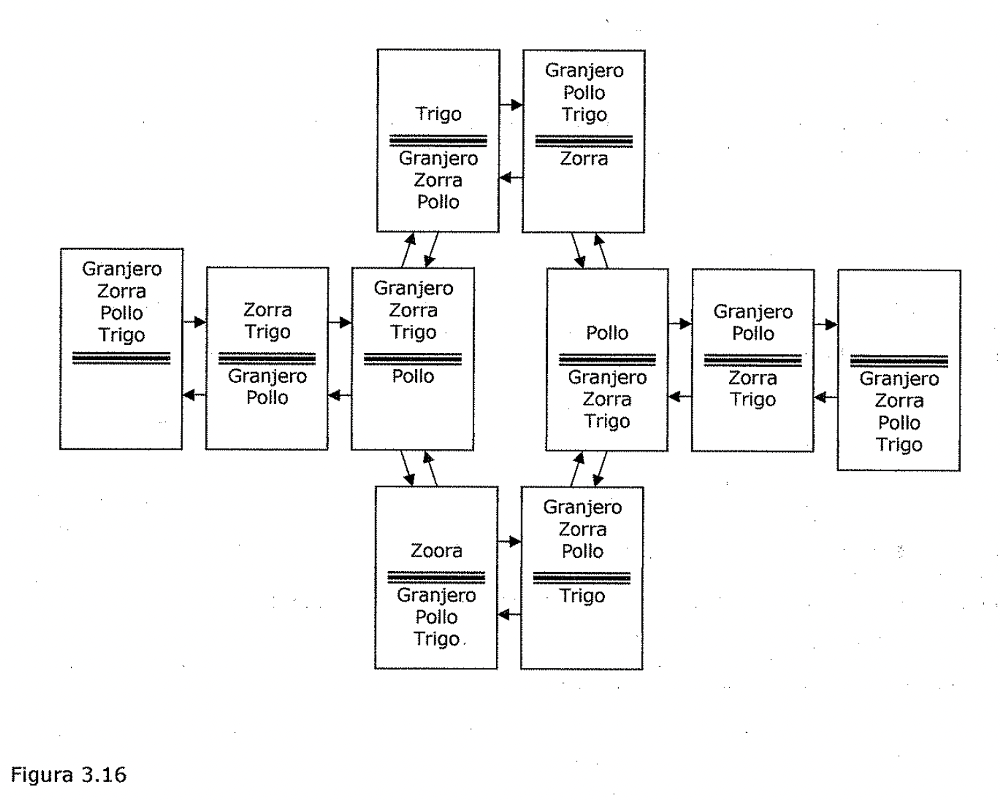

(factores-de-certeza)=

# Factores de certeza

(factores-de-certeza-y-sistemas-basados-en-reglas)=

## Factores de certeza y sistemas basados en reglas

En esta sección se describe una forma practica de compromiso sobre un sistema
bayesiano puro.

El enfoque.que se va a explicar surgió en el sistema **MYCIN,** en el cuál se
intenta recomendar las terapias apropiadas para pacientes con infecciones
bacterianas. El sistema interactúa con el. médico en la adquisición de los datos
clínicos necesarios. MYCIN es un ejemplo de un ***sistema experto,*** debido a
que realiza tareas que normalmente se encomiendan a un experto humano.

Este sistema se basa en el ***uso de razonamiento probabilístico.*** MYCIN
representa la mayor parte de su conocimiento sobre diagnósticos en forma de un
***conjunto de reglas.*** ***A cada regla* se *le asocia un factor de certeza,
que representa una medida sobre la evidencia que existe de que la conclusión*
sea *el consecuente de la regla en el caso de que* se *describa el antecedente
de la misma.*** Una regla de MYCIN típica se parecería a esta:

**Si: (1) la cepa del organismo es gram-positivo, y**

1. **la morfología del organismo es coco, y**

1. **los organismos crecen de forma arracimada, entonces hay una buena
   probabilidad (0.7) de que**

**el organismo sea un staphylococcus.**

MYCIN utiliza las reglas para hacer un ***razonamiento hacia atrás*** de los
datos clínicos disponibles ***a partir del objetivo*** de encontrar organismos
significativos causantes de enfermedades. Una vez que encuentra la identidad de
tales organismos intenta seleccionar una terapia para tratar la enfermedad. Para
poder comprender la forma en la que MYCIN utiliza información incierta, debe
responderse a dos cuestiones: *"i.Cuál es el significado de los factores de
certeza?"* y *"i.Cómo combina MYCIN las estimaciones sobre la certeza de cada
una de las reglas para hacer una estimación de la certeza de sus conclusiones?'*
Debe también responderse a otra cuestión que surge de la ya descrita
intratabilidad del razonamiento puramente bayesiano, que es: *"i.Que compromisos
se realizan en la técnica MYCIN y que riesgos llevan asociados?".* En el resto
de esta sección se responde a todos estos interrogantes.

Comencemos con una sencilla respuesta a la primera de las preguntas (a la que se
volverá más tarde para dar una respuesta más detallada).

Un factor de c:certeza (FC[h,e]) se define en términos de dos componentes:

- MB[h,e], Una medida Centre O y 1) de la *creencia* de que la hipótesis h
  proporciona la

evidencia e. MB da una medida sobre hasta que punto la evidencia soporta la
hipótesis.

Es cero si la evidencia no soporta la hipótesis.

- **MD[h,e].** Una medida Centre O y 1) sobre la ***incredulidad*** de que la
  hipótesis h proporciona la evidencia e. MD da una medida de hasta que punto la
  evidencia soporta

la negación de la hipótesis. Es cero si la evidencia soporta la hipótesis.

A partir de estas dos medidas, se puede definir el factor de certeza como sigue:

**FC[h,e] = MB[h,e] - MD[h,e]**

En cada regla basta un único número para definir tanto el valor de MB como el de
MD, y por lo tanto, también el de FC, ya que *cada regla de MYCIN se corresponde
como una parte de la* *evidencia y cada parte de la evidencia o bien soporta o
bien niega una hipótesis (pero nunca* *ambas cosas).* ***Los factores* de
*certeza* de *las reglas de MYCIN los proporcionan los expertos que***

***escriben las reglas.***

Reflejan las valoraciones del experto sobre la fortaleza con que la evidencia
soporta la hipótesis. *Sin embargo, en el proceso de razonamiento de MYCIN, los
factores de certeza* *tienen que combinarse para reflejar el* uso *de las
múltiples partes de la evidencia y las* *múltiples reglas que* se *aplican para
resolver el problema.* La Figura 3.15 ilustra tres formas de combinación que es
necesario considerar. En la Figura 3.15Ca), todas las reglas proporcionan la
evidencia que relaciona una única hipótesis. En la Figura 3.15Cb), es necesario
considerar nuestra creencia como una colección *f"* de distintas proposiciones
tomadas juntas. En la Figura 3.15Cc), la salida de una regla proporciona la
entrada de la siguiente.

1. *Que fórmulas deberían utilizarse para plasmar estas combinaciones?* Antes de
   responder a

esta cuestión, es necesario primero describir algunas propiedades que sería
adecuado que cumplieran las funciones de combinación:

Las funciones de combinación deberían ser conmutativas y asociativas, ya que el
orden en el que se reúnen las evidencias es arbitrario.

Hasta que no se alcance la certeza, las evidencias adicionales que confirman
deben incrementar MB CY de forma similar, con las evidencias que restan
confirmación y MD).

Si las inferencias inciertas se encadenan juntas, el resultado debe ser de menor
certeza que cada una de las inferencias por separado.

Ca) Cb) Cc)

Figura 3.15

1. Si se supone que todas estas propiedades son deseables, considere en primer
   lugar la Figura 3.¿S(a), en la que ***varias partes de evidencia se combinan
   para determinar el factor de certeza de una hipótesis.*** Las medidas sobre
   la creencia o no creencia de una hipótesis dadas dos observaciones s1 y s2 se
   calculan de la siguiente forma:

**si MD\[h, s1** " **s2\] = 1 en caso contrario**

**si MB[h, s1 " s2] = 1 en caso contrario**

Una forma de plasmar estas fórmulas en castellano consiste en que la medida
sobre la creencia en h es 0 si no se cree en h con certeza.

En caso contrario, la medida sobre la creencia en h, dadas dos observaciones, es
la medida sobre la creencia dada solo por una observación más algún incremento
debido a la segunda observación. Este incremento se calcula tomando primero la
diferencia entre 1 (certeza) y la creencia dada por la primera observación. Esta
diferencia es la mayor que puede añadir la segunda observación. La diferencia se
escala mediante la creencia sobre h dada solo la segunda observación.

De forma similar puede darse una explicación parecida para la fórmula que
calcula la incredulidad.

A partir de MB y MD, puede calcularse FC. Notese que si se unen varias fuentes
de corroboración de la evidencia, el valor absoluto de FC se incrementa. Si se
introduce una evidencia conflictiva, el *valor* absoluto de FC disminuye.

*Un sencillo ejemplo muestra como operan estas funciones.* Suponga que se tiene
una. *!* observación inicial que confirma nuestra creencia en h con MB= 0.3.
Entonces MD[h, s1] = Oy FC[h, s1] = 0.3. A continuación se hace una segunda
observación que confirma h con un valor de MB[h, s2] = 0.2. • Entonces:

MB[h, 51 A 52] =0.3 + 0.2. 0.7

MD[h, S1 A 52] = 0.0

FC[h, s, A 52] = 0.44

En este ejemplo se observa como una evidencia que tan solo sirve para apoyar
levemente una cierta suposición, puede acumularse y producir incrementos mayores
en los factores de certeza.

1. Considere ahora la Figura 3.¿S(b), en donde es necesario calcular el
   ***factor de certeza de una combinación de hipótesis.*** En particular, esto
   es necesario cuando se necesita conocer el factor de certeza de un
   antecedente de una regla que contiene varias cláusulas (como, por ejemplo, en
   la regla del estafilococo). El cálculo de la combinación de factores de
   certeza puede hacerse a partir de MB y MD.

Las fórmulas que usa MYCIN para la conjunción y disyunción de dos hipótesis son:

**MB[h1 v h2,e] = max{MB[h1, e], MB[h2, e]) MD se calcula de forma análoga.**

1. Finalmente considere la Figura 3.¿S(c), en donde ***las reglas* se *encadenan
   de forma que*** \*\**el resultado de la incertidumbre que sale de una regla*
   es

*la entrada de la otra.*\*\* La solución para este problema también tendrá en
cuenta el caso en el que tenga que asignarse a

las entradas iniciales una medida sobre su incertidumbre.

Este caso podría darse fácilmente en aquellas situaciones en donde la evidencia
es el resultado de algún experimento o algún test de laboratorio, de forma que
los resultados no son C completamente exactos. En estos casos, el factor de
certeza de la hipótesis debe tener en cuenta tanto la intensidad con la que la
evidencia parece indicar la hipótesis como el nivel de confianza en la
evidencia.

MYCIN define el encadenamiento de reglas como sigue. Sea MB' [h,s] la medida de
la creencia sobre h estando completamente segura la validez de s. Sea e la
evidencia que nos lleva a creer en s (por ejemplo, las lecturas de los
instrumentos del laboratorio o los resultados de aplicar otras reglas).

Entonces:

Como en MYCIN los factores de certeza iniciales son estimaciones que
proporcionan los expertos que escriben las reglas, no es realmente necesario dar
una definición más precisa del significado de FC aparte de la ya mencionada.

(redes-bayesianas)=

## Redes bayesianas

Los Factores de Certeza representan un mecanismo de reducción de la complejidad
de los sistemas de razonamiento bayesiano mediante la realización de algunas
aproximaciones del formalismo.

*Las* ***Redes Bayesianas*** *constituyen un enfoque alternativo al de factores
de certeza, C* *en el que el formalismo de razonamiento bayesiano se preserva y*
se *confía en la* *modularidad del mundo que se intenta modelo.* La idea
principal consiste en que para describir el mundo real no es necesario utilizar
una tabla de probabilidades enorme en la que se listen las probabilidades de
todas las combinaciones concebibles de sucesos.

La mayoría de los sucesos son condicionalmente independientes de la mayoría de
los demás, por lo que no deben considerarse sus interacciones (y por lo tanto no
se necesitan calcular todas las probabilidades).

**En lugar de esto, se *puede usar una representación más local en donde* se**

***describen grupos de sucesos que interactúen.***

(teoria-de-dempster-shafer)=

## Teoría de Dempster-Shafer

Hasta ahora se han descrito diversas técnicas de forma que en todas ellas se
consideraban proposiciones individuales y se asignaba a cada una de ellas una
estimación (es decir, un único número) del grado de creencia que se garantizaba
dada la evidencia.

En este apartado, se considera una técnica alternativa denominada ***Teoría de
Dempster-***

***Shafer.*** *(.*

*Este nuevo enfoque considera conjuntos de proposiciones y les asigna a cada uno
de ellos un (* *intervalo:* con el que debe indicarse el grado de creencia.
***La creencia*** (que normalmente se denota por Bel, belief) mide ***la fuerza
de la evidencia a favor de un conjunto de proposiciones.*** El rango va de O
(que indica evidencia nula) a 1 (que denota certeza).

La verosimilitud (Pl, plausibility) se define como:

**Pl(s) = 1 - Bel(-.s)**

Su rango también va desde 0 hasta 1 y ***mide el alcance con que la evidencia a
favor de***

***-.s deja espacio para la creencia en s.***

En particular, si se tiene evidencia cierta a favor de,s, entonces Bel(,s) es 1
y Pl(s) es O. Lo anterior también indica que el único posible valor Bel(s) es o.
• *El intervalo creencia-verosimilitud que* se *ha definido mide no solo el
nivel de creencia sobre algunas proposiciones, sino también la cantidad de
información que se tiene.* Suponga que se consideran tres hipótesis rivales: A,
B y C. Si no se tiene información, para cada una de ellas se dice que la
probabilidad de que sean ciertas está en el rango [0,1].

Conforme se acumula evidencia, el intervalo va estrechándose, representando el
incremento de confianza con que se sabe la probabilidad de cada hipótesis. Esto
contrasta con el enfoque bayesiano puro, en donde probablemente se empezaría por
asignar las probabilidades a priori equitativamente entre las hipótesis, de
forma que para cada una de ellas P(h) = 0,33.

Con los intervalos se clarifica el hecho de que no se posee información al
comenzar. En el enfoque bayesiano esto no es así, ya que se podría terminar con
los mismos valores en la probabilidad si se reúnen volúmenes de evidencia de
forma que tomados juntos sugieran que los tres valores aparecen con la misma
frecuencia. Esta diferencia puede resultar importante si una de las decisiones
que necesita hacer el programa consiste en ver si se reúne más evidencia o se
actúa sobre la base de la que ya existe.

Sistemas Semánticos para Representación del Conocimiento

Las buenas representaciones son la clave de una buena resolución de problemas

***En general, una representación es un conjunto de convenciones sobre la
forma***

***de describir un tipo de cosas.***

Una descripción aprovecha las convenciones de una representación para describir
alguna cosa en particular.

El hallar la representación apropiada es una parte fundamental de la resolución
de un problema. Considere, por ejemplo, el siguiente problema para niños:

(el-granjero-la-zorra-el-pollo-y-el-grano)=

### El granjero, la zorra, el pollo y el grano

Un granjero quiere cruzar un rio llevando consigo una zorra silvestre, un pollo
gordo y un saco de granos de trigo. Por desgracia, su bote es tan pequeño que
solo puede transportar una de sus pertenencias en cada viaje. Peor aun, la
zorra, si no se le vigila, se come al pollo, y el pollo, si no se lo cuida, se
come el trigo; de modo que el granjero no debe dejar a la zorra sola con el
pollo o al pollo solo con el trigo. LQue se puede hacer? C Descrito en español,
la resolución del problema se lleva unos cuantos minutos porque es preciso
separar las restricciones relevantes de los detalles irrelevantes. El español no
es una buena representación.

Sin embargo, descrito de manera más apropiada, el problema no toma tiempo alguno
porque se puede trazar una línea del principio al final en la Figura 3.16 de
manera instantánea. El trazado de dicha línea resuelve el problema porque cada
dibujo representa un arreglo seguro para el granjero y sus pertenencias en las
orillas del rio, y cada conexión entre los dibujos representa un cruce válido.
El dibujo es una buena descripción ya que las situaciones permitidas y los
cruces legales quedan claramente definidos y no existen detalles irrelevantes.

Para hacer un diagrama así, primero se construye un nodo por cada forma en que
el granjero y sus tres pertenencias pueden ocupar los dos margenes del rio.
Debido a que el granjero y sus pertenencias pueden encontrarse, cada uno, en
cualquier lado del rfo, existen 21+3 = 16 arreglos, diez de los cuales son
seguros en el sentido de que nadie es comido. Los seis arreglos no seguros
colocan a la zorra, el pollo y el trigo en uno u otro lado, o al pollo y al
trigo en uno y otro lado, o a la zorra y al pollo en uno y otro lado.

El segundo y último paso es dibujar un enlace para cada viaje permitido. Por
cada par ordenado de arreglos existe un enlace que los conecta si y solo si los
dos arreglos cumplen con dos condiciones: primera, el granjero cambia de lado; y
segunda, a lo sumo una de las pertenencias del granjero cambia de lado. Debido a
que existen diez arreglos permitidos, hay 10x9 = 90 pares ordenados, pero solo
20 de ellos satisfacen las condiciones requeridas por los enlaces.

*Es evidente que la descripción nodo y enlace* es *una buena descripción con
respecto al* *problema planteado, ya que resulta fácil de hacer y, una vez que*
se *tiene, el problema resulta* *simple de resolver.* La idea importante que
ilustra este problema es que una buena descripción, desarrollada de acuerdo con
las convenciones de una buena representación, es una puerta abierta para la
resolución del problema; una mala descripción, que utiliza una mala
representación, es un obstáculo que impide la resolución del problema.

Figura 3.16

Granjero Zorra Pollo

Trigo

| --- | --- |

| | Granjero Pollo Trigo |

| Zorra |

***f.1*** ,'

Granjero Zorra Pollo Trigo

Granjero Pollo

Zorra Trigo

Granjero Zorra Pollo Trigo

Zorra Trigo

Granjero Pollo

Granjero Zorra Trigo

Pollo

Granjero Pollo Trigo.

Zoora

Granjero

Zorra Pollo

Trigo

| --- | --- |

| | Granjero Zorra Trigo |

| Pollo |
