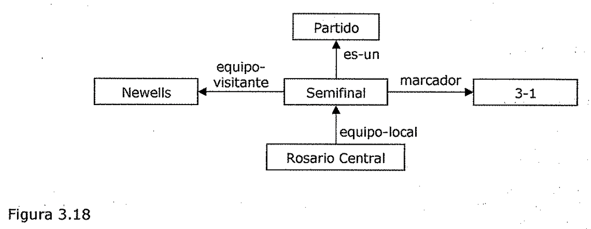
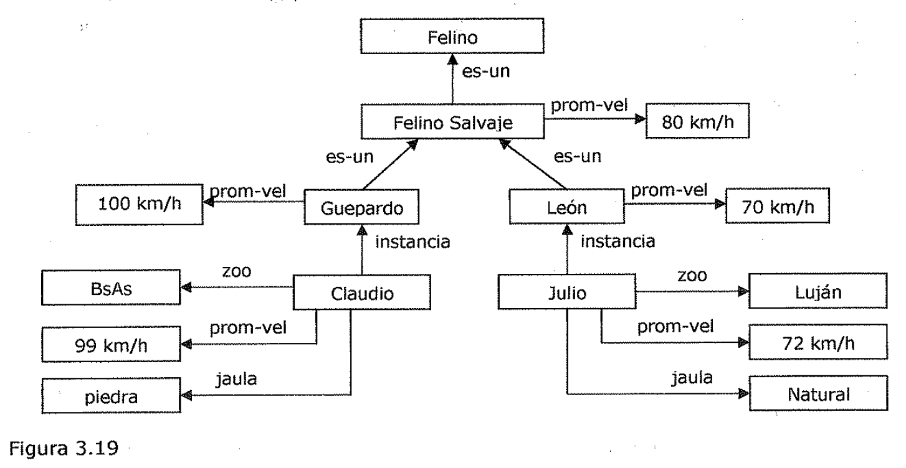
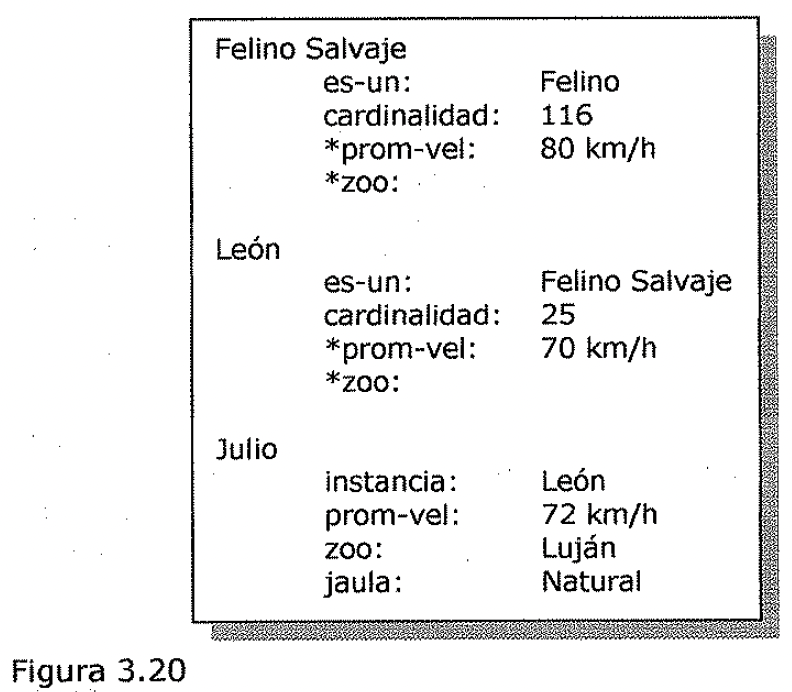

(sec-unit-03-representacion-conocimiento-estructuras-de-ranura-y-relleno-debiles)=

## Estructuras de ranura y relleno débiles

- 1. Estructuras de Ranum y Relleno Debiles

Recuérdese que estas estructuras se introdujeron en un principio como un
dispositivo para soportar adecuadamente la herencia a lo largo de los enlaces
es-un e instancia. Este es un importante aspecto de estas estructuras.

***La herencia monótona* se *puede desarrollar más eficazmente con estas
estructuras***

***que con la lógica pura, y la herencia no monótona puede soportarse muy
fácilmente.***

***La razón por la que la herencia se ejecuta de un modo sencillo, es que en
los***

***sistemas de ranura y relleno el conocimiento esta estructurado como un
conjunto de***

***entidades y todos sus atributos.***

Se describirán dos enfoques de este tipo de estructuras: las redes semánticas
(semantic nets) y los marcos (frames).

Se hablara sobre las propias representaciones, así como sobre las técnicas para
razonar con ellas. De todos modos, no se hablara demasiado acerca del
conocimiento específico que deben contener estas estructuras.!

A estas estructuras de "conocimiento pobre" se ¿es denominaran *"débiles".* En
las estructuras de ranura y relleno *"fuertes"* se establecen mayores
compromisos en relación con el contenido de las representaciones.

3,6.1. Redes Semánticas

La idea principal que hay debajo de las redes semánticas es que la
***información contenida***

***en ellas se representa como un conjunto de nodos conectados unos con otros***

***mediante un conjunto de arcos etiquetados que representan las relaciones
entre los***

***nodos.*** t"

En la Figura 3.17 se muestra un fragmento de una red semántica típica. • Felino
Salvaje

es-un tiene León Garras

instancia

Figura 3.17

Natural

tipo-jaula Julio

zoo Luján

Esta red contiene ejemplos tanto de relaciones es-un como de relaciones
instancia, así como algunas otras relaciones más especificas del dominio como
zoo y tipo-jaula. En esta red se puede utilizar la herencia para derivar la
relación adicional:

**tiene(Julio, Garras)**

**Búsqueda de intersección**

Una de las primeras formas de usar las redes semánticas antiguas fue para
*encontrar* *relaciones entre objetos,* dividiendo la activación a partir de
cada uno de los dos nodos y observando donde se encontraba dicha activación.

Este proceso se llama ***búsqueda de intersección.*** Utilizando este proceso es
posible usar la red de la Figura 3.17 de manera que se puedan responder
preguntas tales como *"iCuál* es *la* *conexión entre Luján y Natural?".* Esta
clase de razonamiento utiliza una de las grandes ventajas de las estructuras de
ranura y relleno sobre las representaciones puramente lógicas, ya que ***tienen
la ventaja de la*** ***organización del conocimiento basado en entidades,*** que
proporcionan las representaciones de ranura y relleno.

Sin embargo, para poder contestar a preguntas más estructuradas son necesarias
redes con una estructuración más alta. En los siguientes apartados se ampliara y
refinara nuestra noción de red para que estas puedan soportar un razonamiento
más sofisticado.

**Representación de predicados no binarios**

Las redes semánticas se pueden considerar como un modo natural de representar
las relaciones que podrían aparecer como instancias de los *predicados binarios*
en la lógica de predicados. Por ejemplo, algunos de los arcos de la Figura 3.17
se podrían representar en lógica como:

**es_un(León, Felino Salvaje) instancia(Julio, León) zoo(Julio, Luján)**

Pero el conocimiento expresado en predicados de mayor aridad, también se puede
expresar en redes semánticas. Ya se ha visto que muchos de los *predicados
unarios* de la lógica se pueden considerar como predicados binarios, utilizando
algunos predicados de propósito muy general, como puede ser es-un e instancia.
Así, por ejemplo, hombre(Marco) se podría reescribir como:

y de este modo se ve que es mucho más fácil hacer la representación en una red
semántica.

Los predicados de *tres o más argumentos* también pueden convertirse a forma
binaria creando un nuevo objeto que represente todo el predicado, y después
introduciendo predicados binarios para describir la relación con este nuevo
objeto de cada uno de los argumentos originales.

Supóngase que se sabe:

Marcador(Rosario Central, Newells, 3-1)

Esto se puede representar en una red semántica creando un nodo que represente el
juego específico, y relacionar después las tres partes de la información con
dicho nodo. La Figura 3.18 muestra la red que surge al hacer esto.

Newells

equipo-visitante Partido

es-un marcador Semifinal 3-1

equipo-local Rosario Central

Figura 3.18

3.6.2. Marcos

***Un marco (frame)*** es ***una colección de atributos, normalmente llamados
ranuras (slots), con valores asociados*** *(y posibles restricciones entre los
valores),* ***que describe*** \\

***alguna entidad del mundo.***

Un marco único, tornado independientemente, no suele ser útil. En lugar de eso
se construyen sistemas de marcos a partir de colecciones de marcos conectados
unos con otros en virtud del hecho de que el valor de un atributo de un marco
puede ser a su vez otro marco.

Felino

es-un -----' promedio-vel es-un Felino Salvaje

es-un 80 km/h

100 km/h

rom-vel Guepardo

instancia .--...\_-promedio-vel León 70 km/h

BsAs

promedio-vel 99 km/h

piedra jaula

Figura 3.19

zoo Claudio

Julio

instancia zoo Luján

promedio-vel 72 km/h

jaula Natural

**Los marcos como conjuntos e instancias** ', La ***teoría de conjuntos***
proporciona una buena base para comprender los sistemas de marcos. Aunque no
todos los sistemas de marcos se definen de este modo, aquí será así. Con este
enfoque, ***cada marco representa, ya una clase (un conjunto), ya una instancia
(un*** ***elemento de la clase).*** Para ver como funciona esto, se considerara
el sistema de marcos • que se muestra en la Figura 3.20, basado en la red
semántica de la Figura 3.19.

Figura 3.20

Feline Salvaje

es-un: cardinalidad:

\*promedio-vel:

**\*zoo:**

León

es-un: cardinalidad:

\*promedio-vel:

**\*zoo:**

Feline 116

80 km/h

Felino Salvaje

70 km/h

Julio

instancia: promedio-vel: zoo: jaula:

León

72 km/h Luján Natural

En este ejemplo los marcos Feline Salvaje y León son todas las clases. El marco
Julio es una instancia.

La ***relación es-un*** que se ha estado utilizando sin una definición precisa,
**es *en realidad la relación subconjunto.*** El conjunto de los Leones es un
subconjunto de los Felinos Salvajes. El conjunto de los Felinos Salvajes es un
subconjunto de los Felinos.

La ***relación instancia*** corresponde con la relación ***elemento-de.*** Julio
es un elemento del conjunto de los Leones. As\[ también es un elemento del
superconjunto de Felinos Salvajes. La transitividad de es-un, que se estudió por
encima en la descripción de herencia de propiedades, deriva directamente de la
transitividad de la relación subconjunto.

Tanto la ***relación es-un,*** como la ***relación instancia,*** tienen
***atributos inversos*** que se denominan ***subclases* y *todas las
instancias.*** Realmente no tiene importancia escribirlos explícitamente en las
instancias, a menos que sea necesario referirse a ellos. Se tendrá en cuenta que
el sistema de marcos los mantiene automáticamente, bien de un modo explícito o
bien calculándolos si es necesario.

Debido a que una clase representa un conjunto, existen dos clases de atributos
que se pueden asociar con esta. Existen atributos acerca del conjunto en sí
mismo, y también atributos para ser heredados por cada elemento del conjunto. Se
indicara la diferencia entre estos dos tipos asociando al segundo un asterisco
(\*). Por ejemplo, la clase de los Leones tiene como cardinal 25 (es decir, hay
25 leones). El atributo promedio-vel es heredado por los i.individuos
pertenecientes a dicha clase, por lo tanto de esta manera se trasladan
propiedades hereditarias desde las superclases hacia sus instancias. El atributo
zoo no tiene valor ingresado por lo cuál se observa que mediante el sistema de
marcos se pueden también definir prototipos.
