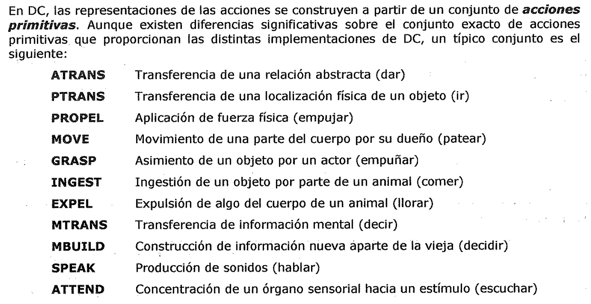
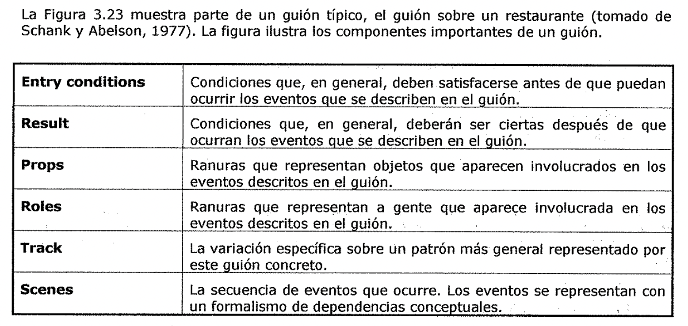

(estructuras-de-ranura-y-relleno-fuertes)=

# Estructuras de ranura y relleno fuertes

*Las redes semánticas y* los *sistemas de marcos implementan estructuras muy
generales para representar el conocimiento.* La Dependencia Conceptual, los
Guiones y los CYC, ***implementan poderosas teorías*** sobre la forma en que los
programas de IA pueden representar y utilizar el conocimiento sobre situaciones
comunes.

(dependencia-conceptual)=

## Dependencia conceptual

***La Dependencia Conceptual {DC)* es *una teoría sobre la representación del
tipo de conocimiento sobre los eventos que normalmente aparecen en las frases de
lenguaje natural.*** El objetivo consiste en representar el conocimiento de
alguna forma que:

- - Facilite extraer inferencias de las frases.

* Sea independiente del lenguaje en el que están las frases originalmente.

Debido a estos dos requisitos, *la representación en DC de una frase no* se
*construye con primitivas que se corresponden con las palabras que aparecen en
la frase, sino* ***con primitivas*** *conceptuales que pueden combinarse para
formar el significado de las palabras en cualquier lenguaje concreto.* Esta
teoría la describió Shank (1973) y se ha implementado en varios programas que
leen y comprenden texto en lenguaje natural.

Al contrario que en las redes semánticas, que proporcionan solo una estructura
en la que pueden situarse nodos que representan información a cualquier nivel,
***la Dependencia Conceptual proporciona tanto una estructura como un conjunto
especifico de primitivas, a un nivel concreto de granularidad,*** en las que
puede construirse representaciones de trozos particulares de información.

La Figura 3.21 muestra un ejemplo sencillo de la forma en que se representa el
conocimiento en DC para la frase

**Yo le di un libro al hombre·**

hombre ATRANS

libro donde los símbolos tienen los siguientes significados:

- Las flechas indican direcciones de la dependencia

- La flecha doble indica los tipos de enlaces entre el actor y la acción

- P indica tiempo pasado

- ATRANS es una de las acciones primitivas utilizadas por la teoría. Indica

transferencia de posesión

- o indica la relación OBJECT CASE

- R indica la relación RECIPIENT CASE

Figura 3.21

En DC, las representaciones de las acciones se construyen a partir de un
conjunto de ***acciones*** ***primitivas.*** Aunque existen diferencias
significativas sobre el conjunto exacto de acciones primitivas que proporcionan
las distintas implementaciones de DC, un típico conjunto es el siguiente:

**ATRANS PTRANS PROPEL MOVE GRASP INGEST EXPEL MTRANS MBUILD SPEAK ATTEND**

Transferencia de una relación abstracta (dar)

Transferencia de una localización física de un objeto (ir)

Aplicación de fuerza física empujar)

Movimiento de una parte del cuerpo por su dueño (patear)

Asimiento de un objeto por un actor (empuñar)

Ingestión de un objeto por parte de un animal (comer)

Expulsión de algo del cuerpo de un animal (llorar)

Transferencia de información mental (decir)

Construcción de información nueva aparte de la vieja (decidir)

Producción de sonidos (hablar)

Concentración de un órgano sensorial hacia un estimulo (escuchar)

Un segundo conjunto de bloques construidos de DC es el conjunto de las
***dependencias*** ***permitidas entre las conceptualizaciones*** descritas en
una frase. Existen cuatro categorías conceptuales primitivas a partir de las
cuales pueden construirse estructuras de dependencias. Estas son:

**ACT** Acciones **pp** Objetos (Productores de imágenes) **AA** Modificadores
de acciones (asistentes de acciones) **PA** Modificadores de PP (asistentes de
imágenes) Ademas, las estructura.ras de dependencia son en sí mismas
conceptualizaciones y pueden servir como componentes de estructuras de
dependencias más grandes.

Las dependencias entre conceptualizaciones se corresponden con las relaciones
semánticas entre los conceptos subyacentes. La Figura 3.22 proporciona una lista
de algunas de ellas. (.

La primera columna contiene las reglas; la segunda contiene ejemplos de su uso,
y la tercera contiene una versión en español de cada ejemplo.

PP ACT

PP PA

Juan PTRANS Juan corrió

Juan doctor Juan es un doctor

ACT'--- pp

Figura 3.22

Juan PROPEL

+---- carrito Juan empujó el carrito

(guiones)=

## Guiones

DC es un mecanismo para representar y razonar sobre eventos. Sin embargo, los
eventos raramente ocurren por separado. En este apartado se presenta un
mecanismo de *representación del conocimiento de secuencias comunes de eventos.*
***Un guión {script) es una estructura que describe una secuencia estereotipada
de eventos en un contexto concreto.*** Un guion esta formado por un conjunto de
ranuras. Asociada a cada ranura puede estar alguna información sobre que tipo de
valores puede contener, así como un valor por defecto que puede usarse si no se
dispone de ninguna otra información. Hasta ahora la definición de un guion
parece muy similar a la de marco. En este nivel de detalle las dos estructuras
son idénticas. Sin embargo, debido al papel especializado que juega un guion,
podemos hacer algunas afirmaciones más precisas sobre su estructura.

La Figura 3.23 muestra parte de un guion típico, el guion sobre un restaurante
(tornado de Schank y Abelson, 1977). La figura ilustra los componentes
importantes de un guion.

| --- | --- |

| **Entry conditions** | Condiciones que, en general, deben satisfacerse antes
de que puedan ocurrir los eventos aue se describen en el guion. |

| **Result** | Condiciones que, en general, deberán ser ciertas después de que
ocurran los eventos aue se describen en el guion. |

| **Props** | Ranuras que representan objetos que aparecen involucrados en los
eventos descritos en el auion. |

| **Roles** | Ranuras que representan a gente que aparece involucrada en los
eventos descritos en el auion. |

| **Track** | La variación específica sobre un patrón más general representado
por este auion concreto. |

| **Scenes** | La secuencia de eventos qué ocurre. Los eventos se representan
con un formalismo de dependencias conceptuales. |

Los guiones resultan útiles porque en el mundo real aparecen *patrones en la
ocurrencia de los eventos.* Estos patrones surgen debido a las relaciones de
causalidad entre los eventos. Los agentes llevaran a cabo una acción de forma
que entonces son capaz::es de realizar otra. *Los eventos que se describen en un
guión forman una gigantesca cadena causal.* El comienzo de la cadena es el
conjunto de condiciones de entrada, las cuales hacen que los primeros eventos
del guion puedan ocurrir. El final de la cadena es el conjunto de resultados los
cuales pueden capacitar posteriores eventos o secuencias de ellos (posiblemente
descritos por otro guion).

Por medio de esta cadena, los eventos se conectan tanto con eventos anteriores
que los hacen posibles, como con eventos posteriores, a los cuales capacita.

Guion: RESTAURANTE

Track: Cafetería Props: Mesas

Menu

C = Comida Cuenta Dinero

Roles: L = Cliente

A= Camarero 0 = Cocinero J = Cajero

P = Propietario

Entry conditions:

L esta hambriento L tiene dinero

Resultados:

L tiene menos dinero P tiene más dinero

L no esta hambriento L esta complacido

opcional) Escena 1: Entrar

L PTRANS Len el restaurante

L ATTEND ojos a las mesas L MBUILD donde sentarse

L PTRANS a la mesa

L MOVE L a la posición sentado

Escena 2: Pedir

Menu en la mesa) (A trae el menú) (L pide el menú)

L PTRANS menú a L L MTRANS seña a A

A PTRANS A a la mesa

L MTRANS 'necesito menú' a A A PTRANS A al menú

\\ A PTRANS A asa \\ A TRANS menú a L L MTRANS A a la mesa

\* L MBUILD elección de L MTRANS seña a A

A PTRANS A a la mesa

L MTRANS 'Quiero C' a A

A PTRANS A a 0

A MTRANS (ATRANS C) a 0

O MTRANS 'no ha·/C' a A O bo (guión preparar C)

A PTRANS A a L Ir a Escena 3

A MTRANS 'no hay C' a L

volver a \*) o Ir a Escena 4 por el camino de no pagar)

Escena 3: Comer

0 ATRANS Ca A

A ATRANS Ca L

L INGEST

Opción: Volver a la escena 2 para pedir más;

en caso contrario, ir a la Escena 4) Escena 4: Salir \\

L MTRANS a A

/. A ATRANS la cuenta a L)

Figura 3.23

A MOV' E (escI recibe la cuenta)

A PTRANS Aa L

A ATRANS la cuenta a L

L ATRANS la propina a A

L PTRANS La J

L ATRANS dinero a J

Camino de no pagar ) L PTRANS L fuera del restaurante

(guiones-2)=

## Guiones

***CYC* es *un proyecto de una gran base de conocimiento cuyo propósito* es *el
de capturar el conocimiento humano de sentido común.*** El objetivo de CYC es
codificar el amplio cuerpo de conocimiento que es tan obvio que resulta fácil
olvidar indicarlo explícitamente. Esta base de conocimiento podría combinarse
con bases de conocimiento especializadas para producir sistemas que sean menos
frágiles que la mayoría de los que se disponen en la actualidad.

Como DC, *CYC representa una teoría concreta para describir el mundo* y como DC,
puede usarse para tareas de IA tales como la *comprensión del lenguaje natural.*
Sin embargo, CYC es más comprensible; mientras que DC proporciona una teoría
concreta para la representación de eventos, CYC contiene representaciones de
eventos, objetos, actitudes y muchas otras. Ademas CYC se preocupa especialmente
de aspectos de escala, esto es, qué ocurre cuando construimos bases de
conocimiento que contienen millones de objetos.
