# Unidad 5: Redes neuronales
## Modelos conexionistas

El cerebro es un procesador de información con unas características muy
notables: es capaz de procesar a gran velocidad grandes cantidades de
información procedentes de los sentidos, combinarla o compararla con la
información almacenada y dar respuestas adecuadas, incluso en situaciones
nuevas.. Logra discernir un susurro en una sala ruidosa, distinguir una cara en
una calle mal iluminada o leer entre líneas en una declaración política; pero lo
más impresionante de todo es su capacidad de aprender a representar la
información necesaria para desarrollar tales habilidades sin instrucciones
explicitas para ello. Aunque todavía se ignora mucho sobre la forma en que el
cerebro aprende a procesar la información, se han desarrollado modelos que
tratan de mimetizar tales habilidades, denominados ***Redes Neuronales
Artificiales o modelos de computación conexionista.*** *La elaboración de estos
modelos supone en primer lugar la deducción de las rasgos o* *características
esenciales de las neuronas y sus conexiones, y en segundo lugar la*
*implementación del modelo en una computadora de forma que se pueda simular.* Es
obvio decir que estos modelos son idealizaciones burdas de las autenticas redes
neuronales, en muchos casos de dudosa plausibilidad neurofisiológica, pero que
sin embargo resultan interesantes cuanto menos por sus capacidades de
aprendizaje.

### Origen del paradigma de computación conexionista

La Inteligencia Artificial, entendida muy ampliamente como el modelado y la
simulación de las actividades cognitivas complejas *(percepción, memoria,
solución de problemas, etc.)* que caracterizan a los organismos avanzados y en
particular a los seres humanos, se separó casi desde su inicio en dos ramas bien
diferenciadas:

- - Por un lado se trató de modelar la actividad racional mediante ***sistemas
    formales de reglas y manipulación simbólica*** (generalmente mediante
    sistemas lógicos),

constituyendo quizás la rama más conocida de la IA, que podríamos denominar
simbólico-deductiva (se postulan una serie de reglas y el sistema resuelve los
problemas realizando deducciones sobre las reglas existentes).

- - Por otro lado se desarrollaron modelos computacionales inspirados en las
    redes

neuronales biológicas, denominados inductivos o ***subsimbólicos.*** Si bien es
mucho más conocida la aproximación simbólico-deductiva y su principal
aplicación: los *sistemas expertos (sistemas* o *agentes basados en
conocimiento),* existe un considerable y renacido interés por los ***modelos
conexionistas.*** El progreso de las neurociencias nos esta conduciendo a una
comprensión cada vez mayor de la estructura física y lógica del cerebro; los
avances tecnológicos ofrecen recursos cada vez mayores para representar
estructuras muy complejas, realizar cálculos a gran velocidad y en paralelo,
apoyando y fomentando así la investigación en este campo.

Podríamos situar el *origen de los modelos conexionistas* con la definición de
la neurona formal dada por McCulloch y Pitts en 1943 como un *dispositivo
binario con varias entradas y salidas.* Un Psicólogo, D.O. Hebb, introdujo en
1949 dos ideas fundamentales que han influido de manera decisiva en el campo de
las redes neuronales:

- - la idea de que una percepción o un concepto se representa en el cerebro por
    un

conjunto de neuronas activas simultáneamente y

- - la idea de que la memoria se localiza en las conexiones entre las neuronas
    (sinapsis).

Las hipótesis de Hebb presentan de manera intuitiva el modo en que las neuronas
memorizan información, y se plasman sintéticamente en la famosa ***Regla de
aprendizaje de Hebb.*** ***Esta regla indica que las conexiones. entre dos
neuronas se refuerzan si ambas son*** ***activadas.*** •

## Redes neuronales biológicas

A grandes rasgos, recordemos que el cerebro humano se compone de decenas de
billones de neuronas interconectadas entre si formando circuitos o redes que
desarrollan funciones especificas.

Una ***neurona*** típica recoge señales procedentes de otras neuronas a través
de una pléyade de delicadas estructuras llamadas ***dendritas.*** La neurona
emite impulsos de actividad eléctrica a lo largo de una fibra larga y delgada
denominada ***axón,*** que se escinde en millares de ramificaciones.

\\ I.JI RAMIFICACIONES

**AXONALES**

DENDRITAS

SINAPSIS:

Figura 5.1

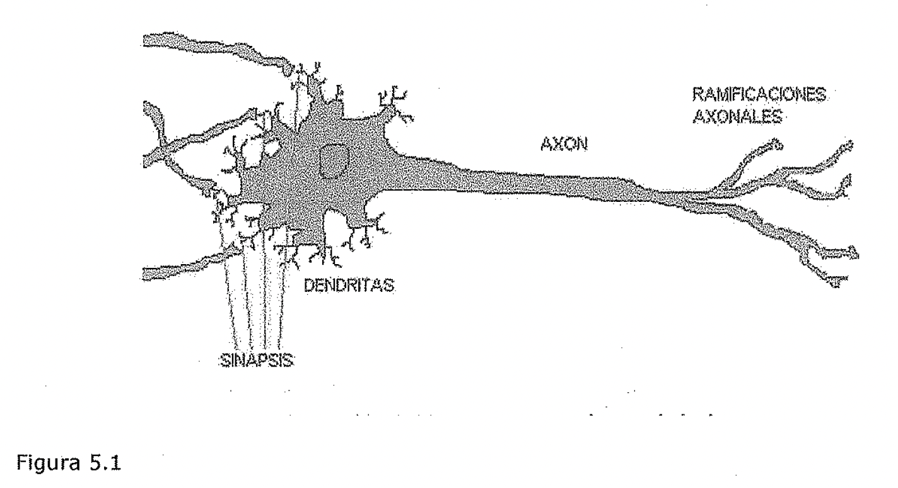

, Las extremidades de estas ramificaciones llegan hasta las dendritas de otras
neuronas y establecen unas conexiones llamadas ***sinapsis,*** en las cuales se
produce una transformación del impulso eléctrico en un mensaje neuroquímico,
mediante la liberación de unas sustancias llamadas ***neurotransmisores.***
BOTONES TERMINALES \\ RECEPTORES

NEUROTRANSMISORES

Figura 5.2

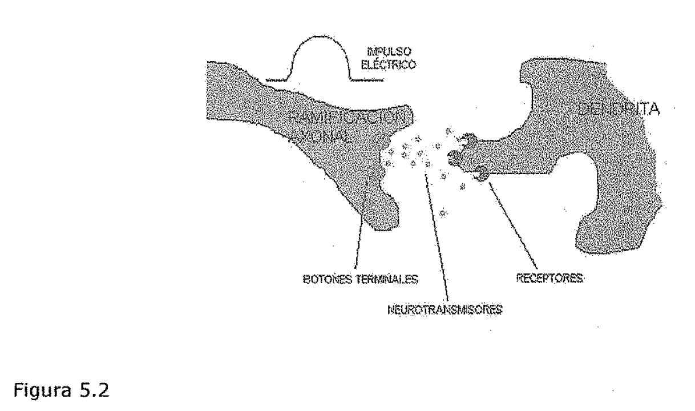

El ***efecto de los neurotransmisores*** sobre la neurona receptora puede ser
***excitatorio o inhibitorio,*** y es variable, de manera que podemos hablar de
la fuerza o efectividad de una sinapsis.

Las señales excitatorias e inhibitorias recibidas por una neurona se combinan, y
en función de la estimulación total recibida, la neurona toma un cierto nivel de
activación, que se traduce en la ***generación de breves impulsos nerviosos***
con una determinada frecuencia o tasa de disparo, y su propagación a lo largo
del axón hacia las neuronas con las cuales sinapsis.

Figura 5.3

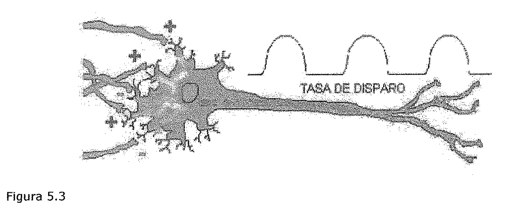

De esta manera ***la información se transmite de unas neuronas*** a otras y *va*
siendo procesada a través de las conexiones sinápticas y las propias neuronas. I
El aprendizaje de las redes neuronales se produce mediante la variación de la
efectividad de las sinapsis, de esta manera cambia la influencia que unas
neuronas ejercen sobre otras, de aquí se deduce que la arquitectura, el tipo y
la efectividad de las conexiones en un momento dado, representan en cierto modo
la memoria o estado de conocimiento de la red.

## Redes neuronales artificiales

(definicion-de-red-neuronal)=
### Definición de red neuronal

Darpa (1988), define una **red neuronal** como:

*un sistema compuesto de muchos elementos simples de procesamiento los cuales
operan* *en paralelo y cuya función es determinada por:*

- - *la estructura de la red y*

* *el peso de las conexiones*

*realizándose el procesamiento en cada uno de los nodos o elementos de cómputo.*
Según Haykin (1994), una red neuronal es:

*un procesador paralelo masivamente distribuido que tiene una facilidad natural
para el* *almacenamiento de conocimiento obtenido de la experiencia para luego
hacerlo* *utilizable.*

### Estructura de una red neuronal

Las neuronas se modelan mediante ***unidades de proceso.***

Cada unidad de proceso se compone de:

*r* 1 • una red de conexiones de entrada ·, • una función de red (de
propagación), encargada de computar la entrada total combinada de todas las
conexiones

- un núcleo central de proceso, encargado de aplicar la función de activación

- la salida, por donde se transmite el valor de activación a otras unidades

' 1 La función de red es típicamente el sumatorio ponderado, mientras que la
función de activación suele ser alguna función de umbral o una función
sigmoidal.

ENTRADAS CONEX!ONES FUNCIÓN

DE RED

FUNCIÓN DE

ACTIVAC!ON

Figura 5.4

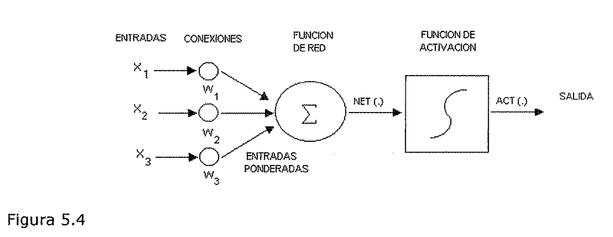

x2 --0w,--.. I NET(.)

X 3.,.o/ ENTRADAS

W PONDERADft.S

SALIDA

**Conexiones ponderadas:** hacen el papel de las *conexiones sinápticas.* **Peso
Sinaptico (w;):** el peso de la conexión equivale a la fuerza o efectividad de
la sinapsis. La existencia de conexiones determina si es posible que una unidad
influya sobre otra.

El valor de los pesos y el signo de los mismos define el tipo
(excitatorio/inhibitorio) y la intensidad de la influencia.

**Función de Red o de Propagación:** calcula el valor de base o entrada total a
la unidad, generalmente como simple *suma ponderada de todas las entradas
recibidas,* es decir de las entradas multiplicadas por el peso o valor de las
conexiones.

Equivale a la *combinación de las señales excitatorias e inhibidoras de las
neuronas biológicas.* **Función de Activación:** es quizás la característica
principal o definitoria de las neuronas, la que mejor define el comportamiento
de las mismas.

*Se encarga de calcular el nivel o estado de activación de la neurona en función
de la entrada total.* **Salida:** calcula la salida de la neurona en función de
la activación de la misma, aunque *normalmente no se aplica más que la función
identidad,* y se toma como salida el valor de activación.

*El valor de salida cumpliría la función de la tasa de disparo en las neuronas
biológicas.*

#### Función de red o de propagación

Como ya hemos comentado, se encarga de calcular la entrada total de la neurona
como combinación de todas las entradas.

Podemos citar entre las más importantes:

#### Función lineal de base (FLB)

Es la más utilizada.

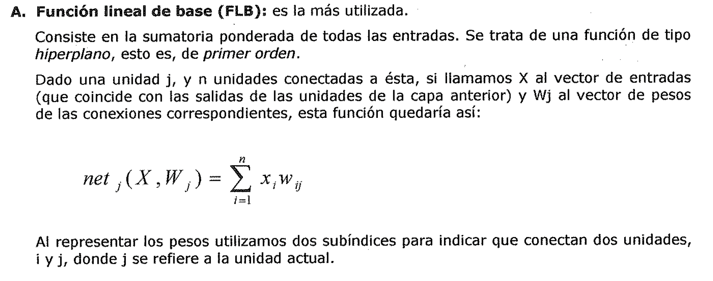

Consiste en la sumatoria ponderada de todas las entradas. Se trata de una
función de tipo *hiperplano,* esto es, de *primer orden.* Dado una unidad j, y n
unidades conectadas a esta, si llamamos X al vector de entradas que coincide con
las salidas de las unidades de la capa anterior) y Wj al vector de pesos de las
conexiones correspondientes, esta función quedaría asi:

*net* *X, W* ) = I*n*

*1* 1 *x;w u*

Al representar los pesos utilizamos dos subíndices para indicar que conectan dos
unidades, i y j, donde j se refiere a la unidad actual.

#### Función radial de base (FRB)

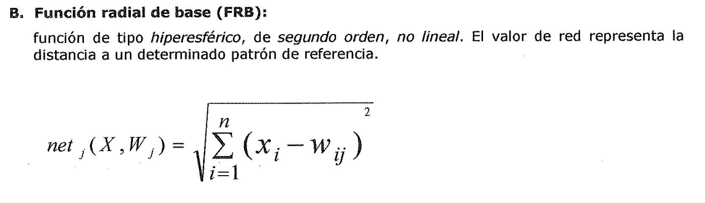

función de tipo *hiperesférico,* de *segundo orden, no lineal.* El valor de red
representa la distancia a un determinado patrón de referencia.

I *(Xi*

- *W ij* )

*net 1* *X*, *W 1* ) =

#### Función de activación

Podemos distinguir entre:

#### Funciones lineales

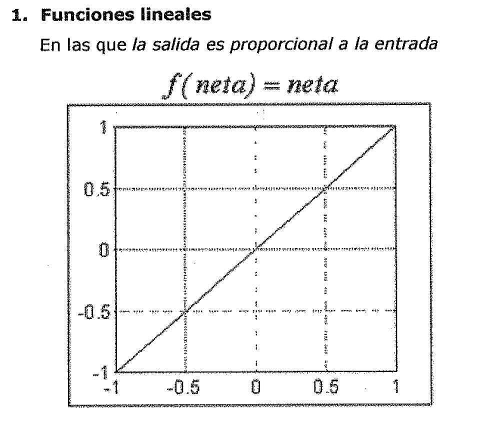

En las que *la salida es proporcional a la entrada*

*f neta)* = *neta*

#### Funciones de umbral

En las cuales *la salida es un valor discreto (típicamente binario O o 1)* que
depende *de* si la estimulación total supera o no un determinado valor de
umbra!.

En un principio se pensó que las neuronas usaban una función de umbra!, es
decir, que permanecían inactivas y *se* activaban solo si la estimulación total
superaba cierto valor límite. Esto se puede modelar con una **función escalón:**
la más típica es el **escalón unitario:** la función devuelve O, por debajo del

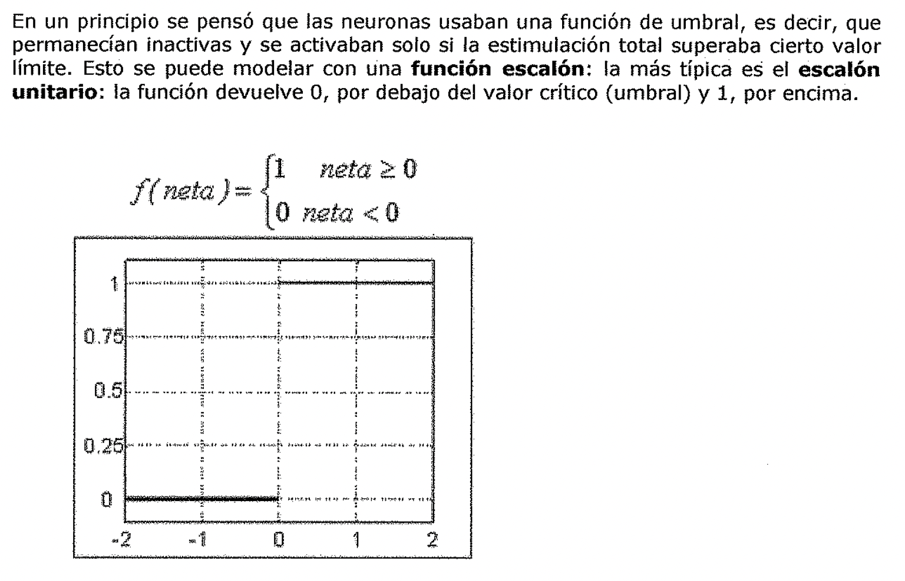
valor crítico (umbra!) y 1, por encima.

*neta* \<'= 0

*f(neta)=* { *neta* < 0 Después se comprobó que las neuronas emitían impulsos de
actividad eléctrica con una frecuencia variable, dependiendo de la intensidad de
la estimulación recibida, y que tenían cierta actividad hasta en reposo, con
estimulación nula. Estos descubrimientos llevaron al uso de funciones no
lineales con esas características, como la función sigmoidal, con un perfil
parecido al escalón de una función de umbra!, pero continua.

#### Funciones no lineales

*No proporcionales a la entrada.*

#### Función sigmoidal o logística

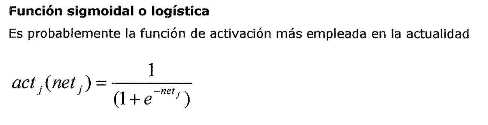

Es probablemente la función de activación más empleada en la actualidad Se trata
de una función continua no lineal con bastante plausibilidad fisiológica. La
función sigmoidal posee un rango comprendido entre O y 1. Esto, aplicado a las
unidades de proceso de una red neuronal artificial significa que, sea cuál sea
la entrada, la salida estará comprendida entre O y 1.

La salida de una unidad vale 0.5 cuando la entrada es nula, esto significa \*que

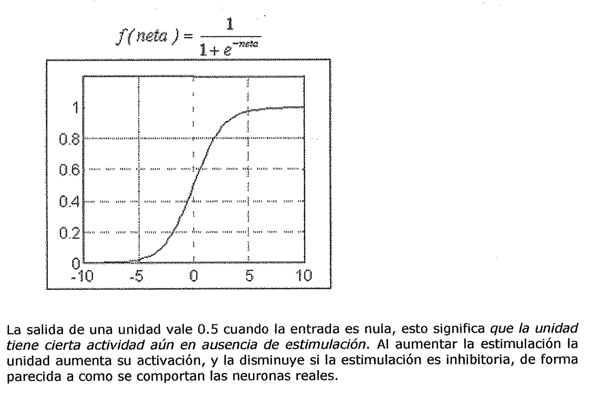
la unidad\* *tiene cierta actividad aun en ausencia de estimulación.* Al
aumentar la estimulación la unidad aumenta su activación, y la disminuye si la
estimulación es inhibitoria, de forma parecida a como se comportan las neuronas
reales. I Casi todos los avances recientes en conexionismo se atribuyen a
arquitecturas multicapa que utilizan funciones de activación no lineales como
una función de umbra!, una gaussiana o en la mayoría de los casos una función
sigmoidal.

*El problema de. trabajar con modelos no lineales radica en que son difíciles de
describir en* *términos lógicos o matemáticos convencionales.*

(comparacion-entre-redes-biologicas-y-artificiales)=
### Comparación entre redes biológicas y artificiales

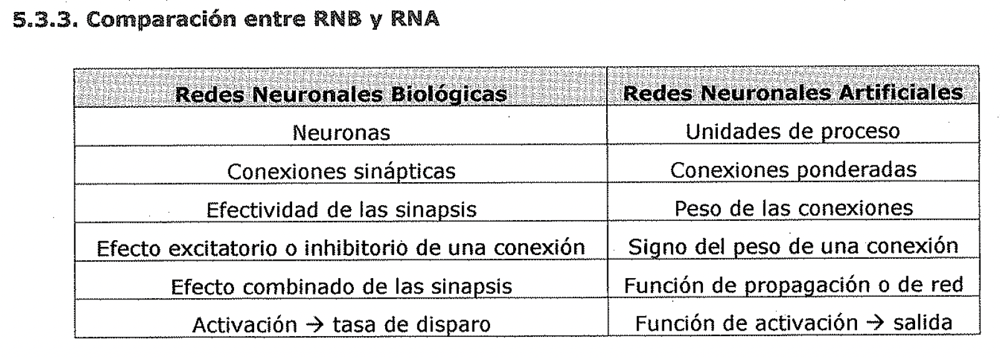

Neuronas Unidades de proceso

Conexiones sinápticas Conexiones ponderadas

Efectividad de las sinapsis Peso de las conexiones

Efecto excitatorio o inhibitorio de una conexión Siano del peso de una conexión
Efecto combinado de las sinapsis Función de propagación o de red

Activación ➔ tasa de disparo Función de activación ➔ salida

(formas-de-interconexion-de-las-rna)=
### Formas de interconexión de las RNA

Para diseñar una red debemos establecer como estarán conectadas unas unidades
con otras y determinar adecuadamente los pesos de las conexiones.

Lo más usual es disponer las unidades en forma de capas, pudiéndose hablar de
redes de una, de dos o de más de dos capas, las llamadas redes multicapa.

Nota: en algunos manuales (EJ. Wassermann, 1989) se cuentan solo aquellas capas
que poseen conexiones de entrada modificables, según este criterio la capa de
entrada no contaría como tal).

Aunque inicialmente se desarrollaron redes de una sola capa, lo más usual es
disponer tres o más ***capas:***

- - Capa de entrada: es la primera capa y actúa como buffer de entrada,
    almacenando la información bruta suministrada a la red o realizando un
    sencillo pre-proceso de la misma.

* Capa de salida: actúa como interfaz o buffer de salida, almacenando la
  respuesta de la red para que pueda ser leída.

* Capas ocultas: son las capas intermedias, principales encargadas de extraer,
  procesar y memorizar la información.

E1'ENTRADA

¢ULTA

Figura 5.5

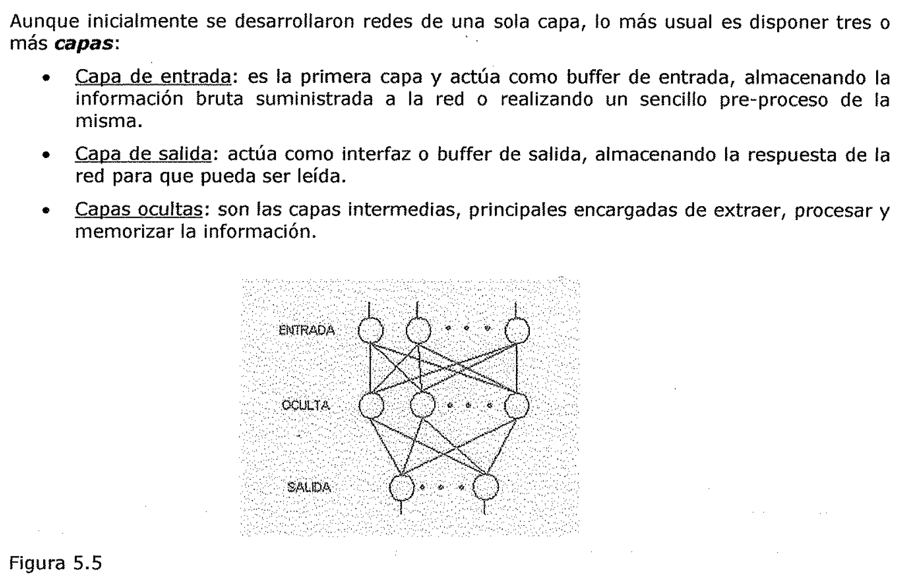

Podemos clasificar las RNA, además de por el número de capas de una red, en
función de

***cómo* se *interconectan unas capas con otras:***

*i* • Redes en cascada: feed-forward. La información fluye unidireccionalmente
de una capa a otra (desde la capa de entrada a las capas ocultas y de estas a la
capa de salida), y además, no se admiten conexiones intracapa.

- - Redes recurrentes: feed-back. La información puede volver a lugares por los
    que ya había pasado, formando bucles, y se admiten las conexiones intracapa
    (laterales), incluso de una unidad consigo misma.

Las ***conexiones*** entre una capa y otra pueden ser:

• Totales: cada unidad se conecta con todas las unidades de la capa siguiente.

- - Parciales: una unidad se conecta con solo algunas de las capas de la unidad
    siguiente, generalmente siguiendo algún patrón aleatorio o pseudo-aleatorio
    (por ejemplo, mediante algoritmos genéticos).

, *J* Desde una ***aproximación temporal*** se puede distinguir entre:

. *J* • Conexiones sin retardo.

.. • Conexiones con retardo.

- *J* Esto permite modelar aspectos dinámicos, por ejemplo, para modelos
  psicofisiológicos de

memoria.

(caracteristicas-de-las-rna)=
### Características de las RNA

1. **Aprendizaje inductivo:** no se le indican las reglas para dar una solución,
   sino que *extrae* sus *propias reglas a partir de los*• *ejemplos de
   aprendizaje, modifican* su *comportamiento en función de la experiencia.*
   Esas reglas quedan almacenadas en las

conexiones y no representadas explícitamente como en los sistemas basados en
conocimiento (simbólico-deductivos)..

1. **Generalización** *una vez entrenada,* se *le pueden presentar a la red
   datos distintos a*

los *usados durante e/aprendizaje.* La respuesta obtenida dependerá de! parecido
de las datos con los ejemplos de entrenamiento.

1. **Abstracción o tolerancia al ruido:** las redes neuronales artificiales son
   capaces de extraer o abstraer las características esenciales de las entradas
   aprendidas, de esta manera *pueden procesar correctamente datos incompletos*
   o *distorsionados.*

1. **Procesamiento paralelo:** las neuronas reales trabajan en paralelo; en el
   caso de las redes artificiales es obvio que si usamos un solo procesador no
   podrá haber proceso paralelo real; sin embargo *hay un paralelismo
   inherente,* lo esencial es que la

estructura y modo de operación de las redes neuronales las hace especialmente
adecuadas para el *procesamiento paralelo real mediante multiprocesadores* (se
están desarrollando máquinas especificas para la computación neuronal).

1. **Memoria distribuida:** el conocimiento acumulado par la red se halla
   distribuido en

numerosas conexiones, esto tiene coma consecuencia la tolerancia a fallos: *una
red* *neuronal* es *capaz de seguir funcionando adecuadamente a pesar de sufrir
lesiones con* *destrucción de neuronas o sus conexiones, ya que la información*
se *ha/la distribuida* *por toda la red,* sin embargo en un programa tradicional
un pequeño fallo en cualquier punto puede invalidarlo todo y dar un resultado
absurdo o no dar ningún resultado.

## Ventajas y desventajas de las redes neuronales

### Ventajas de las RNA

1. **Aprendizaje adaptativo:** capacidad de aprender a realizar tareas basadas
   en un entrenamiento o en una experiencia inicial.

1. **Auto-organización:** una red neuronal puede crear su propia organización o
   representación de la información que recibe mediante una etapa de
   aprendizaje.

1. **Tolerancia a fallos:** la destrucción parcial de una red conduce a una
   degradación de su estructura, sin embargo, algunas capacidades de la red se
   pueden retener, incluso sufriendo un gran daño.

1. **Operación en tiempo real:** las cómputos neuronales pueden ser realizados
   en

paralelo, para esto se diseñan y fabrican máquinas con hardware especial para
obtener esta capacidad. •

1. **Fácil inserción dentro de la tecnología existente:** se pueden obtener
   chips especializados para redes neuronales que mejoran su capacidad en
   ciertas tareas. Ello facilitara la integración modular en las sistemas
   existentes.

La capacidad de aprendizaje adaptativo es una de las características más
atractivas de las redes neuronales. *Esto* es, *aprenden a llevar a cabo ciertas
tareas mediante un* *entrenamiento con ejemplos i/ilustrativos.* Como las redes
neuronales pueden aprender a diferenciar patrones mediante ejemplos y
entrenamientos, no es necesario elaborar modelos a priori, ni especificar
funciones de distribución de probabilidad.

Las redes neuronales son ***sistemas dinámicos autoadaptativos.***

- Son adaptables debido a la capacidad de autoajuste de los elementos procesales
  (neuronas) que componen el sistema.

- Son dinámicos, pues son capaces de estar constantemente cambiando para
  adaptarse a las nuevas condiciones.

En el proceso de aprendizaje, los enlaces ponderados de las neuronas se ajustan
de manera que se obtengan ciertos resultados específicos.

*Una red neuronal no necesita un algoritmo para resolver un problema, ya que
ella puede generar su propia distribución de pesos en las enlaces mediante el
aprendizaje. También existen redes que continúan aprendiendo a lo largo de su
vida, después de completado su período de entrenamiento.* La función del
diseñador es unicamente la obtención de la arquitectura apropiada. No es
problema del diseñador el como la red aprenderá a discriminar.

Sin embargo, si es necesario que desarrolle un buen algoritmo de aprendizaje que
le proporcione a la red la capacidad de discriminar, mediante un entrenamiento
con patrones.

#### Autoorganización

Las redes neuronales emplean su capacidad de aprendizaje adaptativo para
autoorganizar la información que reciben durante el aprendizaje y/o la
operación.

*Mientras que el aprendizaje* es *la modificación de cada elemento procesal,
la autoorganización consiste en la modificación de la red neuronal completa para
1/llevar a cabo un objetivo específico.* • Cuando las redes neuronales se usan
para reconocer ciertas clases de patrones, ellas autoorganizan la información
usada. Por ejemplo, la red llamada backpropagation, creara su propia
representación característica, mediante la cuál puede reconocer ciertos
patrones.

*Esta autoorganización provoca la generalización: fácil/tad de las redes
neuronales de responder apropiadamente cuando se les presentan datos o
situaciones a las que no había sido expuesta anteriormente.* El sistema puede
generalizar la entrada para obtener una respuesta. Esta característica es muy
importante cuando se tiene que solucionar problemas en los cuales la información
de entrada no es muy clara. Ademas permite que el Sistema de una solución,
inclLiso cuando la información de entrada esta especificada de forma incompleta.

#### Tolerancia a fallos

Las redes neuronales fueron los primeros métodos computacionales con la
capacidad inherente de tolerancia a fallos. Comparados con los sistemas
computacionales tradicionales, los cuales pierden su funcionalidad cuando sufren
un pequeño error de . memoria,, *en las redes neuronales, si se produce un fa/lo
en un número no muy grande de neuronas y aunque el comportamiento del sistema se
ve influenciado, no sufre una caída repentina.* Hay dos aspectos distintos
respecto a la tolerancia a fallos:

a) Las redes pueden aprender a reconocer patrones con ruido, distorsionados o
incompletos. Esta es una tolerancia a fallos respecto a los datos.

b) Las redes pueden seguir realizando su función (con cierta degradación) aunque
se destruya parte de la red. • • . La razón por la. que las redes neuronales son
tolerantes a los fallos es que *tienen su información distribuida en las
conexiones entre neuronas, existiendo cierto grado. de redundancia en este tipo
de a/almacenamiento.* La mayoría de los ordenadores algorítmicos y sistemas de
recuperación de datos almacenan cada pieza de información en un espacio único,
localizado y direccionable. En cambio, las redes neuronales almacenan
información no localizada. Por lo tanto, la mayoría de las interconexiónes entre
los nodos de la red tendrán sus valores en función de los estímulos recibidos, y
se generara un patrón de salida que represente la información almacenada.

#### Operación en tiempo real

Una de las mayores prioridades, casi en la totalidad de las áreas de aplicación,
es la necesidad de realizar procesos con datos de forma muy rápida.

Las redes neuronales se adaptan bien a esto debido a su implementación paralela.
Para que la mayoría de las redes puedan operar en un entorno de tiempo real, la
necesidad de cambio en los pesos de las conexiones o entrenamiento es mínimo.

#### Fácil inserción dentro de la tecnología existente

Una red individual puede ser entrenada para desarrollar una (mica y bien
definida tarea tareas complejas, que hagan múltiples selecciones de patrones
requerirán sistemas de redes interconectadas). Con las herramientas
computacionales existentes (no del tipo PC), una red puede ser rápidamente
entrenada, comprobada, verificada y trasladada a una implementación hardware de
bajo coste.

Por lo tanto, no se presentan dificultades para la inserción de redes neuronales
en aplicaciones específicas, por ejemplo de control, dentro de los sistemas
existentes. De esta manera, las redes neuronales se pueden utilizar para mejorar
sistemas en forma incremental y cada paso puede ser evaluado antes de acometer
un desarrollo más amplio.

### Desventajas de las RNA

#### Definición de muchos parámetros

Una de las desventajas de las redes neuronales es que ***requieren definición
de***

***muchos parámetros antes de poder aplicar la metodología.***

Por ejemplo hay que decidir la arquitectura más apropiada, el número de capas
ocultas, el número de nodos por capa, las interconexiónes, la función de
transformación, etc. Las técnicas estadísticas convencionales, sin embargo, solo
requieren la extracción y normalización de una muestra de datos. Es un argumento
erróneo sostener que el tiempo de desarrollo para los modelos basados en una red
neuronal sea más corto que el tiempo necesario para desarrollar, por ejemplo,
una tabla de puntuación basada en una regresión multiple. Los estudios donde se
ha constatado un tiempo de desarrollo más corto no han tenido en cuenta la
preparación de datos que requiere una red neuronal.

#### Caja negra

Otra desventaja es que *no ofrecen una interpretación fácil* como hace, por
ejemplo, un algoritmo de scoring. ***En lugar de ser un sistema de apoyo a la
decisión, la caja*** ***negra* se *puede convertir en el "tomador" de la
decisión.*** Puede ocurrir que un director de riesgo deniegue un credito solo
porque lo dice la caja negra, sin que el pueda argumentar esta decisión ya que
no entiende el funcionamiento de la red neuronal.

## Mecanismos de aprendizaje

***El aprendizaje* es *el proceso por el cuál una red neuronal modifica sus
pesos en respuesta a una información de entrada.*** Los cambios que se producen
durante el mismo se reducen a la destrucción, modificación y creación de
conexiones entre las neuronas. En los sistemas biológicos existe una continua
destrucción y creación de conexiones. En los modelos de redes neuronales
artificiales, la creación de una nueva conexión implica que el peso de la misma
pasa a tener un valor distinto de cero. De la misma manera, una conexión se
destruye cuando su peso pasa a ser cero.

***Durante el proceso de aprendizaje, los pesos de las conexiones de la red
sufren modificaciones, por lo tanto,* se *puede afirmar que este proceso ha*** l
***terminado (la red ha aprendido) cuando los valores de los pesos permanecen
estables.*** • • Un aspecto importante respecto al aprendizaje de las redes
neuronales es el conocer como se modifican los valores de los pesos, es decir,
cuáles son los criterios que se siguen para cambiar el valor asignado a las
conexiones cuando se pretende que la red aprenda una nueva información.

Existen dos métodos de aprendizaje importantes que pueden distinguirse:

- Aprendizaje supervisado

- Aprendizaje no supervisado

Otro criterio que se puede utilizar para diferenciar las reglas de aprendizaje
se basa en la siguiente consideración:

- Aprendizaje on-line

Si la red puede aprender durante su funcionamiento habitual.

- Aprendizaje off-line

Si el aprendizaje supone la desconexión de la red, es decir, su inhabilitación
hasta que el proceso se termine.

Cuando el aprendizaje es off-line se distingue entre una fase de aprendizaje o
entrenamiento. y una fase de operación o funcionamiento, existiendo *un conjunto
de datos de entrenamiento y un conjunto de datos de test o prueba,* que serán
utilizados en la correspondiente fase. Ademas los pesos de las conexiones
permanecen fijos después que termina la etapa de entrenamiento de la red.

*Debido, precisamente a su carácter estático, estos sistemas no presentan
problemas de estabilidad en su funcionamiento.*

### Aprendizaje supervisado

***El aprendizaje supervisado* se *caracteriza porque el proceso de aprendizaje*
se *realiza mediante un entrenamiento controlado por un agente externo
(supervisor, maestro) que determina la respuesta que debería generar la red a
partir de una entrada determinada.*** El supervisor controla la salida de la red
y en caso de que esta no coincida con la deseada, se procederá a modificar los
pesos de las conexiones, con el fin de conseguir que la salida obtenida se
aproxime a la deseada.

En este tipo de aprendizaje se suelen considerar, a su vez, tres formas de
llevarlo a cabo, que dan lugar a los siguientes aprendizajes supervisados:

- - Aprendizaje por corrección de error.

* Aprendizaje por refuerzo.

* Aprendizaje estocástico.

#### Aprendizaje por corrección de error

Consiste en *ajustar* los *pesos de las conexiones de la red en función de la
diferencia* *entre los valores deseados v los obtenidos a la salida de la red,*
es decir, en función del error cometido en la salida.

**Error cometido** = **Valor deseado** - **Valor obtenido**

Un ejemplo de este tipo de algoritmos lo constituye la *regla de aprendizaje de/
Perceptrón,* utilizada en el entrenamiento de la red del mismo nombre que
desarrolló Rosenblatt en 1958. Esta es una regla muy simple: para cada neurona,
en la capa de salida se le calcula la desviación a la salida objetivo coma el
error, o, el cuál luego se utiliza para cambiar los pesos sobre la conexión de
la neurona precedente.

#### Aprendizaje por refuerzo

Se trata de un aprendizaje supervisado, *más lento que el anterior,* que se basa
en la idea de no disponer de un ejemplo completo del comportamiento deseado, es
decir, de no indicar durante el entrenamiento exactamente la salida que se desea
que C' proporcione la red ante una determinada entrada.

En el aprendizaje por refuerzo la función del supervisor se reduce a *indicar
mediante* *una señal de refuerzo si la salida obtenida en la red se ajusta a la
deseada (éxito* - +*1* o *fracaso* - *-1* ), *v en función de ello se ajustan
los pesos basándose en un mecanismo* *de probabilidades.* Se podría decir que en
este tipo de aprendizaje la función del ***supervisor*** se asemeja más a la de
un ***crítico*** (que opina sobre la respuesta de la red) que a la de un maestro
(que indica a la red la respuesta concreta que debe generar), coma ocurriría en
el caso de supervisión por corrección del error.

#### Aprendizaje estocástico

Consiste básicamente en *realizar cambios aleatorios en los valores de* los
*pesos de las* *conexiones de la red v evaluar su efecto a partir de/ objetivo
deseado v de* *distribuciones de probabilidad.* En el aprendizaje estocástico se
suele hacer una analogía en términos termodinámicos, asociando a la red neuronal
con un s61ido físico que tiene cierto estado energético. En el case de la red,
la energía de la misma representaría el grado de estabilidad de la red, de tal
forma que el estado de mínima energía correspondería a una situación en la que
los pesos de las conexiones consiguen que su funcionamiento sea el que más se
ajusta al objetivo deseado. (.

Según lo anterior, el aprendizaje consistiría en realizar un cambio aleatorio de
los valores de los pesos y determinar la energía de la red. Si la energía es
menor después del cambio, es decir, si el comportamiento de la red se acerca al
deseado, se acepta el cambio. Si, por el contrario, la energía no es menor, se
aceptaría el cambio en función de una determinada y preestablecida distribución
de probabilidades.

### Aprendizaje no supervisado

***Las redes con aprendizaje no supervisado (también conocido como
autosupervisado)*** ***no requieren influencia externa para ajustar los pesos de
las conexiones entre sus*** ***neuronas. La red no recibe ninguna información
por parte del entorno que le indique*** ***si la salida generada en respuesta a
una determinada entrada* es *o no correcta.*** Estas redes deben encontrar las
características, regularidades, correlaciones o categorías que se puedan
establecer entre lo.s datos que se presenten en su entrada. Existen varias
posibilidades en cuanto a la interpretación de la salida de estas redes, que
dependen de su (.

estructura y del algoritmo de aprendizaje empleado:

- - En algunos casos, la salida representa el grado de• familiaridad o similitud
    entre la información que se le esta presentando en la entrada y las
    informaciones que se le han mostrado hasta entonces en el pasado).

* En otro caso, podría realizar un establecimiento de categorías, indicando la
  red a la

* ' salida, a que categoría pertenece la información presentada a la entrada,
  siendo la propia red quien debe encontrar las categorías apropiadas a partir
  de las correlaciones entre las informaciones presentadas.

En cuanto a los algoritmos de aprendizaje no supervisado, en general se suelen
considerar dos tipos, que dan lugar a los siguientes aprendizajes:

Aprendizaje hebbiano

- Aprendizaje competitivo y comparativo

#### Aprendizaje hebbiano

Los sistemas neuronales biológicos no nacen preprogramados con todo el
conocimiento y las capacidades que llegaran a tener eventualmente.

***Un proceso de aprendizaje que tiene lugar a lo largo de un periodo de tiempo
modifica de alguna forma la red para incluir la nueva información.*** La teoría
básica procede de un libro de 1949 escrito por Hebb. La idea principal se
expresaba en forma de suposición yes la siguiente:

Cuando un axón de la célula A esta suficientemente próximo para excitar a una
célula B o toma parte en su disparo de forma persistente, tiene lugar algún
proceso de crecimiento o algún cambio metab61ico en una de la células, o en las
dos, de tal modo que la eficiencia de A, como una de las células que desencadena
el disparo de B, se ve incrementada.

Para ilustrar la idea básica, consideramos el ejemplo clásico de
condicionamiento, empleando el conocido experimento de Pavlov, reflejado en una
idealización de tres neuronas que forman parte del proceso, como indica la
Figura 5.6:

Entrada

SaA

de sonido Sef\\al de salivación

visual trdCa.

Sac

Figura 5.6

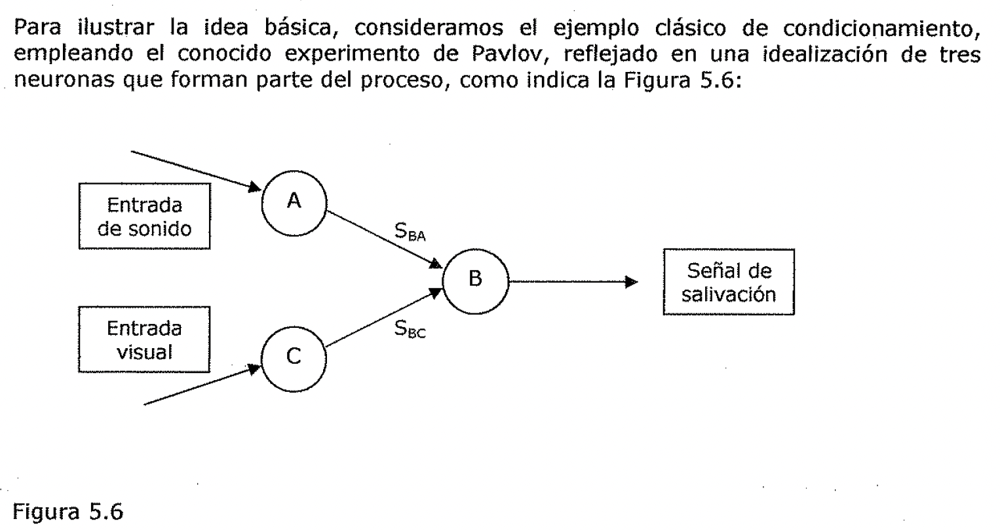

' Supongamos que la excitación de C, causada por la visualización de la comida,
es. suficiente para excitar a B, que da lugar a la salivación. Ademas supongamos
que, en ausencia de estimulación adicional, la excitación de A, que se debe a
oir una campanilla, no basta para dar lugar al disparo de B.

Permitamos que C de lugar a que B dispare mostrando comida al sujeto, y,
mientras B sigue disparando, estimulemos a A haciendo sonar una campanilla. Dado
que B sigue disparando, A participa ahora en la excitación de B, aun cuando por
sí sola A no sería suficiente para dar lugar a que B disparase.

*En esta situación, la suposición de Hebb determina que* se *produce algún
cambio entre A y B, de tal modo que la influencia de A sobre B* se *ve
incrementada. Si el experimento* se *repite con frecuencia suficiente, A sera
capaz de lograr, eventualmente, que* se *dispare B incluso en ausencia de la
estimulación visual procedente de* C.

***Llevado esto al terreno de las RNA, significa que el peso de la conexión
entre ambas neuronas se ve incrementado.***

#### Aprendizaje competitivo y comparativo

***El aprendizaje competitivo se orienta a la clasificación de los datos de
entrada. En este tipo de aprendizaje, las unidades de salida luchan por el
control sobre porciones del espacio de entrada.*** Las unidades *de* entrada se
conectan directamente a las unidades de salida, pero estas también se conectan
entre sí con conexiones precableadas negativas o inhibitorias.

La unidad de salida con la mayor activación en sus entradas tendrá más fuerza
que sus competidores. Como resultado, los competidores se vuelven más débiles,
perdiendo su poder de inhibición sobre las unidades más fuertes. Las unidades
más fuertes se hacen cada vez más fuertes y su efecto inhibitorio sobre las
demás unidades de salida se hace cada vez mayor. Pronto, el resto de las
unidades de salida estará completamente inactivo. Este tipo de inhibición mutua
se denomina: comportamiento de el ganador se lleva todo.

(el-perceptron)=
## El perceptrón
El perceptrón, inventado por Rosenblatt (1962), *fue uno
de* los *primeros modelos de redes neuronales.* Consiste *en* pesos *entrenables
multiplicativos, un sumador y una función umbral.* *Un perceptrón imita una
neurona tomando la suma ponderada de* sus *entradas y enviando a la salida un 1*
si *la suma* es *más grande que algún valor umbral ajustable, y enviando un O
en* caso *contrario.*

**Un perceptrón es una representación, o sea, una red neuronal en la que:**

- Solo hay una neurona.

- Las entradas son binarias: solo se permiten 0 y 1.

- Las cajas lógicas pueden interponerse entre las entradas y los pesos del
  perceptrón. Cada caja lógica puede verse como una tabla que produce un valor
  de salida de 0 o 1

para cada combinación de 0 y 1 que pueda aparecer en sus entradas.

- La salida del perceptrón es 0 o 1, dependiendo de si la suma ponderada de las
  salidas

de las cajas lógicas es mayor que el umbral.

En la Figura 5.7 se puede observar un modelo de un perceptrón. Las entradas son
0 o 1, al igual que las salidas de las cajas lógicas. Si la suma de las salidas
ponderadas de las cajas lógicas es mayor que 0, la salida del perceptrón es 1 y
se dice que el perceptrón dice SI, se ha reconocido una clase. En cualquier otro
caso, se dice que el perceptrón dice NO, no se ha reconocido una clase.

Figura 5.7

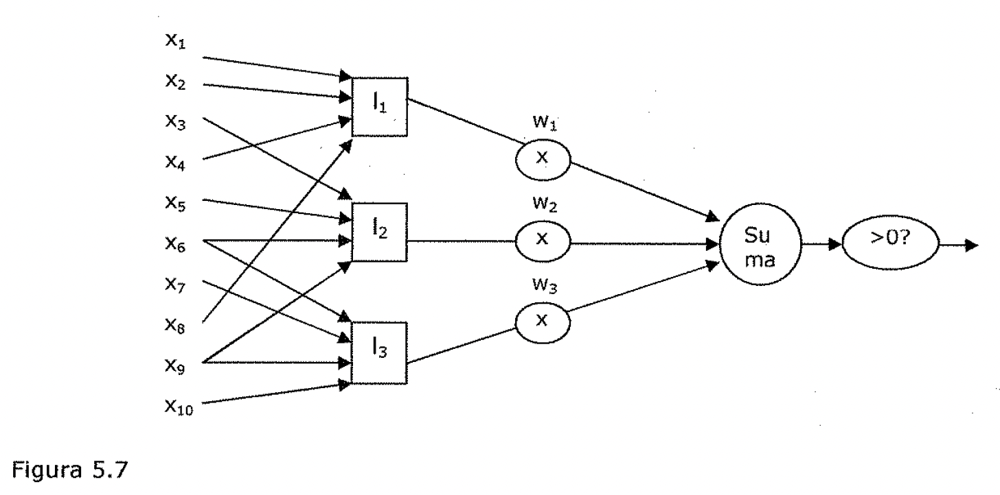

Para expresar la situación en notación matemática, suponga que la salida de la
i-ésima caja lógica es I;, el i-ésimo peso es w;, y que finalmente, el umbral es
T. Entonces la salida del perceptrón completo, P, esta dada par la siguiente

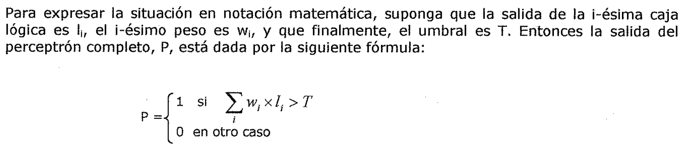
formula:

1 Si *L W;* x *l;* > *T*

{ o en otro caso Note que si cualesquiera de las cajas lógicas del perceptrón
pudieran atender todas las entradas del perceptrón, entonces no habría necesidad
de otras cajas lógicas ni tampoco de pesos o de una función de umbral. En lugar
de ello, todas las combinaciones de O y 1 de entrada se registrarían en la tabla
interna de la caja lógica, junta con la salida apropiada de O Par supuesto que
el número de entradas de la tabla sería de 2° si hubiera n entradas y se
tuvieran que manejar todas las posibles combinaciones de O y 1. Esta relación
exponencial entre el número de entradas de la tabla y el número de entradas del
perceptrón hace que no sea practico el que cualesquiera de las cajas lógicas
atiendan a todas las entradas, e incluso si atendiera una fracción sustancial de
todas las entradas, si hubiera muchas.

En consecuencia, se supone que cada caja lógica de un perceptrón debe atender
solo un pequeño número de entradas, por ejemplo, las cajas lógicas del
perceptrón de la Figura 5.7 atienden un máxima de 4 entradas.

En un ***perceptrón limitado por el orden,*** de orden n, cada caja lógica
atiende n o menos entradas.

Otra limitación más consiste en reducir las cajas lógicas a una sola entrada,
que se pasa por el correspondiente multiplicador:

En un ***perceptrón directo,*** cada caja lógica tiene solo una entrada, y la
salida es siempre la misma que la entrada.

De manera alternativa, un perceptrón directo puede verse coma un perceptrón sin
cajas lógicas, como se ilustra en la Figura 5.8.

Figura 5.8

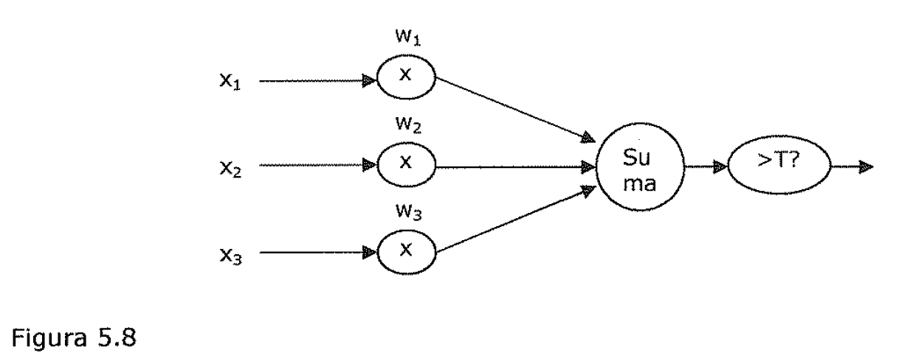

### Aprendizaje del perceptrón

Es importante hacer notar que *existe un procedimiento que descubre un buen
conjunto de* *pesos para un perceptrón,* dado que tal conjunto exista. \\
Ademas, el procedimiento es increíblemente directo. Básicamente, se empieza con
todos los pesos en 0. Después se intenta el perceptrón con todas las muestras,
una a la vez. Siempre que el perceptrón cometa un error, se cambian los pesos de
modo que el error se haga menos probable, en cualquier otro caso, no se hace
nada.

- - Por el momento suponga que el perceptrón dice no, al producir un 0, cuando
    debería

decir s\[, produciendo un 1. Se puede aumentar la probabilidad de que diga sí la
próxima vez si se incrementan los pesos asignados a aquellas cajas lógicas que
producen 1 en el instante en que se comete el error. Una forma de asegurar el
posible descubrimiento de:

un conjunto completamente eficaz de pesos consiste en aumentar cada uno de tales
pesos en 1.

- - De manera simétrica, siempre que el perceptrón dice s\[ cuando debería decir
    no, se disminuyen los pesos asignados a las cajas lógicas que producen 1,
    con la disminución igual a 1.

* En ningún caso se alteran los pesos asignados a las cajas que producen o.
  Después de todo, tales pesos están multiplicados por 0, de modo que no es
  posible que al jugar con ellos se pueda cambiar el resultado actual y si
  podría hacerse erróneo algún otro resultado correcto.

Finalmente, para *conseguir el efecto de un umbral entrenable, se añade una
entrada virtual extra, cuyo valor siempre se supone es 1,* a la. caja lógica que
acaba de pasar el valor de entrada. ***Con esta añadidura, el perceptrón se
puede ver como si tuviera un umbral de O, y dice sí siempre que la suma
ponderada de las salidas de la caja lógica sea mayor***

***que o.***

Observe que se puede hablar del procedimiento de entrenamiento del perceptrón de
forma más concisa mediante el lenguaje de vectores. Las salidas de caja lógica y
los pesos, expresados en notación vectorial, son **(11,** 12,...ln) y (w,,
w2,... Wn). Sumar uno a cada uno de los pesos asignados a cajas lógicas que
producen 1 es lo mismo que sumar el vector de salida de caja lógica al vector
peso, según la siguiente descripción:

### Aprendizaje del perceptrón
#### Para entrenar a un perceptrón

- - Hasta que el perceptrón produzca el resultado correcto para cada muestra de
    entrenamiento, para cada muestra:

* Si el perceptrón produce una respuesta errónea:

Si el perceptrón dice no cuando debería decir sí, añada el vector de salida de
caja lógica al vector peso.

En cualquier otro caso, reste el vector de salida de caja lógica del vector
peso.

- - - En cualquier otro caso, no haga nada.

Figura 5.9

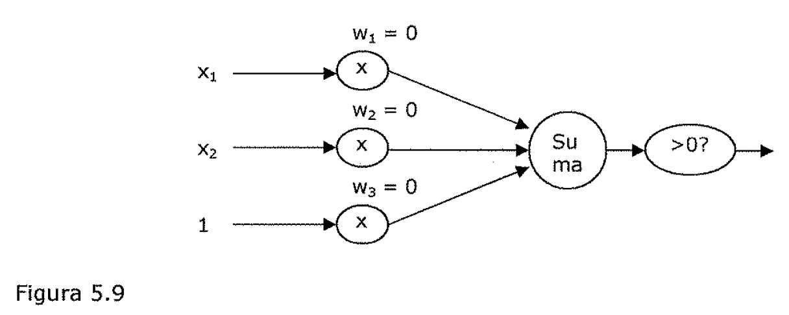

Por ejemplo, considere el ***perceptrón directo*** que se muestra en la Figura
5.9 y suponga que desea entrenarlo para que efectúe una ***función lógica OR,***
comenzando desde la línea de partida.

Como el perceptrón es directo, el vector de salida de caja lógica, (11, 12,13),
es el mismo que el vector de entrada, **(x, x,x).** Por tanto, las muestras de
entrada y las correspondientes salidas de caja lógica, para una OR lógica, son
las siguientes:

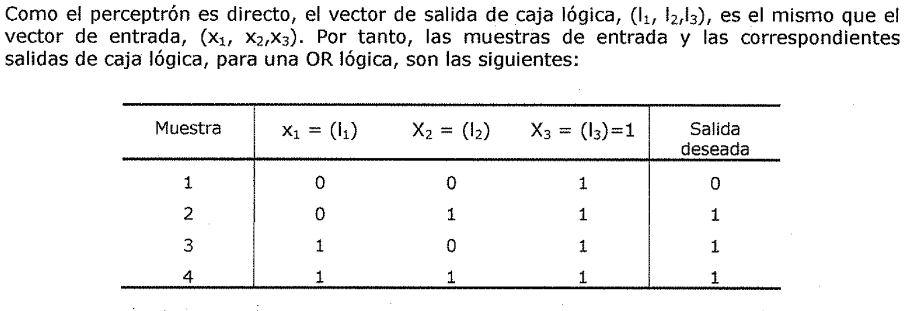

Muestra

X3 = (13)=1

Salida

deseada 1 0 0 1 0

2 0 1 1 1

3 1 0 1 1

4 1 1 1 1

Procediendo en ciclos a través de estas muestras, finalmente el perceptrón
aprende el OR lógico, después de cuatro cambios:

1. El primero ocurre después de un error en la segunda muestra durante el primer
   paso. En ese momento, el vector peso es (0 0 0), de modo que la salida es O
   cuando debería ser 1. En consecuencia, cuando el vector de entrada, (0 1 1),
   se suma al vector peso, el nuevo vector peso es (0 1 1). Las siguientes dos
   muestras encontradas durante el primer paso producen 1, como deberían, de
   modo que no hay que hacer más cambios durante el primer paso.

1. Durante el segundo paso, la primera muestra produce un 1, pero debería
   producir un 0. En consecuencia, el vector de entrada (0 O 1) se resta del
   vector peso (0 1 1), lo que

produce un nuevo vector peso (0 1 0).

1. Sin embargo, con este cambio, la tercera muestra produce un O cuando debería
   producir un 1. Por tanto, el vector de entrada, (1 0 1), se suma al vector
   peso, (0 1 0),

lo que produce un nuevo vector peso, (1 1 1).

1. A continuación, la primera muestra produce de nuevo un error durante el

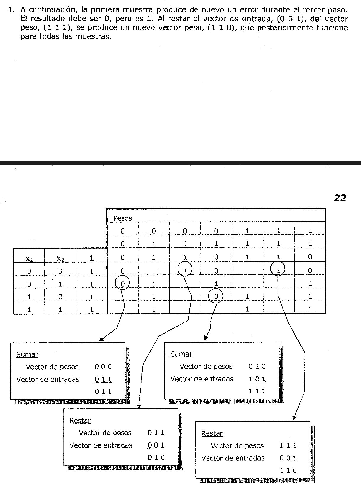
tercer paso. El resultado debe ser 0, pero es 1. Al restar el vector de entrada,
(0 0 1), del vector peso, (1 1 1), se produce un nuevo vector peso, (1 1 0), que
posteriormente funciona

para todas las muestras.

Pesos

0 0 0 0 1 1 1

0 1 1 1 1 1 1

x, X2 1 0 1 1 0 1 1 0 0 0 1 0 1 0 1 0

0 1 1 (o 1 \\ 1 1

1 0 1 \\ 1 (QJ 1 1

1 1 1 1 7 1 1

Sumar

Vector de pesos 000

Vector de entradas 0 1 1

Restar

Sumar

Vector de pesos Vector de entradas

Vector de pesos Vector de entradas 0 1 1 001 Restar Vector de pesos 1 1 1 0 1 0
Vector de entradas 0 0 1

1 1 0

### La separación lineal y el problema del XOR

El ***teorema de convergencia del perceptrón*** de Rosenblatt (1962),
***garantiza que el perceptrón encontrara un estado solución,*** es *decir,*
***aprenderá a clasificar cualquier conjunto de entradas linealmente
separables.*** X1 X2 X1 OR X2

0 0 0

0 1 1

1 0 1

1 1 1

Figura 5.10

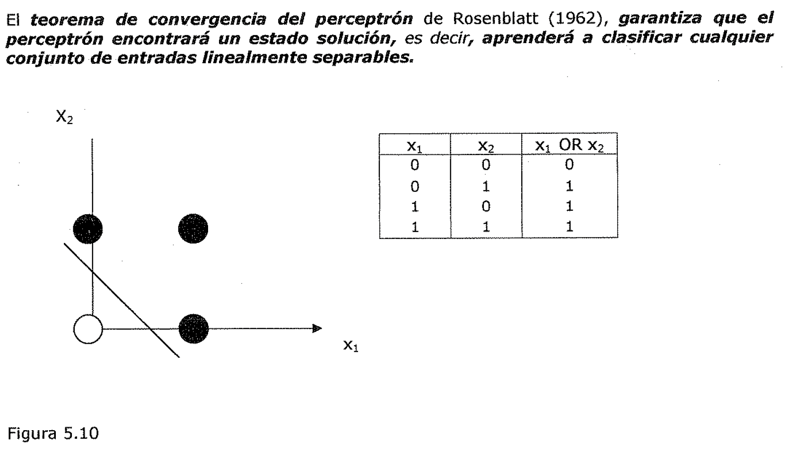

La introducción de los perceptrónes a finales de la década de los cincuenta
causó un gran entusiasmo. Suponía un dispositivo que se asemejaba mucho a una
neurona y para el que había disponibles algoritmos de aprendizaje bien
definidos. Hubo mucha especulación acerca de cómo podrían formarse sistemas
inteligentes a partir de bloques construidos con , • perceptrónes.

En su libro Perceptrónes, Minsky y Papert (1969) pusieron fin a dicha
especulación analizando las capacidades de cálculo de dicho sistema. Elles
advirtieron que mientras el teorema de convergencia garantizaba una correcta
clasificación de la información linealmente independiente, la mayoría de los
problemas no proporcionaban este tipo de dates tan booleanas.

En realidad, el perceptrón es incapaz de aprender a resolver algunos problemas
verdaderamente sencillos. Un ejemplo dado por Minsky y Papert es el problema
***OR-Exclusiva (XOR):*** Dadas dos entradas binarias, dará salida 1 si
solamente una de las entradas esta conectada, y dará salida O sl ocurre de modo
contrario. Se puede considerar a XOR como un problema de clasificación de
patrones en el que existen 4 patrones y 2 salidas posibles (ver Figura 5.11).

x, X2 x, XOR X2 ·o 0 0 0 1 1

1 0 1

1 l 0

Figura 5.11

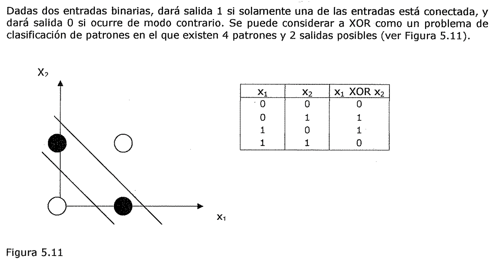

*El perceptrón no puede aprender a crear una superficie lineal de decisión que
separe estas diferentes salidas, porque dicha superficie de decisión no existe.*
***No hay una única recta que pueda separar las salidas 1 de las salidas* 0.**
Minsky y Papert proporcionaron varies problemas con estas propiedades.

Démonos cuenta que aquí *la deficiencia* no está en el algoritmo de aprendizaje
del perceptrón, sino en *el modo en el que el perceptrón representa el
conocimiento.*

- SI se pudiera dibujar una ***superficie de decisión elíptica*** se podrían
  englobar las dos salidas "l" en el espacio XOR. ***Sin embargo, los
  perceptrónes son incapaces de modelar dichas superficies.***

- Otra idea puede ser la de emplear dos escenarios diferentes para el dibujo de
  líneas. Se podría dibujar una linea para aislar el punto (x1 = 1, x2 = 1) y
  después otra linea para dividir los tres puntos que quedan en dos categorías.
  Utilizando esta idea se podría ***construir un perceptrón "multicapa"*** para
  solucionar el problema.

## Redes de Hopfield, recurrentes y de Jordan
### Redes de Hopfield

La historia de la IA es curiosa. Los primeros problemas con los que se
enfrentaron los investigadores de la IA fueron problemas como el *ajedrez* o la
demostración de teoremas, porque pensaban que en la solución de estos problemas
se hallaba la *esencia de la inteligencia.* *La visión y la comprensión def
lenguaje* (tareas que un niño de cinco anos ya realiza correctamente) *no eran
considerados problemas difíciles.* Hoy en dia ya se tienen programas.

expertos de ajedrez, así como programas expertos en realizar diagnósticos
médicos, pero *ningún programa puede llevar a cabo las características básicas
de percepción que tiene un* *niño.* Los investigadores de redes neuronales
reconocen que hay una falta de coincidencia evidente entre la tecnología
empleada en el procesamiento de la información en una computadora estándar y la
tecnología u.salida por el cerebro.

Ademas de estas tareas de percepción, la IA esta empezando a tratar ahora los
principales problemas referentes a la *memoria y al razonamiento de sentido
común.* Ya es conocida la ' falta de sentido común de las computadoras. Mucha
gente cree que el sentido común es una consecuencia del almacenamiento masivo de
conocimiento, y aún más importante, de nuestra capacidad de acceder a
conocimientos relevantes rápidamente, sin esfuerzos y a su debido tiempo.

Por ejemplo, cuando se lee la descripción "gris, grande, mamífero"
automáticamente se piensa en elefantes y en sus características asociadas.

**Accedemos *a la memoria mediante contenidos.***; *En las implementaciones
tradicionales, el acceso par contenido da lugar a complicados* *procedimientos
de búsqueda y emparejamiento. Las redes masivamente paralelas* *sugieren µn
método más eficaz. (* Hopfield (1982), introdujo una red neuronal que propuso
como una nueva teoría de la memoria. Una ***red de Hopfield*** tiene las
siguientes importantes características:

1. **Representación distribuida:** una memoria se almacena como un patrón de
   activación a través de un conjunto de elementos de proceso. Las memorias
   pueden estar superpuestas una sobre otra. Las diferentes memorias se
   representan por diferentes

patrones sobre el mismo conjunto de elementos de proceso.

1. **Control asíncrono y distribuido:** cada elemento de proceso toma decisiones
   basadas unicamente en su propia situación local. Todas estas situaciones
   locales se unen para alcanzar una solución global. (1

1. **Memoria direccionable por contenido:** se puede almacenar un determinado
   número de patrones en una red. Para recuperar un patrón unicamente se
   necesita una parte

específica de el. La red encuentra automáticamente el emparejamiento más
próximo.

1. **Tolerancia a fallos:** aunque algunos de los elementos procesadores de la
   red fallasen,

esta todavía funcionara adecuadamente.

#### ¿Cómo se alcanzan estas características?

En la Figura 5.12 se muestra una sencilla red de Hopfield. Los elementos de
proceso, también llamados ***unidades,*** siempre se encuentran en uno de dos
posibles estados, actives o inactivos. *:* En la figura ***las unidades en negro
están activas,*** y ***las unidades en blanco están*** ***inactivas.*** Las
unidades están conectadas unas con otras por conexiones simétricas y con pesos.

Una ***conexión* con *peso positivo*** indica que las dos unidades tienden a
activarse la una a la otra. Una ***conexión* con *peso negativo*** permite que
una unidad activa desactive a su unidad vecina.

Figura 5.12

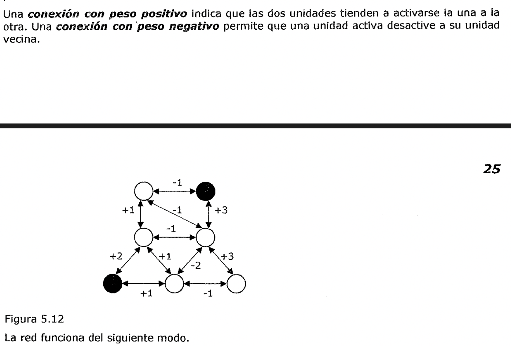

La red funciona del siguiente modo.

Se elige una unidad ***aleatoriamente.*** Si alguna de sus vecinas esta
activada, la unidad calcula la suma de los pesos en las conexiones de esas
unidades. Si la suma es positiva, la unidad se activa y si ocurre de modo
contrario, se desactiva.

Entonces se elige otra unidad aleatoriamente y se repite el proceso hasta que la
red alcanza un ***estado estable,*** es decir, hasta que no quede ninguna unidad
que pueda cambiar de estado. Este proceso se denomina ***relajación para/eta.***
Si la red comienza a trabajar en el estado que se muestra en la Figura 5.12, la
unidad de la esquina inferior izquierda tendera a activar la unidad que se
encuentra por encima de ella. Esta unidad, por otro lado, tendera a activar la
unidad que se encuentra por encima de ella, pero la conexión inhibidora que
procede de la unidad superior derecha aborta este intento, y así sucesivamente.

Esta red tiene unicamente cuatro estados estables distintos, que son los que se
*i* muestran en la Figura 5.13. Dado un estado inicial, la red necesariamente se
asentara en una de estas cuatro configuraciones. La red puede verse como un
*"almacenador"* de los patrones de la Figura 5.13.

***La mayor contribución de las redes de Hopfield/d* es *la de mostrar que dado
un conjunto de pesos y un estado inicial, su algoritmo de relajación para/eta en
algún momento llevara a la red hacia un estado.estable. No puede no existir
divergencia u oscilación.***

+2 +3 +2 +3

+1 -1 +1 -1

Figura 5.13

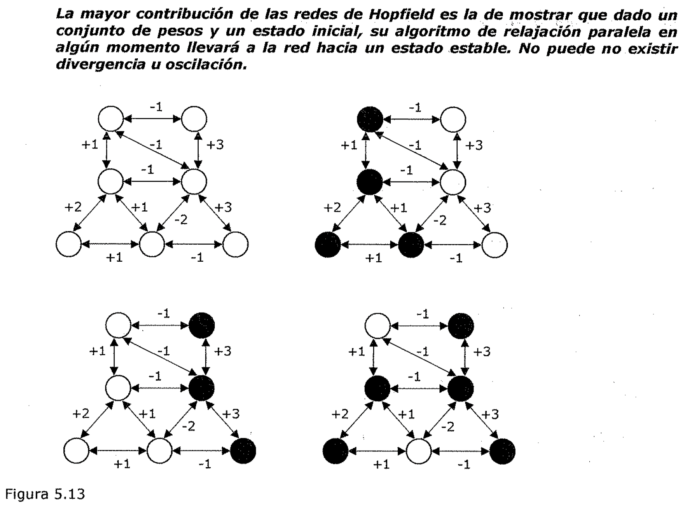

La red se puede utilizar como una memoria direccionable por contenido haciendo
que las actividades de las unidades se correspondan con un patrón parcial. Para
recuperar un patrón, unicamente se necesita una parte de el. Entonces la red se
asentara en el. estado estable que mejor se empareje con el patrón parcial. En
la Figura 5.14 se muestra un ejemplo de lo anterior.

Figura 5.14

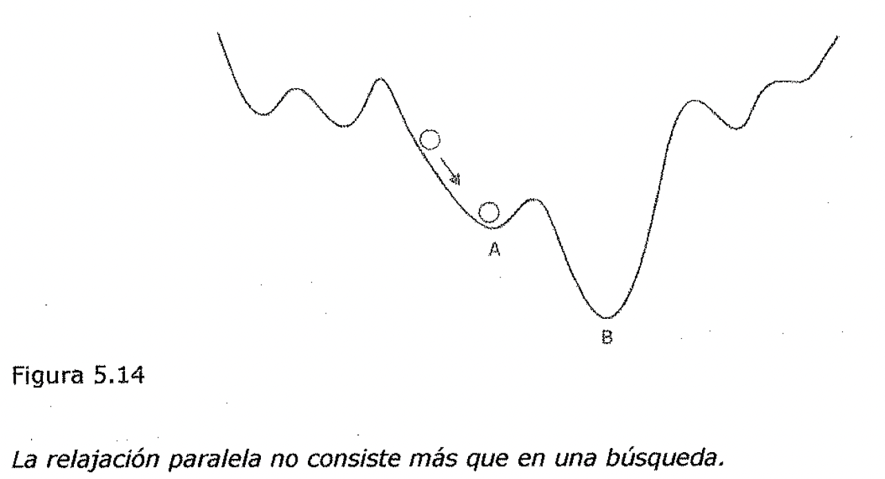

*La relajación para/eta no consiste más que en una búsqueda.* *Resulta útil
pensar en los diferentes estados de una red* como *formando un espacio de
búsqueda como se muestra en la Figura 5.15.* *Un estado que se haya e/elegido
aleatoriamente se transformara a sí mismo en uno del tipo de mínimo local que es
el estado estable más cercano. Esta* es *la forma de obtener un comportamiento
direccionable por contenido.* *También tenemos un comportamiento corrector de
errores.* Supóngase que se tiene la descripción "gris, grande, pez, que come
plancton". Automáticamente imaginaremos una ballena, aun sabiendo que esta es un
mamífero y no un pez. Por tanto aun cuando en el estado inicial existan
inconsistencias, la red de Hopfield se asentara en la solución que viole el
menor número posible de restricciones que ofrecen las entradas. Los
procedimientos tradicionales de emparejamiento-y-recuperación son menos
prohibitivos.

Ahora supóngase que una unidad falla de repente haciéndose activa o inactiva
cuando no debe. Esto no representaría mayor problema, ya que las unidades que le
rodean rápidamente volverían a ponerla en el camino correcto.

Seria necesario el esfuerzo de muchas unidades erróneas para hacer que la red se
saliera de un estado estable. En las redes compuestas por miles de unidades
altamente interconectadas, *dicha tolerancia al fa/lo es todavía más patente, ya
que las unidades y las conexiones pueden desaparecer completamente sin afectar
de un modo adverso el comportamiento general de la red.*

Figura 5.15

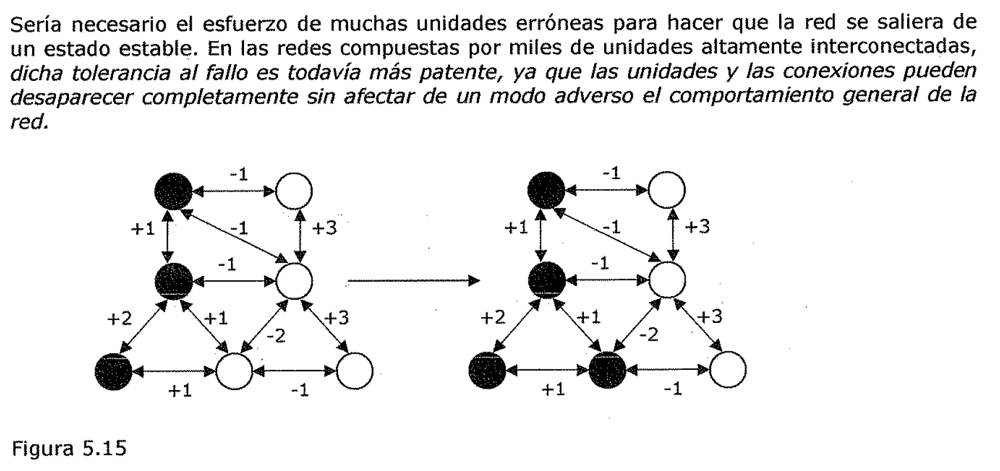

### Máquinas de Boltzmann

Una ***máquina de Boltzmann*** es una variación de una red de Hopfield.

Recuerde que *en una red de Hopfield las unidades se conectan entre sí con pesos
simétricos.* Las unidades actualizan sus valores de forma asíncrona observando
sus conexiones locales con *r* otras unidades.

Las redes de Hopfield, además de servir como memorias direccionables por
contenido, pueden resolver varios *problemas de verificación de restricciones.*
La idea es contemplar cada unidad como una *"hipótesis",* y situar pesos
positivos entre las unidades que representen hipótesis compatibles o que se
apoyan mutuamente, y pesos negativos en las conexiones entre unidades
incompatibles. Como una red de Hopfield converge hacia un estado estable,
intenta asignar la certeza o falsedad de las distintas hipótesis al violar el
menor número de restricciones posibles.

***El principal problema de las redes de Hopfield* es *que convergen hacia
mínimos locales.*** *Tener muchos mínimos locales es adecuado para construir una
memoria direccionable por contenido, pero para las tareas de verificación de
restricciones es necesario encontrar el estado globalmente óptima de la red.
Este estado se corresponde con una interpretación que satisfaga tantas
restricciones como sea posible.* *Desafortunadamente, las redes de Hopfield no
pueden encontrar soluciones globales porque se sitúan en las estados estables
por medio de un algoritmo completamente distribuido.* Si una red alcanza un
estado estable como el de la Figura 5.15, ninguna unidad querrá cambiar su
estado para moverse hacia arriba. Así, la red nunca alcanzara el estado óptimo
B. Si varias unidades deciden cambiar su estado simultáneamente, la red podría
escalar la subida y descansar sobre el estado B. Es necesaria una forma de
situar las redes en los estados globalmente óptimos si mantenemos nuestro
enfoque de algoritmo distribuido.

A la vez que se desarrollaron las redes de Hopfield, apareció en la literatura
una nueva técnica de búsqueda denominada ***enfriamiento simulado.*** ***El
enfriamiento simulado,* es *una técnica para encontrar soluciones globalmente
óptimas en problemas combinatorios.*** Hinton y Sejnowsky (1986) combinaron las
redes de Hopfield y el enfriamiento simulado para producir redes denominadas
***máquinas de Boltzmann.*** Para entender como se aplica el enfriamiento,
vuelva a la Figura 5.15 e imagínela como una caja negra.

Imagine una bola rodando por la caja. Si no puede verse dentro de la caja negra,
¿Cómo podríamos convencer a la bola para que se vaya al valle más profundo?
Sacudiendo la caja, por supuesto.

- Si se sacude demasiado violentamente, la bola podrá saltar de un valle a otro
  aleatorio. Esto es, si la bola estaba en el valle A, podría saltar al valle B;
  pero si la bola estaba en

el valle B, esta podría saltar al valle A.

- Sin embargo, si se sacude con demasiada suavidad, la bola podría saltar dentro
  de! valle A, pero nunca saltar a otro valle.

- La solución que sugiere el enfriamiento es sacudir la caja violentamente al
  principio, y gradualmente ir haciéndolo más suavemente. En algún punto, la
  probabilidad de saltar de A a B es mayor que la de saltar de B a A. Sera muy
  probable que de esta forma la bola se encuentre en el valle B, y como cada vez
  la sacudida es más swive, sera incapaz de escapar de el. Esto es justo lo que
  queremos.

#### ¿Cómo se implementa esta idea en una red neuronal?

*Las unidades de las máquinas de Boltzmann actualizan sus estados binarios
individuales mediante una regla estocástica, en lugar de una determinista.* La
probabilidad de que una determinada unidad se active viene dada por p:

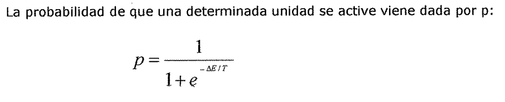

*p* = *-M:IT*

donde LI.E es la suma de las líneas de entrada activas de las unidades, y T es
la *"temperatura"* de la red.

La actualización estocástica de las redes es muy similar a la actualización de
las redes de Hopfield, excepto en el factor que introduce la temperatura.

*A altas temperaturas, las unidades presentan un comportamiento aleatorio,
mientras que a temperaturas bajas, las unidades se comportan coma redes de
Hopfield.* ***El enfriamiento* es *el proceso de ir gradualmente de altas a
bajas temperaturas. La aleatoriedad que añade la temperatura ayuda a la red a
escapar de los mínimos locales.*** Se trata de un procedimiento de aprendizaje
para las máquinas de Boltzmann, es decir, un procedimiento que asigna pasos a
las conexiones entre las unidades dando un conjunto de estados iniciales y
finales de entrenamiento.

*Si el enfriamiento* se *produce de forma adecuada, las máquinas de Boltzmann
podrían evitar las mínimos locales y aprender a ca/cu/ar cualquier función
calculable de entradas y salidas de tamaño fijo.*

### Redes recurrentes

Una clara deficiencia de los modelos de redes neuronales en comparación con los
m.modelos simbólicos, es la *dificultad en conseguir modelos de redes neuronales
que traten tareas de IA temporales coma la planificación y el análisis del
lenguaje natural.* ***Las redes recurrentes, o redes con lazos, constituyen un
intento de remediar esta situación.*** Considere que se intenta enseñar a una
red como lanzar un balón de básquet para que enceste.

A la red se le presenta una situación de entrada (distancia y altura del aro,
posición inicial de los músculos), pero es necesario más de un vector de salida.

Se necesita una serie de vectores de salida: el primero mueve los músculos de
este modo, luego de este modo, luego de este modo, etc.

Jordan (1986) inventó una red que hada algo similar a esto. Se muestra en la
Figura 5.16. Las unidades de salida simultáneamente dan órdenes (por ejemplo,
mover el brazo x a la posición y) y actualizan las unidades de estado.

***La red nunca converge hacia un estado estable. En lugar de esto, cambia en
cada paso de tiempo.*** Unidades de

estado

Figura 5.16

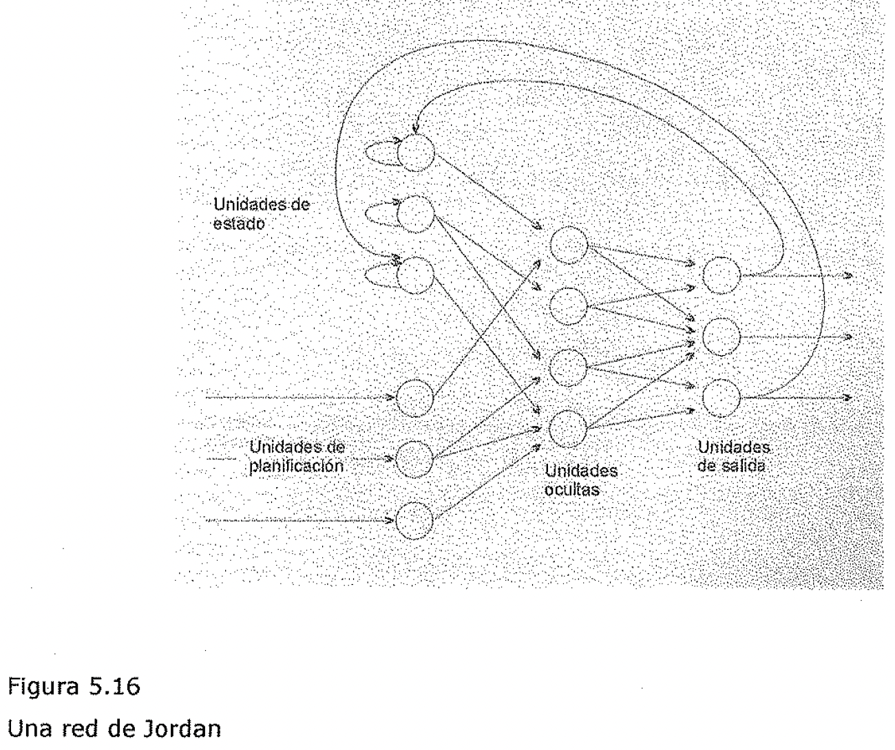

Una red de Jordan

Las redes recurrentes se pueden entrenar mediante el algoritmo de propagación
hacia atrás.

***En cada paso* se *comparan las activaciones de las unidades de salida con las
activaciones deseadas y* se *propagan los errores hacia atrás por la red.***
Cuando se completa el entrenamiento, la red podrá llevar a cabo una secuencia de
acciones.
