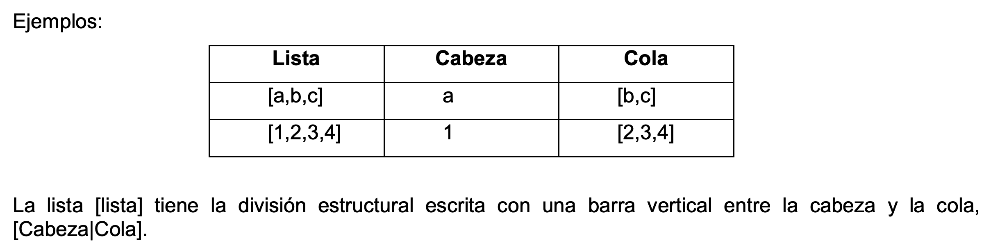

# Estructuras de datos
En la mayoría de las aplicaciones se necesita emplear tipos de datos más
complejos que los que se han utilizado hasta el momento. La habilidad de crear
estructuras de datos es fundamental para cualquier tipo de cálculo práctico.
Prolog no sólo permite argumentos más complejos, sino que también tiene varias
características incorporadas para manipular listas de datos. Incluso tiene
predicados incorporados para operar con cadenas como si fueran listas.

## Listas
La lista es una secuencia ordenada de elementos que puede tener cualquier
longitud. Ordenada significa que el orden de los elementos en la secuencia es
significativo. Los elementos pueden ser cualquier término (constantes,
variables). Una lista se representa mediante corchetes y la separación de cada
elemento se realiza mediante una coma (“,”).

Ejemplos:

- Lista de enteros [1,2,3,5,8,13]

- Lista de caracteres [a,s,d,f,g,h,j,k,l,n]

- Lista de cadenas [laura,marco,franco,renzo]

- Lista vacía [ ]

### Identificación de la cabeza y la cola
El Prolog trabaja sobre una lista dividiéndola en cabeza y cola. La cabeza de
una lista es el primer elemento de la izquierda. La cola es el resto de la
lista, es decir, es a su vez una lista que contiene todos los elementos menos el
primero. Ejemplos:

Lista Cabeza Cola [a,b,c] a [b,c] [1,2,3,4] 1 [2,3,4]

La lista [lista] tiene la división estructural escrita con una barra vertical
entre la cabeza y la cola, [Cabeza|Cola]. Las palabras “Cabeza” y “Cola” se
utilizan como variables. Se podría haber usado cualquier otro nombre de
variables. Por ejemplo, [X|Y] representa una lista con cabeza “X” y cola “Y”.
Debido a que una lista es solo otro tipo de objeto, debe encerrarse entre
paréntesis cuando se utilice en una cláusula, como se muestra aquí:
predicado([lista]) He aquí otro ejemplo: predicado([Cabeza|Cola])

### Recursividad en listas
Muchas de las manipulaciones que se ejecutan sobre listas se escriben fácilmente
como operaciones recursivas - operaciones que se llaman a sí mismas -. Un
ejemplo sencillo es comprobar si un objeto particular es un elemento de una
lista.

Pertenencia a una lista Supongamos que tenemos una lista en la que X representa
la cabeza e Y representa la cola. La lista podría contener por ejemplo los
alumnos de quinto año de la UTN FRR. Supongamos ahora que queremos averiguar si
un alumno determinado pertenece a quinto año. La forma de hacer esto en Prolog
es averiguar si el mismo es el correspondiente a la cabeza de la lista, si esto
ocurre ya hemos resuelto el problema. De lo contrario, pasamos a mirar la cola
de la lista, ello implica mirar otra vez la cabeza de la misma, y así
sucesivamente hasta encontrar el alumno o el final de la lista (caso en el que
se puede afirmar que el alumno no pertenece a quinto año).

Caso práctico: Escribiremos un predicado pertenece de tal forma que
pertenece(X,Y) será verdadero si el término representado por X pertenece a la
lista representada por Y. En caso de que X no pertenezca a la lista Y, el
predicado pertenece será falso. Primero vemos si el elemento X es la cabeza de
la lista, de la siguiente manera: pertenece(X,[Y|\_]):-X=Y.

En caso de que sea verdadero el problema está resuelto, en caso contrario
buscamos si X es miembro de la cola de la lista, a la que llamamos Y. Esto es la
esencia de la Recursividad. pertenece(X,[\_|Y]):-pertenece(X,Y).

Que indica que X pertenece a la lista si X está incluido en la cola de la misma.
A continuación se muestra el programa completo:

inicio:- write('Ingrese alumno a buscar:
'),read(X),pertenece(X,['franco','renzo','marco']). /\* la siguiente línea
verifica si quedan elementos en la lista */ pertenece(X,[]):-write(X),write(' no
pertenece a quinto año.'). /* la siguiente línea verifica si X es igual a la
cabeza de la lista */ pertenece(X,[Y|\_]):-X=Y,write(X),write(' pertenece a
quinto año.'). /* la siguiente establece la recursividad \*/
pertenece(X,[\_|Y]):-pertenece(X,Y).

Las variables anónimas o blancas de cada cláusula significan que no hay que
preocuparse por la otra parte de la lista. Si un elemento está en la cabeza de
una lista, no hay que preocuparse por lo que sea la cola. Si un elemento está en
la cola, no hay que preocuparse por lo que sea la cabeza.

Ejemplo El siguiente ejemplo busca un determinado elemento en una lista
ingresada previamente. inicio:- write('Ingrese una lista de elementos:
'),leer(L),write('Ingrese elemento a buscar: '),read(A),buscar(A,L).
leer([H|T]):-read(H),H=[],leer(T). leer([]). buscar(_,[]):-write(‘No se encontró
el elemento’). buscar(H,\[H|_\]):-write('Se encontró el elemento’).
buscar(X,[\_|T]):-buscar(X,T).

## Cadenas
Prolog tiene varios predicados incorporados para manejar cadenas. Las cadenas
son secuencias de caracteres. A continuación se explican algunos predicados del
Prolog para el manejo de cadenas.

sub_atom(Cadena,ComienzoCad,CantidadCaracteres,CantidadCaracteresRestantes,SubCadena)
Este predicado permite obtener una sub-cadena de la cadena original. La
SubCadena comienza en ComienzoCad y tiene una longitud de CantidadCaracteres. En
CantidadCaracteresRestantes se indica la cantidad de caracteres que aún quedan
en la cadena después de la sub-cadena recortada.

?- sub_atom(‘abc’, 1, 1, A, S). A = 1, S = b

atom_length(Cadena,Longitud) Determina la cantidad de caracteres que conforman
la Cadena y la devuelve en Longitud.

?- atom_length(‘Laura’,Long). Long = 5

atom_number(Cadena,Numero) Si ambas variables están instanciadas devolverá
verdadero si el valor de Cadena coincide con el valor de Numero.

?- atom_number(‘123’,123). Yes

Si alguna de las variables no esta instanciada, el predicado devolverá en dicha
variable (cadena o numero integer o float) el valor correspondiente. ?-
atom_number(‘123’,N),X is N+2. N = 123 X = 125 ?- atom_number('123.2',N),X is
N+2. N = 123.2 X = 125.2 ?- atom_number(R,123). R = ‘123’

