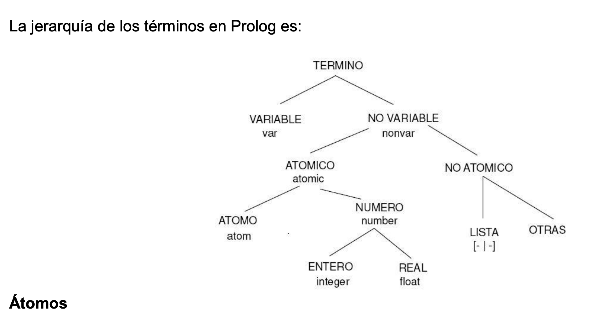
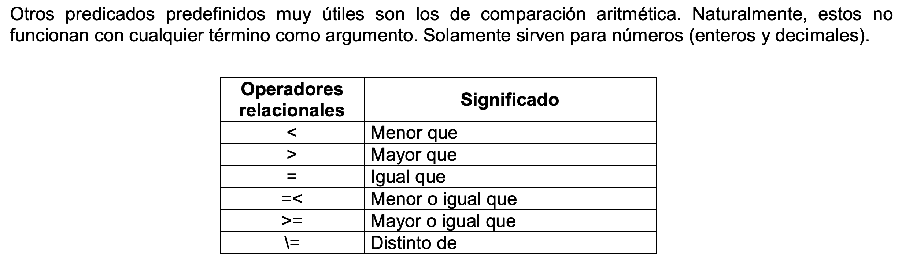
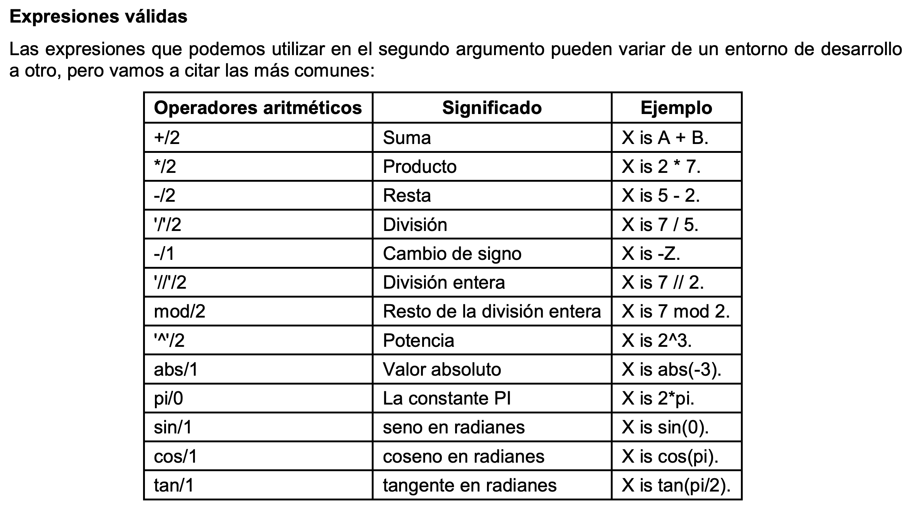

# Unidad Didáctica 6 - Eje Conceptual

Programación practica en Prolog

Universidad Tecnológica Nacional

Facultad Regional Rosario

Ingeniería en Sistemas de Información

Docentes: Ing. Laura Aquili Ing. Pablo Pistilli

(sec-unit-06-prolog-indice)=

## Indice

- CAPITULO 1 - (p. 3)
- Introducción - (p. 3)
- CAPITULO 2 - (p. 5)
- Relación con la Lógica - (p. 5)
- 2.1 Hechos - (p. 5)
- 2.2 Variables - (p. 6)
- 2.3 Reglas - (p. 6)
- 2.4 Cláusulas - (p. 7)
- 2.5 Preguntas - (p. 7)
- 2.6 Predicados y Objetivos - (p. 7)
- 2.7 Secuencia de objetivos - (p. 8)
- 2.8 Backtracking - (p. 9)
- 2.9 Ejemplos - (p. 10)
- CAPITULO 3 - (p. 12)
- Manipulación de datos - (p. 12)
- 3.1 Tipos de dominios estándares - (p. 12)
- 3.2 Entrada y salida de datos - (p. 13)
- 3.3 Predicados predefinidos - (p. 13)
- 3.4 Evaluación de expresiones aritméticas - (p. 14)
- 3.5 Recursividad - (p. 15)
- CAPITULO 4 - (p. 16)
- Estructuras de datos - (p. 16)
- 4.1 Listas - (p. 16)
- 4.1.1 Identificación de la cabeza y la cola - (p. 16)
- 4.1.2 Recursividad en listas - (p. 17)
- 4.2 Cadenas - (p. 18)
- CAPITULO 5 - (p. 19)
- Base de datos y Functores - (p. 19)
- 4.1 Base de datos - (p. 19)
- 4.2 Functores - (p. 22)

(sec-unit-06-prolog-capitulo-1-introduccion)=

## Capitulo 1. Introducción

Prolog es un lenguaje de programación que se utiliza para resolver problemas en
los que entran en juego objetos y relaciones entre objetos. Actualmente se ha
convertido en el principal entorno de programación para Inteligencia Artificial
(IA), una de las principales áreas de aplicación de las computadoras que está
emergiendo. También se puede hacer virtualmente cualquier cosa en Prolog como
podría hacerlo con cualquier otro lenguaje de programación, incluyendo juegos,
contabilidad, gráficos y simulación. PROLOG no es siempre el lenguaje más
práctico o eficiente para algunas aplicaciones, pero pueden igualmente
realizarse con él. Para los programadores que investigan IA, el Prolog ofrece un
método diferente de trabajo al empleado por los lenguajes más familiares, tales
como Basic, Cobol, Pascal y C.

### 1.1 Una breve historia del Prolog

Prolog significa “PRProgramming LOGic”, es decir programación basada en la
lógica y es un lenguaje de programación de computadoras que fue inventado
alrededor de 1970 por Alain Colmenauer y sus colegas de la Universidad de
Marsella, Francia. Rápidamente el Prolog se convirtió en el lenguaje principal
para IA en Europa, mientras que Lisp (otro lenguaje de programación para IA) se
usaba principalmente por los programadores de los Estados Unidos. A finales de
los años ’70 comenzaron a aparecer versiones de Prolog para microcomputadoras.
Uno de los compiladores de Prolog más populares fue el MicroProlog, pero éste no
ofrece la misma riqueza de predicados. No existió mucho interés por el Prolog
hasta que los científicos japoneses lanzaron su famoso proyecto de la quinta
generación con el objetivo de diseñar nuevas computadoras y software. De
repente, la gente comenzó a mirar de otra forma el Prolog y sus posibilidades.

### 1.2 ¿Para qué sirve Prolog?

Los lenguajes de computadoras son raramente buenos para todos los tipos de
problemas. Fortran fue usado principalmente por los científicos y matemáticos,
mientras que Cobol fue usado principalmente en el mundo comercial. A las
implementaciones del Prolog les falta la habilidad para manejar problemas sobre
“números” o “procesamiento de texto”; en su lugar, Prolog está diseñado para
manejar “problemas lógicos” ( es decir, problemas en los que se necesitan tomar
decisiones en forma ordenada). Intenta hacer que la computadora “razone” la
forma de encontrar una solución. Es particularmente adecuado para diferentes
tipos de problemas de inteligencia artificial.

### 1.3 Lenguaje Procedural vs. Lenguaje Declarativo

La mayoría de los lenguajes de computadoras personales –Basic, Pascal, Cobol,
etc- han sido procedurales. Tales lenguajes permiten al programador decirle a la
computadora lo que tiene que hacer, paso a paso, procedimiento por
procedimiento, hasta alcanzar una conclusión. El Prolog no es procedural, es
declarativo, necesita que se declaren reglas y hechos sobre símbolos específicos
y luego se le pregunte sobre si un objetivo concreto se deduce lógicamente a
partir de los mismos. Mientras que un lenguaje procedural le exige que
introduzca el recipiente y los ingredientes, un lenguaje declarativo sólo le
pide les ingredientes y el objetivo. Se declara la situación con la que se
quiere trabajar y donde quiere ir, el propio lenguaje realiza el trabajo de
decidir cómo alcanzar dicho objetivo. La diferencia entre lenguaje declarativo y
procedural es una de las razones por la que la implementación de un lenguaje
como Prolog es una herramienta tan buena para desarrollar aplicaciones con IA,
especialmente cuando se lo compara con otros lenguajes. Al trabajar con un
lenguaje declarativo se da información sobre un determinado tema, se definen las
relaciones que existen entre estos datos y finalmente se construyen preguntas o
cuestionamientos sobre

todo el paquete, quedándole al lenguaje la tarea de elaborar las conclusiones
mediante un razonamiento lógico.

### 1.4 Inteligencia Artificial (IA): Visión General

Determinar qué es un programa inteligente implica que se conoce lo que significa
inteligencia: capacidad o habilidad para percibir hechos y proposiciones y sus
relaciones y razonar sobre ellos. Esencialmente significa pensar. Esta
definición implica solamente inteligencia humana, no admite la posibilidad de
que una máquina pueda pensar, ya que los programas no hacen la misma tarea de la
misma forma que una persona. Que un programa sea inteligente requiere que actúe
inteligentemente, como un ser humano. Un programa inteligente exhibe un
comportamiento similar al de un humano cuando se enfrenta a un problema similar.
No es necesario que el programa resuelva concretamente o intente resolver el
problema igual que un humano. Obsérvese que el programa no necesita pensar como
un humano, pero debe actuar como tal. Es difícil establecer una fecha de
comienzo para lo que es comúnmente llamado IA. El primer paso se le atribuye a
Alan M. Turing por su invención de la computadora de programas almacenados.
Determinó que un programa podía ser almacenado como dato en la memoria de la
computadora y ejecutarlo más tarde. Anteriormente las computadoras fueron
máquinas dedicadas que debían ser recableadas para diferentes problemas. El
almacenamiento de programas permitía entonces cambiar la función de la
computadora fácil y rápidamente. El término inteligencia artificial se imputa a
Marvin Minsky, investigador del MIT (Massachusetts Institute of Technology)
quien escribió un articulo titulado “Pasos de la Inteligencia Artificial” (enero
1961), que explicaba la posibilidad de hacer pensar a las computadoras. Al final
de los años ’70 se habían alcanzado varios éxitos, tales como el procesamiento
de lenguaje natural, representación del conocimiento y resolución de problemas
en áreas específicas de la IA. Los dos problemas más significativos de IA son
los sistemas expertos y el procesamiento de lenguaje natural. A saber:

#### 1.4.1 Sistema Experto

Es un programa de computadora que contiene conocimientos acerca de un
determinado campo y cuando es interrogado responde como un experto humano.
Contiene información (una base de conocimientos) y una herramienta para
comprender las preguntas y responder la respuesta correcta examinando la base
(esto es, motor de inferencia). El Prolog tiene incorporado estructuras para la
creación de bases de conocimientos y un motor de inferencia.

#### 1.4.2 Procesamiento de Lenguaje Natural

El Procesamiento de lenguaje natural es la técnica que fuerza a las computadoras
a entender el lenguaje humano. Los científicos que estudian el Procesamiento de
lenguaje natural esperan crear un hardware y software que permita escribir por
ejemplo: “llevar el archivo del swi-prolog al directorio del Prolog” y haga que
la computadora siga dichas directrices. El Prolog puede usar la idea de una base
de conocimientos y un motor de inferencias para dividir el lenguaje humano en
diferentes partes y relaciones y así intentar comprender su significado
detectando palabras claves.

#### 1.4.3 Áreas más importantes de la Inteligencia Artificial

El campo de la IA se compone de varias áreas de estudio:

- Búsqueda (de soluciones).
- Sistemas expertos.
- Procesamiento del lenguaje natural.
- Robótica
- Lógica.

(sec-unit-06-prolog-capitulo-2-relacion-con-la-logica)=

## Capitulo 2. Relación con la Lógica

Como su nombre lo indica, el Prolog se basa en manipulaciones lógicas;
posibilita al programador especificar sus problemas en forma lógica, en lugar de
en términos de construcciones convencionales de programación sobre lo que debe
hacer la computadora y en qué momento. Si queremos analizar cómo se relaciona
Prolog con la lógica debemos establecer primero que es lo que significa lógica:
la lógica se desarrolló, originalmente, como una forma de representar argumentos
de manera que fuera posible comprobar si estos eran válidos o no. Se puede
utilizarla lógica para expresar objetos, relaciones entre objetos y cómo pueden
inferirse en forma válida algunos objetos a partir de otros. Por ejemplo, cuando
decimos “Eduardo tiene una PC” estamos expresando una relación entre el objeto
“Eduardo” y otro “una PC”; además la relación tiene un orden específico: ¡es
Eduardo quien tiene una PC y no una PC quien tiene a Eduardo! Cuando realizamos
la pregunta ¿Tiene Eduardo una PC? lo que estamos haciendo es indagar sobre una
relación. Prolog trabaja con lógica proposicional, también conocida como lógica
de predicados o cálculo proposicional. Prolog hace que la computadora maneje la
parte de inferir. Tiene un motor de inferencia incorporado que automáticamente
busca los hechos y construye conclusiones lógicas. La programación de
computadoras en Prolog consiste en:

- Declarar algunos hechos sobre los objetos y sus relaciones,
- Definir algunas reglas sobre los objetos y sus relaciones, y
- Hacer preguntas sobre los objetos y sus relaciones.

Podemos considerar a Prolog como un almacén de hechos y reglas, que utiliza a
éstos para responder las preguntas, proporciona los medios para realizar
inferencias de un hecho a otro. Se puede considerar a Prolog como un lenguaje
coloquial, lo cual significa que el programador y la computadora sostienen una
especie de conversación.

### 2.1 Hechos

La primera forma de combinar un objeto y una relación es usarlas para definir un
hecho, la sintaxis de Prolog es:

Relación (objeto).

Supongamos que queremos decir a Prolog el hecho de que “a Eduardo le gusta la
PC”, en Prolog debemos escribir:

le_gusta_a(Eduardo,pc).

Observe que el objeto está entre paréntesis y la relación le precede, lo que
quiere decir que este objeto tiene esa relación. La relación se conoce como el
predicado y el objeto como el argumento.

Los siguientes puntos son importantes:

- Los nombres de todos los objetos y relaciones deben comenzar con letra
  minúscula.
- Primero se escribe la relación y luego los objetos separándolos mediante comas
  y encerrados entre paréntesis.
- Al final del hecho debe ir un punto (el carácter “.”).
- El carácter “\_” en el nombre del predicado indica que todo es una única
  palabra para una relación.
- Dos hechos coinciden si sus predicados son lo mismo (se escriben de igual
  forma) y si cada uno de los correspondientes argumentos son iguales entre sí.

### 2.2 Variables

En Prolog no sólo se pueden nombrar determinados objetos, sino que también se
pueden utilizar nombres como X que representen objetos a los que el mismo Prolog
les dará ese valor, este tipo de nombres es o que se llama variables. Cuando el
lenguaje Prolog utilicé una determinada variable esta puede estar Instanciada o
no instanciada. El primer caso se da cuando existe un objeto determinado,
representando por la variable, en caso contrario, una variable no está
instanciada cuando, todavía no se conoce lo que representa.

Las variables deben comenzar con letra mayúscula.

Cuando se intenta establecer una relación que contenga una variable, Prolog
efectuará una búsqueda recorriendo todos los hechos que él tiene almacenados
para encontrar un objeto que pueda ser representado por la variable. Por
ejemplo, cuando preguntamos ¿le gusta X a Eduardo?, Prolog buscará entre todos
sus hechos para encontrar cosas que le gusten a Eduardo.

Una variable X no nombra un objeto en particular sino que se puede utilizar para
representar objetos que no podamos nombrar. Por ejemplo, no podemos nombrar un
objeto como algo que le gusta a Eduardo, de forma que Prolog adopta una forma de
expresar esto.

En vez de preguntar le_gusta_a(eduardo, Algo que le gusta a eduardo).

podemos utilizar le_gusta_a(eduardo, X).

Observación: Las variables pueden tener nombres más largos. Por ejemplo: Algo
que le gusta a eduardo.

A veces es necesario utilizar una variable aunque su nombre no se utilice nunca,
supongamos que queremos averiguar si a alguien le gusta Eduardo, pero no estamos
interesados en saber quien, entonces utilizamos la variable anónima. Esta
variable es un único carácter de subrayado.

le_gusta_a(\_,eduardo).

Se utiliza para evitar el tener que imaginar continuamente diferentes nombres de
variables cuando no se van a utilizar en ningún otro sitio de la cláusula.

### 2.3 Reglas

En Prolog se usa una regla cuando se quiere significar que un hecho depende de
otros hechos. Por ejemplo, si queremos afirmar que a Eduardo le gustan todas las
pc’s del mercado, habría que escribir hechos por separado, así:

le_gusta_a(eduardo, ibm). le_gusta_a(eduardo, compaq). le_gusta_a(eduardo,
hacer). le_gusta_a(eduardo, falcon). ....

Así sucesivamente para cada una de las pc’s que tengamos.

En Prolog una regla consiste una cabeza y un cuerpo. Estas partes se encuentran
separadas mediante el símbolo “:-”; que está compuesto de un signo de dos puntos
y de un guión. Este símbolo es equivalente a “si”.

La cabeza describe qué hecho es el que la regla intenta definir, mientras que el
cuerpo describe la conjunción de objetivos que deben satisfacerse, uno tras
otro, para que la cabeza sea cierta.

es(compaq, pc). es(falcon, pc).

.... le_gusta_a(eduardo, objeto):-es(objeto, pc).

Una forma más simple de decir que a Eduardo le gustan todas las pc es decir que
a Eduardo le gusta cualquier objeto siempre que sea una pc. Este hecho se da en
forma de una regla sobre lo que le gusta a Eduardo, en vez de dar la relación de
todas las pc que le gustan a Eduardo.

La regla es mucho más compacta que una lista de hechos. Las reglas hacen que el
Prolog pase de ser sólo un diccionario o una base de datos, en el que se pueda
buscar, a ser una máquina lógica, pensante.

Ejemplo de reglas:

- Marco compra vino si es más barato que la cerveza.
- X es un pájaro si: X es un animal y X tiene plumas.

Una regla es una afirmación general sobre objetos y sus relaciones. Así podemos
permitir que una variable represente un objeto diferente en casa uso distinto de
la regla. Por ejemplo:

a Marco le gusta cualquiera a la que le guste el vino, o en otras palabras, a
Marco le gusta algo si a esto le gusta el vino, con variable, a Marco le gusta X
si a X le gusta el vino.

El ejemplo anterior se escribe en Prolog de la siguiente forma:

le_gusta_a(marco, X):- le_gusta_a(X, vino).

### 2.4 Cláusulas

Utilizaremos la palabra cláusula siempre que nos refiramos a un hecho o a una
regla. Existen dos formas de dar información a Prolog sobre un predicado dado,
como le_gusta_a. Podemos darle tanto hechos como reglas. En general, un
predicado está definido por una mezcla de hechos y reglas. A uno y otras se las
denomina como cláusulas de un predicado. Por ejemplo consideremos la regla:

Una persona puede robar una cosa si la persona es un ladrón y le gusta la cosa y
la cosa es valiosa.

En Prolog sería: puede_robar(X,Y):- ladrón(X), le_gusta_a(X,Y), valiosa(Y).

El predicado puede_robar significa que alguna persona X puede robar alguna cosa
Y. Esta cláusula depende de las cláusulas le_gusta_a y valiosa.

### 2.5 Preguntas

Una vez que tengamos algunos hechos podemos hacer alguna pregunta acerca de
ellos. En Prolog una pregunta se representa igual que un hecho Cuando se hace
una pregunta Prolog efectúa una búsqueda por toda la base de datos, localizando
hechos que coincidan con el hecho en cuestión. Si se encuentra uno que coincida
se responderá sí (Yes/True), por el contrario si no se encuentra, la respuesta
será no (No/False).

### 2.6 Predicados y Objetivos

Los predicados son las relaciones, los elementos ejecutables en Prolog. Una
llamada concreta a un predicado, con unos argumentos concretos, se denomina
objetivo (en inglés, goal). Todos los objetivos tienen un resultado de éxito o
fallo tras su ejecución, indicando si el predicado es cierto para los argumentos
dados, o por el contrario, es falso. Cuando un objetivo tiene éxito las
variables libres que aparecen en los argumentos pueden quedar instanciadas.
Estos son los valores que hacen cierto el predicado. Si el predicado falla, no
ocurren ligaduras en las variables libres.

Ejemplo El caso básico es aquél que no contiene variables:
son_hermanos('Juan','Maria'). Este objetivo solamente puede tener una solución
(verdadero o falso). Si utilizamos una variable libre: son_hermanos('Juan',X),
es posible que existan varios valores para dicha variable que hacen cierto el
objetivo. Por ejemplo para X ='Maria', y para X ='Luis'. También es posible
tener varias variables libres: son_hermanos(Y,Z). En este caso obtenemos todas
las combinaciones para las variables que hacen cierto el objetivo. Por ejemplo,
Y ='Juan' y Z ='Maria' es una solución. Y ='Juan' y Z ='Luis' es otra solución.

### 2.7 Secuencia de objetivos

Hasta ahora hemos visto como ejecutar objetivos simples, pero esto no resulta
demasiado útil. En Prolog los objetivos se pueden combinar mediante conectivas
propias de la lógica de primer orden: la conjunción, la disyunción y la
negación. La conjunción es la manera habitual de ejecutar secuencias de
objetivos que Prolog deberá satisfacer uno después del otro. El operador de
conjunción es la coma (and). Por ejemplo: edad(luis,Y),edad(juan,Z),Y>Z.
Analicemos qué ocurre con la instanciación de las variables:

- En primer lugar, los objetivos se ejecutan secuencialmente por orden de
  escritura (es decir, de izquierda a derecha).
- Si un objetivo falla, los siguientes objetivos ya no se ejecutan. Además, la
  conjunción en total falla.
- Si un objetivo tiene éxito, algunas o todas sus variables quedan ligadas, y
  por ende, dejan de ser variables libres para el resto de objetivos en la
  secuencia.
- Si todos los objetivos tienen éxito, la conjunción tiene éxito y mantiene las
  ligaduras de los objetivos que la componen.

Supongamos que la edad de Luis es 32 años, y la edad de Juan es 25:

- La ejecución del primer objetivo tiene éxito e instancia la variable "Y", que
  antes estaba libre, al valor 32.
- Llega el momento de ejecutar el segundo objetivo. Su variable "Z" también
  estaba libre, pero el objetivo tiene éxito e instancia dicha variable al valor
  25\.
- Se ejecuta el tercer objetivo, pero sus variables ya no están libres porque
  fueron instanciadas en los objetivos anteriores. Como el valor de "Y" es mayor
  que el de "Z" la comparación tiene éxito.
- Como todos los objetivos han tenido éxito, la conjunción tiene éxito, y deja
  las variables "Y" y "Z" instanciadas a los valores 32 y 25 respectivamente.

El operador de disyunción (or) es el punto y coma. Tendrá éxito si se cumple
alguno de los objetivos que la componen. La disyunción lógica también se puede
representar mediante un conjunto de sentencias alternativas, es decir, poniendo
cada miembro de la disyunción en una cláusula aparte. Esta última será la forma
en la que trabajaremos en el desarrollo de nuestros programas en Prolog.

El operador de negación es not. El predicado not/1 antes de la llamada a un
predicado P, cambia su valor de verdad, es decir, si el predicado P tiene éxito
, not(P) fallará y si el predicado P falla, not(P) tendrá éxito. Ejemplo:
observa(juan,brenda). observa(marco,felicia). observa(federico,felicia).

feliz(X):- not(observa(X,felicia)).

- La regla feliz(X):- not(observa(X, felicia)) indica que alguien puede ser
  feliz sólo si no está observando a felicia.
- Si invocamos el objetivo feliz(marco), obtendremos la respuesta “No”.
- En otras palabras, la parte izquierda de la regla, “feliz(marco)”, es solo
  verdad si la parte derecha, “observa(marco, felicia)”, no es verdad. Pero la
  parte derecha es verdad. Un hecho muestra que es verdad.
- Por lo tanto, la parte derecha de la regla fallará como objetivo temporal;
  luego la parte izquierda fallará como posible cumplimiento del objetivo
  original y finalmente el Prolog nos informará que el objetivo original falla o
  no se cumple.

### 2.8 Backtracking

El mecanismo empleado por PROLOG para satisfacer las cuestiones que se le
plantean, es el de razonamiento hacia atrás (backward) complementado con la
búsqueda en profundidad (depth first) y la vuelta atrás o reevaluación
(backtracking). Razonamiento hacia atrás significa que partiendo de un objetivo
a probar, busca las aserciones que pueden probar el objetivo. Si en un punto
caben varios caminos, se recorren en el orden que aparecen en el programa, esto
es, de arriba a abajo y de izquierda a derecha. Backtracking: Si en un momento
dado una variable se instancia con determinado valor con el fin de alcanzar una
solución, y se llega a un camino no satisfactorio, el mecanismo de control
retrocede al punto en el cual se instanció la variable, la des-instancia y si es
posible, busca otra instanciación que supondrá un nuevo camino de búsqueda. Se
puede ver esta estrategia sobre un ejemplo: Supongamos la pregunta:
?-puede_casarse_con(maría, X). PROLOG recorre la base de datos en busca de un
hecho que coincida con la cuestión planteada y halla la regla:
puede_casarse_con(X, Y) :- quiere_a(X, Y), hombre(X), mujer(Y). produciéndose
una coincidencia con la cabeza de la misma, y una instanciación de la variable X
de la regla con el objeto 'maría'. Tendremos por lo tanto: (1)
puede_casarse_con(maría, Y) :- quiere_a(maría, Y), hombre(maría), mujer(Y).

A continuación, se busca una instanciación de la variable Y que haga cierta la
regla, es decir, que verifique los hechos del cuerpo de la misma. La nueva meta
será : (2) quiere_a(maría, Y).

De nuevo PROLOG recorre la base de datos. En este caso encuentra un hecho que
coincide con el objetivo: quiere_a(maría, enrique).

instanciando la variable Y con el objeto 'enrique'. Siguiendo el orden dado por
la regla (1), quedan por probar dos hechos una vez instanciada la variable Y:
hombre(maría), mujer(enrique). Se recorre de nuevo la base de datos, no hallando
en este caso ninguna coincidencia con el hecho hombre(maría). Por lo tanto,
PROLOG recurre a la vuelta atrás, des-instanciando el valor de la variable Y, y

retrocediendo con el fin de encontrar una nueva instanciación de la misma que
verifique el hecho (2). Un nuevo recorrido de la base de hechos da como
resultado la coincidencia con: quiere_a(maría, susana). Se repite el proceso
anterior. La variable Y se instancia con el objeto 'susana' y se intentan probar
los hechos restantes: hombre(maría), mujer(susana).

De nuevo se produce un fallo que provoca la des-instanciación de la variable Y,
así como una vuelta atrás en busca de nuevos hechos que coincidan con (2). Una
nueva reevaluación da como resultado la instanciación de Y con el objeto 'ana'
(la ultima posible), y un nuevo fallo en el hecho: hombre(maría).

Una vez comprobadas sin éxito todas las posibles instanciaciones del hecho (2),
PROLOG da por imposible la regla (1), se produce de nuevo la vuelta atrás y una
nueva búsqueda en la base de datos que tiene como resultado la coincidencia con
la regla: (3) puede_casarse_con(maría, Y) :- quiere_a(maría, Y), mujer(maría),
hombre(Y).

Se repite todo el proceso anterior, buscando nuevas instanciaciones de la
variable Y que verifiquen el cuerpo de la regla. La primera coincidencia
corresponde al hecho quiere_a(maría, enrique). que provoca la instanciación de
la variable Y con el objeto 'enrique'. PROLOG tratar de probar ahora el resto
del cuerpo de la regla con las instanciaciones actuales: mujer(maría),
hombre(enrique).

Un recorrido de la base de datos, da un resultado positivo en ambos hechos,
quedando probado en su totalidad el cuerpo de la regla (3) y por lo tanto su
cabeza, que no es más que una de las soluciones al objetivo inicial. X = enrique

PROLOG utiliza un mecanismo de búsqueda independiente de la base de datos.
Aunque pueda parecer algo ilógico, es una buena estrategia puesto que garantiza
el proceso de todas las posibilidades. Es útil para el programador conocer dicho
mecanismo a la hora de depurar y optimizar los programas.

### 2.9 Ejemplos

Supongamos entonces la siguiente base de conocimientos:

edad(juan,25). edad(franco,10). edad(luis,32). edad(renzo,38). edad(marco,7).

1. Veamos un predicado compuesto por una simple cláusula:

es_menor(Individuo):- edad(Individuo,Valor),Valor < 18.

- Invocamos el objetivo: es_menor(luis).
- Según nuestra base de conocimiento, la edad de luis es 32 años, es decir, el
  objetivo edad(luis,32) tiene éxito.
- Primero se unifica la cabeza de la cláusula con el objetivo. Es decir,
  unificamos es_menor(luis) y es_menor(Individuo), produciéndose la ligadura de
  la variable Individuo al valor luis. Como el ámbito de visibilidad de la
  variable es su cláusula, la ligadura también afecta al cuerpo, luego estamos
  ejecutando realmente: es_menor(luis):- edad(luis,Valor),Valor < 18.
- Ahora ejecutamos el cuerpo, que instancia la variable Valor a 32. Pero el
  cuerpo falla porque el segundo objetivo falla (32 < 18 es falso). Entonces la
  cláusula falla y se produce backtracking.
- Como no hay más puntos de elección el objetivo falla. Es decir, luis no es
  menor de edad.

2. Ahora veamos como las instanciaciones que se producen en el cuerpo de la
   cláusula afectan también a la cabeza. Consideramos el siguiente predicado
   compuesto de una única cláusula:

mayor_que(A,B):- edad(A,EdadA),edad(B,EdadB),EdadA >EdadB.

- Ejecutamos el objetivo: mayor_que(luis,Quien)
- Unificamos el objetivo con la cabeza de la regla: la variable A se instancia a
  luis, la variable B permanece unificada con la variable Quien.
- Ejecutamos el cuerpo, que tiene éxito e instancia las variables EdadA a 32, B
  a juan y EdadB a 25.
- Como la variable B ha quedado instanciada y además unificaba con Quien, la
  variable Quien queda instanciada a ese mismo valor.
- El tercer objetivo también tiene éxito (32 > 25 es verdadero), por ende la
  cláusula entera tiene éxito.
- El objetivo tiene éxito unificando la variable Quien al valor juan. Es decir,
  luis es mayor que juan.

3. Programa que incluye una regla por la cual se define el concepto de
   “hermana”. hombre(omar). /*omar es un hombre*/ hombre(damian). mujer(maria).
   /*maria es una mujer*/ mujer(gabriela). padres(gabriela,maria,omar). /*los
   padres de gabriela son maria y omar*/ padres(damian,maria,omar).
   hermana(X,Y):-mujer(X),padres(X,M,P), padres(Y,M,P),X=Y.

- El objetivo hermana(gabriela, damian) determina si gabriela es hermana de
  damian.
- La primer conjunción mujer(X), buscará una mujer con el nombre gabriela.
- La segunda, padres(X,M,P), devolverá los padres de gabriela si la conjunción
  anterior fue verdadera. En este caso será M=maria y P=omar.
- La siguiente buscará si existe una cláusula padres(Y,M,P) con valores
  Y=damian, M=maria y P=omar. Esto evaluará si los padres de gabriela son los
  mismos que los de damian.
- Finalmente se evalúa si las personas X e Y no son la misma.

Recordar que cada vez que se evalúa una conjunción la/s anterior/es tuvieron que
ser verdadera/s, en caso contrario no se evaluarán la/s siguiente/s
conjunción/es.

(sec-unit-06-prolog-capitulo-3-manipulacion-de-datos)=

## Capitulo 3. Manipulación de datos

### 3.1 Tipos de dominios estándares

La jerarquía de los términos en Prolog es:

Átomos

Los términos átomos son aquellos que se corresponden con las constantes del
vocabulario. Se comprueban que están bien definidos mediando el predicado
atom/1. Existen dos formas de definir constantes. La primera es escribiendo el
nombre de la constante con la primera letra en minúsculas. Ejemplo: ?- atom(a).
Yes ?- atom(fEdErIcO). Yes La segunda forma es más flexible. Si buscamos que
nuestra constante contenga espacios, caracteres raros o la primera letra en
mayúsculas lo escribimos entre comillas simples. Ejemplo:

?- atom(’a’). Yes ?- atom(’a a’). Yes ?- atom(’A’). Yes ?- atom(’2’). Yes

Números (number)

Enteros Cualquier número comprendido entre (-231 y 231). El limite esta
determinado porque los enteros se almacenan como valores de 32 bits, treinta y
uno de esos bits representan el número y el otro bit el signo. Ejemplo:
4,-300,3004

Reales Cualquier número real en el rango +/- 1E-307 a +/-1E+308. El formato
incluye estas opciones: signo, numero, punto decimal, fracción, E(exponente),
signo para el exponente, exponente. Ejemplo: 3, -3.1415

Existen distintos predicados para comprobar los tipos de términos: variables
(var), átomos (atom), cadenas (string), números (number) y términos compuestos
(compound). El predicado atomic sirve para reconocer los términos atómicos (es
decir, a las variables, átomos, cadenas y números). Por ejemplo, ?- var(X1). =>
Yes ?- var(\_). => Yes ?- var(\_X1). => Yes ?- X1=a, var(X1). => No ?-
atom(átomo). => Yes ?- atom('átomo'). => Yes ?- atom([]). => Yes ?- atom(3). =>
No ?- atom(1+2). => No ?- number(123). => Yes ?- number(-25.14). => Yes ?-
number(1+3). => No ?- X is 1+3, number(X). => X=4 Yes ?- compound(1+2). => Yes
?- compound(f(X, a)). => Yes ?- compound([1,2]). => Yes ?- compound([]). => No
?- atomic(átomo). => Yes ?- atomic(123). => Yes ?- atomic(X). => No ?-
atomic(f(1,2)). => No

### 3.2 Entrada y salida de datos

A continuación se describirán los principales predicados del lenguaje Prolog
utilizados para la entrada y salida de datos. Estos nos permitirán leer
caracteres y términos. A continuación resumiremos brevemente cada uno de ellos.

read(X)

Permite leer un cierto dato en la variable X. Este podrá ser un entero, real,
carácter o cadena de texto. La variable debe estar libre y el valor vinculado
debe estar dentro del dominio estándar.

write(X)

Es el predicado de escritura más utilizado, escribirá el valor de X en el
dispositivo de escritura activo.

Ejemplo: write(‘Hola a todos’). X=3, write(X).

display(X)

Este predicado funciona exactamente igual que write.

Ejemplo: display(‘el sol es brillante’)

nl

Este predicado indica nueva línea. Hace que el cursor se mueva a la siguiente
línea. No tiene argumentos.

### 3.3 Predicados predefinidos

Existen algunos predicados predefinidos en el sistema y que están disponibles en
todo momento. El más importante es la igualdad: =/2 . Este predicado tiene éxito
si sus dos argumentos unifican entre sí, falla en caso contrario. Por ejemplo,
el objetivo X=3 provoca la ligadura de X al valor 3 puesto que unifican.

Otro ejemplo es f(3)=f(X), que también liga X al valor 3. Es muy importante no
confundir la igualdad lógica con la igualdad aritmética. Por ejemplo, X =3+2
tiene éxito pero no resulta en X instanciado a 5. De hecho, la variable X queda
ligada al término 3+2. El signo igual (=) se utiliza para indicar que el
predicado se cumple si los objetos de ambas partes de la igualdad pueden hacerse
coincidir, es decir, el operador hace una comprobación lógica. Otros predicados
predefinidos muy útiles son los de comparación aritmética. Naturalmente, estos
no funcionan con cualquier término como argumento. Solamente sirven para números
(enteros y decimales).

Operadores Significado relacionales < Menor que

> Mayor que = Igual que =< Menor o igual que = Mayor o igual que = Distinto de

### 3.4 Evaluación de expresiones aritméticas

En Prolog es fácil construir expresiones aritméticas y se hace med mediante el
predicado is/2. Por ejemplo, vamos a sumar dos números cualquiera: 1 ?- X is 2 +
5\. X = 7 yes

El predicado is/2 funciona como sentencia de asignación, dando un valor a una
variable, pero siempre y cuando la variable sea libre. Una variable no
instanciada puede usarse con sentencias de asignación. El valor de las
constantes o de otras variables instanciadas se vinculará a la variable libre.
Esto se llama haber compartido el valor. Sin embargo en una cláusula que no
tenga una variable libre, el Prolog evaluará matemáticamente la expresión y
luego comprobará si es verdadera o falsa.

Expresiones válidas Las expresiones que podemos utilizar en el segundo argumento
pueden variar de un entorno de desarrollo a otro, pero vamos a citar las más
comunes:

Operadores aritméticos Significado Ejemplo +/2 Suma X is A + B. */2 Producto X
is 2 * 7. -/2 Resta X is 5 - 2. '/'/2 División X is 7 / 5. -/1 Cambio de signo X
is -Z. '//'/2 División entera X is 7 // 2. mod/2 Resto de la división entera X
is 7 mod 2. '^'/2 Potencia X is 2^3. abs/1 Valor absoluto X is abs(-3). pi/0 La
constante PI X is 2*pi. sin/1 seno en radianes X is sin(0). cos/1 coseno en
radianes X is cos(pi). tan/1 tangente en radianes X is tan(pi/2).

### 3.5 Recursividad

La recursividad es un concepto importante en Prolog. Se utiliza para describir
operaciones que se llaman a sí mismas como parte de un proceso. La recursividad
por sí misma manda el control de la búsqueda hacia atrás. En Prolog, no existen
estructuras de control para bucles. Estos se implementan mediante predicados
recursivos. La operación factorial es el primer tipo de recursividad que
normalmente la gente aprende en la escuela. A continuación, examinaremos
brevemente cómo funciona la recursividad en Prolog y cómo se puede obtener el
factorial de un número con él. Una expresión recursiva puede escaparse de las
manos sin un sólido punto final. La operación factorial para cuando se alcanza
el 1. Otras expresiones recursivas necesitan tener impuesto un límite similar.
El Prolog utiliza una pila – una creación lógica de la memoria – para guardar
los valores y variables mencionados en la búsqueda del punto final recursivo.
Finalmente, la expresión recursiva alcanza el límite. Puede encontrar un valor
en el punto final con el que trabajará hacia atrás a través de muchos niveles
hasta el resultado final. Prolog no ofrece una facilidad para el factorial como
operador incorporado. El siguiente código muestra cómo construir una definición
recursiva del factorial.

inicio:-write('Ingrese un número: '),read(N),factorial(N,Z),write(Z).
factorial(0,1). factorial(N,Z):-X is N-1,factorial(X,R),Z is R\*N.

(sec-unit-06-prolog-capitulo-4-estructuras-de-datos)=

## Capitulo 4. Estructuras de datos

En la mayoría de las aplicaciones se necesita emplear tipos de datos más
complejos que los que se han utilizado hasta el momento. La habilidad de crear
estructuras de datos es fundamental para cualquier tipo de cálculo práctico.
Prolog no sólo permite argumentos más complejos, sino que también tiene varias
características incorporadas para manipular listas de datos. Incluso tiene
predicados incorporados para operar con cadenas como si fueran listas.

### 4.1 Listas

La lista es una secuencia ordenada de elementos que puede tener cualquier
longitud. Ordenada significa que el orden de los elementos en la secuencia es
significativo. Los elementos pueden ser cualquier término (constantes,
variables). Una lista se representa mediante corchetes y la separación de cada
elemento se realiza mediante una coma (“,”).

Ejemplos:

- Lista de enteros [1,2,3,5,8,13]

- Lista de caracteres [a,s,d,f,g,h,j,k,l,n]

- Lista de cadenas [laura,marco,franco,renzo]

- Lista vacía [ ]

#### 4.1.1 Identificación de la cabeza y la cola

El Prolog trabaja sobre una lista dividiéndola en cabeza y cola. La cabeza de
una lista es el primer elemento de la izquierda. La cola es el resto de la
lista, es decir, es a su vez una lista que contiene todos los elementos menos el
primero. Ejemplos:

Lista Cabeza Cola [a,b,c] a [b,c] [1,2,3,4] 1 [2,3,4]

La lista [lista] tiene la división estructural escrita con una barra vertical
entre la cabeza y la cola, [Cabeza|Cola]. Las palabras “Cabeza” y “Cola” se
utilizan como variables. Se podría haber usado cualquier otro nombre de
variables. Por ejemplo, [X|Y] representa una lista con cabeza “X” y cola “Y”.
Debido a que una lista es solo otro tipo de objeto, debe encerrarse entre
paréntesis cuando se utilice en una cláusula, como se muestra aquí:
predicado([lista]) He aquí otro ejemplo: predicado([Cabeza|Cola])

#### 4.1.2 Recursividad en listas

Muchas de las manipulaciones que se ejecutan sobre listas se escriben fácilmente
como operaciones recursivas - operaciones que se llaman a sí mismas -. Un
ejemplo sencillo es comprobar si un objeto particular es un elemento de una
lista.

Pertenencia a una lista Supongamos que tenemos una lista en la que X representa
la cabeza e Y representa la cola. La lista podría contener por ejemplo los
alumnos de quinto año de la UTN FRR. Supongamos ahora que queremos averiguar si
un alumno determinado pertenece a quinto año. La forma de hacer esto en Prolog
es averiguar si el mismo es el correspondiente a la cabeza de la lista, si esto
ocurre ya hemos resuelto el problema. De lo contrario, pasamos a mirar la cola
de la lista, ello implica mirar otra vez la cabeza de la misma, y así
sucesivamente hasta encontrar el alumno o el final de la lista (caso en el que
se puede afirmar que el alumno no pertenece a quinto año).

Caso práctico: Escribiremos un predicado pertenece de tal forma que
pertenece(X,Y) será verdadero si el término representado por X pertenece a la
lista representada por Y. En caso de que X no pertenezca a la lista Y, el
predicado pertenece será falso. Primero vemos si el elemento X es la cabeza de
la lista, de la siguiente manera: pertenece(X,[Y|\_]):-X=Y.

En caso de que sea verdadero el problema está resuelto, en caso contrario
buscamos si X es miembro de la cola de la lista, a la que llamamos Y. Esto es la
esencia de la Recursividad. pertenece(X,[\_|Y]):-pertenece(X,Y).

Que indica que X pertenece a la lista si X está incluido en la cola de la misma.
A continuación se muestra el programa completo:

inicio:- write('Ingrese alumno a buscar:
'),read(X),pertenece(X,['franco','renzo','marco']). /\* la siguiente línea
verifica si quedan elementos en la lista */ pertenece(X,[]):-write(X),write(' no
pertenece a quinto año.'). /* la siguiente línea verifica si X es igual a la
cabeza de la lista */ pertenece(X,[Y|\_]):-X=Y,write(X),write(' pertenece a
quinto año.'). /* la siguiente establece la recursividad \*/
pertenece(X,[\_|Y]):-pertenece(X,Y).

Las variables anónimas o blancas de cada cláusula significan que no hay que
preocuparse por la otra parte de la lista. Si un elemento está en la cabeza de
una lista, no hay que preocuparse por lo que sea la cola. Si un elemento está en
la cola, no hay que preocuparse por lo que sea la cabeza.

Ejemplo El siguiente ejemplo busca un determinado elemento en una lista
ingresada previamente. inicio:- write('Ingrese una lista de elementos:
'),leer(L),write('Ingrese elemento a buscar: '),read(A),buscar(A,L).
leer([H|T]):-read(H),H=[],leer(T). leer([]). buscar(_,[]):-write(‘No se encontró
el elemento’). buscar(H,\[H|_\]):-write('Se encontró el elemento’).
buscar(X,[\_|T]):-buscar(X,T).

### 4.2 Cadenas

Prolog tiene varios predicados incorporados para manejar cadenas. Las cadenas
son secuencias de caracteres. A continuación se explican algunos predicados del
Prolog para el manejo de cadenas.

sub_atom(Cadena,ComienzoCad,CantidadCaracteres,CantidadCaracteresRestantes,SubCadena)
Este predicado permite obtener una sub-cadena de la cadena original. La
SubCadena comienza en ComienzoCad y tiene una longitud de CantidadCaracteres. En
CantidadCaracteresRestantes se indica la cantidad de caracteres que aún quedan
en la cadena después de la sub-cadena recortada.

?- sub_atom(‘abc’, 1, 1, A, S). A = 1, S = b

atom_length(Cadena,Longitud) Determina la cantidad de caracteres que conforman
la Cadena y la devuelve en Longitud.

?- atom_length(‘Laura’,Long). Long = 5

atom_number(Cadena,Numero) Si ambas variables están instanciadas devolverá
verdadero si el valor de Cadena coincide con el valor de Numero.

?- atom_number(‘123’,123). Yes

Si alguna de las variables no esta instanciada, el predicado devolverá en dicha
variable (cadena o numero integer o float) el valor correspondiente. ?-
atom_number(‘123’,N),X is N+2. N = 123 X = 125 ?- atom_number('123.2',N),X is
N+2. N = 123.2 X = 125.2 ?- atom_number(R,123). R = ‘123’

(sec-unit-06-prolog-capitulo-5-base-de-datos-y-functores)=

## Capitulo 5. Base de datos y Functores

### 4.1 Base de datos

Una base de datos es un conjunto de cláusulas (hechos y reglas) que hemos
definido antes de iniciar la ejecución del programa. Prolog tiene un motor
incorporado para buscar en dicha base.

La identificación y vuelta atrás que se realiza automáticamente cuando se
propone un objetivo, es una forma eficiente de buscar en una base de datos. Sin
embargo, es útil añadir o quitar hechos mientras se proponen objetivos.

Modificando la base de cláusulas Para poder modificar la base de datos, el
predicado a modificar debe ser etiquetado como dynamic/1. Esto se hace al
principio en el código del programa y de la siguiente forma:
:-dynamic(hecho/aridad).

Un predicado que no es dinámico es estático por defecto. Los predicados
estáticos no pueden ser alterados en tiempo de ejecución. Prolog internamente
compila las cláusulas estáticas para mejorar la eficiencia. Es por esta razón
que debe hacerse la diferencia. Una vez que tenemos etiquetado a nuestro
predicado como dinámico, entonces podemos añadir y eliminar cláusulas usando la
familia de predicados assert/1 y retract/1.

asserta(hecho). Añade un hecho a la base de datos que esta almacenada en
memoria. El hecho se coloca por encima de cualquier otra cláusula con el mismo
predicado. Es decir, que la nueva clausula queda definida como primera cláusula
del predicado.

assertz(hecho). assert(hecho). Son equivalentes, ambos añaden un hecho a la base
de datos que esta almacenada en memoria. El hecho se coloca por debajo de las
cláusulas existentes con el mismo predicado. Es decir, la nueva clausula queda
definida como última cláusula del predicado.

El predicado assert/1 y cualquiera de sus aserciones, como otros predicados de
E/S, siempre falla en el backtracking y no deshace sus propios cambios.

retract(hecho). Elimina una cláusula en particular. Es decir, suprime el primer
hecho de la base de datos que coincide con el hecho objetivo. Como en el caso
del assert/1, no es posible deshacer los cambios debidos a este predicado en el
backtraking.

retractall(hecho). Elimina todas las cláusulas de un predicado definidas en la
base de datos.

Grabar la base de datos en disco Es posible guardar una base de datos en un
archivo (.txt o .pl) en disco. Para hacerlo se utilizan los siguientes
predicados: tell/1: cambia el dispositivo de escritura por defecto al archivo.
listing/1: lista en el archivo en este caso, los hechos de la base de datos.
told: devuelve el dispositivo de escritura a pantalla.
grabar::-tell(‘C:/…/nombre_archivo.txt’),listing(hecho),told. Este archivo de
texto tendrá una clausula en cada línea y puede ser editado directamente.

Levantar la base de datos a memoria consult/1 trae un archivo de predicados de
una base de datos a memoria. Si cualquiera de las líneas del archivo no
coinciden con los estándares de sintaxis de Prolog, el predicado consult/1
fallará. Frecuentemente, el archivo consultado será un archivo que se puso en el
disco a través de los predicados tell/1, listing/1 y told. consult/1 puede ser
invocado de varias formas. La más simple consiste en llamar a consult/1 con el
nombre del archivo sin la extensión. Es indiferente el uso de mayúsculas o
minúsculas excepto para la primera letra que debe ser minúscula para que Prolog
no piense que es una variable. consult(practica3). En este caso buscará en el
directorio actual y en una serie de directorios que tiene para buscar un archivo
con ese nombre. Otra forma consiste en escribir la ruta del archivo completa
entre comillas simples. La barra que separa los directorios en Windows debe
estar inclinada hacia la derecha (y no como en Windows que está escrita hacia la
izquierda). consult(’c:/documentos/practica3.txt’).

Mostrar la base de cláusulas Para ver el contenido de la base usamos el
predicado listing/0. Este predicado muestra todas las cláusulas que tenemos
actualmente. Para ver sólo aquellas cláusulas que pertenecen a un predicado
usamos listing(Pred) donde Pred es el predicado que buscamos mirar.

Ejemplos: :-dynamic(estudiantes/3). % Indica que estudiantes es un predicado
dinámico de aridad tres, es decir, que toma tres argumentos. % Esto tiene que
ser declarado para poder utilizar los predicados y assert/1 y retract/1.

carga_estudiantes:-consult('C:/Facultad/Inteligencia Artificial/Prolog/
Ejemplos/estudiantes.txt'). % carga en memoria la base de hechos del tipo
estudiantes/3 definida en el archivo estudiantes.txt

lista_estudiantes:-listing(estudiantes). % lista todo el conocimiento del
predicado estudiantes.

agregar(Código, Nombre, Apellido):-assert(estudiantes(Código, Nombre,
Apellido)), write(' Agregado! '). % agrega un estudiante

eliminar(Código):-retract(estudiantes(Código, _,_)), write(' Eliminado!'). %
elimina un estudiante identificado por Código.

El predicado Fail Se trata de un predicado que siempre falla. Se utiliza para
obligar al Prolog a dar un fallo. El predicado fail/0 se utiliza para realizar
búsquedas en la base de datos y no quedarnos únicamente con la primera solución
que satisface la búsqueda, por tanto, implica la realización del proceso de
retroceso para que se generen nuevas soluciones. Una aplicación de este
predicado es entonces la generación de todas las posibles soluciones para un
problema. Recordemos que cuando la máquina Prolog encuentra una solución para y
devuelve el resultado de la ejecución. Con fail podemos forzar a que no pare y
siga construyendo el árbol de búsqueda hasta que no queden más soluciones que
mostrar.

Ejemplo: Supongamos que contamos con la siguiente Base de conocimiento:
gastos(mario,super). gastos(mario,teléfono). gastos(mario,alquiler).
gastos(ariel,teléfono). gastos(ariel,alquiler). gastos(juan,alquiler).

Inicio:-write(‘Ingrese nombre de la persona’),read(Nom),gastos(Nom,Gasto),
write(Gasto). De esta manera, si ingresamos por ejemplo el nombre ‘mario’, nos
informaría únicamente del gasto ‘super’.

Inicio:-write(‘Ingrese nombre de la persona’),read(Nom),gastos(Nom,Gasto),
write(Gasto),fail. De esta otra manera, e ingresando el mismo nombre de persona,
nos informaría de todos los gastos correspondientes a ‘mario’, es decir,
‘super’, ‘teléfono’ y ‘alquiler’.

Ejemplo: Contamos con esta otra Base de conocimientos: padre(juan, jose).
padre(omar, laura). padre(juan, luis). padre(juan, alberto). padre(pedro,
mario).

listado:-padre(juan,X), write(X), nl, fail.

Objetivo ?.- listado.

Respuesta jose luis alberto

### 4.2 Functores

En muchas aplicaciones se necesita emplear tipos de datos más complejos que los
que se han usado hasta este momento. Cuando un argumento es a s vez un
predicado, se llama functor y los argumentos de un functor se llaman
componentes. Los objetos compuestos le permiten añadir mas detalles a las
cláusulas. Por ejemplo, una lista de facturas a pagar podría escribirse como la
siguiente serie de hechos.

paga(marco, super). paga(marco,teléfono).

Con la utilización de objetos compuestos, las mismas presentarían mayor
información.

paga(marco, super(coto,1000). paga(marco,teléfono(personal,móvil,500)).

La estructura de la cláusula mostrada con objetos compuestos tiene la siguiente
forma:

predicado(argumento,functor(componente, componente, componente)).

Los componentes de un objeto compuesto pueden a su vez ser objetos compuestos.
No se debe hacer esto indefinidamente, porque demasiados niveles de paréntesis
harían al programa demasiado difícil de leer.
