# Unidad Didáctica 2 - Eje Conceptual

Búsqueda y Planificación

**TEMAS**

**2=1- Técnicas de búsqueda a ciegas. 4**

1. Explosión Combinatoria. 4

2. Ramificación y acotación 5

3. Búsqueda primero en anchura 6

4. Búsqueda primero en profundidad. 7

1. **Técnicas de búsqueda heurística 10**

1. Generación y Prueba 12

2. Escalada o Remonte de colinas 13

3. Búsqueda El primero mejor 17

4. Reducción de problemas 24

5. Verificación de restricciones. 28

6. Análisis de medias y fines. 31

2. **Búsqueda en Problemas de juegos 34**

1. Juegos de dos jugadores. 34

2. El procedimiento mínimax. 35

3. El procedimiento alfa-beta. 37

3. **Búsqueda con Sistemas evolutivos 39**

1. Conceptos de Genética 39

2. Algoritmos Genéticos. 43

3. Poblaciones 45

4. Operadores genéticos. 46

5. Función de evaluación 47

4. **Planificación 52**

1. Introducción 52

2. Componentes de un sistema de planificación 53

3. Planificación mediante una pila de objetivos 58

4. Planificación no lineal mediante fijación de restricciones. 63

5. Planificación jerárquica 64

6. Sistemas reactivos 65

* 1. Técnicas de búsqueda a ciegas

Se ha visto que para poder resolver un problema, primero hay que reducirlo a una
forma en la que pueda darse una definición precisa. Esto puede lograrse mediante
la *definición de un espacio de estados del problema* (incluyendo los estados
iniciales y finales), y de un *conjunto de operadores* para trasladarse a través
del espacio. *El problema se reduce entonces a buscar una ruta a través del
espacio que una un estado inicial con un estado objetivo.* El proceso de
resolución del problema puede modelarse como un sistema de producción y
entonces se debe elegir la estructura de control apropiada para el sistema de
producción con el fin de que el proceso de búsqueda sea lo más eficiente
posible.

**Estrategia de control**

Hasta ahora se ha ignorado por completo la cuestión de cómo se decide que regla
hay que aplicar durante el proceso de búsqueda de la solución de un problema.
Esta cuestión surge debido a que con frecuencia es posible aplicar más de una
regla cuando sus partes izquierdas casan con el estado actual. Sin necesidad de
pensar mucho, parece claro que estas decisiones tienen un impacto crucial en la
rapidez, y tal vez en la posibilidad, de resolución del problema.

El **primer requisito** que debe cumplir una buena estrategia de control es *que
cause algún cambio.* Considere el problema de las jarras de agua del apartado
anterior. Suponga que se implementa una sencilla estrategia de control que cada
vez empiece por la primera regla de la lista y elija la primera que encuentre
que es aplicable. Si se hace esto, nunca se encontrara la solución al problema.
Se estará llenando la jarra de cuatro litros de agua indefinidamente. Las
estrategias de control que no causan cambio de estado nunca alcanzan la
solución.

El **segundo requisito** que debe cumplir una buena estrategia de control es
*que sea sistemática.* He aquí otra simple estrategia de control para el
problema de las jarras de agua: en cada ciclo, elegir aleatoriamente una de
entre todas las reglas aplicables. Esta estrategia es mejor que la primera:
produce cambios y puede encontrar la solución eventualmente. Sin embargo, puede
volver al mismo estado varias veces durante el proceso y suele utilizar muchos
más pasos de los necesarios. Debido a que la estrategia de control no es
sistemática, es posible utilizar secuencias de operadores no apropiadas varias
veces hasta encontrar finalmente la solución. El requisito de que una estrategia
de control sea sistemática se corresponde con una necesidad de cambio global (en
el curso de varios pasos) tanto como de cambio local (en el curso de un paso
sencillo).

1. Explosión Combinatoria

Se puede pensar que buscar una solución es tan simple como empezar en el
principio y recorrer su camino hasta la conclusión. Sin embargo, en·la mayoría de
los problemas en los que querría usar una computadora para resolverlos, la
situación es muy diferente. Generalmente, usara la computadora para resolver
problemas en los que el número de nodos en el espacio de búsqueda es muy grande,
y según crece el espacio de búsqueda, crece el número de diferentes caminos
posibles hacia el objetivo.

El problema es que cada nodo ai\añadido al espacio de búsqueda ai\añadirá más de un
camino: es decir, el número de caminos hacia el objetivo se incrementará más
rápido con cada nuevo nodo.

Para comprender este incremento, considere el número de formas en que puede
colocar tres objetos - A, B y C - sobre una mesa. Las seis dice\_rentes
ordenaciones son como sigue:

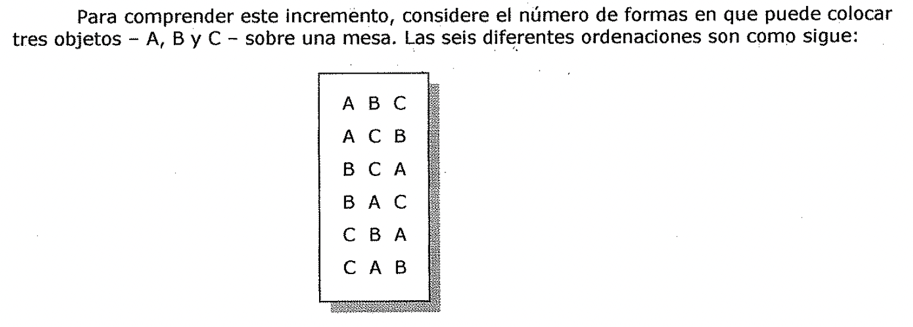

A CB

B CA

BA C C B A C A B

Aunque puede probarse a sí mismo rápidamente que estas son todas las formas en
que A, B y C pueden ser colocadas, se puede obtener el mismo número con un
teorema de la rama de las matemáticas llamada *combinatoria,* que es el estudio
de la manera en que los casos pueden combinarse. El teorema establece que el
número de formas en que N objetos pueden combinarse (o colocarse) es igual a N!
(N factorial). El factorial de un número es el producto. de todos los números
del conjunto formado por el mismo número y todos los menores que el hasta el 1.
En consecuencia, 3! es 3x2x1 o 6.

Dada esta información. puede ver que, si tuviera 4 objetos para colocar,
entonces habría 4!, o 24 combinaciones. Con 5 objetos, el número es 120, con 6
objetos, es 720. Sin embargo, con, digamos, 1.000 objetos, el número de posibles
combinaciones es enorme. Cuando hay más que un manojo de posibilidades,
rápidamente se hace imposible examinar- y de hecho, incluso enumerar- todas las
combinaciones.

Cuando relacione el concepto de explosión combinatoria con la resolución de
problemas, podrá ver que cada nodo adicional añadido al espacio de búsqueda
incrementa el número de posibles soluciones en una cifra bastante mayor que uno.
Por consiguiente, en algún momento, hay demasiadas posibilidades para trabajar
con ellas. Debido a que el número de posibilidades crece tan rápidamente, *solo
los problemas más simples se dirigen a búsquedas exhaustivas.* Una búsqueda
exhaustiva, o *"fuerza bruta",* teóricamente *funcionara siempre,* no es
practica porque consume demasiado tiempo, demasiados recursos de computadora, o
ambas cosas. Por esta razón, se han desarrollado otras técnicas de búsqueda.

Ejercicio

Un arque61ogo debe recorrer 5 sitios clave para llevar a cabo una investigación
sobre restos fósiles de Dinosaurios en Argentina. Estos sitios son Trelew, San
Martin de los Andes, Purmamarca, Valle de la Luna y Lago Escondido. Al no
decidirse sobre \_cuál es el orden que le convendría seguir en el recorrido,
piensa que es una buena medida describir todas las posibles combinaciones
diferentes y finalmente elegir una de ellas con los ojos cerrados.

Desarrollar un programa que permita ingresar un número variable de sitios a
visitar (entre 2 y 8) y muestre en pantalla todos los posibles circuitos que
podría definir.

## Explosión combinatoria y ramificación y acotación

1. **Ramificación y acotación**

Considere el siguiente problema:

El problema de! viajante de comercio: Un vendedor tiene una lista de ciudades,
cada una de las cuales debe visitar exactamente una vez. Existen carreteras
directas entre cada pareja de ciudades de la lista. Encontrar la ruta más corta
posible que debe seguir el vendedor que empiece y termine en alguna de estas
ciudades.

En principio, se puede resolver el problema con una sencilla estructura de
control que cause movimiento y sea sistemática. Se podría simplemente explorar
todas las posibles rutas en el árbol y devolver la que tenga menor longitud.
Esta estrategia puede funcionar en la practica para listas con muy pocas
ciudades, pero se colapsa rápidamente conforme el número de ciudades aumenta. Si
existen N ciudades, el número de rutas diferentes entre ellas es de: 1 x 2 x...
x (N-1), o (N-1)!. El tiempo empleado para examinar una ruta es proporcional a
N. Asi, el tiempo total empleado para completar la búsqueda es proporcional a
N!; si se asume que hay solo 10 ciudades, es de 3.628.800, un número bastante
grande. El viajante podría perfectamente tener que visitar 25 ciudades.
Encontrar la solución a este problema necesitaría más tiempo que el que
podríamos gastar. Este fenómeno se denomina explosión combinatoria, para
combatirla, es necesaria una *nueva estrategia de control.* Se puede superar la
sencilla estrategia perfilada anteriormente usando una técnica denominada
*ramificación y acotación (branch and bound).* Comienza generando rutas
completas, manteniéndose la ruta más corta encontrada hasta el momento. Deja de
explorar una ruta tan pronto como su distancia total, hasta ese momento, sea
mayor que la que se ha marcado como la más corta. *Usar esta técnica garantiza
hallar la ruta más corta.* Desgraciadamente, aunque este algoritmo es más
eficiente que el anterior, todavía necesita un tiempo exponencial. La cantidad
exacta de tiempo utilizado en un problema en particular, depende del orden en
que se exploren las rutas. Sin embargo, todavía es inadecuada para problemas
grandes.

Ejercicio

Un viajante de comercio interestelar debe recorrer 4 estrellas, cada una de las
cuales debe visitar exactamente una vez. Existen rutas directas entre cada
pareja de estrellas a visitar y sus distancias se expresan en años luz. Se
desea encontrar la ruta más corta posible que debe seguir el vendedor que
empiece y termine en alguna de las siguientes estrellas.

:+Aldebaran Canopus

Siri

}- Betelgeuse Desarrollar un programa que resuelva este problema, teniendo en
cuenta que se debe dejar de explorar una ruta tan pronto como su distancia
total, hasta ese momento, sea mayor que la que se ha marcado coma la más corta.
El programa debe mostrar además par pantalla, el seguimiento que se va haciendo
de cada camino, detallando para cada uno, las estrellas visitadas y la distancia
total recorrida y en caso de abandonar un camino, par no ser conveniente,
mostrar el mensaje correspondiente. L 2,1,3, 11:búsqueda primero en anchura

## Búsqueda primero en anchura

La búsqueda primero en anchura es la opuesta a la búsqueda primero en
profundidad. En este método *se evalúa cada nodo def mismo nivel antes de
proceder al siguiente nivel más profundo.* He aquí este método de recorrido con
C como objetivo:

D E G

Figura 2.1

Esta ilustración muestra que se visitan los nodos ABC. Como la búsqueda primero
en profundidad, la búsqueda primero en anchura garantiza que encontrara una
solución, si existe, porque eventualmente degenerara en una búsqueda exhaustiva.

Una estrategia de control sistemática para el problema de las jarras de agua
podría ser la siguiente: se construye un árbol cuya raíz sea el estado inicial;
todas las ramificaciones de la raíz se generan al aplicar cada una de las reglas
aplicables al estado inicial. La Figura 2.2 muestra la apariencia del árbol en
este punto. Ahora, para cada nodo, se generan todas las posibles situaciones
resultantes de la aplicación de todas las reglas adecuadas. En la Figura 2.3 se
muestra el estado actual del árbol. Se continua con este proceso hasta que
alguna regla produce un estado objetivo.

4,0) (0,3)

Figura 2.2

Este proceso, denominado búsqueda primero en anchura (breadth-first search), se
describe con precisión de la siguiente forma.

**Algoritmo: Búsqueda primero en anchura**

- 1. Crear una variable Hamada LISTA-NODOS y asignarle el estado inicial.

2. Hasta que se encuentre un estado objetivo o LISTA-NODOS este vacía, hacer:

1. Eliminar el primer elemento de LISTA-NODOS y llamarlo E. Si LISTA-NODOS esta
 vacía, terminar.

2. Para que cada regla se empareje con el estado descrito en E hacer:

Aplicar la regla para generar un nuevo estado.

Si el nuevo estado es un estado objetivo, terminar y *devolver* este estado.

En caso contrario, añadir el nuevo estado al final de LISTA-NODOS.

4,3) (0,0)

Figura 2.3

## Búsqueda primero en profundidad

**2.1.4. Búsqueda primero en profundidad**

Una búsqueda primero en profundidad significa que se explora cada camino posible
hacia el objetivo hasta su conclusión antes de intentar otro camino. Para
comprender exactamente como funciona esta búsqueda, considere este árbol en el
que F representa el objetivo:

', *.J* **Figura 2.4**

En este tipo de recorrido, *va par la izquierda hasta que o bien se alcanza un
nodo terminal o* *bien encuentra el objetivo.* Si alcanza un nodo terminal,
retrocede un nivel, va a la derecha y luego a la izquierda hasta encontrar el
objetivo o nodo terminal. Repetirá este procedimiento hasta haber encontrado el
objetivo o haber examinado el último nodo en el espacio de búsqueda.

Esta estrategia de control sistemática, se basa en continuar por una sola rama
del árbol hasta C encontrar una solución o hasta que se tome la decisión de
terminar la búsqueda por esa dirección. Terminar la búsqueda por una ruta tiene
sentido cuando se llega a un callejón sin salida, se produce un estado ya
alcanzado o la ruta se alarga más de lo especificado en algún límite de
*'.'inutilidad".* Si esto ocurre, se produce una *vuelta-atrás (backtracking).*
Se revisita el estado más recientemente creado desde el que sea posible algún
movimiento alternative más y se crea así un nuevo estado. Esta forma de
vuelta-atrás se denomina *vuelta-atrás* *cronológica (chronological
backtracking)* debido a que el orden en el que *se* deshacen los pasos depende
unicamente de la secuencia temporal en que se hicieron originalmente esos pases.
En definitiva, el paso más reciente es siempre el primero que se deshace. Esta
es la forma *de* vuelta-atrás a la que se hace referencia cuando se utiliza
simplemente el término "vuelta- atrás". Sin embargo, existen otras formas de
replegamiento de los pases dados al computar. El procedimiento de búsqueda
descrito se denomina también búsqueda primero en profundidad depth-first
search). El siguiente algoritmo lo define con precisión.

**Algoritmo: Búsqueda primero en profundidad**

1. Si el estado inicial es un estado objetivo, terminar y devolver un éxito.

2. En caso contrario, hacer lo siguiente hasta que se marque un éxito o un
 fracaso.

1. Generar un sucesor, E, del estado inicial. Si no existen más sucesores,

marcar un fracaso.

* 1. Llamar a la Búsqueda en profundidad con E como estado inicial.

* 1. Si se devuelve un éxito, marcar un éxito. En caso contrario, continuar con
 el ciclo.

La Figura 2.5 muestra una instantánea de una búsqueda primero en profundidad
para el problema de las jarras de agua.

Figura 2.5

Al comparar estos dos sencillos métodos aparecen las siguientes observaciones:

**Ventajas de la Búsqueda primero en profundidad**

* La búsqueda primero en profundidad necesita menos memoria ya que solo se
 almacenan los nodes del camino que se sigue en ese instante. Esto contrasta
 con la búsqueda primero en anchura en la que debe almacenarse todo el árbol
 que haya sido

generado hasta ese momento.

* Si se tiene suerte (o si se tiene cuidado en ordenar los estados alternatives
 sucesores), la búsqueda primero en profundidad puede encontrar una solución
 sin tener que examinar gran parte del espacio de estados. En el caso de la
 búsqueda primero en

anchura deben examinarse todas las partes del árbol de nivel n antes de comenzar
con los nodos de nivel n+ 1. Esto es particularmente relevante en el caso de que
existan varias soluciones aceptables. La búsqueda primero en profundidad acaba
al encontrar una de ellas.

**Ventajas de la Búsqueda primero en anchura**

* La búsqueda primero en anchura no queda atrapada explorando callejones sin
 salida. Esto se contrapone con la búsqueda primero en profundidad en la que se
 puede seguir una ruta infructuosa durante mucho tiempo, y quizás para
 siempre, antes de acabar en un estado sin sucesores. Esto es particularmente
 un problema en la búsqueda primero en profundidad si hay ciclos (por ejemplo,
 un estado tiene como sucesor un estado que es también uno de sus antecesores),
 a no ser que se tenga un cuidado especial en verificar tales situaciones.

* Si existe una solución, la búsqueda primero en anchura garantiza que se!logre
 encontrarla. Ademas, si existen múltiples soluciones, se encuentra la solución
 mínima (es decir, tal que requiere el mínimo número de pasos). Esto esta
 garantizado por el hecho de que no se explora una ruta larga hasta que se
 hayan examinado todas las rutas más cortas que ella. En cambio, en la búsqueda
 primero en profundidad es posible encontrar una solución larga en alguna
 parte del árbol, cuando puede existir otra mucho más corta en alguna parte
 inexplorada del mismo.

Lo deseable sería que pudieran combinarse las ventajas de estos dos métodos.

Para el problema de las jarras de agua, la mayoría de las estrategias de control
que provoquen movimiento y sean sistemáticas logran encontrar la respuesta: el
problema es sencillo. Sin embargo, este no es siempre el caso. Para poder llegar
a la solución de algunos problemas antes de morir, es necesario también
demandar una estructura de control eficiente.

Ejercicio

* ) Desarrollar dos programas que resuelvan el problema de las jarras de agua,
 utilizando las

, *1* estrategias de búsqueda primero en anchura y primero en profundidad.

Ejercicio

Desarrollar dos programas que busquen trayectorias desde el nodo inicial S, al

nodo meta, G, utilizando las técnicas de búsqueda primero en anchura y primero
en profundidad, de acuerdo al siguiente esquema:

D E F

Los programas deben ir mostrando en pantalla, para cada recorrido efectuado,.el
detalle de , *!* los nodos visitados y la distancia recorrida.

Figura 2.6

Árbol de búsqueda hecho a partir de una red

## Técnicas de búsqueda heurística

* 1. Técnicas de búsqueda heurística

Con el fin de resolver problemas complicados con eficiencia, con frecuencia es
necesario comprometer los requisitos de movilidad y sistematicidad, y construir
una estructura de control *que no garantice encontrar la mejor respuesta pero
que casi siempre encuentre una buena* *so/solución.* De esta forma, surge la idea
de **heurística.** *Una heurística* es *una técnica que* *aumenta la eficiencia
de un proceso de búsqueda, posiblemente sacrificando demandas de* *completitud.*
Las heurísticas son coma los guías de turismo: resultan adecuados en el sentido
de que generalmente suelen indicar las rutas interesantes; son malos en el
sentido de que pueden olvidar puntos de interés para ciertas personas. Algunas
heurísticas ayudan a guiar el proceso de búsqueda sin sacrificar ninguna demanda
de completitud que el proceso haya podido tener previamente. Otras (en realidad,
muchas de las mejores) pueden ocasionalmente causar que una buena ruta sea
pasada por alto. Pero, en promedio, mejoran la calidad de las C rutas que
exploran. Al usar buenas heurísticas se pueden esperar buenas (aunque
posiblemente no óptimas) soluciones para problemas difíciles, tales como el del
viajante de comercio, en un tiempo menor al exponencial. Existen algunas
heurísticas de propósito general que son adecuadas para una amplia variedad de
dominios de problemas. Ademas, es posible construir heurísticas de propósito
especial que exploten el conocimiento especifico del dominio para resolver
problemas particulares.

La heurística del vecino más próximo es un ejemplo de una buena heurística de
propósito general valida para varios problemas combinatorios. Consiste en
seleccionar en cada paso la alternativa localmente superior. Al aplicarla al
problema del viajante de comercio, surge el siguiente proceso:

1. Seleccionar arbitrariamente una ciudad de comienzo.

2. Para seleccionar la siguiente ciudad, fijarse en las ciudades que todavía no
 se han

visitado y seleccionar aquella que sea más cercana. Ir a esa ciudad.

1. Repetir el paso 2 hasta que todas las ciudades hayan sido visitadas. Cuando
 se aplican a problemas específicos, la eficacia de las técnicas de búsqueda
 heurísticas depende en gran medida de la forma en que exploten el
 conocimiento del dominio particular, ya que, por sí solas, no son capaces de
 salvar la explosión combinatoria a la que son tan

vulnerables los procesos de búsqueda. Por esta razón, a estas técnicas se las
denomina con frecuencia métodos débiles (weak methods). A pesar de que
comprender la limitada efectividad de estos métodos débiles para resolver
problemas difíciles ha sido un importante resultado surgido en las últimas tres
décadas de investigación en IA, estas técnicas proporcionan un marco donde
situar el conocimiento del dominio específico, ya sea manualmente o como
resultado de un aprendizaje automático. Es por ello que siguen formando el
núcleo de la mayoría de los sistemas de IA.

**Problema de la Mochila**

Consiste en elegir, de entre un conjunto **den** *elementos* de un negocio,
(cada uno con un valor ***V;,*** y un peso ***p;*** ), aquellos que puedan ser
cargados en la mochila de un individuo, que decide hacer una visita nocturna al
negocio. La mochila resiste un *peso máxima* ***Py*** se debe tener en cuenta
que el visitante pretende acumular *el mayor valor posible,* entre todos los
objetos que recoge.

Este es un claro ejemplo de la presentación de un problema, en el que hay
dificultad para hallar una solución óptima exacta, principalmente por el tiempo
que llevaría recorrer y combinar todas las posibilidades en forma exhaustiva.

* l • Para 20 elementos + se definen 220=1.048.580 subconjuntos o soluciones

+ Para 60 elementos + se necesitan 365 siglos para resolver el problema, a 1
 millón de soluciones por segundo

Existen entonces, ***métodos heurísticos*** que proporcionan soluciones
factibles (que satisfacen las restricciones del problema), que aunque no
optimicen la función objetivo, se acercan al valor óptimo en un tiempo de
cálculo razonable.

Una clase de algoritmos heurísticos son los ***métodos constructivos,*** que
consisten en ir agregando componentes individuales a la solución hasta que se
obtiene una solución factible.

Un representante de estos son los ***algoritmos greedy*** (golosos o
devoradores). Estos algoritmos van construyendo paso a paso la solución,
buscando el máximo beneficio en cada paso.

En el problema de la mochila, debemos ir escogiendo los elementos que aporten el
mayor valor en proporción a su peso ***v;* / *p;*** *).* l:ejercicio«is

1. Desarrollar un algoritmo goloso que brinde una solución para el siguiente
 conjunto de datos:

| --- | --- | --- |

| 1 | 150 | 20 |

| 2 | 325 | 40 |

| 3 | 600 | 50 |

| 4 | 805 | 36 |

| 5 | 430 | 25 |

| 6 | 1200 | 64 |

| 7 | 770 | 54 |

| 8 | 60 | 18 |

| 9 | 930 | 46 |

| 10 | 353 | 28 |

Peso máxima soportado por la mochila:

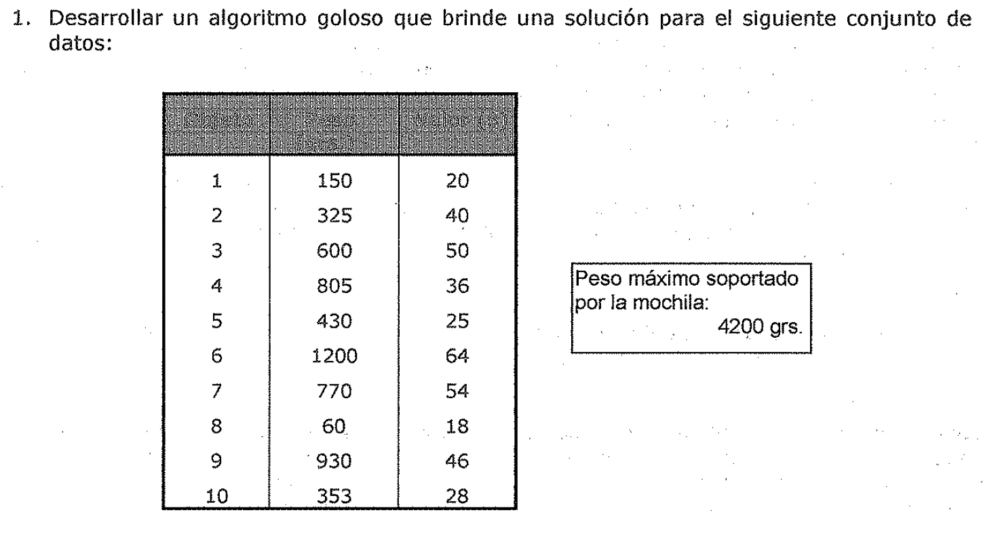

42Q0 grs.

1. Dados 3 elementos, cuyos pesos son: 1800 grs., 600 grs. Y 1200 grs. y cuyos
 valores

son: $72, $36 y $60 respectivamente, y dado que la mochila puede soportar hasta
3000 grs. se pide:

* 1. Hallar una solución utilizando un algoritmo goloso.

2. Analizar dicha solución respecto a su grado de optimización y elaborar las

conclusiones que considere adecuadas.

## Generación y prueba

1. Generación y Prueba

La estrategia de generación y prueba es la más simple de todas las que se van a
explicar.

Consiste en realizar los siguientes pasos:

**Algoritmo: Generación y prueba**

- 1. Generar una posible solución. Para algunos problemas, esto significa
 generar un objetivo particular en el espacio problema. Para otros, supone más
 bien generar un camino a partir de un estado inicial.

2. Verificar si realmente el objetivo elegido es una solución comparándolo con
 el objetivo final o comparando el camino elegido con el conjunto de estados
 objetivo aceptables.

- 1. Si se ha encontrado la solución, terminar. Si no, volver al paso 1.

Si se generan las posibles soluciones de forma sistemática, si la solución
existe, este procedimiento es capaz de encontrarla en algún momento.
Desafortunadamente, *si el espacio problema* es *muy grande, "en algún momento"
puede ser demasiado tiempo.* El algoritmo de generación y prueba es un
procedimiento de búsqueda *primero en profundidad* *ya que las soluciones
completas deben generarse antes de que se comprueben.* De una forma más
sistemática, es simplemente una ***búsqueda exhaustiva por el espacio
problema.*** El método de generación y prueba puede, por supuesto, funcionar de
forma que genere las soluciones de forma aleatoria, pero esto no garantiza que
se pueda encontrar alguna vez la solución. Esta forma de trabajar se conoce
también como el ***algoritmo de! Museo Británico,*** en referencia a un método
empleado para encontrar objetos en el museo, haciendo que este se recorriera
aleatoriamente. Entre estos dos extremos **existe un punto medio** en donde el
proceso de búsqueda actúa de forma sistemática, a pesar de que algunos caminos
no se consideren porque dan la impresión de que por ellos no se llega a la
solución. Esta evaluación se lleva a cabo mediante una función heurística.

La forma más sencilla de implementar una generación y prueba sistemática es
mediante un árbol de búsqueda primero en profundidad con vuelta-atrás. Sin
embargo, si algunos estados intermedios aparecen con frecuencia en el árbol,
puede resultar mejor modificar el procedimiento descrito antes, para que recorra
un grafo en lugar de un árbol.

Para problemas sencillos, una generación y prueba exhaustiva es normalmente una
técnica razonable. Por ejemplo, considere el problema de acomodar cuatro cubos
de seis caras, cada una de las cuales se encuentra pintada con un color
distinto, de manera tal que una solución a este problema consiste en disponer
los cubos en una fila de forma que el bloque muestre una cara de cada color.
Este problema puede resolverlo una persona - que es un procesador mucho más
lento para este tipo de tareas que cualquier computadora barata - en pocos
minutos intentando todas las posibilidades de forma sistemática y exhaustiva. Se
puede resolver con más rapidez usando un procedimiento de generación y prueba
heurístico. Al dar un rápido vistazo a los cuatro cubos se puede descubrir, por
ejemplo, que existen más caras rojas que de cualquier otro color. De esta forma,
sería una buena idea utilizarlas tan poco como fuera posible como cara exterior,
modificando la posición de aquellos cubos. Al usar esta heurística, muchas
configuraciones nunca se exploran y la solución se encuentra más rápidamente.

Figura 2.7

Desafortunadamente, *para problemas mucho más complicados que este, una técnica
de generación y prueba heurística no es muy eficiente par sí misma.* Pero cuando
se combina con otras técnicas que restrinjan el espacio de búsqueda, la técnica
puede llegar a ser muy eficaz.

Ejercicio

Desarrollar un programa que considere el problema de acomodar cuatro cubos de
seis caras, cada una de las cuales se encuentra pintada con un color distinto,
de manera tal que una solución a este problema consiste en disponer los cubos en
una fila de forma que el bloque muestre una cara de cada color. Utilizar una
estrategia de generación y prueba que evalúe la cantidad de caras de un mismo
color que hay a la vista y trate de reducirlas, modificando un cubo cada vez.

## Escalada o remonte de colinas

1. Escalada o Remonte de colinas

**Escalada**

El método de la escalada es una variante del de generación y prueba; en· el
existe realimentación a partir del procedimiento de prueba que se usa para
ayudar al generador a decidirse por cuál dirección debe moverse en el espacio de
búsqueda. En un procedimiento de generación y prueba puro, la función de prueba
responde solo un sí o un no. Pero si la función de prueba se amplía mediante una
función heurística que proporcione una estimación de. lo cercano que se
encuentra un estado.al estado objetivo, el procedimiento de generación puede
usar esta información tal y como se muestra en un ejemplo posterior. Ademas esto
es particularmente apropiado porque normalmente el cálculo de la función
heurística puede hacerse, casi sin coste alguno, al mismo tiempo en que se esta
llevando a cabo la verificación de una solución. La escalada se utiliza
frecuentemente cuando se dispone de una buena función heurística para evaluar
los estados, pero cuando no se dispone de otro tipo de conocimiento provechoso.

Ejercicio

Suponga que se encuentra en una ciudad desconocida sin ningún mapa, y que quiere
llegar al centro. Usted simplemente iría hacia los rascacielos. La función
heurística sería en este caso la distancia existente entre su posición y los
rascacielos y los estados deseables son aquellos en que esa distancia se
minimiza.

| | | | | | | |

| --- | --- | --- | --- | --- | --- | --- |

| | | | | | | |

| | | | |. | (:\_:; | |

| | | | | | | |

| | | | | | | |

| | | | | | | |

| | | | | | | |

| | | | | | | |

Desde una posición al objetivo, avanzar de a un paso y valorar. Si no es mejor,

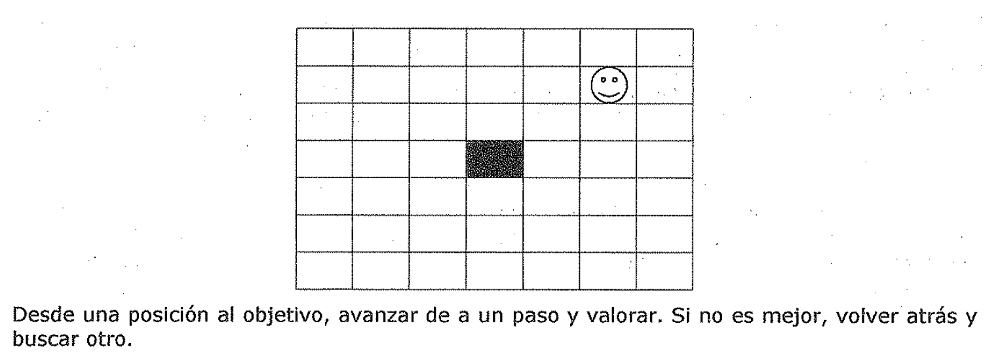
volver atrás y buscar otro.

**Escalada simple**

La forma más sencilla de implementar el método de la escalada es la siguiente:

**Algoritmo: Escalada simple**

- 1. Evaluar el estado inicial. Si también es el estado objetivo, devolverlo y
 terminar. En

caso contrario, continuar con el estado inicial como estado actual.

- 1. Repetir hasta que se encuentre una solución o hasta que no queden nuevos
 operadores

que aplicar al estado actual:

- * 1. Seleccionar un operador que no haya sido aplicado con anterioridad al
 estado

actual y aplicarlo para generar un nuevo estado.

- * 1. Evaluar el nuevo estado.

Si es un estado objetivo, devolverlo y terminar.

Si no es un estado objetivo, pero es mejor que el estado actual,

convertirlo en el estado actual.

Si no es mejor que el estado actual, continuar con el bucle.

La principal diferencia que existe entre este algoritmo y el que se ha dado para
la técnica de generación y prueba, consiste en *el uso de una función de
evaluación coma una forma de* *introducir conocimiento especifico de la tarea
realizada en el proceso de control.* La utilización de este conocimiento es lo
que hace a este y a otros métodos que se explican a lo largo de este capítulo,
métodos de búsqueda heurística, y es este mismo conocimiento lo que da a estos
métodos la capacidad de resolver algunos problemas que de otra forma serían
inabordables.

Nótese que en este algoritmo se ha formulado la relativamente vaga pregunta,
*"i.Es un estado* *mejor que otro?".* Para que el algoritmo pueda funcionar, es
necesario proporcionar una definición precisa del término mejor. En algunos
casos, significa un valor más alto de una función heurística; en otros,
significa un valor más bajo. No importa lo que signifique siempre que a lo largo
de una escalada específica se sea consistente con su interpretación.

**Escala.da por la máxima pendiente**

Una variación útil del método de escalada simple consiste en considerar todos
las posibles movimientos a partir del estado actual y elegir el mejor de el.las
coma nuevo estado. Este método se denomina *método de escalada por la máxima
pendiente (steepest-ascent hill* *climbing) o búsqueda def gradiente (gradient
search).* Nótese el contraste con el método básico, en el que el primer estado
que parezca que sea mejor que el actual se selecciona coma el estado actual. El
algoritmo funciona así.

**Algoritmo: Escalada por la máxima pendiente**

1. Evaluar el estado inicial. Si también es el estado objetivo, devolverlo y
 terminar. En

caso contrario, continuar con el estado inicial coma estado actual.

1. Repetir hasta que se encuentre una solución o hasta que una iteración
 completa no

produzca un cambio en el estado actual:

* 1. Sea SUCC un estado tal que algún posible sucesor del estado actual sea
 mejor

que este SUCC.

* 1. Para cada operador aplicado al estado actual hacer lo siguiente:

1. Aplicar el operador y generar un nuevo estado.

2. Evaluar el nuevo estado. Si es un estado objetivo, devolverlo y terminar.

Si no, compararlo con SUCC. Si es mejor, asignar a SUCC este nuevo

estado. Si no es mejor, dejar succ coma esta.

* 1. Si SUCC es mejor que el estado actual, hacer que el estado actual sea SUCC.

Ejercicio

Resolver el ejercicio anterior utilizando una estrategia de Escalada por la
máxima pendiente, o sea, considerando todos los posibles movimientos a partir
del estado actual y elegir el mejor de ellos como nuevo estado.

## Problemas típicos de escalada

Tanto la *escalada básica* como la de *máxima pendiente* pueden no encontrar una
solución. Cualquiera de los dos algoritmos puede acabar sin encontrar un estado
objetivo, y en cambio encontrar un estado del que no sea posible generar nuevos
estados mejores que el. Esto ocurre si el programa se topa con un ***máxima
local,*** *una* ***meseta*** *o una* ***cresta.***

* Un *máxima local* es un estado que es mejor que todos sus vecinos, pero que no
 es mejor que otros estados de otros lugares. En un máximo local, todos los
 movimientos producen estados peores. Los máximos locales son particularmente
 frustrantes porque frecuentemente aparecen en las cercan[as de una solución.
 En este caso se denominan estribaciones (foothills).

* Una *meseta* (plateau) es un área plana del espacio de búsqueda en la que un
 conjunto de estados vecinos posee el mismo valor. En una meseta no es posible
 determinar la mejor dirección a la que moverse haciendo comparaciones locales.

* Una *cresta* (ridge) es un tipo especial de máximo local. Es un área del
 espacio de búsqueda más alta que las áreas circundantes y que además posee en
 ella misma una inclinación (la cuál se podría escalar). Pero la orientación.
 de esta region alta, comparada con el conjunto de movimientos disponibles y
 direcciones en la que moverse,

hace que sea imposible atravesar la cresta mediante movimientos simples.

Existen algunas formas de evitar estos problemas, si bien estos métodos no dan
garantías:

* *Vo/ver atrás hacia algún modo anterior e intentar seguir un camino
 diferente.* Es

especialmente razonable si el nodo posee otra dirección que de la impresión de
ser tan prometedora, o casi tan prometedora, como la que se eligió. Para
implementar esta estrategia, se debe mantener una lista de caminos que casi se
han seguido y volver a uno de ellos, si el camino que se ha seguido da la
impresión de ser un callejón sin salida. Este método es especialmente adecuado
para superar máximos locales.

* *Realizar un gran salto en alguna dirección* para intentar buscar en una nueva
 parte del espacio de búsqueda. Este método esta especialmente indicado para
 superar mesetas. Si la única regla aplicable describe pequeños pasos,
 aplicarla varias veces en la misma dirección.

* *Aplicar dos o más reglas antes de realizar la evaluación.* Esto se
 corresponde con movimientos en varias direcciones a la vez. Este método es
 especialmente bueno para superar las crestas. • •

*Incluso con estas tres medidas de primeros auxilios, la esca/ada no es siempre
muy eficaz.* Considere el problema del mundo de los bloques que se muestra en la
Figura 2.8. Asuma la existencia de los siguientes operadores:

* Tomar un bloque y situarlo sobre la mesa.

• Tomar un bloque y situarlo sobre otro.

Suponga que se utiliza la siguiente función heurística:

* Añadir un punto por cada bloque que este sobre aquello en que se supone que
 debe estar.

• Restar un punto por cada bloque que este situado en un lugar incorrecto.

Figura 2.8

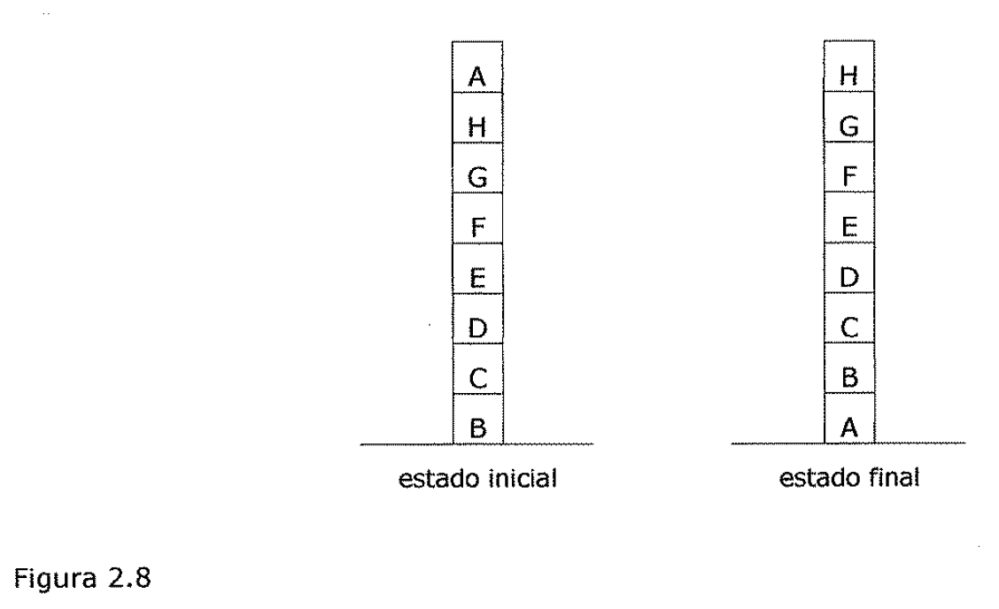

| --- | --- | --- |

estado inicial estado final Al usar esta función, el estado objetivo tiene un
valor de 8. El estado inicial tiene un valor de 4 (ya que tiene los puntos
positivos de los bloques C, D, E, F, G y H, y los negativos de los bloques A y
B). Solo es posible realizar un movimiento a partir del estado inicial, mover el
bloque A a la mesa. Este movimiento produce un estado con valor 6 (ya que la
posición de A es correcta y añade un punto en lugar de restarlo). El
procedimiento de escalada acepta este movimiento. En este nuevo estado, existen
tres posibles movimientos que dan lugar a los tres estados que aparecen en la
Figura 2.9. Estos estados tienen las siguientes puntuaciones: (a) 4, b) 4 y (c)
4. La escalada se detiene ya que estos tres estados tienen puntuaciones más
bajas que el estado actual. El proceso ha encontrado un máximo que no es el
máximo global. En este punto, el problema consiste en que mediante un examen
puramente local de las estructuras de apoyo, el estado actual parece ser mejor
que cualquiera de sus sucesores porque tiene más bloques situados correctamente.
Para resolver este problema, es necesario desmontar la estructura local adecuada
(de B hasta H) porque esta situada en un contexto global inadecuado.

| | | | | | | | |

| --- | --- | --- | --- | --- | --- | --- | --- |

| A | | | | | | | |

| G | | | | G | | | G |

| F | | | | F | | | F |

| E | | | | E | | | E |

| D | | | | D | | | D |

| C | | H | | C | | | C |

| B | | A | | B | A | | B |

| (a) | | | (b) | | | (C) | |

| Figura 2.9 | | | | | | | |

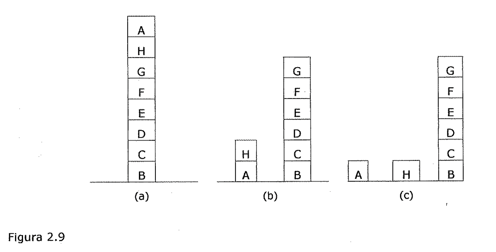

La culpa de este fallo podría recaer en el método de la escalada en sí mismo al
no ser capaz de *"mirar más lejos"* para encontrar una solución, pero también se
podría culpar a la función heurística y tratar de modificarla. La escalada puede
resultar muy ineficiente con espacios problema grandes y escabrosos. Sin
embargo, suele ser adecuado si se combina con otros métodos que consigan que se
mueva correctamente por la vecindad en general.

Ejercicio

Desarrollar un programa que resuelva el siguiente problema de trayectoria de

nodos, aplicando la heurística de ir alcanzando nodos con la intención de
minimizar la distancia hacia el objetivo, según los valores expuestos en el
segundo esquema

## Búsqueda el primero mejor

* 1..3. Búsqueda El primero mejor

Hasta este momento, solo se han explicado realmente dos estrategias de control
sistemáticas, la búsqueda primero en anchura y la búsqueda primero en
profundidad. Ahora se explica un nuevo método, la búsqueda de *el primero mejor
(best-first search),* que representa una forma de *combinar las ventajas que
presentan tanto la búsqueda primero en anchura como la primero en profundidad.*
La búsqueda primero en profundidad tiene la ventaja de que permite encontrar una
solución sin tener que expandirse completamente por todas las ramas. La búsqueda
primero en anchura presenta la ventaja de que no queda atrapada en callejones
sin salida. Una forma de combinar ambas ventajas puede consistir en *seguir un
único camino cada vez, y cambiarlo cuando alguna ruta parezca más prometedora
que la que* se *esta siguiendo en* ese *momento.* En cada paso del proceso de
búsqueda el primero mejor, se *selecciona el nodo más prometedor que* se *haya
generado hasta* ese *momento.* Esto se puede conseguir con una función
heurística apropiada. A continuación se expande el nodo elegido aplicando las
reglas para generar a sus sucesores. Si alguno de ellos es una solución, el
proceso termina. Si no es así, estos nuevos nodos se añaden a la lista de nodos
que se han generado hasta ese momento. De nuevo, se selecciona el más
prometedor de ellos y el proceso continua de la misma forma. Lo normal es que
la forma de funcionar se parezca un poco a la búsqueda primero en profundidad
al explorar las ramas. Sin embargo, si no se encuentra una solución, la rama
empezara a parecer menos prometedora que otras por encima de ella y que se
habían• ignorado. En este caso, una rama que previamente se había ignorado
aparece ahora como la• más prometedora y, por lo tanto, comienza su exploración.
Sin embargo, la vieja rama no se olvida. Su último nodo se almacena en el
conjunto de nodos generados pero aun sin expandir.

La búsqueda puede volver a el en el momento en que los otros sean lo
suficientemente malos como para que este sea de nuevo el camino más prometedor
de todos.

Paso 1 Paso 2 Paso 3

Figura 2.10

Paso 4 Paso 5

La Figura 2.10 muestra el comienzo de un proceso de búsqueda el primero mejor.
Inicialmente, solo existe un nodo, de forma que este se expande. Al hacerlo, se
generan tres nodos nuevos. En este ejemplo la función heurística es una
estimación del' *coste* necesario para llegar a una soh.ii:ión a partir del nodo
dado, y se aplica a cada nodo. Como el nodo D es el más prometedor de todos, es
el siguiente que se expande, lo que produce los nuevos nodos, E y F.

La función heurística se aplica, de nuevo, a estos dos nodos. En este punto, el
camino que nace del nodo B parece más prometedor, por lo que se selecciona y se
generan los nodos G y H. De nuevo, al evaluar estos nuevos nodos se observa que
son peores que algún otro, de forma que se vuelve la atención sabre el camino
que va de D a E. Ahora se expande E, y aparecen los nodos I. y J. En el
siguiente paso, el nodo que se expande es J, ya que es el más prometedor de
todos.. El proceso continuaría así hasta que se encontrara alguna solución al
problema.

Este procedimiento es *muy similar al de escalada por la máxima pendiente,*
excepto en dos aspectos. En el método de la escalada, al seleccionar un
movimiento todos los demás se abandonan *y* nunca pueden volver a ser
considerados. Esta es la causa del característico comportamiento del método de
escalada. *En el método de búsqueda de el primero mejor, se sigue seleccionando
un movimiento, pero todos los demás se mantienen de forma que pueden visitarse
si el camino que se ha seleccionado 1/ega a ser menos prometedor.* Ademas de
esto, en la búsqueda de el primero mejor se selecciona el mejor estado
disponible, aun si este estado tiene un valor menor que el del que se estaba
explorando. Esto contrasta con el método de la escalada, en donde el proceso
detiene si no se encuentra un estado sucesor mejor que el estado actual.

A pesar de que el ejemplo anterior emplea un árbol para ilustrar el proceso de
búsqueda el primero mejor, en ocasiones es importante realizar la búsqueda sobre
un grafo de forma que los caminos duplicados no se exploren. Tai algoritmo debe
realizar una búsqueda en un grafo dirigido donde cada nodo representa un punto
en el espacio de estados. Cada nodo contiene además de una descripción de lo que
representa en el espacio de estados, una indicación de lo prometedor que es, un
enlace paterno que apunta al mejor nodo desde el que se ha generado el actual,
*y* una lista de los nodos que se generan a partir de el. El enlace paterno nos
posibilita restablecer el camino hacia el objetivo una vez que se ha encontrado
dicho objetivo. La lista de sucesores hará posible, si se ha encontrado un
camino mejor a un nodo ya existente, propagar la mejora a sus sucesores. A los
grafos de este tipo se ¿es denomina grafos O, ya que cada una de sus ramas
representan caminos alternativos para la resolución del problema.

Para poder implementar un procedimiento de búsqueda sobre un grafo se necesitan
dos listas de nodos:

* ABIERTOS: nodos que se han generado *y* a los que se ¿es ha aplicado la
 función heurística, pero que aun no haya sido examinados (es decir, no se han
 generados sus sucesores). La lista ABIERTOS es, en realidad, una cola con
 prioridad en la que los elementos con mayor prioridad son aquellos que tienen
 un valor más prometedor de la función heurística. Para manipular la lista
 pueden utilizarse las técnicas usuales de manipulación de colas de prioridad.

* CERRADOS: nodos que ya se han examinado. Es necesario mantener estos nodos en
 memoria si lo que se desea es hacer una búsqueda sobre un grafo *y* no sobre
 un árbol, debido a que cuando se genera un nuevo nodo, se debe verificar si
 ese nodo se había generado con anterioridad.

También se necesita una función heurística que haga una estimación de los
méritos de cada uno de los nodos que se van generando. Esto permite que el
algoritmo examine primero los caminos más prometedores. Llamemos a esta función
f ' (para indicar que se trata de una aproximación a la función f, que es la que
proporciona la verdadera evaluación de cada nodo). Para muchas aplicaciones, es
adecuado definir esta función como la suma de dos componentes que denominamos g
*y* h '. La función g es una medida del coste para ir desde el estado inicial
hasta el nodo actual. Nótese que g no es una estimación de nada; su valor es
exactamente la suma de los costes de aplicación de las reglas que se han ido
eligiendo a través del mejor camino hasta el nodo. La función h ' es una
estimación del coste adicional necesario para alcanzar un nodo objetivo a partir
del nodo actual. Este es el lugar en donde se emplea el conocimiento acerca del
dominio del problema. La función combinada f ', representa entonces una
estimación del coste necesario para alcanzar un estado objetivo por el camino
que se ha seguido para generar el nodo actual. Si un nodo puede generarse por
más de un camino, el algoritmo se queda solo con el mejor de ellos. Nótese que,
ya que g *y* h ' deben sumarse, es

* *!* importante que h ' represente una medida del coste de ir desde un nodo
 da.do a una solución (es decir, los nodos buenos poseen valores bajos; los
 nodos malos tienen valores altos) en lugar de una medida de la bondad de un
 nodo (es decir, los buenos nodos tienen valores altos). Sin embargo, eso es
 fácil de arreglar gracias a la buena colaboración de los signos negativos.
 También es importante que g no sea negativa. Si esto no se cumple, los caminos
 que atraviesan ciclos a lo largo del grafo parecerán mejores conforme sean más
 largos.

El funcionamiento del algoritmo es muy simple. Funciona por pasos, expandiendo
un nodo en• cada paso hasta que se genere un nodo que se corresponde con un nodo
objetivo. En cada paso se toma el nodo más prometedor que se tenga en ese
momento *y* que no se haya expandido. Se generan los sucesores del nodo elegido,
se ¿es. aplica la función heurística y se ¿es añade a la lista de nodos
abiertos. Después de verificar si alguno de ellos se hab[a generado con
anterioridad. Al realizar esta verificación se puede garantizar que los nodos
solo aparecen una vez en el grafo, aunque varios nodos puedan apuntar hacia el
como su sucesor.

Una vez.hecho esto, se empieza con el siguiente paso.

El proceso puede resumirse como sigue.

**Algoritmo: Búsqueda el primero mejor**

1. Comenzar con ABIERTOS conteniendo solo el estado inicial.

2.. Hasta que,;e llegue a un objetivo o no queden nodos en ABIERTOS hacer:

1. Tomar el mejor nodo de ABIERTOS.

2. Generar sus sucesores.

3. Para cada sucesor hacer:

1. Si no se ha generado con anterioridad, evaluarlo, añadirlo a ABIERTOS y

almacenar a su padre.

1. Si ya se ha generado antes, cambiar al padre si el nuevo camino es.

mejor que el anterior. En este caso, se actualiza el coste empleado para
alcanzar el nodo **y** a los sucesores que pudiera tener.

La idea básica de este algoritmo es sencilla. Desafortunadamente, es raro el
caso en que los algoritmos sobre grafos resultan fáciles de escribir
correctamente. **Y** es aún más raro que sea sencillo garantizar la corrección
de tales algoritmos.

**Transformación en el espacio de configuraciones**

La planificación de trayectoria de robot ilustra la búsqueda Para ver como se
puede llevar a la practica el procedimiento de búsqueda el primero mejor,
considere el problema de evitar choques que enfrenta un robot. Antes de que un
robot empiece a moverse en un ambiente desordenado, debe *calcular una
trayectoria entre el lugar* *donde se encuentra y aunque/ donde desea estar.* Este
requisito es valido para la locomoción de todo robot a través de un medio
desordenado y para el movimiento de la mano del robot a través de un espacio de
trabajo lleno de componentes.

En la Figura 2.11 se muestra este problema de planificación de movimiento en un
medio simple, habitado por un robot triangular. El robot desea moverse, sin
hacer viraje, desde su posición inicial a la nueva posición indicada por el
triangulo punteado. La pregunta que surge es puede el robot pasar por el
espacio que hay entre el pentágono y el octágono?

Figura 2.11

Problema de evasión de obstáculo. El problema consiste en mover el pequeño
robot triangular a una nueva posición, que se muestra punteada, sin chocar con
el pentágono o el octágono.

*En dos dimensiones, un truco inteligente simplifica el problema.* La idea
general consiste en redescribir el problema en términos de otra representación
más simple, resolver el problema en dicha representación y redescribir la
solución en términos de la representación original. En conjunto, tomar este
planteamiento es como hacer una multiplicación pasando de los números a sus
logaritmos y viceversa.

*( i* Para evitar obstáculos, la representación original implica un objeto en
movimiento y obstáculos estacionarios, y la nueva representación implica un
punto en movimiento y obstáculos virtuales más grandes llamados **obstáculos
del espacio de configuraciones.** En la Figura 2.12 se muestra como se puede
transformar un obstáculo ordinario en un obstáculo del espacio de
configuraciones utilizando el objeto que se va a mover y el obstáculo que se va
a evitar. Básicamente, se desliza el objeto alrededor del obstáculo, manteniendo
el contacto entre ellos todo el tiempo, y llevando el registro de un punto de
rastreo arbitrario en el objeto en movimiento conforme avanza. Mientras el punto
de rastreo se mueve alrededor del obstáculo, se traza una cerca de ocho lados.
Es evidente que no puede haber colisión entre el objeto y el obstáculo mientras
el punto de rastreo se mantenga fuera de la cerca que rodea al obstáculo del
espacio de configuraciones asociado al obstáculo original.

Figura 2.12

Transformación en el espacio de configuraciones. La línea gruesa muestra la
posición del vértice inferior izquierdo del triangulo pequeño conforme este se
mueve alrededor del grande. Las posiciones numeradas son los puntos iniciales de
cada desplazamiento en línea recta. Si se mantiene el vértice inferior izquierdo
fuera de la línea gruesa se mantendrá el triangulo pequeño alejado del
pentágono.

En la Figura 2.13 se muestran los dos obstáculos del espacio de configuraciones
formados a partir del triangulo original, el pentágono y el octágono de la
Figura 2.11. Se utilizó el vértice inferior izquierdo del triangulo. Es evidente
que el robot puede pasar por la abertura, ya que los obstáculos del espacio de
configuraciones no son lo suficientemente grandes como para cerrar el espacio.

Figura 2.13

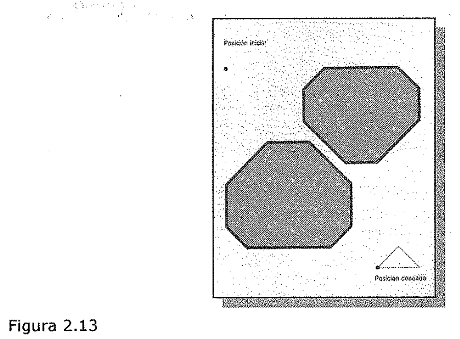

Espacio de configuraciones para el problema que se muestra en la Figura 2.11. Si
el punto se mantiene fuera del área sombreada no habrá colisión.

*Sin embargo, no queda de/ todo c/aro si la trayectoria más corta es a través de
la abertura. Para asegurarse que de veras Jo es, usted tiene que efectuar una
búsqueda.* Hasta ahora no existe una red en donde buscar. Sin embargo, su
construcción resulta fácil para problemas de espacio de configuraciones de dos
dimensiones. Para ver por que es fácil, suponga que usted se encuentra en
cualquier punto de un espacio de configuraciones. Desde donde usted esta, puede
ver. la posición deseada o bien no verla. Si puede, entonces no requerirá hacer
más, ya que la trayectoria más corta es la linea recta entre usted y la posición
deseada.

Si no puede ver la posición deseada desde.·donde esta, entonces el único
movimiento que tiene sentido es hacia uno de los vértices.. que puede haber. En
consecuencia, todo movimiento queda restringido de vértice a vértice, excepto al
principio, cuando el movimiento es de la posición inicial a un vértice, y al
final, cuando el movimiento es de un vértice a la posición deseada. Por lo
tanto, la posición inicial, la deseada, y los vértices son como los nodos de una
red. Debido a que los enlaces entre los nodos se colocan.solo.cuando existe una
línea de visión sin obstáculos entre los nodos, la red se conoce como grafo de
visibilidad.

Figura 2.14

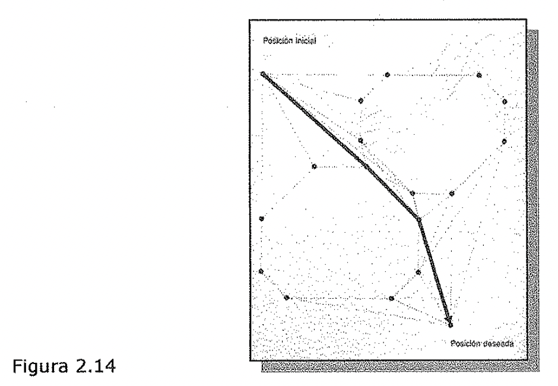

En un espacio de configuraciones de dos dimensiones, el punto robot se mueve a
lo largo de las líneas rectas de un grafo de visibilidad. Una búsqueda A\* a
través del grafo de visibilidad produce la trayectoria más corta desde la
posición inicial a la posición deseada. La flecha gruesa muestra la trayectoria
más corta.

En la Figura 2.14 se ilustra el grafo de visibilidad para el ejemplo del
movimiento del robot, junto con el resultado de efectuar una búsqueda A\* para
establecer la trayectoria más corta para el robot del espacio de configuraciones
-un punto- a través del espacio de obstáculos del espacio de configuraciones,
todos ellos de forma extraña. En la Figura 2.15 se muestra el movimiento del
robot real, junto con los obstáculos reales que rodea, todos superpuestos a la
** solución en el espacio de configuraciones.

Si usted permite que el objeto en movimiento gire, puede hacer que varios
espacios de configuraciones correspondan a los diferentes grados de rotación del
objeto en movimiento. Entonces, la búsqueda implicara movimiento no solo a
través del espacio de configuración individual, sino de espacio a espacio.

Figura 2.15

*El movimiento de/ robot esta regido por la trayectoria más corta hal/ada en el
grafo de.* *visibilidad. El vértice inferior izqUierdo def robot triangular, que
se utilizó para producir* *obstáculos de/ espacio de configuraciones, se mueve a
lo largo de la trayectoria más corta.* *Observe que el robot triangular nunca
choca con el pentágono ni con el octágono.* De forma más general aun, cuando
usted necesita mover un brazo que sostiene un objeto, pero en tres dimensiones
en lugar de dos, la construcción de un espacio de configuraciones adecuado
resulta extremadamente complicada desde el punto de vista matemático. Los.
matemáticos amantes de la complicación han producido una copiosa bibliografía
sobre la materia.

1. Reducción de problemas

Algunas veces es posible convertir metas difíciles en una o más submetas más
fáciles de lograr. Cada submeta, a su vez, puede dividirse aún más finamente en
una o más submetas de nivel inferior.

## Reducción de problemas

Cuando se usa el método de reducción de problemas, por lo general se reconocen
las metas y se las convierte en submetas apropiadas. Cuando se usa de ese modo,
la reducción del problema se conoce a menudo y de manera equivalente como
*reducción de metas.*

**Los cubos en movimiento ilustran la reducción de problemas.**

El procedimiento MOVER resuelve problemas de manipulación de cubos y contesta
preguntas acerca de su propio comportamiento. MOVER trabaja con cubos como el
que se muestra en la Figura 2.16, obedeciendo mandatos como el siguiente:

Coloca <nombre del cubo> sobre <otro nombre de cubo>.

Figura 2.16

Para obedecer, MOVER planea una sucesión de movimientos para un robot de una
sola mano que toma solo un cubo a la vez. MOVER consiste en *procedimientos que
reducen los problemas* *dados a otros más simples, aventurándose así en lo que
se conoce coma reducción def* *problema.* De manera conveniente, los nombres de
estos procedimientos son elementos mnemotécnicos para los problemas que el
procedimiento reduce. En la Figura 2.17 se muestra como se ajustan los
procedimientos.

* **COLOCA** hace que se ponga un cubo encima de otro. Funciona mediante la
 activación

de otros procedimientos que hallan un lugar específico en la cima del cubo
destino, toman al cubo que se va a desplazar, lo mueven y lo sueltan en el lugar
especificado.

* **CONSIGUE ESPACIO** encuentra lugar en la cima de un cubo destino para el
 cubo en movimiento.

* **HAZ ESPACIO** ayuda a CONSIGUE ESPACIO, cuando es necesario, moviendo

obstáculos hasta que hay suficiente espacio para el cubo en movimiento.

* **TOMA** agarra cubos. Si la mano robot esta asiendo un cubo cuando se llama a
 TOMA,

este debe hacer que el robot se deshaga de ese cubo. También, TOMA debe hacer
que se despeje la cima del objeto que se va a agarrar.

* **DESPEJA CIMA** limpia la cima. Opera deshaciéndose de todo lo que halla en
 la cima

del objeto que se va a tomar.

* **DESHAZTE DE** aparta obstáculos poniéndolos sobre la mesa.

* **SUELTA** hace que el robot suelte lo que esta a.siendo.

* **MUEVE** traslada objetos, una vez que han sido agarrados, mediante el
 movimiento de

la mano robot.

Ahora imagínese que una petición es colocar el cubo A sobre el B, dada la
situación que se muestra en la Figura 2.16. Evidentemente bastaría con la
secuencia siguiente.

* Toma D.

* Mueve a D a algún lugar sobre la mesa.

* Suelta a D.

* Toma a C.

* Mueve a C a algún lugar sobre la mesa.

* Suelta a C.

* Toma a A.

* Mueve a A a algún lugar sobre B.

* Suelta a A.

COLOCA

1----+: CONSIGUE ESPACIO HAZ ESPACIO

TOMA DESPEJA CIMA

DESHAZTE DE

. MUEVE I . SUELTA

Figura 2.17

La pregunta es:-:cómo *encuentran los procedimientos de MOVER la secuencia
apropiada? He aquí la respuesta:* Primero COLOCA pide a CONSIGUE GUE ESPACIO que
identifique un lugar para el cubo. A encima de B. CONSIGUE ESPACIO se dirige a
HAZ ESPACIO porque el cubo D esta estorbando.

HAZ ESPACIO le pide a DESHAZTE DE que le ayude a desembarazarse del cubo D.
DESHAZTE DE accede y encuentra sitio para el cubo D sobre la mesa y traslada a D
a dicho lugar utilizando a COLOCA.

Note que COLOCA, que se encuentra colocando el cubo A sobre B, finalmente
produce una nueva tarea para el mismo, en esta ocasión para colocar el bloque C
sobre la mesa. Cuando un procedimiento se utiliza a sí mismo, se dice que
recurre. Los sistemas en que los procedimientos se usan a si mismos se conocen
como recursivos.

Una vez retirado el cubo D, HAZ ESPACIO puede encontrar lugar para el cubo A
encima del cubo B. Recuerde que se pidió a HAZ ESPACIO que hiciera esto mediante
CONSIGUE ESPACIO porque COLOCA tiene la tarea de situar el cubo A sobre B.
COLOCA puede proseguir ahora, pidiéndole a TOMA que agarre el cubo A. Pero TOMA
se da cuenta que no puede hacerlo porque el cubo C está en. el camino. TOMA.
llama a DESPEJA CIMA para que le ayude. DESPEJA CIMA, a su vez, solicita la
ayuda de DESHAZTE DE, con lo que DESHAZTE DE hace que el cubo C se traslade a la
mesa mediante COLOCA.

Una vez que se ha despejado el cubo A, DESPEJA CIMA termina su labor. Pero si
hubiera muchos cubos encima de A, y no uno solo, DESPEJA CIMA se dirigiría a
DESHAZTE DE muchas veces, en lugar de una.

Ahora TOMA puede hacer su trabajo y COLOCA puede pedir a MUEVE que traslade el
bloque A al lugar encontrado previamente encima de B. Finalmente COLOCA pide a
SUELTA que libere el bloque A.

***La idea clave de/ método de Reducción de Problemas* es *explorar un árbol de
metas.***

Un árbol de metas, como el que se muestra en la Figura 2.18, es un árbol
semántico en el que los nodos representan metas y las ramas indican la forma en
que usted puede lograr metas, mediante la solución de una o más submetas. Los
hijos de cada nodo corresponden a submetas inmediatas; cada padre de nodo
corresponde a la supermeta inmediata. El nodo superior, que no tiene padre, es
la meta raíz.

Problema difícil

Problema más simple Problema más simple Problema más simple

Figura 2.18

Un *árbol de metas,* coma el de la Figura 2.19, hace transparentes las
complicados argumentos de MOVER. La acción de despejar la cima del cubo A se
muestra coma una submeta inmediata de tomar el cubo A. Despejar la cima del cubo
A es también una submeta de colocar al cubo A en algo'.in lugar encima del cubo
B, pero no se trata de una submeta inmediata.

*Todas las metas que se muestran en el ejemplo se satisfacen solo cuando todas
las* *submetas inmediatas quedan satisfechas. Las metas que se satisfacen solo
cuando* *todas sus submetas inmediatas quedan satisfechas* **se *conocen como
metas Y.*** *Los* *nodos correspondientes son los nodos Y, y se Jes señala
colocando arcos en sus ramas.* *La mayoría de los arboles de metas contienen
también* ***metas* O;** *estas metas se* *satisfacen cuando cualesquiera de sus
submetas inmediatas quedan satisfechas. Los* *nodos correspondientes, que
permanecen sin señalar, se conocen como nodos* 0.

*Finalmente, algunas metas se satisfacen directamente, sin hacer referencia a
ninguna submeta. Estas metas se conocen como* ***metas hoja,*** *y los nodos
correspondientes se* *denominan nodos hoja. C* Debido a que las arboles de metas
siempre implican nodos Y, o nodos 0, o ambos, a menudo se les conoce coma
***arboles Y-O.*** COLOCA AB

CONSIGUE ESPACIO A B

HAZ ESrCIO AB

DESHAITE DE D

TOMA A

DESPEJA CIMA A

DESHArE DEC

MUEVE AB SUELTA A

CONSIGUE ESPACIO D Mesa

COLOCA D Mesa

CONSIGUE ESPACIO C Mesa

COLOCA C Mesa

MUEVE D Mesa MUEVE C Mesa SUELTA D SUELTA

Figura 2.19

* ) **El árbol de metas permite responder a preguntas ¿Cómo? y ¿Por que?**

El programa MOVER es capaz de construir arboles Y-0 ya que los especialistas
mantienen una estrecha correspondencia con metas identificables. De hecho, los
arboles Y-0 de MOVER, son tan ilustrativos que pueden utilizarse para responder
preguntas sobre cómo y por que se han tornado las acciones, otorgando a MOVER
cierto talento para realizar una introspección en su propio comportamiento.

Suponga, por ejemplo, que MOVER coloca el cubo A sobre el B, produciendo el
árbol de metas que se muestra en la Figura 2.19.

Ademas, suponga que alguien pregunta: *I.Como limpiaste la cima de A?*
Evidentemente, una respuesta razonable sería: deshaciendome del cubo C. Por otro
lado, suponga que la pregunta es: *I.par que despejaste la cima de A?* Entonces
una respuesta razonable sería: para tomar el cubo A.

Estos ejemplos ilustran estrategias generales. Para tratar con preguntas de
***"i.cómo?",*** usted identifica en el árbol Y-0 la meta implicada. Si la meta
es una Y, usted da a conocer todas las submetas inmediatas. Si la meta es una 0,
menciona la submeta inmediata que se logró. Para tratar con preguntas de
***"i.Por que?'*** usted identifica la meta y notifica la supermeta inmediata.

1. Verificación de restricciones

Muchos de los problemas de IA pueden contemplarse como problemas de
*verificación de* *restricciones (constraint satisfaction)* donde el objetivo
consiste en ***descubrir algún estado*** ***del problema que satisfaga un
conjunto dado de restricciones.*** Ejemplos de este tipo de problemas incluyen
*rompecabezas criptoaritméticos.* El diseño de tareas puede contemplarse
también como problemas de verificación de restricciones en los que el diseño
debe realizarse dentro de unos limites fijos de tiempo, coste y materiales.

## Verificación de restricciones

Al contemplar un problema como una verificación de restricciones, es
frecuentemente posible una reducción sustancial en la cantidad de búsquedas que
se necesitan si se compara con un método que intente formar directamente
soluciones parciales mediante la elección de valores específicos para los
componentes de una eventual solución. Por ejemplo, un procedimiento directo de
búsqueda para resolver un problema criptoaritmético podría trabajar en un
espacio de estados de soluciones parciales en las que a las letras se ¿es
asignan números, que serían sus valores. Entonces, un esquema de control primero
en profundidad podría seguir un camino de asignaciones hasta descubrir una
solución o una inconsistencia. En contraste con esto, un enfoque del tipo de
verificación de restricciones para la resolución de este problema *evita* *hacer
suposiciones o asignaciones de números a letras hasta que sea necesario.* En
lugar de esto, el conjunto inicial de restricciones, las cuales indican que a
cada número puede corresponderle solo una letra y que la suma de los dígitos
debe ser la que se da en el problema, se aumenta primero para incluir las
restricciones que pudieran deducirse de las reglas de la aritmética. Entonces,
aunque se necesiten aun las suposiciones, el número de las que son permitidas se
va reduciendo conforme la búsqueda se va restringiendo.

La verificación de restricciones es un procedimiento de búsqueda que funciona en
un espacio de conjuntos de restricciones. El estado inicial contiene las
restricciones que se dan originalmente en la descripción del problema. Un estado
objetivo es aquel que ha satisfecho las restricciones *"suficientemente",* donde
"suficientemente" debe definirse para cada problema en particular. Por ejemplo,
para la criptoaritmética suficientemente significa que a cada letra se le ha
asignado un único valor.

*El proceso de verificación de restricciones consta de* ***dos pasos.***
*Primera,* **se** C ***descubren las restricciones y* se *propagan tan lejos
como sea posible*** *a través* *def sistema. Entonces,* ***si todavía no hay una
solución, la búsqueda comienza.*** *Se* *hace una suposición sobre algo y
reañade como una nueva restricción. Entonces, la* *propagación continua con
esta nueva restricción, y así sucesivamente.* El **primer paso, la
*propagación,*** se hace necesario por el hecho de que normalmente existen
dependencias entre las restricciones. Estas dependencias aparecen porque muchas
restricciones hacen referencia a más de un objeto, y muchos objetos participan
en más de una restricción. Asf, por ejemplo, supongamos que la primera
restricción es N = E + 1. Entonces, si se añade la restricción N = 3, podría
conseguirse una restricción más fuerte para E, que sería E = 2. La propagación
de restricciones también surge debido a la presencia de reglas de inferencia que
permiten que se infieran restricciones adicionales a partir de las que se
tenían.

*La propagación de restricciones termina por una razón de entre* dos *posibles.*

* La primera, porque se detecte una contradicción. Si esto ocurre, entonces no
 existe una solución consistente con todas las restricciones conocidas. Si la
 contradicción se refiere

unicamente a aquellas restricciones que se dan como parte de la especificación
del problema (en oposición a aquellas que se creaban como suposiciones a lo
largo de la resolución del problema), entonces no existe solución.

* La segunda razón posible para que termine el proceso es que la propagación se
 realice de tal forma que no puedan hacerse más cambios basándose en el
 conocimiento actual que se posea. Si ocurre así, y todavía no se ha
 especificado adecuadamente una solución, entonces sera necesario que se
 realice algún proceso de búsqueda para

desbloquear el proceso.

En este punto, comienza el **segundo paso.** Para ver la forma de fortalecer las
restricciones, pueden realizarse algunas ***hipótesis.*** En el caso del
problema criptoaritmético, por ejemplo, significa hacer suposiciones sobre un
valor para una cierta letra. Una vez que se ha hecho, debe comenzar de nuevo la
propagación de las restricciones a partir de este nuevo estado. Si se encuentra
una solución, se muestra.

Si aun se necesitan más restricciones, se hacen. Si se detecta alguna
contradicción, puede usarse una *.vuelta-atrás* para intentarlo con una
suposición diferente y comenzar con ella.

Problema

SEND

+MORE MONEY Estado inicial:

No puede haber dos letras con el mismo valor.

La suma de los dígitos debe ser la que se muestra en el problema

Figura 2.20

Considere el problema criptoaritmético que se muestra en la Figura 2.20. El
estado objetivo lo forma un estado problema en el que todas las letras tengan
asignado un número, de forma que se verifiquen todas las restricciones
iniciales.

El proceso de resolución del problema funciona a base de ciclos. En cada ciclo
se realizan dos acciones significativas•:

1. Se propagan las restricciones mediante el uso de reglas correspondientes a
 propiedades aritméticas.

* 1 2. Se le da un valor a alguna letra cuyo valor no haya sido aun determinado.

Inicialmente, las reglas de propagación de restricciones generan las siguientes
restricciones adicionales:

M = 1, puesto que dos números de un solo dígito cada uno de ellos más un acarreo
no pueden totalizar más de 19.

+ S = 8 o 9, ya que S+M+C3 > 9 (para que se genere el acarreo) y M = 1, S+l+C3 >
 9, es decir, S+C3 > 8 y C3 es al menos 1.

+ 0 = 0, ya que S+M(l)+C3 (<=1) debe ser al menos 10 para poder generar un
 acarreo y puede ser como mucho 11. Pero como Mes 1, entonces O debe ser 0.

+ N = E o E+l, dependiendo del valor de C2. Pero N no puede tener el mismo valor
 que E. Asf, N = E+l y C2 es 1.

+ Para que C2 sea 1, la suma de N+R+Cl debe ser mayor de 9, por lo que N+R debe
 ser mayor de 8.

+ N+R no puede ser mayor de 18, con su acarreo, y por lo tanto, E no puede ser
 9.

En este momento, se asume que no pueden generarse más restricciones. Para poder
progresar a partir de aquí, se deben hacer suposiciones. Suponga que a E se le
asigna el valor 2. (Se elige E porque aparece tres veces y, por lo tanto,
interacciona mucho con las otras letras).

J Ahora comienza el segundo ciclo.

El propagador de restricciones observa lo siguiente:

N = 3, ya que N = E+l.

+ R = 8 o 9, ya que R+N(3)+Cl(l o 0) = 2 o 12. Pero como N ya es 3, la suma de
 estos números no negativos no puede ser menor de 3. De esta forma, R+3+(0 o 1)
 = 12 y R•

2+D =Yo 2+D = l0+Y, de la suma de la columna más a la derecha.

De nuevo se asume que no pueden generarse más restricciones, y es necesaria una
suposición.

Suponga que se elige Cl para darle un valor. Si se le da el valor 1, se llega a
un callejón sin salida, tal y como se muestra en la figura. Cuando esto ocurra,
el proceso debe volver atrás e intentar Cl=0.

Este proceso merece que se hagan un par de observaciones. Obsérvese que todo lo
que se necesita de la propagación de restricciones es *que no produzca fa/sas
restricciones.* No es necesario que produzca todas las legales. Por ejemplo, se
podría haber llegado a la conclusión de que Cl era 0. Para llegar a esta
conclusión se podría haber observado que si Cl era 1, aparecería lo siguiente:
2+D=10+Y. Pero si este es el caso, D tendría que ser 8 o 9. Pero tanto S como R
deben ser 8 o 9 y las tres letras no pueden compartir dos valores. De esta
forma, Cl no puede ser 1. Si se hubiera realizado esto inicialmente, se habría
evitado trabajo de búsqueda. Pero como se ha hecho necesario acudir a la
búsqueda, el hecho de que la parte de búsqueda consuma más o menos tiempo que la
propagación de restricciones, depende de lo que se gaste en llevar a cabo el
razonamiento necesario para la propagación de restricciones.

Una segunda observación a tener en cuenta consiste en que normalmente ***existen
dos tipos*** ***de restricciones.*** Las primeras son sencillas: *son una lista
de posibles va/ores para un objeto.* Las del segundo tipo son más complejas:
*describen relaciones entre o eh media de objetos.* Los dos tipos de
restricciones desempeñan el mismo papel en el proceso de verificación de
restricciones, y en el ejemplo criptoaritmético se han tratado de forma
idéntica. En algunos problemas, sin embargo, puede resultar útil la
representación diferenciada de los dos tipos de restricciones. En las sencillas,
las listas de valores de las restricciones son siempre dinámicas, por lo que
deben representarse explícitamente en cada estado del problema. En las más
complicadas, las restricciones que expresan relaciones son dinámicas en el
dominio criptoaritmético, ya que son diferentes para cada problema
criptoaritmético. Pero en otros muchos dominios estas son estáticas.

Estado Inicial

SEND

+MORE MONEY N=3 R=S o 9

2+D=Y o 2+D=10+Y

2+D=10+Y D=S+Y D=S o9

2+D=Y N+R=10+E R=9

M=l S=S o 9

O=0 o 1 ➔ 0=0

N=E o E+l ➔ N=E+l C2=1

N+R>S E<>9

Figura 2.21

Conflicto

Conflicto

Ejercicio

Desarrollar un programa que resuelva el problema criptoaritmético planteado.

1. Análisis de medias y fines

Hasta ahora, se. ha presentado una colección de estrategias de búsqueda que
pueden razonar tanto hacia delante como hacia atrás, pero para un problema dado,
se debe elegir una dirección u otra. No obstante, a menudo es apropiado una
mezcla de ambas direcciones. Esta estrategia mix.ta haría posible la resolución,
en primer lugar, de las principales partes de un problema y, después, volver
atrás y resolver los pequeños problemas que surgen al "pegar" juntos los trozos
grandes. Una técnica conocida como *análisis de medias y fines (means-ends
análisis)* supone una ayuda para lograrlo.

El proceso de *análisis de medias y fines* se centra en la *detección de
diferencias entre el estado actual y el estado objetivo.* Una vez que se ha
aislado una diferencia, debe *encontrarse un operador que pueda reducirla.* Es
posible que tal operador no pueda aplicarse en el estado. actual por lo tanto,
se crea el subproblema que consiste en *alcanzar un estado en que pueda
aplicarse dicho operador.* Este tipo de encadenamiento hacia atrás, en donde se
seleccionan los operadores y se producen subobjetivos para establecer las
precondiciones del operador, recibe el nombre de *realización de subobjetivos
para un operador.* Sin embargo, es posible que el operador no produzca
exactamente el estado objetivo que se desea. En este caso, se tiene un *segundo
subproblema* que consiste en *llegar desde ese estado hasta un objetivo.* Pero
si se ha elegido correctamente la diferencia y el operador es realmente eficaz
al reducir la diferencia, estos dos subproblemas serán más fáciles de resolver
que el problema original.

## Análisis de medios y fines

El proceso de análisis de medios y fines puede entonces aplicarse
recursivamente. Para centrar la atención del sistema en los problemas grandes, a
las diferencias se ¿es asignan niveles de prioridad. Las diferencias de
prioridad mayor deben considerarse antes que las de menor prioridad.

El primer programa de IA que utilizó un análisis de medios y fines fue el
Resolutor General de Problemas (GPS) (Newell y Simon, 1963). El diseño del
sistema estuvo motivado por la observación de las técnicas que usa la gente
cuando resuelve un problema. Sin embargo, GPS es un claro ejemplo de lo difuso
que resulta el limite entre la construcción de programas que simulan la forma de
trabajar humana y la construcción de programas que simplemente resuelven
problemas como pueden.

Al igual que en otras técnicas de resolución de problemas que se han explicado,
el análisis de medias y fines cuenta con *un conjunto de reglas que pueden
transformar un estado problema en otro.* Estas reglas normalmente no se
representan con las descripciones completas de los estados en cada uno de sus
lados. En lugar de esto, se representan con ***un lado izquierdo*** que describe
las condiciones que deben cumplirse para que pueda aplicarse la regla (a estas
condiciones se ¿es denomina *precondiciones de la regla),* y ***un lado
derecho*** que describe aquellos *aspectos de/ estado problema que cambiaran al
aplicar la regla.* Existe.una estructura de datos separada denominada ***tabla
de diferencias*** que *ordena las reglas atendiendo a las diferencias que pueden
reducir.*

**Operador**

EMPUJAR(obj,lug)

**Precondiciones**

en(robot,obj) A grande(obj) A despejado(obj) A brazo\_vado en(robot,obj) A
pequeño(obj)

**Resultados**

en(obj,lug) A en(robot,lug) LLEVAR(obj,lug)

ANDAR(lug)

ninguna COGER(obj) DEJAR(obj)

COLOCAR( obj1,obj2)

en(robot,obj2) A sostiene(objeto) en(obj,lug) A en(robot,lug) en(robot,lug)
sostiene(obj) .sostiene(obj) sobre(obj1,obj2)

Figura 2.22

**Operadores del robot**

Considere el case del dominio de un sencillo robot domestico. Los operadores de
que se dispone se muestran en la Figura 2.22, así como sus precondiciones y
resultados. La Figura 2.23 muestra la tabla de diferencias que describe cuando
es apropiado cada operador.

Obsérvese que algunas veces existe más de un operador capaz de reducir una
diferencia dada, {" y que un operador dado puede ser capaz de reducir más de una
diferencia.

| | | | | | | |

| --- | --- | --- | --- | --- | --- | --- |

| | Empujar | Llevar | Andar | Coger | Dejar | Colocar |

| Mueve objeto | \* | \* | | | | |

| Mueve robot | | | \* | | | |

| Desoeia objeto | | | | \* | | |

| Pone objeto en objeto | | | | | | \* |

| Brazo vacío | | | | | \* | \* |

| Sujeta objeto | | | | \* | | |

Figura 2.23

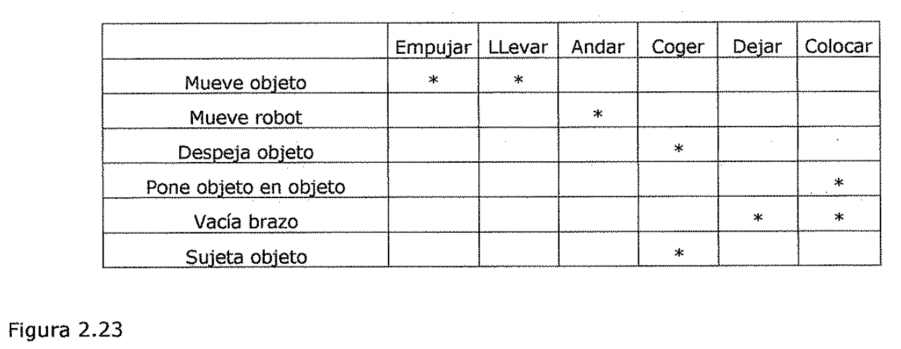

Tabla de diferencias

Suponga que dado su dominio, se le proporciona al robot el problema de mover un
escritorio de una habitación a otra, con dos objetos encima de el. Los objetos
situados sobre el escritorio deben moverse también. La principal diferencia
entre el estado actual y el estado objetivo debería ser la situación del
escritorio. Para reducir esta diferencia podría escogerse o bien EMPUJAR o bien
LLEVAR. Si se escoge en primer lugar LLEVAR, deben encontrarse sus
precondiciones. Esto proporciona dos diferencias más que deben reducirse: la
localización del robot y el tamaño del escritorio. La situación del robot puede
manipularse con la aplicación de ANDAR, pero no existen operadores que cambien
el tamaño de un objeto (puesto que no se incluye TROCEAR-SEPARAR). Por lo tanto,
este camino conduce a un callejón sin salida. Si se sigue por la otra rama, se
intenta aplicar EMPUJAR.

La Figura 2.24 muestra el progreso realizado por el resolutor del problema en
este punto. Se ha encontrado la forma de hacer algo útil. Pero aun no está en la
posición correcta para realizarlo. Ademas tampoco se llega al estado objetivo.
Por lo tanto, ahora hay que reducir las diferencias entre A y By entre Cy D.

A B C D

Empujar I

Estado inicial Objetivo

Figura 2.24

Progreso del método de análisis de medios y fines

EMPUJAR tiene cuatro precondiciones, dos de las cuales producen diferencias
entre los estados inicial y objetivo: el robot debe situarse en el escritorio y
el escritorio debe estar despejado. Puesto que el escritorio ya es grande y el
brazo del robot esta vado, estas dos precondiciones se pueden ignorar. Se puede
llevar al robot a la posición correcta utilizando CAMINAR, y con dos
aplicaciones de COGER se puede despejar la superficie del escritorio. Pero
después de ejecutar el primer COGER, el intento de realizar un segundo produce
otra diferencia- el brazo debe estar vado. Para reducir esta diferencia puede
usarse DEJAR. Una vez que se ha realizado EMPUJAR, el estado problema esta más
cerca del estado objetivo, pero no mucho. Los objetos deben volver a ponerse
sobre el escritorio. COLOCAR los pondrá allí de nuevo, pero no puede aplicarse
inmediatamente. Debe eliminarse otra diferencia ya que el robot debe estar
sosteniendo los objetos. En la Figura 2.25 se muestra el progreso realizado por
el resolutor de problemas. La diferencia final entre C y E puede reducirse
aplicando ANDAR para que el robot vuelva hacia los objetos, seguido de COGER y
LLEVAR.

A B C E D

I Andar Coger I DejarI Coger IDejar!empujaJ Estado inicial

Colocar Objetivo

Figura 2.25

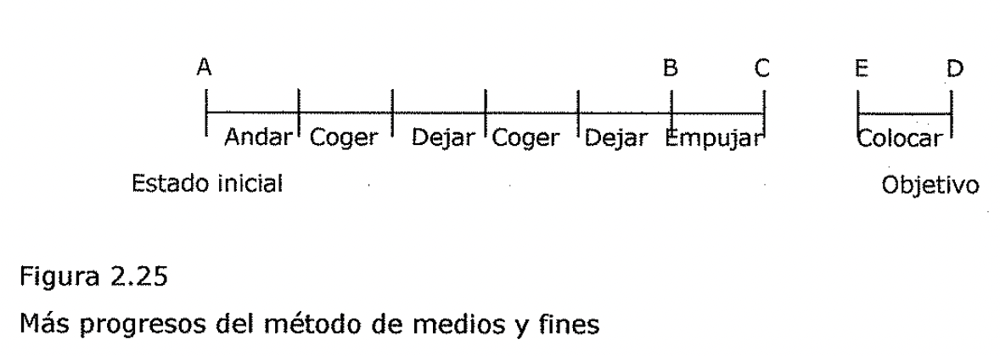

Mas progresos del método de medios y fines

## Búsqueda en problemas de juegos

* 1. Búsqueda en Problemas de juegos

## Juegos de dos jugadores

2.3.:1.. J111egos de dos jugadores

**Visión de conjunto**

Para mucha gente los juegos provocan una inexplicable fascinación, y la idea de
que las computadoras pudieran jugar ha existido al menos desde que existen las
computadoras. Charles Babbage, el famoso arquitecto de computadoras del siglo
XIX, pensó en programar su máquina analítica para que jugara al ajedrez, y más
tarde pensó en construir una máquina para jugar a las tres en raya (Bowden,
1953). Dos de los pioneros en las ciencias de la información y de la computación
contribuyeron a la incipiente literatura sobre juegos por computadora. Claude
Shannon (1950) escribió un articulo en el que se describían los mecanismos que
podían usarse en un programa que jugara al ajedrez. Pocos años después, Alan
Turing describió un programa para jugar al ajedrez, a pesar de que nuca lo
construyó. Al principio de los sesenta, Arthur Samuel tuvo éxito al construir el
primer programa de juegos importante y operativo. Su programa jugaba a las damas
y además de jugar, podía aprender de sus errores para mejorar su comportamiento
(Samuel, 1963).

Existian dos razones para que los juegos pareciesen un buen dominio de
exploración de la inteligencia de una máquina:

* Proporcionan una tarea estructurada en la que es muy fácil medir el éxito o el
 fracaso.

* Obviamente no necesitan grandes cantidades de conocimiento. Se pensó que se
 podrían resolver por búsqueda directa a partir del estado inicial hasta la
 posición ganadora.

La primera de estas razones aun sigue siendo valida y explica el continuado
interés en el área de los, juegos por computadora. Desafortunadamente, la
segunda no es cierta para aquellos juegos que no sean muy simples. Por ejemplo,
considere el juego del ajedrez.

* El factor de ramificación en una partida media es más o menos 35.

* En una partida media, cada jugador realiza 50 movimientos.

* Por tanto, para examinar el árbol del juego completamente, se tendrían que
 examinar 35100 posiciones.

Asi resulta evidente que un programa que realice una simple búsqueda exhaustiva
en el árbol del juego, no podrá seleccionar ni siquiera su primer movimiento
durante el tiempo de vida de su oponente. Es necesario algún tipo de
procedimiento de búsqueda heurística.

Una forma de contemplar todos los procedimientos de búsqueda que se han
explicado es que esencialmente se trata de ***procedimientos de generación y
prueba,*** en donde la comprobación se realiza después de cantidades distintas
de trabajo realizadas por el generador. En un extremo, *el generador proporciona
propuestas de soluciones completas,* que el comprobador evalúa. En el otro
extremo, *el generador genera movimientos individuates en el espacio de
búsqueda, cada uno de los cuales se evalúa a continuación mediante el
comprobador para pasar a elegir el más prometedor de ellos.* Mirandolo así,
resulta claro que para mejorar la efectividad de un programa resolutor de
problemas es necesario hacer dos cosas:

* ***Mejorar el procedimiento de generación*** de forma que solo se generen
 movimientos (o caminos) buenos.

* ***Mejorar el procedimiento de 'prueba*** para que solo se reconozcan y
 exploren en primer lugar los mejores movimientos (o caminos).

En los programas para jugar es particularmente importante que se hagan las dos
cosas. Si se usa un simple *generador de movimientos legales,* el procedimiento
de prueba (que probablemente,utiliza una combinación de búsqueda y una función
de evaluación heurística) deberá procesar cada uno de ellos. Como el
procedimiento de búsqueda debe tener en cuenta muchas posibilidades, debe ser
rápido. Por lo tanto, *probablemente no pueda realizar su trabajo con
precisión.* Suponga, por otra parte que en lugar de un generador de movimientos
legales, se usa un *generador de movimientos p/ausibles* en el que solo se
genera un *pequeño número de movimientos prometedores.* Conforme se incrementa
el número de movimientos legales posibles, la aplicación de técnicas heurísticas
para seleccionar solo aquellos que sean algo prometedores, se vuelve más
importante. Con un generador de movimientos más selective, *el procedimiento de
prueba puede permitirse el lujo de emplear más tiempo en la evaluación de cada
uno de los movimientos que* se *le proporcionan, por lo que puede producir un
resultado más fiable.* De este modo, con la incorporación de conocimiento
heurístico tanto en el generador como en el comprobador, se mejora el
rendimiento del sistema total.

Por supuesto, en los juegos, al igual que en otros dominios de problemas, la
búsqueda no es la única técnica disponible. En algunos juegos existen al menos
algunas ocasión)es.en.las que son apropiadas otras técnicas más directas. Por
ejemplo, en el ajedrez, tanto las aperturas como los finales están ampliamente
estudiados, por lo que es mejor jugar *consultando con una tabla de una base de
datos que almacene patrones.* ***Entonces para jugar una partida completa, deben
combinarse las técnicas orientadas a la búsqueda con las que no lo son.*** La
forma ideal de usar un procedimiento de búsqueda para encontrar una solución a
un problema, es generar mo\/cimientos a través del espacio del problema hasta que
se encuentra un estado objetivo. En el contexto de programas de juegos, un
estado objetivo es aquel en el cuál ganamos. Desafortunadamente, para juegos
interesantes como el ajedrez, normalmente no es posible buscar hasta encontrar
un estado objetivo, ni siquiera disponiendo de un buen generador de movimientos
plausibles. La profundidad del árbol (o grafo) resultante y su factor de
ramificación son demasiado grandes.

Con la cantidad de tiempo disponible, solo es posible buscar menos de diez
movimientos en el árbol (llamados capas en la literatura de juegos). As[ pues,
para elegir el mejor movimiento, deben compararse las posiciones del tablero
resultantes para determinar cuál es la más ventajosa. Esto se lleva a cabo con
una función de evaluación estática, que usa toda la información disponible para
evaluar posiciones individuales del tablero estimando la probabilidad de que
conduzcan eventualmente a la victoria. Su función es similar a la función
heurística h' en el algoritmo A\*: en ausencia de una información completa,
elige la posición más prometedora. Naturalmente, la función de evaluación
estática puede aplicarse simplemente a las posiciones generadas por los
movimientos propuestos. Pero, puesto que es difícil producir una función como
esta que sea realmente muy precisa, es mejor aplicarla tantos l niveles hacia
abajo en el árbol de juego como lo permita el tiempo disponible.

## Minimax

2.3.2. El procedimiento minimax

*El procedimiento de búsqueda mínimax* es *un procedimiento de búsqueda en
profundidad limitada.* La idea consiste en comenzar en la posición actual y usar
el generador de movimientos plausibles para generar un conjunto de posiciones
sucesivas posibles. Entonces se puede aplicar la función de evaluación estática
a esas posiciones y escoger simplemente la mejor. Después de hacer esto, puede
llevarse hacia atrás ese valor hasta la posición de partida para representar
nuestra evaluación de la misma. La posición de partida es exactamente tan buena
para nosotros como la posición generada por el mejor movimiento que podamos
hacer a continuación. Aquí se va a suponer que la función de evaluación estática
devuelve valores elevados para indicar buenas situaciones para nosotros, de
manera que nuestra meta es *.)* maximizar el valor de la función de evaluación
estática de la siguiente posición del tablero.

En la Figura 2.26 se muestra un ejemplo de esta operación. Supone una función de
evaluación estática que devuelve valores entre -10 y 10, donde 10 indica una
victoria para nosotros, -10 una victoria para el oponente y 0 un empate. Puesto
que nuestra meta es ***maximizar el valor de la función heurística,*** escogemos
movernos a B. Al llevar hacia atrás el valor de B hasta A, podemos concluir que
el valor de A es 8, puesto que sabemos que se puede llegar a una posición con un
*valor* de 8.

Figura 2.26

Búsqueda de una sola capa

Puesto que sabemos que *la función de evaluación estática no es completamente
precisa,* nos gustaría llevar la búsqueda más allá de una sola capa. Esto podría
ser muy importante, por ejemplo, en un juego de ajedrez donde estemos en medio
de un intercambio de piezas.

Después de nuestro movimiento, podría parecer que nuestra situación es muy
buena, pero, si mirásemos un movimiento más allá, veríamos que una de nuestras
piezas también es capturada, por lo que la situación no era tan favorable como
en principio parecía. Por tanto, nos gustaría prever que es lo que sucederá en
cada una de las nuevas posiciones del juego del siguiente movimiento realizado
por el oponente. En lugar de aplicar la función de evaluación estática a cada
una de las posiciones que acabamos de generar, aplicamos a cada una de ellas el
generador de movimientos plausibles, generando un conjunto de posiciones
posteriores para cada una de ellas. Si queremos pararnos ahi, en una previsión
de dos capas, podríamos aplicar la función de evaluación estática a cada una de
dichas posiciones, tal y como muestra la Figura 2.27.

Figura 2.27

9) (-6) (OJ (0) (c2)

Búsqueda de dos capas

Pero ahora debemos tener en cuenta el hecho de que *el movimiento que se realiza
a*. *continuación debe elegirlo el oponente,* y por tanto, deberá propagarse
hacia atrás al siguiente nivel. Supongamos que realizamos el movimiento B.
Entonces el oponente debe elegir entre los movimientos E, F y G. El objetivo del
oponente es ***minimizar el valor de la función de*** ***evaluación,*** por lo
que puede esperarse que elija moverse a F. Esto significa que si hacemos el
movimiento B, la verdadera posición en la que desembocamos en el siguiente
movimiento es muy mala para nosotros. Esto es cierto aunque el.nodo E represente
una posible configuración que fuese buena para nosotros. • • • Pero ya que no
nos toca a nosotros mover en este nivel, no podremos elegirlo. La Figura 2.28
muestra el resultado de propagar los nuevos valores hacia la raíz del árbol. En
el nivel representado por la elección del oponente, se elige el menor valor y se
propaga hasta la raíz. En el nivel que representa nuestra elección se ha elegido
el nivel máximo.

Maximización de la capa

Minimización de la capa

9) (-6) (0) (0) (-2) (-4) (-3)

Figura 2.28

Propagación hacia atrás de los valores en una búsqueda de dos capas

Una vez que se han propagado hacia atrás los valores del segundo nivel, resulta
claro que el movimiento correcto que podemos realizar en el primer nivel, dada
la información disponible, es C, puesto que no hay nada que el oponente pueda
hacer ah[ para producir un valor peor que -2.

Este proceso puede repetirse para tantos niveles como lo permita el tiempo
disponible, y las evaluaciones más precisas que se produzcan pueden usarse para
elegir el movimiento correcto en el nivel más alto.

*La alternancia de maximización y minimización en capas alternas cuando las
eva/situaciones se* *envían de regreso a la raíz, se corresponde con las
estrategias opuestas que siguen los dos* jugadores y que da a este método el
nombre de* ***mínimax.*** 2.3.3. El procedimiento alfa-beta

## Alfa beta

**Adición de la poda alfa-beta**

Recuerde que el procedimiento **mínimax** es un proceso primero en profundidad.
Cada camino se explora tan lejos como lo permita el tiempo, la función de
evaluación estática se aplica a las posiciones del juego en el último paso del
camino, y el valor debe entonces propagarse hacia atrás en el árbol de nivel en
nivel.

*Una de las ventajas de los procedimientos primero en profundidad es que a
menudo* puede mejorarse su eficiencia usando técnicas de ramificación y
acotación, en las que pueden abandonarse rápidamente aquellas soluciones
parciales que son c/claramente peores que otras so/soluciones conocidas.* Describimos
una aplicación directa de esta técnica en el problema del viajante de comercio.
Para este problema, lo único que se necesitaba era recordar la longitud del
mejor camino que se h.abia encontrado hasta el momento. Si otro camino parcial
sobrepasaba esa cota, se abandonaba. Pero, así como fue necesario modificar
ligeramente nuestro procedimiento de búsqueda para tratar los jugadores,
maximizador y minimizador, también es necesario modificar la estrategia de
ramificación y acotación para incluir dos acotaciones, una para cada uno de los
jugadores.

***Esta estrategia modificada* se *denomina poda a/fa-beta.***

/ Requiere el mantenimiento de *dos valores umbral,* uno que representa la
***cota inferior de/*** . ) ***valor*** que puede asignarse en último término a
un ***nodo maximizante*** (que llamaremos **alfa)** y otro que represente la
***cota superior del, valor*** que puede asignarse a':un ***nodo
minimizante*** (que llamaremos **beta).** Para ver como funciona el
*procedimiento a/fa-beta,* consideremos el ejemplo mostrado en la Figura 2.29.
Después de examinar el nodo F, sabemos que el oponente tiene garantizado un
resultado de -5 o menos en C (puesto que el oponente es el jugador minimizador).
Pero también sabemos que tenemos un resultado seguro de 3 o más en el nodo A,
donde podemos llegar si movemos a B. Cualquier otro movimiento que produzca un
resultado de menos de 3 es peor que el movimiento a B, y podemos ignorarlo. Con
solo examinar F podemos asegurar que un movimiento en C es peor (sera menor o
igual que -5), sin necesidad de mirar el resultado del nodo G. Asi pues, no
necesitamos en absoluto explorar el nodo G. Naturalmente, puede parecer que la
poda de un nodo no justifica el gasto de grabar los limites y examinarlos, pero
si estuviésemos explorando un árbol de seis niveles, entonces no solo habríamos
eliminado un nodo l'.mico, sino un árbol entero de tres niveles de profundidad.

Maximización de la capa

Minimización de la capa

Figura 2.29 Una poda alfa

Para ver como pueden usarse los dos umbrales, alfa y beta, consideremos el
ejemplo de la Figura 2.30. Al buscar este árbol, se explora el árbol entero
encabezado por B, y descubrimos que en A podemos esperar un resultado de 3 como
mínimo. Cuando este valor ***alfa*** se pase hacia F, nos permitirá evitar la
exploración de L. Veamos por que.

Después de examinar K, vemos que I proporciona un tanteo máximo de 0, lo que
significa que F produce un mínimo de 0, pero esto es menor que el valor alfa de
3, por lo que no necesitamos considerar más ramas de I. El jugador maximizador
ya sabe que no debe elegir C, y de ahi a I, puesto que si realiza ese movimiento
el tanteo resultante no sera mayor que 0, y en lugar de ello puede lograrse un
tanteo de 3 moviendo a B.

**Veamos ahora como usar el valor de beta.**

Después de podar cualquier exploración posterior de I, se examina J, que produce
un valor de 5, el cuál se asigna a su vez como valor de F (puesto que es el
máximo de 5 y 0). Este valor se convierte en el valor de ***beta*** en el nodo
C. Nos garantiza que C sera 5 o menos. A continuación debemos expandir G. En
primer lugar se examina M que tiene un valor de 7, el cuál se pasa a G como su
valor provisional. Pero ahora se compara 7 con beta (5). Es mayor, y el jugador
que tiene el turno del nodo C esta tratando de minimizar. Por lo tanto ese
jugador no elegirá G, que le conduciría a un resultado de 7 como mínimo, puesto
que hay una alternativa de volver a F, lo que producirá un tanteo de. 5, Asi
pues, no es necesario explorar ninguna de las otras ramas de G. • *A partir de
este ejemplo, se ve que en las niveles maximizantes podemos excluir un
movimiento tan pronto coma quede claro que su valor sera menor que el umbral
actual, mientras que en las niveles minimizantes la búsqueda terminara cuando se
descubran valores mayores que el umbral actual.* Pero la exclusión de un
movimiento posible del jugador maximizante significa realmente podar la búsqueda
en un nivel minimizante. Veamos de nuevo el ejemplo de la Figura.2.30. Una vez
determinado que C es un mal movimiento para A, no nos molestaremos en explorar
G, o cualquier otro camino, en el nivel minimizante por debajo de C.

*Por tanto, la forma en que se usan ahora a/fa y beta consiste en que la
búsqueda en un nivel minimizante puede terminar cuando se descubre un nivel/
menor que a/fa, mientras que en un nivel maximizante la búsqueda puede terminar
al descubrir un valor mayor que beta.* La acotación de la búsqueda en un nivel
maximizante cuando se encuentra un valor alto puede parecer, a.I principio,
opuesto a la intuición, pero si se piensa en que solo llegamos a un nodo
concreto de un nivel maximizante si el jugador minimizante del nivel anterior lo
elige, entonces tiene sentido.

Maximización de la capa

Minimización de la capa

Maximización de la capa

Figura 2.30 Podas alfa y beta

Minimización de la capa

* 1. **Búsqueda con Sistemas evolutivos**

1. **Conceptos de Genética Que son los genes**

El descubrimiento de la naturaleza del material hereditario representaba un hito
importante en el desarrollo de la *Genética.* Sin embargo, el estudio de la
herencia había empezado mucho tiempo antes. Ya durante el siglo **XVIII**
algunos investigadores se habían dedicado a observar la aparición de "monstruos"
resultantes del cruzamiento entre especies animales diferentes, "monstruos" que,
según decían, presentaban una mezcla •de caracteres de los dos animales
progenitores. Después, durante los siglos **XVIII y XIX,** se desarrollaron
mucho, con finalidades económicas los trabajos de mejora de razas animales y
vegetales.

Sin embargo, durante todo ese tiempo, los estudios sobre la herencia no podían
considerarse como verdaderamente científicos. Solo podemos hablar de ciencia
cuando a partir de unos datos experimentales es posible elaborar unas reglas
o!eyes que generalmente permiten predecir comportamientos posteriores. En la
genética premendeliana no ocurría asi: se realizaban cruzamientos al azar, sin
poder predecir las características de la descendencia, En 1866 el fraile
agostino austríaco Gregor Mendel, que había realizado experimentos con plantas
de guisantes durante varios anos, enuncio las leyes de la herencia. Su éxito fue
debido al excelente planteamiento de dos experimentos: en primer lugar, a la
elección de un material adecuado, como es el guisante, para controlar los
cruzamientos, y en segundo. lugar, a haber ' simplificado al máximo los mismos,
dedicándose a estudiar un solo carácter cada vez. De este modo, Mendel llego a
la conclusión de que todo carácter heredable depende de la presencia en las
células del organismo de unos ***"factores hereditarios",*** transmisibles de
padres a hijos y de los que todo organismo posee dos para cada carácter, uno
procedente del padre y otro de la madre.

Consideremos un carácter humano, como es la coloración parda de los ojos. El que
un individuo posea ojos pardos sera debido a que posee en cada célula dos
factores hereditarios determinantes del color pardo, procedentes uno del padre y
otro idéntico de la madre. A su vez, cuando este individuo forme la célula
reproductora que, junto con la procedente de un individuo del otro sexo, dará
lugar al hijo, donara a la misma uno de aquellos *"factores".* (' Las partículas
concretas y finitas que Mendel denomino *"factores hereditarios"* comenzaron a
ser denominadas ***genes*** a partir de 1910.

Actualmente se considera que un *gen* es un fragmento de DNA asociado a
moléculas de proteína en los organismos superiores, que generalmente contiene
información relativa a un carácter heredable del organismo.

**Cromosomas**

La cantidad de DNA contenida en un organismo eucarionte es muy superior a la
contenida en un procarionte. Un problema que se presentara en los primeros es el
modo de transmisión del DNA a las células hijas.

Cuando una célula del eucarionte se halla en reposo, entre una división celular
y la siguiente (r no se advierte ninguna estructura visible en el interior de su
núcleo; ni siquiera mediante el microscopio electrónico. El DNA se halla
disperso en el interior del núcleo, aparentemente en estado de reposo
divisional. Sin embargo, la situación verdadera es muy distinta: en este
estadio, el *material genético* se esta reproduciendo, de modo que cada molécula
de DNA da origen a dos moléculas hijas, que son copias prácticamente exactas de
la primera.

En cuanto la célula comienza su división, el núcleo desaparece y el DNA, hasta
entonces invisible, comienza a apelotonarse de modo regular, formando unas
estructuras muy densas, a modo de bastoncillos dobles, muchas veces en forma de
X, denominadas ***cromosomas.*** El número de estos cromosomas presentes en las
células de un determinado organismo es constante, salvo casos anómalos; así, el
hombre posee 46 de ellos en sus células, al igual que la patata. A medida que la
división celular progresa, los cromosomas se sitúan en el centro de la célula
formando una figura a modo de estrella; seguidamente, cada cromosoma se divide
en sentido longitudinal en dos mitades, yendo cada una a extremos opuestos de la
célula. Por último, los bastoncillos se desapelotonan, los *cromosomas* dejan de
ser visibles y se forman. dos nuevos núcleos (correspondientes a las dos nuevas
células), rodeando a los nuevos cromosomas.

Los cromosomas deben considerarse, pues, como las estructuras formadas por el
DNA para transmitirse a las células hijas.en el transcurso de la división
celular.

Hay, no obstante, otro hecho fundamental a considerar: los cromosomas de una
especie son iguales dos a dos.. Asi, los 46 cromosomas de la célula humana son,
en realidad, 23 parejas de cr.cromosomas homólogos. En cada pareja de cromosomas
homólogos uno procede del padre y el otro de'la madre. Vemos, pues, que existe
un paralelismo entre los *genes y los cromosomas:* así como cada célula tiene dos
cromosomas homólogos, uno procedente del padre y otro de la madre, también posee
dos genes correspondientes a un carácter dado, procedente cada uno de un
progenitor. Esto no es casual: los genes del organismo (constituidos por DNA) se
disponen linealmente a lo largo de los cromosomas, de modo que cada gen se halla
por duplicado en alguna de las parejas de homólogos. Con todo lo dicho, podemos
tener ya una idea global de la relación DNA-gen-cromosoma: el cromosoma es una
organización lineal de genes, formada por DNA y que unicamente se hace visible
cuando, durante la división celular, su grado de engrosamiento es suficiente.

**Mutaciones I**

Las diferencias existentes entre individuos de una misma especie y de especies
diferentes se deben a cambios genéticos denominados ***mutaciones.*** En la
naturaleza, estas mutaciones aparecen de modo espontaneo y, sin duda, no todas
ellas resultan favorables para el individuo. En algunos casos, es posible que
los individuos sujetos a mutaciones se hallen en situación desfavorable respecto
del resto de la población y, aunque no necesariamente sujetos a una eliminación
rápida desaparecerán finalmente. En otros casos, la mutación representara para
los individuos que la posean una mejora y, al reproducirse más fácilmente que el
resto de la población, pasaran más o menos tarde a constituiría por entero.

La evolución de la vida en la Tierra ha sido debida a la existencia de
*mutaciones.* Estas, aunque en muchos casos son causa de muerte, en otros lo son
de progreso, al permitir la aparición de genes que informan acerca de nuevas
funciones. Asi, a lo largo de millones de años ha sido posible una revolución
que ha originado formas vivas tan diferentes como las existentes hoy. Esa
*evolución* se produce frecuentemente en el sentido positivo de progreso, el
cuál es preciso concebirlo como una más eficaz relación entre organismo y medio
ambiente. Sin embargo, las características del medio ambiente pueden cambiar
hasta hacer que tal ·1 eficacia se anule. Por eso, las especies vivas no solo
aparecen, sino que también desaparecen cuando una situación favorable se torna
desfavorable. Esto, que ha ocurrido durante toda la historia de la vida en la
Tierra, ocurre también ahora y el hombre no se halla exento de la regla.

**Mutaciones II**

Desde el punto de vista de la genética de poblaciones, las mutaciones son
cambios heredables que ocurren en el genotipo. Estos cambios se producen por
casualidad, en el sentido de que el ambiente no puede influir.sobre el tipo de
mutación producida, pero la tasa de mutaciones sí puede ser influida por
factores ambientales (como la radiación) y también los distintos genes tienen
tasas distintas de mutación por razones que se relacionarían con la composición
química del gen en cuestión y con su posición en el cromosoma. La tasa medio de
mutaciones detectables en el fenotipo esta comprendida entre 1 en 1000 y 1 en
1000000 de gameto por generación, según el alelo de que se trate. Si
suponemos que existen unos 100000 genes ***(pares de alelos)*** en cada ser
humano, cabe suponer que cada recién nacido es portador de dos mutaciones
nuevas. Asi, aunque la incidencia de mutaciones en cada gen en,particular es
pequeña, la cantidad de mutaciones nuevas por cada generación de la población
es muy grande. Las mutaciones suelen considerarse la materia prima de los
cambios evolutivos; ·ellas introducen variaciones sobre las que actúan otras
fuerzas evolutivas, pero no determinan. la dirección del cambio evolutivo.

**El lenguaje de la vida**

Hasta 1950 se sabia que las características de los seres vivos vienen
determinadas por los genes. Se sabia que estos están constituidos por lo que se
denomina proteínas y ácidos nucleicos. Pero hasta 1950, los *genes* son
considerados como estructuras extremadamente . complejas, en tres dimensiones,
cada una de las cuales sería completamente diferente de las demás. La
ext.extraordinaria revelación de los años cincuenta fue demostrar que esta
complejidad infinita es debida simplemente a la combinatoria de un número mUy
pequeño• de unid;3des químicas, *de cuatro pequeñas moléculas.* Estas cuatro
unidades se repiten por millones. a lo largo de la fibra cromosómica. Se
combinan y permutan hasta el infinito como las letras de un alfabeto a lo largo
de un texto.

Del mismo modo que una frase constituye un segmento de un texto, de<igual manera
un *gen* corresponde a una cierta secuencia de *signos químicos.* En ambos
casos, un símbolo aislado no representa nada; solo la combinación de los signos
adquiere.un *"sentido'.'.* En ambos casos, una secuencia dada, frase o gen, se
inicia y se termina con signos específicos de *''puntuación".* La traducción de
la secuencia nucleica en secuencia proteica es <comparable a la traducción de un
mensaje que llega, cifrado en Morse, pero que solo tiene sentido una vez.que ha
sido traducido al español, por ejemplo. Dicha traducción se efectúa mediante una
*"clave"'que* da la equivalencia de los *"signos"* entre los dos *"alfabetos'*
nucleico y proteico.

La clave genética se conoce hoy perfectamente. Cada unidad proteica corresponde
a un ***"triplete",*** es decir, una combinación particular de tres entre las
cuatro unidades nucleicas.

Como existen 43 = 64 combinaciones posibles de tres unidades nucleicas, el
*"diccionario" (* genético contiene 64 *"palabras".* Tres de estos tripletes
aseguran la *"puntuación'* es decir, indican, en la cadena nucleica, el inicio y
el fin de las *"frases"* que corresponden a las cadenas proteicas. Cada uno de
los otros tripletes "representan " una de las unidades proteicas. Como el número
de dichas unidades esta limitado a 20, cada una de ellas responde a varios
tripletes, a varios sinónimos en el diccionario, de lo que se deriva cierta
flexibilidad en la escritura de la herencia.

Con todo ello se pone de manifiesto que todos los organismos, de la bacteria al
hombre, son capaces de interpretar correctamente cualquier mensaje genético. La
clave genética parece universal y su secreto conocido por todo el mundo
viviente.

Existe, pues, una analogía muy sorprendente entre los dos sistemas, genético y
lingüístico, ya que, por una parte, se observa una estricta colinearidad de los
fenómenos del codificación y que, por otra parte, nos encontramos ante una
combinatoria de elementos, fonemas o radicales químicos, que aislados no
significan nada y que solo toman un sentido cuando se combinan con otros
elementos. Todavía pueden ponerse en evidencia analogías más profundas, ya que
es posible, en ambos casos reducir las relaciones entre elementos, fonemas o
radicales químicos a sistemas de oposición binaria, y que en ambos casos se
encuentran niveles de construcción jerarquizados por unidades de rango inferior.
Se trata, pues, de saber en que medida todas estas semejanzas traducen o no algo
más que una analogía. El destacado lingüista Roman Jakobson encuentra dicha
analogía tan sorprendente que duda que sea debida al azar. Se pregunta si, de
alguna forma, el sistema del lenguaje no se ha modelado sobre el de la herencia.
t"

**Crossing Over**

El ***crossing over*** es el intercambio de porciones de cromosomas homólogos y
tiene lugar al comienzo de la meiosis.

Con el descubrimiento de los *crossover,* no solo se empezó a comprender que los
genes están en los cromosomas, como había supuesto Sutton, sino también que
tienen que hallarse en. determinados sitios o *loci* (singular, locus) en los
cromosomas. Ademas, los alelos de cualquier gen en particular tienen que ocupar
loci concordantes en cromosomas homólogos. De lo contrario, el intercambio de
porciones de cromosomas ocasionaría un caos genético, en lugar de un intercambio
exacto de *alelos.* Sturtevant postulo:

1. que los genes están dispuestos en una serie lineal en los cromosomas como las
 cuentas de

un collar

1. que los genes que están. muy próximos se habrán de separar mediante
 *crossing over* con *c*

menos frecuencia que los genes más distantes

1. que determinando, por lo tanto, las frecuencias de las *recombinaciones,* se
 podría establecer la secuencia de los genes a lo largo del cromosoma y las
 distancias relativas entre ellos.

**Migración: flujo de genes**

Flujo de genes es *el movimiento de alelos* hacia y desde una población.como
consecuencia de la *inmigración o emigración* de individuos reproductivos o, en
el caso de las plantas, la introducción de gametos (por medio del polen)
procedentes de otras poblaciones. La inmigración puede introducir alelos nuevos
en una población o modificar las frecuencias de los alelos. Su efecto global *es
reducir la diferencia entre las poblaciones,* mientras que la ' ***se/elección
natural*** tiende a *acentuar las diferencias* al producir poblaciones más aptas
para distintas condiciones locales. En consecuencia a menudo el flujo genético
contrarresta la selección natural y, como veremos, también puede inhibir la
*especiación.*

**Modalidades de la Evolución**

La selección natural produce distintas modalidades de evolución. Puede originar
*fenotipos* muy distintos en organismos íntimamente emparentados, fenotipos muy
similares en organismos que son parientes lejanos, o los organismos mismos
pueden convertirse en las fuerzas de selección por medio de sus interacciones
con otras especies.

*Evolución divergente* La evolución divergente ocurre cuando una población queda
aislada del resto de la especie y, a causa de determinadas presiones de
selección, emprende un curso evolutivo distinto.

Evolución convergente

Muchas veces los organismos que ocupan ambientes similares vienen a asemejarse
entre ellos aunque filogenéticamente tengan un parentesco muy distante. Al estar
sujetos a presiones de selección similares, exhiben adaptaciones similares.

Evolución paralela

La evolución paralela se emplea para describir una situación en la cuál los
linajes han I cambiado de maneras similares, de modo que los descendientes
evolucionados se •parecen tanto entre ellos como lo fueron sus antepasados.

Coevolucion

Cuando dos o más poblaciones interactúan de manera tan intima que cada una de
ellas ejerce una potente fuerza selectiva sobre la otra, ocurren ajustes
simultáneos que producen coevolución.

1. **Algoritmos Genéticos**

Los ***Algoritmos Genéticos (AG)*** son métodos adaptativos que pueden ser
utilizados para implementar búsquedas y problemas de optimización. Ellos están
basados en los procesos genéticos de organismos biológicos, codificando una
posible solución a un problema en un ***"cromosoma"*** compuesto por una cadena
de bits o caracteres.

Estos cromosomas representan individuos que son llevados a lo largo de varias
***generaciones;*** en forma similar a las. poblaciones naturales, evolucionando
de;acuerdo a los principios de ***selección natural* y *"supervivencia"*** del
más apto, descritos pbr primera vez por Charles· J Darwin en su libro "Origen de
las Especies". Emulando estos procesos, los Algoritmos Genéticos son capaces de
"evolucionar" soluciones a problemas del mundo real.

En la naturaleza, los individuos compiten entre si por recursos tales como
comida, agua y refugio. Adicionalmente, los animales de la misma especie
normalmente antagonizan para obtener una pareja. Aquellos individuos que tengan
más éxito tendrán probablemente un número mayor de descendientes, por lo tanto,
mayores probabilidades de que sus genes.sean propagados a lo largo de sucesivas
generaciones. La combinación de características de los padres bien adaptados, en
un descendiente, puede producir muchas veces un nuevo individuo mucho mejor
adaptado que cualquiera de sus padres a las características de su medio
ambiente.

Los Algoritmos Genéticos utilizan una analogía directa del fenómeno de evolución
en la naturaleza. Trabajan con una ***población de individuos,*** cada uno
representando una posible solución a un problema dado. A cada individuo se le
asigna una ***puntuación de. a,adaptación'.*** dependiendo de que tan buena fue
la respuesta al problema. A los más adaptados ·se ies da la oportunidad de
reproducirse mediante cruzamientos con otros individuos de la población,
produciendo descendientes con características de ambos padres. los miembros
menos adaptados poseen pocas probabilidades de que sean seleccionados para la
reproducción, y desaparecen.

Una nueva población de posibles soluciones es generada mediante la *selección*
de los mejores individuos de. la generación actual; emparejándolos entre ellos
para producir un nuevo conjunto de individuos. Esta nueva generación contiene
una proporción más alta de las características poseídas por los mejores miembros
de la generación anterior. De esta forma, a.

lo largo de varias generaciones, las características buenas son difundidas a lo
largo de la población mezclándose con otras. Favoreciendo el emparejamiento de
los individuos mejor adaptados, es posible recorrer las áreas más prometedoras
del espacio de búsqueda. Si el Algoritmo Genético ha sido diseñado
correctamente, la población convergerá a una solución óptima o casi óptima al
problema.

Los dos procesos que más contribuyen a la evolución son el ***crossover*** y la
adaptación basada en la ***selección.*** La ***mutación*** también juega un
papel significativo, pero determinar que tan importante sea su rol, continua
siendo una materia de debate (algunos se refieren a ella como un operador en
background), ella no debe ser utilizada demasiado, ya que el Algoritmo Genético
se puede convertir en una búsqueda al azar, pero su utilización asegura que
ningún punto en el espacio de búsqueda tiene probabilidad O de ser examinado.

En la practica, se puede implementar este modelo, utilizando matrices de bits o
caracteres para representar los cromosomas. Operaciones sencillas de bits
permiten efectuar el crossover, la mutación y otras operaciones. A pesar de que
una gran cantidad de investigación ha sido realizada en cadenas de longitud
variable y otras estructuras, la mayor parte del trabajo con AG ha sido enfocado
en cadenas de caracteres de ***longitud fija,*** Se hace énfasis en este aspecto
y en la necesidad de codificar la solución como una ***cadena de caracteres.***
Generalmente, los AG son implementados siguiendo el siguiente ciclo:

1. Generar aleatoriamente la población inicial

2. Evaluar la adaptación de todos los individuos en la población.

3. Crear una nueva población efectuando operaciones como crossover, reproducción
 proporcional a la adaptación y muta.i;iones en los individuos cuya adaptación
 acaba de ser medida.

4. Eliminar la antigua población.

5. Iterar utilizando la nueva población, hasta que la población converja. Cada
 iteración de este bucle es conocida como ***generación.*** La
 primera generación de este

proceso es una población de individuos generados al azar. Desde ese punto, los
operadores genéticos, en unión con la medida de adaptación, actúan para mejorar
la población. • Generación de la Población Inicial

Mejores Individuos

Figura 2.31

| --- | --- | --- |

| Evaluación de la Función Objetivo | | |

| | Generación una nu | |

ión de eva población SELECCION

CROSSOVER

MUTACION

Los Algoritmos Genéticos no son la (mica técnica basada en una analogía de la
naturaleza. Por ejemplo, las.Redes Neurales están basadas en el comportamiento
de las neuronas en el cerebro. Pueden ser utilizadas en una · gran variedad de
tareas de clasificación, como reconocimiento de patrones o proceso de imágenes.
Actualmente está en investigación la utilización de Algoritmos Genéticos para el
diseño de Redes Neurales.

El poder de los Algoritmos Genéticos proviene del hecho de que la técnica es
robusta, y puede manejar exitosamente un amplio rango de problemas, incluso
algunos que son difíciles de· resolver por otros métodos. Los Algoritmos
Genéticos no garantizan que encontraran la solución óptima al problema, pero son
generalmente buenos encontrando soluciones aceptables a problemas en corto
tiempo. Donde existan técnicas especializadas para la resolución de problemas,
estas superaran fácilmente a los Algoritmos Genéticos tanto en velocidad como en
precisión.

El campo principal de aplicación es donde no existan este tipo de técnicas.

\ **Diferencias entre los Algoritmos Genéticos y los métodos tradicionales.** I
Los Algoritmos Genéticos tienen cuatro diferencias principales con los métodos
más utilizados o conocidos de optimización y búsqueda:

1 • Trabajan con una codificación del conjunto de parámetros, no con estos
directamente. • Buscan simultáneamente la solución en una población de puntos,
no en uno solo.

• Utilizan la función objetivo (rendimiento), no derivadas u otro conocimiento
auxiliar.

I • Utilizan reglas de transición probabilísticas, y no determinísticas.

2.4.3. Poblaciones

**Codificación**

Las partes que relacionan un Algoritmo Genético con un problema dado son la
codificación y la función de evaluación.

Si un problema puede ser representado por un ***conjunto de parámetros***
*(conocidos coma genes),* estos pueden ser unidos para formar una ***cadena de
va/ores*** *(cromosoma),* a este proceso se le llama ***codificación.*** En
genética este conjunto representado por un cromosoma en particular es referido
como ***genotipo,*** este contiene la información necesaria para construir. un
organismo, conocido como ***fenotipo.*** Estos mismos términos se aplican en
Algoritmos Genéticos, por ejemplo, si se desea diseñar un puente, el conjunto
de parámetros especificando el diseño es el genotipo, y la construcción I final
es el fenotipo. La adaptación de cada individuo depende de su fenotipo, el cuál
se puede inferir de su genotipo, es decir, puede calcularse desde el cromosoma
utilizando la función de evaluación.

I Por ejemplo, si se tiene un problema de maximizar una función de tres
variables, F(X,Y,Z), se podría representar cada variable por un número binario
de 10.bits, obteniéndose un I cromosoma de 30 bits de longitud y 3 genes.

Existen varios aspectos relacionados con la codificación de un problema a ser
tomados en cuenta en el momento de su realización:

• Se debe utilizar el alfabeto más pequeño posible para representar los
parámetros, normalmente se utilizan dígitos binarios.

* Las variables que representan los parámetros del problema deben ser
 discretizadas

para poder representarse con cadenas de bits, hay que utilizar suficiente
resolución para asegurar que la salida tiene un nivel de precisión adecuado, se
asume que la discretización es representativa de la función objetivo.

* La mayor parte de los problemas tratados con Algoritmos Genéticos son no
 lineales y muchas veces existen relaciones *"ocultas"* entre las variables que
 conforman la solución. Esta interacción es referida como ***epistasis,*** y es
 necesario tomarla en cuenta

para una representación adecuada del problema. El tratamiento de los genotipos
inválidos debe ser tornado en cuenta para el diseño de la codificación.
Supóngase que se necesitan 1200 valores para representar una variable, esto
requiere al menos 11 bits, pero estos codifican un total de 2048 posibilidades,
*"sobrando"* 848 patrones de bits no necesarios. A estos patrones se ¿es puede
dar un valor cero de adaptación, ser substituidos por un valor real, o eliminar
el cromosoma.

2.4.4. Operadores genéticos

Los Operadores genéticos son las distintas funciones que se aplican a las
poblaciones, las cuales permiten obtener poblaciones nuevas:

Los tipos de operadores más usados son:

* Selección

* Crossover

* Mutación

* Migración

* Otros operadores

**Selección**

Determina como los individuos son elegidos para el apareamiento. Si se usa un
método de ' selección que elija a los mejores individuos entonces la población
convergerá hacia estos individuos pero estos no representan la solución,
entonces se seleccionan individuos, que a pesar de no ser los mejores, tienen
algún tipo de material genético bueno en ellos.

Los métodos de selección más comúnmente usados son el método de la ruleta,
torneos o ranking.

**Crossover**

Consiste en el intercambio de material genético entre dos cromosomas. El
crossover es el principal operador genético, hasta el punto que se puede decir
que no es un algoritmo genético ' si no tiene crossover, y.sin embargo, puede
serlo perfectamente sin mutación. La propuesta primaria del operador crossover
es obtener material genético de las generaciones anteriores para las siguientes
generaciones.

Para aplicar el crossover, entrecruzamiento o recombinación, se escogen
aleatoriamente dos miembros de la población. No pasa nada si se emparejan dos
descendientes de los mismos padres, ello garantiza la perpetuación de un
individuo con buena puntuación. Sin embargo, si esto sucede demasiado a menudo,
puede crear problemas, ya que toda la población puede aparecer dominada por los
descendientes de algún gen.

La forma básica de este operador toma dos individuos y corta sus cromosomas en
una posición seleccionada al azar, para producir dos segmentos anteriores y dos
posteriores, los posteriores se intercambian para obtener dos cromosomas nuevos.
Esto es conocido como *crossover de un* *punto. (*

**Puntos de -Crossover**

**PADRES**

101 0111 110 1110

HIJOS 101 1110 110 0111

Figura 2.32

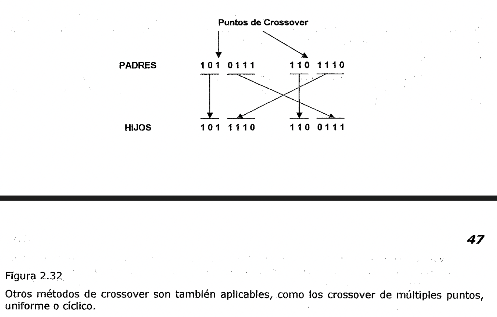

Otros métodos de crossover son también aplicables, como los crossover de
múltiples puntos, uniforme o cíclico.

**Mutación**

La mutación es la alteración en forma aleatoria de un individuo de la población.
Esto es necesario para que no se produzca una convergencia prematura y que todos
los individuos de la población no tengan probabilidad cero de ser utilizados.

Este operador se aplica eventualmente a algunos individuos para cambiar
aleatoriamente una parte de su material genético e introducir diversidad a la
población.

No hace falta decir que no conviene abusar de la mutación. Es cierto que es un
mecanismo generador de diversidad, y por lo tanto, la solución cuando un
algoritmo genético esta estancado, pero también es cierto que reduce el
algoritmo a una búsqueda aleatoria.

Descendiente

Descendiente mutado

Punto de Mutación

1010010

1010110

Figura 2.33

* ) **Migración**

La migración es el operador que genera un intercambio de individuos entre
subpoblaciones. Este operador es aplicable en el caso de desarrollar una
técnica de Algoritmos Genéticos Paralelos para la resolución de un problema.

Al recibir individuos de otras subpoblaciones (migración) se introduce la
diversidad y se incrementa la presión de la selección (se aumenta la competencia
por sobrevivir) en cada *!* subpoblación. Esto es muy útil para evitar
convergencias prematuras a óptimos locales. Sin embargo, si la subpoblación ha
llegado a un estado de equilibrio, la introducción de nuevo material puede no
ser efectiva porque es posible que cada subpoblación haya encontrado un nicho
adecuado **y** se hayan formado especies distintas.

**2.4.5. Función de evaluación**

Dado un cromosoma, la función de evaluación consiste en asignarle un valor
numérico de ***"adaptación",*** el cuál.se supone que es.proporcional a la
*"utilidad"* o *"habilidad"* del individuo representado. En muchas casos, el
desarrollo de una función de evaluación involucra hacer una simulación, en
otros, la función puede estar basada en el rendimiento y representar solo una
evaluación parcial del problema.

Adicionalmente debe ser rápida, ya que hay que aplicarla para cada individuo de
cada población en las sucesivas generaciones, por lo cuál, gran parte del tiempo
de corrida de un algoritmo genético se emplea en la función de evaluación.

**Convergencia**

Si el Algoritmo Genético ha sido correctamente implementado, la población
evolucionara a lo largo de sucesivas generaciones de forma que la adaptación del
mejor y el promedio general se incrementarán hacia el óptimo global.

La convergencia es la progresión hacia la uniformidad. Un gen ha convergido
cuando el 95% de la población tiene el mismo valor. La población converge
cuando todos los genes de cada individuo lo hacen.

Por ejemplo la figura siguiente muestra la convergencia representada por la
varianza de una población a lo largo de sucesivas generaciones.

Figura 2.34

Un problema de los Algoritmos Genéticos dado por una mala formulación del modelo
es aquel C en el cuál los *genes de unos pocos individuos* relativamente bien
adaptados, pero no óptimos, pueden rápidamente *dominar la población,* causando
que converja a un máximo local.

Una vez que esto ocurre, la habilidad del modelo para buscar mejores soluciones
es *e/eliminada completamente,* quedando solo la mutación como vfa de buscar
nuevas alternativas, y el algoritmo se convierte en una búsqueda lenta al azar.

Para evitar este problema, es necesario *controlar el número de oportunidades
reproductivas de* *cada individuo,* tal que, no obtenga ni muy alta ni muy baja
probabilidad. El efecto es comprimir el rango de adaptación y prevenir que un
individuo *"super-adaptado"* tome control rápidamente

**Finalización lenta**

Este es un problema contrario al anterior, luego de muchas generaciones, la
población habrá C convergido, pero *no habrá localizado el máximo global.* La
adaptación promedio sera alta y habrá poca diferencia entre el mejor y el
individuo promedio, por consiguiente sera muy baja la tendencia de la función de
adaptación a llevar el algoritmo hacia el máximo. Las mismas técnicas aplicadas
en la convergencia prematura son utilizadas en este caso.

**Algoritmo Genético Canónico**

El primer paso en la implementación de un algoritmo genético, una vez
establecida la función objetivo, consiste en definir el tipo de la tira que
conformara el cromosoma.

En los AG Canónicos, las mismas son ***tiras binarias*** de longitud L. Cada gen
es un dígito 0 o 1.

Conocido ***N,*** número de cromosomas que compondrán las distintas poblaciones,
se procede a crear la población inicial. Este proceso, en general se realiza en
forma ***random.*** Cada gen de cada cromosoma toma el valor 0 o 1 en forma
aleatoria.

A continuación, cada cromosoma es evaluado, usando la ***función objetivo*** y
la ***función fitness.*** Ambas funciones, suelen s.er intercambiables, aunque
no hay que olvidar que, en realidad, se trata de funciones conceptualmente
distintas.

En los AGC, la ***función fitness*** se define para cada cromosoma, como el
cociente ***fi/F,*** donde ***fi*** es el valor de la ***función objetivo***
correspondiente, mientras que ***F*** es el ***promedio de los valores de la
función objetivo*** para cada tira de la población.

**Desarrollo paso a paso de un AG Canónico**

Aplicaremos un AG simple a un problema particular de optimización, paso por
paso. Consideremos el problema de ***maximizar la función f(x}=xA2,*** para
***x*** variando entre ***0* y *31.*** Para comenzar debemos codificar las
variables de decisión de nuestro problema como tiras de longitud finita. Para
este caso nos sirve codificar la variable ***x*** como enteros binarios sin
signo de longitud 5, lo que nos permite obtener desde ***00000*** (0) hasta
***un1*** (31).

Fijada ya la función objetivo y definida la codificación de x, podemos simular
una simple generación de un AG con selección, crossover y mutación.

Comenzaremos fijando una ***población inicial de4 miembros*** de 5 dígitos
binarios cada uno en forma aleatoria. Para este bajo número, podemos utilizar
los valores obtenidos al arrojar una moneda. Supongamos que los resultados son
los siguientes:

01101

11000

01000

10011

Con estos datos disponibles podemos construir una tabla donde reflejemos los
componentes de la población, el valor de x que le corresponde, el valor de la
función objetivo para cada uno.

Numero de string

Población Inicial

01101

Valor de x

f(x) = xA2 fi/F fi/F 01000

Veces seleccionados

La columna fi/F nos da el peso porcentual que tiene cada componente de la

población inicial en el aro de la ruleta, de donde puede apreciarse que después
de ponerla en funcionamiento los componentes 1 y 4 son seleccionados en una
ocasión cada uno, mientras que el 2 lo hace en 2 oportunidades y el 3 no es
seleccionado. Esta población intermedia constituye lo que llamamos ***"mating
pool".*** Esta primera etapa, creación de la población intermedia se denomina
***Selección*** (aplicando en este ejemplo el método de la Ruleta) A
continuación comenzaremos con el proceso de ***crossover.*** Para ello vamos
extrayendo al azar pares de padres que serán sometidos a la cruza. En general,
con los pares seleccionados y antes de la cruza se consulta un factor
probabilístico llamado ***"Pc: probabilidad de cruza",*** que establece el
usuario al comienzo de la ejecución, el que asumiremos como suele ser común
***Pc* = 0,6.** Esto significa que se genera un número al azar que puede valer O
o 1 (este último con un 60% de probabilidad). Si el valor es 1, se procede al
proceso de crossover. Para el ejemplo utilizaremos ***Crossover de un punto.***
En este caso se elige un número al azar entre 1 y 4 en general ***entre 1 y
L-1,*** si L es la longitud de la tira). En este punto se intercambian las colas
de las tiras para crear un par de hijos.

Supongamos que ***el punto de corte es 4*** y que el par de padres seleccionados
son el primero y el segundo. Por lo tanto los hijos engendrados serán:

0110 j **1** 01100

1100 Io 11001

En el próximo intento los padres 11000 (segundo) y 10011 (cuarto) con un punto
de corte en 2, da los hijos 11011 y 10000. Con esto finaliza el Crossover de un
punto.

Finalmente nos queda el proceso de ***mutación*** que viene controlado por el
factor ***"Pm:*** ***probabilidad de mutac:ión".*** Este, habitualmente, es un
valor bajo, por ej: ***0,001..*** Con tal valor, y dado los escasos componentes
de la población vamos a considerar que no se producirá mutación en esta
generación.

Podemos, ahora, expresar estos nuevos resultados en la tabla siguiente:

| --- | --- | --- |

| Nueva oblación | Valor de x | f(x); xA2 |

| 01100 | 12 | 144 |

| 11001 | 25 | 625 |

Este proceso continua de la misma manera y se detiene, entre otros criterios,
cuando se lograron un número determinado de generaciones (por ejemplo, 10).

Comencemos a analizar lo que se pone de manifiesto en este ejercicio. El
***promedio*** (de 293 a 439) y el ***máximo*** (de 576 a 729) mejoran cuando se
pasa de la primera generación a la segunda. Esto se logra combinando azar con
una buena elección de padres (dado por sus fitness).

Ejercicio

Hacer un programa que utilice un Algoritmo Genético Canónico para buscar un
máximo de la función:

f(x) = (x/coef(2 en el dominio [0, 2"30 -1] donde coef = 2"30 -1 teniendo en
cuenta los siguientes datos:

* Probabilidad de Crossover= 0,75

* Probabilidad de Mutación = 0,05

* Población Inicial: 10 individuos

* Ciclos del programa: 20

* Método de Selección: Ruleta

* Método de Crossover: 1 Punto

* Método de Mutación: invertida

El programa debe mostrar finalmente el Cromosoma correspondiente al valor máximo
obtenido y gráficas, usando EXCEL, de Max, Min y Promedio de la función objetivo
por cada generación.

* 1. Planificación

1. Introducción

**Un ejemplo de dominio: El mundo de los bloques**

Las técnicas que se van a explicar pueden aplicarse a una gran variedad de
dominios y de hecho así ha sido. Sin embargo, para poder hacer una comparación
sencilla de los distintos métodos que se van a considerar, podría resultados
útil observar el comportamiento de todos ellos en un único dominio que fuera lo
suficientemente complejo como para que se necesitara usar todos los mecanismos,
y lo suficientemente simple como para que se puedan seguir los ejemplos. Un
dominio con estas características es el ***mundo de los bloques.*** En el,
existe una superficie plana sobre la que se sitúan los bloques. Hay también
varios bloques cúbicos todos ellos del mismo tamaño. Nosotros podemos situar
unos bloques sobre otros. Tenemos un brazo robotizado que puede manipular los
bloques. Las acciones que puede llevar a cabo incluyen:

- * **DESAPILAR (A,B):** Coger el bloque A que esta situado sobre el bloque B.
 El brazo

debe estar libre y el bloque A no debe tener bloques situados sobre el.

- * **APILAR (A,B):** Situar el bloque A sobre el bloque B. El brazo debe estar
 cogiendo a A (.

y la superficie de B debe estar libre. (.

- * **COGER(A):** Coger el bloque A de la superficie y agarrarlo. El brazo debe
 estar libre y

no debe existir nada sobre el bloque A.

- * **BAJAR(A):** Bajar el bloque A a la mesa (superficie plana). El brazo debe
 tener agarrando el bloque A.

Nótese que en el mundo que se acaba de describir, el brazo del robot solo puede
coger un bloque a la vez. Ademas, como todos los bloques son del mismo tamaño,
cada bloque solo puede tener como mucho un bloque situado sobre el. \ Para poder
especificar las condiciones bajo las cuales se puede llevar a cabo una acción y
los resultados que esta produce, es necesario utilizar los siguientes
predicados:

- * **SOBRE (A,B):** El bloque A esta sobre el bloque B.

* **SOBRELAMESA (A):** El bloque A esta sobre la mesa.

* **DESPEJADO (A):** No hay nada sobre el bloque A.

* **AGARRADO (A):** El brazo tiene agarrado el bloque A.

* **BRAZOLIBRE:** El brazo no esta agarrando ningún bloque.

En el mundo de los bloques son ciertas varias sentencias lógicas. Por ejemplo:
[3x: AGARRADO **(x)]** ➔BRAZOUBRE Vx: SOBRELAMESA (x) ➔ 3y: SOBRE **(x,y)**

Vx: [3y: SOBRE **(y,x)]** ➔ DESPEJADO (x)

La primera de esas sentencias simplemente indica que si el brazo esta agarrando
algo entonces no esta vado.

La segunda dice que si un bloque esta sobre la mesa, no esta sobre ningún
bloque.

Por último, la tercera especifica que cualquier bloque sin otros situados sobre
el, esta despejado.

2.5.2. Componentes de un sistema de planificación

En los sistemas de resolución de problemas basados en técnicas elementales, era
necesario llevar a cabo las siguientes funciones:

* Elegir la mejor regla para aplicar a continuación basándose en la mejor
 información heurística disponible.

* Aplicar la regla elegida para calcular el nuevo estado del problema que surge
 de su aplicación.

* Detectar cuando se ha llegado a una solución.

* Detectar callejones sin salida de forma que puedan abandonarse y que el
 esfuerzo del sistema se gaste en otras direcciones más fructíferas.

En sistemas más complejos, también debemos explorar técnicas para hacer cada una
de estas tareas. Ademas, suele ser importante una quinta función:

* Detectar cuando se ha encontrado algo muy parecido a una solución correcta y
 emplear técnicas especiales para hacer que sea totalmente correcta.

Antes de explicar los diferentes métodos de planificación, es necesario revisar
someramente las maneras de lograr estas cinco funciones.

**Elección de las reglas a aplicar**

La técnica más profunda para seleccionar reglas apropiadas que aplicar,
*consiste en aislar el conjunto de diferencias existentes entre el objetivo
deseado y el estado actual para poder identificar aquellas reglas que pueden
reducir estas diferencias.* Si se encuentran varias reglas, puede usarse otro
tipo de información heurística para poder elegir entre ellas. Esta técnica se
basa en el método de análisis de medios y fines. Por ejemplo, si nuestro
objetivo es tener una valla blanca que rodee nuestro jardincito y actualmente
poseemos una valla marrón, deberíamos seleccionar operadores cuyos resultados
fueran el cambio de color de un objeto. Si por otro lado, no disponemos de una
valla, debemos considerar primero los operadores que construyan objetos de
madera. •

**Aplicación de reglas**

En los sencillos sistemas que se han explicado anteriormente, la aplicación de
las reglas era sencilla. Simplemente las reglas especificaban el estado del
problema que resultaba de su aplicación. Sin embargo, *ahora debemos ser capaces
de trabajar con reglas que solo especifican una parte pequeña de un estado
completo def problema.* Existen muchas formas de lograrlo.

*Una de estas formas consiste en describir para cada acción Jos cambios que
realiza en la descripción def estado. Ademas, también son necesarias algunas
sentencias que hagan que Jo demás permanezca inalterado.* Green (1969) propuso
un ejemplo de este tipo de enfoque. En este sistema, *un estado se describe por
un conjunto de predicados que representan los hechos que son ciertos en ese*

* *J estado.* Cada estado diferente se representa explícitamente como parte de
 los predicados. Por ejemplo, la Figura 2.35 muestra un estado, llamado SO, que
 podría representar un problema sencillo en el mundo de los bloques.

SOBRE(A,B,S0) A SOBRELAMESA(B,S0) A DESPEJADO(A,S0)

Figura 2.35

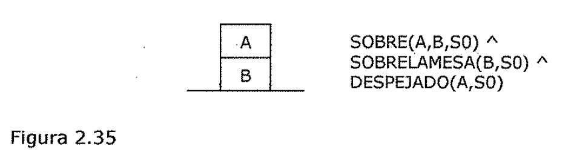

La manipulación de estas descripciones de los estados puede hacerse con un
demostrador de teoremas por resolución. As[, por ejemplo, el efecto del operador
**DESAPILAR(x,y)** podría describirse mediante el siguiente axioma.

[DESPEJADO(x,s) ASOBRE(x,y,s) ➔ **HACER.** es una función que especifica para un
estado y una acción el nuevo estado que resulta de la ejecución de la acción.

El axioma dice que si DESPEJADO(x) y SOBRE(x,y) se cumplen en el estado s,
entonces en el estado que resulta de HACER un DESAPILAR(x,y) a partir del estado
s, se cumple que AGARRADO(x) y DESPEJADO(y).

Si ejecutamos DESAPILAR(A,B) en el estado SO definido anteriormente, puede
probarse, utilizando nuestras aserciones sobre SO y sobre nuestro axioma para
DESAPILAR, que en el estado que resulta de aplicar la operación de DESAPILAR (y
lo denominamos estado 51) se cumple:

Pero qué más sabemos acerca de la situación del estado 51? Intuitivamente,
sabemos que B todavía esta sobre la mesa. Pero con lo que hemos visto hasta
ahora, no podemos derivarlo.

Para poder hacerlo, necesitamos también un conjunto de reglas denominadas
***axiomas marco*** *(frame axioms), que describen* los *componentes def estado
que no se ven afectados por cada* *operador.* Por ejemplo, es necesario indicar
que:

Este axioma dice que la relación **SOBR.ELAMESA** nunca se ve afectada por el
operador **DESAPILAR..** También es necesario indicar que la relación **SOBR.E**
solo se ve afectada por el operador **DESAPILAR.** si,los bloques involucrados
en la relación SOBRE son los mismos que los que involucra la operación
DESAPILAR. Esto puede expresarse como:

[SOBRE(m,n,s) A IGUAL(m,x)] ➔ La ventaja de este enfoque es que se pueden llevar
a cabo todas las operaciones necesarias en la descripción de los estados con un
único y sencillo mecanismo como es el de resolución. Sin embargo, el precio que
se paga es que el número de axiomas necesarios puede hacerse muy grande si las
descripciones de los estados del problema son complejas. Por ejemplo, suponga
que no solo estamos interesados en las posiciones de los bloques sino también en
su color.

Entonces, para cada operación (excepto posiblemente en PINTAR), sería necesario
un axioma como el siguiente:

*Para poder manipular dominios de problemas comp/lejos, es necesario disponer de
un* *mecanismo que no involucre un conjunto de axiomas marco demasiado grande.*
En el sistema de resolución de problemas mediante robot **STRIPS** (Fikes y
Nilsson, 1971) yen sus descendientes se usó un mecanismo de este tipo. Cada
operador se describe mediante una lista de los nuevos predicados que el operador
provoca que sean ciertos y una lista de los viejos predicados que el operador
provoca que sean falsos. Estas dos listas se denominan lista ***ANADIR*** y
lista ***BORRAR*** respectivamente.

También debe especificarse una tercera lista para cada operador. Esta lista
***PRECONDICION*** contiene aquellos predicados que deben ser ciertos para que
pueda aplicarse el operador. Los axiomas marco del sistema de Green están
explícitamente especificados en STRIPS. Cualquier operador no incluido ni en
ANADIR ni en BORRAR de un operador se asume que no se ve afectado por el. Esto
significa que al especificar cada operador no es necesario considerar los
aspectos del dominio que no están relacionados con el. As[, no es necesario
decir nada acerca de la 'relación entre DESAPILAR y COLOR. Por supuesto, esto
significa que debe usarse un mecanismo distinto a un sencillo demostrador de
teoremas para poder calcular las descripciones de los estados después de que se
lleven a cabo las operaciones.

Los operadores del estilo de STRIPS que se corresponden con las operaciones del
mundo de los bloques que se han estado tratando aparecen en la Figura 2.36.
Nótese que para reglas sencillas como estas, la lista PRECONDICION con
frecuencia es idéntica a la lista BORRAR. Para poder agarrar un bloque, el brazo
debe estar libre: tan pronto como agarra el bloque, deja de estar libre. Pero
las precondiciones no siempre son borradas. Por ejemplo, para que el brazo
agarre un bloque, el bloque no debe tener otro situado sobre el. Después de que
lo ha tornado, todavía sigue sin bloques sobre el. Esta es la razón de por que
las listas BORRAR y ,, PRECONDICION deben especificarse separadamente.

APILAR(x,y)

P: DESPEJADO(y) A AGARRADO(x) B: DESPEJADO(y) A AGARRADO(x) A: BRAZOL!BRE A
SOBRE(x,y) DESAPILAR(x,y)

P: SOBRE(x,y) A DESPEJADO(x) A BRAZOLIBRE B: SOBRE(x,y) A BRAZOLIBRE

A: AGARRADO(x) A DESPEJADO(y) COGER(x)

P: DESPEJADO(x) A SOBRELAMESA(x) A BRAZOLIBRE B: SOBRELAMESA(x) A BRAZOLIBRE A:
AGARRADO(x) BAJAR(x)

P: AGARRADO(x) B: AGARRADO(x)

A: SOBRELAMESA(x) A BRAZOLIBRE

Figura 2.36

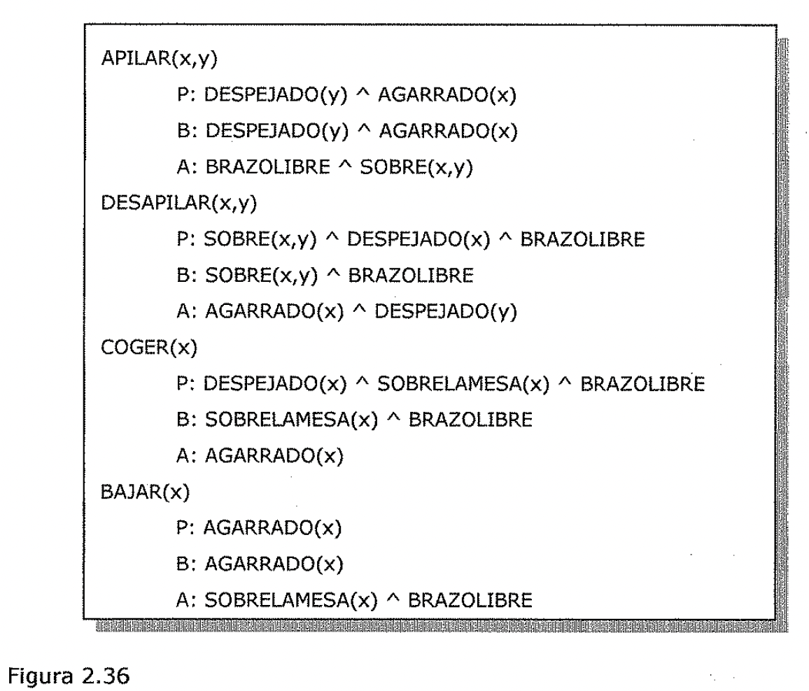

Al hacer implícitos los axiomas marco, se ha reducido enormemente la cantidad de
información que hay que suministrar a cada operador. Esto significa, entre otras
cosas, que cuando se introduce en el sistema un nuevo atributo posible a los
objetos, no es necesario ir hacia atrás y añadir un nuevo axioma a cada uno de
los operadores.

Pero ¿Cómo podemos conseguir el efecto de utilizar los axiomas marco en el
cálculo de descripciones completas de estados? El primer aspecto que sale a
relucir es que para descripciones de estados complejas, la mayoría queda
inalterada después de cada operación.

Pero si representamos el estado como una parte explicita de cada predicado, como
en el Sistema de Green, entonces toda la información debe deducirse de nuevo
para cada estado. Para evitarlo, podemos abandonar el indicador explícito de
estado a partir de predicados individuales y en su lugar simplemente actualizar
una base de datos de predicados de forma que siempre describan el estado actual
del mundo. Por ejemplo, si se comienza con. la situación que se muestra en la
Figura 2.35, podría describirse como SOBRE(A,B) "SOBRELAMESA(B) "DESPEJADO(A)

Después de aplicar el operador DESAPILAR(A,B) nuestra descripción del mundo
sería: SOBRELAMESA(B) " DESPEJADO(A) " DESPEJADO(B) " AGARRADO(A) La simple
actualización de una única descripción de estado funciona tan bien como llevar
cuenta de los efectos de una secuencia dada de operadores. <'.Pero que ocurre
durante el proceso de búsqueda de la secuencia correcta de operadores? Si se
explora una secuencia incorrecta, se tiene que. poder volver al estado original
para intentarlo con otra secuencia diferente. Pero esto es posible siempre que
la base de datos global describa el estado del problema en el nodo actual del
grafo de búsqueda.

Todo lo qu.e necesitamos hacer es almacenar en cada nodo los cambios que ha
producido en la base de datos global.cuando se pasó a través de ese nodo.
Entonces, si se vuelve atrás hacia ese nodo, ya se pueden deshacer los cambios.
Pero los cambios están exactamente en las listas ANADIR y BORRAR de los
operad<libres que se• aplicaron para trasladarse de un nodo a otro. Asi,
necesitamos almacenar a lo largo de cada arco del grafo de búsqueda solo el
operador que se aplicó.

En la Figura 2.37 se muestra un pequeño ejemplo de un árbol de búsqueda de este
tipo y su correspondiente base de datos global. El estado inicial, descrito en
la forma de STRIPS, es el que se muestra en la Figura 2.35. Nótese que podemos
especificar no solo el operador (es decir, DESAPILAR) sino también sus
argumentos, a fin de poder deshacer los cambios más tarde.

DESAPILAR(A,B)

BAJAR(A)

Estado de la base de dates

global en este momento SOBRELAMESA(B) A

DESPEJADO(A) A

DESPEJADO(B) A

SOBRELAMESA(A)

Figura 2.37

Suponga ahora que queremos explorar un camino diferente a partir del que se ha
mostrado.

En primer lugar se vuelve atrás a través del nodo 3 añadiendo cada uno de los
predicados de la lista BORRAR de BAJAR en la base de datos global, y eliminar
los elementos de la lista ANADIR de BAJAR. Después de hacerlo, la base de datos
contiene:

SOBRELAMESA(B) A DESPEJADO(A) A DESPEJADO(B) A AGARRADO(A)

Como se esperaba, la descripción es idéntica a la que previamente se había
calculado como resultado de aplicar DESAPILAR a la situación inicial. Si se
repite el proceso usando las listas ANADIR y BORRAR de DESAPILAR, se deriva una
descripción idéntica a la que se tenia cuando se comenzó.

Como para los dominios. de problemas complejos resulta tan importante hacer
implícitos los axiomas• marco, todas las técnicas que veremos usan descripciones
de los operadores disponibles siguiendo el estilo de STRIPS.

**Detección de una solución**

*Se dice que un sistema de planificación ha tenido éxito al encontrar una
solución a un* *problema cuando encuentra una secuencia de operadores que
transforman el estado inicial def problema en un estado objetivo.* ¿Cómo puede
saberse cuando ocurre este éxito?. En los sistemas sencillos de resolución de
problemas la respuesta es muy fácil, simplemente comparándolo con las
descripciones del estado. Pero si no están representados explícitamente los
estados completos, sino que lo están mediante un conjunto de propiedades
relevantes, entonces el problema se hace más complejo. El modo de resolverlo
depende de cómo estén representadas las descripciones de los estados. Con
cualquier esquema de representación que se use es posible razonar con las
representaciones para descubrir si una se empareja con la otra.

La lógica de predicados es una técnica de representación que ha servido como
base para muchos de los sistemas de planificación que se han construido. Es
adecuada por los mecanismos deductivos que proporciona. Suponga que como parte
de un objetivo se tiene el predicado P(x). Para ver si P(x) se satisface en un
estado, se pregunta si podemos probar P(x) dadas las aserciones que describen el
estado y los axiomas que definen el modelo del mundo (como por ejemplo, el hecho
de que si el brazo esta agarrando algo, entonces no esta libre).

* Si podemos construir esta demostración, entonces el proceso de resolución del
 problema termina.

* Si no se puede, entonces debe proponerse una secuencia de operadores que
 podría resolverlo. Esta secuencia puede verificarse de la misma forma en que
 se hizo con el estado inicial preguntando si P(x) podía demostrarse a partir
 de los axiomas y de la

descripción del estado derivado de la aplicación de los operadores.

1. **Detección de callejones sin salida**

Cuando un sistema de planificación esta buscando una secuencia de operadores que
resuelva un problema concreto, debe ser capaz de detectar si esta explorando un
camino que nunca puede conducir a una solución (o al menos que no es probable
que lo haga). Para detectar estos callejones sin salida pueden emplearse los
mismos mecanismos de razonamiento que se usaron para detectar una solución.

*Si el proceso de búsqueda razona hacia delante a partir de/ estado inicial,
puede podar* los *caminos que conduzcan a un estado a partir def cuál no* se
*a/alcanza un estado* objetivo.* Por ejemplo, suponga que tenemos una cantidad
fija de pintura: algo de blanco, algo de rosa y algo de rojo. Queremos pintar
una habitación con las paredes rojo claro y el techo blanco. Podríamos conseguir
el rojo claro añadiendo la pintura blanca a la roja. Pero entonces no podríamos
pintar el techo de blanco. Por lo tanto, este intento debe abandonarse e
intentar mezclar la pintura roja y la rosa. Pueden podarse también aquellos
caminos que aunque no imposibilitan llegar a una solución, sí parece que no se
encuentran muy cercanos a ella una vez que se exploran.

*Si el proceso de búsqueda* es *hacia atrás a partir de un estado solución,* se
*puede dar par finalizado un camino* si se *esta seguro de que el estado inicia/
no puede alcanzarse o porque solo pueden hacerse pequeños progresos. En el
razonamiento hacia atrás, cada objetivo* se *descompone en subobjetivos. Cada
uno de ellos, además, puede descomponerse en subobjetivos adicionales.* Algunas
veces resulta sencillo detectar que no hay forma de que todos los subobjetivos
de un conjunto dado puedan satisfacerse a la vez. Por ejemplo, el brazo del
robot no puede estar libre y agarrando un bloque al mismo tiempo. Los caminos
que intenten que estos dos objetivos sean ciertos simultáneamente pueden podarse
inmediatamente. Otros caminos pueden podarse porque no conducen a ninguna parte.
Por ejemplo, si al intentar satisfacer el objetivo A, el programa lo reduce a
satisfacer los objetivos A, B y C, realmente se ha progresado poco. Se ha
producido un problema más grande que el original, y el camino en cuestión debe
abandonarse también.

**Identificación de soluciones casi correctas**

Las clases de técnicas que se están explicando son con frecuencia útiles para
resolver problemas *casi descomponibles.* Una buena forma de resolver estos
problemas consiste en *asumir que son completamente descomponibles,* resolver
los subproblemas por separado, y verificar si al combinar las subsoluciones
tenemos una solución al problema original. Por supuesto, si ocurre lo anterior
no debe hacerse nada más.

Sin embargo, si no ocurre, se pueden hacer varias cosas.

La más simple de todas es desechar la solución, buscar otra y esperar que
resulte mejor que la anterior. Aunque es sencilla, esta estrategia puede
conducir a malgastar una gran cantidad de esfuerzo.

+ Un intento bastante mejor consiste en comparar la solución que resulta al
 ejecutarse la

secuencia de operaciones correspondientes a la solución propuesta con el
objetivo deseado. En la mayoría de los casos las diferencias entre las dos serán
menores que las diferencias entre el estado inicial y el objetivo (asumiendo que
la solución encontrada tiene partes buenas). En este punto, puede llamarse de
nuevo al sistema de resolución de problemas y pedirle que encuentre una forma de
eliminar estas nuevas diferencias.

La primera solución puede combinarse con esta segunda para formar una solución
para el problema original.

,. Otra forma todavía mejor de arreglar soluciones incompletas no consiste en
intentar arreglarlas todas, sino en dejarlas especificadas de forma incompleta
hasta que sea posible. Entonces, cuando este disponible tanta información como
sea posible, se completa la especificación de forma que no surjan conflictos.

Este enfoque puede denominarse como *estrategia de mínimo compromiso.* Puede
aplicarse de varias formas. Una de ellas consiste en aplazar las decisiones en
el orden en el que se llevan a cabo las operaciones. Asi, en nuestro ejemplo
anterior, en lugar de elegir arbitrariamente un orden para satisfacer un
conjunto de precondiciones se dejara el orden sin especificar hasta casi al
final. Entonces se mirarían los efectos de cada una de las subsoluciones para
determinar las dependencias que existen entre ellas. Es en este punto cuando
debe elegirse un ordenamiento.

Figura 2.38

Inicio: SOBRE(B,A) A

SOBRELAMESA(A) A SOBRELAMESA(C) A SOBRELAMESA(D) A BRAZOLIBRE

objetivo: SOBRE(C,A) A SOBRE(B,D) A

SOBRELAMESA(A) A

SOBRELAMESA(D)

2.5.3. Planificación mediante 1.ma pila de objetivos

Una de las primeras técnicas que surgieron para componer objetivos que pueden
interactuar, fue el uso de una ***pi/a de objetivos.*** Esto fue lo que se usó
en **STRIPS.** En este método, el resolutor de problemas usa una pila que
contiene tanto objetivos como operadores que deben proponerse para satisfacer
estos objetivos.

El resolutor de problemas también usa una base de datos que describe la
situación actual y un conjunto de operadores descritos mediante las listas
PRECONDICION, ANADIR y BORRAR. Para ver como funciona este método analizaremos
el ejemplo de la Figura 2.38. Cuando se comienza con la resolución de este
problema, la pila de objetivos es simplemente:

**SOBRE(C,A) "' SOBRE(B,D) A SOBRELAMESA(A) A SOBRELAMESA(D)**

Pero queremos separar este problema en cuatro subproblemas, uno por cada
componente def objetivo original. Dos de los subproblemas, **SOBRELAMESA(A} y
SOBRELAMESA(D),** son ya ciertos en el estado inicial. Por lo tanto solo tenemos
que fijarnos en los dos restantes.

Al profundizar en el orden en que se desea atacar los subproblemas, deben
crearse dos pilas de objetivos en este primer paso donde cada línea representa
un objetivo de la pila y *SOBM* es *una abreviatura de SOBRELAMESA(A)
"SOBRELAMESA(D):* SOBRE(C,A) SOBRE(B,D)

SOBRE(C,A) A SOBRE(B,D) A

SOBM

SOBRE(B,D) SOBRE(C,A)

SOBRE(C,A) A SOBRE(B,D) A

SOBM

1. En cada paso del proceso de resolución def problema se seguirá la pista del
 objetivo situado en la cima de la pila. Cuando se encuentra una secuencia de
 operadores que lo satisfacen, esta secuencia se aplica a la descripción def
 estado, obteniendo una nueva representación.

2. A continuación, se explora el objetivo situado en la cima de la pila y se
 intenta hacer que se satisfaga, comenzando a partir de la situación que se
 produjo coma resultado de satisfacer el primer objetivo.

3. Este proceso continua hasta que la pila de objetivos este vacía.

4. Entonces, como última verificación, el objetivo original se compara con el
 estado final que surge de la aplicación de los operadores elegidos.

5. Si en este estado no se satisfacen algunas partes del objetivo (que puede que
 no ocurra si se alcanzó en un punto y más tarde se deshizo), entonces las
 partes no resueltas del

subobjetivo se reinsertan en la pila y se repite el proceso.

Para continuar con el ejemplo que comenzamos antes, asuma que primero se intenta
explorar la alternativa 1. La alternativa 2 conducirá también a la solución. De
hecho, encuentra una tan fácilmente que no resulta muy interesante.

Al explorar la alternativa 1, verificamos primero si **SOBRE(C,A}** es cierto en
el estado actual. Como no lo es, verificamos los operadores que pueden hacer que
sea cierto. De los cuatro operadores que consideramos solo hay uno, **APILAR,**
que debe llamarse con C y A. De esta forma, se sitúa **APILAR(C,A)** en la pila
en lugar de SOBRE(C,A), obteniendo:

**APILAR(C,A}**

SOBRE(B,D)

SOBRE(C,A) " SOBRE(B.D) " SOBM

APILAR(C,A) *reemplaza/aza* a SOBRE(C,A) porque después de llevar a cabo APILAR se
garantiza que SOBRE(C,A) se cumplirá.

Pero para poder aplicar APILAR(C,A), deben satisfacerse sus precondiciones, de
forma que deben establecerse coma subobjetivos. De nuevo, debemos separar un
objetivo compuesto:

**DESPEJADO(A) A AGARRADO(C)**

en sus componentes y elegir el orden en el que deben trabajar. En este punto,
resulta adecuado ***utilizar algún conocimiento heurístico.*** AGARRADO(x) es
muy fácil de lograr. Al menos es necesario dejar algo y coger el objeto deseado.
Pero AGARRADO es también muy fácil de deshacer. Para poder realizar cualquier
otra cosa, el robot necesitara utilizar el brazo. Asf, si alcanzamos AGARRADO
'en primer lugar y después se intenta hacer algo más, es muy probable que
lleguemos a un callejón sin salida.

Asi utilizamos la ***heurística*** de que si uno de los objetivos que deben
cumplirse simultáneamente es AGARRADO, este debe realizarse el último. Esto
produce una nueva pila de objetivos:

DESPEJADO(A)

AGARRADO(C)

DESPEJADO(A) A AGARRADO(C)

**APILAR(C,A)**

SOBRE(B,D)

SOBRE(C,A) A SOBRE(B,D) A SOBM

Este tipo de información heurística debería estar en la lista PRECONDICION
comenzando los predicados en el orden en el que deberían realizarse.

A continuación se ve si DESPEJADO(A) es cierto. No lo es. El único operador que
puede convertirlo en cierto es **DESAPILAR(B,A).** Por lo tanto, se intenta
aplicar. Esto produce la pila de objetivos:

SOBRE(B,A)

DESPEJADO(B)

BRAZOLIBRE

SOBRE(B,A) A DESPEJADO(B) A BRAZOLIBRE I

**DESAPILAR(B,A)**

AGARRADO(C)

DESPEJADO(A) A AGARRADO(C)

**APILAR(C,A}**

SOBRE(B,D)

SOBRE(C,A) A SOBRE(B,D) A SOBM

Esta. vez, cuando comparamos el elemento de la cima de la pila de objetivos,
SOBRE(B,A), con el modelo del mundo, se ve que se satisface. Asi, lo sacamos y
consideramos el siguiente objetivo, DESPEJADO(B). Esto, aunque es cierto en el
modelo del mundo, no esta especificado explícitamente como uno de los predicados
iniciales. Pero a partir de los predicados iniciales y del axioma del mundo de
los bloques que dice que cualquier bloque sin bloques.sobre el esta despejado,
un demostrado.r de teoremas puede concluir que DESPEJADO(B); Asi, este
subobjetivo también puede extraerse de la pila.

La tercera precondición para DESAPILAR(B,A) permanece. Es **BRAZOLIBRE,** y
también es cierto en el modelo del mundo actual, por lo que puede eliminarse
también de la pila.

El siguiente elemento de la pila es el objetivo combinado que representa todas
las precondiciones de DESAPILAR(B,A). Lo verificamos para estar seguros de que
se satisface en el modelo del mundo. Esto sera así a no ser que se deshaga uno
de sus componentes al intentar satisfacer otro. En este caso, no hay problemas y
*el objetivo combinado* se *extrae de (* *la pi/a.* Ahora, el elemento de la
cima de la pila es el operador **DESAPILAR(B,A).** Hemos garantizado que todas
sus precondiciones se satisfagan, por lo que puede aplicarse para producir un
nuevo modelo del mundo a partir del cuál continuara el proceso de resolución de
problemas. Esto se logra usando las listas ANADIR y BORRAR especificadas en
DESAPILAR.

Mientras tanto, *a/almacenamos la información* de que DESAPILAR(B,A) ha sido el
primer operador de la secuencia propuesta como solución. En este momento, la
base de datos correspondiente al modelo del mundo es:

**SOBRELAMESA(A) "' SOBRELAMESA(C) "' SOBRELAMESA(D) -" AGARRADO(B)** -"

**DESPEJADO(A)**

La pila de objetivos es:

AGARRADO(C)

DESPEJADO(A) A AGARRADO(C)

**APILAR(C,A)**

SOBRE(B,D)

SOBRE(C,A) A SOBRE(B,D) A SOBM

Ahora se intenta satisfacer el objetivo AGARRADO(C). Existen dos operadores que
pueden hacer que AGARRADO(C) sea cierto: **COGER(C) y DESAPILAR(C,x),** donde x
podría ser cualquier bloque del que se pueda desapilar C. Sin más información,
no podemos decir cuál de los dos operadores es el apropiado, por lo que creamos
dos ramas en el árbol de búsqueda que se corresponden con las siguientes pilas

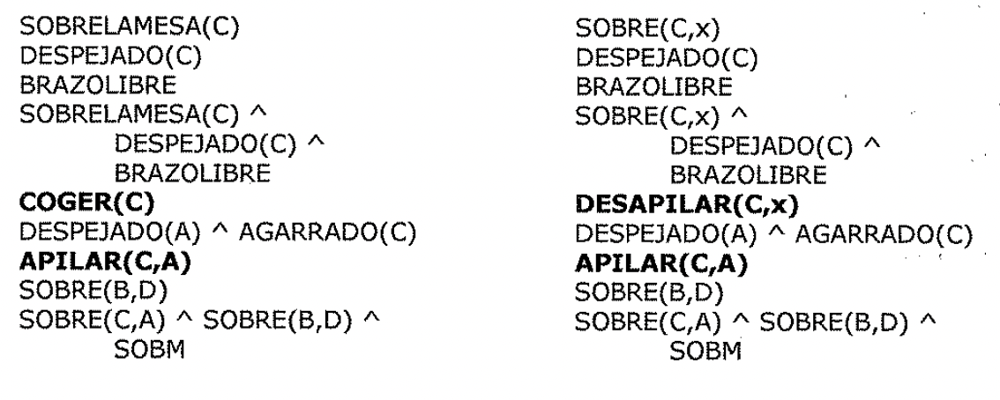
de objetivos:

SOBRELAMESA(C) DESPEJADO( C) BRAZOLIBRE SOBRELAMESA(C) A

DESPEJADO(C) " BRAZOLIBRE

. ) **COGER(C)**

DESPEJADO(A) " AGARRADO(C)

**APILAR(C,A)**

SOBRE(B,D)

SOBRE(C,A) A SOBRE(B,D) " SOBM

SOBRE(C,x) DESPEJADO(C) BRAZOLIBRE SOBRE(C,x) A

DESPEJADO( C) A

BRAZOLIBRE **DESAPILAR(C,x)** DESPEJADO(A) " AGARRADO(C) **APILAR(C,A)**
SOBRE(B,D)

SOBRE(C,A) " SOBRE(B,D) " SOBM

Nótese que para la segunda alternativa, la pila de objetivos contiene la
variable x, la cuál aparece en tres sitios. Aunque x puede sustituirse por
cualquier bloque, es importante que sea el mismo en.las tres apariciones. Asf,
es importante que cuando se introduce una variable en la pila, el nombre sea
diferente al de las variables que ya se encuentran en la pila. Ademas, una vez
que se elige un objeto candidato para ligarlo con una variable, este enlace debe
recordarse para que cuando se produzcan otras apariciones de la misma variable
se relacione• con el mismo objeto.

c'.Cómo debería elegir nuestro programa entre las alternativas 1 y 2? Puede
decirse que coger C(alternativa 1) es mejor que desapilarlo, ya que no esta
sobre nada. Para desapilar algo, primeramente debe estar apilado sobre algo:
Aunque puede hacerse, es un esfuerzo malgastado. c'.Pero cómo podría saber esto
nuestro programa? Suponga que se decide seguir por la alternativa 2 en primer
lugar. Para satisfacer SOBRE(C,x), tenemos que **APILAR C** sobre el bloque x.
Entonces la pila de objetivos sería:

DESPEJADO(x)

AGARRADO(C)

DESPEJADO(x) A AGARRADO(C)

**APILAR(C,x)** DESPEJADO(C) BRAZOLIBRE SOBRE(C,x) A DESPEJADO(C) A BRAZOLIBRE

**DESAPILAR(C,x)**

DESPEJADO(A) "AGARRADO(C)

**APILAR(C,A)**

SOBRE(B,D)

SOBRE(C,A) " SOBRE(B,D) " SOBM

Pero dese cuenta de que ahora una de las precondiciones de APILAR es
**AGARRADO(C).** Esto es lo que estamos intentando conseguir aplicando
DESAPILAR, lo cuál necesita aplicar APILAR para que la precondición SOBRE(C,x)
se satisfaga.

Por lo tanto, volvemos a nuestro objetivo inicial. De hecho, ahora tenemos
objetivos adicionales ya que se han añadido otros predicados a la pita. En este
momento se determina que este camino es improductivo. Sin embargo, si el bloque
C hubiera estado sobre otro bloque en el estado actual, SOBRE(C,x) se satisfaría
inmediatamente sin necesidad de hacer un APILAR y este camino conduciría a una
buena solución.

Ahora tenemos que volver a la alternativa 1, en la que se utilizaba COGER, para
conseguir que el brazo agarrara a C. El elemento en la cima de la pita de
objetivos es SOBRELAMESA(C), que como se satisface y, se elimina de la pita. El
siguiente elemento es DESPEJADO(C), que también se satisface y se extrae de la
pita. La siguiente precondición de COGER(C), es BRAZOLIBRE, que no se satisface
ya que ***AGARRADO(B)* es *cierto.***

Existen dos operadores que pueden hacer que BRAZOLIBRE sea cierto: APILAR(B,x) y
BAJAR(B). Es decir, podemos situar B sobre la mesa o sobre otro bloque. ¿Cuál de
las dos elegimos?

Si investigamos un poco, se ve que al final lo que queremos es conseguir B sobre
D. Lo más eficaz sería situar B allí en este momento. Nuestro programa podría
darse cuenta de esto comparando los elementos de las listas ANADIR de los
operadores del resto de la pita de objetivos. Si uno de los operadores provoca
un efecto fortuito que hace cierto alguno de los objetivos, debería elegirse. De
esta forma, elegimos aplicar **APILAR(B,D)** enlazando D con x en el operador
APILAR. Esto hace que la pita de objetivos sea:

DESPEJADO(D)

AGARRADO(B)

DESPEJADO(D) " AGARRADO(B)

**APILAR(B,D)**

SOBRELAMESA(C) " DESPEJADO(C) "BRAZOLIBRE

**COGER(C)**

DESPEJADO(A) " AGARRADO(C)

**APILAR(C,A)**

SOBRE(B,D)

SOBRE(C,A) " SOBRE(B,D) " SOBM

DESPEJADO(D) y AGARRADO(B) son ambas ciertas. Ahora la operación APILAR(B,D)
puede realizarse y produce el siguiente modelo del mundo:

**SOBRELAMESA(A) A SOBRELAMESA(C) A SOBRELAMESA(D) A SOBRE(B,D) A**
**BRAZOUBRE**

En este momento, se satisfacen todas las precondiciones de COGER(C), por lo que
puede ejecutarse. Entonces, todas las precondiciones de APILAR(C,A) son ciertas
y puede, por lo tanto, ejecutarse.

Ahora ya podemos empezar a trabajar con la segunda parte de nuestro objetivo
original, **SOBRE(B,D).** Pero ya se ha satisfecho gracias a las operaciones
realizadas para satisfacer el primer subobjetivo. Esto ocurrió porque al
intentar elegir entre las posibles alternativas cuando el brazo estaba agarrando
a B, se inspeccionó la pita de objetivos para ver si uno de los operadores
posibles provocaba efectos laterales, y se vio que era asi. Por lo tanto, ahora
extraemos SOBRE(B,D) de la pila de objetivos.

A continuación hay que realizar la última verificación consistente en que el
objetivo combinado **SOBRE(C,A} A SOBRE(B,D} A SOBRELAMESA(A} A SOBRELAMESA(D}**
se cumpla en cada una de sus partes, lo cuál, por supuesto, se cumple. Entonces
el resolutor de problemas puede ahora devolver como respuesta el plan:

1. **DESAPILAR(B,A}**

2. **APILAR(B,D}**

3. **COGER(C}**

4. **APILAR(C,A}**

En este sencillo ejemplo se ha visto la forma en que puede aplicarse la
información heurística para guiar el proceso de búsqueda, intentando detectar
caminos no provechosos y considerando ciertas interacciones entre objetivos que
pueden ayudar a crear una buena solución en su conjunto. Sin embargo, para
problemas de una mayor dificultad estos métodos no son adecuados.

2.!5.4. Planificación no lineal mediante fijación de restricciones

La anomalía de Sussman de la Figura 2.39 es un buen ejemplo que muestra la
necesidad de un plan no lineal.

Inicio: SOBRE(C,A) A

SOBRELAMESA(A) " SOBRELAMESA(B) " BRAZOLIBRE

objetivo: SOBRE(A,B) A SOBRE(B,C)

Figura 2.39

Existen dos maneras para comenzar la resolución de este problema, que

corresponden a las pilas de objetivos:

SOBRE(A,B) SOBRE(B,C)

SOBRE(A,B) " SOBRE(B,C)

SOBRE(B,C) SOBRE(A,B)

SOBRE(A,B) " SOBRE(B,C)

Suponga que elegimos la alternativa 1 y comenzamos intentando conseguir A sobre
B. Para ello se desapila C de A y se logra el primer subobjetivo **SOBRE(A,B}.**
Ahora ya podemos comenzar a trabajar para satisfacer SOBRE(B,C). Pero para
hacerlo, tiene que desapilar A de B. Cuando se alcanza el objetivo
**SOBRE(B,C}** y se intenta verificar el objetivo restante de la pila
**SOBRE(A,B} " SOBRE(B,C},** se descubre que no se satisface. Se ha deshecho
SOBRE(A,B) en el proceso de alcanzar SOBRE(B,C). La diferencia entre el
objetivo. y el estado actual es SOBRE(A,B), que se añade a la pila por lo que
hay que alcanzarlo de nuevo. Finalmente el objetivo se satisface.

Aunque este plan alcanza el objetivo deseado, no lo hace de una forma demasiado
eficaz. Algo similar ocurre si se examinan los dos objetivos principales en
orden opuesto. El método que se esta usando no. es capaz de encontrar una forma
eficiente de resolver este problema.

El método de *p/planificación con pi/a* de *objetivos* aborda los problemas como
objetivos conjuntos resolviendo por orden los objetivos uno cada vez. Este
método genera un plan que contiene una secuencia de operadores que resuelven el
primer objetivo, seguido por una secuencia completa para el segundo objetivo,
etc. Pero como se ha visto, ***los problemas difíciles provocan interacciones
entre los objetivos.*** Los operadores que se utilizan para resolver un
subproblema pueden interferir en la solución de un subproblema anterior.

La mayoría de los problemas necesitan un plan entrelazado en el que se *trabaje*
*simultáneamente con múltiples subproblemas.* ***Este tipo de plan* se *denomina
plan no*** ***lineal*** ya que no esta compuesto por una secuencia lineal de
subplanes completos. Un buen plan para solucionar este problema es el siguiente:

1. Comenzar el trabajo con el objetivo SOBRE(A,B) despejando A y poniendo C
 sobre la *('*

mesa.

1. Alcanzar el objetivo SOBRE(B,C) apilando B sobre C.

1. Completar el objetivo SOBRE(A,B) apilando A sobre B.

La idea de ***fijación de restricciones*** es construir un plan mediante
operadores incrementalmente hipotéticos, ordenamientos parciales entre
operadores y enlaces entre variables y operadores. En un cierto instante del
proceso de resolución del problema, se puede tener un conjunto de operadores
útiles pero quizá no una idea muy clara sobre cómo ordenar estos operadores
entre ellos.

*Una solución es un conjunto* de *operadores parcialmente ordenados y
parcialmente instanciados para generar un plan intermedio, se convierte el orden
parcial en un número de* *órdenes totales.* 2.5.5. Planificación jerárquica

Para resolver problemas complicados, los resolutores de problemas tienen que
generar planes muy extensos. Para poder hacerlo eficientemente, es importante
***poder eliminar algunos de***

***los detalles.del problema hasta que* se *encuentre una solución que resuelva
los***

***principales escollos.*** Una forma de hacer esto es sustituir los detalles
apropiados.

Los primeros intentos de lograrlo usaban macro-operadores en donde se construían
operadores grandes a partir de otros más pequeño\os. Pero con este enfoque, no se
eliminan los detalles de las descripciones de los operadores. En el sistema
ABSTRIPS (Sacerdoti, 1974) se utilizó un enfoque algo mejor en el cuál la
planificación se realizaba con una *jerarquía de* *espacios de abstracción,* en
cada uno de los cuales se ignoran las precondiciones de un nivel de abstracción
más bajo..

Como ejemplo, suponga que quiere visitar a un amigo en Europa, pero tiene una
cantidad limitada de dinero para gastar. Tendría sentido verificar primero el
precio del billete de avión ya que encontrar un vuelo razonable en cuanto a
precio sera la parte más dificultosa del trabajo. Usted no se debería preocupar
de cosas como llegar a la entrada, planificar la ruta al aeropuerto, o aparcar
su coche hasta que no este seguro de que tiene un vuelo que tomar.

El enfoque que usa ABSTRIPS para resolver un problema es el siguiente:

* En primer lugar resuelve el problema completamente, considerando solo aquellas
 precondiciones cuyo valor critico sea el más alto posible. Estos valores
 reflejan la dificultad esperada para satisfacer una precondición. Para
 lograrlo, sigue el mismo

procedimiento que STRIPS, pero simplemente ignora las precondiciones que caen
por debajo de un cierto nivel crítico.

* Una vez hecho esto, utiliza el plan construido como el esbozo de un plan
 completo, y considera las precondiciones del siguiente nivel de criticidad más
 bajo.

* Entonces aumenta el plan con los operadores que satisfacen estas
 precondiciones. De nuevo, al elegir los operadores, ignora todas aquellas
 precondiciones cuya criticidad sea menor que el nivel que ahora se esta
 considerando.

Este proceso se denomina *búsqueda primero en longitud* debido a que explora
planes completos a un nivel de detalle antes de mirar los detalles de más bajo
nivel de algunos de ellos.

La ***asignación de valores de criticidad apropiados*** es claramente un aspecto
crucial para el éxito de este método de ***planificación jerárquica.***
*Aquellas precondiciones que no tengan operadores que puedan satisfacerlas son
las más críticas.* Por ejemplo, si intentamos resolver un problema que incluya
el movimiento de un robot a lo largo de una casa y consideramos el operador
PASAR-POR-LA-PUERTA, la precondición de que exista una puerta lo suficientemente
ancha para que el robot pueda pasar a través de ella es lo más critico, ya que
si ocurre así (en una situación normal) nada de lo que podamos hacer puede
lograr que no sea cierto. Pero la precondición de que la puerta este abierta es
de una criticidad menor si disponemos del operador ABRIR-PUERTA.

Para que un sistema de planificación jerárquica funcione con reglas del estilo
de STRIPS, debe darse junto con las propias reglas, el valor de criticidad
apropiado para cada término que pueda aparecer en la precondición. Dados estos
valores, el proceso básico puede trabajar en gran parte de la misma forma en que
lo hacen los sistemas de planificación no jerárquicos. Sin embargo, no se
malgastaran esfuerzos en eliminar los detalles de planes que no estén cercanos a
la resolución del problema.

2.5.6. Sistemas reactivos

Hasta ahora, se ha descrito un proceso de planificación deliberativo, en donde
*el plan que resuelve una tarea completa se construye antes de actuar.* Sin
embargo, existe un camino muy diferente que podría aproximarse al problema de
decidir que hacer. La idea de los ***sistemas reactivos*** consiste en ***evitar
planificar totalmente y, en lugar de* eso, *uti/izar la situación observable
como pista a la que simple/mente reaccionar.*** *Un sistema reactivo debe tener
acceso a algún tipo de base de conocimiento que describa las acciones que deben
realizarse bajo ciertas circunstancias. Un sistema reactivo es muy diferente de
las sistemas de planificación que se han explicado hasta ahora, porque e/ige
solo una acción cada vez; no anticipa y selecciona una secuencia completa de
acciones antes de realizar una primera acción.* Uno de los sistemas reactivos
más sencillos es un termostato. El trabajo de un termostato consiste en mantener
constante la temperatura de una habitación. Uno podría imaginarse soluciones a
este problema que necesiten cantidades significativas de planificación, teniendo
en cuenta los cambios durante el dia de la temperatura externa, cómo fluye el
calor de una habitación a otra y otros muchos aspectos. Sin embargo, un
termostato real no utiliza más que un par de sencillas reglas de
situación-acción.

1. Si la temperatura de la habitación esta k grados por encima de la temperatura
 deseada, entonces conectar el aire acondicionado.

2. Si la temperatura de la habitación esta k grados por debajo de la temperatura
 deseada, entonces desconectar el aire acondicionado.

Resulta que los sistemas sorprendentemente complejos, navegación de robots.

reactivos son capaces de mantener comportamientos especialmente en tareas del
mundo real tales como la La *principal ventaja* que presentan los sistemas
reactivos frente a los planificadores tradicionales es que *funcionan de forma
robusta en dominios difíciles de modelar con exactitud* de forma completa.* Los
sistemas reactivos evitan un modelado completo y basan sus acciones directamente
en sus percepciones del mundo. En dominios complejos e impredecibles, la
habilidad de planificar una secuencia fija de pasos a lo largo del tiempo es de
un valor cuestionable.

*Otra ventaja de los sistemas reactivos* es que *son extremadamente sensibles,
ya que evitan la explosión combinatoria que imp/ica una planificación
de/deliberativa.* Esto hace que sean muy atractivos para tratar con tareas en
tiempo real como conducir y caminar.

Por otra parte, *como los sistemas reactivos no mantienen ninguno(m modelo de/
mundo ni* *estructuras explícitas de/ objetivo, su rendimiento es limitado en
este tipo de tareas.* Por ejemplo, parece poco probable que un sistema puramente
reactivo sea capaz de jugar al ajedrez a alto nivel.

## Representación del Conocimiento

y Razonamiento

