# Unidad Didactica 3 - Eje Conceptual

Representación del Conocimiento y Razonamiento

**TEMAS**

* 1. **El problema de la Representación del Conocimiento s**

1. Correspondencia entre Conocimiento y RC. 5

2. Propiedades de un buen sistema de RC :. 6

3. Modelos de Representación del Conocimiento 6

1. Conocimiento relacional simple. 7

2. Conocimiento heredable 8

3. Conocimiento deductivo 9

4. Conocimiento procedimental 10

4. Problemas de la Representación del Conocimiento. 10

5. El problema del Marco 13

2. **Lógica Simbólica. 15**

1. La Lógica y el Lenguaje. 15

1 3.2.1.1. Introducción 15

- 1. Naturaleza del Argumento 15

2. Verdad y Validez 17

3. Lógica Simbólica. 18

1. Argumentos que contienen Enunciados Compuestos 20

1. Enunciados Simples y Compuestos 20

\ 3.2.2.2. Enunciados Condicionales 24

1. Formas de Argumentos y Tablas de Verdad 26

2. Formas Sentenciales 30

1. El Metodo de Deducción 34

1. Prueba Formal de Validez 34

2. La Regla de Reemplazo 36

3. Demostración de la Invalidez 39

1. **Lógica de Predicados 41**

1. Introducción y concepto de Semidecidible 41

2. Representación de hechos simples en lógica 42

3. La Representación de las relaciones instancia y es-un 46

3.3.4. Representación de Funciones calculables y Predicados computables 47

1. Metodo de Resolución 50

2. Conversión a forma clausal. 50

3.3.7. Las bases de la resolución 53

1. Resolución en lógica proposicional 53

2. El algoritmo de unificación 55

3. Resolución en lógica de predicados 56

**3.4. Representación del conocimiento mediante Reglas 59**

1. Comparación entre conocimiento procedimental

y conocimiento declarativo. 59

1. Programación Lógica 61

2. Diferencia entre Razonamientos hacia delante y hacia atrás 63

1. Sistemas de reglas encadenadas hacia atrás. 63

2. Sistemas de reglas encadenadas hacia delante. 64

3. Combinación del razonamiento hacia adelante y hacia atrás 64

1. **Razonamiento simbólico bajo incertidumbre 65**

1. Razonamiento No Monótono 65

1. Razonamiento por delecto 65

1. Lógica no monótona 66

2. Lógica por delecto 66

2. Razonamiento mínimalista 67

1. La suposición de un mundo cerrado 67

2. Circunscripción,. 68

3. Cuestiones sobre la implementación 68

1. Implementación búsqueda primero en profundidad 69

3.5.1.3.2. Implementación búsqueda primero en anchura

1. Marcos 82

1. **Estructuras de Ranura y Relleno Fuertes 83**

1. Dependencia Conceptual 83

* 1. El problema de la Representación del Conocimiento

1. Correspondencia entre Conocimiento y RC

Para resolver los complejos problemas con los que se enfrenta •la Inteligencia
Artificial, es necesario disponer tanto de una *gran cantidad de conocimiento*
como de una serie de *mecanismos que permitan manipularlo* con el fin de obtener
soluciones a nuevos problemas. En los programas de IA se ha representado el
conocimiento (hechos) de muy distintas maneras. Pero, antes de pasar a un
estudio detallado, debemos resaltar una característica que está presente en
todas las representaciones, el hecho de que estamos manejando dos tipos de
entidades: •

* Hechos: verdades en un cierto mundo. Es aquello que queremos representar.

* Representaciones de los hechos en un determinado formalismo: estas son las
 entidades que realmente seremos capaces de manipular.

Una posible estructuración consiste en clasificar estas entidades en dos niveles
distintos:

* **El nivel del conocimiento,** donde se describen los hechos (incluyendo el
 comportamiento y los objetivos de cada agente).

* **El nivel simbólico,** donde se describen los objetos del nivel del
 conocimiento en términos de símbolos manipulables por programas.

*La relación que* se *establece entre los hechos reales y la representación de
los mismos* se denomina ***correspondencia de la representación.*** La
representación hacia delante establece una correspondencia entre los hechos y
sus representaciones, mientras que la representación hacia atrás establece la
correspondencia inversa, desde las representaciones a los hechos.

Veamos un ejemplo sencillo donde utilizaremos la *lógica matemática* como
*formalismo de representación.* Consideremos la frase:

***Spot* es *un perro.***

Esta frase representa un hecho que en lógica se puede escribir como:

**perro(Spot)**

Supongamos que también disponemos de un formalismo lógico para representar el
hecho de que todos los perros tienen rabo:

vx: **perro(x)** ➔ **tienerabo(x)** Y entonces, mediante el mecanismo deductivo
de la lógica, se puede generar una nueva representación para el objeto:

**tienerabo(Spot)**

Utilizando una apropiada función de correspondencia hacia atrás, se puede
generar la correspondiente frase en castellano:

***Spot tiene rabo.***

O bien se podría utilizar esta representación como detonante de una determinada
acción o en la derivación de las representaciones de otros hechos.

Es importante recordar que *las funciones de correspondencia no suelen ser
biunívocas.* De hecho no suelen ser ni siquiera funciones, sino relaciones de
muchos a muchos.

En algunas ocasiones, el uso de una buena representación hace que el mecanismo
de razonamiento de un programa sea no solo correcto sino también trivial.

1. Propiedades de un buen sistema de RC

Un buen sistema de representación del conocimiento en un dominio particular debe
poseer las siguientes propiedades: ('

* Suficiencia de la representación: La capacidad de representar todos los tipos
 de

conocimiento necesarios en el dominio.

* Suficiencia deductiva: La capacidad para manipular las estructuras de la
 representación con el fin de obtener nuevas estructuras que se correspondan•
 con un nuevo conocimiento deducido a partir del antiguo.

* Eficiencia deductiva: La capacidad de incorporar información adicional en las

estructuras de conocimiento con el fin de que los mecanismos de inferencia
puedan seguir las direcciones más prometedoras.

* Eficiencia en la adquisición: La capacidad de adquirir nueva información con
 facilidad. El

caso más simple es aquel en el que una persona inserta directamente el
conocimiento en la base de datos. Idealmente, el programa sería capaz de
controlar la adquisición de conocimiento por sí mismo.

Desgraciadamente todavía no se ha encontrado ningún sistema que optimice todos
estos aspectos que sea aplicable a cualquier tipo de conocimiento. En
consecuencia, *existen* *múltiples técnicas para la representación del
conocimiento.* Muchos programas utilizan más de una técnica. En los próximos
capítulos se describirán con detalle las más importantes de estas técnicas,
pero, a modo de introducción, en este apartado se pasa revista a las principales
ideas.

1. Modelos de Representación del Conocimiento

**Espectro Sintáctico-Semántico de la Representación**

Por un lado, hay ***sistemas puramente sintácticos*** en los que *no se tiene en
cuenta el* *significado del conocimiento que está siendo representado.* Tales
sistemas poseen reglas simples y uniformes para manipular la representación. No
tienen en cuenta la información que contiene esta. Por otro lado, existen
***sistemas puramente semánticos*** en los que no hay una forma unificada. Cada
aspecto de la representación corresponde a una parte de información diferente y
las reglas de inferencia son, por tanto, complicadas.

Se verán nueve estructuras declarativas diferentes para representar el
conocimiento:

* Lógica de predicados

* Reglas de producción

* Sistemas no monótonos

* Sistemas de razonamiento estadístico

* Redes semánticas

* Marcos

* Dependencia conceptual

* Guiones

* CYC

De todas ellas, las ***representaciones lógicas*** *(lógica de predicados y
sistemas no monótonos)* y las ***estadísticas,*** son las más puramente
sintácticas. Sus reglas de inferencia son procedimientos estrictamente
sintácticos que operan sobre fórmulas bien formadas (fbf) a pesar de lo que
estas representan. Los sistemas de ***reglas de producción*** son también,
**principalmente sintácticos.** Los intérpretes para estos sistemas normalmente
usan únicamente información sintactica para decidir que reglas desestiman. De
nuevo se ve la similitud entre lógica y reglas de producción como formas de
representación y utilización del conocimiento. Pero es posible construir
sistemas del tipo regla-producción, que tienen más semántica englobada en ellos.
Por ejemplo, en EMYCIN y otros sistemas que proporcionan un soporte explícito a
los factores de certeza, las semánticas de dichos elementos son utilizadas por
el intérprete de reglas para guiar este comportamiento.

Las ***estructuras de ranura y relleno*** están normalmente orientadas más a la
semántica, aunque se extienden bastante profundamente dentro de este espectro.
Las redes semánticas, como su propio nombre indica, están disef\adas para
capturar las relaciones semánticas entre entidades, y normalmente se utilizan
con un conjunto de reglas de inferencia que han sido especialmente disef\adas
para manejar correctamente los tipos específicos de arcos presentes en la red.
(Por ejemplo, las uniones del tipo es-un se tratan de un modo diferente que la
mayoría del resto de enlaces). Los ***sistemas de marcos*** están normalmente
más estructurados que las redes semánticas y contienen un conjunto incluso mayor
de reglas de inferencia especializadas, incluyendo aquellas que llevan a cabo un
array completo de reglas de inferencia por delecto, además de otros
procedimientos como la verificación de la consistencia.

La ***dependencia conceptual*** va incluso más allá en cuanto a una
representación semántica en lugar de una sintactica. No solo proporciona la
estructura abstracta de una representación, sino que además proporciona una
indicación específica sobre los componentes que debe contener la representación
(como las primitivas ACTs y las relaciones de dependencia). As[ aunque las
representaciones CD se pueden considerar como instancias de las redes
semánticas, estas pueden ser utilizadas por mecanismos de inferencia más
potentes, que utilicen el conocimiento específico que contienen.

Y aunque los ***guiones*** se presentan muy similares a los marcos, en realidad
se trata de marcos en los que las ranuras se han elegido cuidadosamente para
representar la información que es útil cuando se razona acerca de situaciónes.
Esto hace posible que los procedimientos de manipulación de los guiones puedan
aprovechar el conocimiento con el que están trabajando y así, poder resolver
problemas más eficazmente. ***CYC*** utiliza tanto los marcos como la lógica
(dependiendo del nivel en que utilicemos el conocimiento) para codificar los •
tipos específicos de conocimiento e inferencia asistida en el razonamiento de
sentido común. El CYC es el más semántico de los sistemas que se han visto, ya
que internamente proporciona el conocimiento más desarrollado para la
manipulación de los diferentes tipos de estructuras del conocimiento.

3.:1..3,1. Conocimiento relacional simple

El modo más sencillo de representar los hechos declarativos es mediante un
*conjunto de relaciones del mismo tipo que las utilizadas en las sistemas de
bases de datos.* En la Figura 3.1 se muestra un ejemplo de dichos sistemas
relacionales. Se dice que esta representación es ***simple*** debido a la
*escasa capacidad deductiva que ofrece.* Pero el conocimiento representado de
esta forma puede servir como entrada a otros mecanismos de inferencia más
potentes.

Por ejemplo, dado los hechos de la Figura 3.1 no es posible responder a una
pregunta tan sencilla como *"iquién es el felino más rápido?".* Pero dado un
procedimiento para encontrar el felino más rápido, estos hechos permitirían que
dicho procedimiento calcule una respuesta.

Julio

Claudio

Tulia

Leon Gue ardo

Ti re

Lu•,fo

BsAs Lu·an

Figura 3.1

*Los sistemas de bases de datos están diseñados para proporcionar el soporte
adecuado al conocimiento relacional.* Por tanto, no nos extenderemos más en
explicaciones de este tipo de estructura de conocimiento. Los problemas
prácticos que surgen cuando se intenta conectar un sistema de base de datos, que
proporciona este tipo de soporte, con un sistema de representación del
conocimiento,.que incorpora otras capacidades que describiremos a continuación,
ya han sido resueltos en diferentes productos comerciales.

3.1.3.2, Conocimiento heredable

El coni:Jcimiento relacional de la Figura 3.1 se i:ompone de un conjunto de
atributos que junto con unos valores asociados permite describir los objetos de
la base de conocimiento. El (' conocimiento acerca de los objetos, de sus
atributos y de sus valores no tiene que ser tan simple como el que se muestra en
el ejemplo. En particular, es posible *extender la* *representación básica con
unos mecanismos de inferencia que operen sobre la estructura de la*
*representación.* Para que esto sea efectivo, la estructura se debe disefiar de
acuerdo con el mecanismo de inferencia que se desee. ***Una de las fórmulas más
útiles. de inferencia* es *la***

***herencia de propiedades, donde los elementos de una clase heredan los
atributos y***

***los valores de otras clases más generales en los que están incluidos.***

Felino

es-un

.---- L---prom-vel

es-un Felino Salvaie

es-un 80 km/h

100 km/h

rom-vel

.--->--prom-vel

Leon

instancia instancia 70 km/h

BsAs

99 km/h

prom-vel Piedra

jaula

Figura 3.2

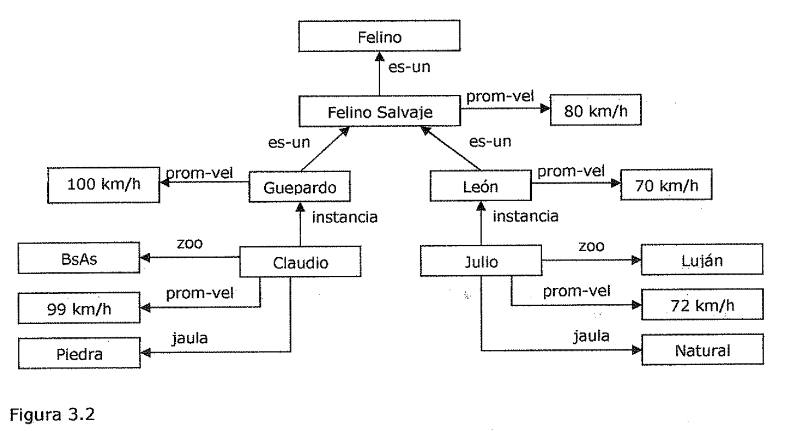

zoo Claudio Julio

zoo Luján

prom-vel 72 km/h

jaula Natural

Para dar soporte a la ***herencia de propiedades,*** los objetos se deben
organizar en ***clases,*** y las clases se deben disponer como una ***jerarquia
de generalizaciones.*** En la Figura 3.2 aparece una estructura organizada de
esta forma, en ella se ha introducido conocimiento acerca de felines salvajes.
Las ***líneas*** representan *atributos;* los ***nodos recuadrados***
representan *objetos y valores de los atributos de los objetos.* Estes valores,
a su vez, también se pueden ver coma objetos con atributos y valores, y así
sucesivamente. Las ***flechas*** *conectan los objetos con sus valores a través
de los correspondientes atributos.* La estructura que aparece en la figura es lo
que se denomina una ***estructura de ranura y relleno*** *(slot-* *and-filler).*
Tambien se puede denominar red semántica o colección de estructuras (frames).

En este último caso, cada estructura representa la colección de atributos y
valores asociados con un nodo en particular.

La Figura 3.3 muestra el nodo correspondiente a un león representado como una
estructura.

No hay que dejarse desanimar por la confusion términológica. Es tan flexible el
modo en que se puede utilizar esta (y el resto de las estructuras que se
describen en este apartado) para resolver cada uno de los problemas concretes de
representación, que es difícil reservar palabras precisas para cada
representación particular. En general, el uso del término sistema de estructuras
*(frame system)* implica, de alguna manera, una mayor estructuración en los
atributos yen el mecanismo de inferencia que cuando se utiliza el término red
semántica.

Julio

instancia: prom-vel: zoo: • jaula:

Leon

72 km/h Luján Natural

Figura 3.3

Lo que haremos aquí será dar una idea acerca de la manera en que sirven de
soporte a la deducción mediante el conocimiento que contienen. Todos los objetos
y la mayoría de los atributos que se utilizan en este ejemplo pertenecen al
dominio de los felinos y no son significativos en general. Las dos. excepciones
son el atributo ***es-un*** (is a), que se utiliza para indicar *que una clase
está contenida en otra,* y el atributo ***instancia,*** que se utiliza para
indicar *pertenencia a una clase.* *Estos dos atributos especificos (de utilidad
general) son la base de la herencia de propiedades como una técnica de
inferencia. Mediante esta técnica se puede acceder a la base de conocimiento y
recuperar los hechos que han sido explícitamente almacenados en ella, así coma
otros hechos que se pueden deducir de los primeros.* Una forma ideal de
algoritmo de herencia de las propiedades se podría enunciar de la siguiente
forma.

**Algoritmo: herencia de propiedades**

Para acceder al valor V de un atributo A en una instancia I:

1. Encontrar I en la base de conocimiento.

2. Si el atributo **A** tiene algún valor asígnado, devolver ese valor.

3. En caso contrario, comprobar si el atributo *instancia* tiene algún valor
 asígnado. Si no lo tiene entonces fallar.

4. En caso contrario, ir al nodo identificado por ese valor y comprobar si alH
 existe algún valor para el atributo **A.** Si lo hay, devolverlo.

5. En caso contrario, repetir hasta que el atributo *es-un* no tenga valor
 asígnado o hasta encontrar una respuesta:

1. Obtener el atributo *es-un* e ir a ese nodo.

2. Comprobar si el atributo **A** tiene algún valor. Si lo tiene, devolverlo.

' Este procedimiento es una simplificación. No dice nada acerca de cómo proceder
cuando hay más de un valor para los atributos *instancia* o *es-un.* Pero aun
así describe el mecanismo básico de la herencia.

3,1,3,3. Conocimiento deductivo

La herencia de propiedades es una forma muy potente de inferencia, pero no es la
única. En algunas ocasiones es necesario echar mano de ***toda la potencia de la
lógica tradicional*** y aún más) para describir las inferencias apropiadas. En
la Figura 3.4 se muestra un ejemplo de la ***lógica de predicados de primer
orden*** aplicada a la representación de conocimiento adicional acerca de los
felinos salvajes.

\Ix: felino\_salvaje (x) A hambriento (x) " prom\_vel(x,72) A presa (y) "
prom\_vel (y,20) ➔ **come (x,y)**

Figura 3.4

Por supuesto, este conocimiento será inútil a menos que se disponga de un
mecanismo de inferencia que lo pueda aprovechar (de la misma forma que el
conocimiento por omisión del ejemplo anterior habría sido inútil sin el
algoritmo que permitía recorrer la base de conocimiento).

El ***procedimiento de inferencia*** necesario en este caso será uno que
implemente las ***reglas lógicas de la inferencia.*** Existen muchos de tales
mecanismos, algunos de los cuales razonan hacia adelante a partir de los hechos
hasta llegar a las conclusiones, mientras que otros razonan hacia atrás desde
las conclusiones buscadas hasta los hechos de partida. Entre los más utilizados
de estos procedimientos se encuentra el de ***resolución*** que utiliza una
estrategia de prueba por contradicción.

3.1.3.4. Com::icimiento procedimental

Hasta ahora los ejemplos sobre la base de conocimiento acerca de los felinos
salvajes se han centrado en hechos declarativos relativamente estaticos. Pero
existe otro tipo de conocimiento, ***operacional o procedimental,*** igualmente
útil, que especifica que hacer cuando se da una determinada situación. El
conocimiento procedimental se puede representar en los programas de muchas
maneras distintas. La manera más habitual consiste en especificarlo como *un*
***código*** *(en algún lenguaje de programación* como *PROLOG)* ***que hace
algo.*** La maquína utiliza el conocimiento cuando ejecuta el código para llevar
a cabo una determinada tarea. Un ejemplo de esto se ve en la Figura 3.5 **come
(X,Y)**:- felino\_salvaje (X), hambriento (X), prom\_vel(X,72), presa (Y),
prom\_vel (Y,20)

Figura 3.5

1. Problemas de la Representación del Conocimiento Antes de embarcarnos en la
 discusión de los mecanismos específicos que se utilizan para la representación
 de los distintos tipos de conocimiento acerca del mundo real, es necesario
 señalar brevemente una serie de cuestiones presentes en todos ellos:

1. **Atributos importantes**

**iExisten atributos tan genericos que aparezcan en practicamente todos los
dominios**

**de aplicación? ¿Si es así, es necesario asegurarse de que sean tratados**
**adecuadamente en cada uno de los mecanismos que se propongan. Si esos
atributos existen ¿Cuáles son?** Hay dos atributos con una especial
significación, cuyo uso nos han sido presentados anteriormente: ***instancia* y
*es-un.*** Estos atributos son importantes debido a que en ellos se apoya la
herencia de propiedades. Reciben diferentes nombres en los sistemas de IA, pero
el nombre es lo de menos, lo importante es que dichos atributos representan la
*pertenencia a* *una clase* y la *inclusion de una clase en otra,* y que *la
inclusion de clases es transitiva.*

1. **Relaciones entre atributos**

**iSe pueden establecer relaciones relevantes entre los atributos de los
objetos?** Los atributos que se utilizan para describir a los objetos pueden ser
a su vez entidades representables. *¿Qué* propiedades poseen independientemente
del conocimiento específico que (.

codifiquen? Hay cuatro propiedades que merece la pena mencionar aquí:

Inversos

+ Existencia en una jerarquia es-un

+ Técnicas para el razonamiento acerca de los valores

+ Atributos univaluados

**Inversos**

Las entidades del mundo se pueden relacionar de muy diversas maneras. Pero desde
el momento en que decidimos describir esas relaciones como atributos, nos
restringimos a una perspectiva según la cuál nos fijamos en un objeto y tratamos
de establecer las relaciones que existen entre el y los otros. Los atributos son
esas relaciones.

Por ejemplo, en el caso de la siguiente representación:

zoo(Julio,Luján) se puede interpretar igualmente como una afirmación acerca de
Julio o acerca de Luján. Su uso efectivo dependerá del resto de los hechos que
contenga el sistema.

Otra aproximación consiste en utilizar atributos que fijen un determinado punto
de vista, pero utilizándolos por parejas, de manera que ***uno sea el inverso
del otro.*** De esta manera, tendremos dos hechos:

* uno asociado con Julio zoo = Luján

* otro asociado con Luján felinos = Julio,

Esta es la aproximación que se toma en los sistemas de redes semánticas y los
sistemas basados en marcos. Cuando se utiliza, suele ir acompañada de una
herramienta para la adquisición de conocimiento que obliga a la *declaración
conjunta de los atributos inversos.*

**Existencia en una jerarquia es-un**

De la misma forma que existen clases de objetos y subconjuntos más específicos de
esas clases, también se puede hablar de *atributos y especializaciones de* los
*atributos.* Considerese, por ejemplo, el atributo felinos\_salvajes. Este
atrib.uto es en realidad una especialización del atributo felinos, que a su vez,
es una especialización del atributo mamíferos. Este tipo de relaciones de
***generalización-especialización*** referidas a los atributos tienen la misma
misión que cuando se aplican a los demas conceptos - *servir de soporte a la
herencia.* En el caso de los atributos, la información que se hereda consiste en
cosas tales como restricciones sobre los valores que un atributo puede tomar o

* ) mecanismos para el cómputo de dichos valores.

**Técnicas para e.1 razonamiento acerca de los valores**

En ocasiones los valores de los atributos se especifican explícitamente durante
la creación de una base de conocimiento. Pero generalmente el sistema debe
razonar sobre valores que no ha recibido explícitamente. Hay varios tipos de
información que pueden jugar un determinado papel en este razonamiento,
incluyendo:

Información acerca del tipo del valor. El valor de altura debe ser un número
medido en una unidad de longitud.

+ Restricciones sobre el valor. La edad de una persona no puede ser mayor que la
 de ninguno de sus progenitores.

+ Reglas para el cómputo de un valor cuando sea necesario. Reglas hacia atrás.

+ Reglas que describen las acciones que se deberfan llevar a cabo en el caso de
 gue se llegase a conocer un determinado valor. Reglas hacia adelante.

**Atributos univaluados**

Un tipo de atributo, no por específico menos útil, es aquel que ***solo puede
tomar un (mica valor.*** Por ejemplo, un león determinado solo puede pertenecer
a un único zoo, y tiene una única velocidad promedio. Cuando se pretenda delinir
un nuevo valor para uno de estos atributos que ya tuviera otro valor asígnado
previamente, solo puede ser por dos razones. O bien se ha producido un cambio en
el mundo o bien existe una contradicción en la base de conocimiento que es
necesario resolver.

c. Seleccion de la granularidad de la representación i.A que nivel se debe
representar el conocimiento?

Independientemente del mecanismo de representación que se elija, es necesario
responder a (' la siguiente cuestión: *"¿A qué niVel de detalle* se *debería
representar el mundo?"* Un buen ejemplo servira de ilustración al problema.
Supongamos que estamos interesados en representar el hecho:

**Juan vislumbró a Susana**

Una posible representación sería:

Con esta representación sería sencillo responder a la pregunta:

¿Quién vislumbró a Susana?

Pero supongamos que queremos saber si:

**i.Vio Juan a Susana?**

La respuesta, obviamente, es que *"si",* pero no es una respuesta que podamos
obtener a partir del único hecho conocido hasta ahora. Por supuesto se podrían
añadir otros hechos como:

vislumbró(x,y) ➔ vio(x,y) Otra posible solución consistiria en representar
explicitamente el hecho de que vislumbrar es en realidad una forma particular de
ver. Se podría escribir algo así como:

vio(agente(Juan), objeto(Susana), duración(breve)) El problema de *elegir la
granularidad de la representación adecuada no* es *fácil.* Está claro que
mientras más bajo sea el nivel que escojamos, más sencillo será razonar para
ciertos casos, a costa de un proceso de inferencia más complejo para obtener esa
representación a partir del lenguaje natural y de un mayor espacio de
almacenamiento, puesto que muchas inferencias se representarán muchas veces.

**D. La representación de conjuntos de objetos**

1. **Como se deben representar los conjuntos de objetos?**

La posibilidad de representar conjuntos de objetos es importante por varias
razones.

En primer lugar, *existen propiedades que* se *verifican en conjuntos de objetos
pero no* *así en las elementos particulares de las conjuntos.* Por ejemplo, "En
Australia hay más ovejas que personas".

La otra razón por la que es importante disponer de algún medio de representación
de conjuntos es que *cuando existe una propiedad que verifican todos los
elementos de un* *conjunto,* es *más eficiente asociar esa propiedad al conjunto
que asociarla (* *individualmente a cada uno de sus componentes.* Hay dos formas
de delinir un conjunto y sus elementos.

La primera consiste en ***enumerar* todos *los elementos.*** Es lo que se
denomina una *definición por extensión.* • La segunda consiste en ***dar una
determinada regla,*** de forrna que cuando se evalua ' un determinado objeto, da
como resultado verdadero o falso según que el objeto C pertenezca o no al
conjunto. Tales reglas son denominadas *definiciónes par* *comprensión.* Por
ejemplo, una definición por extensión del conjunto de los planetas habitados por
personas de nuestro sistema solar es {Tierra}. La definición por comprension
sería:

De esta forma, es muy fácil determinar cuando son iguales dos conjuntos
definidos por extensión, pero no así cuando los conjuntos se definen por
comprension.

Sin embargo, las representaciones por comprension permiten la definición de
conjuntos infinitos y de conjuntos en los que no se conocen explícitamente todos
sus elementos.

La segunda propiedad es que los conjuntos descritos por comprension se pueden
delinir dependientes de parametros modificables, como el tiempo o la
localizacion espacial.

**E. Busqueda de la estructura adecuada a cada circunstancia**

**Dada una base de conocimiento muy extensa ¿Cómo acceder a los fragmentos**

**relevantes en cada momento?**

1 Una vez que se ha encontrado una estructura de conocimiento candidata a
resolver el problema en curso, es necesario establecer una correspondencia
detallada entre ambos. Los detalles del proceso de correspondencia dependerán de
la representación que se utilice. Puede consistir en establecer las ligaduras
adecuadas entre los objetos y las variables, o puede que sea necesario hacer
comparaciones entre atributos. En cualquier caso, a medida que se localicen los
valores que satisíagan las restricciones impuestas por la estructura de
conocimiento, aquellos iran ocupando sus correspondientes lugares dentro de la
estructura.

Al intentar acceder a los fragmentos relevantes de la base de conocimiento, en
cada momento es importante tener en cuenta los siguientes puntos:

Tomar aquellas partes de la estructura seleccionada que se hayan conseguido ·,,
identificar en la presente situación y utilizarlas en la búsqueda de las
posibles alternativas.

Obviar el fall<i de la estructura actual y seguir utilizandola. Por. ejemplo,
una silla con solo tres patas puede que simplemente este rota, o que haya otro
objeto delante que impida ver la cuarta pata.

+ Utilice enlaces que conecten las estructuras y que sugieran posibles
 direcciones de búsqueda.

+ Si las estructuras de i;onocimiento están almacenadas como una jerarquia
 es-un,

ascender por la jerarqufa hasta encontrar una estructura lo bastante general.
como para no entrar en contradicción con la situación en curso.

1. **El problema del Marco**

En este capítulo se han descrito diversos métodos de representación del
conocimiento que permiten la construcción de descripciónes de estados complejos
en un programa de búsqueda.

*Existe una cuestión adicional relacionada con la representación eficiente de
las secuencias de estados que se generan en un proceso de búsqueda.* Esta puede
ser una tarea difícil cuando se trate de problemas complejos o que presenten
estructuras extrañas.

**Considerese el mundo de los robots domésticos.**

Existe un gran número de objetos y relaciones a representar, de modo que en las
descripciónes de los estados se deben incluir hechos tales como
***encima(Planta12,Mesa34),*** consiste en almacenar la descripción de cada
estado como una lista de tales hechos.¿Pero qué ocurre durante el proceso de
resolución de problemas si cada una de dichas descripciónes es muy larga?

***La mayoría de los hechos no cambiará de un estado a otro,*** a pesar de lo
cuál *se* ***representarán en cada uno de los nodos y la memoria se llenará
rápidamente,*** Y lo que es más, ***se empleará la mayor parte del tiempo en la
creación de estos nodos*** ***y en la copia de estos hechos*** - la mayor parte
de los cuales no cambia - de unos nodos a otros.

Por ejemplo, en el mundo del robot, se emplearía mucho tiempo repitiendo en cada
nodo ***debajo(Suelo, Techo).* Y** todo esto además de resolver el verdadero
problema que consiste en determinar los cambios que se deberían producir de un
nodo al siguiente.

*Al problema de la representación de los hechos que cambian, así coma de
aquellos que no lo hacen,* es *a lo que se conoce coma* ***problema del marco***
*(frame problem)* *(McCarthy y Hayes, 1969).* En determinados dominios, el único
problema consiste en la representación de todos los hechos. En otros, en cambio
no es trivial determinar cuáles son los que cambian. Por ejemplo, en el mundo
del robot, se puede tener una planta encima de una mesa que está debajo de una
ventana. Supongamos que se desplaza la mesa al centro de la habitación. Se
deberá inferir que la planta también está ahora en el centro de la habitación
pero que la ventana no.

Para llevar a cabo este tipo de razonamiento, hay algunos sistemas donde se
utilizan explícitamente unos axiomas denominados ***axiomas del marco,*** que
***describen las cosas*** ***que cambian cuando se aplica un determinado
operador sobre el estado n para alcanzar el estado n+1..*** (Todo aquello que
cambia forma parte del propio operador).

Así, en el dominio del robot, se escribirían axiomas como este:

Color(x,y,s1) A desplaza(x,s1,s2) ➔ color(x,y,s2) que se puede leer como, *"Si x
es de color y en el estado s1 y se aplica la operación de* *desplazamiento de x
en el estado s1 para llegar al estado s2, entonces el color de x en* s2 *sigue*
*siendo y".* Desgraciadamente en los dominios complejos es necesario utilizar un
enorme número de axiomas como estos. Otra aproximación consiste en suponer que
solo cambia aquello que debe.

Donde por *"debe"* se entiende que los cambios vendrán dados explicitamente por
los axiomas qu describen al operador o que se deducen de manera lógica de algún
cambio explícito. Esta idea de circunscribir el conjunto de cosas inusuales es
muy potente; se puede utilizar como una solución parcial al problema estructural
y como un modo de razonamiento con conocimiento incompleto.

* 1. Lógica Simbólica

1. La Lógica y el Lenguaje

1. Introducción

**¿Qué es la Lógica?**

Es fácil hallar respuestas a la pregunta *"¿Qué* es la Lógica?" Según Charles
Peirce, "Se han dado casí un centenar de definiciónes de ella". Pero Peirce
continúa diciendo:

*"Sin embargo, se concederá generalmente que su problema central es la
clasificación de los argumentos, de modo que todos los que sean malos se pongan
de un lado y los que sean buenos del otro.*.. " ***El estudio de la Lógica,* es
*el estudio de los métodos y principios usados al distinguir entre los
argumentos correctos (buenos) y los argumentos incorrectos (malos).*** Con esta
definición no se intenta implicar, desde luego, que uno puede hacer la
distinción solo si ha estudiado lógica. Pero el estudio de esta ayudará a
distinguir entre los argumentos correctos e incorrectos, y lo hará de varias
maneras. Ante todo, en el estudio propio de la lógica, esta se aborda como un
arte y como una ciencia.

* Aquí, como en cualquier parte, *la práctica ayudará a alcanzar la perfección.*

* En segundo lugar, el estudio de la lógica, especialmente la lógica simbólica,
 como el estudio de cualquier ciencia exacta *incrementará la capacidad de
 razonamiento.*

* Y por último, el estudio de la lógica dará al estudiante ciertas *técnicas
 para probar la validez de todos los argumentos,* incluyendo los suyos. Este
 conocimiento tiene valor porque cuando los errores son de fácil detección es
 menos probable que se cometan.

La lógica se ha definido con frecuencia como la ***ciencia del razonamiento.***
Esta definición, aunque da una *clave* a la naturaleza de la lógica, no es muy
exacta. El razonamiento es la clase especial de pensamiento llamada
***inferencia,*** en la que. **se *sacan conclusiones partiendo de premisas.***
Como pensamiento, sin embargo, no es campo exclusivo de.la lógica, ' sino parte
también de la materia de estudio del psicologo. Los psicologos que examinan el •
proceso del razonamiento lo encuentran en extremo complejo y altamente
emocional, consistente en torpes procedimientos de prueba y error iluminados por
subitas - y a *veces* en apariencia inconsecuentes - visiones internas. Todos
son de importancia para la psicologfa.

***Pero el lógico no* se *interesa en el proceso real del razonamiento. A el le
importa la corrección del proceso completado.*** Su pregunta siempre es: *lse*
sigue la conclusión alcanzada de las premisas usadas o supuestas? Si las
premisas son un fundamento adecuado para aceptar la conclusión, si afirmar que
las premisas son verdaderas garantiza el afirmar la verdad de la conclusión,
entonces el razonamiento es correcto. De otra manera es incorrecto.

Los métodos y técnicas del lógico se han desarrollado primordialmente con el
objeto de aclarar la distinción. El lógico se interesa en todo razonamiento, sin
atender al contenido mismo, sino solo desde este punto de vista especial.

## Naturaleza del argumento

**3.2.1.2, Naturaleza del Argumento**

La *inferencia* es una actividad en la que se afirma una proposición sobre la
base de otra u otras proposiciones aceptadas como el punto de partida del
proceso. *Al lógico no le concierne el proceso de inferencia, sino las
proposiciones iniciales y finales de ese proceso de las refaciones* entre
ellas.* ***Las proposiciones son o verdaderas o falsas,*** y en esto difieren de
las preguntas, ordenes y exclamaciones. Los gramaticos clasífican las
fórmulaciones lingufsticas de las proposiciones, preguntas, ordenes, y
exclamaciones, en oraciones declarativas, interrogativas, imperativas y
exclamatorias, respectivamente. Estas nociones son familiares.

Es costumbre distinguir entre las oraciones declarativas y las proposiciones que
se afirman al pronunciar aquellas.

* La distinción se hace resaltar observando que ***una oración declarativa es
 siempre*** ***parte de un lenguaje,*** lengua en que se dice o se describe,
 mientras que *las* ***proposiciones no son privativas de ninguna de las
 lenguas en que* se *expresa.***

* Otra diferencia es que ***la misma oración articulada en diferentes contextos
 puede*** ***afirmar diferentes proposiciones.*** (por ej. la oración "tengo
 hambre", puede ser proferida por personas diferentes haciendo aserciones
 diferentes).

La misma clase de distinción puede establecerse entre las oraciones y los
enunciados. Puede hacerse el mismo enunciado utilizando palabras diferentes, y
la misma oración puede ser dicha en contextos diferentes para hacer enunciados
diferentes. Los términos *"enunciados"* y *"proposición"* no son sinonimos
exactos, pero en los escritos de los lógicos se usa más o menos en el mismo
sentido.

Aquí se • usaran los dos términos. En los capítulos siguientes usaremos también
el término "enunciado" y el término "proposición" refiriendonos a las oraciones
en las que se expresan los enunciados (y las proposiciones). En cada caso, el
significado quedará claro por el contexto.

A cada *inferencia* corresponde un *argumento,* y de estos argumentos trata la
lógica primordialmente.

*Un* ***argumento*** *puede definirse como* ***un grupo cualquiera de
proposiciones o*** ***enunciados*** *de los cuales se afirma que hay uno que se
sigue de los demas, considerando estos coma fundamento de la verdad de aquel.*
La palabra argumento también tiene otros significados en su uso cotidiano, pero
en la lógica tiene el sentidb técnico explicado. En los capítulos que siguen
usaremos también la palabra argumento en un sentido derivado para referirnos a
una oración cualquiera o colección de oraciones en que esta fórmulado o
expresado un argumento. Cuando así lo hagamos, presupondremos que la claridad
del contexto permite asegurar que al pronunciar esas oraciones se hacen
enunciados únicos o se afirman proposiciones únicas.

Todo argumento tiene una estructura, en cuyo analisis usualmente se emplean los
términos

***"premisa"* y *conclusión".***

*La* ***conclusión*** *de un argumento es la proposición afirmada basandose en
las otras proposiciones del argumento y estas otras proposiciones que se afirman
coma (* *fundamento o razones para la aceptación de la conclusión son las*
***premisas*** *de ese* *argumento.* Notemos que "premisa "y "conclusión" son
términos relativos, en el sentido de que la misma proposición puede ser premisa
en un argumento y conclusión en otro. As[, todos los hombres son mortales es
premisa en el argumento

**Todos los hombres son mortales.**

Socrates es un hombre.

Por lo tanto, Socrates es mortal.

y conclusión en el argumento Todos las animales son mortales..

Todos las hombres son animales.

**Luego, todos los hombres son mortales.**

***Toda proposición puede ser premisa o conclusión dependiendo del contexto.***

Es una premisa cuando se presenta en un argumento en el que se le supone para
demostrar alguna otra proposición y es una conclusión cuando se presenta en un
argumento que se pretende la demuestra basandose en las otras proposiciones que
se suponen.

Es costumbre distinguir entre ***argumentos deductivos* e *inductivos.*** En
todos los argumentos se pretende que las premisas proporcionen algún fundamento
para la verdad de sus conclusiones, pero solo en un *argumento deductivo* se
pretende que sus premisas proveen un fundamento *absolutamente concluyente.* Los
términos técnicos ***"válido"* e *"inválido"*** se usan en lugar de "correcto" e
"incorrecto" al caracterizar los *argumentos deductivos.* *Un* ***argumento
deductivo es válido*** *cuahdo sus premisas y conclusiones están relacionadas de
modo tal 'que es absolutamente imposible que las premisas sean verdaderas, a
menos que la conclusión lo sea también.* La tarea de la lógica deductiva es la
que aclara la naturaleza de la relación que existe entre premisas y conclusión
en un argumento válido, y proporcionar las técnicas de discriminacion entre los
válidos y los inválidos.

En los argumentos inductivos solo se pretende que sus premisas proporcionen
*algún* fundamento para sus conclusiones. Ni el término "válido" ni su opuesto
"inválido" se aplican con propiedad a los argumentos inductivos. Los argumentos
inductivos difieren entre sí en el *grado de verosimilitud o probabilidad que
sus premisas confieren a sus conclusiones,* y se ¿es estudia en la lógica
inductiva. Pero en este libro nos ocuparemos solamente de los argumentos
deductivos y usaremos la palabra *"argumento"* en referencia exclusiva a los
argumentos deductivos.

## Verdad y validez de argumentos

- 1. Verdad y Validez

*La* ***verdad y falsedad*** *caracterizan las proposiciones o los enunciados, y
puede decirse, en sentido derivado, que caracterizan las oraciones declarativas
en que se* les *fórmula. Pero los argumentos no se caracterizan propiamente por
cuanto que son verdaderos o falsos.* *Por otro lado, la* ***validez*** *y la*
***invalidez*** *caracterizan los argumentos más bien qUe las proposiciones o
los enunciados.* Hay una conexión entre la validez o invalidez de un argumento y
la verdad o falsedad de sus premisas y conclusión, pero esta conexión no es de
ningún. modo una conexión simple.

Algunos argumentos válidos solamente contienen proposiciones verdaderas, como,
por ejemplo, Todos los murcielagos son mamíferos. Todos los mamíferos tienen
pulmones.

Luego, todos los murcielagos tienen pulmones.

Pero un argumento puede contener proposiciones falsas exclusivamente y ser
válido a pesar de todo, como, por ejemplo, Todas las truchas son mamíferos.
Todos los mamíferos tienen alas. Luego, todas las truchas tienen alas.

***Este argumento es válido porque si sus premisas fuesen verdaderas su
conclusión tendría que ser verdadera también,*** aunque de hecho son falsas.

Estos dos ejemplos muestran que, aunque algunos argumentos válidos tienen
conclusiones verdaderas, no todos los tienen verdaderas.

***La validez de un argumento no garantiza la verdad de su conclusión.***

Cuando consideramos el argumento

Si soy presidente entonces soy famoso. Yo no soy presidente.

Por tanto, yo no soy famoso.

podemos ver que aunque tanto las premisas coma la conclusión son verdaderas, es
un argumento inválido. Su invalidez se hace obvia al compararlo con otro
argumento de la misma forma:

Si Rockefeller es presidente, entonces es famoso, Rockefeller no es presidente.

Luego, Rockefeller no es famoso.

Este argumento es claramente inválido, puesto que sus premisas son verdaderas
pero su conclusión es falsa. Los dos últimos ejemplos muestran que aún cuando
algunos argumentos inválidos tienen conclusiones falsas no todos los tienen
falsas.

***La falsedad de su conclusión no garantiza la invalidez de un argumento.
Pero***

***la falsedad de.su conclusión sí garantiza que o el argumento es inválido o
por***

***lo menos una de sus premisas es falsa.***

Hay dos condiciones que debe satisfacer un argumento para establecer la verdad
de su conclusión.

***Debe ser válido y todas sus premisas deben ser verdaderas.***

Al lógico solo atafie una de estas condiciones. Determinar la verdad o falsedad
de las premisas es tarea de la investigacion cientffica en general, pues las
premisas pueden tratar de cualquier asunto. Pero determinar la validez o
invalidez de los argumentos es el campo especial de la lógica deductiva. Al
lógico le interesa la cuestión de la validez aún para argumentos cuyas premisas
puedan ser falsas.

Podrfa cuestionarse la legitimidad de ese interes. Podrfa sugerirse que se
confinara nuestra atención solo o los argumentos de premisas verdaderas. Pero es
frecuentemente necesario depender de la validez de argumentos cuyas premisas son
de verdad desconocida. Los cientificos modernos investigan sus teorías
deduciendo conclusiones de las mismas que predicen el comportamiento de
fenomenos observables en el laboratorio o el observatorio.

La conclusión se pone a prueba directamente por observación y, si es verdadera
esto tiende a confirmar la teorfa de donde se dedujo, pero si es falsa queda
refutada la teoria. En uno **y** otro caso el cientffico tiene un interes vital
en la validez del argumento por el que la conclusión puesta a prueba se deduce
de la teorfa investigada porque si el argumento es inválido, su procedimiento es
inútil. Lo que precede es una descripción sobresimplificada del método
cientffico, pero sirve para mostrar que las cuestiones de validez son
importantes aún en argumentos de premisas falsas.

## Logica simbolica y enunciados

- 1. Lógica Simbólica

Se ha explicado que a la lógica le conciernen los argumentos y que estos
contienen proposiciones o enunciados como sus premisas **y** conclusiones. Estas
últimas no son entidades lingOfsticas, como las oraciones declarativas, sino más
bien son lo que las oraciones declarativas tfpicamente afirman al ser
articuladas.

Sin embargo, la comúnicacion de proposiciones y argumentos requiere el uso del
lenguaje, **y** esto complica nuestro problema. Los argumentos fórmulados en
ingles o cualquier otro lenguaje natural son de difícil evaluación debido a la
vaga y equfvoca naturaleza de las palabras en que se expresan, la ambigOedad de
su construcción, sus expresiónes idiomaticas, que pueden interpretarse mal, y su
estilo metaforico agradable por un lado, pero engafioso por otro. Sin embargo la
resolución de estas dificultades no es el problema central para el lógico,
porque aún ya resueltas queda todavfa el problema de decidir la validez o la
invalidez del argumento.

Para evitar las dificultades perifericas ligadas al lenguaje ordinario, los
trabajadores de las ciencias han desarrollado *vocabularios técnicos
especializados.* El cientffico economiza el espacio y el tiempo requeridos para
la escritura de sus reportes y teorías adoptando símbolos especiales para
expresar ideas que de otra manera requerirfan una larga sucesion de palabras
familiares para su fórmulación. Esto tiene la ventaja adicional de reducir la
cantidad de atención requerida, puesto que cuando una oración o ecuacion se
alarga demasíado se hace más difícil captar su significado. La introducción del
símbolo exponente en las matemáticas permite expresar la ecuacion más breve e
inteligiblemente como

**A12** = 87

Una ventaja semejante se ha logrado usando las fórmulas graficas en la qufmica
organica; y el lenguaje de cualquier ciencia avanzada se ha visto enriquecido
por innovaciones simbólicas similares.

***La lógica también ha desarrollado un sistema de notación técnica especial.***

Aristóteles hada uso de ciertas abreviaciones para fácilitar sus
investigaciones, y la lógica simbólica moderna ha crecido con la introducción de
otros muchos símbolos especiales. La diferencia entre la lógica nueva y la
antigua es más una cuestión de grado que de naturaleza, pero la diferencia de
grado es tremenda.

La lógica simbólica moderna es incomparablemente más poderosa como herramienta
de analisis y deducción a través del desarrollo de un lenguaje técnico propio.

*Los símbolos especiales de la lógica moderna nos permiten exhibir con mayor
claridad las estructuras lógicas de argumentos cuya fórmulación puede quedar
oscura en el lenguaje ordinario.* '1 Es una tarea más fácil la de dividir los
argumentos en válidos e inválidos cuando es ¿es expresa con el lenguaje
simbólico especial, pues en este no se dan los problemas perifericos de
vaguedad, ambigOedad, peculiaridades idiomaticas y metaforas. La introducción y
utilización de símbolos especiales sirve no solo para fácilitar la evaluación de
los argumentos, sino también para aclarar la naturaleza de la inferencia
deductiva.

Los símbolos especiales de la lógica se adaptan mucho mejor que el lenguaje
ordinario a la obtención de las inferencias. Su superioridad en este respecto es
comparable a aquella de que gozan los numerales arabigos sobre los más antiguos
numerales romanos, tratandose de la computación. Es fácil multiplicar 148 por
47, pero muy difícil computar el producto de CXLVIII y XLVII. De manera
semejante, la obtención de inferencias y la evaluación de los argumentos se ve
grandemente fácilitada con la adopción de una notación lógica especial.

1. Argumentos que contienen Enunciados Compi.lestos

1. Em.mciados Simples y Compuestos

Todos los ***enunciados*** pueden dividirse en dos clases: ***simples*** y
***compuestos.***

- * + Un enunciado ***simple*** es uno que no contiene otro enunciado como parte
 componente.

+ Todo enunciado ***compuesto*** contiene oti-o enunciado como componente.

Por ejemplo, *"Las pruebas de armas nucleares en la atmósíera serán
interrumpidas* o *este* *planeta* se *hará inhabitable"* es un enunciado
compuesto cuyos componentes son los dos enunciados simples *"Las pruebas de
armas nucleares en la atmósíera serán interrumpidas"* y *"este planeta será
inhabitable".* Las partes componentes de un enunciado compuesto pueden a su
*vez* ser enunciados compuestos, desde luego.

Ahora veremos algunas de las maneras diferentes de combinar los enunciados en
enunciados compuestos:

1. El enunciado *"Las rosas son rojas y las violetas son azules"* es una
 ***conjuncion,*** un

enunciado compuesto que se forma insertando la palabra ***"y"*** entre los dos
enunciados. Dos enunciados así combinados se llaman enunciados ***conyuntos.***
Sin embargo, la palabra "y" tiene otros usos, como en el enunciado *"Castor y
Pólux eran gemelos"* que no es compuesto, sino un enunciado simple que afirma
cierta relación. Introducimos el punto "." como un símbolo especial para
combinar enunciados conjuntivamente. Usandolo, la conjunción precedente se
escribe "Las rosas son rojas. Las violetas son azules".

Si *p* y *q* son dos enunciados cualesquiera su conjunción se escribe ***p.q.***
Cada enunciado es o verdadero o fatso, de modo que se puede hablar del *valor de
la verdad* de un enunciado, siendo el valor de verdad de un enunciado verdadero,
*verdadero* y el valor de verdad de un enunciado fatso, *fatso.* Hay dos amplias
categorfas en las que pueden dividirse los enunciados compuestos de acuerdo con
que exista o no una conexión necesaria entre el valor de verdad del enunciado
compuesto y los valores de verdad de sus enunciados componentes.

El valor de verdad del enunciado compuesto *"Smith cree que el plomo es más
pesado* *que el zinc"* es completamente independiente del valor de verdad de su
enunciado componente simple *"el plomo es más pesado que el zinc",* pues las
personas tienen creencias correctas tanto como creencias equivocadas.

Por otro lado, hay una conexión necesaria entre el valor de verdad de una
conjunción y los valores de verdad de sus enunciados conyuntos.

***Una conjuncion* es *verdadera si sus conyuntos son ambos verdaderos, pero*
es**

***falsa en cualquier otra circunstancia.***

***Cualquier enunciado compuesto cuyo valor de verdad está determinado
completamente par las valores de verdad de sus enunciados componentes* es**

***un enunciado compuesto función de verdad.***

Los únicos enunciados compuestos que aquí consideraremos serán enunciados
compuestos función de verdad. Por lo tanto, en el resto de este libro usaremos
el término "enunciado simple" para referirnos a cualquier enunciado que no sea
compuesto función de verdad.

Como las corijunciones son enunciados compuestos función de verdad nuestro
símbolo es un conectivo de función de verdad (o veritativo funcional, como
también se dice).

Dados dos enunciados *p* y *q* hay solamente cuatro conjuntos de valores de
verdad para ellos, y en cada caso el valor de verdad de su conjunción *p*. *q*
está determinado de manera única. Los cuatro casos posibles pueden exhibirse
como a continuación:

* En el caso *p* es verdadero y *q* es verdadero, *p.q* es verdadero;

* En el caso *p* es verdadero y *q* es falso, *p.q* es falso;

* En el caso *p* es falso *y q* es verdadero, *p.q* es falso;

* En el caso *p* es falso y *q* es falso, *p.q* es falso.

Al representar los valores de verdad verdadero y falso. con las letras **"T" y
"F",** respectivamente, la manera en que el valor de verdad de una conjunción

queda determinado por los valores de verdad de sus conyuntos se muestra de
manera más concisa por medio de una *tabla de verdad,* como sigue:

| --- | --- | --- |

| **T** | **T** | T |

| **T** | **F** | F |

| **F** | **T** | **F** |

| **F** | **F** | **F** |

Ya que especifica el valor de verdad de *p.q* en cada caso posible, esta tabla
de verdad se puede tomar como *definición* del símbolo *punto.* Otras palabras
tales como "aunque", "sin embargo", etc., y hasta la coma y el punto y coma, se
utilizan también para conjuntar dos enunciados en un compuesto y todos ellos
pueden traducirse indiferentemente como el símbolo punto en lo que respecta a
los valores de verdad.

1. El enunciado *"No* es *el caso que el plomo sea más pesado que el oro"*
 también es compuesto siendo la ***negación*** (o el *contradictorio)* de su
 enunciado compuesto único *"el plomo es más pesado que el oro".* Introducimos
 el símbolo "~", llamado una *tilde,* para simbolizar la negación. Hay
 frecuentemente otras fórmulaciones en lenguaje ordinario, de una negación.
 Así, si *L* simboliza el enunciado *"el plomo es más pesado que el oro",* los
 enunciados diferentes "no es el caso que el plomo sea más pesado que el oro",
 "es falso que el plomo sea más pesado que el oro", "el plomo no es más pesado
 que el oro", "no es verdad que el plomo sea más pesado que el oro", "el plomo
 no es más pesado que el oro", se simbolizan todos indiferentemente como ~
 ***L.***

*Mas generalmente,* ***sip*** es *cualquier enunciado su negación se escribe* ~
***p.*** Como la negación de un enunciado verdadero es un enunciado falso y la
negación de un enunciadci falso es uno verdadero, podemos tomar la siguiente
tabla de verdad como definición del símbolo tilde:

| --- | --- |

| **T** | **F** |

| **F** | **T** |

1. Cuando dos enunciados se combinan disyuntivamente insertando la palabra
 **"o"** entre ellos, el enunciado compuesto que resulta es una
 ***disyunción*** *(o alternación)* y los dos enundados así combinados se
 llaman ***disyuntos*** *(o alternativos).*

La palabra "o" tiene dos sentidos diferentes, uno de los cuales es la clara
intención en el enunciado *"se perderá derechos a recompensas en caso de
enfermedad o desempleos".* Aquí la intención es obviamente cancelar el derecho a
premios no solo para las personas enfermas y las personas desempleadas sino
también para las personas que están enfermas y desempleadas.

*Este sentido de la palabra* **"o"** *se denomina* ***débil o inclusivo.*** En
donde la precisión sea esencial, como los contratos y otros documentos legales,
este sentido se hace explícito usando la frase ***"y/o".*** Es otro el sentido
de "o" que se intenta dar en el menú de un restaurante escribiendo *"te* o
*café",* queriendo decir que por el precio estipulado el cliente puede tomar
café o té pero no ambos.

*Este segundo sentido de* **"o"** es *llamado* ***fuerte*** *o* ***exclusivo.***
En donde la precisión es esencial y se quiere dar el sentido exclusivo a la
palabra "o" suele agregarse la frase ***"pero no ambos".***

***Una disyunción que usa el* "o" *exclusivo afirma que por lo menos uno de
los***

***disyuntivos es verdadero, pero no ambos son verdaderos.***

El *significado común parcial* que al menos un disyunto es verdadero, es el
significado todo de una disyunción inclusiva y parte del significado de una
disyunción exclusiva.

*En latfn la palabra* ***"vel"*** *expresa el* ***sentido inclusivo*** *de la
palabra* "o" *y la palabra* Es costumbre usar la primera letra de "vel" para
simbolizar "o" en su sentido inclusivo. Si p y q son dos enunciados
cualesquiera, su ***disyunción debil o inclusiva*** se escribe ***p v q.*** El

símbolo de ***"v",*** denominado una cuña (o una ve), es un conectivo de
función de verdad y se deline por la tabla de verdad siguiente:

| --- | --- | --- |

| **T** | **T** | T |

| T | F | T |

| F | T | T |

| F | F | F |

Un argumento que obviamente es válido y contiene una disyunción es el siguiente
Silogismo Disyuntivo:

Las Naciones Unidas serán reforzadas o habrá una tercera guerra mundial.

Las Naciones Unidas no serán reforzadas.

Luego habrá una tercera guerra mundial.

Es evidente que un Silogismo Disyuntivo es válido en cualquiera de las
interpretaciónes de la palabra "o", esto es, sin atención a que su primera
premisa afirma una disyunción inclusiva o exclusiva. Es usualmente difícil, y a
veces imposible, descubrir cuál es el sentido de la palabra "o" que se intenta
dar en una disyunción. Pero el argumento válido típico que tiene una disyunción
como premisa es, como el Silogismo Disyuntivo, válido en cualquier
interpretación de la palabra "o".

*Por lo tanto,* ***efectuamos una simplificación al traducir cualquier
ocurrencia de la palabra* "o" *en el símbolo lógico "v"*** *-: sin atención al
sentido que* se *quiera dar a* Desde luego, en donde se establezca
explicitamente que la disyunción es exclusiva, usando la frase adicional "pero
no ambos", por ejemplo tenemos el aparato simbólico para simbolizar este
sentido, como se explica más adelante.

El· uso de los parentesis, corchetes y llaves para la puntuación de las
expresiónes matemáticas es familiar. La expresión "6 + 9 / 3", no determina un
número único, aunque si la puntuación aclara cómo agrupar. los números que la
constituyen, denota 5 o 9. La puntuación es nec.esaria también para resolver la
ambigOedad en el lenguaje de la lógica simbólica, porque los enunciados
compuestos son susceptibles de combinaciones para formar enunciados más
complicados.

Hay ambiguedad en ***p* • *q v r,*** que podrían ser o la conjunción de p con q
v r, o por otro lado la disyunción de p. q con r. Estos dos sentidos diferentes
los dan sin ambiguedad las puntuaciones diferentes: ***p.(q v r)* y *(p. q) v
r.*** En el caso en que p y q sean falsos ambos y r verdadero, la primera
expresión puntuada es falsa (pues su primer enunciado conjunto es falso), pero
la segunda expresión puntuada es verdadera (pues su segundo enunciado disyunto
es verdadero). Aquí, la diferencia de puntuación hace toda la diferencia entre
verdad y falsedad. En la lógica simbólica, como en las matemáticas, usamos
patentesis, corchetes y llaves. para la puntuación. Sin embargo, para reducir el
número de signos.de puntuación requerido estableceremos el convenio simbólico de
que en cualquier expresión la tilde se aplicará a la componente más pequefia
permitida por la puntación: De este modo, la ambiguedad de ~ ***p v q,*** que
podría significar o *(~* ***p) v q*** o ~ ***p v q),*** queda resuelta por
nuestro convenio para significar la primera de estas, pues la tilde puede (y en
consecuencia por nuestro convenio lo hace) aplicarse a la primera componente p y
no a la expresión más larga p v q.

No todas las ***conjunciones*** se fórmulan explicitamente colocando la palabra
"y" entre oraciones completas, como en *"Carlitos es limpio y Carlitos es
encantador".* De hecho, esta se expresaria más naturalmente como *"Carlitos es
limpio y encantador",* y *"Juan y Carolina subieron a la colina"* es la manera
más natural de expresar la conjunción *"Juan subió a la* 1 *colina y Carolina
subió a la colina* ".

Lo mismo con las ***disyunciones:*** *"o Alicia o Beatriz serán elegidas"*
expresa más brevemente la proposición que alternativamente se fórmula como
*"Alicia será elegida o Beatriz será elegida";* y *"Carlota será secretaria o
tesorera."* expresa de manera un tanto más breve la misma proposición que *"o
Carlota será secretaria o Carlota será tesorera".* La ***negación*** de una
disyunción se expresa a menudo usando la frase *"ni-ni".* Así, la disyunción
*"Alicia o Beatriz serán elegidas"* queda negada por el enunciado *"ni Alicia ni
Beatriz serán elegidas".* La disyunción se simbolizaria como A v B, y su
negación como ~(A v B) o como (~A). ~B), que son fórmulas equivalentes. Negar
que al menos uno de los enunciados es verdadero es asegurar que ambos enunciados
son falsos.

La palabra *"ambos"* tiene varias funciones. Una de ellas es solo cuestión de
enfasís. Decir *"Ambos Juan y Carolina subieron a la colina"* es solo para
recalcar que los dos hicieron lo que se dice que hici.eron al decir *''Juan y
Carolina subieron a la colina".* Una función más útil de la palabra "ambos" es
de puntuación. "Ambos... y \_. \_ no son " se usa para expresar lo mismo que
"Ni... ni \_. \_ es ". En oraciones tales el orden que guardan las palabras
"ambos" y "no" es de mucha significación. Hay una gran diferencia entre:

Alicia y Beatriz no serán ambas elegidas

Alicia y Beatriz ambas no serán elegidas.

La primera se simboliza como ~(A. B), la última como ~(A). ~(B).

Finalmente, hay que observar que la frase *"a menos que"* puede también usarse
en la expresión de la disyunción de dos enunciados.

Así, *"Nuestros recursos pronto se agotaran, a menos que se procesen más
materiales de desecho"* puede expresarse también cbmo *"O se procesan tnas
materiales de desecho o se agotaran pronto nuestros recursos"* y se simboliza
como M v E.

Como una ***disyunción exclusiva*** asegura que la menos uno de los disyuntos es
verdadero pero no ambos, podemos simbolizar la disyunción exclusiva de dos
enunciados p y q cualesquiera simplemente como ***(p v q). ~(p. q).*** Así,
podemos simbolizar las conjunciones, las negaciones y las disyunciones
inclusivas y exclusivas. Todo enunciado compuesto construido a partir de
enunciados simples por aplicación repetida de conectivos de función de
verdad,.tendrá valores de verdad completamente determinados por los valores de
verdad.de esos enunciado simple.s. • Por ejemplo, si A y B son enunciados
verdaderos y X y Y son falsos, el Valor de verdad del enunciado compuesto ~[(~Av
X) v ~(B. Y)l puede encontrarse de la rilanera siguiente. Como A es verdadero,
~A es falso, y como X es falso, también la disyunción (~A v X) es falsa.• Dado
que Yes falso, la conjunción (B. Y) es falsa y su negación ~(B.Y) es verdadera.
De este modo, la disyunción (~Av X) v ~(B. Y) es verdadera, y su negación que es
el enunciado original; es. falsa. Este procedimiento paso a paso, iniciado en
las componentes (más) internas nos permite, siempre, determinar el valor de
verdad de un enunciado compuesto función de verdad partiendo de los valores de
verdad de sus enunciados simples componentes.

- 1. Em.enunciados Condicionales

El enunciado compuesto *"Si el tren se retrasa entonces perderemos nuestro
transbordo"* es un ***condicional*** *(o un hipotetico, una implicación* o *un
enunciado implicativo).* El enunciado componente situado entre el *"si"* y el
*"entonces"* es llamado el ***antecedente*** *(o el implicante* o *prótasís),* y
el componente que sigue al *"entonces"* es el ***consecuente*** *(o el
implicado* o *apódosis).* Un ***condicional*** no afirma que su antecedente sea
verdadero o que su consecuente lo sea; solo afirman que ***si su antecedente* es
*verdadero, entonces su consecuente* es *también*** ***verdadero,*** o sea, que
su antecedente implica su consecuente. La clave del significado de un
condicional es la relación de implicación que se asegura que existe entre su
antecedente y su consecuente, en ese orden.

Si examinamos un cierto número de condicionales diferentes veremos que pueden
afirmar diferentes implicaciones.

* En el condicional *"Si a todos los gatos* les *gusta el higado y Dina es un
 gato, entonces a*

*DINA le gusta el higado",* el consecuente se sigue ***lógicamente*** del
antecedente.

* Por otro lado, en el condicional *"Si la figura es un triangulo, entonces
 tiene tres lados",* el consecuente se sigue del antecedente por la
 ***definición*** misma de "triangulo".

* Pero la verdad del condicional *"Si el oro se sumerge en agua regia, entonces
 el oro se*

*disuelve"* no es cuestión de lógica ni de definición. Aquí la conexión afirmada
es causal y debe descubrirse ***empiricamente.*** Este ejemplo muestra que hay
diferentes clases de implicaciones que constituyen diferentes tipos de sentidos
de la frase *"si-entonces".* Observadas estas diferencias, ahora buscamos un
significado común identificable, algún ***significado parcial común*** a estos
que, como hemos aceptado, son diferentes tipos de condicionales.

Nuestra discusión de *"si-entonces"* correra paralela a nuestra previa discusión
de la palabra "o".

Primero, señalamos dos sentidos diferentes de esa palabra.

Segundo, notamos que habfa un *significado parcial común:* el hecho de que al
menos un disyunto sea verdadero, se vio que estaba involucrado tanto en el "o"
inclusivo como en el exclusivo.

Tercero, introdujimos el símbolo especial "v" para representar este sentido
parcial común (que era todo el significado de "o" en su sentido inclusivo).

Cuarto, observamos que, dado que argumentos como el Silogismo.Disyuntivo son
válidos en cualquier interpretación de la palabra "o", simbolizar cualquier
ocurrencia de la palabra "o" por el símbolo curia preserva la validez de tales
argumentos. Y como nos inte.resan los argumentos desde el punto de vista de la
determinación de su validez, esta traducción de la palabra "o" en "v" que puede
abstraer o •ignorar parte de su significado en algunos casos, es enteramente
adecuada para nuestros propósitos actuales.

Un *significado parcial común* de estas diferentes clases de enunciados
condicionales surge cuando preguntamos cuáles serían circunstancias suficientes
para establecer la falsedad de un condicional. ¿En que circunstancias
acordarfamos que el condicional "Si el oro se sumerge en agua regia entonces el
oro se disuelve" es falso?. Claramente, el enunciado es falso en el caso de que
se sumerja el.oro en esta solución y no se disuelva.

***Cualquier condicional de antecedente verdadero y consecuente falso debe ser
falso.***

*Luego, cualquier condicional* ***si p entonces q*** *se sabe que es*
***falso*** *en el caso de que la conjunción* ***p.,-q*** *sea conocida*
***verdadera,*** *esto es, en caso de que el antecedente sea verdadero y su
consecuente falso.*

***Para que el condicional sea verdadero la condición indicada deberá ser
falsa.***

En otras palabras, ***para que cualquier condicional sip entonces q* sea
*verdadero, -(p.*** ***,-q),*** la negación de la conjunción de su antecedente
con la negación de su consecuente, ***también debe ser verdadera.*** Luego,
podemos considerar esta última como parte del significado del condicional.

Introducimos un nuevo símbolo *"c:f',* llamado herradura, para representar el
***significado parcial común en todos* los *enunciados condicionales,***
deliniendo **"p:::, q"** como una abreviación de **~(p. ~q).** La herradura es
un conectivo de función de verdad, cuya significación exacta queda indicada por

la tabla de verdad siguiente:

**T T F**

**T F T**

**F T F**

**F T** F

**T F** T

**T F T**

En esta, la primera y segunda columnas representan todos los valores de ve.rdad
posibles para los enunciados componentes *p y q,* y las columnas tercera, cuarta
y quinta representan etapas sucesivas al determinar el valor de verdad del
enunciado compuesto *«{p. ~q)* en cada caso. La sexta columna es identicamente
la misma que la quinta, puesto que las fórmulas que las encabezan por definición
expresan la misma proposición. El símbolo de herradura no debe pensarse que
representa el significado del "si-entonces", o la relación de implicación, sino
más bien un ***factor parcial común de las. diferentes clases de
implicaciones*** significadas por la frase *"si-entonces".* Podemos considerar
esta *herradura* como *símbolo de una clase especial, extremadamente débil, de
implicación,* y nos resulta conveniente hacerlo así, pues algunas maneras de
leer "p:::, q" son *"si p entonces q' "p implica q" o "p solo si q".* La
implicación debil simbolizada ":::," se llama ***implicación material,*** y su
nombre especial indica que es una noción especial, que no debe confundirse con
las otras clases de implicación más usuales.

\ Algunos enunciados condicionales en el lenguaje ordinario afirman meramente
implicaciones materiales como, por ejemplo, *"Si Rusia es una democracia
entonces yo soy Napoleon.".* Es claro que la implicación afirmada aquf no es
lógica, ni delinitoria, ni causal. No se pretende ninguna "conexión real" entre
lo que afirma el antecedente y lo que se afirma en el consecuente. Esta clase de
condicional se usa ordinariamente como un método enfatico o humorfstico de negar
la verdad de su antecedente, pues típicamente contiene un enunciado notoria o
ridfculamente falso como consecuente. Cualquier afirmación tal respecto a los
valores de verdad se simboliza adecuadamente usando el conectivo función de
verdad ":::,".

Aunque la mayor parte de los enunciados condicionales afirman más que una
implicación meramente material entre el antecedente y el consecuente, ahora
proponemos simbolizar cualquier ocurrencia de ***"si-entonces"*** mediante el
conectivo de función de verdad ":::,". Debe admitirse que esta simbolización
abstrae e ignora parte del significado de casí todos los enunciados
ci>ndicionales. Pero la proposición puede justificarse sobre la base de que la
validez de los argumentos válidos que involucran condicionales se preserva
cuando los condicionales se consideran como implicaciones materiales solamente,
como se establecera en las siguientes secciónes.

Los enunciados condicionales pueden expresarse en toda una variedad de formas.
Un enunciado de la forma *"sip entonces q"* podría igualmente bien expresarse
como *"sip, q' "q sip", "que p implica que q' "que p trae consigo que q' "p solo
si q' "que p es una condición* *suficiente que q", o*, *coma "que q* es *una
condic:ión necesaria que p",* y cualquiera de estas fórmulaciones se simbolizara
mediante p:::, **q.**

## Formas de argumentos y tablas de verdad

- 1. Formas de Argumentos y Tablas de Verdad

En esta sección desarrollamos un ***método puramente mecanico*** para probar la
***validez de*** ***argumentos que contienen enunciados compuestos de función de
verdad.*** Ese método esta intimamente relacionado con la técnica familiar de
*refutación par analogia lógica* que se uso en el primer capítulo para demostrar
la invalidez del argumento Si yo soy presidente entonces soy famoso.

Yo no soy presidente.

Luego yo no soy famoso.

Este argumento se mostro que era inválido construyendo otro argumento de la
misma forma:

Si Rockefeller es presidente entonces el es famoso.

Rockefeller no es presidente.

Luego Rockefeller no es famoso.

que obviamente es inválido, pues sus premisas son verdaderas, pero su conclusión
falsa.

Cualquier argumento se prueba que es inválido si es posible construir otro
argumento de exactamente la misma forma con premisas verdaderas y una conclusión
falsa. Esto refleja el hecho de que *la validez y la invalidez* son
*características puramente formates de* los *argumentos:* dos *argumentos
cualesquiera que tienen la misma forma o* son *válidos ambos o* *ambos* son
*inválidos, independientemente de las diferencias de* su *contenido.* La nocion
de dos argumentos que tienen exactamente la misma forma es una nocion que merece
mayor examen.

Es conveniente, al discutir las *formas de* los *argumentos,* usar letras
minusculas de la parte media del alfabeto, ***"p', ''q'', "r'',* "s'',**...
*coma* ***variables sentenciales,*** que se delirien símplemente como ***letras
por las cuales,* o *en lugar de las cuales,* se** ***pueden sustituir
enunciados.*** Ahora delinimos una ***forma argumental*** como ·cualquier
***arreglo de símbolos que contiene ·variables sentenciales,*** de modo que al
sustituir enunciados por las variables sentenciales - siendo siempre el mismo
enunciado el que reemplaza a la misma variable - el resultado es un argumento.

Por precisión, establecemos el convenio de que en cualquier forma argumental,'
"p" será la primera variable sentencial qué ocurre en el mismo, "q" será la
segunda, "r" la tercera y así sucesivamente.

*Cualquier argumento que* sea *resultado de la sustitución de enunciados en
lugar de* *variables sentenciales de una forma argumental,* se *dice que tiene*
esa *forma o que* es *una* ***instancia de sustitución de* esa *forma
argumental.*** Si simbolizamos el enunciado simple *"Las Naciones Unidas serán
reforzadas"* con U, y el enunciado simple *"Habra una tercera guerra mundiaf"*
con W, entonces el Silogismo Disyuntivo antes presentado puede simbolizarse como

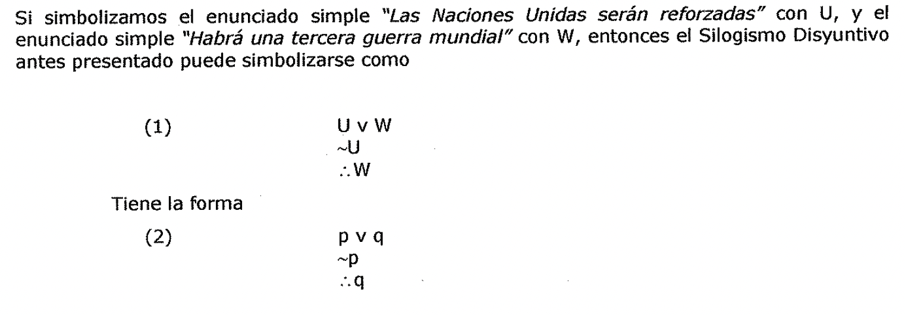

1. UvW

Tiene la forma

1. pvq

de la cuál resulta reemplazando las variables sentenciales p y q por los
enunciados U y W, respectivamente. Pero esa no es la única forma de la cuál es
una instancia de sustitución. El mismo argumento se obtiene reemplazando las
variables sentenciales p y q y r en la forma argumental por los enunciados U v
W, ~Uy W, respectivamente.

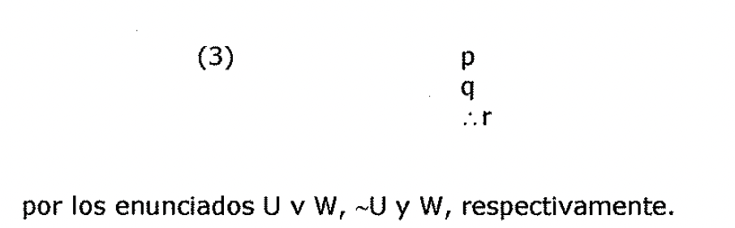

*Definimos la* ***forma especifica de un argumento*** *dado, como aquella forma
argumental de la cuál resulta el argumento* ***reemplazando cada variable
sentencial por un enunciado simple diferente.*** Así, la forma específica del
argumento (1) es la forma argumental (2). Aunque la forma argumental (3) es una
forma del argumento (1), no es la forma específica del mismo.

***La técnica de refutación por analogia lógica puede ahora describirse más
precisamente. Si la forma especifica de un argumento dado puede mostrarse que
tiene una instancia de sustitución con premisas verdaderas y conclusión falsa,
entonces el argumento dado es inválido.*** Los términos *''válido"* e
*"inválido"* pueden extenderse para aplicarse a *formas argumentales* tanto como
a argumentos. *Una forma argumental inválida* es *una que tiene cuando menos una
instancia de sustitución con premisas verdaderas y una conclusión falsa.* La
técnica de refutación por analogfa lógica presupone que todo argumento del cuál
la forma específica es una forma argumental inválida es un argumento inválido.
Toda forma argumental que no sea inválida es válida; *una forma argumental
válida* es *una que no tiene instancia de sustitución con premisas verdaderas y
conclusión falsa.* Cualquier argumento.dado puede probarse que es válido si se
puede mostrar que la forma específica del argumento dado es una forma argumental
válida.

***Para determinar.la validez* o *invalidez de una forma.argumental debemos
examinar todas las instancias de sustitución posibles de ella para ver si
algunas tienen premisas verdaderas y conclusiones falsas.*** Los argumentos de
los que aquf nos ocupamos solamente contienen enunciados simples y enunciados
función de verdad compuestos con aquellos, y solo nos interesan los valores de
verdad, de sus premisas y conclusiones. Podemos obtener todas las \_instancias
de sustitución posibles cuyas premisas y conclusiones tienen diferentes
variables sentenciales en la forma argumental que se prueba. Estas pueden
disponerse de la manera más conveniente en una tabla de verdad, con una columna
inicial o gufa para cada variable sentencia que aparece en la forma argumental.
Así, para probar la validez de la forma del Silogismo Disyuntivo pvq construimos

la siguiente tabla de verdad:

| --- | --- | --- | --- |

| **T** | **T** | **T** | **F** |

| **T** | F | **T** | **F** |

| **F** | **T** | **T** | **T** |

| **F** | **F** | **F** | **T** |

Cada renglón de esta tabla representa una clase completa de instancias de
sustituc.ioil..LasT y.

las F en las dos columnas iniciales representan los valores de verdad de
enunciados que pueden sustituirse por las variables p y q en la forma
argumental. Estos valores determinan los valores de verdad en las otras
columnas, la tercera de las cuales esta encabezada por la *primera "premisa"* de
la forma argumental y la cuarta por la *segunda "premisa".* El encabezado de la
segunda columna es la *conclusión* de la forma argumental. Un examen de esta
tabla de verdad revela que cualesquiera que sean los enunciados sustituidos por
las variables p y q, el argumento resultante no puede tener premisas verdaderas
y una conclusión falsa, pues el tercer renglón representa el t'.inico caso
posible en que ambas premisas son verdaderas y ah[ la conclusión también es
verdadera.

Como las ***tablas de verdad*** proporcionan un ***método puramente mecanico o
efectivo de*** ***decisión de la validez o invalidez de cualquier argumento***
del tipo general aquí! considerado, ahora podemos justificar nuestra propuesta
de simbolizar todos los enunciados condicionales por medio del conectivo de
función de verdad ":o". La justificacion para tratar todas las implicaciones
como si fueran meramente implicaciones materiales es que los argumentos válidos
que contienen enunciados condicionales siguen síendo válidos cuando estos
condicionales se interpretan como afirmando implicaciones materiales solamente.
Las tres más simples y más intuitivamente válidas formas de argumento que
involucran enunciados condicionales son

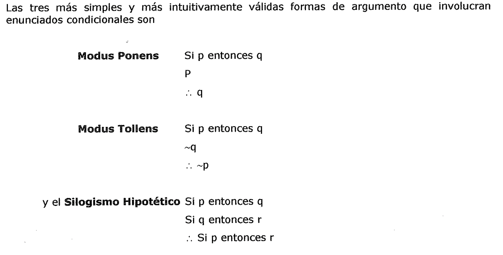

**Modus Ponens**

**Modus Tollens**

Si p entonces q

Si p entonces q

y el **Silogismo Hipotetico** Si p entonces q Si q entonces r

*:.* Si p entonces r El que sigan siendo válidos cuando sus condicionales se
interpretan como aseveraciones de implicaciones materiales, es un hecho que
fácilmente se establece por tablas de verdad. La validez de ***Modus Ponens***

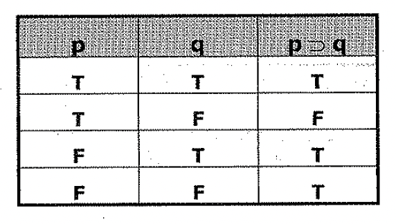
se muestra con la misma tabla de verdad que define el símbolo herradura:

| --- | --- | --- |

| **T** | **T** | **T** |

| **T** | **F** | **F** |

| **F** | **T** | **T** |

| **F** | **F** | **T** |

Aquí las dos premisas se representan por las columnas tercera y primera y la
conclusión por la segunda. Solo el primer.renglón representa instancias de
sustitución en las que ambas premisas son verdaderas, yen ese renglón la
conclusión también es verdadera.

La validez de ***Modus Tollens*** se muestra por medio de la.siguiente tabla:

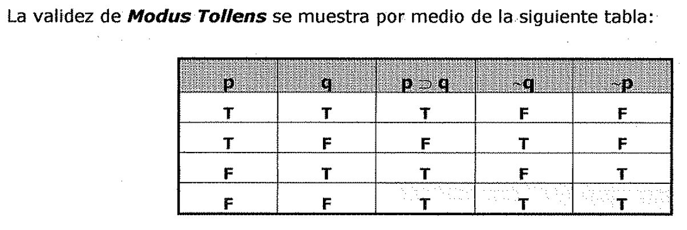

**T T F**

**T F T**

**T F T**

**F T F**

**F F T**

Aquí solamente el cuarto renglón representa instancias de sustitucion en las que
ambas premisas (las columnas tercera y cuarta) son verdaderas, y ah[ la
conclusión (quinta columna) también es verdadera.

Como el ***Silogismo Hipotetico*** contiene tres enunciados distintos para

variables sentenciales distintas, su tabla de verdad debe tener tres columnas
iniciales y requerira ocho renglónes para alistar todas las posibles instancias
de sustitucion:

| | | | | | |

| --- | --- | --- | --- | --- | --- |

| **T** | **T** | **T** | **T** | **T** | **T** |

| **T** | **T** | **F** | **T** | **F** | **F** |

| **T** | **F** | **T** | **F** | **T** | **T** |

| **T** | **F** | **F** | **F** | **T** | **F** |

| **F** | **T** | **T** | **T** | **T** | **T** |

| **F** | **T** | **F** | **T** | **F** | **T** |

| **F** | **F** | **T** | **T** | **T** | **T** |

| **F** | **F** | **F** | **T** | **T** | **T** |

Al construirla, las tres columnas iniciales representan todos los arreglos
posibles de valores de verdad para los enunciados sustituidos en lugar de las
variables sentenciales p, q y r, la cuarta columna se llena con referencia a la
primera y la segunda, la quinta con referencia a la segunda y la tercera, y la
sexta con referencia a la primera y la tercera. Las premisas son ambas
verdaderas solo en los renglónes primero, quinto, septimo y octavo, y en estos
renglónes la conclusión también es verdadera. Esto basta para mostrar que el
Silogismo Hipotetico es válido cuando sus condicionales se simbolizan mediante
el símbolo herradura. Todas las dudas que queden respecto a la afirmacion de que
los argumentos válidos que contienen condicionales siguen síendo válidos cuando
sus condicionales se intérpreten como afirmando meramente implicaciones
materiales puede aclararlas el lector al construir, simbolizar y probar sus
propios ejemplos mediante tablas de verdad.

Para probar la validez de una forma argumental mediante una tabla de verdad, es
necesaria una tabla con una columna inicial o gu[a separada para cada variable
sentencial diferente y un renglón separado para cada posible asígnacion de
valores de verdad a las variables sentenciales involucradas. As[ pues, probar
una forma argumental que contiene **n** variables sentenciales distintas
requiere una tabla de verdad con **2"** renglónes. Al construir tablas de verdad
es conveniente fijar un patron uniforme de inscripcion de las **Ty** las **F**
en sus columnas iniciales o gu[a. En este libro nos apegaremos a la practica de
ir simplemente alternando las **T** y las **F** hacia abajo en la columna
inicial extrema derecha, alternando pares de **T** con pares de **F** hacia
abajo en la columna directamente a su izquierda, despues alternando grupos de
cuatro **T** con grupos de cuatro **F,**..., y al llegar a la columna extrema
izquierda ponemos **T** en todas su mitad superior y Fen toda su mitad inferior.

Hay dos formas de argumento inválidas que tienen un parecido superficial con las

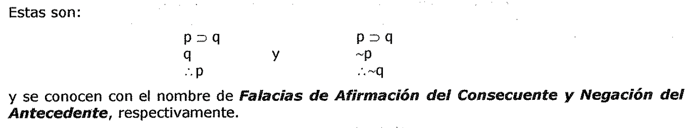
formas válidas Modus Ponens y Modus Tollens.

Estas son:

y se conocen con el nombre de ***Falacias de Afirmación del Consecuente y
Negación del*** La invalidez de ambas puede mostrarse en una misma tabla de

verdad:

Las dos premisas en la Falacia de Afirmacion del Consecuente encabezan las
columnas segunda y tercera, y son verdaderas en el primer y en el tercer
renglón. Pero la conclusión, que encabeza la primera columna, es falsa en el
tercer renglón, lo que muestra que la forma de argumentar tiene una instancia de
sustitucion con premisas verdaderas y conclusión falsa y, por lo tanto, es
inválida. Las columnas tres y cuatro son las encabezadas por las premisas en la
Falacia de Negacion del Antecedente, que son verdaderas en los renglónes tercero
y cuarto.

Su conclusión encabeza la columna cinco y es falsa en el tercer renglón, lo que
muestra que la segunda forma argumental también es inválida.

Hay que recalcar que aunque una forma de argumento válida tiene solo argumentos
válidos come instancias de sustitucion, una forma de argumento inválida puede
tener instancias de sustitucion válidas tanto come inválidas. Así que para
demostrar que un argumento dado es inválido hay que demostrar que la forma
específica de ese argumento es inválida.

1. 2. 2.4. Formas Sentenciales

La introducción de variables sentenciales en la sección precedente nos permitio
delinir las formas argumentales en general y la forma específica de un argumento
dado.

Ahora delinimos una ***forma sentencial*** como ***cualquier sucesión de
símbolos*** ***conteniendo variables sentenciales,*** de modo que al sustituir
enunciados por las variables sentenciales • - reemplazando la misma variable
sentencial por el mismo enunciado en toda la secuencia - el resultado es un
enunciado.

Otra vez, para precisar, convendremos en que en cualquier forma sentencial "p"
será la primera variable sentencial que aparece, "q" será la segunda en ocurrir,
"r" la tercera y así sucesivamente. Todo enunciado que resulta de la sustitucion
de las variables sentenciales por entlnciados en uria forma sentencial, se dira
que tiene esa forma o que es una instancia de sustitucion de ella. • *Así como
distinguimos la form<! especifica de un argumento dado, así también
distinguiremos* *la forma especifica de un enunciado dado como la forma
sentencial de la que resulta el* *eriunciado poniendo en el lugar de cada
variable sentencial un enunciado simple diferente.* Así, por ejemplo, si A, B y
C son enunciados simples diferentes, **el enunciado compuesto A** ::i **(BvC)**
es una instancia de sustitucion de la ***forma sentencial* p**::i **q** y
también de. la ***forma*** ***sentencial* p**::i **(qvr),** pero solo esta
última es la ***forma especifica del.enunciado*** dado. (\ Aunque los enunciados
*"Balboa.descubrió el Océano Pacífico" (B)* y *"Balboa descubrió el* *Océano
Pacífico* o *no lo descubrió" (B v ~B)* ambos son verdaderos, descubrimos su

verdad de maneras enteramente diferentes. La verdad de B es cuestión histórica y
se aprende,por medio de la investigación empirica. Aun más, podrían haber
ocurrido cosas que hicieran a B falso; nada necesario hay respecto a la verdad
de B. Pero la verdad del enunciado B v ~B puede saberse independientemente de
toda investigación empirica y ningún suceso puede hacerlo falso porque es una
verdad necesaria.

El enunciado ***B v ~B*** es una ***verdad formal,*** una instancia de
sustitución de una forma sentencial cuyas instancias de sustitución todas son
verdaderas.

***Una forma sentencial que solo tiene instancias de sustitución verdaderas*
se**

***dice tautológica, o que* es *una tautología.***

La forma especffica de ***B v ~B* es *p v*** ~,, y se prueba que es tautológica
mediante la siguiente tabla de verdad:

| --- | --- | --- |

| **T** | **F** | **T** |

| **F** | **T** | **T** |

En la columna que encabeza la forma sentencial de que se trata solo hay valores
**T,** luego ***todas sus instancias de sustitución son verdaderas.*** Cualquier
enunciado que es una 1 instancia de sustitución de una forma sentencial
tautológica es formalmente verdadero y también se le llama tautológico, o una
tautologfa.

Similarmente, aunqut'! los enunciados *"Cortes descubrió el Pacífico" (CJ y
"Cortes descubrió el* *Pacífico y Cortes no descubrió el Pacífico" (C*. *.CJ*
ambos son falsos, descubrimos su falsedad de dos maneras enteramente diferentes.

***Un enunciado,* se *dice que contradice, o que* es *una contradicción de otro
enunciado, cuando* es *lógicamente imposible que ambos sean verdaderos.*** En
este sentido la contradicción es una relación entre enunciados. Pero hay otro
sentido, relacionado del mismo término.

Cuando es lógicamente imposible que un enunciado particular sea verdadero, ese
enunciado mismo es llamado autocontradictorio o una autocontradicción. Mas
simplemente, se dice que tales enunciados son contradictorios o contradicciones,
y esta es la términologfa que aquí usaremos.

***Una forma sentencial que solo tiene instancias de sustitución falsas* se
*dice que* es *una contradicción o que* es *contradictoria, y los mismos
términos* se *aplican a sus. instancias de sustitución.*** La ***forma
sentencial p***. ~,, se prueba que es una ***contradicción*** por el hecho de
que en su tabla de verdad solo hay valores **F** en la columna que encabeza.

***Enunciados y formas sentenciales que no son ni tautológicas ni
contradictorias***

**se *dice que son contingentes o que son contingencias.***

Por ejemplo, p, ~P, p v q, p.q, p::o q son formas sentenciales contingentes; y
B, C, ~B, B.C, BvC, son enunciados contingentes. El término es apropiado, pues
sus valores de verdad no están formalmente determinados, sino que *son
dependientes* o *contingentes de la situaCión.* Facilmente se demuestra que p::o
q::o p) y ~P::o (p::o q) son tautologías. Al expresarlas en leriguaje ordinario
como "Un enunciado verdadero es implicado por: cualquier enunciado'' y como "Un
enunciado falso implica cualquier enunciado" parecen bastante •extranas.
Algllncis escritores las han llamado las paradojas de la implicación material.
Pero si se tiene presente que el símbolo herradura es un conectivo función de
verdad que representa la implicación material y no la "implicación en general" o
clases más usuales como son la implicación lógica o la implicación causal,
entonces dichas formas sentenciales tautológicas no son sorprendentes en lo
absoluto. Y al corregir esas engafiosas fórmulaciones del castellano insertando
la palabra ' "materialmente" antes de "implicado" *e* "implica", entonces
desaparece el aire paradójico. La implicación material es una noción técnica y
la motivación del lógico al introducirla y usarla es la enorme simplificación
que resulta en su tarea de discriminar entre los argumentos válidos y los
inválidos. • ***Dos enunciados* se *dicen materialmente equivalentes cuando
tienen el mismo*** ***valor de verdad, y simbolizamos el enunciado de que son
materialmente*** ***equivalentes insertando el símbolo*** "=''***entre ellos.***
• Tratandose de un conectivo función de verdad, el símbolo tres barras se deline

con la siguiente tabla de verdad:

| --- | --- |

| **T** | **T** |

| **T** | **F** |

| **F** | T |

| **F** | **F** |

Decir que dos enunciados son materialmente equivalentes es decir que
materialmente el uno implica el otro, como es fácil de verificar con una tabla
de verdad. Así, el símbolo de las tres barras puede leerse *"es materialmente
equivalente con"* o *"si y solo si".* Un enunciado de la forma p = q se llama
bicondicional. Dos enunciados se dicen lógicamente equivalentes cuando el
bicondicional que expresa su equivalencia material es una tautología. El
"principio de la Doble Negación", expresado como p = ~~P, con una tabla de
verdad se demuestra que es tautológico.

Hay dos equivalencias lógicas que expresan importantes interrelaciones de las
conjunciones, disyunciones y negaciones. Como una conjunción afirma que sus dos
conyuntos son verdaderos, su negación solo necesita afirmar que uno de los dos
conyuntos es falso. Luego, negar la conjunción p.q equivale a afirmar la
disyunción de las negaciones de p y q. Este enunciado de equivalencia se
simboliza como **~(p.q)** = **(~p v ~Q)** y se demuestra que es una

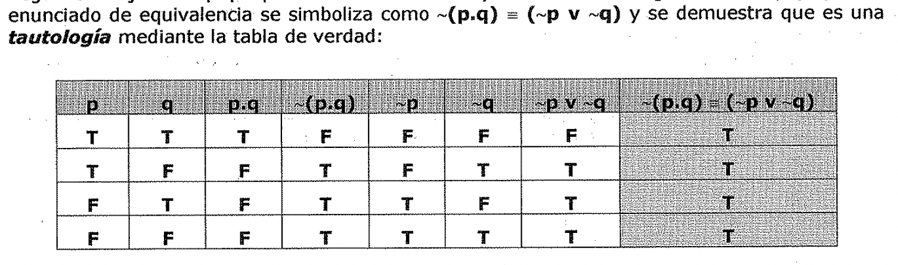
***tautología*** mediante la tabla de verdad:

| | | | | | | | |

| --- | --- | --- | --- | --- | --- | --- | --- |

| **T** | **T** | **T** | **F** | **F** | **F** | | |

| **T** | **F** | **F** | **T** | **f** | **T** | **T** | |

| **F** | **T** | **F** | **T** | **T** | **F** | **T** | |

| **F** | **F** | **F** | **T** | **T** | **T** | **T** | |

De manera semejante, como una disyunción meramente afirma que al menos un
disyunto es verdadero, negarla es afirmar que ambos son falsos. Negar la
disyunción pvq equivale a afirmar la conjunción de las negaciones de p y q. Se
simboliza como **~(P v q)** = **(~P**. **~Q),** y con una tabla de verdad
fácilmente se prueba que es una ***tautología.*** Estas dos equivalencias se
conocen como ***Teoremas de De Morgan,*** por el lógico matemático ingles
Augustus De Morgan (1809-1871), y en lenguaje ordinario pueden enunciarse de
manera conjunción}.

compendiada como: La negación de la { disyunción de dos enunciados. disyuncion
es lógicamente equivalente a la { conjuncion} de sus riegaciones.

*Dos formas sentenciales se dicen lógicamente equivalentes si, no importando
qui§ enunciados se sustituyan par sus variables sentenciales* - *poniendo el
mismo enunciado en lugar de la misma variable sentencial en ambas formas
sentenciales* -, *las pares resultantes de enunciados son equivalentes.* As[, el
Teorema de De Morgan afirma que ~(p v q) y ~P. ~Q son formas sentenciales
lógicamente equivalentes. Por el Teorema de De Morgan y el principio de la Doble
Negacion *:*, ~(p. q) y ~P v ~q son lógicamente equivalentes, luego cualquiera
puede tomarse como definición de p:o q; la segunda es la eleccion más usual.

***A todo argumento corresponde un enunciado condicional cuyo antecedente* es
*la conjunción de las premisas del argumento y cuyo consecuente* es *la
conclusión del argumento.*** ***Ese condicional correspondiente* es *una
tautología si y solo si el argumento* es *válido.*** As[ la forma argumental
válida

pvq corresponde la forma sentencial tautológica [(p v q). ~p]:o q; y a la forma
argumental inválida corresponde la forma sentencial no tautológica [(p:o q).
q]:o p.

\ Una forma argumental es válida si y solo si su tabla de verdad tiene el valor

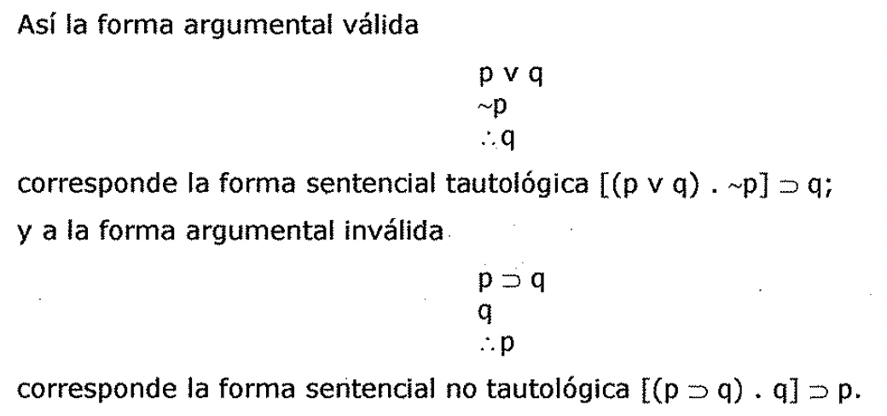
**T** bajo su conclusión en cada renglón en que haya el valor **T** bajo todas
sus premisas. Como. puede aparecer una **F** en la columna encabezada por el
condicional correspondiente solo donde haya **T** bajo todas las premisas y
**F** bajo la conclusión, es claro que solo puede haber el valor **T** bajo un
condicional que corresponde a una forma argumental válida. Si un argumento es
válido, el enunciado de que la conjuncion de sus premisas implica su conclusión
es una tautolog[a.

Una versión alternativa de la prueba de la tabla de verdad de una forma

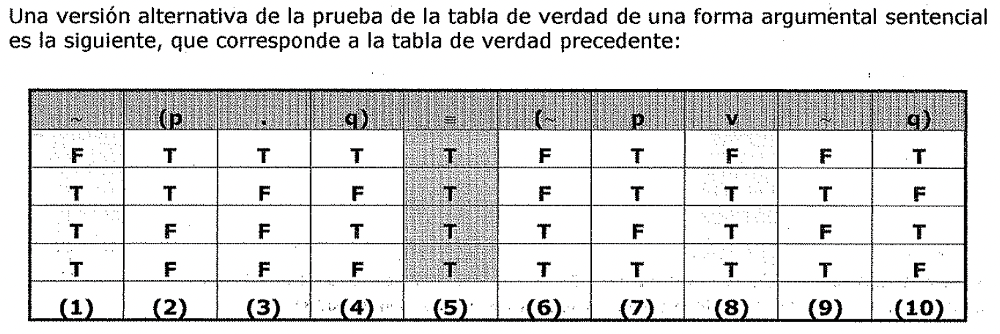
argumental sentencial es la siguiente, que corresponde a la tabla de verdad
precedente:

| --- | --- | --- | --- | --- |

| **F** | **T** | **T** | **T** | |

| **T** | **T** | **F** | **F** | |

| **T** | **F** | **F** | **T** | |

| **T** | **F** | **F** | **F** | |

| **1** | **2** | **3** | | |

| | | | | | |

| --- | --- | --- | --- | --- | --- |

| **F** | | **T** | **F** | **F** | **T** |

| **F** | | **T** | **T** | **T** | **F** |

| **T** | | **F** | **T** | **F** | **T** |

| | | | | | **F** |

| **T T** | | |

| | | **7 9** | | | **10** |

Aquí las columnas (2), (4), (7), (10) son las columnas iniciales o gu[a. La
columna (3) se llena con referencia a las columnas (2) y (4) y la columna (1) con
referencia a la columna (3). La columna (6) se llena con referencia a la columna
(7), la columna (9) se llena con referencia a la columna (10) y entonces la
columna (8) con referencia a las columnas (6) y (9). Finalmente, la columna (5)
se llena con referencia a las columnas (1) y (8). El hecho de que su conectivo
principal tenga solo valores **T** en su columna de la tabla de verdad,
establece que ***la forma sentencial probada* es *una tautología.***

| --- | --- | --- |

| ***34*** | | |

| 3.2.3. El Metodo de Deducdon | | |

## Prueba formal de validez

| 3.2.3.1. Prueba Formal de Validez Cuando los argumentos contienen *más de dos a tres enunciados simples diferentes* como componentes, se hace *difícil y tedioso utilizar tablas de verdad para probar su validez.* | E | |

| Un método más conveniente de establecer la validez de algunos argumentos es deducir las conclusiones de sus premisas por una secuencia de argumentos más cortos y más elementales que ya se conoce que son válidos. Considerese, por ejemplo, el siguiente argumento en el que aparecen enunciados simples diferentes: | C: | |

| * el procurador general ha impuesto una censura estricta o· si Black envio la carta que escribio, entonces Davis recibio un aviso. | | |

| * Si nuestras Hneas de comúnicacion no se han interrumpido por completo, entonces si Davis recibio un aviso, entonces Emory fue informado del asunto. * Si el procurador general ha impuesto una censura estricta, entonces nuestras Hneas de comúnicacion se han interrumpido por completo. | | |

| * Nuestras líneas de comúnicacion no se han interrumpido par complete. | | |

| * Por tanto, si Black envio la carta que escribio, entonces Emory fue informado del asunto. | | |

| Se puede traducir en nuestro simbolismo coma | | |

| Av (B::, D) ~C::o (D::o E) | | |

| A::, C ~C:.B::oE | | |

| Establecer la validez de este argumento por medio de una tabla de verdad requeriria una tabla | *(:.* | |

| de treinta y dos renglónes. Pero podemos probar el argumento dado como válido deduciendo su conclusión de sus premisas por una secuencia de solamente cuatro argumentos cuya validez se ha señalado ya. * De la tercera y cuarta premisas, A::o C y ~C, válidamente inferimos ~A por Modus Tollens. | ( | |

| * De ~A y la primera premisa Av (B::o D), válidamente inferimos B::o D, por un Silogismo | | |

| Disyuntivo. | | |

| * De la segunda y cuarta premisas, ~C::o (D::o E) y ~C, válidamente se infiere D.::, E por • | | |

| Modus Ponens. | | |

| * **Y** finalmente, de estas dos últimas conclusiones (o subconclusiones), B::o D y D::o E, válidamente inferimos B::o E por un Silogismo Hipotetico. ***Que su conclusión* se *deduce de sus premisas usando argumentos válidos exclusivamente, prueba que el argumento original* es *válido.*** Aquí las formas argumentales viilidas elementales Modus Ponens (M.P.), Modus Tollens (M.T.), el Silogismo Disyuntivo (D.S.), y el Silogismo Hipotetico (H.S.) se usan como Reglas de | ( | |

| Inferencia par media de las cuales se deducen viilidamente las conclusiones a partir de las premisas. Una manera más formal y más concisa de escribir esta prueba de validez es hacer una lista de las premisas y de los enunciados deducidos de ellas en una columna, con las *"justificaciones"* para estos últimas escritas a un lado de los mismos. En cada caso, la *"justificación"* para un enunciado especifica los enunciados precedentes a partir de los cuales, y la regla de inferencia por medio de la cuál, el enunciado en cuestión fue deducido. Es conveniente poner la conclusión a la derecha de la última premisa, separada de la misma por una linea diagonal que | C | |

| automiiticamente señala que todos los enunciados que están por arriba de la misma son premisas. | | |

La prueba formal de validez para el argumento dado puede escribirse como

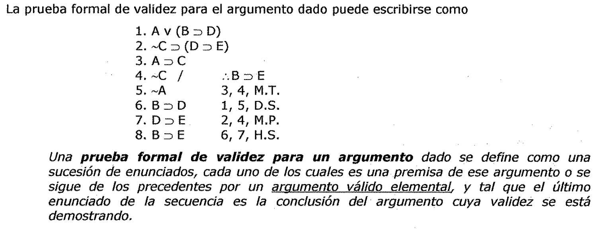

1. A v (B:::, D)

2. ~C:::, (D:::, E)

3. A:::iC

:.B:::, E 3, 4, M.T.

*Una* ***prueba formal de validez para un argumento*** *dado* se *deline coma
una sucesión de enunciados, cada uno de las cuales* es *una premisa de ese
argumento o* se *sigue de los precedentes por un argumento válido elemental, y
tal que el último enunciado de la secuencia* es *la conclusión del argumento
cuya validez* se *está demostrando.* Esta definición debe completarse y hacerse
más precisa especificando que es lo que va a contar como *"argumento válido
elemental".* Primera delinimos un argumento válido elemental como cualquier
argumento que es una instancia de sustitución de una forma de argumento válida,
y despues presentamos una lista de solo nueve formas de argumento
suficientemente obvias para ser vistas como ***formas de argumento válidas
elementales*** y aceptadas como

***Reglas de Inferencia.***

Una cuestión que hay que recalcar es que cualquier instancia de sustitución de

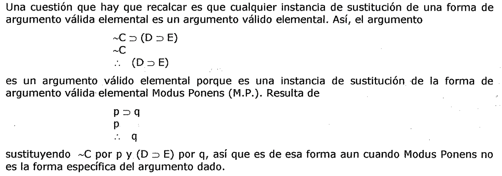
una forma de argumento válida elemental es un argumento válido elemental. Así,
el argumento

~C:::, (D:::, E)

*:.* (D:::, E)

es un argumento válido elemental porque es una instancia de sustitución de la
forma de argumento válida elemental Modus Ponens (M.P.). Resulta de sustituyendo
~C por p y (D:::, E) por q, así que es de esa forma aún cuando Modus Ponens no
es la forma especifica del argumento dado.

***Iniciamos*** nuestro desarrollo del ***método de deducción*** presentando una
lista de solo nueve formas de argumento válidas elementales que pueden usarse al
construir pruebas formales de validez:

**REGLAS DE INFERENCIA**

1. Modus Ponens (M.P.) p:::,q

1. Modus Tollens (M.T.) p:::, q

6, Dilema Destructivo (D.D.) (p:::, q). (r:::, s)

~q V ~S

:.~p V ~r

7. Simplificación (Simp.) p.q

| --- | --- | --- |

| | | ***36*** |

| 3. Silogismo Hipotetico (H.S.) | 8. Conjunción (Conj.) | |

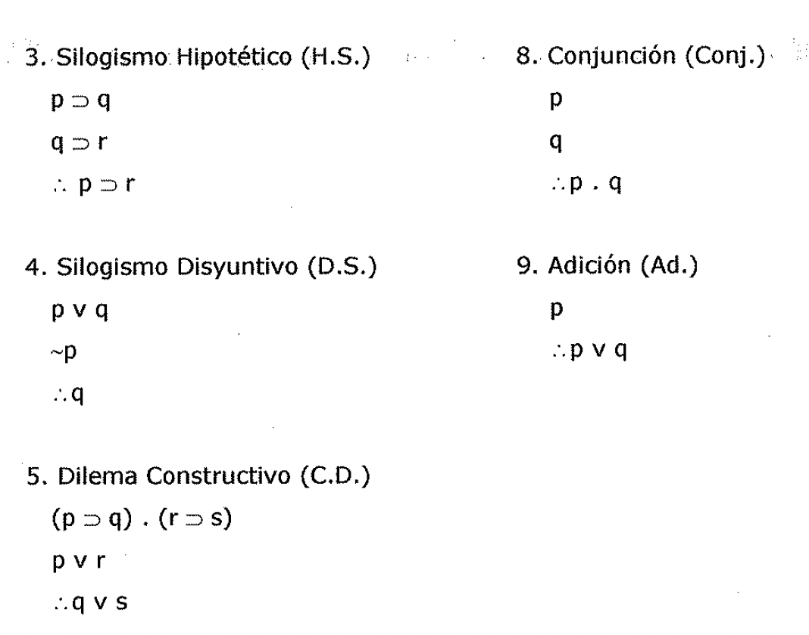

| p::::, q | p | (- |

| q::::, r | q | |

| *:.* P::::i r |.. p. q | C |

1. Silogismo Disyuntivo (D.S.) pvq

p V r :.q VS

1. Adición (Ad.)

:.p V q *Estas nueve reglas de inferencia son* ***formas válidas elementales de
argumentos*** *cuya validez fácilmente se establece mediante tablas de verdad.*
Pueden usarse para construir pruebas formales de validez para una amplia clase
de argumentos más complicados. Los nombres de la lista son estándar en su mayor
parte, y el uso de sus abreviaciones permite presentar las pruebas formales con
un mínimo de escritura.

## Reglas de inferencia y reemplazo

3.2.3.2. La Regla de Reemplazo

Hay muchos argumentos válidos de función de verdad cuya validez no se puede
probar usando solamente las nueve Reglas de Inferencia dadas hasta aquf. Por
ejemplo, una prueba formal de validez del argumento obviamente válido requiere

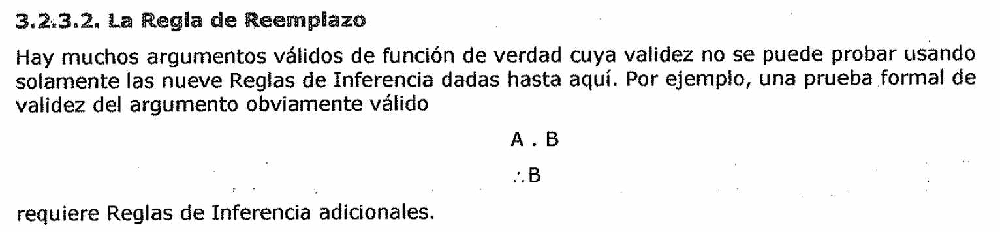
Reglas de Inferencia adicionales.

Ahora bien, los únicos enunciados compuestos que nos interesan aquf son los
enunciados compuestos función de verdad. Luego, si se reemplaza una parte
cualquiera de un enunciado compuesto por una expresión que es lógicamente
equivalente a la parte reemplazada, el valor de verdad del enunciado que resulta
es el mismo que el del enunciado original. A esto se le llama, algunas veces la
***Regla de Reemplazo,*** y otras, la del Principio de Extensionalidad.

Adoptamos la ***Regla de Reemplazo*** como un ***principio adicional de
inferencia.*** Nos permite inferir de cualquier enunciado el resultado de
reemplazar todo o parte de ese enunciado por otro enunciado lógicamente
equivalente a la parte reemplazada. Así, usando el principio de la Doble
Negación (D.N.), que afirma la equivalencia lógica de p y ~~P, podemos inferir,
de A::::i ~~ B cualquiera de los enunciados, por la Regla de Reemplazo.

Para hacer más definida esta regla, damos ahora una lista de equivalencias

lógicas con las que puede usarse. Estas equivalencias constituyen ***nuevas
Reglas de Inferencia*** que es posible usar para probar la validez de
argumentos. Las numeramos consecutivamente despues de las nueve reglas ya
enunciadas.

***Regla de Reemplazo:*** Cualquiera de las siguientes expresiónes lógicamente
equivalentes puede reemplazar a la otra en donde ocurran:

1. Teoremas de De Morgan (De M.):

2. Conmutación (Conm.):

3. Asociación (Asoc.):

4. Distribución (Dist.):

5. Doble Negación (D.N.):

6. Transposición (Trans.):

7. Implicación Material (Imp!.):

8. Equivalencia Material (Equiv.):

9. Exportación (Exp.):

19. Tautologfa (Taut.):

~(p, q) = (~P V ~Q)

~(p V q) = (~p. ~Q)

p V Q) = (q V p)

p. q) = q. p)

[p. (qv r)J = [(p. q) v (p. r)]

[p V (q. r)] = [(p V q). (p V r)] p = ~~P

p:::, q)es (~q:::,~p)

p:::, q) = ~P V q)

p = q) = [(p:::, q). (q:::, p)J

p = (p V p) p = (p. p) Ahora puede escribirse una prueba formal de validez para

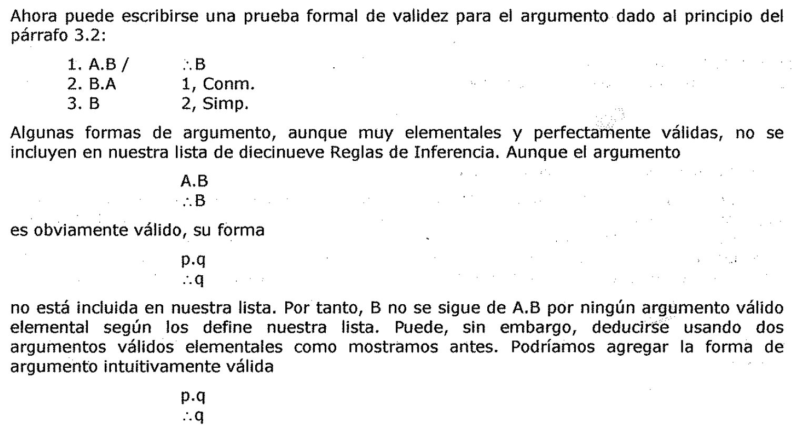
el argumento dado al principio del párrafo 3.2:

1, Conm.

2, Simp.

Algunas formas de argumento, aunque muy elementales y perfectamente viilidas, no
se incluyen en nuestra lista de diecinueve Reglas de Inferencia. Aunque el
argumento es obviamente viilido, su forma no estii incluida en nuestra lista.
Por tanto, B no se sigue de A.B por ningún argumento válido elemental según los
deline nuestra lista. Puede, sin embargo, deducirse usando dos argumentos
válidos elementales como mostramos antes. Podrfamos agregar la forma de
argumento intuitivamente válida a nuestra lista, claro esta; pero si
agrandarámos nuestra lista de esta manera llegar[amos a tener una lista
demasíado larga y, por tanto, n\_o manejable.

La lista de las Reglas de Inferencia contiene númerosas redundancias.. Por
ejemplo, Modus Tollens podría salir de la lista sin realinente debilitar la
maquínaria, pues todo paso deducido usandola puede serlo usando otras Reglas de
la lista. Pero Modus Tollens es un principio de inferencia tan común e intuitivo
que se le ha incluido, y otros han sido incluidos por conveniencia también, a
pesar de su redundancia lógica.

***La prueba de que una sucesión dada de enunciados es una demostración formal,
es***

***efectiva.*** - Es decir, por observación directa se podra deducir si cada
renglón siguiente a las premisas se sigue o no de los renglónes que le preceden
mediante alguna de las Reglas de Inferencia dadas. No es necesario "pensar": ni
pensar sobre la validez de la deducción de cada renglón.

Aun en donde falte la "justificación" de un enunciado, a un lado del mismo, hay
un \, procedimiento finito, mecanico, para decidir si la deducción es legftima.
Cada renglón viene precedido por solamente un número finito de renglónes y solo
se han adoptado un número finito de Reglas de Inferencia. Aunque toma tiempo,
puede verificarse por inspección si el renglón en cuestión se sigue de algún
renglón, o par de renglónes precedentes mediante alguna Regla de Inferencia de
nuestra lista.

***Hay una diferencia importante entre las primeras nueve y las últimas diez
Reglas de***

***Inferencia.***

* *Las primeras nueve pueden aplicarse a renglónes enteros de una demostración.*

De modo A puede inferirse de A.B por simplificación solo si A.B constituye un
renglón completo. Pero ni A ni A::::o C se siguen de (A.B)::::, C por
simplificación o cualquier otra Regla de Inferencia. A no es consecuencia porque
A puede ser falso y (A.B)::::, verdadero. A::::o C no es consecuencia porque si
A es verdadero y B y C ambos son falsos, A.B)::::, C es verdadero mientras que
A::::, C es falso.

* *Por otro lado, cualquiera de las diez últimas Reglas de Inferencia puede
 aplicarse a*

*renglónes enteros o partes de renglónes.* No solo puede inferirse el enunciado
A::::o (B::::o C) del renglón entero (A.B)::::o C por Exportación, sino del
renglón [(A.B)::::o CJ v D podemos inferir [(A::::o B)::::o CJ v D por
Exportación. La Regla!]e Reemplazo autoriza que expresiónes lógicamente
equivalentes especificadas se reemplacen entre sí donde ocurran aún en donde no
constituyan renglónes enteros de una demostración.

Pero las nueve primeras Reglas de Inferencia solo pueden usarse tomando como
premisas renglónes enteros de una demostración.

En ausencia de reglas mecánicas para la construcción de demostraciones formales
de validez, pueden darse algunas sugerencias y métodos prácticos.

* La primera es simplemente *empezar deduciendo conclusiones de. las premisas
 mediante*

*las Reglas de Inferencia dadas.* Al tener más y más subconclusiones de estas
como premisas para nuevas deducciónes, mayor es la probabilidad de que se vea
como deducir la conclusión del argumento que se quiere demostrar que es válido.

* Otra sugerencia es *tratar de eliminar enunciados qué ocurren en las premisas,
 pero no*

*en la conclusión.* Esta eliminación puede llevarse a cabo solamente de acuerdo
con las Reglas de Inferencia. Pero las Reglas contienen muchas técnicas para
eliminar enunciados. La simplificación es una de ellas: con esta, el conyunto
derecho de una conjunción puede simplemente quitarse, a condición de que la
conjunción sea un renglón entero en la demostración. Y por Conmutación puede
hacerse derecho al enunciado conyunto izquierdo de una conjunción para
eliminarlo por Simplificación. El término "medio" q puede eliminarse por un
Silogismo Hipotetico dadas dos premisas o subconclusiones de los patrones
p::::oq y q::::o r. La distribución es una regla útil para transíormar una
disyunción de la forma p v (q.r) en la conjunción (p v q).(p v r) cuyo conjunto
de la derecha p v r puede entonces eliminarse por Simplificación.

* Otro método practico es *introducir por Adición un enunciado qué ocurre en la
 conclusión,*

pero no en las premisas.

* Otro método es el de *proceder hacia atrás desde la conclusión* buscando algún
 enunciado o· par de enunciados de los cuales se le pudiera deducir mediante
 algunas de

las Reglas de Inferencia, y entonces tratar de deducir esos enunciados
intermedios, y así sucesivamente, hasta llegar a algunos que sean deducibles de
las premisas.

## Demostracion de invalidez

3.2.3.3. Demostracion de la Invaiidez

**No Completud de las Diecinueve Reglas**

Las diecinueve Reglas de Inferencia presentadas hasta el momento son
incompletas, lo que quiere decir que hay argumentos válidos función de verdad
cuya validez no es demostrable usando tan solo esas diecinueve Reglas.

**La Regla de Demostracion Condicional**

*A continuación* ***introducimos una nueva regla para usarla en el método de
deducción:*** *la regla de Demostración Condicional.* En esta sección la nueva

regla se aplicará tan solo a argumentos cuyas conclusiones son enunciados
condicionales.

* *A todo argumento le corresponde un enunciado condicional cuyo antecedente es
 la conjunción de las premisas del argumento y cuyo consecuente es
 la.conclusión del argumento.*

* *Como se ha senalado, un argumento es válido si y solo si su correspondiente
 condicional es una tautologfa.*

Si un argumento tiene un enunciado condicional como conclusión, que podemos
simbolizar A:::, C, entonces si simbolizamos la conjuncion de sus premisas como
P, el argumento es válido si y solo si el condicional

1. P:::, (A:::, C)

es una tautología.

Si podemos deducir la conclusión A:::, C de las premisas conjuntas en P por una
secuencia de argumentos válidos elementales, habremos así demostrado la validez
del argumento y que el condicional asociado (1) es una tautología. Por el
principio de Exportacion, (1) es lógicamente equivalente a Pero (2) es el
condicional asociado con un argumento un tanto diferente. Este segundo argumento
tiene como premisas todas las premisas del primer argumento, además de una
premisa adicional que es el antecedente de la conclusión del primer argumento. Y
la conclusión del segundo argumento es el consecuente de la conclusión del
primer argumento.

Ahora bien, si deducimos la conclusión del segundo argumento, C, de las premisas
conjuntas en P.A por una sucesion de argumentos válidos elementales, habremos
demostrado que su enunciado condicional asociado (2) es una tautología. Pero
como (1) y (2) son lógicamente equivalentes esto demuestra que (1) es una
tautología también, de donde se sigue que el argumento original con una premisa
menos y la conclusión condicional A:::, C también es válido. Ahora la regla de
Demostracion Condicional nos permite inferir la validez de cualquier argumento
de una demostración formal de validez para el argumento Así, una demostración
condicional de validez para el argumento

| | | | | | |

| --- | --- | --- | --- | --- | --- |

| | | | | | |

| ***40*** | | | | | |

| (Av B):::, (C.D) (D v E):::, F *:.* A:::i F | | | - | | |

| puede escribirse como 1. (Av B):::i (C.D) | | | | | |

| 2. (D v E):::, F | / *:.* | | A:::i F | | |

| 1. **A** 2. Av B 3. C.D | / | *:.* | **F (C.P.)** 3, Ad. 1, 4, M.P. | | |

| 6. D.C | 5, Conm. | | | | |

| 7.D 8. D v E 9. F | 6, Simpl. 7, Ad. 2, 8, M.P. | | |. | |

Aquí la diagonal de separacion, así como el símbolo *"por lo tanto"* de los tres
puntos, y el **"C.P."**, indican que se esta usando la regla de la Demostracion
Condicional.

**La Regla de Demostración Indirecta**

El método de ***Demostración Indirecta,*** a menudo llamado método de

***Demostración por*** ***Reducción al absurdo,*** es familiar para todos los
que hayan estudiado la geometría elemental. Al deducir sus teoremas, Euclides
suele empezar suponiendo lo opuesto de lo que se propone demostrar.

*Si este supuesto conduce a una contradicción o "se reduce a un absurdo"
entonces el supuesto* *debe ser falso, y su negación* - *el teorema que se desea
demostrar* - *debe ser verdadero.* Una demostración indirecta de validez para un
argumento dado se construye suponiendo, *c:* como premisa adicional, la negacion
de su conclusión y deduciendo entonces una contradicción explicita del conjunto
aumentado de las premisas. Así, una demostración indirecta de validez para el
argumento

A:::i (B.C)

B v D):::, E

DvA

puede escribirse como a continuación

* 1. A:::i (B.C)

2. (B v D):::, E

3. D v A

1. ~(B v D)

**IP (Demostración Indirecta)**

5, De M.

6, Conm.

7, Simpl.

10, Simpl.

6, Simpl.

11,12, Conj.

El. renglón 13 es una ***contradicción*** explicita, luego, ***/a demostración
es completa,*** pues la validez del argumento original se sigue por la regla de
Demostracion Indirecta.

## Logica de predicados

* 1. Lógica de Predicados

1. Introducción y concepto de Semidecidible

*El aspecto más atractivo del formalismo lógico es que proporciona de manera
inmediata un método muy potente para la obtención de nuevo conocimiento a partir
del antiguo:* ***la deducción matemática.*** *En este formalismo se puede
concfuir la verdad de un aserto sin otra cosa que demostrar que es consecuencia
de lo ya conocido.* De esta manera la idea de prueba, según se entiende en
matemáticas como un método riguroso de demostración de una proposición que se
cree cierta, se puede extender a la *deducción* como un medio de obtener
respuestas a preguntas y soluciones a problemas.

Uno de los primeros dominios donde se aplico la IA fue la demostración
automática de teoremas, que tenia como objetivo la demostración de proposiciones
en distintas áreas de la matemática. Por ejemplo, el Logic Theorist (Newell et
al., 1963) demostraba teoremas del primer capítulo de los Principia Matematica
de Whitehead **y** Russell (1950). Otro demostrador de teoremas (Gelernter et
al., 1963) trabaja sobre teoremas de geometría. La demostración de teoremas
matemáticos sigue siendo un área de investigacion activa en IA. Pero, la
utilidad de las técnicas matemáticas se ha extendido más allá del ámbito
tradicional de las matemáticas. La matemática no resulta muy diferente de
cualquier otra labor intelectual compleja en lo que se refiere a la necesidad de
mecanismos de deducción fiables y de una gran cantidad de conocimiento
heurístico para el control de lo que, de otra forma, sería un problema de
búsqueda intratable.

*Una de las razones más importantes para utilizar el formalismo lógico es que si
se representa el conocimiento como sentencias lógicas, entonces* se *dispone de
un buen mecanismo para razonar con ese conocimiento.* Determinar la validez de
una proposición en lógica proposicional es algo inmediato, aunque pueda ser
computacionalmente costoso.

Por lo tanto, antes de adoptar la **lógica de predicados** como un medio
apropiado para la representación del conocimiento, sería bueno preguntarse *si
también ofrece un mecanismo*

1. *adecuado para razonar con ese conocimiento.*

A primera vista la respuesta parece afirmativa. *Es posible deducir nuevas
sentencias a partir de las antiguas. Sin embargo, y por desgracia, no se dispone
de un procedimiento de decisión,* ni siquiera de uno exponencial. Existen
procedimientos que permitirán encontrar la prueba de un teorema dado si es que
en realidad se trata de un teorema. Pero no está garantizado que estos
procedimientos paren cuando la sentencia no sea un teorema. • • En otras
palabras, *aunque* ***la lógica de predicados*** *de primer orden no es
decidible, sí* **es *semidecidible.*** Un procedimiento muy sencillo consiste en
aplicar sistemáticamente las reglas de inferencia sobre los axiomas, siguiendo
un cierto orden, comprobando cada uno de los teoremas generados para determinar
si es el que se pretende demostrar. Sin embargo, este método no es especialmente
eficiente por lo que sería aconsejable encontrar uno mejor.

A pesar de que los resultados negativos, tales como el hecho de que no exista
ningún procedimiento de decisión para la lógica de predicados, no suelen tener
gran importancia en una ciencia como la IA, que se ocupa de buscar métodos
positivos para hacer las cosas, este resultado negativo en particular resulta de
utilidad, puesto que permite afirmar que en la búsqueda de un procedimiento de
prueba eficiente, basta con encontrar uno que demuestre teoremas, aunque no este
garantizada la parada ante algo que no sea un teorema. Y el hecho de que no
pueda existir un procedimiento de decisión que pare con todas las entradas
posibles, no significa que no pueda existir uno que pare en la mayoría de los
casos cuando de lo que se trate sea de resolver problemas del mundo real.

*Por lo tanto, la lógica de predicados, a pesar de su indecidibilidad teórica,
puede resultar útil como medio de representación y manipulación*• *de ciertos
tipos de conocimiento que pueden ser necesarios en un sistema de IA.*

1. Representación de hechos simples en lógica

En primer lugar exploraremos el uso de la ***lógica proposicional*** como medio
de representación del tipo de conocimiento acerca del mundo que puede ser
necesario en un sistema de IA. *El atractivo de la lógica proposicional
consiste en su simplicidad y en la disponibilidad de un procedimiento de
decisión.* Es muy sencillo representar los hechos del mundo real como
proposiciones lógicas escritas en forma de *fórmulas bien formadas (fbf)* de la
lógica proposicional, como se muestra en la Figura 3.6.

Esta lloviendo.

LLUEVE

Esta soleado.

SOLEADO

Hace viento.

VENTOSO

Llueve, por lo tanto, no hace sol.

LLUEVE ➔ SOLEADO

Figura 3.6

Mediante estas proposiciones se podría deducir, por ejemplo, que no hace sol a
partir del hecho de que está lloviendo. Supongase que se desea representar el
hecho obvio que se enuncia en la conocida frase:

Socrates es un hombre.

Se podría escribir:

SOCRATESHOMBRE

Pero si además se quisiera representar el hecho: Platon es un hombre.

habrfa que escribir algo así como: PLATONHOMBRE que no tiene nada en común con
la anterior, de manera que no es posible llegar a ninguna conclusión acerca de
las similitudes entre Socrates y Platon. Seria mucho mejor si estos hechos se
representasen como:

puesto que *ahora la estructura del.conocimiento está reflejada en la propia
estructura de la* *representación.* Pero para ello es riecesario utilizar
predicados que se aplican sobre argumentos. Serfa aún más difícil representar la
también conocida frase:

Todos los hombres son mortales.

Que se podría representar como: HOMBREMORTAL

Pero de esta forma no se consigue expresar el hecho de que todos y cada uno de
los hombres son mortales.

Para hacerlo, **es *necesario utilizar la lógica de predicados de primer orden
(o simplemente lógica de predicados) como medio de representación del
conocimiento, dado que permite representar cosas que no serían representables de
forma razonable utilizando la lógica proposicional.*** *Mediante la lógica de
predicados* se *pueden representar hechos del mundo real coma sentencias
escritas en forma de fbf.*,, A continuación se presenta un ejemplo específico
donde se utiliza la lógica de predicados como medio de representación del
conocimiento. Considerese las siguientes sentencias:

- 1. Marco era un hombre.

2. Marco era un pompeyano.

3. Todos los pompeyanos eran romanos.

4. Cesar fue un gobernante.

5. Todos los romanos o eran leales a Cesar o le odiaban.

6. Todo el mundo es leal a alguien.

7. La gente solo intenta asesinar a los gobernantes a los que no es real.

8. Marco intentó asesinar a Cesar.

Los hechos descritos en esas frases se pueden representar como un conjunto de
fbf de la lógica de predicados de la siguiente manera:

1. Marco era un hombre.

**hombre(Marco)**

En esta representación se recoge el hecho fundamental de la humanidad de Marco.

Sin embargo, se pierden ciertos detalles de la frase en lenguaje natural, como
el concepto de tiempo pasado. Según el uso que se pretenda hacer del
conocimiento, esta omisión será aceptable o no. Para este sencillo ejemplo es
suficiente.

1. Marco era un pompeyano.

**pompeyano(Marco)**

1. Todos los pompeyanos eran romanos.

\ix: **pompeyano(x)** ➔ **romano(x)**

1. Cesar fue un gobernante.

**gobernante(Cesar)**

Aquí se ignora el hecho de que los nombres propios no se suelen referir a un
único individuo, puesto que hay mucha gente que comparte el mismo nombre.

En ocasiones, para decidir a quién se refiere una frase en particular de entre
un grupo de personas con el mismo nombre, puede ser necesaria una gran cantidad
de conocimiento y de razonamiento.

1. Todos los romanos o eran leales a Cesaro le odiaban.

, *) \ix:* romano(x) ➔ leal(x,Cesar) v odia(x,Cesar) En lenguaje natural, la
palabra "o" se puede referir a la o-conjuntiva de la lógica o a la o-disyuntiva
(XOR). Aquí se ha utilizado la interpretación conjuntiva. Es posible argumentar
que esta frase en realidad tiene un significado disyuntivo. Para expresarlo se
escribiría:

**\ix: romano(x)** ➔

**[(leal(x,Cesar) v odia(x,Cesar)) A (leal(x,Cesar) A odia(x,Cesar))]**

1., Todo el mundo es leal a alguien

\ix::ly: **leal(x,y)**

U problema importante que se plantea cuando se intenta convertir frases en
lertguaje natural a sentencias lógicas, es el ámbito de los cuantificadores. Con
esta frase se quiere decir, como se ha supuesto al escribir la anterior fórmula
lógica, que cada persona tiene alguien a quién el o ella es leal, probablemente
alguien diferente para ' cada cuál. 0 quiere decir que hay alguien a quién todo
el mundo es leal (que se escribiría como:ly: \ix: leal(x,y). Normalmente solo
una de las interpretaciónes parece plausible, y es esa la que se suele tomar.

1. La gente solo intenta asesinar a los gobernantes a los que no es leal.

\ix: Vy:**persona(x) A gobernante(y) A intentaasesinar(x,y)** ➔ **leal(x,y)**
Esta frase también es ambigua. Significa que a los únicos gobernantes a los que
la gente intenta asesinar son aquellos a los que no son leales (la
interpretación que se ha utilizado), o significa que lo único que la gente
intenta hacer es asesinar a gobernantes a los que no son leales.

En la representación de esta frase se ha decidido escribir *"intenta asesinar"*
como un único predicado. De esta forma se obtiene una representación sencilla
que permite razonar acerca de intentos de asesinato. \_Pero con esta
representación, no sería fácil establecer conexiones entre intentar un asesinato
e intentar cualquier otra cosa o entre un intento de asesinato y un verdadero
asesinato. Si fuese necesario establecer tales conexiones habría que escoger una
representación diferente.

1. Marco intentó asesinar a Cesar.

Los anteriores ejemplos dan una idea clara de la dificultad de convertir frases
en lenguaje natural a sentencias lógicas.

t (7, sustitución) persona(Marco) A gobernante( Cesar) A persona(Marco) A
persona(Marco)

Figura 3.7

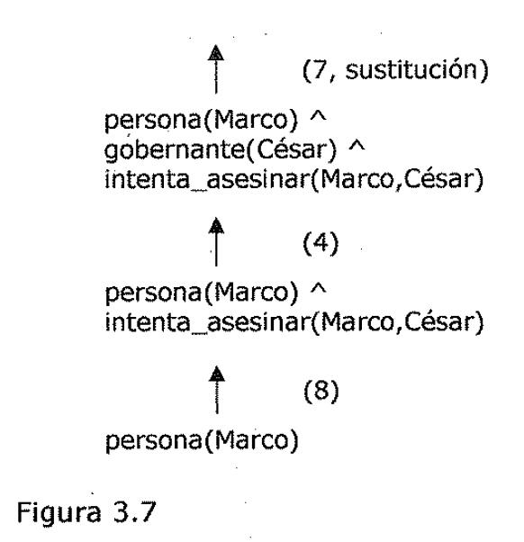

Supongamos que se desea utilizar los anteriores asertos para responder a la
siguiente pregunta:

**¿Era Marco leal a Cesar?**

Parece que por medio de 7 y 8 se puede demostrar que Marco no era leal a Cesar
(ignorando de nuevo la distinción entre tiempo pasado y presente). Intentemos
ahora obtener una prueba formal razonando a la inversa desde el objetivo a
alcanzar:

leal(Marco, Cesar) Para probar dicho objetivo es necesario utilizar las reglas
de inferencia que permiten transíormarlo en otro objetivo (o posiblemente
conjunto de objetivos) que a su vez puedan ser transíormados, y así
sucesivamente, hasta que no quede ningún objetivo por satisfacer.

Para realizar este proceso es posible que sea necesario utilizar, un grafo Y-O
cuando haya caminos alternativos para satisfacer un objetivo dado. Por
simplicidad solo se muestra uno de los posibles caminos. *La Figura 3.* 7
*muestra un intento de prueba del objetivo mediante la reducción del conjunto de
objetivos necesarios aún sin satisfacer, a un conjunto vacfo.* El intento falla,
ya que no se puede satisfacer el objetivo persona(Marco) con los asertos
disponibles.

*El problema es que, a pesar de que se sabe que Marco era un hombre, no* se
*puede deducir que era una persona.* Se debe afiadir la representación de otro.
hecho al sistema:

1. Todos los hombres son personas.

\Ix: **hombre(x)** ➔ **persona(x)** De esta forma se satisface el último
objetivo y se obtiene una prueba de que ***Marco no era leaf a Cesar.*** En este
ejemplo se hallan presentes tres importantes cuestiones involucradas en el
proceso de conversión de frases en lenguaje natural a sentencias lógicas y el
posterior uso de estas sentencias en la deducción de otras nuevas:

*Muchas frases en lenguaie natural son ambiguas* (por ejemplo, 5, 6 y 7 del
ejemplo anterior). La seleccion de la interpretación correcta puede ser difícil.

+ *Normalmente hay más de una forma de representar el conocimiento* (como ya se
 vio en las frases 1 y 7). La simplicidad de la representación es una cualidad
 deseable, pero puede ocurrir que de esa forma se penalice cierto tipo de
 razonamiento. La

conveniencia de la representación que se escoja para un conjunto de frases
dependerá del uso que se quiera hacer del conocimiento contenido en dichas
frases.

*Aun en las casos más sencillos, no es probable que en un conjunto de frases
dado, este contenida toda la información necesaria para razonar sobre el tema en
cuestión.* Para poder razonar de manera efectiva a partir de un conjunto de
sentencias, normalmente es necesario utilizar un conjunto de sentencias
adicionales que representan aquellos hechos que, por lo general no se suelen
especificar, por demasíado obvios.

*Se puede presentar un problema adicional cuando no se conocen de antemano las
sentencias que se va a intentar deducir.* En el ejemplo anterior el objetivo era
responder a la pregunta ".!.era Marco teal a Cesar?". Pero.!.Como puede decidir
un programa cuál de estas dos sentencias demostrar?

leal(Marco, Cesar) teal(Marco, Cesar)

1. Se puede intentar diferentes cosas como razonar a partir de los axiomas y ver
 que respuesta se obtiene, en lugar de utilizar la estrategia empleada en el
 ejemplo anterior de razonar hacia atrás a partir del objetivo propuesto. El
 problema de razonar hacia delante a partir de los axiomas es que es probable
 que el factor de ramificacion provoque que no se obtenga ninguna respuesta en
 un tiempo razonable.

2. Una segunda posibilidad consistiria en utilizar algún tipo de reglas
 heuristicas que permitiesen decidir cuál es la respuesta más probable y
 entonces intentar demostrarla. Si despues de un tiempo razonable no se
 encontrase una demostración, se intentaria con la otra respuesta. Es
 importante esta idea de limitar el esíuerzo, puesto que cualquier
 procedimiento de prueba que se utilice puede no parar cuando se enfrenta con
 algo que no es un teorema.

3. Otra posibilidad sería tratar de demostrar ambas respuestas simultaneamente y
 parar cuando una de las dos demostraciones tuviese exito. Sin embargo, aun
 así, si no se dispone de suficiente información para responder a la pregunta,
 es posible que el programa no pare nunca.

1. Una cuarta estrategia consiste en intentar demostrar la verdad de una•
 resptiesta y la

falsedad de la contraria y utilizar la información obtenida en cada proceso como
ayuda en el otro. \

1. La Representación de las relaciones instancia y es-un

Los atributos ***instancia*** y ***es-un*** juegan un papel importante en el
modelo de razonamiento guiado por la herencia de propiedades. Si se revisa la
manera en que se ha representado el conocimiento acerca de Marco y Cesar en el
ejemplo anterior, se observara que no se han utilizado estos atributos.
Ciertamente no se han utilizado predicados con esos nombres. LPor **que no? La
respuesta es que, a pesar de que no se han utilizado explicitamente los
predicados C. instancia y es-un, *sí se han empleado las relaciones que
representan, la pertenencia a una* *clase y la inclusion de una clase en otra.*
La Figura 3.8 muestra la representación lógica, escrita de tres formas
distintas, de las primeras cinco frases del apartado anterior.

1. hombre(Marco)

2. pompeyano(Marco)

3. vx: pompeyano(x) ➔ romano(x)

4. gobernante(Cesar)

5. vx: romano(x) ➔ leal(x,Cesar) v odia(x,Cesar)

8. vx: instancia(x,pompeyano) ➔ instancia(x,romano)

10. vx: instancia(x,romano) ➔ leal(x,Cesar) v odia(x,Cesar)

15. vx: instancia(x,romano) ➔ leal(x,Cesar) v odia(x,Cesar)

16. vx: vy: vz: instancia(x,y) " es-un(y,z) ➔ instancia(x,z)

Figura 3.8

En la **primera parte** de la figura aparece una representación de la que ya
hemos hablado. En esta representación, *la pertenencia a una clase se representa
con predicados monarios* (como romano) que se refieren a cada una de las clases.
*Asertar* *P(x) como cierto es equivalente a afirmar que x es una instancia (o
un elemento) de P.* En la **segunda parte** de la figura aparece una
representación donde se utiliza explicitamente el predicado instancia. *Este es
un predicado binario, cuyo primer argumento es un objeto y cuyo segundo
argumento es la clase a la que ese objeto* *pertenece. Sin embargo, en esta
representación no se utiliza explícitamente el* *predicado es-un.* En la tercera
sentencia de la segunda parte de la figura aparece un ejemplo de cómo se
representa la relación que se establece entre dos subclases cuando una esta
incluida en la otra, coma por ejemplo la clase de los pompeyanos en la clase de
los romanos. La regla de implicación que ahf aparece se lee como que si un
objeto es una instancia de la subclase pompeyano entonces también será una
instancia de la superclase romano. Nótese que esta regla es equivalente a la
definición de la relación de inclusion en la teorfa de conjuntos.

Por último, en la figura se muestra una **tercera representación** donde *se
utilizan explícitamente los predicados instancia y es-un.* Con el uso del •
predicado es-un se simplifica la representación de la tercera sentencia, pero
hace necesaria la definición de un nuevo axioma (definido con el número 6). Este
axioma adicional describe coma se ' puede combinar una relación de instancia con
una relación es-un para dar lugar a una nueva relación de instancia. Sin
embargo, este axioma es de caracter general y no es necesario delinirlo para
cada nueva relación es-un.

Estos ejemplos pretenden ilustrar dos ideas diferentes.

* La primera, bastante específica, nos permite afirmar que *no es necesario
 representar explicitamente las relaciones de pertenencia a una clase e
 inclusion de una clase en otra por media de Jos predicados instancia v es-un.*
 De hecho, normalmente resulta engorroso hacerlo de esta forma y se suele optar
 por la utilización de predicados monarios que representan a las clases.

* La segunda idea es más general y viene a decir que *normalmente es posible
 obtener varias representaciones de un determinado hecho en un sistema* •*de*.
 *representación dado, va sea este la Jóqica* o *cualquier otro. La elección
 dependería, en parte del tipo de deducciónes que se pretenda aqilizar, v en
 parte del gusto de cada cuál.* La norma que siempre se debe respetar es el uso
 consistente de una determinada representación en toda la base de conocimiento.
 Dado que las reglas de inferencia se construyen para ser aplicadas sobre una
 forma de representación en concreto, es necesario que todo el conocimiento
 sobre el que esas reglas son aplicables este representado de la forma que las
 reglas necesiten. El uso de representaciones inconsistentes provoca muchos
 errores en los mecanismos de razonamiento de los programas basados en
 conocimiento. La moraleja es, simplemente, que se debe ser cuidadoso.

3,3.4. Representación de Funciones calculables y Predicados computables En el
ejemplo del apartado anterior, todos los hechos simples se representaban como
combinaciones de predicados aislados, tales como:• Esta es una buena solución
cuando el número de hechos es pequefio o cuando los propios hechos carecen de
una estructura definida de forma que no existen demasíadas alternativas.

Pero supongamos que se desea expresar hechos simples tales como las siguientes
relaciones mayor-que y menor-que:

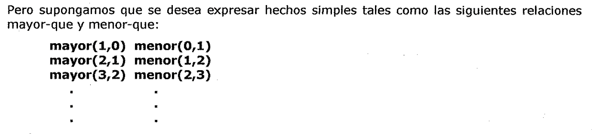

**mayor(l,O) menor(0,1) mayor(2,1) menor(l,2) mayor(3,2) menor(2,3)**

Está claro que ***sería tedioso representar todos estos hechos, uno a uno,
explicitamente.*** Entre otras cosas porque los hay infinitos. Pero aún en el
caso de que solo considerasemos el subcorijunto finito que es posible
representar en, digamos, una palabra maquína por número, sería muy ineficiente
representarlos todos explícitamente cuando, en lugar de ello, es posible
***calcularlos en el momento necesario.*** Por tanto, resulta muy conveniente
***extender la representación*** para poder expresar estos ***predicados
computables.*** Independientemente del procedimiento de demostración que se
utilice, cuando se encuentre con un predicado de este tipo, en lugar de buscarlo
explícitamente en la base de datos o intentar deducirlo mediante algún tipo de
razonamiento, bastara con ***invocar un procedimiento, especificado
previamente,*** que devolvera un valor de verdadero o falso.

Ta.mbien suel.e ser útil disponer de ***funciones computables*** además. de
predicados computables. De esta forma sería posible evaluar el predicado:

**mayor(2+3,1)**

Para ello es necesario evaluar en primer lugar el valor de la función suma con
los argumentos 2 y 3, para luego evaluar el predicado mayor con los argumentos 5
y 1.

En. el siguiente ejemplo se• muestra la utilidad de esta idea de funciones. y
predicados computables. Tambien se hace uso del concepfo de ***igualdad,*** de
modo que sea posible sustituir un objeto por otro que sea igual a el, cuando
este cambio resulte de alguna utilidad en el proceso de prueba. • Considerese el
siguiente conjunto de hechos que, otra vez, se refieren a Marco:

- 1. Marco era un hombre.

**hombre(Marco)**

De nuevo no tenemos en consideración el tiempo verbal.

- 1. Marco era pompeyano.

**pompeyano(Marco)**

- 1. Marco nació en el 40 D.C.

**nace(Marco,40)** I.

Por simplicidad no representaremos D.C. explicitamente, de la misma forma que se
suele omitir en las conversaciones de la vida diaria. Si en algún momento fuese
necesario representar fechas A.C., entonces habrfa que decidir la manera de
hacerlo, por ejemplo, utilizando números negativos. Nótese que la representación
de una frase no tiene que ser una copia de la frase en sí, siempre que sea
posible pasar de la fase a su representación y viceversa. Esto permite elegir
una representación tal como números positivos y negativos, con la que un
programa puede trabajar fácilmente.

- 1. Todos los hombres son mortales.

\ix: **hombre(x)** ➔ **mortal(x)**

- 1. Todos los pompeyanos murieron cuando el volcan entró en erupción en el 79
 D.C. **erupción(volcan,79) A** \ix: **[pompeyano(x)** ➔ **murio(x,79)]**
 Claramente en esta sentencia se representan los dos hechos enunciados en la
 frase

anterior. Tambien se podría asertar otro hecho que no aparece en la
representación, a saber, que la erupción del volcan causó la muerte de los
pompeyanos. Normalmente se suele suponer una relación de causalidad entre
efectos que se producen al mismo tiempo siempre que esa suposición sea
plausible.

La interpretación de esta frase presenta un problema adicional que consiste en
determinar el referente de la expresión *"el volcan".* Hay más de un volcan en
el mundo. Claramente aquf nos referimos al Vesuvio, que está cerca de Pompeya y
que entró en erupción en el 79 D.C. En general para resolver estas referencias
se necesita tanto una gran cantidad de razonamiento como una gran cantidad de
conocimiento adicional.

- 1. Ningun mortal vive más de 150 afios.

\ix: \it: \it: **mortal(x) A nace(x, t ) A mayor (t - t,150)** ➔**muerto(x,
t2)**

1 2 **1 2 1**

Esta frase se podría expresar de diversas maneras. Por ejemplo, se podría
delinir una función edad y asertar que su valor nunca puede ser mayor de 150.
Sin embargo, la representación escogida aquf es más sencilla y suficiente para
este ejemplo.

- 1. Estamos en 2004.

**ahora = 2004**

Aquí se hace uso de la idea de que una cantidad se puede sustituir por otra de
igual valor.

Supongamos ahora que se.desea responder a la pregunta ***"i.Esta Marco
vivo?".*** Echando un *<* rápido vistazo a los asertos es fácil llegar a la
conclusión de que hay más de un modo posible de deducir una respuesta. Bien
podemos demostrar que ***Marco está muerto porque lo mató*** ***la erupción del
volcan,*** o bien podemos demostrar que ***está muerto porque si no lo***
***estuviera tendría más de 1.50 anos,*** lo cuál sabemos que es imposible.

Pero en cuanto intentemos seguir rigurosamente alguna de estas dos líneas de
razonamiento descubriremos, como en el ejemplo anterior, la ***necesidad de
utilizar conocimiento*** ***adicional.*** Por ejemplo, en las sentencias se
habla de la muerte, pero no se dice nada que la relacione con la vida, que es el
concepto que aparece en la pregunta. Por tanto, es necesario afiadir los
siguientes hechos:

- 1. Estar vivo significa no estar muerto.

Esto no es estrictamente correcto, pues el hecho de no estar muerto solo implica
estar vivo si se refiere a objetos animados. (Las sillas no están ni.vivas ni
muertas). De nuevo, obviaremos este detalle por ahora. Es mlly extrano que dos
representaciones signifiquen exactamente lo mismo desde todos los puntos de
vista.

- 1. Si alguien muere, está muerto para siempre.

Vx: Vt1: Vt,: **murió(x, t1) " mayor (t2 *'J'* t1)** ➔**muerto(x, t2)** Esta
representación expresa el hecho de que se está muerto todos los anos a partir
del ano en que se murió. No se tiene en cuenta si se está muerto el ano en que
se murió.

1. hombre(Marco)

2. pompeyano(Marco)

3. nace(Marco,40)

4. vx: hombre(x) ➔ mortal(x)

5. vx: [pompeyano(x) ➔ murió(x,79)]

6. erupción(volcan,79)

7. vx: Vt1: Vt2: mortal(x)" nace(x, t1)" mayor (t2- t1,150)

* muerto(x, t2)

8. ahora 2004

10. vx: Vt1: Vt2: murió(x, t1) " mayor (t2f t1) ➔ muerto(x, t2)

vx: Vt: [vivo(x,t) ➔ muerto(x,t)J " [muerto(x,t) ➔ vivo(x,t)J

Figura 3.9

Un conjunto de hechos acerca de Marco

En la Figura 3.9 aparecen todos los hechos definidos.hasta ahora. Intentemos
ahora responder a la pregunta "<'.Esta Marco vivo?" buscando una demostración
de:

vivo(Marco,ahora) El término vado que aparece al final de. la Figura 3.10 indica
que la lista de conditiones que queda por probar esta vada con lo cuál la
demostración ha terminado con exito.

vivo(Marco,ahora) 9, sustitución) muerto(Marco, ahora)

**t** (10, sustitución) murió(Marco, t1) " mayor (ahora, t1) 5, sustitución)

pompeyano(Marco) " mayor (ahora, 79) mayor(ahora, 79) 8, sustitución de iguales)
mayor(2004, 79)

**t** (computar mayor) nil

Figura 3.10

Una forma de demostrar que Marco está muerto

* 1.¿Si, M:etodo de Resolm::ion

Desde el punto de vista computacional sería muy útil disponer de un
*procedimiento de* *demostración* que en una sola operacion llevase a cabo los
distintos. procesos involucrados en el razonamiento con sentencias de la lógica
de predicados. La ***Resolución*** cumple este requisito y debe su eficiencia al
hecho de que trabaja sobre *sentencias que han sido* *transíormadas a una forma
canónica,* descrita más abajo, muy conveniente.

***El procedimiento de resolución obtiene demostraciones por refutación. Es
decir,***

***para probar una proposición (demostrar su validez)* se *intenta demostrar que
su negación lleva a una contradicción con las proposiciones conocidas (es***

***decir, es insatisíactible).***

Esta aproximación difiere de la técnica utilizada hasta ahora, donde se
intentaba generar la demostración de un teorema aplicando las reglas conocidas
hasta llegar a alguno de las axiomas. La explicación del mecanismo de resolución
será más directa una vez que se haya descrito la forma estándar en que se
representan las proposiciones, y par lo tanto, la posponemos hasta entonces.

1. Conversión *a* forma clausal

Supongamos que sabemos que todos los romanos que conocen a Marco o bien odian a

Cesar o bien piensan que cualquiera que odie a otro está loco. Esta sentencia se
puede representar con la siguiente fbf:

'ifx: **[romano(x) "conoce(x,Marco)]** ➔ El uso de esta fórmula en una
demostración requeriria establecer unas correspondencias muy complicadas. Una
vez que se haya establecido la correspondencia con una parte de ella, coma por
ejemplo cree\_loco(x,y), será necesario realizar las operaciones adecuadas con
el resto de la fórmula, tanto en la parte donde se incluye ese fragmento coma en
aquellas donde no. Si la fórmula fuese más simple este proceso sería mucho más
sencillo. Seria más sencillo trabajar con esta fórmula si:

* Fuera más plana, es decir, si hubiese menos anidamiento entre (as expresiónes.

* Los cuantificadores estuvieran separados de·· la fórmula, de modo que no fuera

necesario tenerlos en consideracion. • La ***forma normalizada conjuntiva***

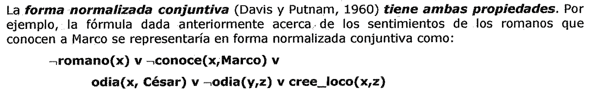
(Davis y Putnam, 1960) ***tiene ambas propiedades.*** Por ejemplo, la fórmula
dada anteriormente acerca. de las sentimientos de las romanos que conocen a
Marco se representaria en forma normalizada conjuntiva como:

**romano(x) v conoce(x,Marco) v**

**odia(x, Cesar) v odia(y,z) v cree\_loco(x,z)** Puesto que *existe un algoritmo
para* ***convertir*** *cualquier* ***fbf*** *a la* ***forma normafizada***
***conjuntiva,*** no perdemos la generalidad si empleamos un procedimiento de
demostración (coma la resolución) que opere solamente con fórmulas expresadas de
esta forma. De hecho, *para que la resolución funcione,* es necesario ir un poco
más allá. *Es necesario* *convertir el conjunto de fórmulas bien formadas a un*
***conjunto de cláusulas,*** donde una **cláusula** se deline coma ***una fbf en
forma normali:iada conjuntiva que no contiene***

***ninguna conectiva* A,**

Para ello se convierte cada fbf a forma normalizada conjuntiva y, a
continuación, se divide esa expresión en cláusulas, una par cada conjuncion.
Cuando se aplique el procedimiento.de prueba, las conjunciones se consideraran
agrupadas. Para transíormar una fbf a forma clausal es necesario seguir los
siguientes pasos:

**Algoritmo: Conversión a forma clausal**

1. *Eliminar las implicaciones;* ➔, usando el hecho de que a ➔ b es equivalente
 a.a v b.

ReaUzando esa transíormacion en las fbf dadas anteriormente obtenemos:

**Vx:,[romano(x) "conoce(x,Marco)] v** •

1. *Reducir el ámbito de las neqaciones,*,, a un único término, usando el hecho
 de que

.p) = p, las leyes de Morgan [según las cuales (a" b) =av,by.(av b) =.a",b], y
las correspondencias normales entre cuantificadores [vx: P(x) =:ix:.P(x) y,3x:
P(x) = Vx:,P(x)]. Realizando esta transíormacion en las fbf del paso 1 se
obtiene:

Vx: [ **.romano(x) v.conoce(x,Marco)] v**

1. *Normalizar las variables* de forma que cada cuantificador este ligado a una
 variable. Puesto que las variables son solo nombres sin un valor concreto,
 este proceso no puede afectar al valor de verdad de la fbf. Por ejemplo, la
 fórmula

Vx: P(x) v Vx: Q(x)

I se convertirfa en

Vx: **P(x) V** Vy: **Q(y)**

Este paso es una preparacion para el siguiente.

4. *Mover todos los cuantificadores a la izquierda de la fórmula sin cambiar su
 orden*

*relativo.* Esto es posible gracias a que no existe ningún conflicto entre los
nombres de las variables. Realizando esta operacion sobre la fórmula del paso 2,
se obtiene:

En este momento la fórmula es lo que se conoce como **fórmula normal prenex.**
*Consiste en un prefijo de cuantificadores seguido par una matriz que esta fibre
de cuantificadores.*

1. *Eliminar las cuantificadores existenciales.* En una fórmula donde se incluye
 una variable cuantificada existencialmente se afirma que existe un valor que
 puede sustituir a la

variable, y que hace verdadera la fórmula. Es posible eliminar el cuantificador
sustituyendo la variable por una referencia a una función que produzca el valor
deseado. Puesto que no se conoce necesariamente la forma de producir ese valor,
se debe crear un nuevo nombre de función para cada sustitucion. No se hace
ninguna afirmacion sobre esas funciones excepto que deben existir. Así, por
ejemplo, la fórmula:

3y: Presidente(y)

puede transíormarse en la fórmula

**Presidente(S1)**

Donde S1 es una función sin argumentos que produce de algún modo un valor que
satisface el predicado Presidente.

Si surgen cuantificadores existenciales dentro del ámbito de cuantificadores
universales, los valores que satisíagan el predicado pueden depender de los
valores de las variables cuantificadas universalmente. Por ejemplo, en la
fórmula:

Vx: 3y: padre\_de(y,x)

el valor de y que satisface padre\_de depende del valor concreto de x. Por lo
tanto, se deben generar funciones con el mismo número de argumentos que el
número de cuantificadores universales que afecteri a la expresión que se este
tratando. Así, este ejemplo se transíormarfa en:

Estas funciones que generamos se llaman **funciones de Skolem,** Aquellas que no
tienen argumentos se llaman a veces **constantes de Skolem.**

1. *Eliminar el prefiio.* En este punto, *todas las variables.que quedan están
 cuantificadas* *universalmente,* por lo que el prefijo puede ser simplemente
 ignorado, y cualquier procedimiento de demostración que usemos puede suponer
 simplemente que cualquier

variable con la que se encuentre, esta cuantificada universalmente. Ahora la
fórmula producida en el paso 4 aparece como:

[**romano(x) v conoce(x,Marco}] v**

1. *Convertir la matriz en una conjunción de disvunciones.* Como en este ejemplo
 no

aparece ninguna conectiva Y, basta con utilizar la propiedad asociativa de la
conectiva lógica O [es decir, av (b v c) = (a v b) v c] y quitar simplemente los
parentesis, para obtener:

**romano(x) v conoce(x,Marco) v**

**odia(x,Cesar) v odia(y,z) v cree\_loco(x,y)**

Sin embargo, con frecuencia es también necesario utilizar la propiedad
distributiva [(a A b) v c = (av c) A (b v c)]. Por ejemplo, la fórmula:

invierno A llevarbotas) v (verano A llevarsandalias) se convierte despues de una
aplicación de la regla en: [invierno v (verano A llevarsandalias)] A
[llevarbotas v (verano A llevarsandalias)J

y, despues de una segunda aplicación, que es necesaria, porque aún quedan
conjunciones unidas por la conectiva O, en i nvierno v verano) A invierno v
llevarsandalias) A lelvarbotas v verano) A llevarbotas v llevarsandalias)

1. *Crear una cláusula por cada conjunción.* Para que una fbf sea cierta, todas
 las cláusulas que se han generado a partir de ella deben ser ciertas. Cuando
 se trabaja con varias fórmulas bien formadas, es posible combinar el conjunto
 de cláusulas generadas por

cada una de ellas para representar los mismos hechos que representaban las
fórmulas originales.

1. *Normalizar las variables* que aparecen en el conjunto de cláusulas generadas
 en el paso

8. Con esto se pretende que no haya dos cláusulas que hagan referencia a la
 misma variable, para lo cuál es necesario renombrar a las variables
 adecuadamente. Esta transíormación se apoya en el hecho:

\ix: P(x) A Q(x)) = \ix: P(x) A *\ix:* Q(x)

As[, puesto que cada cláusula es una conjunción separada y todas las variables
están cuantificadas universalmente, no es necesario dar valor a una variable
cuantificada universalmente (es decir, sustituirla por un valor concreto). Pero,
en general, queremos mantener las cláusulas en su forma más general durante
tanto tiempo como sea posible.

Al instanciar una variable, queremos conocer el mínimo nurnero de sustituciones
que deben realizarse para preservar el valor de verdad del sisterna.

***Despues de aplicar todo este procedimiento a un conjunto de fórmulas bien***
***formadas tendremos un conjunto de cláusulas, cada una de las cuales será una
disyunción de literales. Estas cláusulas serán las que utilice el
procedimiento***

***de resolución para generar demostraciones.***

1. las bases de la resolución

***El procedimiento de resolución* es *un proceso iterativo simple en el cuál,
en cada paso, se comparan (resuelven) dos cláusulas llamadas cláusulas padres,
produciendo una nueva cláusula que* se *ha inferido de ellas.*** La nueva
cláusula representa la forma en que las dos cláusulas padres interaccionan entre
sL Supongamos que hay dos cláusulas en el Sistema:

invierno v verano .invierno v frfo Recordemos que esto significa que ambas
clausu.las deben ser ciertas (es decir, aunque las cláusulas parecen
independientes, en realidad están agrupadas).

Ahora vemos que siempre deberá ser cierta una de las aserciones invierno
o.invierno. Si invierno es cierto, entonces frio debe ser cierto para garantizar
la verdad de la segunda cláusula. Si.invierno es verdad, entonces verano debe
ser cierto para garantizar la verdad de la primera cláusula. As[ pues, a partir
de esas dos cláusulas se puede deducir:

**verano v frio**

*Esta es la deducción que hará el procedimiento de resolución.*

* La resolución opera tomando dos cláusulas tales que cada una contenga el mismo
 literal,

en este ejemplo, invierno. ***El literal debe estar en forma positiva en una
cláusula***

***y en forma negativa en la otra.***

* El resolvente se obtiene combinando todos los literales de las dos cláusulas
 padres excepto aquellos que se cancelan.

• Si la cláusula producida es la cláusula vada, es que se ha encontrado una
contradicción.

Por ejemplo, las dos cláusulas:

invierno '.invierno produciran la cláusula vada. Si existe una contradicción, se
encontrara en algún momento.

Naturalmente, si no existe ninguna contradicción, es posible que el
procedimiento nunca termine, aunque como veremos, a menudo existen formas de
detectar que no existe contradicción.

**3.3.8. Resolución en lógica proposicional**

Para aclarar como funciona la resolución, presentaremos en primer lugar el
procedimiento de resolución para *lógica proposicional.* Posteriormente lo
expandiremos para incluir la lógica de predicados.

En *lógica proposicional,* el procedimiento para producir una demostración por
resolución de la proposición P respecto a un conjunto de axiomas F es el
siguiente:

**Algoritmo: Resolución de·proposiciones**

1. Convertir todas las proposiciones de Fa forma clausal.

1. Negar P y convertir el resultado a forma clausal. Afiadir la cláusula
 resultante al conjunto de cláusulas obtenidas en el paso 1.

2. Hasta que se encuentre una contradicción o no se pueda seguir avcjnzando
 repetir:

1. Seleccionar dos cláusulas. Llamarlas cláusulas padres.

2. Resolverlas juntas. La cláusula resultante, llamada **,resolvente,** será I.a
 disyunción

<Je todos' los literales de las cláusulas padres con la siguiente excepción: si
existen pares de n·terales L y.L de forma que una de las cláusulas 'padre
coiitenga L y la otra contenga.L, entonces se eliminarah tanto L como.\_L del
resolvente.

* 1. Si el resolvente es la cláusula vacia, es que se ha encontrado una
 contraifrcción. Si

no lo es, añadirla al conjunto de cláusulas disponibles.

**Veamos un ejemplo sencillo.** Supongamos que se nos dan los axiomas mostrados
en la primera columna de la Figura 3.11 y queremos demostrar R. En primer lugar,
se convierten los axiomas a forma clausal, tal como se muestra en la segunda
columna de la figura. A continuación negamos R, obteniendo,R que ya está en
forma clausal. A continuación se empieza a elegir pares de cláusulas para
resolverlas.

**Axiomas de partida**

**Convertidos a forma clausal**

PA Q) ➔ R

S v T) ➔ Q

.P V,Q V R,S V Q .TvQ

Figura 3.11

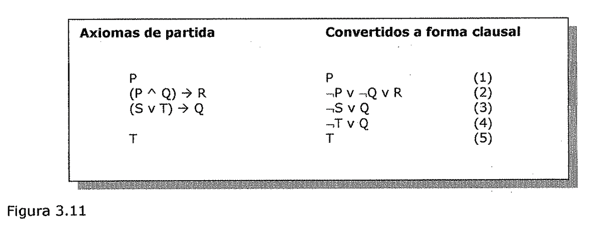

Aunque puede resolverse cualquier par de cláusulas, solamente aquellos pares que
contengan literates complementarios, produciran un resolvente que tenga alguna
probabilidad de conducir al objetivo de obtener la cláusula vada (que se
representa como una caja). Es posible, por ejemplo, generar la secuencia de
resolventes que se muestra en la Figura 3.12. Se empieza resolviendo con la
cláusula,R, puesto que es una de las cláusulas que deben estar involucradas en
la contradicción que estamos intentando hallar.

Figura 3.12

La resolución se puede ver como un proceso que toma un conjunto de cláusulas que
se suponen ciertas y, basandose en- la información que las otras proporcionan,
genera nuevas cláusulas que representan restricciones a la satisíacibilidad de
las cláusulas originates. Surge una contradicción cuando una cláusula se vuelve
tan restringida que no hay forma de hacerla verdadera. Esto se indica con la
generación de la cláusula vacia.

3.3.9. El algoritmo de unificación

En lógica proposicional es fácil determinar que dos literales no pueden ser
ciertos al mismo tiempo. Basta con buscar L y,L.

En ***lógica de predicados*** el proceso de correspondencia es más complicado
puesto que ***se deben considerar los argumentos de los predicados.*** • • Por
ejemplo, hombre(John) y,hombre(John) es una contradicción, mientras que
hombre(John) y,hombre(Spot) no lo es. Así pues, para detectar las
contradicciones, se necesita un procedimiento de emparejamiento que compare dos
literales y descubra si existe un conjunto de sustituciones que los haga
identicos.

*Existe un procedimiento recursivo directo, denominado* ***algoritmo de
unificación*** *que realiza exactamente esto.* La idea básica de la unificación
es muy sencilla.

* Para unificar dos literales, *en primer lugar se comprueba si las predicados
 coinciden.* Si es así, seguimos adelante, si no, no hay forma de unificarlos,
 sean cuales sean sus argumentos. Por ejemplo, los literales:

intenta\_asesinar(Marco, Cesar) odia(Marco,Cesar) no son unificables.

* Si los predicados concuerdan, a continuación se *van comprobando los
 argumentos de dos en dos.* Si el primero concuerda, podemos continuar con el
 segundo, y así sucesivamente. Para comprobar cada par de argumentos, basta con
 llamar recursivamente al procedimiento de unificación. Las reglas de
 emparejamiento son

sencillas. Aquellos predicados o constantes que sean diferentes no se pueden
emparejar; aquellos que sean identicos pueden hacerlo.

Una *variable* se puede emparejar *con otra variable, con cualquier constante o
con un predicado,* con la restricción de que el predicado no debe contener
ninguna instancia de la variable con la que se esta emparejando.

La única complicación en este procedimiento es que se debe encontrar una única
sustitución consistente para todo el literal, y no sustituciones separadas para
cada parte del mismo. Para hacerlo, se debe tomar cada sustitución que
encontremos y aplicarla al resto de literales antes de continuar intentando
unificarlos.

Por ejemplo, supongamos que queremos unificar las expresiónes: P(x,x)

P(y,z)

Las dos ocurrencias de P se emparejan sin problema. A continuación comparamos x
e y, y decidimos que si sustituimos y por x, se pueden emparejar. Escribiremos
esa sustitución como Naturalmente, se podría haber sustituido x por y, puesto
que ambos son nombres de variables sin más significado. El algoritmo simplemente
elegirá una de las dos sustituciones). Pero ahora, si continuamos y emparejamos
x con z, obtendremos la sustitución z/x. Pero no es posible sustituir, a la
*vez,* y y z por x, por lo que la sustitución no es consistente.

Una *vez* encontrada la primera sustitución y/x es necesario realizar dicha
sustitución en el resto de literales, para obtener:

P(y,y)

P(y,z)

A continuación intentamos unificar los argumentos y y z, lo que logramos con la
sustitución z/y. Con esto se completa el proceso y la sustitución resultante es
la composición de las.dos sustituciones encontradas. La composición se escribe
como:

z/y)(y/x)

siguiendo la notación estándar para la composición de funciones.

El ***objetivo del procedimiento de unificación*** es descubrir, al menos una
sustitución que permita el emparejamiento de dos literales. Normalmente, si
existe una de dichas sustituciones, existiran muchas más. Por ejemplo, los
literales:

odia(x,y) odia(Marco, z) Pueden unificarse con cualquiera de las siguientes
sustituciones:

Marco/x, z/y)

Marco/x, y/z)

Marco/x, Cesar/y, Cesar/z)

Marco/x, Polonio/y, Polonio/z)

Las dos primeras son equivalentes, excepto por la diferencia lexica. Pero las
dos segundas, aunque producen un emparejamiento, producen también una
sustitución que es más restrictiva de lo que sería estrictamente necesario para
el emparejamiento.

Puesto que la sustitución final producida por el proceso de unificación será
usada por el procedimiento de resolución, sería conveniente generar el
unificador más general posible.

3.3.10. Reso!11c:i6111 ien lógica de predicados

Ahora disponemos de una forma sencilla para determinar si dos literales son
***contradictorios***

- ***lo son si uno de ellos puede unificarse con la negación del otro.***

Así por ejemplo, hombre(x) y --,hombre(Spot) son contradictorios, puesto que
hombre(x) y hombre(Spot) son unificables. Esto corresponde a la idea intuitiva
que dice que hombre(x) no es cierto para cualquier valor de x si se conoce la
existencia de algún x, por ejemplo Spot, para el cuál es falso hombre(x). Así,
para usar la resolución sobre expresiónes de la lógica de predicados, se utiliza
el algoritmo de unificación para localizar partes de literales que se cancelen
mutuamente.

Tambien es necesario utilizar el unificador obtenido mediante el algoritmo de
unificación para generar la cláusula resolvente. Por ejemplo, supongamos que
queremos resolver las dos cláusulas:

1. hombre(Marco)

2...,hombre(x1) v mortal(x1)

El literal hombre(Marco) se puede unificar con el literal hombre(x1) con la
sustitución Marco/ x,, que nos dice que para x1 = Marco,..,hombre(Marco) es
falso. Pero no podemos cancelar simplemente las dos apariciones del literal
hombre tal como hacíamos en lógica proposicional, generando el resolvente
mortal(x1).

La cláusula 2 dice que para un x1 dado, se cumple..,hombre(x1) o mortal(x,). Por
lo cuál, para que sea cierta, tan solo podemos afirmar que mortal(Marco) debe
ser cierto. No es necesario que mortal(x1) sea cierto para cualquier x1, puesto
que para algunos valores de x,, ..,hombre(x1) podría ser cierto, haciendo que
mortal(x1) sea irrelevante para la certeza de la cláusula completa.

Por lo tanto, el resolvente generado a partir de las cláusulas 1 y 2 debe ser
mortal(Marco), que se obtiene aplicando el resultado del proceso de unificación
al resolvente. El proceso de resolución puede continuar a partir de ahi para
determinar si mortal(Marco) conduce a una contradicción con otras cláusulas
disponibles.

Este ejemplo ilustra la importancia de normalizar separadamente las variables
durante el proceso de conversión de las expresiónes a forma clausal. Suponiendo
que se haya hecho la normalización, es fácil determinar como debe usarse el.
unificador para realizar las sustituciones que den lugar al resolvente. Si hay
dos ocurrencias de la misma variable, se ¿es debe aplicar la misma sustitución.

Ahora ya podemos exponer el algoritmo de resolución para lógica de predicados
suponiendo un conjunto de sentencias F y una sentencia P que debemos demostrar:

**Algoritmo: Resolución**

1. Convertir todas las sentencias de F a forma clausal.

2. Negar P y convertir el resultado a forma clausal. Ai'iadirlo al conjunto de
 cláusulas obtenidas en 1.

3. Hasta que se encuentre una contradicción o no pueda realizarse ningún
 progreso o se haya realizado una cantidad de esíuerzo predeterminada,
 repetir:

1. Seleccionar dos cláusulas. Llamarlas cláusulas padres.

2. Resolverlas. El resolvente será la disyunción de todos los literales de ambas
 cláusulas padres, una vez realizadas las sustituciones apropiadas, con la
 siguiente excepción: si existe un par de literales Tl y.T2 tales que una de
 las cláusulas padres contenga Tl y la otra contenga T2 y si Tl y T2 son
 unificables, entonces ni Tl ni T2 deben aparecer en el resolvente. Llamaremos
 a Tl y T2 literales complementarios. A continuación utilizar la sustitución
 producida por la unificación para crear el resolvente. Si existe más de una
 pareja de literales complementarios, en el resolvente solo se eliminara uno
 de ellos.

3. Si el resolvente es la cláusula vacia, se ha encontrado una contradicción. Si
 no lo es, ai'iadirla al conjunto de cláusulas sobre las que se esta aplicando
 el procedimiento.

Si la elección de cláusulas a resolver en cada paso se hace siguiendo unas
ciertas formas sistematicas, el procedimiento de resolución encontrara una
contradicción, si esta existe.

Volvamos a nuestra discusión sobre Marco y vearnos coma se puede utilizar la
resolución para demostrar nuevas cosas acerca de el. Considerernos en primer
lugar el conjunto de sentencias del ejernplo anterior convertidas a forma
clausal.

1. hornbre(Marco)

2. pornpeyano(Marco)

3..pornpeyano(x1) v romano(x1)

1. gobernante(Cesar)

2..rornano(x2) v leal(x2,Cesar) v odia(x2,Cesar)

3. leal(X3,fl(X3))

En la Figura 3.13 se muestra una dernostración por resolución de la sentencia:

**odia(Marco,Cesar)**

Naturalmente, podrían haberse generado muchos más resolventes de los que
'aparecen en la figura, pero se han utilizado las técnicas heurfsticas descritas
anteriormente para guiar la búsqueda. Nótese que lo que aquf se ha hecho es, en
esencia, razonar hacia atrás desde la sentencia que queremos demostrar que es
una contradicción, a través de un conjunto de conclusiones intermedias hasta la
conclusión final de inconsistencia.

Supongamos que el verdadero objetivo al demostrar el aserto: odia(Marco,Cesar)
era responder a la pregunta ***"U)diaba Marco a Cesar?".*** En este caso,
podríamos haber intentado igualmente demostrar la sentencia:

odia(Marco, Cesar) Para lo cuál, se deberfa añadir:

odia(Marco, Cesar) al conjunto de cláusulas disponibles antes de iniciar el
proceso de resolución. Pero notamos inmediatamente que no existe ninguna
cláusula que contenga un literal de la forma odia.

Puesto que el proceso de resolución solo puede generar nuevas cláusulas formadas
por combinaciones de los literales de cláusulas ya existentes, sabemos que no
puede generarse tal cláusula, por lo que concluimos que odia(Marco, Cesar) no
producira una contradicción con los asertos conocidos. Este es un ejemplo del
tipo de situaciónes en las que el procedimiento de resolución puede detectar que
no existe contradicción.

odia(Marco, Cesar) /-arco/x2 romano(Marco) v leal(Marco,Cesar) /Marco/x,
.pompeyano(Marco) v leal(Marco,Cesar) 2 7 al(Marco,Cesar)

arco / X4, Cesar/ y, 1.hombre(Marco) v.gobernante(Cesar)
v.intenta\_asesinar(Marco,Cesar)

.gobernante(Cesar) v.intenta\_asesinar(Marco,Cesar) 4

Figura 3.13

Demostración por Resolución

* 1. Representación del conocimiento mediante Reglas

Hablaremos del uso de reglas para codificar el conocimiento. Esto representa un
campo de estudio verdaderamente importante, ya que los sistemas de razonamiento
basados en reglas desempenan un importante papel en la evolución de la
Inteligencia Artificial, *transformándola de una ciencia de laboratorio en una
significativa ciencia comercial.* Hasta ahora se ha hablado de las reglas como
la base de los programas de búsqueda. Pero ya se hizo hincapie en el modo en que
el conocimiento acerca del mundo estaba representado en las reglas. En
particular se ha estado considerando que el conocimiento de control de la
búsqueda se encontraba completamente separado de las propias reglas.

Esto no se seguira considerando así, ya que a partir de ahora se *considerara un
conjunto de reglas para representar* ***tanto el conocimiento acerca de las
relaciones en el mundo, como el conocimiento para resolver problemas utilizando
el contenido de las reglas.***

1. Comparación entre conocimiento procedimental y conocimiento declarativo

Ya que el estudio de la representación del conocimiento se ha centrado hasta
ahora en el uso de aserciones lógicas, se utilizara la lógica como punto de
partida en el estudio de los sistemas basados en reglas.

Una **representación declarativa,** *es aquella en la que el conocimiento esta
especificado, pero en las que la manera en que dicho conocimiento debe ser usado
no viene dado.* Para utilizar una representación declarativa *se debe aumentar
esta con un programa que especifique lo que debe hacerse con el conocimiento y
de que modo debe hacerse.* Por ejemplo, *un conjunto de aserciones lógicas se
puede combinar con un demostrador de teoremas por resolución, para dar lugar a
un programa completo de resolución de problemas.* Existe un modo diferente de
considerar las aserciones lógicas, *considerarlas como un programa,* en lugar de
cómo datos para un programa. Desde este punto de vista, *las sentencias de
implicación definen los caminos de razonamiento Jegitimado,* así como las
aserciones atómicas proporcionan los puntos de partida (o, si el razonamiento se
realiza hacia atrás, los puntos de finalización) de dichos caminos. Estos
caminos de razonamiento definen construcciónes tradicionales de control, como
if-then-else, definen los caminos de ejecución de los programas tradicionales.

En otras palabras, se pueden *considerar las aserciones lógicas como
representaciones procedimentales del conocimiento.* Una **representación
procedimental,** *es aquella en la que la información de control necesaria para
utilizar el conocimiento se encuentra embebida en el propio conocimiento.* *Para
utilizar una representación procedimental se necesita aurnentarla con un
intérprete que siga las instrucciones dadas por el conocimiento.* ***La
verdadera diferencia entre el punto de vista declarativo del conocimiento y el
procedimental*** radica en ***donde* se *encuentra la información de control.***
Por ejemplo, considerese la siguiente base de conocimiento:

hombre(Marco Antonio) hombre(Cesar) persona(Cleopatra) \ix: hombre(x) ➔
persona(x) Ahora imagfnese que se intenta extraer de esta base de conocimiento
la respuesta a la siguiente cuestión:

3y: persona(y)

Se desea ligar y con un.valor particular para el cuál persona es verdad. La base
de conocimiento que tenemos justifica alguna de las siguientes respuestas:

y = Marco Antonio y = Cesar y = Cleopatra Ya que existe más de un valor que
satisface el predicado, y que solo se necesita un valor, la respuesta a dicha
pregunta dependerá del orden en que se examinen las diferentes aserciones
durante la búsqueda de una respuesta.

***Si* se *consideran las aserciones*** como ***declarativas,*** estas no diran,
por sí mismas, nada acerca de cómo van a ser examinadas. Si por el contrario se
¿es considera como ***procedimentales,*** sí lo harán.

Por supuesto, los programas no deterministas son posibles (por ejemplo las
construcciónes de programación concurrente y paralela). Por tanto, se pueden
considerar estas aserciones como un programa no determinista cuya salida
simplemente no esta definida. En caso de hacer esto se consigue una
representación "procedimental", que realmente no contiene más información que la
que contiene la forma "declarativa".

Pero la mayoría de los ***sistemas que consideran el conocimiento como
procedimental,*** no hacen esto en realidad. La razón es que si al menos el
procedimiento se va a ejecutar o en una maquína secuencial o bien sobre alguna
de las máquinas paralelas más conocidas, deben tomarse algunas decisiones en
relación con el ***orden en que* se *examinaran las aserciones.*** No existe
hardware disponible que trate la aleatoriedad. Por tanto, si el intérprete debe
disponer de un modo para decidir, no existe una razón real para no especificarlo
como parte de la definición del lenguaje y así poder delinir el significado de
un programa cualquiera en dicho lenguaje.

y = Cleopatra Para ver claramente las diferencias entre las representaciones
declarativas y las procedimentales, considerese las siguientes aserciones:

hombre(Marco Antonio) hombre(Cesar) \Ix: hombre(x) ➔ persona(x)
persona(Cleopatra) Observandolas desde un *punto de vista declarativo,* forman
la misma base de conocimiento que se tenia anteriormente. El sistema da las
mismas respuestas y ninguna de ellas se selecciona explicitamente.

Pero considerándolo ***procedimentalmente,*** y utilizando el modelo de control
que se utilizó para obtener Cleopatra como respuesta, se observa que ***esta* es
*una base de conocimiento diferente,*** ya que ahora la respuesta a nuestra
pregunta es Marco Antonio. Esto ocurre porque la primera afirmación que se
alcanza con el objetivo de persona es la regla de inferencia \Ix: hombre(x) ➔
persona(x). Esta regla establece un subobjetivo que consiste en encontrar un
hombre. De nuevo, las afirmaciones son examinadas desde el principio, pero ahora
Marco Antonio, satisface el subobjetivo, y por tanto también el objetivo
principal. Así que Marco Antonio será la respuesta emitida.

Es importante recordar que, aunque ya se ha dicho que una representación
procedimental codifica la información de control en la base de conocimiento,
esto solo ocurre en el caso en que el intérprete de la base de conocimiento
reconozca dicha información de control. Por lo tanto, se pueden haber obtenido
diferentes respuestas a la pregunta persona, dejando la base de conocimiento
original intacta y cambiando el intérprete de forma que examine las afirmaciones
empezando por la última hasta la primera. Siguiendo este esquema de control.
Cesar sen\ la respuesta correcta.

Siempre ha existido una gran controversia en la IA acerca de si las estructuras
de representación del conocimiento declarativas son mejores o peores que las
procedimentales.

Realmente no se ha llegado a una conclusión clara para esta cuestión. Como se
observa en el estudio que se ha hecho, la distinción entre las dos formas es a
menudo muy confusa. En lugar de intentar responder cuál de los dos enfoques es
mejor, lo que se intentará es describir. el modo en que los formalismos de
reglas y los intérpretes se pueden combinar para solucionar problemas.

1. Programacion Lógica

*La* ***programación lógica*** es *un* ***paradigma de* los *lenguajes de
programación,*** en el cuál ***las aserciones lógicas* se *consideran como
programas,*** como ya se describió en el apartado anterior.

Actualmente se utilizan diferentes sistemas de programación lógica, el más
popular de ellos es el **PROLOG.** Un programa PROLOG esta descrito como ***una
serie de aserciones lógicas,*** cada una de las cuales es una ***cláusula de
Horn.***

***Una cláusula de Horn* es *una cláusula que tiene, como mucho, un literal
positivo.***

Así p,,p v q, p ➔ q son cláusulas de Horn. La última realmente no parece una
cláusula y además parece que tiene dos literales positivos. Pero recuerde que
esto se puede convertir en,p v q, lo que constituye una cláusula de Horn bien
formada.

Como se vera más adelante, cuando las cláusulas de Horn están escritas en los
programas PROLOG, realmente se parecen más a la primera forma (una implicación
con, como mucho, un literal a la derecha del signo de implicación), que a la
cláusula que realmente se ha producido.

La cuestión es que los programas PROLOG están compuestos solo por cláusulas de
Horn, y no por expresiónes lógicas arbitrarias, lo que da lugar a dos
importantes consecuencias.

1. La primera es que, debido a la representación uniforme, se puede escribir un
 sencillo y potente intérprete que resulte eficaz.

2. La segunda consecuencia es, si cabe, más importante, ya que la **lógica de
 los sistemas de cláusulas de Horn es decidible** (al contrario de la lógica
 de predicados de primer orden completa).

La estructura de control que el intérprete PROLOG impone en un programa PROLOG,
es la misma que se utilizó al principio de este capítulo para encontrar las
respuestas Cleopatra y Marco Antonio.

La entrada de un programa es un objetivo que debe ser probado. Se aplica un
*razonamiento hacia atrás* para intentar demostrar el objetivo dadas las
aserciones del programa.

El programa se lee de arriba hacia abajo y de izquierda a derecha, y la búsqueda
será primero en profundidad con vuelta atras.

*\fx:* gato(x) v perro(x) ➔ mascota(x) *\fx:* caniche(x) ➔ perro(x) A pequeno(x)
caniche(peluso)

**Representación lógica**

animal\_de\_compania(X):- mascota(X), pequeno(X). mascota(X):- gato(X).

mascota(X):- perro(X).

perro(X):- caniche(X).

pequeno(X):- caniche(X). caniche(peluso).

**Representación en PROLOG**

Figura 3.14

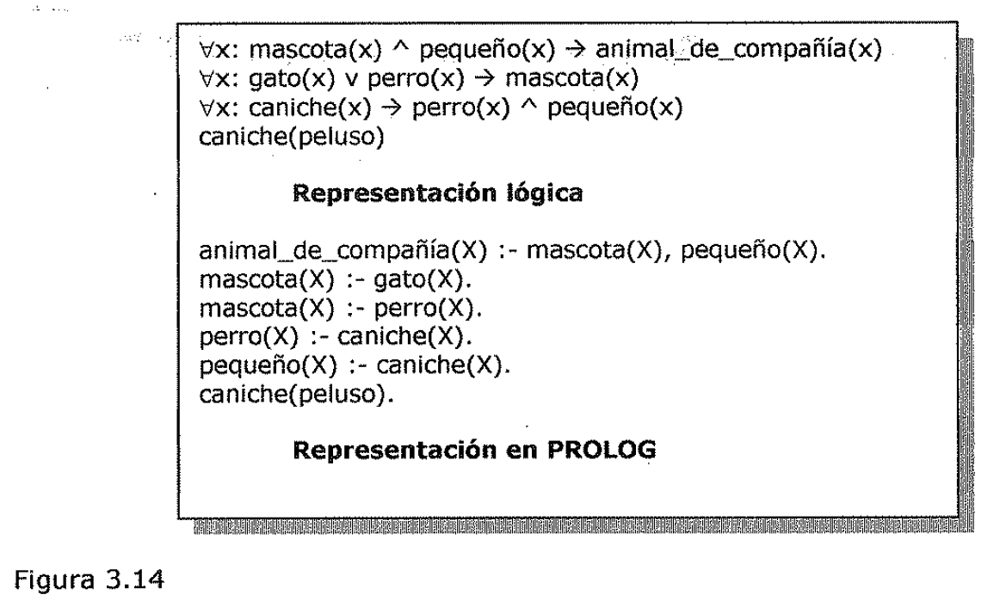

La Figura 3.14 muestra un ejemplo de una sencilla base de conocimiento
representada en una *notación lógica estimdar,* y despues en *PROLOG.* Ambas
representaciones contienen dos tipos de afirmaciones denominadas ***hechos,***
que únicamente contienen constantes (es decir sin variables) y ***reglas*** que
contienen variables.

* Los hechos representan sentencias acerca de objetos especificos.

* Las reglas representan sentencias acerca de las diferentes clases de objetos.

Observese que existen algunas diferencias sintácticas superficiales entre las
representaciones (.

lógicas y las representaciones PROLOG, como por ejemplo:

1. En la lógica, las variables están especificamente cuantificadas. En PROLOG,
 la cuantificación se realiza de un modo implicito por la forma en que las
 variables son interpretadas. En PROLOG se hace que to.das las variables
 comiencen con letras

mayusculas, y que todas las constantes comiencen con letras minusculas o
números.

1. En la lógica existen símbolos explícitos para "y" (A) y "o" (v). En PROLOG
 existe un símbolo explícito para y (,), pero no existe un símbolo explícito
 para o. En lugar de esto, la disyunción se expresa mediante una lista de
 sentencias alternativas, y cualquiera de

ellas puede proporcionar una base para una conclusión.

1. En la lógica, las implicaciones de la forma "p implica q" se escriben como p
 ➔ q. En PROLOG, la misma implicación se escribe "hacia atrás", como: q:- p.
 Esta forma es natural en PROLOG, ya que el intérprete siempre trabaja hacia
 atras sobre un objetivo,

lo que da lugar a que cada regla comience con el componente que debe emparejarse
en primer caso. Este primer componente se llama cabeza de la regla.

La principal ***diferencia entre la representación de la lógica y la de
PROLOG,*** es que ***el*** ***intérprete PROLOG fija una estrategia de
control,*** y por tanto, las aserciones en un programa PROLOG definen un camino
de búsqueda concrete para así encontrar una respuesta a cualquier pregunta.

En contraste con esto, las aserciones lógicas definen únicamente el conjunto de
respuestas que las justifica; por sí mismas no dicen nada sobre como se debe
elegir entre todas las respuestas, si es que existe más de una.

La estrategia de control PROLOG básica, que se acaba de sugerir, es simple.
Comienza con una sentencia problema, que en este caso es considerado como el
objetivo a probar; busca las aserciones que pueden probar el objetivo; considera
hechos que prueban el •objetivo directamente, y además considera cualquier regla
cuya cabeza se empareje con el objetivo.

Para decidir cuando puede aplicar una regla o un hecho al problema que le ocupa
utiliza el ***procedimiento de unificación estándar.*** Razonara hacia atrás
desde ese objetivo, hasta que encuentre el modo de terminar con las aserciones
en el programa. Considera los caminos utilizando la ***estrategia de la búsqueda
primero en profundidad,*** así. como utilizando la ***vuelta atras.*** En cada
punto en el que debe elegir, considera las opciones siguiendo el orden en que
estas aparecen en el programa. Si el objetivo tiene más de una parte de
conjuntiva, comprueba las partes en el orden en que estas aparecen, propagando
los enlaces de las variables que determinó la unificación.

1. Diferencia entre Razonamientos hacia delante y hacia atrás

El objeto de un procedimiento de búsqueda es descubrir un camino a través de un
espacio problema partiendo de un estado inicial y finalizando en un estado
objetivo. Mientras que PROLOG únicamente efectua la búsqueda a partir de un
estado objetivo en realidad existen dos direcciones hacia las que se puede
dirigir dicha búsqueda:

* Hacia delante, a partir de los estados iniciales.

* Hacia atras, partiendo de los estados objetivos.

*Razonamiento hacia delante a partir de los estados iniciales.* Se comienza por
construir un arbol de secuencias de movimientos que se pueden presentar como
soluciones, empezando por la configuración inicial en la rafz del arbol. Se
generara el siguiente nivel del arbol encontrando todas las reglas cuyos lados
izquierdos se relacionen con el nodo raiz, y que utilicen sus lados derechos
para crear nuevas configuraciones. Se creara el siguiente nivel tomando cada
nodo que se haya generado en el nivel anterior, y aplicandolo a todas las reglas
cuyos lados izquierdos se relacionen con este. Se continuara así hasta que se
consiga una configuración que se empareje con el estado objetivo.

*Razonamiento hacia atrás a partir de los estados obietivo.* Se comienza
construyendo un arbol de secuencias de movimientos que ofrezcan soluciones
empezando con la configuración objetivo en la raiz del arbol. Se generara el
siguiente nivel del arbol encontrando todas.las reglas cuyos lados derechos esten
ligadas con el nodo raiz. Estas serán todas las reglas.que, si son las únicas
que se aplican, generaran el estado que se desea. Se utilizara el lado izquierdo
de las reglas para generar los nodos en este segundo nivel del arbol. Se
gerierara el siguiente nivel del arbol tomando cada nodo del nivel previo, y
encontrando todas las reglas cuyo lado derecho este ligado con este. Entonces se
utilizaran los correspondientes lados izquierdos para generar los nuevos nodos.
Se continuara hasta que se genere un nodo que se empareja con el estado inicial.
Este método de razonamiento hacia atrás, a partir del estado final deseado, se
denomina algunas veces ***razonamiento dirigido al objetivo.***

- 1. Sistemas de reglas encaclenadas hacia atriis

Los sistemas de reglas encadenadas hacia atrás, de los cuales el PROLOG es un
ejemplo, resultan muy eficaces para la ***resolución de problemas dirigidos al
objetivo.*** Por ejemplo, un sistema interrogador probablemente utilizara un
encadenamiento hacia atrás para razonar acerca de las respuestas a las preguntas
del usuario.

En el PROLOG, las reglas están restringidas a ser cláusulas de Horn. Esto
permite crear rápidamente un indice, ya que todas las reglas que se utilizan
para deducir un hecho dado, comparten la misma cabeza de regla. Las reglas se
emparejan a través del procedimiento de unificación. La unificación intenta
encontrar un conjunto de restricciones para las variables, y así igualar un
subobjetivo con las cabezas de algunas reglas. Las reglas, en un programa PROLOG
se emparejan en el orden en el que aparecen.

Otros sistemas de encadenamiento hacia atrás permiten reglas más complejas. En
MYCIN, por ejemplo, las reglas pueden ser aumentadas con factores de certeza
probabilfsticos para reflejar el hecho de que unas reglas son más fiables que
otras.

- 1. Sistemas de regias encadenadas hacia cleRante

En lugar de dirigirse por objetivos, algunas veces se desea ser ***dirigido por
la información*** ***que se va incorporando.*** Por ejemplo, supóngase que
sentimos calor cerca de nuestra mano.

Seguramente se tendera a retirar la mano de ahf. Mientras que esto se puede
considerar como un comportamiento dirigido a un objetivo, se modela de un modo
más natural por medio de ciclos de reconocimiento de actos, característicos de
los sistemas de reglas encadenadas hacia adelante. En algunos de estos sistemas,
los lados izquierdos de las reglas se emparejan con la descripción del estado.
Las reglas que se emparejan vuelcan sus aserciones de su parte derecha en el
estado, y así el proceso se repite sucesivamente.

- 1. Combinación del razonamiento hacia adelante y hacia atrás

A veces, determinados aspectos de un problema se manejan más fácilmente
utilizando el encadenamiento hacia adelante, mientras que otros se solucionan de
un modo más sencillo utilizando el encadenamiento hacia atrás.

Considerese por ejemplo un programa de diagnósticos medicos basado en el
encadenamiento hacia adelante. Este puede aceptar, aproximadamente, una veintena
de hechos acerca de la condición del paciente, entonces trabajara hacia adelante
con dichos hechos para intentar deducir la naturaleza y la causa de la
enfermedad.

Ahora supóngase que en un momento dado el lado izquierdo de una de las reglas
este "casí satisíecho", por ejemplo si nueve de las diez precondiciones que
tuviera fuesen ya conocidas, en este caso resultaria mejor aplicar un
razonamiento hacia atrás para satisfacer la decima precondición de un modo
directo, en lugar de esperar a que el encadenamiento hacia adelante sustituya al
hecho por accidente. Tambien puede ocurrir que la decima condición requiera más
pruebas medicas. En ese caso el encadenamiento hacia atrás se puede utilizar
para interrogar al usuario.

Saber si es posible utilizar las mismas reglas tanto para el razonamiento hacia
adelante, como para el razonamiento hacia atrás, también depende de la propia
forma de las reglas.

* Si, tanto las partes derechas como las izquierdas contienen aserciones puras,
 entonces

el encadenamiento hacia adelante puede emparejar las aserciones en el lado
izquierdo de una regla, y añadir a la descripción del estado las aserciones del
lado derecho.

* Pero si se permiten los procedimientos arbitrarios como partes derechas de las
 reglas, entonces las reglas no serán reversibles. Algunos lenguajes de
 producción solo

permiten reglas reversibles, mientras que otros no.

Cuando se utilizan reglas irreversibles se debe establecer un compromiso de
búsqueda, al mismo tiempo que se escriben las reglas. Pero como ya se sugirió
antes, resulta útil pensar en hacerlo de todos modos, ya que permite al que
escribe las reglas af\adir algi'.m conocimiento de control a estas propias
reglas.

## Razonamiento bajo incertidumbre

* 1. Razonamiento simbólico bajo incertidumbre

3.5.1. Razonamiento No Monótono

*Hasta ahora, se han descrito técnicas de razonamiento para un modelo del mundo
completa, consistente e inalterable.* *Desafortunadamente, en muchos dominios de
problemas no es posible crear tales modelos.* Se han propuesto varios marcos
lógicos y métodos computacionales para poder manipular estos problemas. Veremos
dos enfoques:

*( (* • El ***razonamiento no monótono,*** en el cuál *las axiomas via las
reglas de inferencia se extienden para que sea posible razonar con información
incompleta.* Sin embargo, esos sistemas preservan la propiedad de que en un
determinado momento, una sentencia puede pensarse que es cierta, puede pensarse
que es falsa, o puede pensarse que no es ninguna de las dos.

* ***Razonamiento estadístico,*** en el que *se extiende la representación para
 permitir*

*( algún tipo de medida numerica sobre la certeza* (en lugar de simplemente
CIERTO o FALSO) para asociar a cada sentencia.

*r* I Los sistemas convencionales de razonamiento, como la lógica de predicados
de primer orden, están disenados para trabajar con información que cumple tres
importantes propiedades:

*I* ) • *La información es completa con respecto al dominio de interes.* En
otras palabras, todos los hechos necesarios para resolver el problema o están
presentes• en el sistema o pueden derivarse de ellos mediante reglas
convencionales de la lógica de primer orden.

* *La información es consistente.*

* *La (mica forma en que puede cambiar la información es que se afiadan nuevos
 hechos conforme esten disponibles.* Si estos nuevos hechos son consistentes
 con todos los

*: 1* demas hechos que ya se han afirmado, entonces ***ninguno de los hechos
pertenecientes al conjunto que eran ciertos pueden refutarse.*** *Esta propiedad
se denomina* ***monotonía.*** Desafortunadamente, si no se verifica alguna de
estas propiedades, los sistemas de razonamiento basados en la lógica
convencional son inadecuados.

*Los sistemas de razonamiento no monótono, par otro lado, se diseñan para que
puedan resolver problemas en las que quizá no aparezca alguna de estas
propiedades.*

- 1. **Razonamiento por delecto**

Se quiere usar el *razonamiento no monótono* para llevar a cabo lo que
comúnmente se denomina ***razonamiento por delecto.*** **Se *pretende llegar a
unas conclusiones basadas en lo que es más probable que sea cierto.*** En este
apartado se explican dos enfoques para lograrlo.

* Lógica no monótona.

* Lógica por delecto.

A continuación se describen dos clases comúnes de razonamiento no monótono que
pueden definirse en estas lógicas:

* Abducción

* Herencia

3.s.1.1.1. lógica no monótona

La *lógica no monótona* es un sistema que *proporciona una base para razonar
por*

***omisión,*** en donde ***el lenguaje de la lógica de predicados de primer
orden* se**

***aumenta con un operador modal M,*** que se lee como *"es consistente".* Por
ejemplo, la fórmula:

*'dx,* y: Parientes(x,y) A M esta\_de\_acuerdo(x,y) ➔ delendera(x,y) se lee
*"Para todo x e y, si x* e *y son parientes y si el hecho de que x se haya
puesto de* *acuerdo con y es consistente con el resto de las suposiciones,
entonces se concluye que* *x delendera a y".* 3.5.1.1.2. lógica por delecto

La ***lógica por delecto*** es una ***lógica alternativa para llevar a cabo
un*** ***razonamiento basado en omisiones*** en la que **se *introduce un nuevo
tipo de reglas de inferencia.*** Este enfoque permite reglas de inferencia de la
forma:

esta regla debe leerse así: *"si A es probable y es consistente asumir B,
entonces se concluye que* C".

Como se puede ver, el propósito es muy similar al de las expresiónes no
monótonas que se usaban en la Lógica no monótona. Sin embargo, existen algunas
***diferencias importantes*** C ***entre las dos teorías.***

* La primera de ellas es que *en la Lógica por delecto, las nuevas reglas de
 inferencia se usan* •*coma base para· calcular un con;unto de extensiónes.
 plausibles de la base de conocimiento.* Cada extensión se corresponde con una
 extensión consistente maxima de

la base de conocimiento. La lógica entonces admite como teorema cualquier
expresión válida en alguna extensión. Si es necesario decidirse entre las
extensiónes para poder resolver el problema, debe proporcionarse algún otro
mecanismo.

* Una segunda diferencia importante entre estas dos teorias es que *en la Lógica
 por* *delecto, las expresiónes no monótonas son reglas de inferencia en luqar
 de expresiónes* *del lenquaie. Es decir, no pueden manipularse mediante otras
 reglas de inferencia.* Esto conduce a algunos resultados no esperados. Por
 ejemplo, dadas las dos reglas:

**A:B.A:B**

sin ninguna asercion sobre A, no se puede llegar a ninguna conclusión sobre B,
ya que no se aplica ninguna regla de inferencia.

**Abducción**

La lógica estándar lleva a cabo deducciónes. Dados dos axiomas:

'dx: A(x) ➔ B(x)

Puede concluirs que B(C) por deducción.

Pero Lqué ocurre si se toma la implicacion al reves? Por ejemplo, suponga que el
axioma dado es:

'dx: Sarampión(x) ➔ Manchas(x) El axioma dice que si se tiene sarampión esto
implica que aparecen manchas rojas.

Pero suponga que lo que se observa son las manchas rojas. Podrfa ser bueno
concluir que se tiene un sarampión. Pero esta conclusión no esta permitida por
las reglas de la lógica estándar y aunque puede ser incorrecto, es posible que
sea la mejor suposición que pueda hacerse. • *La derivación de conclusiones de
esta forma es otra manera de razonamiento par delecto.* Denominamos a este
método ***razonamiento par abducción.*** El proceso de razonamiento por
abduccion puede describirse con más precisión de la siguiente forma, *"Dadas dos
fbf (A* ➔ *BJ y (BJ, para cualquier expresión A y B, si es consistente asumir A,
hacerlo".* El razonamiento abductivo no es un tipo de lógica del estilo de la
Lógica por delecto y la Lógica no monótona. En realidad, puede describirse sobre
cualquiera de ellas.

**Herencia**

El razonamiento no monótono se utiliza con mucha frecuencia en·la herencia de
los valores de los atributos desde la descripción prototipo de una clase hacia
las entidades individuales que pertenecen a la clase.

- 1. Razonamiento mínimalista

Hasta ahora se ha hablado sobre métodos generales que proporcionan formas de
describir cosas que son ciertas en general. Ahora se muestran métodos para
referirse a un tipo muy específico y útil de cosas que son ciertas en general.

Estos métodos se basan en *alguna variante de la idea de modolo mínima.* Aunque
existen algunas definiciónes diferentes sobre que constituye un modelo mínimo,
para nuestro propósito se dira que ***un modelo* es *mínima si no existen otros
modelos en las que sean***. ***ciertas menos cosas.*** La idea que hay detras
del uso de *modelos mínimos* como base para el *razonamiento no monótono sobre
el mundo* es la siguiente:

**"Existen muchas menos sentencias ciertas que falsas.** Si algo es relevante y
cierto, tiene sentido asumir que pertenece a nuestra base de conocimiento. Por
lo tanto, asuma que las únicas sentencias ciertas son aquellas que
necesariamente deben ser ciertas para que se mantenga la consistencia de la base
de conocimiento".

- * 1. **La suposición de un mundo cerrado**

*La suposición de un mundo cerrado sugiere una sencilla forma de razonamiento
mínimalista.* La suposición de un mundo cerrado dice que *las (micas obietos que
satisfacen un predicado P son aquellos que deben hacerlo.* La suposición de un
mundo cerrado es particularmente poderosa como base para razonar con bases de
diltos, Jas CUilles se asume que son completas con respecto a las propiedades
que describen.

Por ejemplo, se puede asumir sin peligro alguno que una base de datos sobre
personal puede listar todos los empleados de una empresa. Si alguien pregunta si
Gomez trabaja para la empresa, se puede responder *"no"* a no ser que aparezca
explicitamente en la lista como un empleado.

Aunque *la suposición de un mundo cerrado* es a la vez sencilla y poderosa,
*puede dar* errores en la generación de respuestas apropiadas,* ya que esta
suposición no es siempre cierta en el mundo; algunas partes del mundo no son
realmente *''posibles de* *cerrar".* Esto *se* observa cuando se sacan
conclusiones sobre ciertos hechos y luego se introducen nuevos hechos, que no
estaban presentes con anterioridad en la base de conocimiento. La suposición de
un mundo cerrado producira resultados apropiados exactamente en la misma medida
en que sea cierta la suposición de que todos los hechos positivos relevantes
están presentes en la base de conocimiento.

Aunque la suposición de un mundo cerrado captura parte de la idea de que algo
que no debe ser necesariamente cierto debería ser asumido como falso, no la
captura toda.

Posee dos limitaciones esenciales:

* Opera sobre predicados individuales sin considerar las interacciones entre los

predicados definidos en la base de conocimiento.

* Asume que todos los predicados tienen listadas todas sus instancias. Para
 manipular estos problemas, se han propuesto distintas teorías sobre la
 ***circunscripción.*** En todas estas teorias, **se *anaden nuevos axiomas a
 la base de conocimiento existente.*** El efecto de estos axiomas consiste en
 *forzar una interpretación mínima sobre una*

*parte seleccionada de la base de conocimiento.* En particular, cada axioma
específico describe una forma de delimitar (es decir, de circunscribir) el
conjunto de valores para los que un axioma particular de la teorfa original sea
cierto. Suponga, como ejemplo, que se tiene la sencilla aserción:

'ix: Adulto(x) A AB(x, aspectol) ➔ Sabe\_leer(x) Nos gustaria circunscribir AB,
puesto que nos gustaria aplicarlo únicamente a aquellos individuos a los que se
¿es aplica.

En delinitiva, lo que queremos hacer es decir algo, lo que debe ser el predicado
AB.

Para saber de que se trata, es necesario conocer para que valores se hace
cierto.

* 1.:1..3. Cuestiones sobre Ba implementación

Es importante tener en cuenta que no hay una correspondencia exacta entre las
lógicas que se han descrito y las implementaciones que se van a explicar. Las
técnicas de implementación de Razonamiento No Monotone se pueden dividir en dos
clases, dependiendo del enfoque que se da al problema del control de la
búsqueda:

* ***Primera.en profundidad,*** en la que se sigue un único camino, el más
 prometedor,

hasta que surge alguna parte de conocimiento que fuerza a abandonar este camino
e intentar otro..

* ***Primera en anchura,*** en donde se consideran igual de prometedoras todas
 las posibilidades. Todas ellas se consideran como un grupo, y se van
 eliminando algunas de ellas conforme se dispone de nuevos hechos. A veces
 puede ocurrir que solo uno de

ellos o un número muy pequeflo) resulte ser consistente con todo lo demas que se
conoce.

La resolución de un problema puede hacerse mediante un razonamiento hacia
delante o mediante un razonamiento hacia atrás. La resolución de un problema que
utiliza conocimiento incierto no es una excepción. Como consecuencia de todo
esto se pueden delinir dos enfoques:

* ***Razonar hacia delante a partir de lo que* se *conoce.*** Las conclusiones
 que se derivan de forma no monótona se manipulan de la misma forma que las que
 se derivan

de forma monótona. Los sistemas de razonamiento no monótono que soportan este
tipo de razonamiento permiten que las reglas estándar de encadenamiento hacia
delante se extiendan con cláusulas ***a-no-ser-que,*** que proporcionan la base
del razonamiento por delecto. El control (incluyendo la elección de la
interpretación por delecto) se trata de la misma forma que todas las demas
decisiones de control que realiza el Sistema.

* ***Razonar hacia atrás para determinar si alguna expresión P* es *cierta*** (o
 quizá

para encontrar un conjunto de vfnculos entre las variables que hacen que sea
cierto).

Los sistemas de razonamiento no monótono que soportan este tipo de razonamiento
pueden proporcionar alguna o todas de las siguientes características:

* Que permita cláusulas por delecto (a-no-ser-que) en las reglas hacia atrás.

* Que soporte algún tipo de debate en el que se intente producir argumentos

tanto a favor de P como en su contra.

- * 1. Implementación bilsqueda primero en profundidad

**Vuelta atras dirigida por dependencias**

Si se usa un enfoque primero en profundidad para el razonamiento no monótono,
probablemente ocurrira lo siguiente: necesitamos conocer un hecho, F, el cuál no
puede derivarse monótonamente a partir de lo que ya se conoce, pero sí puede
derivarse haciendo alguna suposición A que parezca plausible. Así, una vez hecha
la suposición A, se deriva F y entonces a partir de F se derivan los hechos
adicionales G y H. Mas tarde derivamos otros hechos M y N, aunque completamente
independientes de A y F. Un poco más tarde, aparecen nuevos hechos que inválidan
A.

Es necesario anular nuestra prueba de F, además de las de G y H ya que dependen
de F. Pero lque pasa con M y N? No dependen de F, por lo que no es lógico que
deban inválidarse. Pero si se usa una vuelta atras convencional, debe volverse
hacia atrás en las conclusiones conforme estas han sido deriiradas. Por lo
tanto, en la vuelta atras se llega a M y N, por lo que se deshacen, con el fin
de llegar a F, G, H y A.

Para empezar a tratar este problema, es necesaria una noción completamente
diferente de la vuelta atras, que debe basarse en las ***dependencias lógicas***
en lugar de en el orden cronológico en que se produjeron las decisiones. A este
nuevo método lo denominamos ***vuelta atras dirigida por dependencias,*** en
contraste con el de *vuelta atras cronológica* que se ha usado hasta ahora.

Antes de entrar en detalle en el funcionamiento de la vuelta atras dirigida por
dependencias, merece la pena indicar que aunque una de sus grandes motivaciones
es el tratamiento del razonamiento no monótono, resulta útil también en los
programas de búsqueda convencionales. Esto no es demasíado sorprendente si se
considera que un programa de búsqueda primero en profundidad crea una nueva rama
en el espacio de búsqueda una vez hecha alguna estimación "no muy precisa" sobre
algo..Si eventualmente la rarna es inadecuada, entonces se sabe que al menos una
de.las estimaciones que se han hecho era incorrecta. Esta estimación podría
estar a lo largo de la rama. • En la vuelta atras cronológica se asume que se
trata de la suposición que se ha hecho más recientemente, por lo que se vuelve a
ese punto para intentar alguna otra alternativa. Sin embargo, en ocasiones se
dispone de información adicional que ayuda a encontrar la estimación incorrecta.
Entonces, sería adecuado retractarse únicamente de esa estimación y dejar
intacto todo lo demas que hubiera sucedido hasta entonces. Esto es exactamente
lo que hace la vuelta atras dirigida por dependencias.

Si se quiere usar una vuelta atras dirigida por dependencias, es necesario
realizar las siguientes acciones:

* Asociar a cada nodo una o más iustificaciones. Cada justificación se
 corresponde con un proceso de derivación que con.duce al nodo. (Como es
 posible que un nodo se derive de distintas formas, debe permitirse la
 posibilidad de que existan múltiples justificaciones). Cada justificación debe
 contener una lista con· todos los nodos (hechos, reglas, suposiciones) de los
 que depende la derivación. •

* Proporcionar un mecanismo que cuando se produzca una contradicción entre el
 nodo y su justificación genere el conjunto "malas" de suposiciones gue están
 debajo de la justificación. El conjunto "malas" se deline como el mínimo
 conjunto de suposiciones tales que si se elimina algún elemento de este
 conjunto, la justificación no será más válida y el nodo inconsistente deja de
 ser crefble.

* Proporcionar un mecanismo gue considere el conjunto "malas" y elija una
 suposición para retirar. • •

* Proporcionar un mecanismo gue propague el resultado de la retirada de una
 suposición. Este mecanismo debe convertir en inválidas todas las
 justificaciones que dependan, aunque sea indirectamente, de la suposición
 retirada.

**Sistemas de mantenimiento de la verdad basados en justificaciones (JTMS)**

La idea de un sistema de mantenimiento de la verdad (truth maintenance system) o
TMS surge como una forma de proporcionar la habilidad de trabajar con una vuelta
atras dirigida por dependencias para poder soportar el razonamiento no monótono.

Un TMS *permite conectar las aserciones mediante una red de dependencias del
tipo* *hoja de cálculo.* Un JTMS o Sistema de mantenimiento de la verdad basado
en Justificaciones, *no conoce nada sobre la estructura de las aserciones en sí
mismas.* El (mico papel del sistema es servir como libro de anotaciones para un
sistema de resolución de problemas, que a su vez, le *proporciona tanto las
aserciones coma las* *dependencias entre las aserciones.*

**Sistemas de mantenimiento de la verdad basados en la lógica (LTMS)**

Un LTMS, Sistema de mantenimiento de la verdad basado en la Lógica es muy
similar a un JTMS. Pero se diferencia en un aspecto importante.

En un JTMS, el TMS trata los nodos de la red como atomos, lo cuál significa que
*no hay* *relaciones entre ellas* excepto aquellas que se situan explicitamente
en las justificaciones. En particular, un JTMS no tiene problemas en etiquetar
simultaneamente a Py,P. *Nose detectara una contradicción de forma automática.*
En un LTMS, por otro lado, *se pueden detectar contradicciones de este tipo*
*automáticamente.*

- * 1.. lmplementación búsqueda primero en anchura

**Sistemas de mantenimiento de la verdad basados en Suposiciones (ATMS)**

Una forma alternativa de implementar el razonamiento no monótono lo constituyen
los Sistemas de mantenimiento de la verdad basados en Suposiciones (ATMS)
(Assumption-based truth maintenance systems). Tanto en un JTMS como en un LTMS
se sigue una única lfnea de razonamiento en cada momento, y cuando es necesario
cambiar las suposiciones del sistema, surge una vuelta atras dirigida por
dependencias.

***En un ATMS,* se *mantienen en paralelo varies caminos alternativos. La
vuelta***

***atras* se *evita a expensas del mantenimiento de múltiples contextos, cada
uno***

***de los cuales* se *corresponde con un conjunto de suposiciones
consistentes.***

En los sistemas basados en ATMS, al evolucionar el razonamiento, *el universo de
contextos consistentes va podandose conforme se detectan contradicciones.* Los
contextos consistentes que quedan se usan para etiquetar las suposiciones, de
forma que indiquen el contexto en el que cada aserción tiene una justificación
válida. Las aserciones que no tienen una justificación válida en algún contexto
consistente se pueden podar por consideración del resolutor del problema.
Conforme el conjunto de contextos consistentes se va haciendo cada vez más
pequefio, el conjunto de aserciones que el resolutor de problemas puede creer de
forma consistente, se reduce.

Esencialmente, mientras que un sistema ATMS funciona en anchura, considerando
todos los posibles contextos a la vez, los sistemas JTMS y LTMS funcionan en
profundidad.

1., Razonamiento Estadistico

Hasta ahora, se han descrito varias técnicas de representación que pueden
utilizarse para modelar los sistemas de creencias en los que, en un momento
dado, o se determina que un hecho en particular es o bien cierto o bien falso, o
no se hace ninguna consideración al respecto.

En algunas resoluciones de problemas, sin embargo, puede resultar adecuado
***describir las creencias sobre las que no se tiene certeza,*** pero en las que
***existen algunas evidencias que las apoyan.*** Considere este tipo de
problemas divididos en dos grupos:

* El primero de ellos esta formado por *problemas en los que* se *da una cierta
 aleatoriedad.* Los juegos de cartas como el bridge o el blackjack son dos
 buenos ejemplos de este tipo de problemas. A pesar de que en estos problemas
 no es posible hacer una predicción sobre el mundo con absoluta certeza, si se
 dispone de conocimiento sobre las probabilidades de los distintos resultados,
 y sería deseable poder utilizar dicho conocimiento.

* El segundo tipo de problemas podría, en principio modelarse mediante las
 técnicas descritas en el capítulo anterior. *En estos problemas, el mundo no*
 es *aleatorio, sino que* se *comporta "normalmente" hasta que surge algún tipo
 de excepción.* La dificultad estriba en el hecho de que son muchas las
 posibles excepciones que se pueden producir, y deben enumerarse explicitamente
 (usando técnicas como AB y A-NO-SER-QUE). La mayoría de las tareas catalogadas
 como de sentido *com(m* pertenecen a este tipo de problemas, por ejemplo el
 razonamiento experto involucrado en los diagnósticos medicos. Para este tipo
 de problemas, puede ser muy útil algún tipo de medida estadistica tal como las
 funciones que logran hacer un resumen del mundo. En lugar de tener que
 enumerar todas las posibles excepciones que se pueden producir, es mejor
 utilizar un resumen numerico que indique la frecuencia con la que es de
 esperar que aparezca una excepción de un cierto tipo.

**La probabilidad y el Teorema de Bayes**

En muchos sistemas de resolución de problemas un objetivo importante consiste en
reunir evidencias sobre la evolución del sistema y modificar su comportamiento
sobre la base de las mismas. *Para modelar este comportamiento* se *necesita una
teorfa estadfstica de la evidencia.* *Las estadfsticas bayesianas constituyen
esta teorfa.* El concepto fundamental de las estadísticas bayesianas es el de la
probabilidad condicionada:

**P(HIE)**

La expresión anterior se lee como sigue: *la probabilidad de la hipótesis H dado
que se observe la evidencia E.* Para calcularla, es necesario tener en cuenta la
*probabilidad previa de H* (la probabilidad que se le asígnaria a H si no existe
evidencia) y la parte en la que *E proporciona evidencia de H.* Para lograrlo,
es necesario delinir un universo que contenga un conjunto exhaustivo y
mutuamente excluyente de **H**;, entre los que se intenta discriminar.

Sea,

**P(H;I E)** = la probabilidad de que la hipótesis H; sea verdad dada la
evidencia E.

**p(e Ih;)** = la probabilidad de que se observe la evidencia E dada la
hipótesis i como verdadera.

**P(H;)** = la probabilidad a priori de que la hipótesis i sea cierta,
independientemente de cualquier evidencia especifica. Estas probabilidades se
denominan probabilidades previas o a priori.

**K** = el número total de posibles hipótesis.

El teorema de Bayes se enuncia así:

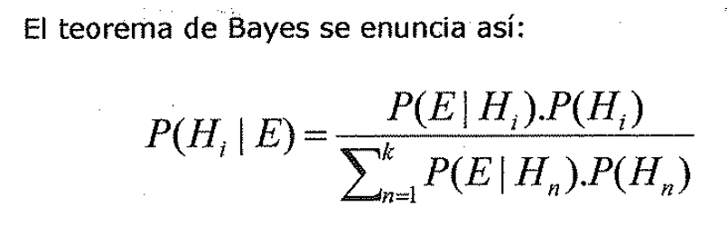

Suponga, por ejemplo, que se esta interesado en examinar la evidencia geológica
de un lugar concreto para determinar si sería un buen lugar para hacer una
excavación y encontrar un cierto mineral.

Si se conocen las probabilidades previas de aparición de cada uno de los
minerales y también se conocen las probabilidades de que si un mineral aparece,
entonces se observen ciertas características ffsicas, entonces puede utilizarse
la fórmula de Bayes para calcular, a partir de las evidencias que se reunan, la
probabilidad de que aparezcan los distintos minerales.

En realidad esto es lo que se hace en el programa **PROSPECTOR,** el cuál se ha
usado con exito como ayuda a la localización de depósitos de distintos
minerales, incluyendo cobre y uranio.

La clave para poder utilizar el teorema de Bayes como base para razonar bajo
incertidumbre consiste en ***saber exactamente que* es *lo que dice.***
Espedficamente, cuando se dice P(AI B) se esta describiendo *la probabilidad de
A condicionada a que la {mica evidl'mcia que* se *tiene es 8.* Si existe otra
evidencia relevante, debe considerarse también. Suponga, por ejemplo, que se
esta resolviendo un problema de diagnóstico médico.

Considere las siguientes afirmaciones:.

S: el paciente tiene manchas rojas,

M: el paciente tiene sarampión,

F•: el paciente tiene fiebre alta.

Sin otra evidencia adicional, la presencia de manchas rojas sirve como evidencia
de sarampión. La evidencia de la fiebre también sirve, ya que el sarampión suele
provocar fiebre. Pero suponga que ya se sabe que el paciente tiene sarampión. En
este caso, la evidencia adicional de que tiene manchas rojas en la piel no nos
dice nada sobre la probabilidad de que tenga fiebre. Alternativamente, tanto las
manchas rojas como la fiebre, por separado, constituirian una evidencia a favor
del sarampión.

***Si* se *presentan las dos cosas,* es *necesario tenerlas ambas en cuenta
para***

***calibrar el peso total de la evidencia.***

***Sin embargo, como las manchas y la fiebre no son sintomas independientes,***

***no pueden sumarse sus efectos.***

En lugar de esto, es necesario representar explicitamente la probabilidad
condicionada que surja de su conjunción. En general dado un cuerpo de evidencia
previo y alguna nueva observación E, es necesario hacer el siguiente cálculo:

*P(H* IE *e)* = *P(H* IE).*P(e* I *E,H)*

. ' *P(el E)*

Desafortunadamente, en un mundo arbitrariamente complejo, el tamano del conjunto
de probabilidades combinadas que se necesitan para calcular esta función, crece
como una función de la forma 2°, donde n es el número de proposiciones
diferentes que es necesario considerar.

Esto hace que el teorema de Bayes sea inaplicable por diversos motivos:

* El problema de la adquisición de conocimiento es inabarcable. Son necesarias
 demasíadas probabilidades. Ademas de esto, existe la evidencia empfrica
 sustancial de que las personas son malas estimadoras de probabilidades.

* El espacio que se necesitarfa para almacenar todas las probabilidades es
 demasíado grande.

* El tiempo empleado en calcular las probabilidades es demasíado grande.

A pesar de todos estos problemas, las estadfsticas bayesianas proporcionan una
base atractiva para los sistemas que razonan bajo incertidumbre. Como resultado
de todo esto, se han desarrollado distintos mecanismos que hacen uso de su
potencialidad, pero que al mismo tiempo hacen que sea tratable. En el resto de
este capítulo, se explican tres de estos mecanismos:

* Incorporación de factores de certeza a las reglas.

* Redes bayesianas.

* Teorfa de Dempster-Shafer

## Factores de certeza

+ - 1. Factores de certeza y sistemas basados en reglas

En esta sección se describe una forma practica de compromiso sobre un sistema
bayesiano puro.

El enfoque.que se va a explicar surgió en el sistema **MYCIN,** en el cuál se
intenta recomendar las terapias apropiadas para pacientes con infecciones
bacterianas. El sistema interactua con el. médico en la adquisición de los datos
clfnicos necesarios. MYCIN es un ejemplo de un ***sistema experto,*** debido a
que realiza tareas que normalmente se encomiendan a un experto humano.

Este sistema se basa en el ***uso de razonamiento probabilistico.*** MYCIN
representa la mayor parte de su conocimiento sobre diagnósticos en forma de un
***conjunto de reglas.*** ***A cada regla* se *le asocia un factor de certeza,
que representa una medida sobre la evidencia que existe de que la conclusión*
sea *el consecuente de la regla en el caso de que* se *describa el antecedente
de la misma.*** Una regla de MYCIN tfpica se parecerfa a esta:

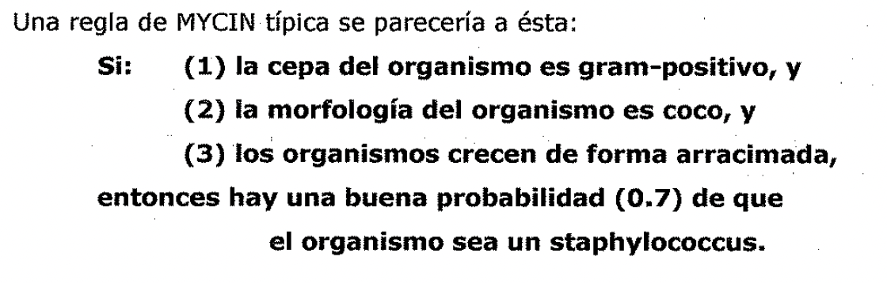

**Si: (1) la cepa del organismo es gram-positivo, y**

1. **la morfologia del organismo es coco, y**

2. **los organismos crecen de forma arracimada, entonces hay una buena
 probabilidad (0.7) de que**

**el organismo sea un staphylococcus.**

MYCIN utiliza las reglas para hacer un ***razonamiento hacia atrás*** de los
datos clfnicos disponibles ***a partir del objetivo*** de encontrar organismos
significativos causantes de enfermedades. Una vez que encuentra la identidad de
tales organismos intenta seleccionar una terapia para tratar la enfermedad. Para
poder comprender la forma en la que MYCIN utiliza información incierta, debe
responderse a dos cuestiones: *"i.Cuál es el significado de los factores de
certeza?"* y *"i.Cómo combina MYCIN las estimaciones sobre la certeza de cada
una de las reglas para hacer una estimación de la certeza de sus conclusiones?'*
Debe también responderse a otra cuestión que surge de la ya descrita
intratabilidad del razonamiento puramente bayesiano, que es: *"i.Que compromisos
se realizan en la técnica MYCIN y que riesgos llevan asociados?".* En el resto
de esta sección se responde a todos estos interrogantes.

Comencemos con una sencilla respuesta a la primera de las preguntas (a la que se
volvera más tarde para dar una respuesta más detallada).

Un factor de c:erteza (FC[h,e]) se deline en términos de dos componentes:

* MB[h,e], Una medida Centre O y 1) de la *creencia* de que la hipótesis h
 proporciona la

evidencia e. MB da una medida sobre hasta que punto la evidencia soporta la
hipótesis.

Es cero si la evidencia no soporta la hipótesis.

* **MD[h,e].** Una medida Centre O y 1) sobre la ***incredulidad*** de que la
 hipótesis h proporciona la evidencia e. MD da una medida de hasta que punto la
 evidencia soporta

la negación de la hipótesis. Es cero si la evidencia soporta la hipótesis.

A partir de estas dos medidas, se puede delinir el factor de certeza como sigue:

**FC[h,e] = MB[h,e] - MD[h,e]**

En cada regla basta un único número para delinir tanto el valor de MB como el de
MD, y por lo tanto, también el de FC, ya que *cada regla de MYCIN se corresponde
como una parte de la* *evidencia y cada parte de la evidencia o bien soporta o
bien niega una hipótesis (pero nunca* *ambas cosas).* ***Los factores* de
*certeza* de *las reglas de MYCIN los proporcionan los expertos que***

***escriben las reglas.***

Reflejan las valoraciones del experto sobre la fortaleza con que la evidencia
soporta la hipótesis. *Sin embargo, en el proceso de razonamiento de MYCIN, los
factores de certeza* *tienen que combinarse para reflejar el* uso *de las
múltiples partes de la evidencia y las* *múltiples reglas que* se *aplican para
resolver el problema.* La Figura 3.15 ilustra tres formas de combinación que es
necesario considerar. En la Figura 3.15Ca), todas las reglas proporcionan la
evidencia que relaciona una umca hipótesis. En la Figura 3.15Cb), es necesario
considerar nuestra creencia como una colección *f"* de distintas proposiciones
tomadas juntas. En la Figura 3.15Cc), la salida de una regla proporciona la
entrada de la siguiente.

1. *Que fórmulas deberfan utilizarse para plasmar estas combinaciones?* Antes de
 responder a

esta cuestión, es necesario primero describir algunas propiedades que sería
adecuado que cumplieran las funciones de combinación:

Las funciones de combinación deberfan ser conmutativas y asociativas, ya que el
orden en el que se reunen las evidencias es arbitrario.

Hasta que no se alcance la certeza, las evidencias adicionales que confirman
deben incrementar MB CY de forma similar, con las evidencias que restán
confirmación y MD).

Si las inferencias inciertas se encadenan juntas, el resultado debe ser de menor
certeza que cada una de las inferencias por separado.

Ca) Cb) Cc)

Figura 3.15

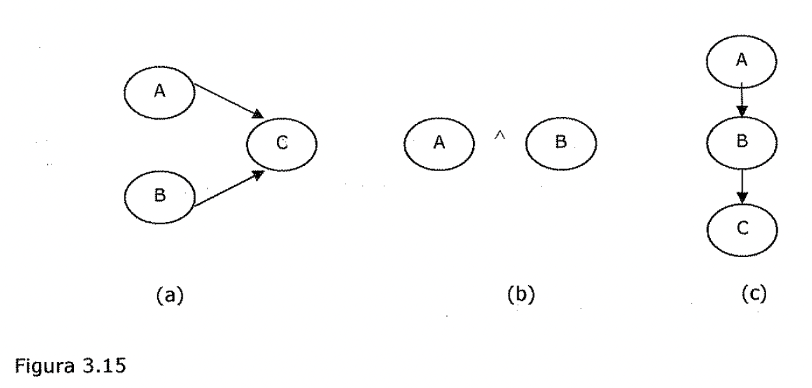

1. Si se supone que todas estas propiedades son deseables, considere en primer
 lugar la Figura 3.¿S(a), en la que ***varias partes de evidencia se combinan
 para determinar el factor de certeza de una hipótesis.*** Las medidas sobre
 la creencia o no creencia de una hipótesis dadas dos observaciónes s1 y s2 se
 calculan de la siguiente forma:

**si MD[h, s1** " **s2] = 1 en caso contrario**

**si MB[h, s1 " s2] = 1 en caso contrario**

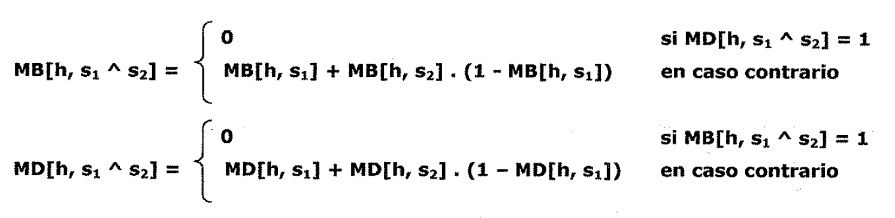

Una forma de plasmar estas fórmulas en castellano consiste en que la medida
sobre la creencia en h es 0 si no se cree en h con certeza.

En caso contrario, la medida sobre la creencia en h, dadas dos observaciónes, es
la medida sobre la creencia dada solo por una observación más algún incremento
debido a la segunda observación. Este incremento se calcula tomando primero la
diferencia entre 1 (certeza) y la creencia dada por la primera observación. Esta
diferencia es la mayor que puede afiadir la segunda observación. La diferencia
se escala mediante la creencia sobre h dada solo la segunda observación.

De forma similar puede darse una explicación parecida para la fórmula que
calcula la incredulidad.

A partir de MB y MD, puede calcularse FC. Notese que si se unen varias fuentes
de corroboracion de la evidencia, el valor absoluto de FC se incrementa. Si se
introduce una evidencia conflictiva, el *valor* absoluto de FC disminuye.

*Un sencillo ejemplo muestra como operan estas funciones.* Suponga que se tiene
una. *!* observación inicial que confirma nuestra creencia en h con MB= 0.3.
Entonces MD[h, s1] = Oy FC[h, s1] = 0.3. A continuación se hace una segunda
observación que confirma h con un valor de MB[h, s2] = 0.2. • Entonces:

MB[h, 51 A 52] =0.3 + 0.2. 0.7

MD[h, S1 A 52] = 0.0

FC[h, s, A 52] = 0.44

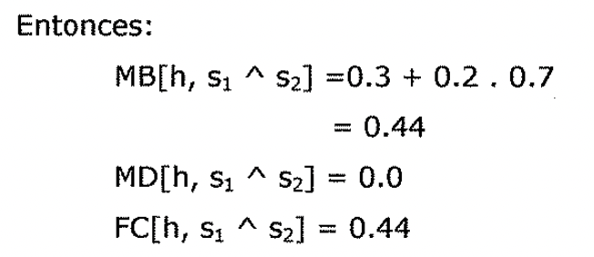

En este ejemplo se observa como una evidencia que tan solo sirve para apoyar
levemente una cierta suposición, puede acumularse y producir incrementos mayores
en los factores de certeza.

1. Considere ahora la Figura 3.¿S(b), en donde es necesario calcular el
 ***factor de certeza de una combinación de hipótesis.*** En particular, esto
 es necesario cuando se necesita conocer el factor de certeza de un
 antecedente de una regla que contiene varias cláusulas (como, por ejemplo, en
 la regla del estafilococo). El cálculo de la combinación de factores de
 certeza puede hacerse a partir de MB y MD.

Las fórmulas que usa MYCIN para la conjuncion y disyuncion de dos hipótesis son:

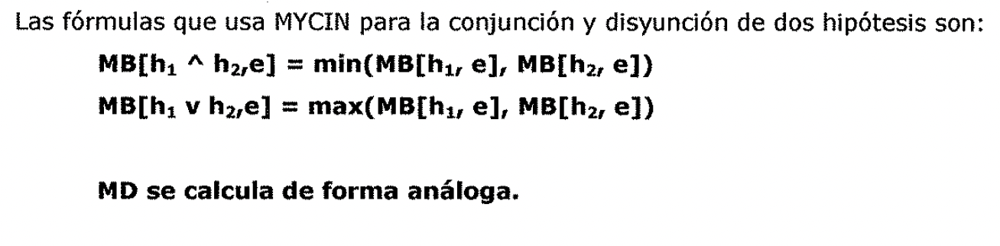

**MB[h1 v h2,e] = max{MB[h1, e], MB[h2, e]) MD se calcula de forma analoga.**

1. Finalmente considere la Figura 3.¿S(c), en donde ***las reglas* se *encadenan
 de forma que*** ***el resultado de la incertidumbre que sale de una regla* es

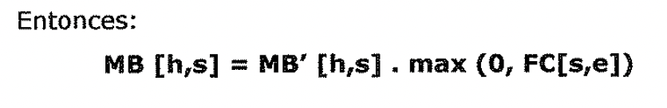
 *la entrada de la otra.*** La solución para este problema también tendrá en
 cuenta el caso en el que tenga que asígnarse a

las entradas iniciales una medida sobre su incertidumbre.

Este caso podría darse fácilmente en aquellas situaciónes en donde la evidencia
es el resultado de algún experimento o algún test de laboratorio, de forma que
los resultados no son C completamente exactos. En estos casos, el factor de
certeza de la hipótesis debe tener en cuenta tanto la intensidad con la que la
evidencia parece indicar la hipótesis como el nivel de confianza en la
evidencia.

MYCIN deline el encadenamiento de reglas como sigue. Sea MB' [h,s] la medida de
la creencia sobre h estándo completamente segura la validez de s. Sea e la
evidencia que nos lleva a creer en s (por ejemplo, las lecturas de los
instrumentos del laboratorio o los resultados de aplicar otras reglas).

Entonces:

Como en MYCIN los factores de certeza iniciales son estimaciones que
proporcionan los expertos que escriben las reglas, no es realmente necesario dar
una definición más precisa del significado de FC aparte de la ya mencionada.

- 1. Redes Bayesianas

Los Factores de Certeza representan un mecanismo de reducción de la complejidad
de los sistemas de razonamiento bayesiano mediante la realización de algunas
aproximaciones del formalismo.

*Las* ***Redes Bayesianas*** *constituyen un enfoque alternativo al de factores
de certeza, C* *en el que el formalismo de razonamiento bayesiano se preserva y*
se *conffa en la* *modularidad del mundo que se intenta modelor.* La idea
principal consiste en que para describir el mundo real no es necesario utilizar
una tabla de probabilidades enorme en la que se listen las probabilidades de
todas las combinaciones concebibles de sucesos.

La mayoría de los sucesos son condicionalmente independientes de la mayoría de
los demas, por lo que no deben considerarse sus interacciones (y por lo tanto no
se necesitan calcular todas las probabilidades).

**En lugar de esto, se *puede usar una representación más local en donde* se**

***describen grupos de sucesos que interactuen.***

- 1. Teoria de Dempster-Shafer

Hasta ahora se han descrito diversas técnicas de forma que en todas ellas se
consideraban proposiciones individuales y se asígnaba a cada una de ellas una
estimación (es decir, un único número) del grado de creencia que se garantizaba
dada la evidencia.

En este apartado, se considera una técnica alternativa denominada ***Teoria de
Dempster-***

***Shafer.*** *(.*

*Este nuevo enfoque considera conjuntos de proposiciones y les asígna a cada uno
de ellos un (* *intervalo:* con el que debe indicarse el grado de creencia.
***La creencia*** (que normalmente se denota por Bel, belief) mide ***la fuerza
de la evidencia a favor de un conjunto de proposiciones.*** El rango va de O
(que indica evidencia nula) a 1 (que denota certeza).

La verosimilitud (Pl, plausibility) se deline como:

**Pl(s) = 1 - Bel(-.s)**

Su rango también va desde 0 hasta 1 y ***mide el alcance con que la evidencia a
favor de***

***-.s deja espacio para la creencia en s.***

En particular, si se tiene evidencia cierta a favor de,s, entonces Bel(,s) es 1
y Pl(s) es O. Lo anterior también indica que el único posible valor Bel(s) es o.
• *El intervalo creencia-verosimilitud que* se *ha definido mide no solo el
nivel de creencia sobre algunas proposiciones, sino también la cantidad de
información que se tiene.* Suponga que se consideran tres hipótesis rivales: A,
B y C. Si no se tiene información, para cada una de ellas se dice que la
probabilidad de que sean ciertas está en el rango [0,1].

Conforme se acumula evidencia, el intervalo va estrechandose, representando el
incremento de confianza con que se sabe la probabilidad de cada hipótesis. Esto
contrasta con el enfoque bayesiano puro, en donde probablemente se empezarfa por
asígnar las probabilidades a priori equitativamente entre las hipótesis, de
forma que para cada una de ellas P(h) = 0,33.

Con los intervalos se clarifica el hecho de que no se posee información al
comenzar. En el enfoque bayesiano esto no es así, ya que se podría terminar con
los mismos valores en la probabilidad si se reunen volumenes de evidencia de
forma que tomados juntos sugieran que los tres valores aparecen con la misma
frecuencia. Esta diferencia puede resultar importante si una de las decisiones
que necesita hacer el programa consiste en ver si se reune más evidencia o se
actua sobre la base de la que ya existe.

Sistemas Semimticos para Representación del Conocimiento

Las buenas representaciones son la clave de una buena resolución de problemas

***En general, una representación es un conjunto de convenciones sobre la
forma***

***de describir un tipo de cosas.***

Una descripción aprovecha las convenciones de una representación para describir
alguna cosa en particular.

El hallar la representación apropiada es una parte fundamental de la resolución
de un problema. Considere, por ejemplo, el siguiente problema para nifios:

**El granjero, la zorra, el polio y el grano**

Un granjero quiere cruzar un rio llevando consigo una zorra silvestre, un polio
gordo y un saco de granos de trigo. Por desgracia, su bote es tan pequefio que
solo puede transportar una de sus pertenencias en cada viaje. Peor aun, la
zorra, si no se le vigila, se come al polio, y el polio, si no se lo cuida, se
come el trigo; de modo que el granjero no debe dejar a la zorra sola con el
polio o al polio solo con el trigo. LQue se puede hacer? C Descrito en espafiol,
la resolución del problema se lieva unos cuantos minutos porque es preciso
separar las restricciones relevantes de los detalies irrelevantes. El espafiol
no es una buena representación.

Sin embargo, descrito de manera más apropiada, el problema no toma tiempo alguno
porque se puede trazar una lfnea del principio al final en la Figura 3.16 de
manera instantanea. El trazado de dicha lfnea resuelve el problema porque cada
dibujo representa un arreglo seguro para el granjero y sus pertenencias en las
orilias del rio, y cada conexión entre los dibujos representa un cruce válido.
El dibujo es una buena descripción ya que las situaciónes permitidas y los
cruces legales quedan claramente definidos y no existen detalles irrelevantes.

Para hacer un diagrama así, primero se construye un nodo por cada forma en que
el granjero y sus tres pertenencias pueden ocupar los dos margenes del rio.
Debido a que el granjero y sus pertenencias pueden encontrarse, cada uno, en
cualquier lado del rfo, existen 21+3 = 16 arreglos, diez de los cuales son
seguros en el sentido de que nadie es comido. Los seis arreglos no seguros
colocan a la zorra, el polio y el trigo en uno u otro lado, o al polio y al
trigo en uno y otro lado, o a la zorra y al polio en uno y otro lado.

El segundo y último paso es dibujar un enlace para cada viaje permitido. Por
cada par ordenado de arreglos existe un enlace que los conecta si y solo si los
dos arreglos cumplen con dos condiciones: primera, el granjero cambia de lado; y
segunda, a lo sumo una de las pertenencias del granjero cambia de lado. Debido a
que existen diez arreglos permitidos, hay 10x9 = 90 pares ordenados, pero solo
20 de elios satisfacen las condiciones requeridas por los enlaces.

*Es evidente que la descripción nodo y enlace* es *una buena descripción con
respecto al* *problema planteado, ya que resulta fácil de hacer y, una vez que*
se *tiene, el problema resulta* *simple de resolver.* La idea importante que
ilustra este problema es que una buena descripción, desarroliada de acuerdo con
las convenciones de una buena representación, es una puerta abierta para la
resolución del problema; una mala descripción, que utiliza una mala
representación, es un obstaculo que impide la resolución del problema.

Figura 3.16

Granjero Zorra Pollo

Trigo

| --- | --- |

| | Granjero Pollo Trigo |

| Zorra |

***f.1*** \,'

Granjero Zorra Pollo Trigo

Granjero Pollo

Zorra Trigo

Granjero Zorra Pollo Trigo

Zorra Trigo

Granjero Pollo

Granjero Zorra Trigo

Pollo

Granjero Pollo Trigo.

Zoora

Granjero

Zorra Pollo

Trigo

| --- | --- |

| | Granjero Zorra Trigo |

| Pollo |

## Estructuras de ranura y relleno debiles

* 1. Estrncturas de Ranum y Relieno Debiles

Recuerdese que estas estructuras se introdujeron en un principio como un
dispositivo para soportar adecuadamente la herencia a lo largo de los enlaces
es-un e instancia. Este es un importante aspecto de estas estructuras.

***La herencia monótona* se *puede desarrollar más eficazmente con estas
estructuras***

***que con la lógica pura, y la herencia no monótona puede soportarse muy
fácilmente.***

***La razon por la que la herencia se ejecuta de un modo sencillo, es que en
los***

***sistemas de ranura y relleno el conocimiento esta estructurado como un
conjunto de***

***entidades y todos sus atributos.***

Se describirán dos enfoques de este tipo de estructuras: las redes semánticas
(semantic nets) y los marcos (frames).

Se hablara sobre las propias representaciones, así como sobre las técnicas para
razonar con ellas. De todos modos, no se hablara demasíado acerca del
conocimiento específico que deben contener estas estructuras.!

A estas estructuras de "conocimiento pobre" se ¿es denominaran *"debiles".* En
las estructuras de ranura y relleno *"fuertes"* se establecen mayores
compromisos en relación con el contenido de las representaciones.

3,6.1. Redes Semanticas

La idea principal que hay debajo de las redes semánticas es que la
***información contenida***

***en ellas se representa como un conjunto de nodos conectados unos con otros***

***mediante un conjunto de arcos etiquetados que representan las relaciones
entre los***

***nodos.*** t"

En la Figura 3.17 se muestra un fragmento de una red semántica típica. • Felino
Salvaie

es-un tiene Leon Garras

instancia

Figura 3.17

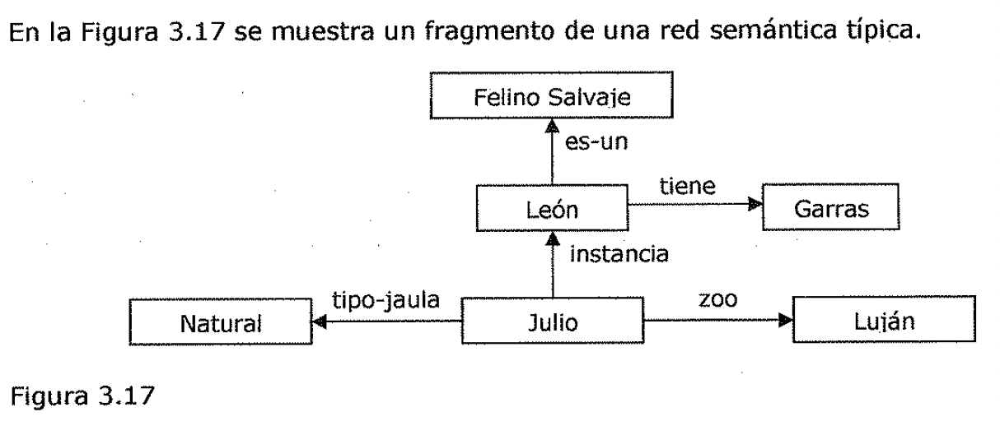

Natural

tipo-jaula Julio

zoo Luján

Esta red contiene ejemplos tanto de relaciones es-un como de relaciones
instancia, así como algunas otras relaciones más especificas del dominio como
zoo y tipo-jaula. En esta red se puede utilizar la herencia para derivar la
relación adicional:

**tiene(Julio, Garras)**

**Busqueda de intersección**

Una de las primeras formas de usar las redes semánticas antiguas fue para
*encontrar* *relaciones entre objetos,* dividiendo la activación a partir de
cada uno de los dos nodos y observando donde se encontraba dicha activación.

Este proceso se llama ***búsqueda de intersección.*** Utilizando este proceso es
posible usar la red de la Figura 3.17 de manera que se puedan responder
preguntas tales como *"iCuál* es *la* *conexión entre Luján y Natural?".* Esta
clase de razonamiento utiliza una de las grandes ventajas de las estructuras de
ranura y relleno sobre las representaciones puramente lógicas, ya que ***tienen
la ventaja de la*** ***organización del conocimiento basado en entidades,*** que
proporcionan las representaciones de ranura y relleno.

Sin embargo, para poder contestar a preguntas más estructuradas son necesarias
redes con una estructuración más alta. En los siguientes apartados se ampliara y
refinara nuestra noción de red para que estas puedan soportar un razonamiento
más sofisticado.

**Representación de predicados no binarios**

Las redes semánticas se pueden considerar como un modo natural de representar
las relaciones que podrían aparecer como instancias de los *predicados binarios*
en la lógica de predicados. Por ejemplo, algunos de los arcos de la Figura 3.17
se podrían representar en lógica como:

**es\_un(León, Felino Salvaje) instancia(Julio, Leon) zoo(Julio, Luján)**

Pero el conocimiento expresado en predicados de mayor aridad, también se puede
expresar en redes semánticas. Ya se ha visto que muchos de los *predicados
unarios* de la lógica se pueden considerar como predicados binarios, utilizando
algunos predicados de propósito muy general, como puede ser es-un e instancia.
Así, por ejemplo, hombre(Marco) se podría reescribir como:

y de este modo se ve que es mucho más fácil hacer la representación en una red
semántica.

Los predicados de *tres o más argumentos* también pueden convertirse a forma
binaria creando un nuevo objeto que represente todo el predicado, y despues
introduciendo predicados binarios para describir la relación con este nuevo
objeto de cada uno de los argumentos originales.

Supóngase que se sabe:

Marcador(Rosario Central, Newells, 3-1)

Esto se puede representar en una red semántica creando un nodo que represente el
juego específico, y relacionar despues las tres partes de la información con
dicho nodo. La Figura 3.18 muestra la red que surge al hacer esto.

Newells

equipo-visitante Partido

es-un marcador Semifinal 3-1

equipo-local Rosario Central

Figura 3.18

3.6.2. Marcos

***Un marco (frame)*** es ***una colección de atributos, normalmente llamados
ranuras (slots), con valores asociados*** *(y posibles restricciones entre los
valores),* ***que describe*** \

***alguna entidad del mundo.***

Un marco único, tornado independientemente, no suele ser útil. En lugar de eso
se construyen sistemas de marcos a partir de colecciones de marcos conectados
unos con otros en virtud del hecho de que el valor de un atributo de un marco
puede ser a su vez otro marco.

Felino

es-un -----' prom-vel es-un Felino Salvaje

es-un 80 km/h

100 km/h

rom-vel Guepardo

instancia .--...\_-prom-vel Leon 70 km/h

BsAs

prom-vel 99 km/h

piedra jaula

Figura 3.19

zoo Claudio

Julio

instancia zoo Luján

prom-vel 72 km/h

jaula Natural

**Los marcos como conjuntos e instancias** ', La ***teoria de conjuntos***
proporciona una buena base para comprender los sistemas de marcos. Aunque no
todos los sistemas de marcos se definen de este modo, aquf será así. Con este
enfoque, ***cada marco representa, ya una clase (un conjunto), ya una instancia
(un*** ***elemento de la clase).*** Para ver como funciona esto, se considerara
el sistema de marcos • que se muestra en la Figura 3.20, basado en la red
semántica de la Figura 3.19.

Figura 3.20

Feline Salvaje

es-un: cardinalidad:

\*prom-vel:

**\*zoo:**

Leon

es-un: cardinalidad:

\*prom-vel:

**\*zoo:**

Feline 116

80 km/h

Felino Salvaje

70 km/h

Julio

instancia: prom-vel: zoo: jaula:

Leon

72 km/h Luján Natural

En este ejemplo los marcos Feline Salvaje y Leon son todas las clases. El marco
Julio es una instancia.

La ***relación es-un*** que se ha estado utilizando sin una definición precisa,
**es *en realidad la relación subconjunto.*** El conjunto de los Leones es un
subconjunto de los Felinos Salvajes. El conjunto de los Felinos Salvajes es un
subconjunto de los Felinos.

La ***relación instancia*** corresponde con la relación ***elemento-de.*** Julio
es un elemento del conjunto de los Leones. As[ también es un elemento del
superconjunto de Felinos Salvajes. La transitividad de es-un, que se estudió por
encima en la descripción de herencia de propiedades, deriva directamente de la
transitividad de la relación subconjunto.

Tanto la ***relación es-un,*** como la ***relación instancia,*** tienen
***atributos inversos*** que se denominan ***subclases* y *todas las
instancias.*** Realmente no tiene importancia escribirlos explícitamente en las
instancias, a menos que sea necesario referirse a ellos. Se tendrá en cuenta que
el sistema de marcos los mantiene automáticamente, bien de un modo explícito o
bien calculandolos si es necesario.

Debido a que una clase representa un conjunto, existen dos clases de atributos
que se pueden asociar con esta. Existen atributos acerca del conjunto en sí
mismo, y también atributos para ser heredados por cada elemento del conjunto. Se
indicara la diferencia entre estos dos tipos asociando al segundo un asterisco
(\*). Por ejemplo, la clase de los Leones tiene como cardinal 25 (es decir, hay
25 leones). El atributo prom-vel es heredado por los i.ndividuos pertenecientes
a dicha clase, por lo tanto de esta manera se trasladan propiedades hereditarias
desde las superclases hacia sus instancias. El atributo zoo no tiene valor
ingresado por lo cuál se observa que mediante el sistema de marcos se pueden
también delinir prototipos.

## Estructuras de ranura y relleno fuertes

* 1. Estructuras de Ranura y R.elleno Fuertes

*Las redes semánticas y* los *sistemas de marcos implementan estructuras muy
generales para representar el conocimiento.* La Dependencia Conceptual, los
Guiones y los CYC, ***implementan poderosas teorias*** sobre la forma en que los
programas de IA pueden representar y utilizar el conocimiento sobre situaciónes
comúnes.

1. Dependencia Conceptual

***La Dependencia Conceptual {DC)* es *una teoria sobre la representación del
tipo de conocimiento sobre los everitos que normalmente aparecen en las frases
de lenguaje natural.*** El objetivo consiste en representar el conocimiento de
alguna forma que:

- * Facilite extraer inferencias de las frases.

* Sea independiente del lenguaje en el que están las frases originalmente.

Debido a estos dos requisitos, *la representación en DC de una frase no* se
*construye con primitivas que se corresponden con las palabras que aparecen en
la frase, sino* ***con primitivas*** *conceptuales que pueden combinarse para
formar el significado de las palabras en cualquier lenguaje concreto.* Esta
teoria la describió Shank (1973) y se ha implementado en varios programas que
leen y comprenden texto en lenguaje natural.

Al contrario que en las redes semánticas, que proporcionan solo una estructura
en la que pueden sítuarse nodos que representan información a cualquier nivel,
***la Dependencia Conceptual proporciona tanto una estructura como un conjunto
especifico de primitivas, a un nivel concreto de granularidad,*** en las que
puede construirse representaciones de trozos particulares de información.

La Figura 3.21 muestra un ejemplo sencillo de la forma en que se representa el
conocimiento en DC para la frase

**Yo le di un libro al hombre·**

hombre ATRANS

libro donde los símbolos tienen los siguientes significados:

* Las flechas indican direcciones de la dependencia

* La flecha doble indica los tipos de enlaces entre el actor y la acción

* P indica tiempo pasado

* ATRANS es una de las acciones primitivas utilizadas por la teoria. Indica

 transferencia de posesión

* o indica la relación OBJECT CASE

* R indica la relación RECIPIENT CASE

Figura 3.21

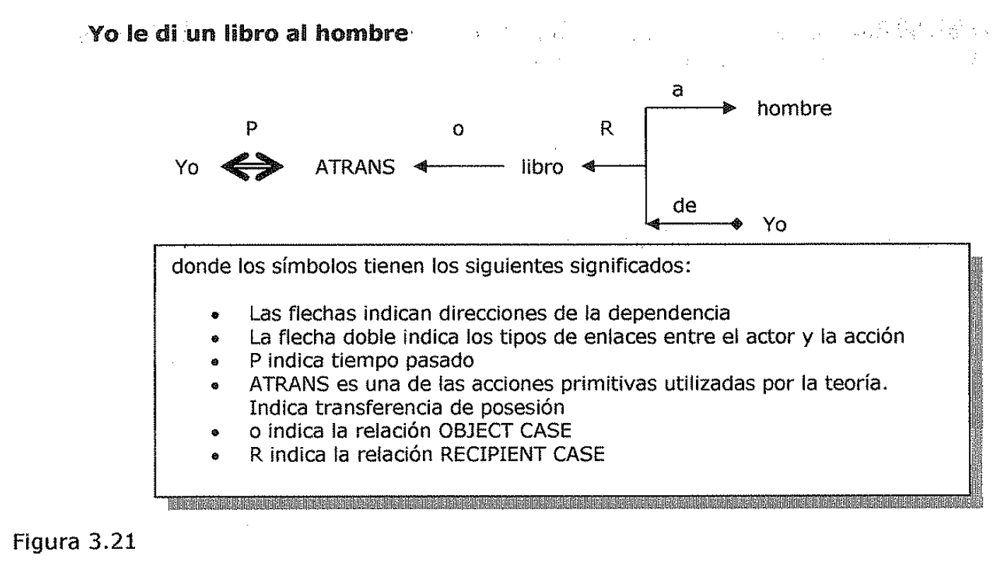

En DC, las representaciones de las acciones se construyen a partir de un
conjunto de ***acciones*** ***primitivas.*** Aunque existen diferencias
significativas sobre el conjunto exacto de acciones primitivas que proporcionan
las distintas implementaciones de DC, un típico conjunto es el siguiente:

**ATRANS PTRANS PROPEL MOVE GRASP INGEST EXPEL MTRANS MBUILD SPEAK ATTEND**

Transíerencia de una relación abstracta (dar)

Transíerencia de una localizacion física de un objeto (ir)

Aplicacion de fuerza ffsica empujar)

Movimiento de una parte del cuerpo por su dueno (patear)

Asímiento de un objeto por un actor (empunar)

Ingestion de un objeto por parte de un animal (comer)

Expulsion de algo del cuerpo de un animal (llorar)

Transíerencia de información mental (decir)

Construccion de información nueva aparte de la vieja (decidir)

Producción de sonidos (hablar)

Concentracion de un organo sensorial hacia un estimulo (escuchar)

Un segundo conjunto de bloques construidos de DC es el conjunto de las
***dependencias*** ***permitidas entre las conceptualizaciones*** descritas en
una frase. Existen cuatro categorias conceptuales primitivas a partir de las
cuales pueden construirse estructuras de dependencias. Estas son:

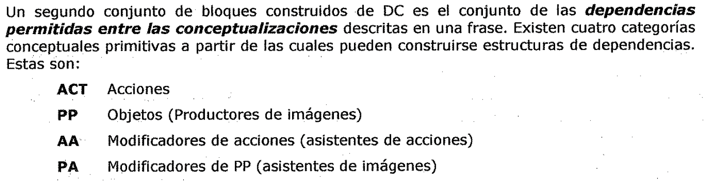

**ACT** Acciones **pp** Objetos (Productores de imagenes) **AA** Modificadores
de acciones (asístentes de acciones) **PA** Modificadores de PP (asístentes de
imagenes) Ademas, las estructu.ras de dependencia son en sí mismas
conceptualizaciones y pueden servir como componentes de estructuras de
dependencias más grandes.

Las dependencias entre conceptualizaciones se corresponden con las relaciones
semánticas entre los conceptos subyacentes. La Figura 3.22 proporciona una lista
de algunas de ellas. (.

La primera columna contiene las reglas; la segunda contiene ejemplos de su uso,
y la tercera contiene una versión en espafiol de cada ejemplo.

PP ACT

PP PA

Juan PTRANS Juan corrió

Juan doctor Juan es un doctor

ACT'--- pp

Figura 3.22

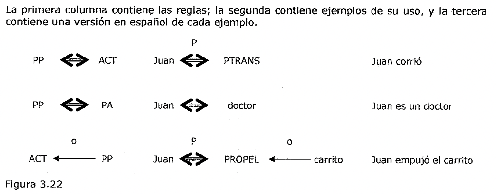

Juan PROPEL

+---- carrito Juan empujó el carrito

1. **Guiones**

DC es un mecanismo para representar y razonar sobre eventos. Sin embargo, los
eventos raramente ocurren por separado. En este apartado se presenta un
mecanismo de *representación del conocimiento de secuencias comúnes de eventos.*
***Un guión {script) es una estructura que describe una secuencia estereotipada
de eventos en un contexto concreto.*** Un guion esta formado por un conjunto de
ranuras. Asociada a cada ranura puede estar alguna información sobre que tipo de
valores puede contener, así como un valor por delecto que puede usarse si no se
dispone de ninguna otra información. Hasta ahora la definición de un guion
parece muy similar a la de marco. En este nivel de detalle las dos estructuras
son identicas. Sin embargo, debido al papel especializado que juega un guion,
podemos hacer algunas afirmaciones más precisas sobre su estructura.

La Figura 3.23 muestra parte de un guion tfpico, el guion sobre un restaurante
(tornado de Schank y Abelson, 1977). La figura ilustra los componentes
importantes de un guion.

| --- | --- |

| **Entry conditions** | Condiciones que, en general, deben satisfacerse antes de que puedan ocurrir los eventos aue se describen en el ouion. |

| **Result** | Condiciones que, en general, deberán ser ciertas despues de que ocurran los eventos aue se describen en el nuion. |

| **Props** | Ranuras que representan objetos que aparecen involucrados en los eventos descritos en el auion. |

| **Roles** | Ranuras que representan a gente que aparece involucrada en los eventos descritos en el auion. |

| **Track** | La variacion específica sobre un patron más general representado por este auion concreto. |

| **Scenes** | La secuencia de eventos qué ocurre. Los eventos se representan con un formalismo de dependencias conceotuales. |

Los guiones resultan útiles porque en el mundo real aparecen *patrones en la
ocurrencia de los eventos.* Estos patrones surgen debido a las relaciones de
causalidad entre los eventos. Los agentes llevaran a cabo una acción de forma
que entonces son capai::es de realizar otra. *Los eventos que se describen en un
guión forman una gigantesca cadena causal.* El comienzo de la cadena es el
conjunto de condiciones de entrada, las cuales hacen que los primeros eventos
del guion puedan ocurrir. El final de la cadena es el conjunto de resultados los
cuales pueden capacitar posteriores eventos o secuencias de ellos (posiblemente
descritos por otro guion).

Por medio de esta cadena, los eventos se conectan tanto con eventos anteriores
que los hacen posibles, como con eventos posteriores, a los cuales capacita.

Guion: RESTAURANTE

Track: Cafeterfa Props: Mesas

Menu

C = Comida Cuenta Dinero

Roles: L = Cliente

A= Camarero 0 = Cocinero J = Cajero

P = Propietario

Entry conditions:

L esta hambriento L tiene dinero

Resultados:

L tiene menos dinero P tiene más dinero

L no esta hambriento L esta complacido

opcional) Escena 1: Entrar

L PTRANS Len el restaurante

L ATTEND ojos a las mesas L MBUILD donde sentarse

L PTRANS a la mesa

L MOVE L a la posición sentado

Escena 2: Pedir

Menu en la mesa) (A trae el menú) (L pide el menú)

L PTRANS menú a L L MTRANS sefia a A

A PTRANS A a la mesa

L MTRANS 'necesito menú' a A A PTRANS A al menú

\ A PTRANS A asa \ A TRANS menú a L L MTRANS A a la mesa

\* L MBUILD elección de L MTRANS sefia a A

A PTRANS A a la mesa

L MTRANS 'Quiero C' a A

A PTRANS A a 0

A MTRANS (ATRANS C) a 0

O MTRANS 'no ha·/C' a A O bo (guión preparar C)

A PTRANS A a L Ir a Escena 3

A MTRANS 'no hay C' a L

volver a \*) o Ir a Escena 4 por el camino de no pagar)

Escena 3: Comer

0 ATRANS Ca A

A ATRANS Ca L

L INGEST

Opción: Volver a la escena 2 para pedir más;

en caso contrario, ir a la Escena 4) Escena 4: Salir \\

L MTRANS a A

/. A ATRANS la cuenta a L)

Figura 3.23

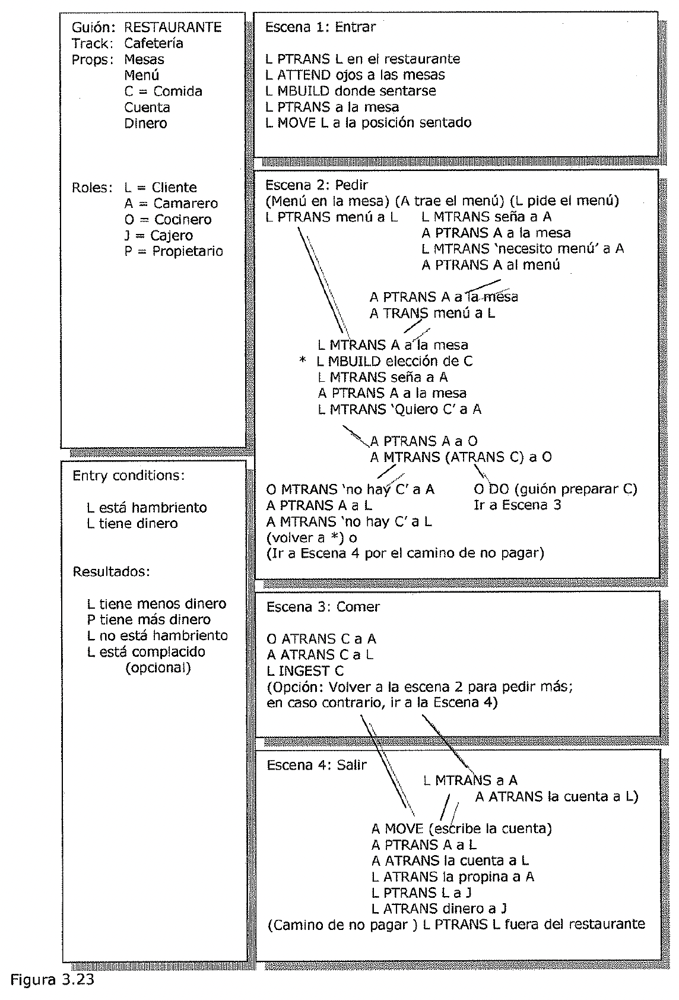

A MOV' E (escI ribe la cuenta)

A PTRANS Aa L

A ATRANS la cuenta a L

L ATRANS la propina a A

L PTRANS La J

L ATRANS dinero a J

Camino de no pagar ) L PTRANS L fuera del restaurante

3.7.3. eve

***CYC* es *un proyecto de una gran base de conocimiento cuyo propósito* es *el
de capturar el conocimiento humano de sentido común.*** El objetivo de CYC es
codificar el amplio cuerpo de conocimiento que es tan obvio que resulta fácil
olvidar indicarlo explícitamente. Esta base de conocimiento podría combinarse
con bases de conocimiento especializadas para producir sistemas que sean menos
fragiles que la mayoría de los que se disponen en la actualidad.

Como DC, *CYC representa una teorfa concreta para describir el mundo* y como DC,
puede usarse para tareas de IA tales como la *comprensión del lenguaje natural.*
Sin embargo, CYC es más comprensible; mientras que DC proporciona una teoria
concreta para la representación de eventos, CYC contiene representaciones de
eventos, objetos, actitudes y muchas otras. Ademas CYC se preocupa especialmente
de aspectos de escala, esto es, qué ocurre cuando construimos bases de
conocimiento que contienen millones de objetos.

