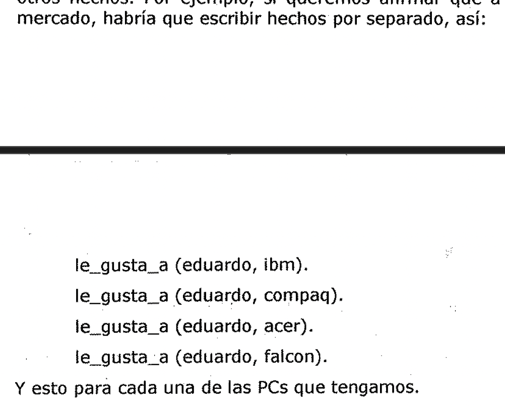
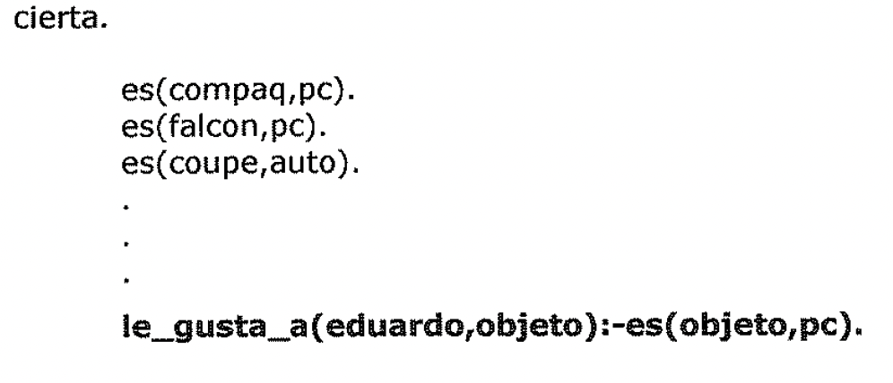
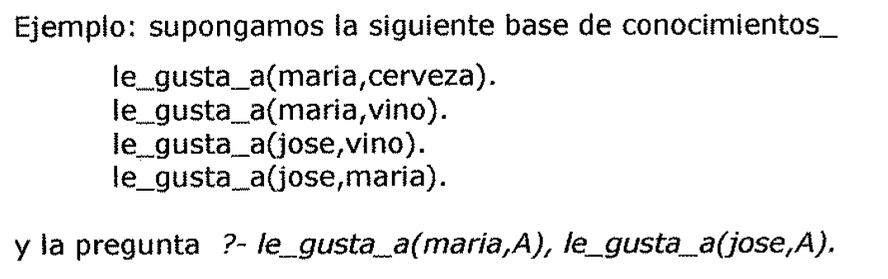
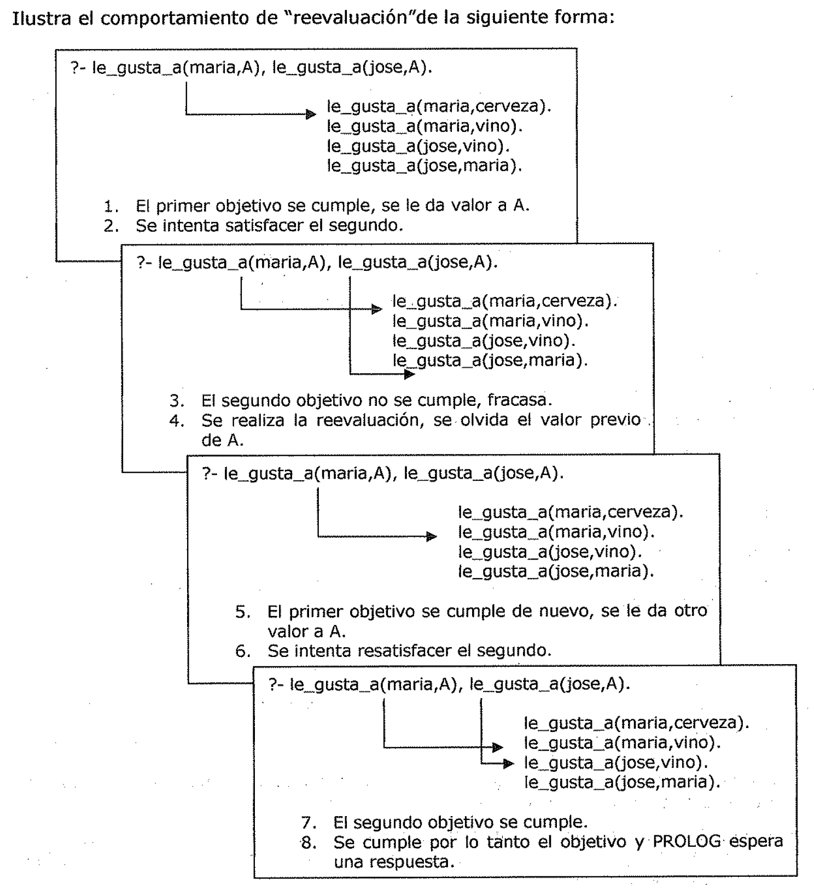
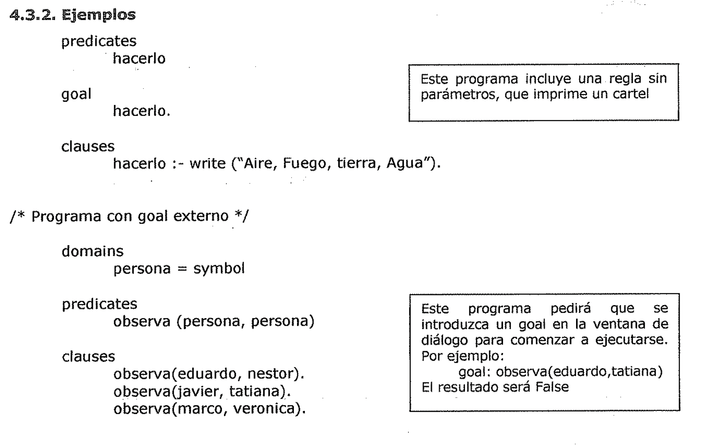
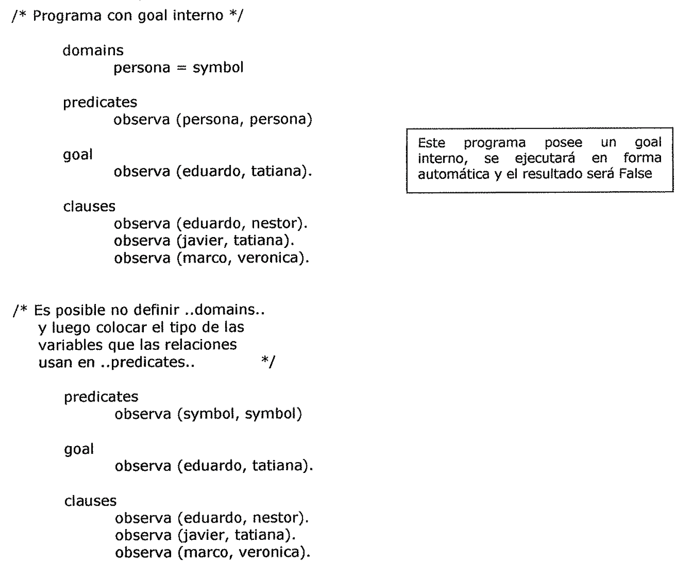
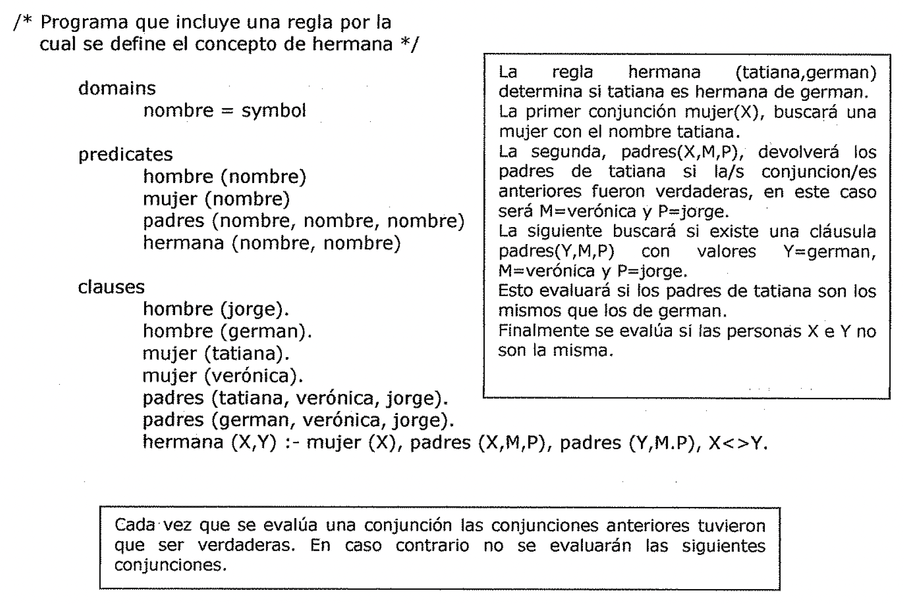
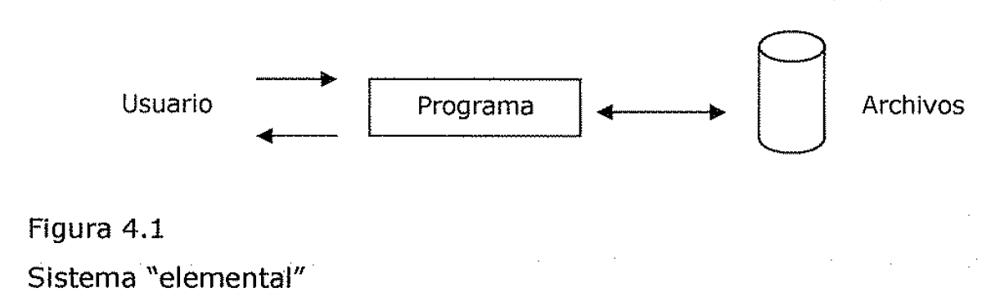
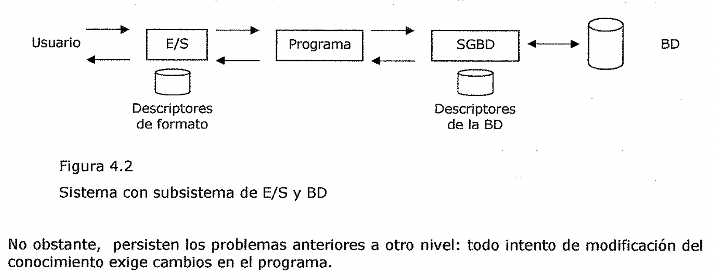
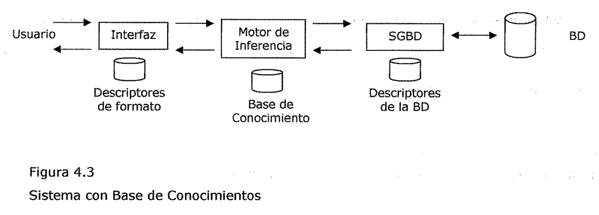

# Unidad Didáctica 4 - Eje Conceptual

Ingeniería del Conocimiento

**TEMAS**

* 1. **PROLOG (Programación Lógica) 4**

1. Una breve historia del Prolog 4

2. ¿Para que sirve Prolog?. 4

3. Lenguaje Procedural vs. Lenguaje Declarativo 4

4. Inteligencia Artificial. 5

2. **Relación con la Lógica 6**

1. Hechos 6

2. Variables. 7

3. Reglas 7

4. Clausulas 9

5. Preguntas 9

6. Conjunciones y Backtracking 9

3. **Estructura de un Programa en Prolog. 11**

1. Composición de un programa. Clausulas. Predicados. Dominios 11

4. **Ingeniería del Conocimiento 16**

1. Organización de una Base de Conocimientos 16

2. Encontrando el Experto. 16

3. Verificaciones de la BC. 17

5. **Definición de Sistema Experto. 17**

1. Definición funcional 18

2. Definición estructural. 18

6. **Armazones de Sistemas Expertos. 20**

7. **Aplicaciones de los Sistemas Expertos 21**

Ventajas de la aplicación de Sistemas Expertos. 21

Fases de la "inserción social" de los Sistemas Expertos 22

* 1. **Sistemas Expertos más conocidos 22**

* 1. ll"RCllLOG (Programación Lógica)

**PROLOG** es un lenguaje de programación que se utiliza para resolver problemas
en los que entran en juego objetos y relaciones entre objetos. Actualmente se ha
convertido en el ***principal entorno de programación para inteligencia
artificial (IA),*** una de las principales áreas de aplicación de las
computadoras que esta emergiendo. También se puede hacer virtualmente cualquier
cosa con el PROLOG como podría hacerlo con cualquier otro lenguaje de
programación, incluyendo juegos, contabilidad, gráficos y simulación. No es
siempre el lenguaje más practico o eficiente para algunas aplicaciones, pero
pueden realizarse con el.

Para los programadores que investigan en IA, el PROLOG ofrece un método
diferente al empleado por los lenguajes más familiares, tales como BASIC, COBOL,
PASCAL y C.

1., Una breve historia del Prolog

PROLOG significa *"PRProgramming LOGic",* es decir *programación basada en la
lógica* y es un lenguaje de programación de computadoras que fue inventado
alrededor de 1970 por Alain Colmerauer y sus colegas de la Universidad de
Marsella, Francia. Rápidamente el PROLOG se convirtió en el lenguaje principal
para IA en Europa, mientras que LISP (otro lenguaje de programación usado para
IA) se usaba principalmente por los programadores de los Estados Unidos. A
finales de los anos '70 comenzaron a aparecer versiones de PROLOG para
microcomputadoras. Uno de los compiladores de PROLOG más populares fue el
MICROPROLOG, pero este no ofrece la riqueza de predicados.

No existió mucho interés por el PROLOG hasta que los científicos japoneses
lanzaron su famoso proyecto de la quinta generación con el objetivo de diseñar
nuevas computadoras y software. De repente, la gente comenzó a mirar de otra
forma el PROLOG y sus posibilidades.

4.1.2.,i.Para que sirve Prolog?

Los lenguajes de computadoras son raramente buenos para todos los tipos de
problemas.

FORTRAN es usado principalmente por los científicos y matemáticos, mientras que
COBOL, es usado principalmente en el mundo comercial. A las implementaciones del
PROLOG le falta la habilidad para manejar problemas sobre "números" o
"procesamiento de texto".

En su lugar, PROLOG esta diseñado para manejar ***"problemas lógicos"*** (es
decir, problemas en los que se necesitan tomar decisiones de una forma
ordenada), intenta hacer que la computadora *"razone"* la forma de encontrar una
solución. Es particularmente adecuado para diferentes tipos de problemas de
inteligencia artificial.

## Lenguaje procedural vs declarativo

4.1.3, Lenguaje Procedural vs. Lenguaje Declarativo La mayoría de los lenguajes
de computadoras personales, BASIC, PASCAL, COBOL, etc., han sido
***procedurales.*** *Tales /lenguajes permiten al programador decirle a la
computadora lo que* *tiene que hacer, paso a paso, procedimiento por
procedimiento, hasta alcanzar una conclusión.* El ***PROLOG*** no es procedural,
es ***declarativo,*** *necesita que se declaren reglas y hechos sobre* *símbolos
específicos y luego se le pregunte sobre si un objetivo concreto se deduce*
*lógicamente a partir de* los *mismos.* Mientras que un lenguaje procedural le
exige que introduzca el recipiente y los ingredientes, un lenguaje declarativo
solo le pide los ingredientes y el objetivo. Se declara la situación con la que
quiere trabajar y donde.quiere ir, ***el propio /lenguaje realiza el trabajo de
decidir***

***como alcanzar dicho objetivo.***

La diferencia entre lenguaje declarativo y procedural es una de las razones por
la que la implementación de un lenguaje como PROLOG es una herramienta tan buena
para desarrollar aplicaciones en IA, especialmente cuando se lo compara con
otros lenguajes.

***Al trabajar con un lenguaje declarativo se da información sabre un tema***

***determinado, se definen las relaciones que existen entre estos datos y
finalmente se*** ***construyen preguntas* o *cuestionamientos sabre todo el
paquete, quedándole al lenguaje la tarea de elaborar las conclusiones mediante
un razonamiento lógico.*** 4.1,4. Inteligencia Artificial

Determinar que es un programa inteligente implica que se conoce lo que significa

***inteligencia:***

*capacidad o habilidad para percibir hechos v proposiciones v sus relaciones v
razonar sabre ellos. Esencialmente significa* **pensar.** Esta definición
implica solamente inteligencia humana, *no* admite la posibilidad de que una
máquina pueda pensar, ya que los programas no hacen la misma tarea de la misma
forma que una persona. ***Que un programa sea inteligente requiere que actúe
inteligentemente, como un ser humano.*** ***Un programa inteligente exhibe un
comportamiento similar al de un humano cuando* se *enfrenta a un problema
similar.*** • No es necesario que el programa resuelva concretamente o intente
resolver el problema de la misma manera que un humano.

Obsérvese que ***el programa no necesita pensar como un humano,*** pero ***debe
actuar como tal.*** Es difícil establecer una fecha de comienzo para lo que es
com(mente llamado IA. El primer paso se le atribuye a Alan Turing por su
invención de la computadora de programas almacenados. Determinó que un programa
podía ser almacenado como. data en la memoria de la computadora y ejecutado más
tarde, anteriormente las computadoras fueron máquinas dedicadas que debían ser
recableadas para diferentes problemas. El almacenamiento de programas permitía
entonces cambiar la función de la computadora fácil y rápidamente.

El término inteligencia artificial se imputa a Marvin Minsky, investigador def
MIT, quien.escribió un artículo titulado *"Pasos de la Inteligencia Artificial"*
(Enero 1961), que explicaba la posibilidad de hacer pensar a las computadoras.

Al final de los años '70 se había.n alcanzado varios éxitos, tales como *el
procesamiento de* *lenguaje natural, representación def conocimiento v
resolución de*• *problemas eh áreas específicas de la IA.* Los dos problemas más
significativos de IA son los ***sistemas expertos*** y el ***procesamiento de
lenguaje natural.*** A saber:

## Sistema experto

**Sistema Experto**

***Es un programa de computadora que contiene conocimientos acerca de un
determinado campo y cuando* es *interrogado responde como un experto humano.***
Contiene información *(una base de conocimientos)* y una herramienta para
comprender las preguntas y responder la respuesta correcta examinando la base
*(un motor.de inferencia).* El PROLOG tiene incorporado estructuras para la
creación de bases de conocimientos y un motor de inferencia.

**Procesamiento de lenguaje natural**

El procesamiento de lenguaje natural **es *la técnica que fuerza a las
computadoras a entender el lenguaje humano.*** Los científicos que lo estudian
esperan crear un hardware y software que permita escribir *"llevar el archivo
def prolog a la carpeta prolog"* y haga que la computadora siga dichas
directrices.

El PROLOG puede usar la idea de una base de conocimientos y un motor de
inferencias para dividir el lenguaje humano en diferentes partes y relaciones y
así intentar comprender su significado detectando *palabras clave.*

* 1. Relación con la.Lógica

Como su nombre lo indica, el ***PROLOG* se *basa en manipulaciones lógicas,
posibilita al*** ***programador especificar sus problemas en forma lógica,*** en
lugar de en términos de construcciones convencionales de programación sobre lo
que debe hacer la computadora y en que momento.

Si queremos analizar como se relaciona PROLOG con la lógica debemos establecer
primero que es lo que significa lógica: la ***lógica*** se desarrolló,
originalmente como ***una forma de*** ***representar argumentos de manera que
fuera posible comprobar si estos eran validos o no.*** Se puede utilizar la
lógica para expresar objetos, relaciones entre objetos y como pueden inferirse
de forma valida algunos objetos a partir de otros. Por ejemplo, cuando decimos
*"Eduardo tiene una PC"* estamos expresando una relación entre el objeto
*"Eduardo"* y otro *"una* *PC";* además, la relación tiene un orden específico:
ies Eduardo quien tiene una PC y no una PC quien tiene a Eduardo!. Cuando
realizamos la pregunta ¿Tiene Eduardo una PC? Lo que estamos haciendo es indagar
sobre una relación.

***PROLOG trabaja con lógica proposicional también conocida como lógica de***

***predicados o cálculo proposicional.***

PROLOG ha.ce que la computadora maneje la parte de inferir, ***tiene un motor de
inferencia***

***incorporado que automáticamente busca los hechos y construye conclusiones
lógicas.***

La programación de computadoras en PROLOG consiste en:

* Declarar algunos hechos sabre los objetos y sus relaciones.

* Definir algunas reglas sabre los objetos y sus relaciones.

* H.hacer preguntas sobre los objetos y sus relaciones.

Podemos considerar a PROLOG como un almacén de hechos y reglas, que utiliza
estos para responder las preguntas, proporciona los medios para realizar
inferencias de un hecho a otro.

Se puede considerar a PROLOG como un lenguaje coloquial, lo cuál significa que
el programador y la computadora sostienen una especie de conversación.

1. 2.1. Hechos

La primera forma de combinar un objeto y una relación es usarlos para definir un
hecho, la sintaxis de PROLOG es:

**relación** **objeto**).

Supongamos que queremos decir a PROLOG el hecho de que *"a Eduardo le gusta la
PC",* en PROLOG debemos escribir:

Observe que el objeto esta entre paréntesis y la relación le precede, lo que
quiere decir que este objeto tiene esa relación. La ***relación*** se conoce
como el ***predicado*** y el ***objeto*** como el ***argumento.*** Los
siguientes puntos son importantes:

* Los nombres de todos.los objetos y relaciones deben comenzar con una letra
 minúscula.

* Primero se escribe la relación y luego los objetos separándolos mediante comas
 y

encerrados entre paréntesis.

* Al final del hecho debe ir un punto (el carácter ".").

* El carácter "\_" en el nombre del predicado indica que todo es una única
 palabra para una relación.

* Dos hechos coinciden si sus predicados son lo mismo (se escriben de igual
 forma) y si

cada uno de sus correspondientes argumentos son iguales entre si.

Al definir relaciones entre objetos utilizando hechos, debemos prestar atención
al orden en el que se escriben los objetos entre paréntesis. De hecho, el orden
es arbitrario, pero debemos ponernos de acuerdo en un orden determinado y ser
luego consecuentes con este orden.

Por ejemplo, en el hecho le\_gusta\_a (eduardo,pc) hemos puesto el "gusta" como
el primero de los objetos entre paréntesis y el objeto "es gustado" en segundo
lugar. As[ el hecho le\_gusta\_a (eduardo,pc) no es lo mismo que le\_gusta\_a
(pc,eduardo), mientras que el primero nos indica que a eduardo le gusta la PC,
el segundo nos dice que a la PC le gusta eduardo.

Los nombres de los objetos y relaciones son completamente arbitrarios. En vez de
un término *coma* le\_gusta\_a (eduardo,pc) podríamos representar lo mismo
simplemente con a(b,c) y recordar que a significa *le\_gusta\_a,* b significa
*eduardo* y c significa *PC.* 4.2.2, Variables

En PROLOG no solo se pueden nombrar determinados objetos, sino que también **se
*pueden utilizar nombres como X que representen objetos a los que el mismo
PROLOG* les *dará valor,*** este tipo de nombres es lo que se llama
***variables.*** Cuando el lenguaje PROLOG utiliza una determinada variable esta
puede estar instanciada o no instanciada. El primer caso se da cuando existe un
objeto determinado representado por la variable, en caso contrario, una variable
no esta instanciada cuando, todavía no se conoce lo que representa.

Las variables deben comenzar con una letra mayúscula.

Cuando se intenta establecer una relación que contenga una variable, PROLOG
efectuara una búsqueda recorriendo todos los hechos que el tiene almacenados
para encontrar un objeto que pueda ser representado por la variable. Por
ejemplo, cuando preguntamos *i.Le gusta X eduardo?,* PROLOG buscara entre todos
sus hechos para encontrar cosas que le gusten a eduardo.

Una variable X, no nombra un objeto en particular en sí mismo sino que se puede
utilizar para representar objetos que no podamos nombrar. Por ejemplo no podemos
nombrar un objeto como algo que le gusta a eduardo, de forma que PROLOG adopta
una forma de expresar esto.

En vez de preguntar:

le\_gusta\_a (eduardo,Algo que le gusta a eduardo).

Podemos utilizar:

Observación:

Las variables pueden tener nombres más largos. Ej: Algo que le gusta a eduardo.

A veces es necesario utilizar una variable aunque su nombre no se utilice nunca,
supongamos que queremos averiguar Si. a alguien le gusta eduardo, pero no
estamos interesados. e.n sab!"!r quien, entonces utilizamos la variable anónima.
Esta variable es un único carácter 'de subrayado.

Se utiliza para evitar el tener que imaginar continuamente diferentes nombres de
variables i cuando no se van a utilizar en ningún otro sitio de la cláusula.

1. **Reglas**

En PROLOG se usa una regla cuando se quiere significar que un hecho depende de
un grupo de otros hechos. Por ejemplo, si queremos afirmar que a eduardo le
gustan todas las PCs del mercado, habría que escribir hechos por separado, asi:

le\_gusta\_a (eduardo, ibm).

le\_gusta\_a {eduardo.do, compaq).

le\_gusta\_a (eduardo, hacer).

le\_gusta\_a (eduardo, falcon).

Y esto para cada una de las PCs que tengamos.

En PROLOG una regla consiste en una cabeza y un cuerpo. Estas partes se
encuentran separadas mediante el símbolo ":-", que esta compuesto de un signo de
dos puntos ":" y de un **guión** "-". El":-" se **pronuncia** "si".

La cabeza describe que hecho es el que la regla intenta definir, mientras que el
cuerpo describe la conjunción de objetivos que deben satisfacer, uno tras otro,
para que la cabeza sea cierta.

es(compaq,pc).

es(falcon,pc).

es(coupe,auto).

Una forma más simple de hacerlo es decir que a Eduardo le gusta cualquier objeto
siempre que este sea una PC. Este hecho se da en forma de una regla sobre lo que
le gusta a Eduardo, en vez de dar la relación de todas las PC que le gustan a
Eduardo.

La regla es mucho más compacta que una lista de hechos. ***Las reglas hacen que
el PROLOG*** ***pase de ser solo un diccionario o una base de datos, en el que*
se *pueda buscar, a ser***

***una máquina lógica, pensante.***

Ejemplos de reglas:

**Marco compra vino si es más barato que la cerveza.**

**X es un pájaro si: (con uso de variables)**

**X es un animal y**

**X tiene plumas.**

***Una regla* es *una afirmación general sobre objetos y sus relaciones.***

As[ podemos permitir que una variable represente un objeto diferente en cada uso
diferente de la regla. Por ejemplo:

a Marco le gusta cualquiera al que le guste el vino, o en otras palabras, a
Marco le gusta algo si a esto le gusta el vino, o con variables, a Marco le
gusta X si a X le gusta el vino.

El ejemplo anterior se escribe en PROLOG de la forma siguiente:

1. Clausulas

Utilizaremos la palabra ***cláusula*** siempre que nos refiramos a ***un hecho*
o *a una regla.*** Existen dos formas de dar información a PROLOG sobre un
predicado dado, como *le\_gusta\_a.* Podemos darle tanto hechos como reglas, en
general, un predicado está definido por una mezcla de hechos y reglas. A uno y
otras se los denomina como cláusulas de un predicado. Por ejemplo consideremos
la regla:

una persona puede robar una cosa si la persona es un ladrón y le gusta la cosa y
la cosa es valiosa.

En PROLOG sería:

El predicado *puede\_robar* significa que alguna persona X puede robar alguna
cosa Y. Esta cláusula depende de las cláusulas *ladrón, le\_gusta\_a* y
*valiosa.*

1. Preguntas

, 1 Una vez que tengamos algunos hechos podemos hacer algunas preguntas acerca
de ellos. En PROLOG una pregunta se representa igual que un hecho, salvo que
delante se pone un símbolo especial:?- Por ejemplo:

?- **tiene(eduardo,pc).** lo que podemos interpretar como *tiene eduardo una
pc?.* ***Cuando se hac:e una pregunta PROLOG efectúa una búsqueda por toda la
base· de datos, localizando hechos que coincidan con el hecho en cuestión*** (Ya
se explicó en ,, puntos importantes de los hechos, cuando dos hechos coinciden),
Si se. encuentra uno..que coincida se responderá si (yes), por el contrario, si
no se encuentra, la respuesta sera no.

En PROLOG la respuesta no se utiliza para determinar que no existe nada que
coincida 'con la pregunta realizada.

## Razonamiento y búsqueda en Prolog

1. Conjunciones y Backtracking

En el caso de que se quiera contestar preguntas sobre relaciones un poco más
complejas, como *ise gustan Josey María?,* primero se debería preguntar si Jose
gusta de María y luego, si la respuesta fue yes, si María gusta de Jose. ***Esto
representa un problema con dos objetivos separados.* El *"y"*** expresa el
interés de la ***conjunción*** de los dos objetivos: lo que se quiere hacer es
satisfacer ambos, primero uno y luego el otro.. Esto en PROLOG sería:

La coma se lee "y" y separa los objetivos de una pregunta. Cuando PROLOG tiene
que satisfacer objetivos, lo hará objetivo por orden, buscando los coincidentes
en la ba.se de datos. Deberá ser necesario que se cumplan todos, en orden.

Combinando las conjunciones con el uso de variables se puede contestar por
ejemplo:

*i.Hay alga que le guste a Josey María?* Lo que se haría sería buscar primero si
hay algún A que le guste a María y luego si ese A también le gusta a Jose. Que
se expresa:

PROLOG buscara el primer objetivo en la base, si lo encuentra marcara el lugar e
intentará satisfacer el segundo, si lo logra se marcara también dicha posición
en la base de conocimientos, lo que determina que se encontró la solución.

Si por el contrario el segundo objetivo no se logra, PROLOG intentará
resatisfacer el objetivo anterior (buscar otra solución). Lo que hace es
***volver hacia atrás* e *intentar resatisfacer*** ***su anterior objetivo
comenzando, no desde el principio de la base, sino de su correspondiente marca
de posición* y** luego satisfacer el segundo objetivo.

**A** este comportamiento del PROLOG de intentar repetidamente satisfacer o
resatisfacer los objetivos de una conjunción, se lo llama ***REEVALUACION (o
backtracking).*** Ejemplo: supongamos la siguiente base de conocimientos\_

le\_gusta\_a(maria,vino).

le\_gusta\_a(jose,vino).

le\_gusta\_a(jose,maria).

Ilustra el comportamiento de "reevaluación"de la siguiente forma:

le\_gusta\_a(jose,maria).

1. El primer objetivo se cumple, se le da valor a A. <

2. Se intenta satisfacer el segundo.

le\_gusta\_a(jose,vino).

le gusta\_a(jose,maria).

1. El segundo objetivo no se cumple, fracasa.

2. Se realiza la reevaluación, se olvida el valor previo.

de A.

le\_gusta\_a(jose,vino).

le\_gusta\_a(jose,maria).

1. El primer objetivo se cumple de nuevo, se le da otro

valor a A.

1. Se intenta resatisfacer el segundo.

le\_gusta\_a(maria,vino).

le\_gusta\_a(jose,maria).

1. El segundo objetivo se cumple.

2. Se cumple por lo tanto el objetivo y PROLOG espera

una respuesta.

En este punto los objetivos se han satisfecho y la variable A contiene el valor
*vino.* El primer objetivo tiene una marca en la base en la posición del hecho
*le\_gusta\_a(maria,vino),* y el segundo en el hecho *le\_gusta\_a(jose,vino).*

* 1. Estructura de un Programa en Prolog

1., Composición de un programa. Cláusulas. Predicados. Dominios La
mayoría de los programas PROLOG están organizados en 4 etapas:

- * Clausulas

* Predicados

* Dominios

* Objetivos

,, Aunque no todas estas secciones necesitan estar presentes en todos los
programas, debe familiarizarse con todas ellas.

**Cláusulas**

Los hechos que construyó con los objetivos y las relaciones se listan en la
sección de cláusulas (clauses). La sección puede también contener reglas y otras
construcciones que se estudiaran más adelante.

**Predicados**

Los *predicados* son las relaciones. El término *"predicado"* viene.de la lógica
formal, la cuál es uno de los fundamentos iniciales de PROLOG. Siempre que su
programa vaya a usar un predicado particular en las cláusulas, necesita
declararlo formalmente en la sección *"predicates".* Una típica declaración de
predicados puede ser como esta:

**nombre predicado (argumento1, argumento2)**

Se pueden tener múltiples declaraciones de predicados, en donde el mismo
predicado este definido más de una vez, cada vez con diferentes dominios de
argumentos, como en:

nombre predicado (argumento, argumento2) nombre predicado (argumento3,
argumento4, argumento5) podrá utilizar los predicados de las dos formas. Los
diferentes argumentos tampoco tienen que ser del mismo tipo de dominio.

**Dominios**

El PROLOG necesita un nivel más de explicación antes de que un programa este
completo.

Necesita decirle los argumentos que van a usar los predicados. Para usar una
mínima cantidad de memoria y hacer a los programas más fáciles de depurar, el
PROLOG tiene muchas *comprobaciones de tipo* con las que los programadores en
Pascal están familiarizados. Necesita conocer de antemano que *"tipo"* de cosas
puede ser un argumento.

Una vez que el PROLOG sabe que argumentos van con cada predicado, necesita saber
con que dominio *(que tipo de datos)* trabajaran los argumentos. Los mismos
argumentos pueden usarse con varios predicados. Por ejemplo:

**Tipos de dominios estándares Symbol**

Hay dos tipos de símbolos:

1. Un grupo de caracteres consecutivos (letras, números y signos de subrayado)
 que comienzan con un carácter en minúscula. Por ejemplo:

eduardo eduardo\_ coche la\_ clase\_ de\_ Eduardo

1. Un grupo de caracteres consecutivos (letras y números) que comienzan y
 terminan con una marca de dobles comillas ("")

Los símbolos y cadenas parecen iguales, pero el PROLOG los interpreta
diferentes. Los símbolos necesitan más memoria que las cadenas, pero se
identifican más rápidamente cuando se ejecuta un programa. Por ejemplo:

"Eduardo" "choque contra un árbol el coche de Eduardo"

**String**

Cualquier grupo de caracteres consecutivos (letras y números) que comienza y
termina con una marca de doble comilla ("). Esto es lo mismo que el segundo tipo
de símbolos descrito anteriormente. Sin embargo, recuerde que los símbolos y
cadenas no son tratados de la misma forma por Prolog. Por ejemplo:

**"eduardo,r**

"eduardo es un *@"a&&"?lil@"* "eduardo escucha Volcán"

**Integer**

Cualquier número comprendido entre (e incluyendo) -32768 y 32767. El límite
'!ie.ne impuesto porque los enteros se almacenan como valores de 16 bits. Quince
de estos bits'representan el número y el otro bit representa el signo. Por
ejemplo:.

21444

**Real**

cualquier número real en el rango +/- 1 E-307 a +/-. 1 E+308. El formato incluye
estas opciones: signo, número, punto decimal, fracción, E (para indicar el
exponente), signo para el exponente, exponente. Los números reales pueden variar
desde los muy sencillos hasta los muy complejos. Por ejemplo:

-31615926525E-218

Ambos números son reales, pero en muchos casos sería mejor hacer que el primero
fuera entero en vez de real. El entero necesita menos memoria)

**Char**

Cualquier carácter de la lista ASCII estándar, posicionado entre dos marcas de
comillas sencilla (' '). Por ejemplo:

**File**

Para declarar un domino de archivo, se debe declarar los nombres de archivos
simbólicos de los archivos que se usaran, Solo se puede tener una declaración de
domino de archivo en un programa pero dicha declaración puede contener varios
nombres de archivos simbólicos.

Todos los nombres de archivos simbólicos deben comenzar con una letra minúscula.
Hay dos tipos de archives:

1. *Archivos predefinidos:* son los archivos que están siempre disponibles en
 PROLOG. Por ejemplo:

printer keyboard screen com 1

2. *Archivos definidos por el usuario:* son los archivos a los que uno da
 nombres. Puede usarse cualquier nombre que no este reservado por PROLOG. Por
 ejemplo:

este archivo ese archivo el\_otro\_archivo

**Objetivos {goal)**

Esta es la sección que le dice al PROLOG lo que ha de encontrar o lo que desea
que la computadora haga con la información que se le ha suministrado en las
otras tres secciones.

Normalmente un programa tendrá al menos las secciones de predicados y cláusulas,
pero no es posible tener un programa que tenga solo la sección objetivos.

Un programa PROLOG puede tener dos tipos diferentes de goal: interno o externo.

* Si un programa tiene un goal interno se ejecutara y automáticamente procederá
 a

aprobar o desaprobar el objetivo y le informara de lo obtenido.

* Si en cambio el programa posee un goal externo comenzara a,ejecutarse y Juego
 esperara que se le introduzca un objetivo. Una vez que se verifica si se junta
 el objetivo,• el programa le pedirá uno nuevo y así sucesivamente.

4.3.2, Ejemplos

predicates hacerlo goal hacerlo.

clauses hacerlo:- write ("Aire, Fuego, tierra, Agua").

/\* Programa con goal externo \*/ domains persona = symbol predicates observa
(persona, persona) clauses observa(eduardo, nestor). observa(javier, tatiana).
observa(marco, veronica).

/\* Programa con goal interno \*/ domains persona = symbol predicates observa
(persona, persona) goal observa (eduardo, tatiana).

clauses observa (eduardo, nestor). observa (javier, tatiana). observa (marco,
veronica).

/\* Es posible no definir..domains.. y luego colocar el tipo de las variables
que las relaciones usan en.. predicates.. \*/ predicates observa (symbol,
symbol) goal observa (eduardo, tatiana).

clauses observa (eduardo, nestor). observa (javier, tatiana). observa (marco,
veronica).

Este programa incluye una regla sin parámetros, que imprime un cartel

Este programa pedirá que se introduzca un goal en la ventana de diálogo para
comenzar a ejecutarse. Por ejemplo:

goal: observa(eduardo,tatiana) El resultado sera False Este programa posee un
goal interno, se ejecutara en forma automática y el resultado sera False /\*
Programa que incluye una regla por la cuál se define el concepto de hermana \*/

La regla hermana (tatiana,german) determina si tatiana es hermana de german. La
primer conjunción mujer(X), buscara una mujer con el nombre tatiana.

La segunda, padres(X,M,P), devolverá las padres de tatiana si la/s conjuncionales
anteriores fueron verdaderas, en este caso sera M=verónica *y* P=jorge.

La siguiente buscara si existe una cláusula padres(Y,M,P) con valores Y=german,
M=verónica *y* P=jorge.

Esto evaluara si las padres de tatiana son los mismos que las de german.

Finalmente se evalúa si las personas X e Y no son la misma.

domains nombre = symbol predicates hombre (nombre) mujer (nombre) padres
(nombre, nombre, nombre) hermana (nombre, nombre) clauses hombre (jorge). hombre
(german). mujer (tatiana). mujer (veronica).

\ padres (tatiana, veronica, jorge). padres (german, veronica, jorge).

hermana (X,Y):- mujer (X), padres (X,M,P), padres (Y,M.P), X<>Y.

Cada *vez* que se evalúa una conjunción las conjunciones anteriores tuvieron que
ser verdaderas. En caso contrario no se evaluaran las siguientes conjunciones.

* 1. Ingeniería deD Conocimiento

***La Ingeniería del Conocimiento es la disciplina que trata de la forma***
*en* ***que se***

***organizan, construyen y verifican las bases de conocimiento.***

***El Ingeniero de Conocimiento es el encargado de entrevistar a los expertos
reales,*** ***para aprender sabre lo que ellos saben, y poder así organizar la
información obtenida*** *('* ***para construir una Base de Conocimientos.***
4.4,1. Organización de 1.una Base de Conocimientos

Como creador de una base de conocimientos usted puede controlar la organización
de la información dentro de la misma, lo que implica que *puede haber
ordenaciones mejores o peores.*

* A menudo, una buena forma de organizar la información es ***situar los
 ·objetos más*** ***probables lo más cerca del comienzo.*** *El problema es
 decidir que objetos son las* *más y las menos probables.* Usted puede crear
 algunas veces la base de conocimientos

aleatoriamente y dejar que sea usada un periodo corto mientras registra el
número de veces que se selecciona cada objeto. Usando estas frecuencias, puede
entonces reordenar la base de conocimientos.

* Otra forma de organizar la información es ***situar cerca del comienzo de la
 base de*** ***conocimientos aquellos atributos que causan la podía de la mayor
 parte del "árbol''.*** Para bases de conocimientos grandes, de nuevo puede
 ser difícil determinar

que atributos causan el mayor efecto.

4.4.2. Em:encontrando ei Experto

La única hipótesis que se ha hecho hasta ahora es que se puede encontrar un
experto humano quien puede extraer fácilmente el conocimiento del experto.
Desafortunadamente, rara vez es este el caso. •

* Primera, a menudo ***es difícil determinar quien es* o *no es un verdadero
 experto.***

Este es un problema especialmente cuando se conoce poco sabre la materia.

* Segundo, ***dos expertos diferentes en la misma materia tienen a menudo***

***opciones contradictorias,*** lo que hace difícil saber cuál usar.

Cuando las opiniones de los expertos difieren, generalmente puede elegir entre 3
opciones útiles.

* *Primera,* puede ***seleccionar un experto* e *ignorar al otro.*** Esta es
 claramente la más fácil, pero puede significar que la base de conocimientos
 puede contener alguna información errónea. Pero la cantidad de información
 errónea no es más que la que el experto puede proporcionar.

* *Una segunda solución* es ***promediar la información.*** Esto es, intentar
 ***usar*** ***solo información que es común entre los expertos.*** Aunque esta
 opción no es tan fácil coma la primera, usted puede hacer el proceso
 ocasionalmente sin mucho problema. La desventaja es que la base de
 conocimientos este "revuelta" y no refleje el conocimiento pleno de ningún
 experto.

* *La solución final* es ***incluir el conocimiento de ambos expertos en el***

***sistema y dejar al usuario decidir.*** Podría añadir un factor de
probabilidad para cada elemento. Aunque esto puede ser aceptable en alg1.más
situaciones, para muchas aplicaciones, querrá que el sistema experto sea la
autoridad, y no querrá forzar al usuario a decidir.

* Otro punto problemático es que ***la mayoría de los expertos humanos no saben
 lo***

***que saben.*** Los humanos no pueden hacer un volcado de memoria de la misma
forma que una computadora. En consecuencia, ***puede ser difícil extraer toda
la***

* Ademas, ***algunos expertos estarán simplemente menos inclinados a perder
 tiempo*** diciéndole todo lo que saben sobre la materia.

4.4.3. Verificaciones de la BC

Si supone que ha encontrado un experto que es cooperativo *y* que da una
descripción completa de su materia de experto, todavía se enfrenta con el
problema de ***verificar que ha transcripto* e *introducido correctamente los
conocimientos en la computadora.*** En esencia, esto significa que debe
***testear la base de conocimientos.*** La pregunta es: i.Cómo se testea una
base de conocimientos?

La búsqueda exhaustiva es imposible sobre algo que no sea un conjunto de datos
extremadamente pequeño debido a la explosión combinatoria.

Esto significa que *para la mayoría de los sistemas expertos def mundo real no
hay forma de verificar completamente que la base de conocimientos sea exacta.*

* En consecuencia, la mejor solución es hacer suficiente testeo de forma que
 pueda confiar bastante en la base de conocimientos. ***Usando las técnicas de
 muestreo estadísticas, puede idear una serie de tests que producirán cualquier
 nivel de confían:ta que se desee.***

* En otro enfoque, tiene la ***autocomprobación def sistema por consistencia y
 ver que toda ia información de la base de conocimientos concuerda consigo
 misma.*** Aunque esta no encontrara todos los problemas, encontrara algunos:
 Sin embargo, dependiendo de cómo este implementada la autocomprobación, en
 algunas bases de datos grandes puede alcanzar la muralla de piedra
 combinatoria, haciendo este enfoque imposible.

De este modo, según crece el uso de los sistemas expertos, la verificación de
las bases de conocimientos sera una de las más importantes áreas de
investigación.

* 1. Definición de Sistema Experto

Asumiendo el riesgo que comporta toda simplificación, podríamos concretar en dos
las *ideas claves que han conducido a la construcción de los llamados "sistemas
expertos" y a su popularización.*

1. Por una parte, el ***énfasis en la representación, adquisición y uso def
 conocimiento especializado:*** lo que diferencia específicamente a una persona
 experta en un área del saber de otra que no lo sea radica más sus
 conocimientos concretos sobre el área en cuestión que en sus capacidades
 generales para resolver problemas (Elstein et al.; 1978).

2. Por otra, el ***reconocimiento de que los sistemas, además de resolver
 problemas, deben poseer otros atributos que se suponen propios de los
 expertos humanos:***

* Capacidad para adquirir nuevos conocimientos *y* para matizar o perfeccionar
 los que ya poseen.

* Capacidad para justificar sus conclusiones.

* Capacidad para explicar por que hacen sus preguntas cua.ndo están intentando
 resolver un problema.

* Capacidad conversacional para todo ello.

## Definición funcional de sistema experto

4.!5.:1.. Definición f1.nacional

***Para que un sistema informático pueda llamarse "experto",*** ha de satisfacer
un criterio similar al conocido *"test de Turing".* Es decir, que ***vista como
una "caja negra", sea*** ***indistinguible por su comportamiento de un experto
humano.*** El "comité de Sistemas Expertos" de la British Computer Society da la
siguiente definición (cf. *("* Naylor, 1983):

" se considera que un sistema experto es:

* la incorporación en un ordenador de un componente basado en el conocimiento

* que se obtiene a partir de la habilidad de un experto,

* de forma tal que el sistema pueda dar consejos inteligentes o tomar decisiones

inteligentes...

* Una característica adicional deseable, y que para muchos es fundamental, es

que el sistema sea capaz, bajo demanda, de justificar su propia linea de
razonamiento de una forma inmediatamente inteligible para el que lo usa".

Hayes Roth(1984a), sin dar exactamente una definición, concreta algo más, dando
la siguiente relación de funciones que un sistema experto debe ser capaz de
realizar:

* Resolver problemas muy difíciles tan bien o mejor que un experto humano.

* Razonar heurísticamente, utilizando reglas que los expertos humanos consideran

eficaces.

* Interactuar eficazmente yen lenguaje natural con las personas.

* Manipular descripciones simbólicas y razonar sobre ellas.

* Funcionar con datos erróneos y reglas imprecisas.

* Contemplar simultáneamente múltiples hipótesis alternativas.

* Explicar por que plantean sus preguntas.

* Justificar sus conclusiones.

## Definición estructural de sistema experto

4.!5.2. Definición estructural

Habitualmente, cuando diseñamos un sistema informático para resolver una clase
de problemas, *mezclamos en el código,* de manera más.o menos desordenada, *las
conocimientos* *concretos para abordar problemas de esa clase y las
procedimientos que, actuando sabre esos* *conocimientos, permiten resolver cada
problema especifico.* Ahora bien, puesto a diseñar un sistema con unas
especificaciones. funcionales que. satisfagan las características enunciadas
anteriormente, es aconsejable ***separar claramente los dos*** ***componentes:
conocimientos y procedimientos.*** De este modo sera más fácil conseguir.

que el sistema posea dos características básicas:

* Flexibilidad para adquirir y modificar sus conocimientos.

* Transparencia en la explicación de sus razonamientos y conclusiones.

Ello se traduce en la aparición de un nivel estructural nuevo en el diseño de
los sistemas, que, siguiendo a Sowa (1984), podemos ilustrar con las siguientes
fases evolutivas:

1. En un ***"sistema elemental", el programa contiene no solo el conocimiento y
 los procedimientos que hacen uso de el, sino también las informaciones sobre
 la forma de comunicación con el usuario y las formas de acceder a los
 datos*** (Figura' 4.1). Esta concepción estructural plantea el doble.
 problema de que las posibles decisiones de modificar las estructuras de
 datos, por una parte, y el modo de comunicación con el usuario, por otra,
 exigen cambios en el programa, Y *son bien conocidas las consecuencias
 negativas que, par*

*efectos laterales, pueden provocar las "pequeñas cambias" en un programa
compleja,* Usuario Programa

Archivos

Figura 4.1

Sistema "elemental"

1. Las soluciones a esos problemas son bien conocidas. Por una parte, ***el
 programa se***

***independiza de los formatos de comunicación con el usuario*** gracias a la
capa de entrada-salida del sistema operativo. Por otra, ***se independiza de las
estructuras de datos*** ***mediante el uso de un sistema de gestión de bases de
datos,*** como indica la Figura 4.2.

Usuario **0**

j Programa I

#### LJ LJ

Descriptores de formato

Descriptores de la BD

Figura 4.2

Sistema con subsistema de E/S y BD

No obstante, persisten los problemas anteriores a otro nivel: todo intento de
modificación del conocimiento exige cambios en el programa.

1. En. un ***sistema experto se independiza el conocimiento de los
 procedimientos que hacen uso de el,*** por tanto, dos módulos diferenciados:
 ***la base de conocimiento*** y• ***el motor de inferencia,*** como se
 observa en la Figura 4.3.

Usuario\_ I

Interfaz

Motor de Inferencia

SGBD

I • ► LJ BD

#### LJ LJ

Descriptores Descriptores

de formato Base de de la BD Conocimiento

Figura 4.3

Sistema con Base de Conocimientos

Asi, podemos distinguir tres ***componentes estructurales básicos*** en un
sistema experto:

La **Base de hechos** (como se suele denominar a lo que en la figura aparece como
Base de Datos), que contiene el conocimiento declarativo, a nivel de datos,
sobre el problema particular que en un momento dado se intenta resolver y sobre
el estado del sistema en cada instante.

La **Base de Conocimiento,** formada por el conocimiento específico y
procedimental acerca de la clase de problemas en los que el sistema es experto.

El **Motor de inferencia,** que controla al resto del sistema en sus funciones
deductivas.

Por otra parte, tres son los ***tipos de personas que se relacionan con un
sistema experto:*** El **usuario final,** que dialoga con el sistema para
resolver problemas o para aprender.

EL **experto humano,** que comunica su conocimiento para construir el sistema.

El **ingeniero de conocimiento,** que diseña las estructuras de datos más
adecuadas para la representación del conocimiento y que traduce a tales
estructuras (bien directamente o construyendo herramientas adecuadas) los
conocimientos del experto humano.

Hay que señalar que la idea de separar los conocimientos de los procedimientos
de inferencia no es nueva: estaba ya presente en el GPS (General Problem Solver)
de Newell et al. (1959).

Lo que diferencia específicamente a la línea de trabajo actual sobre sistemas
expertos de los trabajos *"clásicos"* sobre resolución automática de problemas
son los dos puntos que señalábamos al principio:

concentrarse en áreas muy especificas del saber y no en *"problemas generales"*
y

+ dar importancia a que los sistemas puedan explicar sus razonamientos y
 justificar sus conclusiones al usuario.

Esto último obliga a considerar otro subsistema (Justificación y Explicación)
para esas funciones, además de la interfaz para comunicación en lenguaje próximo
al natural. Puede, asimismo, construirse otra interfaz para que el experto
humano transfiera su conocimiento o perfeccione el que ya tiene el sistema.
Cuanto más elaborado sea este modulo menos C necesario sera la intervención del
ingeniero de conocimiento en esa fase de adquisición de conocimiento.

Si bien las expresiones ***"Sistema Experto"*** y ***"Sistema basado en
Conocimientos"*** suelen utilizarse indistintamente y de manera intercambiable,
parece que la primera podría asociarse de manera más natural con la *"visión
funcional",* mientras que la segunda haría referencia a la *"visión
estructural".*

## Armazones de sistemas expertos

* 1. Armazones de Sistemas Expertos

En un principio, los sistemas expertos que se construían partieron de cero,
generalmente en LISP. Pero tras haber creado varios sistemas de esta manera, se
vio claro que, a menudo, *tenían bastantes puntos en común.* En concreto, desde
que los sistemas se creaban como un conjunto de representaciones declarativas
(reglas en su mayor parte) combinadas con un intérprete para esas declaraciones,
*fue posible separar el intérprete y el conocimiento* *específico def dominid,*
y as( ***se pudo crear un sistema capaz de construir nuevos*** ***sistemas
expertos sin más que añadir nuevos conocimientos correspondientes al***
***dominio de/ nuevo problema.*** Los intérpretes resultantes se llaman
***armazones*** *(shells).*

Un ejemplo significativo de lo que es un armazón lo constituye EMYCIN (de Empty
MYCIN) Buchanan y Shortliffe, 1984), que se derivó de MYCIN.

En este momento hay disponibles comercialmente varios armazones que sirven como
base para muchos de los sistemas expertos que actualmente se construyen. Estos
armazones proporcionan mucha mayor flexibilidad a la hora de la representación
del conocimiento y del razonamiento frente a la proporcionada por MYCIN.
*Típicamente tienen coma base reglas, marcos, sistemas de mantenimiento de la
verdad y otros muchos mecanismos de razonamiento.*

* Los primeros armazones de sistemas expertos proporcionaban mecanismos para la

***representación del conocimiento, el razonamiento y la explicación.***

* Mas tarde, se ¿es añadieron herramientas para la ***adquisición de/
 conocimiento.***

* Pero conforme aumenta la experiencia a la hora de utilizar estos sistemas para
 resolver problemas del mundo real, parece evidente que los armazones de los
 sistemas expertos necesitaban, además, hacer algo más: necesitaban facilitar
 las cosas para ***integrar sistemas expertos con otros tipos de programas.***

Los sistemas expertos no pueden actuar aislados, algo que sus homólogos humanos
si pueden hacer. Los sistemas expertos necesitan acceder a bases de datos
colectivas, y acceder a ellas supone ser controlados igual que lo son otros
sistemas. A menudo son imbuidos dentro de programas de aplicación más grandes
que usan técnicas de programación convencionales principalmente.

*De modo que una de las características importantes que debe tener un armazón es
un interfaz fácil-de-usar entre un sistema experto escrito con el armazón y un
gran entorno de programación, que probablemente sera más convencional.*

* 1. Aplicaciones de ios Sistemas Expertos

## Ventajas de sistemas expertos

1. Ventajas de la aplicación de Sistemas Expertos

La utilidad de un sistema experto se basa principalmente en la ***eficacia* y
*conveniencia.***

- 1. A diferencia de un experto humano que tiene que dormir, comer, descansar,
 tomarse vacaciones y otras cosas, el sistema experto esta accesible para
 usarse veinticuatro horas al dia. todos los días del año.

2. Ademas se pueden crear muchos sistemas expertos, mientras que el número de
 expertos humanos puede ser limitado, lo cuál hace virtualmente.imposible en
 muchas situaciones tener un experto disponible cuando se necesita.

3. Ademas, a diferencia de los humanos, los expertos informatizados nunca
 mueren, llevándose el conocimiento con ellos. El conocimiento de un sistema
 experto puede copiarse y almacenarse fácilmente siendo excepcional la perdida
 permanente del conocimiento del experto.

4. Otra ventaja de un Sistema experto sobre los expertos humanos es que el
 experto

informatizado esta siempre rindiendo al máximo. Cuando un experto humano se
cansa, puede resentirse la fiabilidad del consejo del experto. Sin embargo el
experto informatizado generara siempre la mejor opinión posible, dentro de las
limitaciones de su conocimiento.

5. Una desventaja menos importante de un sistema experto es su falta de
 personalidad. Probablemente se habrá dado cuenta de que no todas las
 personalidades son compatibles. Si no se lleva bien con un experto, puede
 tener reservas para utilizar el conocimiento de un experto. La situación
 contraria también es cierta: un experto humano a quien no le guste usted
 puede no ser capaz de proporcionarle información fiable.

6. Una ventaja final de un sistema experto es que después de tener un experto
 informatizado. puede adquirir un nuevo experto simplemente copiando el
 programa de una m13quina a otra. Un humano necesita largo tiempo para
 convertirse en un experto en ciertos campos, lo cuál hace difícil adquirir
 nuevos expertos humanos.

1. Fases de la "inserción social"·de los Sistemas Expertos

Hayes-Roth (1983) esquematiza en la Figura 4.4 la secuencia de ideas,
actividades y problemas que se suceden desde que se concibe la posibilidad de la
construcción de un sistema experto en una determinada área de conocimiento hasta
que el sistema se integra en las estructuras industriales y sociales y,
eventualmente, contribuye a la transformación de estas.

Poco conocidos

Idea Innovación Experto

Ingeniero de

**conocimiento**

Diseño Recursos

Escasez herramientas y especialistas

Rigidez Estructuras

Inercia

cultural Hardware Ventajas Transformación

Software --------i-----'

Formación Reorganización

Industria y

Figura 4.4

* 1. Sistemas Expertos más conocidos

**Evolución de los sistemas expertos,**

Mas

**conocimiento**

sociedad más basadas en conocimiento De acuerdo con Cuena (1984, 1985a,b),
podemos distinguir cuatro etapas en la evolución histórica de los sistemas
expertos:

**Etapa de invención (1965-1970):** en la que se construyen sistemas que.hoy
consideramos precursores, algunos de los cuales siguen utilizándose, por
ejemplo: C **DENDRAL,** desarrollado en la Universidad de Stanford, deduce la
estructura química molecular de un compuesto orgánico a partir de su formula y
de datos espectrográficos y de resonancia magnética nuclear (Buchanan et al.,
1969), y utilizado por varias empresas farmacéuticas americanas a través.de la
red de información medica Sumex- Aim.

**MACSYMA,** en el MIT, experto en cálculo diferencial e integral mediante
manipulación simbólica de expresiones algebraicas (Martiny Fateman, 1972), y
comercializado por Simbolics.

**Etapa de prototipos (1970-1977):** en la que se diseñan los sistemas expertos
más conocidos actualmente, por ejemplo:

**INTERNIST,** en la Universidad de Pittsburgh, para diagnóstico en medicina
interna (Pople et al., 1975; Myers y Pople, 1977). Este sistema es, por cierto,
una excepción, en el sentido de que abarca un campo de saber relativamente
amplio: alrededor del 80% de la medicina interna, según sus autores. Una de las
principales críticas que ha recibido ha sido, precisamente, sobre la poca
profundidad de sus conocimientos médicos; por ello, se han desarrollado
versiones posteriores (la última se llama **CADUCEUS,** cf. Myers et al., 1982)
que trata de incluir posibilidades de razonamiento basadas en conocimientos
anatómicos y fisiológicos.

**MYCIN,** en la Universidad de Stanford, para diagnósticos y tratamientos de
enfermedades infecciosas (Shortliffe, 1976).

**CASNET,** en la Universidad de Rutgers, para diagnóstico y tratamiento en
oftalmología (Weiss et al., 1978).

**PROSPECTOR,** en el Stanford Research Institute, para exploración geológica
(Duda et al., 1976). Especialmente conocido desde que con su ayuda se descubrió
un importante depósito de molibdeno, valorado en 100 millones de d61ares, en el
estado de Washington.

**Etapa de experimentación (1977-1981):** en la que las ideas obtenidas sobre la
representación del conocimiento en los prototipos se van asentando, y aparecen
los "sistemas esenciales" o "armazones", con los que se desarrollan rápidamente
otros muchos sistemas expertos.

*Un sistema esencial (también llamado "sistema vacío" o "shell") viene a ser el
resultado de "eliminar" el conocimiento de la base de conocimiento v conservar
todos los demás módulos.* c;; Es así una herramienta potente para construir
sistemas expertos en otras áreas del saber distintas de la original, si bien
presenta la eliminación de la representación del conocimiento ha de hacerse
necesariamente en estructuras prefijadas.

Asf, con **EMYCIN** (Esencial MYCIN, cf. Van Melle, 1980), se construyeron
**PUFF** (para enfermedades pulmonares, ef. Kuntz et al., 1978), **CLOT(para**
problemas de coagulación cf. Bennet y Goldman, 1980), **HEAMED** (para
psicofarmacología, cf. Heiser y Brooks, 1978),etc. Se dotó además, a EMYCIN de
módulos de uso general para comunicación, **BAOBAB** (Bonnet 1984), para
adquisición y modificación del conocimiento, **TEIRESIAS** (Davis, 1979) para
explicación y funciones de tutoría, **GUIDON** (Clancey, 1979). Sin embargo
otros sistemas diseñados en Stanford no pudieron hacer uso de EMYCIN debido a
que el conocimiento exigía la consideración de atributos con valores cambiantes
en el tiempo, **VM** (pc¥ra. cuidados intensivos, cf. Shortliffe et al., 1981).

De manera similar, de PROSPECTOR se derivo **KAS** (Knowledge Acquisition
System, Duda et . J al., 1978) y de CASNET, **EXPERT** (Weiss y
Kulikowski,1979).

**Etapa de industrialización (desde 1981):** ano en que se fundó la primera
empresa dedicada a sistemas expertos y herramientas para su desarrollo,
Teknowledge.

En esta etapa diversas empresas establecidas (Fairchild, Xerox, Texas, etc.) se
interesan por este nuevo campo y se crean otras nuevas dedicadas exclusivamente
a el (Teknowledge, Syntelligence, Cognitive Systems, etc.) y en la que aparecen
los primeros sistemas con interés comercial. (En particular, IBM, que anos atrás
había prácticamente abandonado la inteligencia artificial, ahora adquiere y
comercializa su primer producto: Intellec).

Dos ejemplos bien conocidos son **R1** (luego llamado XCON), diseñado en Digital
Equipment Corporation para configurar sistemas con PDP y VAX (con el que la
propia empresa estima que ahorra unos diez millones de dolares anuales y
**Drilling Advisor,** desarrollado por Teknowledge a través de su filial
francesa, Framentec, por encargo de Elf-Aquitaine para detectar averías en los
equipos de sondeo. geológico.

Y es también en 1981 cuando se presenta el conocido proyecto japones de la
**"quinta generación",** soportado por el MITI (Ministerio de Industria y
Comercio Internacional) y 8 fabricantes, al que siguen otras iniciativas en los
EEUU y en Europa. En todos ellos se concede un papel importante a la
investigación sobre sistemas basados en conocimiento paralelamente a las
tecnologías de base y las arquitecturas.

| --- | --- | --- |

| | | ***3*** |

