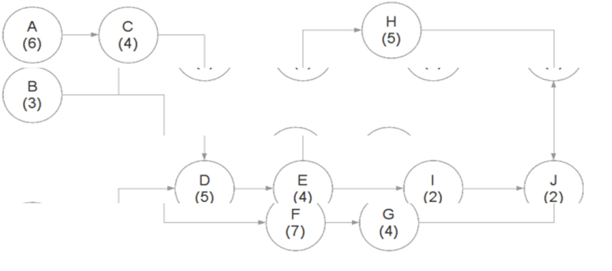

# Práctica 1

PROLOG - Conceptos básicos

1. Teniendo la siguiente base de hechos...
observa(maria,omar).
observa(laura,omar).
observa(maria,flavio).
observa(gabriela,flavio).
observa(maria,carlos).

Ejecutar las siguientes preguntas al Prolog y analizar la respuesta dada en
cada caso.
a. observa(maria,flavio).
b. observa(maria,Quien).
c. observa(maria,_).
d. observa(Quien,flavio).
e. observa(Quien1,Quien2).
f. observa(_,_).

2. Teniendo la siguiente base de hechos, definir una regla que permita
determinar quienes hablan el idioma inglés y francés.
conoce(franco,ingles).
conoce(renzo,ingles).
conoce(franco,frances).
conoce(renzo,frances).
conoce(franco,italiano).
conoce(marco,ingles).
conoce(omar,ingles).
conoce(maria,frances).

3. Escribir un programa Prolog que responda consultas acerca de cuáles son
los rivales de una determinada selección en un campeonato mundial.

Una selección tiene como rivales todos los otros equipos de su mismo
grupo.

Incluir en el programa la siguiente información:
- El grupo 1 está formado por Brasil, España, Jamaica e Italia.
- El grupo 2 está formado por Argentina, Nigeria, Holanda y Escocia.

El programa debe ser capaz de responder a las siguientes consultas:
a) ¿Son rivales Argentina y Brasil?
b) ¿Cuáles son los rivales de un determinado equipo (por ejemplo
Holanda)?

4. Dados los siguientes predicados:
hombre(unHombre).
mujer(unaMujer).
padres(persona, madre, padre).

a. Construya una base de hechos con los miembros de su familia.
b. Defina las siguientes reglas:
- hermana/2, donde hermana(A,B) significa que A es hermana de B.
- nieto/2, donde nieto(A,B) significa que A es el nieto de B.
- abuelo/2, donde abuelo(A,B) significa que A es el abuelo de B.
- tia/2, donde tia(A,B) significa que A es la tía de B. Esta regla
definirla, en una primera instancia, valiéndose sólo de los hechos
disponibles. En una segunda instancia, valiéndose de alguna otra
regla que pudieron haber definido previamente.

5. Dada la siguiente base de hechos:
% auto(patente,propietario)
auto(hti687,pedro).
auto(jug144,juan).
auto(gqm758,pedro).
auto(lod445,carlos).
auto(lfz569,miguel).
auto(axk798,maria).

% deuda(patente, monto adeudado)
deuda(lfz569,2000).
deuda(gqm758,15000).
deuda(axk798,1000).

Escriba una regla que permita determinar si una persona (dato entrada)
tiene algún auto con deuda.

6. Escribir un programa Prolog que ayude a un organizador a armar un
festival, considerando las diferentes bandas de música que se pueden
formar en cada ciudad.

Para formar una banda son necesarios un guitarrista, un cantante y un
baterista. Se dispone de la siguiente información:
- Carolina y José son guitarristas y viven en Rosario.
- Miguel es guitarrista y vive en Funes.
- Mariano es un cantante que vive en Rosario.
- Silvia es una cantante que vive en Funes.
- Eduardo es un baterista que vive en Roldán.
- Diego es un baterista que vive en Casilda.
- Laura es una baterista que vive en Rosario.
- Mauro es cantante y vive en Funes.

El programa debe responder si en una ciudad (dato de entrada), se puede o
no formar una banda.

7. Escribir un programa que simule una calculadora para las operaciones
matemáticas básicas (suma, resta, multiplicación y división) entre dos
valores numéricos, informando el resultado.

8. Dada la siguiente estructura de hechos:

horoscopo(Signo,DiaInicio,MesIni,DiaFin,MesFin).

Por ejemplo:
horoscopo(aries,21,3,20,4).
horoscopo(tauro,21,4,21,5).
horoscopo(geminis,22,5,21,6).

Definir una regla del estilo signo(Dia, Mes, Signo) que permita:

a. Ingresar un signo, día y mes y me informe si es correcto ese signo
para esa fecha.
Ejemplo:
?-signo(3,5,tauro).
?-signo(23,4,aries).

b. Ingresar una fecha (día y mes) y me informe de qué signo soy.
Ejemplo:
?-signo(16,12,Signo).
?-signo(7,4,Signo).

## Recursividad

9. Se tiene la siguiente base de hechos:
hijo(juan,miguel).
hijo(jose,miguel).
hijo(miguel,roberto).
hijo(julio,roberto).
hijo(roberto,carlos).

Donde hijo(X,Y) indica que X es hijo de Y.
Definir la regla descendiente(A,B), la cual permite determinar si A es
descendiente de B.

10. Dada la siguiente red de tareas de un proyecto:

Definir la regla requiere_de(X,Y), la cual permite saber si para la ejecución
de la tarea Y se requiere tener finalizada la tarea X.

11. Hacer un programa para calcular el factorial de un número.
factorial(N,Fact).
- N es el número ingresado (argumento de entrada).
- Fact es el resultado calculado (argumento de salida).

12. Hacer un programa que permita ingresar un número y calcule su
sumatoria, es decir, la suma de sus términos descontados en una unidad
hasta llegar a cero. Por ejemplo, si el número ingresado fuera 5, se deberá
calcular la sumatoria 5+4+3+2+1 e informar como resultado 15.
suma(N,Sum).

- N es el número ingresado (argumento de entrada).
- Sum es el resultado calculado (argumento de salida).

13. Hacer un programa que permita ingresar un número y calcule la
sumatoria de sus términos descontados en una unidad (hasta llegar a cero)
pares e impares.
suma(N,SumPares,SumImpares).

- N es el número ingresado (argumento de entrada).
- SumPares es uno de los resultados calculados (argumento de salida).
- SumImpares es uno de los resultados calculados (argumento de salida).
